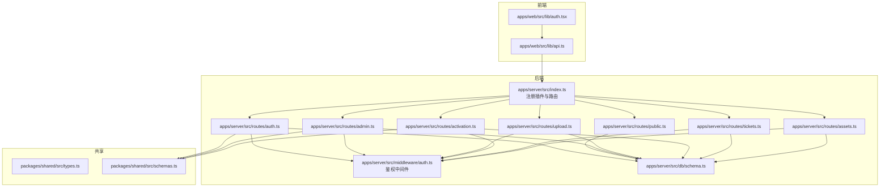
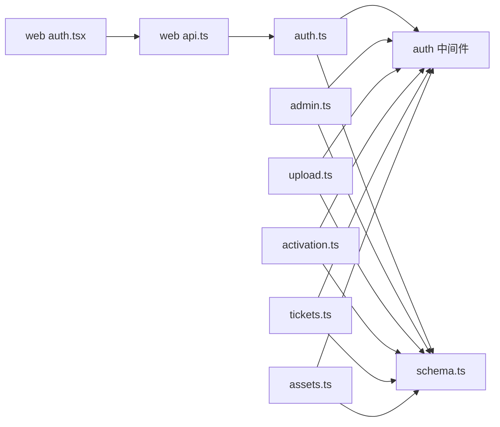

# API接口文档

<cite>
**本文引用的文件**
- [apps/server/src/index.ts](file://apps/server/src/index.ts)
- [apps/server/src/middleware/auth.ts](file://apps/server/src/middleware/auth.ts)
- [apps/server/src/routes/auth.ts](file://apps/server/src/routes/auth.ts)
- [apps/server/src/routes/public.ts](file://apps/server/src/routes/public.ts)
- [apps/server/src/routes/admin.ts](file://apps/server/src/routes/admin.ts)
- [apps/server/src/routes/upload.ts](file://apps/server/src/routes/upload.ts)
- [apps/server/src/routes/activation.ts](file://apps/server/src/routes/activation.ts)
- [apps/server/src/routes/tickets.ts](file://apps/server/src/routes/tickets.ts)
- [apps/server/src/routes/assets.ts](file://apps/server/src/routes/assets.ts)
- [apps/server/src/db/schema.ts](file://apps/server/src/db/schema.ts)
- [packages/shared/src/types.ts](file://packages/shared/src/types.ts)
- [packages/shared/src/schemas.ts](file://packages/shared/src/schemas.ts)
- [apps/web/src/lib/api.ts](file://apps/web/src/lib/api.ts)
- [apps/web/src/lib/auth.tsx](file://apps/web/src/lib/auth.tsx)
- [README.md](file://README.md)
</cite>

## 目录
1. [简介](#简介)
2. [项目结构](#项目结构)
3. [核心组件](#核心组件)
4. [架构总览](#架构总览)
5. [详细组件分析](#详细组件分析)
6. [依赖关系分析](#依赖关系分析)
7. [性能考量](#性能考量)
8. [故障排查指南](#故障排查指南)
9. [结论](#结论)
10. [附录](#附录)

## 简介
本文件为 ZBH2 平台的完整 API 接口文档，覆盖认证、公共、管理员、文件上传、激活、工单、资产管理等接口组。文档详细说明各 RESTful 端点的 HTTP 方法、URL 模式、请求参数、响应格式、认证与权限控制、错误码与处理策略，并提供请求/响应示例与客户端集成指南。

## 项目结构
后端采用 Fastify + Drizzle ORM，路由按功能分组注册；前端使用 React + Axios，通过 /api 前缀访问后端。共享类型与校验规则位于 packages/shared。



**图表来源**
- [apps/server/src/index.ts:1-60](file://apps/server/src/index.ts#L1-L60)
- [apps/server/src/middleware/auth.ts:1-56](file://apps/server/src/middleware/auth.ts#L1-L56)
- [apps/server/src/routes/auth.ts:1-51](file://apps/server/src/routes/auth.ts#L1-L51)
- [apps/server/src/routes/public.ts:1-52](file://apps/server/src/routes/public.ts#L1-L52)
- [apps/server/src/routes/admin.ts:1-279](file://apps/server/src/routes/admin.ts#L1-L279)
- [apps/server/src/routes/upload.ts:1-63](file://apps/server/src/routes/upload.ts#L1-L63)
- [apps/server/src/routes/activation.ts:1-95](file://apps/server/src/routes/activation.ts#L1-L95)
- [apps/server/src/routes/tickets.ts:1-137](file://apps/server/src/routes/tickets.ts#L1-L137)
- [apps/server/src/routes/assets.ts:1-165](file://apps/server/src/routes/assets.ts#L1-L165)
- [apps/server/src/db/schema.ts:1-330](file://apps/server/src/db/schema.ts#L1-L330)
- [apps/web/src/lib/api.ts:1-16](file://apps/web/src/lib/api.ts#L1-L16)
- [apps/web/src/lib/auth.tsx:1-55](file://apps/web/src/lib/auth.tsx#L1-L55)
- [packages/shared/src/types.ts:1-18](file://packages/shared/src/types.ts#L1-L18)
- [packages/shared/src/schemas.ts:1-51](file://packages/shared/src/schemas.ts#L1-L51)

**章节来源**
- [apps/server/src/index.ts:1-60](file://apps/server/src/index.ts#L1-L60)
- [README.md:1-121](file://README.md#L1-L121)

## 核心组件
- 会话与鉴权
  - 使用 httpOnly Cookie 存储 sid，有效期 7 天；登录成功设置 Cookie，退出清除。
  - 提供 requireAuth 与 requireAdmin 中间件，分别用于普通用户与管理员权限校验。
- 数据模型
  - 用户、会话、软件、帮助、激活产品与码、工单、资产、监控、审计日志等。
- 共享校验
  - 使用 Zod 定义登录、创建用户、软件/帮助条目、激活产品、激活码申领等输入校验规则。
- 响应格式
  - 统一响应体包含 success、data、error 字段；分页接口返回 items、total、page、pageSize。

**章节来源**
- [apps/server/src/middleware/auth.ts:1-56](file://apps/server/src/middleware/auth.ts#L1-L56)
- [apps/server/src/db/schema.ts:1-330](file://apps/server/src/db/schema.ts#L1-L330)
- [packages/shared/src/types.ts:1-18](file://packages/shared/src/types.ts#L1-L18)
- [packages/shared/src/schemas.ts:1-51](file://packages/shared/src/schemas.ts#L1-L51)

## 架构总览
后端通过 Fastify 注册安全、CORS、Cookie、限流、静态文件等插件，随后挂载各路由模块。前端通过 Axios 发送带凭据的请求，自动携带 Cookie 实现会话保持。

```mermaid
sequenceDiagram
participant C as "客户端"
participant F as "Fastify 服务器"
participant MW as "鉴权中间件"
participant R as "路由处理器"
participant DB as "Drizzle ORM/SQLite"
C->>F : "POST /api/auth/login"
F->>MW : "loadSession/preHandler"
MW-->>F : "注入 request.sessionUser"
F->>R : "调用 auth.login"
R->>DB : "查询用户/校验密码"
DB-->>R : "返回用户信息"
R->>DB : "写入会话记录"
R-->>C : "{success : true,data : {id,username,role}}"
R-->>C : "Set-Cookie : sid=...; HttpOnly; SameSite=Lax"
```

**图表来源**
- [apps/server/src/index.ts:27-54](file://apps/server/src/index.ts#L27-L54)
- [apps/server/src/middleware/auth.ts:17-40](file://apps/server/src/middleware/auth.ts#L17-L40)
- [apps/server/src/routes/auth.ts:9-33](file://apps/server/src/routes/auth.ts#L9-L33)

**章节来源**
- [apps/server/src/index.ts:27-54](file://apps/server/src/index.ts#L27-L54)
- [apps/web/src/lib/api.ts:1-16](file://apps/web/src/lib/api.ts#L1-L16)

## 详细组件分析

### 认证 API（/api/auth）
- 端点与方法
  - POST /api/auth/login
    - 功能：用户登录，校验用户名与密码，创建会话并设置 Cookie。
    - 请求体：username、password（长度与范围见共享校验）。
    - 成功响应：{ success: true, data: { id, username, role } }。
    - 失败响应：400 参数无效；401 用户名或密码错误。
  - POST /api/auth/logout
    - 功能：清理当前会话并清除 Cookie。
    - 成功响应：{ success: true }。
  - GET /api/auth/me
    - 功能：获取当前登录用户信息。
    - 成功响应：{ success: true, data: { id, username, role } | null }。

- 认证与权限
  - 依赖 Cookie sid；会话过期时间 7 天。
  - 仅登录用户可访问 me。

- 错误码与处理
  - 400：参数校验失败。
  - 401：未认证或凭证无效。
  - 403：管理员接口未授权（由 requireAdmin 触发）。

- 请求/响应示例
  - 登录成功
    - 请求：POST /api/auth/login，Body: { username, password }
    - 响应：200，Body: { success: true, data: { id, username, role } }
  - 登录失败（密码错误）
    - 请求：POST /api/auth/login，Body: { username, password }
    - 响应：401，Body: { success: false, error: "用户名或密码错误" }

**章节来源**
- [apps/server/src/routes/auth.ts:9-49](file://apps/server/src/routes/auth.ts#L9-L49)
- [packages/shared/src/schemas.ts:3-6](file://packages/shared/src/schemas.ts#L3-L6)
- [apps/server/src/middleware/auth.ts:42-55](file://apps/server/src/middleware/auth.ts#L42-L55)

### 公共 API（/api/public）
- 端点与方法
  - GET /api/public/software
    - 功能：获取软件分类树，仅包含已发布条目。
    - 成功响应：{ success: true, data: [{ ..., items: [...] }] }。
  - GET /api/public/software/:id
    - 功能：获取指定软件详情（仅已发布）。
    - 成功响应：{ success: true, data: 条目对象 }。
    - 失败响应：404 未找到。
  - GET /api/public/help
    - 功能：获取帮助分类树，仅包含已发布文档。
    - 成功响应：{ success: true, data: [{ ..., documents: [...] }] }。
  - GET /api/public/help/:id
    - 功能：获取指定帮助文档（仅已发布）。
    - 成功响应：{ success: true, data: 文档对象 }。
    - 失败响应：404 未找到。
  - GET /api/public/activation-products
    - 功能：公开列出激活产品。
    - 成功响应：{ success: true, data: 产品数组 }。

- 数据模型
  - 软件分类/条目、帮助分类/文档、激活产品。

- 请求/响应示例
  - 获取软件分类树
    - 请求：GET /api/public/software
    - 响应：200，Body: { success: true, data: [...] }

**章节来源**
- [apps/server/src/routes/public.ts:7-51](file://apps/server/src/routes/public.ts#L7-L51)
- [apps/server/src/db/schema.ts:19-119](file://apps/server/src/db/schema.ts#L19-L119)

### 管理员 API（/api/admin）
- 通用规则
  - 所有端点均需管理员权限（requireAdmin）。
  - 输入参数多采用共享 Zod 校验，失败返回 400。

- 软件管理
  - GET /api/admin/software-categories
    - 返回：分类列表（按 sort 升序）。
  - POST /api/admin/software-categories
    - 请求体：name、sort。
    - 返回：新增分类。
  - PUT /api/admin/software-categories/:id
    - 请求体：name、sort。
    - 返回：{ success: true }。
  - DELETE /api/admin/software-categories/:id
    - 返回：{ success: true }。
  - GET /api/admin/software-items
    - 返回：条目列表（按 sort 升序）。
  - POST /api/admin/software-items
    - 请求体：title、description、categoryId、version、fileId、iconFileId、sort、status。
    - 返回：新增条目。
  - PUT /api/admin/software-items/:id
    - 支持部分字段更新：title/description/categoryId/version/fileId/iconFileId/sort/status。
    - 返回：{ success: true }。
  - DELETE /api/admin/software-items/:id
    - 返回：{ success: true }。

- 帮助管理
  - GET /api/admin/help-categories
    - 返回：分类列表（按 sort 升序）。
  - POST /api/admin/help-categories
    - 请求体：name、sort。
    - 返回：新增分类。
  - PUT /api/admin/help-categories/:id
    - 请求体：name、sort。
    - 返回：{ success: true }。
  - DELETE /api/admin/help-categories/:id
    - 返回：{ success: true }。
  - GET /api/admin/help-documents
    - 返回：文档列表（按 createdAt 降序）。
  - POST /api/admin/help-documents
    - 请求体：title、body、categoryId、sort、status。
    - 若 status 为 published，则写入 publishedAt。
    - 返回：新增文档。
  - PUT /api/admin/help-documents/:id
    - 支持部分字段更新：title/body/categoryId/sort/status。
    - 若 status 变更为 published 写入 publishedAt；若为 archived 写入 archivedAt。
    - 返回：{ success: true }。
  - DELETE /api/admin/help-documents/:id
    - 返回：{ success: true }。

- 激活产品与码
  - GET /api/admin/activation-products
    - 返回：产品列表。
  - POST /api/admin/activation-products
    - 请求体：code、name、description、clientDownloadUrl。
    - 返回：新增产品。
  - PUT /api/admin/activation-products/:id
    - 支持字段：code/name/description/clientDownloadUrl/clientFileId。
    - 返回：{ success: true }。
  - GET /api/admin/activation-codes
    - 查询参数：productId、page、pageSize（限制 1-100）。
    - 返回：分页结果 { items, total, page, pageSize }。
  - POST /api/admin/activation-codes/import
    - 请求体：productId、codes[]（6 位字符串）。
    - 返回：{ success: true, data: { imported, batchId } }。
  - GET /api/admin/activation-grants
    - 返回：发放记录（含 code6、username、productName）。

- 用户管理
  - GET /api/admin/users
    - 返回：用户列表（含 id/username/role/status/createdAt）。
  - POST /api/admin/users
    - 请求体：username、password、role。
    - 返回：新建用户（不包含密码）。
  - PUT /api/admin/users/:id
    - 支持字段：role/status/password（≥6）。
    - 返回：{ success: true }。
  - DELETE /api/admin/users/:id
    - 返回：{ success: true }。
    - 特殊：禁止删除当前登录用户。

- 文件管理
  - GET /api/admin/files
    - 返回：文件列表（按 createdAt 降序）。

- 请求/响应示例
  - 创建软件条目
    - 请求：POST /api/admin/software-items，Body: { title, description, categoryId, version, fileId, iconFileId, sort, status }
    - 响应：200，Body: { success: true, data: 新增条目 }

**章节来源**
- [apps/server/src/routes/admin.ts:19-278](file://apps/server/src/routes/admin.ts#L19-L278)
- [packages/shared/src/schemas.ts:14-50](file://packages/shared/src/schemas.ts#L14-L50)
- [apps/server/src/middleware/auth.ts:48-55](file://apps/server/src/middleware/auth.ts#L48-L55)

### 文件上传 API（/api/admin/upload 与 /api/public/download）
- 管理员上传（/api/admin/upload）
  - 方法：POST，需管理员权限。
  - 请求：multipart/form-data，字段 file。
  - 行为：计算 SHA-256，保存到 data/uploads，记录文件元数据（originalName、storagePath、mime、size、hash、uploaderId）。
  - 成功响应：{ success: true, data: 文件记录 }。
  - 失败响应：400 未提供文件；403 未授权。
- 公共下载（/api/public/download/:fileId）
  - 方法：GET。
  - 行为：根据 fileId 查找文件，设置 Content-Disposition 与 Content-Type，返回文件流。
  - 成功响应：200 文件流。
  - 失败响应：404 文件不存在。

- 请求/响应示例
  - 上传文件
    - 请求：POST /api/admin/upload，Headers: Content-Type: multipart/form-data，Body: file=<二进制>
    - 响应：200，Body: { success: true, data: { id, originalName, storagePath, mime, size, hash, uploaderId, createdAt } }
  - 下载文件
    - 请求：GET /api/public/download/:fileId
    - 响应：200 文件流

**章节来源**
- [apps/server/src/routes/upload.ts:15-61](file://apps/server/src/routes/upload.ts#L15-L61)
- [apps/server/src/db/schema.ts:26-35](file://apps/server/src/db/schema.ts#L26-L35)

### 激活 API（/api/me/activation-codes）
- 申领激活码（POST /api/me/activation-codes/claim）
  - 方法：POST，需登录。
  - 请求体：productId（正整数）。
  - 行为：幂等检查（同一用户对同一产品只允许一次有效申领），查找可用 6 位码，更新状态为 granted，写入发放记录。
  - 成功响应：{ success: true, data: { code6, alreadyClaimed: boolean } }。
  - 失败响应：400 参数无效；404 产品不存在；409 无可领取码。
- 我的激活码（GET /api/me/activation-codes）
  - 方法：GET，需登录。
  - 行为：返回该用户的所有激活码发放记录。
  - 成功响应：{ success: true, data: 列表[{ id, code6, productName, productCode, grantedAt }] }。

- 请求/响应示例
  - 申领成功（首次）
    - 请求：POST /api/me/activation-codes/claim，Body: { productId }
    - 响应：200，Body: { success: true, data: { code6: "XXXXXX", alreadyClaimed: false } }
  - 重复申领
    - 请求：POST /api/me/activation-codes/claim，Body: { productId }
    - 响应：200，Body: { success: true, data: { code6: "XXXXXX", alreadyClaimed: true } }

**章节来源**
- [apps/server/src/routes/activation.ts:8-94](file://apps/server/src/routes/activation.ts#L8-L94)
- [packages/shared/src/schemas.ts:48-50](file://packages/shared/src/schemas.ts#L48-L50)
- [apps/server/src/middleware/auth.ts:42-46](file://apps/server/src/middleware/auth.ts#L42-L46)

### 工单 API（/api/me 与 /api/admin）
- 用户侧
  - POST /api/me/tickets
    - 请求体：title（必填）、description、type、priority。
    - 返回：新建工单。
  - GET /api/me/tickets
    - 返回：当前用户提交的工单列表（按创建时间倒序）。
  - GET /api/me/tickets/:id
    - 返回：工单详情及回复列表。
  - POST /api/me/tickets/:id/reply
    - 请求体：content（必填）。
    - 返回：新回复记录。
- 管理侧
  - GET /api/admin/tickets
    - 查询参数：status。
    - 返回：全部或按状态筛选的工单列表（含提交人用户名）。
  - GET /api/admin/tickets/:id
    - 返回：工单详情及回复列表。
  - PUT /api/admin/tickets/:id
    - 请求体：status、assigneeId。
    - 行为：更新时间戳；当 status 设为 resolved 时写入 resolvedAt。
    - 返回：{ success: true }。
  - POST /api/admin/tickets/:id/reply
    - 请求体：content（必填）。
    - 返回：新回复记录，并更新工单更新时间。

- 请求/响应示例
  - 提交工单
    - 请求：POST /api/me/tickets，Body: { title, description, type, priority }
    - 响应：200，Body: { success: true, data: 新工单 }

**章节来源**
- [apps/server/src/routes/tickets.ts:8-136](file://apps/server/src/routes/tickets.ts#L8-L136)
- [apps/server/src/middleware/auth.ts:42-55](file://apps/server/src/middleware/auth.ts#L42-L55)

### 资产管理 API（/api/admin/assets、/api/admin/asset-categories、/api/admin/asset-records、/api/admin/asset-approvals、/api/admin/asset-stats）
- 资产分类
  - GET/POST/PUT/DELETE：对资产分类进行 CRUD。
- 资产 CRUD
  - GET /api/admin/assets
  - POST /api/admin/assets：支持字段较多（名称、品牌、型号、序列号、状态、采购日期/价格、保修期、位置、备注等）。
  - PUT /api/admin/assets/:id：支持部分字段更新。
  - DELETE /api/admin/assets/:id
- 资产操作
  - POST /api/admin/assets/:id/operate
    - 请求体：action（check_out/check_in/maintenance/return/retire/scrap）、targetUserId（可选）、notes（可选）。
    - 行为：写入资产记录，按 action 更新状态与经手人。
    - 返回：{ success: true }。
- 资产记录
  - GET /api/admin/asset-records
    - 查询参数：assetId。
    - 返回：记录列表（按时间倒序）。
- 资产审批
  - GET /api/admin/asset-approvals
  - POST /api/admin/asset-approvals：type（check_out/return/scrap）、reason。
  - PUT /api/admin/asset-approvals/:id：status、comment。
- 资产统计
  - GET /api/admin/asset-stats
    - 返回：总数、按状态计数、按分类计数（以分类名映射）、总价值。

- 请求/响应示例
  - 资产出库
    - 请求：POST /api/admin/assets/:id/operate，Body: { action: "check_out", targetUserId: 123, notes: "..." }
    - 响应：200，Body: { success: true }

**章节来源**
- [apps/server/src/routes/assets.ts:10-164](file://apps/server/src/routes/assets.ts#L10-L164)
- [apps/server/src/middleware/auth.ts:48-55](file://apps/server/src/middleware/auth.ts#L48-L55)

### 其他路由（/api/public/activation-products）
- GET /api/public/activation-products
  - 返回：激活产品列表（公开）。

**章节来源**
- [apps/server/src/routes/public.ts:47-50](file://apps/server/src/routes/public.ts#L47-L50)

## 依赖关系分析
- 组件耦合
  - 路由层依赖中间件实现鉴权，依赖共享 Zod 校验，依赖数据库 schema。
  - 前端通过 Axios 与后端交互，自动携带 Cookie。
- 外部依赖
  - Fastify 插件：helmet、cors、cookie、multipart、rateLimit、static。
  - 加密：argon2 用于密码哈希；crypto 用于文件哈希。
- 循环依赖
  - 未发现循环依赖迹象。



**图表来源**
- [apps/server/src/routes/auth.ts:1-51](file://apps/server/src/routes/auth.ts#L1-L51)
- [apps/server/src/routes/admin.ts:1-279](file://apps/server/src/routes/admin.ts#L1-L279)
- [apps/server/src/routes/upload.ts:1-63](file://apps/server/src/routes/upload.ts#L1-L63)
- [apps/server/src/routes/activation.ts:1-95](file://apps/server/src/routes/activation.ts#L1-L95)
- [apps/server/src/routes/tickets.ts:1-137](file://apps/server/src/routes/tickets.ts#L1-L137)
- [apps/server/src/routes/assets.ts:1-165](file://apps/server/src/routes/assets.ts#L1-L165)
- [apps/server/src/db/schema.ts:1-330](file://apps/server/src/db/schema.ts#L1-L330)
- [apps/web/src/lib/api.ts:1-16](file://apps/web/src/lib/api.ts#L1-L16)
- [apps/web/src/lib/auth.tsx:1-55](file://apps/web/src/lib/auth.tsx#L1-L55)

**章节来源**
- [apps/server/src/index.ts:27-54](file://apps/server/src/index.ts#L27-L54)

## 性能考量
- 速率限制：每分钟最多 200 次请求。
- 文件上传：单文件大小限制 500MB；上传时边读取边写入磁盘并计算哈希。
- 查询优化：分页参数限制最大 100/页；部分列表按索引列排序。
- 缓存：未实现应用层缓存；静态文件通过 fastify-static 提供。

**章节来源**
- [apps/server/src/index.ts:33-34](file://apps/server/src/index.ts#L33-L34)
- [apps/server/src/routes/upload.ts:16-37](file://apps/server/src/routes/upload.ts#L16-L37)
- [apps/server/src/routes/admin.ts:162-175](file://apps/server/src/routes/admin.ts#L162-L175)

## 故障排查指南
- 400 参数校验失败
  - 检查请求体是否符合共享 Zod 校验规则；参考共享 schemas。
- 401 未认证
  - 确认 Cookie 中是否存在 sid；登录后是否正确设置 Cookie。
- 403 权限不足
  - 确认当前用户角色为 admin；非管理员访问 /api/admin* 将被拒绝。
- 404 资源不存在
  - 检查 ID 是否正确；某些资源仅对已发布状态可见。
- 409 冲突
  - 如激活码申领无可用码；用户创建时用户名冲突。
- 日志与审计
  - 审计日志表记录用户行为与结果，可用于问题追踪。

**章节来源**
- [apps/server/src/middleware/auth.ts:42-55](file://apps/server/src/middleware/auth.ts#L42-L55)
- [apps/server/src/routes/admin.ts:240-241](file://apps/server/src/routes/admin.ts#L240-L241)
- [apps/server/src/routes/activation.ts:55-57](file://apps/server/src/routes/activation.ts#L55-L57)
- [apps/server/src/db/schema.ts:301-314](file://apps/server/src/db/schema.ts#L301-L314)

## 结论
本 API 文档覆盖了 ZBH2 平台的主要接口，提供了统一的响应格式、明确的认证与权限控制、完善的错误处理策略。建议客户端遵循 Cookie 会话机制，严格遵守参数校验与分页限制，并在生产环境加强安全配置（如 HTTPS、CSP 等）。

## 附录

### 响应体规范
- 统一结构
  - success: boolean
  - data: any（可选）
  - error: string（可选）

- 分页结构
  - items: T[]
  - total: number
  - page: number
  - pageSize: number

**章节来源**
- [packages/shared/src/types.ts:6-17](file://packages/shared/src/types.ts#L6-L17)

### 客户端集成指南
- 基础配置
  - 使用 Axios 创建实例，baseURL 为 /api，withCredentials: true。
  - 自动携带 Cookie，无需手动处理会话。
- 登录流程
  - 调用 /api/auth/login，成功后自动设置 sid。
  - 使用 /api/auth/me 获取当前用户信息。
- 权限控制
  - 对需要登录的页面，在进入前调用刷新接口；对管理员接口，确保用户角色为 admin。
- 错误处理
  - 401 且非登录页时，可触发跳转至登录页。
- 示例
  - 登录
    - POST /api/auth/login
    - 成功：设置 Cookie，返回用户信息
  - 获取软件分类树
    - GET /api/public/software

**章节来源**
- [apps/web/src/lib/api.ts:1-16](file://apps/web/src/lib/api.ts#L1-L16)
- [apps/web/src/lib/auth.tsx:24-45](file://apps/web/src/lib/auth.tsx#L24-L45)
- [apps/server/src/routes/auth.ts:9-49](file://apps/server/src/routes/auth.ts#L9-L49)

### 安全与合规建议
- 强制 HTTPS 传输，避免明文 Cookie。
- 启用 CSP、X-Frame-Options、X-Content-Type-Options 等安全头。
- 限制上传文件类型与大小，定期扫描恶意文件。
- 审计日志记录关键操作，便于追溯。

**章节来源**
- [apps/server/src/index.ts:30-31](file://apps/server/src/index.ts#L30-L31)
- [apps/server/src/db/schema.ts:301-314](file://apps/server/src/db/schema.ts#L301-L314)