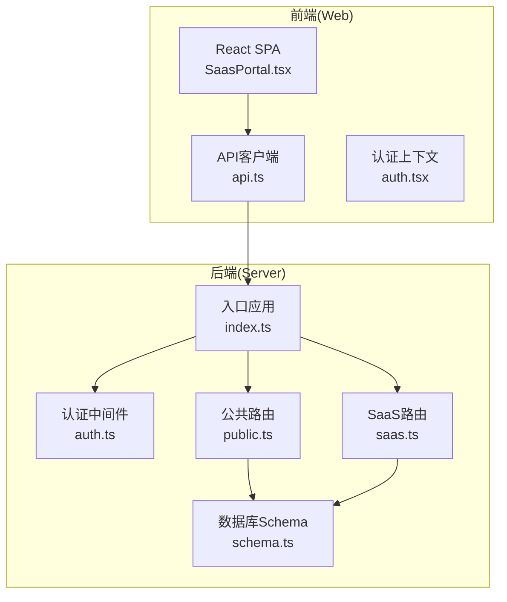
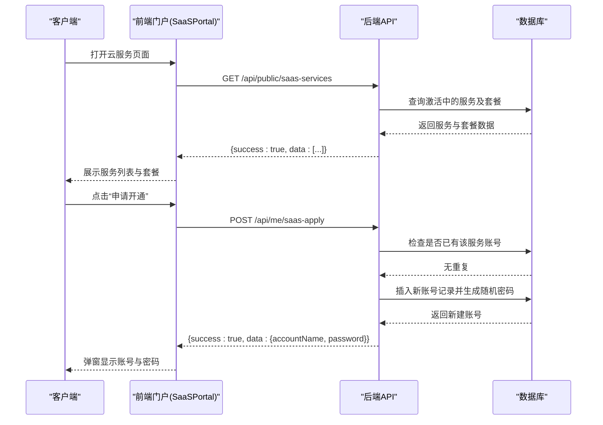
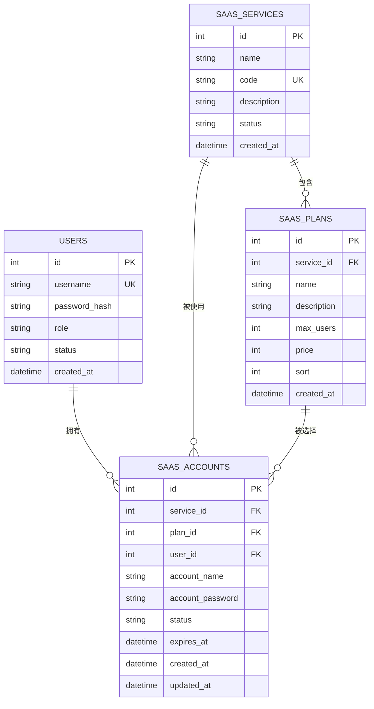
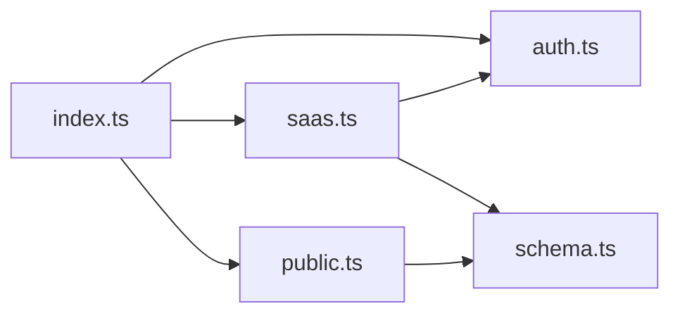

# SaaS公共接口

<cite>
**本文档引用的文件**
- [apps/server/src/routes/public.ts](file://apps/server/src/routes/public.ts)
- [apps/server/src/routes/saas.ts](file://apps/server/src/routes/saas.ts)
- [apps/server/src/db/schema.ts](file://apps/server/src/db/schema.ts)
- [apps/server/src/middleware/auth.ts](file://apps/server/src/middleware/auth.ts)
- [apps/server/src/index.ts](file://apps/server/src/index.ts)
- [apps/web/src/pages/SaasPortal.tsx](file://apps/web/src/pages/SaasPortal.tsx)
- [apps/web/src/lib/api.ts](file://apps/web/src/lib/api.ts)
- [apps/web/src/lib/auth.tsx](file://apps/web/src/lib/auth.tsx)
- [README.md](file://README.md)
</cite>

## 目录
1. [简介](#简介)
2. [项目结构](#项目结构)
3. [核心组件](#核心组件)
4. [架构总览](#架构总览)
5. [详细组件分析](#详细组件分析)
6. [依赖关系分析](#依赖关系分析)
7. [性能考量](#性能考量)
8. [故障排查指南](#故障排查指南)
9. [结论](#结论)
10. [附录](#附录)

## 简介
本文件为ZBH2平台的SaaS公共接口API文档，重点覆盖面向公众的服务展示接口与用户自助申请接口。内容包括：
- 公开服务列表获取与服务详情展示逻辑
- 用户自助申请SaaS账户的完整流程（含重复申请检查、自动密码生成、账户创建）
- 接口调用示例（请求/响应格式）
- 安全考虑与用户体验优化建议

## 项目结构
后端采用Fastify + Drizzle ORM + SQLite架构；前端使用React + Ant Design。SaaS相关功能位于后端路由模块与数据库Schema中，前端通过API客户端进行调用。

图表来源
- [apps/server/src/index.ts:29-54](file://apps/server/src/index.ts#L29-L54)
- [apps/server/src/routes/public.ts:5-51](file://apps/server/src/routes/public.ts#L5-L51)
- [apps/server/src/routes/saas.ts:14-159](file://apps/server/src/routes/saas.ts#L14-L159)
- [apps/server/src/db/schema.ts:171-203](file://apps/server/src/db/schema.ts#L171-L203)

章节来源
- [apps/server/src/index.ts:1-60](file://apps/server/src/index.ts#L1-L60)
- [README.md:47-68](file://README.md#L47-L68)

## 核心组件
- 公共路由模块：提供软件分类与帮助文档的公开浏览接口，以及激活产品的公开列表接口。
- SaaS路由模块：提供SaaS服务与套餐的公开列表、用户自助申请、个人账户查询等接口。
- 认证中间件：负责加载会话、鉴权与权限控制。
- 数据库Schema：定义saas_services、saas_plans、saas_accounts等核心表结构。
- 前端门户：SaasPortal页面负责展示服务列表、发起申请、展示个人账户。

章节来源
- [apps/server/src/routes/public.ts:5-51](file://apps/server/src/routes/public.ts#L5-L51)
- [apps/server/src/routes/saas.ts:14-159](file://apps/server/src/routes/saas.ts#L14-L159)
- [apps/server/src/middleware/auth.ts:17-55](file://apps/server/src/middleware/auth.ts#L17-L55)
- [apps/server/src/db/schema.ts:171-203](file://apps/server/src/db/schema.ts#L171-L203)
- [apps/web/src/pages/SaasPortal.tsx:18-96](file://apps/web/src/pages/SaasPortal.tsx#L18-L96)

## 架构总览
SaaS公共接口遵循REST风格，采用JSON响应格式，统一返回结构包含success字段与data或error字段。认证采用Cookie会话机制，用户登录后可进行自助申请与查询。

图表来源
- [apps/server/src/routes/saas.ts:122-146](file://apps/server/src/routes/saas.ts#L122-L146)
- [apps/web/src/pages/SaasPortal.tsx:31-40](file://apps/web/src/pages/SaasPortal.tsx#L31-L40)

## 详细组件分析

### 公共接口：软件与帮助文档浏览
- 获取公开软件分类与已发布软件项树形结构
  - 方法：GET
  - 路径：/api/public/software
  - 响应：success + data（数组，每个元素包含分类及其items）
- 获取指定软件详情（仅published状态）
  - 方法：GET
  - 路径：/api/public/software/:id
  - 响应：success + data 或 404错误
- 获取公开帮助分类与已发布文档树形结构
  - 方法：GET
  - 路径：/api/public/help
  - 响应：success + data（数组，每个元素包含分类及其documents）
- 获取指定帮助文档详情（仅published状态）
  - 方法：GET
  - 路径：/api/public/help/:id
  - 响应：success + data 或 404错误
- 获取激活产品公开列表
  - 方法：GET
  - 路径：/api/public/activation-products
  - 响应：success + data（产品数组）

章节来源
- [apps/server/src/routes/public.ts:7-50](file://apps/server/src/routes/public.ts#L7-L50)

### 公共接口：SaaS服务公开列表
- 获取激活中的SaaS服务与套餐
  - 方法：GET
  - 路径：/api/public/saas-services
  - 响应：success + data（数组，每个元素包含服务及其plans）

章节来源
- [apps/server/src/routes/saas.ts:122-130](file://apps/server/src/routes/saas.ts#L122-L130)

### 用户自助申请接口
- 申请SaaS账户
  - 方法：POST
  - 路径：/api/me/saas-apply
  - 鉴权：需要登录
  - 请求体字段：
    - serviceId: number（必填）
    - planId: number（可选）
  - 业务逻辑：
    - 检查当前用户是否已拥有该服务的账号（避免重复申请）
    - 自动生成12位复杂密码（字母数字+特殊字符）
    - 创建saas_accounts记录，状态为active
  - 响应：success + data（包含accountName与password）
  - 错误：
    - 401 未登录
    - 409 已拥有该服务账号

- 查询个人SaaS账户
  - 方法：GET
  - 路径：/api/me/saas-accounts
  - 鉴权：需要登录
  - 响应：success + data（数组，包含服务名称、套餐名称、账号、状态、创建时间）

章节来源
- [apps/server/src/routes/saas.ts:132-158](file://apps/server/src/routes/saas.ts#L132-L158)
- [apps/server/src/middleware/auth.ts:42-55](file://apps/server/src/middleware/auth.ts#L42-L55)

### 数据模型与关系
SaaS相关的核心表结构如下：

图表来源
- [apps/server/src/db/schema.ts:171-203](file://apps/server/src/db/schema.ts#L171-L203)

章节来源
- [apps/server/src/db/schema.ts:171-203](file://apps/server/src/db/schema.ts#L171-L203)

### 前端集成与用户体验
- 前端通过API客户端统一访问后端接口，基础URL为/api，启用withCredentials以携带Cookie。
- SaasPortal页面：
  - 加载公开SaaS服务列表
  - 登录状态下加载个人账户列表
  - 申请成功后弹窗显示账号与密码，并刷新个人账户列表
  - 未登录时跳转登录页

章节来源
- [apps/web/src/lib/api.ts:3-16](file://apps/web/src/lib/api.ts#L3-L16)
- [apps/web/src/pages/SaasPortal.tsx:26-40](file://apps/web/src/pages/SaasPortal.tsx#L26-L40)

## 依赖关系分析
- 应用启动时注册认证中间件与各路由模块，SaaS路由在其中。
- SaaS路由依赖认证中间件进行鉴权，依赖数据库Schema进行数据读写。
- 前端通过API客户端与后端交互，后端通过Drizzle ORM访问SQLite。

图表来源
- [apps/server/src/index.ts:37-49](file://apps/server/src/index.ts#L37-L49)
- [apps/server/src/routes/saas.ts:1-6](file://apps/server/src/routes/saas.ts#L1-L6)
- [apps/server/src/routes/public.ts:1-4](file://apps/server/src/routes/public.ts#L1-L4)

章节来源
- [apps/server/src/index.ts:29-54](file://apps/server/src/index.ts#L29-L54)

## 性能考量
- 数据查询：服务与套餐列表查询为轻量级，建议在前端缓存短期有效数据，减少重复请求。
- 速率限制：后端启用了速率限制中间件，避免恶意刷取。
- 数据库索引：建议对常用查询字段（如saas_services.status、saas_accounts.userId/serviceId）建立索引以提升查询效率。
- 前端渲染：服务卡片与表格渲染较为简单，注意在大数据量时分页或虚拟滚动优化。

## 故障排查指南
- 401 未登录
  - 现象：访问需要登录的接口返回未登录
  - 处理：引导用户登录后再试
  - 参考：[apps/server/src/middleware/auth.ts:42-46](file://apps/server/src/middleware/auth.ts#L42-L46)

- 403 权限不足
  - 现象：非管理员访问管理接口
  - 处理：确认用户角色为管理员
  - 参考：[apps/server/src/middleware/auth.ts:48-55](file://apps/server/src/middleware/auth.ts#L48-L55)

- 404 资源不存在
  - 现象：访问不存在的软件或帮助文档
  - 处理：提示资源不存在并引导返回列表
  - 参考：[apps/server/src/routes/public.ts:17-24](file://apps/server/src/routes/public.ts#L17-L24)

- 409 重复申请
  - 现象：同一用户重复申请同一服务
  - 处理：提示已拥有该服务账号，无需重复申请
  - 参考：[apps/server/src/routes/saas.ts:135-137](file://apps/server/src/routes/saas.ts#L135-L137)

- 5xx 服务器内部错误
  - 现象：数据库异常或代码异常
  - 处理：查看后端日志，检查数据库连接与Schema一致性
  - 参考：[apps/server/src/index.ts:56-59](file://apps/server/src/index.ts#L56-L59)

## 结论
SaaS公共接口提供了简洁清晰的服务展示与自助申请能力，结合会话认证与速率限制，满足了公众浏览与用户自助使用的场景需求。建议在生产环境中进一步完善前端缓存策略、数据库索引与日志监控，以提升整体性能与可观测性。

## 附录

### 接口调用示例

- 获取公开SaaS服务列表
  - 请求
    - 方法：GET
    - 路径：/api/public/saas-services
  - 响应
    - 成功示例：{ "success": true, "data": [ { "id": 1, "name": "服务A", "code": "SA", "description": "描述A", "plans": [ { "id": 1, "name": "套餐A", "description": "描述A" } ] } ] }

- 用户申请SaaS账户
  - 请求
    - 方法：POST
    - 路径：/api/me/saas-apply
    - 请求体：{ "serviceId": 1, "planId": 1 }
  - 响应
    - 成功示例：{ "success": true, "data": { "accountName": "用户名", "password": "生成的12位密码" } }
  - 错误示例（重复申请）：{ "success": false, "error": "您已拥有该服务的账号" }

- 查询个人SaaS账户
  - 请求
    - 方法：GET
    - 路径：/api/me/saas-accounts
  - 响应
    - 成功示例：{ "success": true, "data": [ { "id": 1, "accountName": "用户名", "status": "active", "serviceName": "服务A", "planName": "套餐A", "createdAt": "2024-01-01T00:00:00Z" } ] }

- 获取公开软件列表
  - 请求
    - 方法：GET
    - 路径：/api/public/software
  - 响应
    - 成功示例：{ "success": true, "data": [ { "id": 1, "name": "分类A", "sort": 1, "items": [ { "id": 1, "title": "软件A", "status": "published" } ] } ] }

- 获取帮助文档列表
  - 请求
    - 方法：GET
    - 路径：/api/public/help
  - 响应
    - 成功示例：{ "success": true, "data": [ { "id": 1, "name": "分类A", "sort": 1, "documents": [ { "id": 1, "title": "文档A", "status": "published" } ] } ] }

### 安全考虑与最佳实践
- 传输安全：建议在生产环境启用HTTPS，避免密码明文泄露。
- 会话安全：Cookie应设置HttpOnly与SameSite策略，防止XSS与CSRF攻击。
- 输入校验：后端应对serviceId、planId等参数进行严格校验与范围检查。
- 速率限制：已内置速率限制，建议根据实际流量调整阈值。
- 密码保护：前端弹窗显示密码后应提醒用户妥善保存，避免截图或明文记录。
- 日志审计：对敏感操作（如账户创建、密码重置）进行审计日志记录。