# SaaS套餐管理

<cite>
**本文档引用的文件**
- [apps/server/src/routes/saas.ts](file://apps/server/src/routes/saas.ts)
- [apps/server/src/db/schema.ts](file://apps/server/src/db/schema.ts)
- [apps/server/src/middleware/auth.ts](file://apps/server/src/middleware/auth.ts)
- [apps/web/src/pages/admin/SaasManage.tsx](file://apps/web/src/pages/admin/SaasManage.tsx)
- [apps/web/src/lib/api.ts](file://apps/web/src/lib/api.ts)
- [apps/server/drizzle/0001_zippy_shadowcat.sql](file://apps/server/drizzle/0001_zippy_shadowcat.sql)
- [packages/shared/src/types.ts](file://packages/shared/src/types.ts)
</cite>

## 目录
1. [简介](#简介)
2. [项目结构](#项目结构)
3. [核心组件](#核心组件)
4. [架构概览](#架构概览)
5. [详细组件分析](#详细组件分析)
6. [依赖关系分析](#依赖关系分析)
7. [性能考虑](#性能考虑)
8. [故障排除指南](#故障排除指南)
9. [结论](#结论)

## 简介

ZBH2平台的SaaS套餐管理系统是一个完整的云端服务管理解决方案，支持多租户SaaS服务的创建、管理和计费。该系统提供了灵活的套餐定价模型，支持基于用户数量的弹性计费，并集成了完整的账户生命周期管理功能。

系统采用Fastify作为后端框架，Drizzle ORM进行数据库操作，前端使用React + Ant Design构建管理界面。核心设计原则是通过清晰的层级结构实现服务与套餐的分离管理，同时提供完善的权限控制和审计日志功能。

## 项目结构

SaaS套餐管理功能在项目中的组织结构如下：

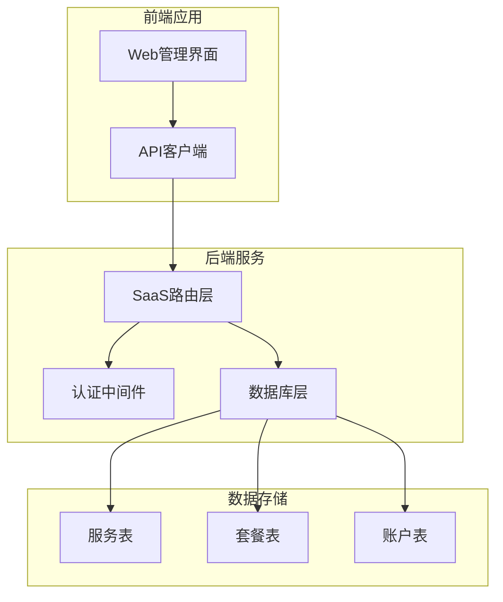

**图表来源**
- [apps/server/src/routes/saas.ts:14-160](file://apps/server/src/routes/saas.ts#L14-L160)
- [apps/web/src/pages/admin/SaasManage.tsx:1-169](file://apps/web/src/pages/admin/SaasManage.tsx#L1-L169)

**章节来源**
- [apps/server/src/routes/saas.ts:1-160](file://apps/server/src/routes/saas.ts#L1-L160)
- [apps/web/src/pages/admin/SaasManage.tsx:1-169](file://apps/web/src/pages/admin/SaasManage.tsx#L1-L169)

## 核心组件

### 数据模型架构

SaaS套餐管理涉及三个核心数据表，形成清晰的三层架构：

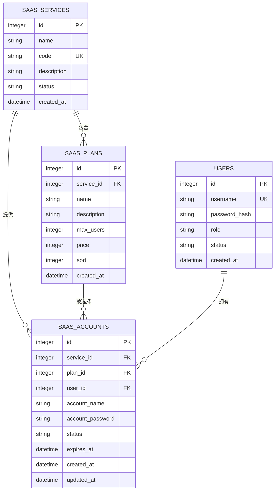

**图表来源**
- [apps/server/src/db/schema.ts:171-203](file://apps/server/src/db/schema.ts#L171-L203)
- [apps/server/drizzle/0001_zippy_shadowcat.sql:69-104](file://apps/server/drizzle/0001_zippy_shadowcat.sql#L69-L104)

### 核心属性说明

每个组件都有其特定的属性配置：

**服务属性 (SAAS_SERVICES)**
- `id`: 自增主键
- `name`: 服务名称（必填）
- `code`: 唯一编码（必填）
- `description`: 服务描述
- `status`: 状态（active/disabled）

**套餐属性 (SAAS_PLANS)**
- `id`: 自增主键
- `serviceId`: 所属服务ID（外键）
- `name`: 套餐名称（必填）
- `description`: 套餐描述
- `maxUsers`: 最大用户数（默认0表示无限制）
- `price`: 价格（单位：分，默认0）
- `sort`: 排序值（用于显示顺序）

**账户属性 (SAAS_ACCOUNTS)**
- `id`: 自增主键
- `serviceId`: 服务ID（外键）
- `planId`: 套餐ID（可选）
- `userId`: 用户ID（外键）
- `accountName`: 账号名称
- `accountPassword`: 自动生成的密码
- `status`: 账号状态（pending/active/disabled/expired）
- `expiresAt`: 到期时间

**章节来源**
- [apps/server/src/db/schema.ts:171-203](file://apps/server/src/db/schema.ts#L171-L203)
- [apps/server/drizzle/0001_zippy_shadowcat.sql:85-104](file://apps/server/drizzle/0001_zippy_shadowcat.sql#L85-L104)

## 架构概览

系统采用分层架构设计，确保职责分离和代码可维护性：

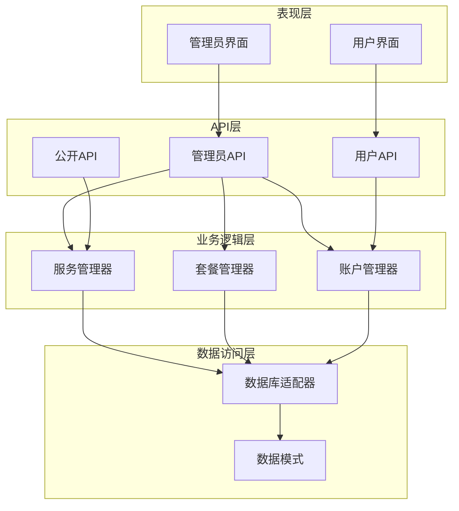

**图表来源**
- [apps/server/src/routes/saas.ts:14-160](file://apps/server/src/routes/saas.ts#L14-L160)
- [apps/server/src/middleware/auth.ts:17-55](file://apps/server/src/middleware/auth.ts#L17-L55)

## 详细组件分析

### 管理员服务管理

管理员可以对SaaS服务进行全面管理，包括创建、更新和查询服务信息。

#### 服务创建流程

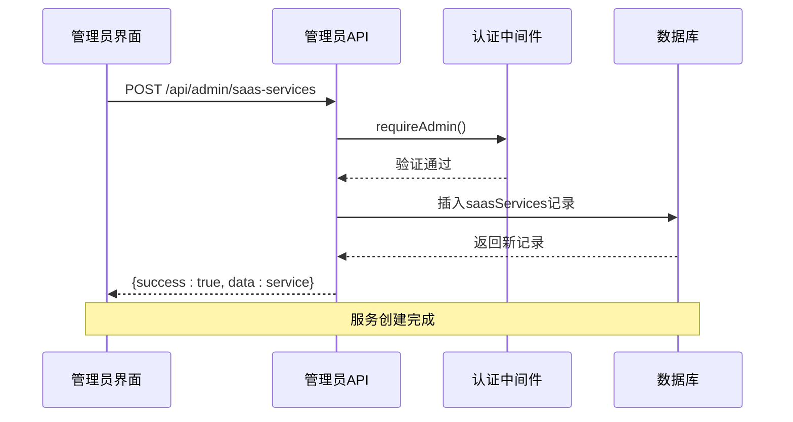

**图表来源**
- [apps/server/src/routes/saas.ts:26-32](file://apps/server/src/routes/saas.ts#L26-L32)
- [apps/server/src/middleware/auth.ts:48-55](file://apps/server/src/middleware/auth.ts#L48-L55)

#### 服务更新流程

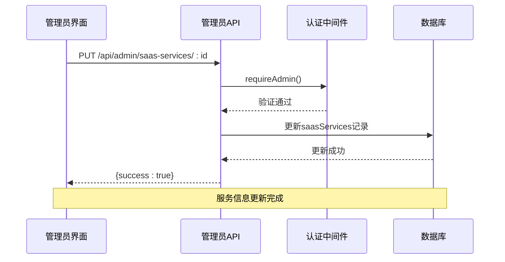

**图表来源**
- [apps/server/src/routes/saas.ts:34-43](file://apps/server/src/routes/saas.ts#L34-L43)

### 套餐管理功能

套餐管理是SaaS系统的核心功能，支持完整的CRUD操作和动态配置。

#### 套餐创建流程

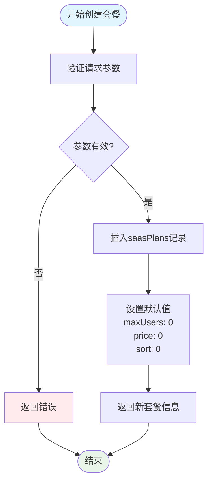

**图表来源**
- [apps/server/src/routes/saas.ts:46-54](file://apps/server/src/routes/saas.ts#L46-L54)

#### 套餐更新流程

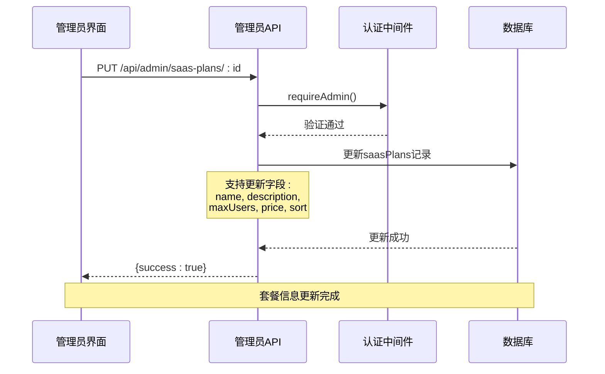

**图表来源**
- [apps/server/src/routes/saas.ts:56-65](file://apps/server/src/routes/saas.ts#L56-L65)

#### 套餐删除流程

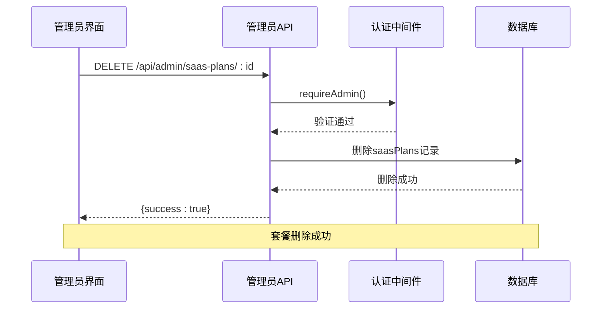

**图表来源**
- [apps/server/src/routes/saas.ts:67-71](file://apps/server/src/routes/saas.ts#L67-L71)

### 账户管理功能

系统提供完整的账户生命周期管理，包括自动分配和手动管理。

#### 账户申请流程

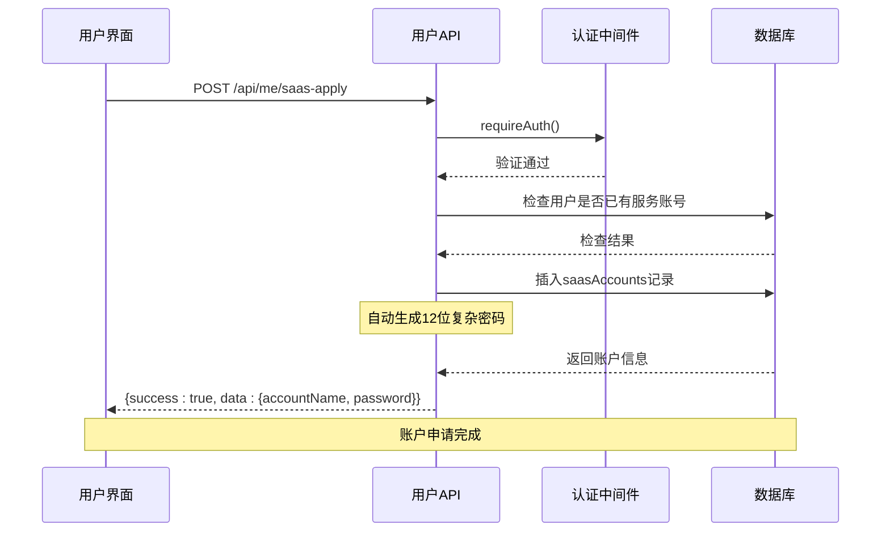

**图表来源**
- [apps/server/src/routes/saas.ts:132-146](file://apps/server/src/routes/saas.ts#L132-L146)

#### 账户管理操作

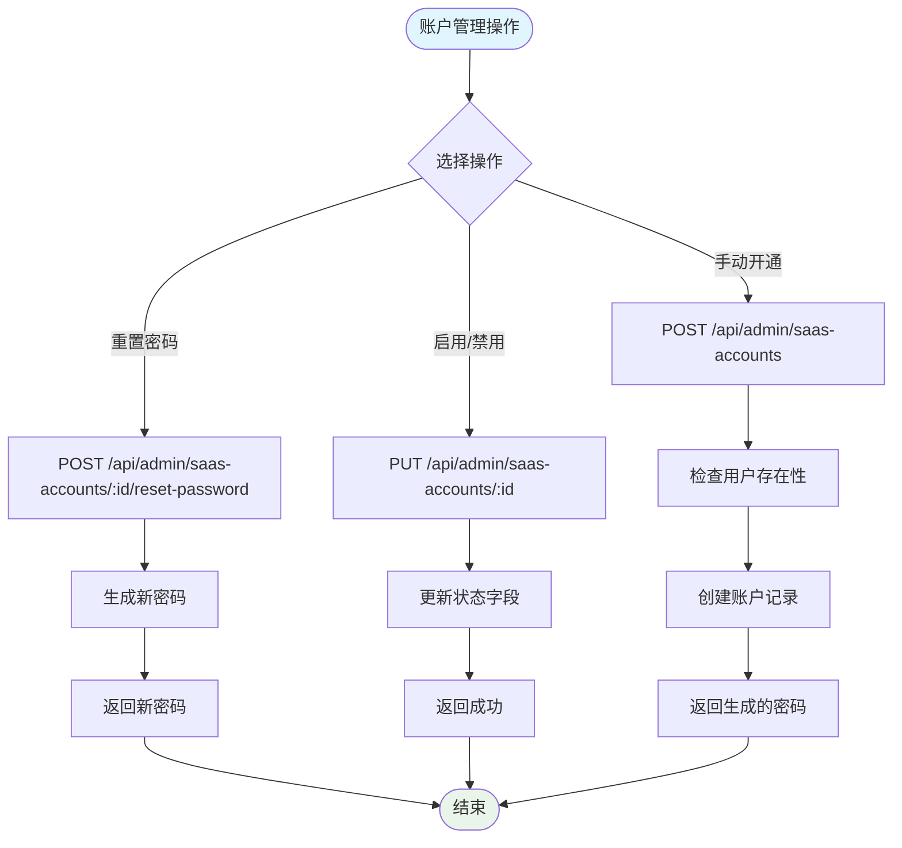

**图表来源**
- [apps/server/src/routes/saas.ts:102-120](file://apps/server/src/routes/saas.ts#L102-L120)

### 查询接口设计

系统提供多种查询接口满足不同场景需求：

#### 管理员查询服务和套餐

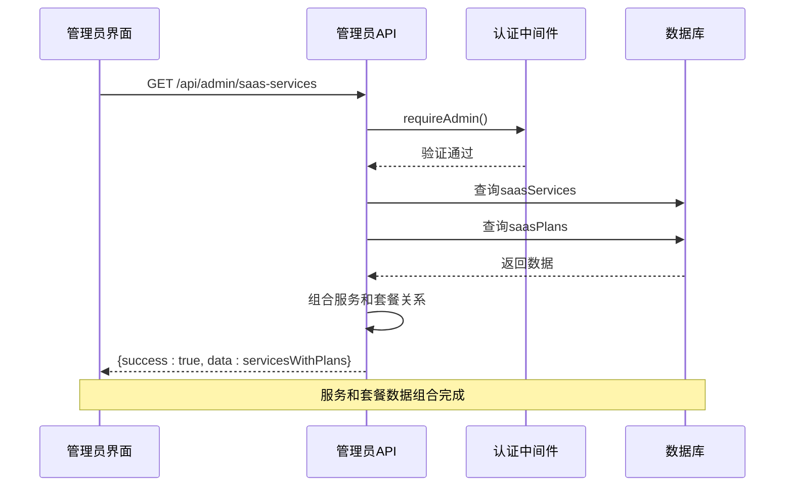

**图表来源**
- [apps/server/src/routes/saas.ts:16-24](file://apps/server/src/routes/saas.ts#L16-L24)

#### 公开查询可用服务

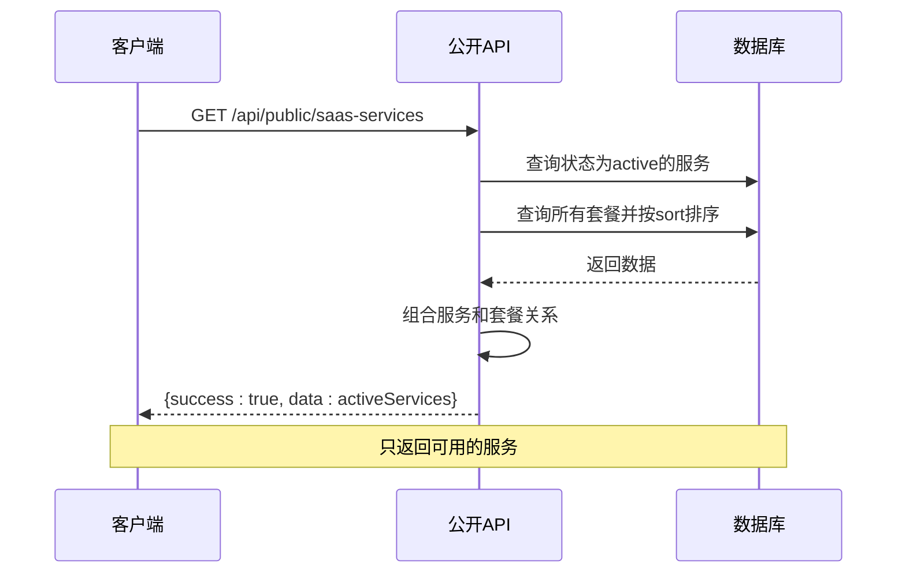

**图表来源**
- [apps/server/src/routes/saas.ts:123-130](file://apps/server/src/routes/saas.ts#L123-L130)

**章节来源**
- [apps/server/src/routes/saas.ts:14-160](file://apps/server/src/routes/saas.ts#L14-L160)
- [apps/server/src/middleware/auth.ts:17-55](file://apps/server/src/middleware/auth.ts#L17-L55)

## 依赖关系分析

系统各组件之间的依赖关系清晰明确：

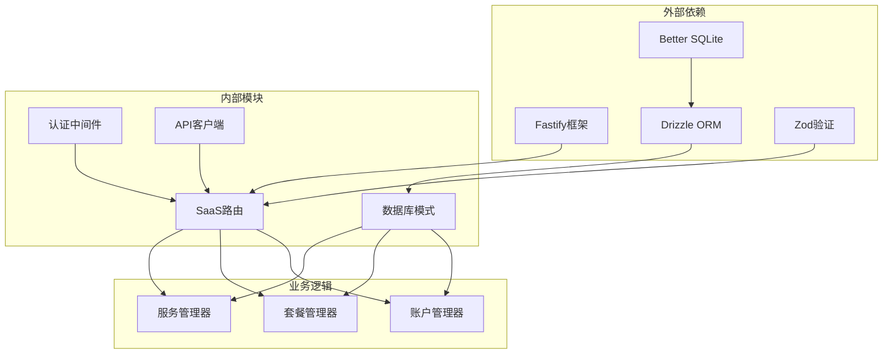

**图表来源**
- [apps/server/src/routes/saas.ts:1-6](file://apps/server/src/routes/saas.ts#L1-L6)
- [apps/server/package.json:14-27](file://apps/server/package.json#L14-L27)

### 权限控制机制

系统实现了严格的权限控制，确保只有授权用户才能执行敏感操作：

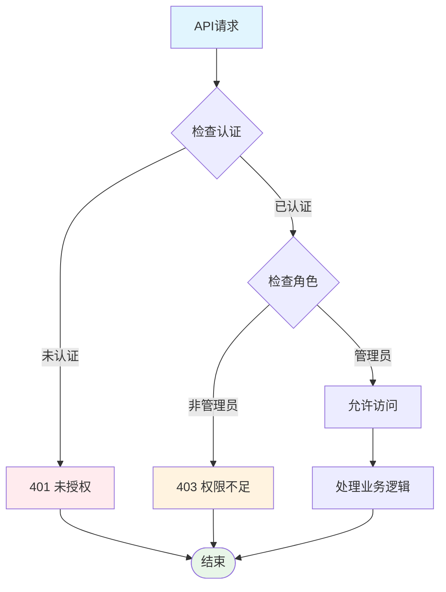

**图表来源**
- [apps/server/src/middleware/auth.ts:42-55](file://apps/server/src/middleware/auth.ts#L42-L55)

**章节来源**
- [apps/server/src/middleware/auth.ts:1-56](file://apps/server/src/middleware/auth.ts#L1-L56)
- [apps/server/package.json:14-27](file://apps/server/package.json#L14-L27)

## 性能考虑

### 数据库优化策略

1. **索引设计**: 服务编码使用唯一索引，确保查询效率
2. **连接池管理**: 使用Better SQLite的连接池优化数据库连接
3. **查询优化**: 套餐查询按sort字段排序，提高显示性能
4. **缓存策略**: 对于频繁访问的静态配置数据考虑引入缓存层

### API性能优化

1. **批量操作**: 管理员界面使用Promise.all并行加载多个数据源
2. **分页支持**: 账户列表支持分页，避免大量数据传输
3. **条件查询**: 使用WHERE子句精确过滤数据，减少不必要的数据传输

### 前端性能优化

1. **懒加载**: 复杂组件按需加载
2. **虚拟滚动**: 大数据量表格使用虚拟滚动
3. **状态管理**: 合理的状态更新策略，避免不必要的重渲染

## 故障排除指南

### 常见问题及解决方案

#### 认证失败
- **症状**: 401未授权错误
- **原因**: 会话过期或未登录
- **解决**: 重新登录系统

#### 权限不足
- **症状**: 403权限不足错误
- **原因**: 非管理员用户尝试执行管理操作
- **解决**: 使用管理员账户登录

#### 数据重复
- **症状**: 服务编码重复错误
- **原因**: 重复的服务编码
- **解决**: 修改服务编码为唯一值

#### 外键约束错误
- **症状**: 数据库外键约束错误
- **原因**: 引用不存在的服务或套餐ID
- **解决**: 确保引用的ID存在且有效

### 错误处理机制

系统实现了统一的错误处理机制：

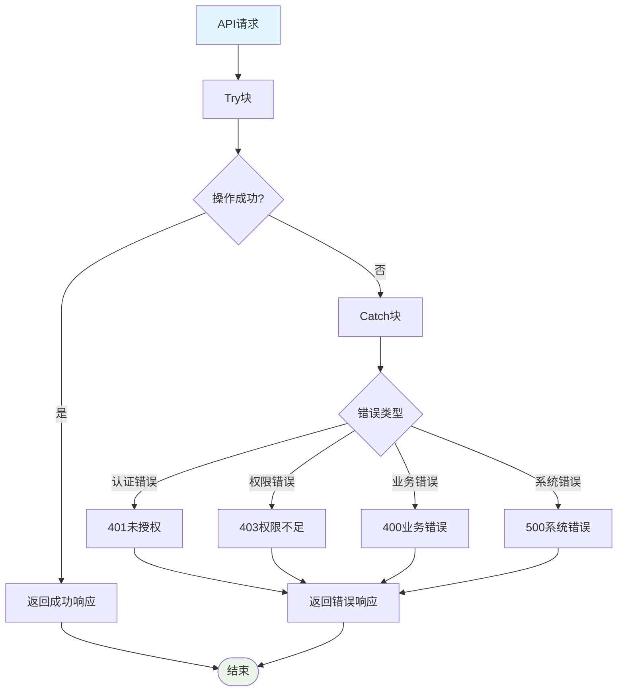

**图表来源**
- [apps/server/src/middleware/auth.ts:42-55](file://apps/server/src/middleware/auth.ts#L42-L55)
- [apps/server/src/routes/saas.ts:88-99](file://apps/server/src/routes/saas.ts#L88-L99)

**章节来源**
- [apps/server/src/middleware/auth.ts:42-55](file://apps/server/src/middleware/auth.ts#L42-L55)
- [apps/server/src/routes/saas.ts:88-120](file://apps/server/src/routes/saas.ts#L88-L120)

## 结论

ZBH2平台的SaaS套餐管理系统展现了现代云服务管理的最佳实践。通过清晰的三层架构设计、严格的权限控制和完善的错误处理机制，系统能够稳定地支持多租户SaaS服务的全生命周期管理。

### 设计优势

1. **模块化设计**: 清晰的职责分离，便于维护和扩展
2. **安全性**: 完善的认证授权机制，保护敏感数据
3. **可扩展性**: 灵活的数据模型支持未来功能扩展
4. **用户体验**: 直观的管理界面和流畅的操作体验

### 配置建议

1. **套餐定价策略**: 建议采用阶梯式定价，随着用户数量增加提供折扣
2. **性能监控**: 建立数据库查询性能监控，及时发现瓶颈
3. **备份策略**: 定期备份关键数据，确保数据安全
4. **日志审计**: 完善的操作日志，便于问题追踪和合规审计

该系统为ZBH2平台提供了坚实的SaaS服务基础，能够支持企业级的云服务管理和计费需求。