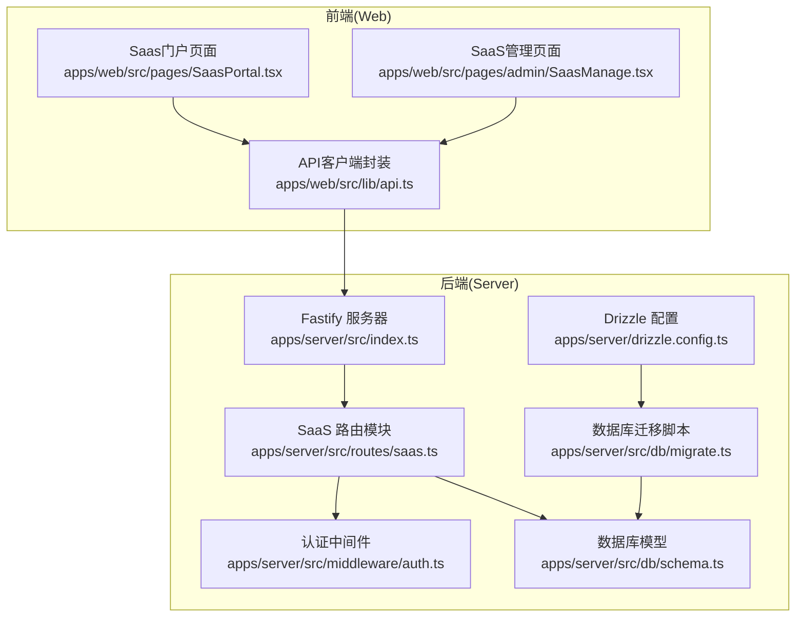
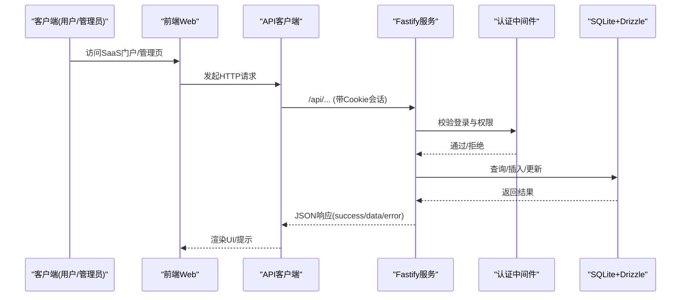
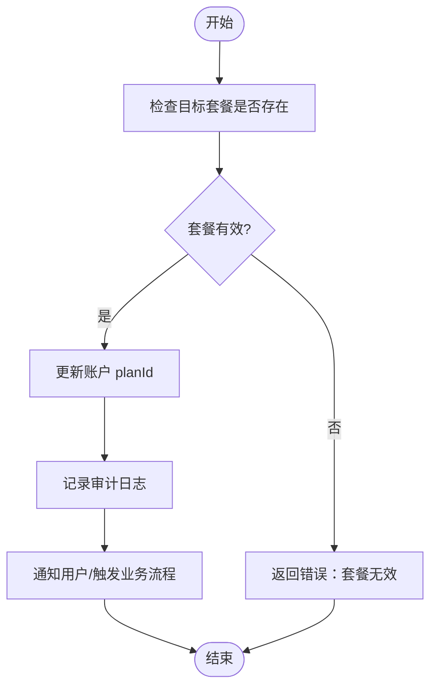
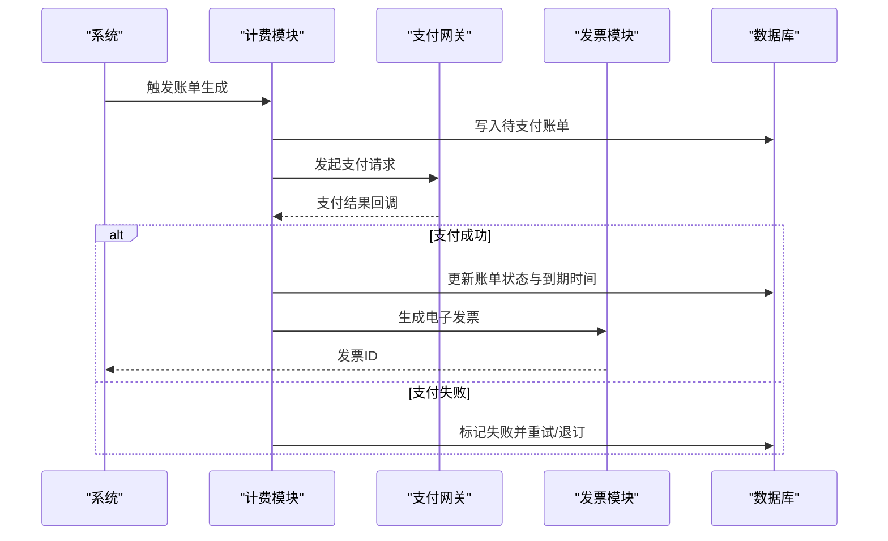
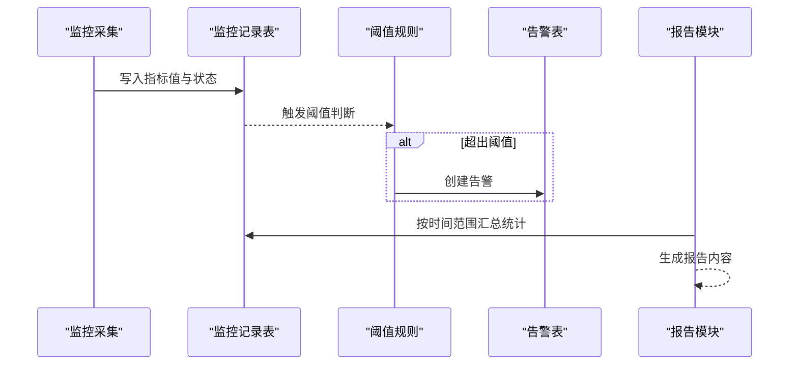
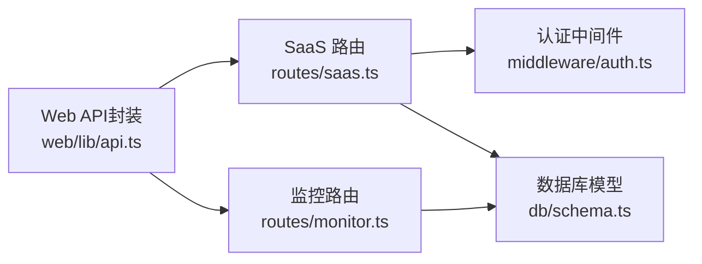
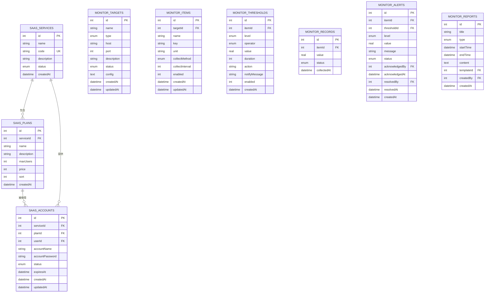

# SaaS服务API

<cite>
**本文引用的文件**
- [apps/server/src/routes/saas.ts](file://apps/server/src/routes/saas.ts)
- [apps/server/src/db/schema.ts](file://apps/server/src/db/schema.ts)
- [apps/server/src/middleware/auth.ts](file://apps/server/src/middleware/auth.ts)
- [apps/web/src/lib/api.ts](file://apps/web/src/lib/api.ts)
- [apps/web/src/pages/SaasPortal.tsx](file://apps/web/src/pages/SaasPortal.tsx)
- [apps/web/src/pages/admin/SaasManage.tsx](file://apps/web/src/pages/admin/SaasManage.tsx)
- [apps/server/src/db/migrate.ts](file://apps/server/src/db/migrate.ts)
- [apps/server/drizzle.config.ts](file://apps/server/drizzle.config.ts)
- [packages/shared/src/types.ts](file://packages/shared/src/types.ts)
</cite>

## 目录
1. [简介](#简介)
2. [项目结构](#项目结构)
3. [核心组件](#核心组件)
4. [架构总览](#架构总览)
5. [详细组件分析](#详细组件分析)
6. [依赖关系分析](#依赖关系分析)
7. [性能考量](#性能考量)
8. [故障排查指南](#故障排查指南)
9. [结论](#结论)
10. [附录](#附录)

## 简介
本文件为 ZBH2 平台 SaaS 服务 API 的权威接口文档，覆盖账户管理、订阅管理、计费与支付、服务监控与用量统计、配额与资源隔离、以及性能监控等能力。文档基于实际代码实现，提供接口定义、数据模型、调用流程、示例与最佳实践，帮助开发者与运维人员快速集成与维护。

## 项目结构
后端采用 Fastify + Drizzle-ORM + SQLite 架构，前端使用 React + Ant Design。SaaS 相关路由集中在 saas 路由模块，数据库模型位于 schema 中，认证中间件负责会话与权限校验。

图表来源
- [apps/server/src/routes/saas.ts:1-160](file://apps/server/src/routes/saas.ts#L1-L160)
- [apps/server/src/db/schema.ts:171-203](file://apps/server/src/db/schema.ts#L171-L203)
- [apps/server/src/middleware/auth.ts:1-56](file://apps/server/src/middleware/auth.ts#L1-L56)
- [apps/web/src/lib/api.ts:1-16](file://apps/web/src/lib/api.ts#L1-L16)
- [apps/web/src/pages/SaasPortal.tsx:1-97](file://apps/web/src/pages/SaasPortal.tsx#L1-L97)
- [apps/web/src/pages/admin/SaasManage.tsx:1-169](file://apps/web/src/pages/admin/SaasManage.tsx#L1-L169)
- [apps/server/drizzle.config.ts:1-11](file://apps/server/drizzle.config.ts#L1-L11)
- [apps/server/src/db/migrate.ts:1-18](file://apps/server/src/db/migrate.ts#L1-L18)

章节来源
- [apps/server/src/routes/saas.ts:1-160](file://apps/server/src/routes/saas.ts#L1-L160)
- [apps/server/src/db/schema.ts:171-203](file://apps/server/src/db/schema.ts#L171-L203)
- [apps/server/src/middleware/auth.ts:1-56](file://apps/server/src/middleware/auth.ts#L1-L56)
- [apps/web/src/lib/api.ts:1-16](file://apps/web/src/lib/api.ts#L1-L16)
- [apps/web/src/pages/SaasPortal.tsx:1-97](file://apps/web/src/pages/SaasPortal.tsx#L1-L97)
- [apps/web/src/pages/admin/SaasManage.tsx:1-169](file://apps/web/src/pages/admin/SaasManage.tsx#L1-L169)
- [apps/server/drizzle.config.ts:1-11](file://apps/server/drizzle.config.ts#L1-L11)
- [apps/server/src/db/migrate.ts:1-18](file://apps/server/src/db/migrate.ts#L1-L18)

## 核心组件
- SaaS 账户管理：提供服务与套餐的增删改查、用户自助申请、管理员批量开通、密码重置、状态控制。
- SaaS 订阅管理：通过账户关联套餐，支持套餐升级/降级与取消。
- 计费与支付：当前仓库未实现具体计费/支付/发票逻辑，仅提供账户状态字段与到期时间字段，便于后续扩展。
- 服务监控：提供监控目标、指标、阈值、记录、告警、报告与平台对接能力，支撑用量统计与阈值告警。
- 配额与资源隔离：数据库模型包含最大用户数字段，可用于配额控制；资源隔离需结合业务侧实现。
- 性能监控：监控系统提供采集、阈值、记录、告警与报告，支持仪表盘聚合。

章节来源
- [apps/server/src/routes/saas.ts:14-159](file://apps/server/src/routes/saas.ts#L14-L159)
- [apps/server/src/db/schema.ts:171-203](file://apps/server/src/db/schema.ts#L171-L203)
- [apps/server/src/routes/monitor.ts:1-595](file://apps/server/src/routes/monitor.ts#L1-L595)

## 架构总览
SaaS 服务 API 的核心交互链路如下：

图表来源
- [apps/web/src/lib/api.ts:1-16](file://apps/web/src/lib/api.ts#L1-L16)
- [apps/server/src/middleware/auth.ts:17-55](file://apps/server/src/middleware/auth.ts#L17-L55)
- [apps/server/src/routes/saas.ts:14-159](file://apps/server/src/routes/saas.ts#L14-L159)
- [apps/server/src/db/schema.ts:171-203](file://apps/server/src/db/schema.ts#L171-L203)

## 详细组件分析

### SaaS 账户管理接口
- 服务与套餐管理（管理员）
  - GET /api/admin/saas-services：获取服务列表与对应套餐
  - POST /api/admin/saas-services：创建服务
  - PUT /api/admin/saas-services/{id}：更新服务（含状态）
  - POST /api/admin/saas-plans：创建套餐
  - PUT /api/admin/saas-plans/{id}：更新套餐
  - DELETE /api/admin/saas-plans/{id}：删除套餐
- 账户管理（管理员）
  - GET /api/admin/saas-accounts：获取账户列表（含用户、服务名）
  - POST /api/admin/saas-accounts：手动开通账户（自动生成密码）
  - POST /api/admin/saas-accounts/{id}/reset-password：重置密码
  - PUT /api/admin/saas-accounts/{id}：启用/禁用或变更套餐
- 账户申请与查询（用户）
  - GET /api/public/saas-services：公开查询可用服务与套餐
  - POST /api/me/saas-apply：用户自助申请账户（若已存在则冲突）
  - GET /api/me/saas-accounts：查询我的账户列表

请求/响应要点
- 成功响应统一结构：{ success: boolean, data?, error? }
- 管理员接口均需携带有效会话与 admin 角色
- 用户接口需登录态

章节来源
- [apps/server/src/routes/saas.ts:14-159](file://apps/server/src/routes/saas.ts#L14-L159)
- [apps/server/src/middleware/auth.ts:42-55](file://apps/server/src/middleware/auth.ts#L42-L55)
- [packages/shared/src/types.ts:6-17](file://packages/shared/src/types.ts#L6-L17)

### 订阅管理：套餐升级/降级/取消
- 当前实现：管理员可直接通过更新账户的 planId 实现“套餐变更”；取消订阅可视为将 planId 设为空或禁用账户。
- 建议扩展：增加明确的订阅变更事件与审计日志，区分升级/降级/取消，并引入到期时间字段以支持自动续费与到期处理。

图表来源
- [apps/server/src/routes/saas.ts:111-120](file://apps/server/src/routes/saas.ts#L111-L120)

章节来源
- [apps/server/src/routes/saas.ts:46-71](file://apps/server/src/routes/saas.ts#L46-L71)
- [apps/server/src/routes/saas.ts:111-120](file://apps/server/src/routes/saas.ts#L111-L120)

### 计费接口：账单生成、支付处理与发票管理
- 当前状态：仓库未实现具体的计费/支付/发票逻辑。数据库模型包含账户状态与到期时间字段，可用于后续扩展。
- 建议实现：
  - 账单生成：按周期（月/年）生成待支付账单，绑定账户与套餐
  - 支付处理：对接第三方支付（如微信/支付宝/Stripe），回调校验与幂等
  - 发票管理：根据订单生成电子发票，支持查询与下载
  - 自动续费：到期前检查余额/绑卡，自动扣款并延长有效期
  - 退款处理：支持按比例退款与工单审核流程

图表来源
- [apps/server/src/db/schema.ts:192-203](file://apps/server/src/db/schema.ts#L192-L203)

章节来源
- [apps/server/src/db/schema.ts:171-203](file://apps/server/src/db/schema.ts#L171-L203)

### 服务监控接口：用量统计、阈值告警与用量报告
- 监控目标、指标、阈值、记录、告警、报告与平台对接均由监控路由模块提供，可直接用于 SaaS 用量统计与告警。
- 仪表盘聚合：提供目标总数、按状态分布、告警状态/级别统计与近期告警列表。

图表来源
- [apps/server/src/routes/monitor.ts:167-391](file://apps/server/src/routes/monitor.ts#L167-L391)

章节来源
- [apps/server/src/routes/monitor.ts:1-595](file://apps/server/src/routes/monitor.ts#L1-L595)

### 配额管理、资源隔离与性能监控
- 配额管理：套餐模型包含最大用户数字段，可用于限制账户下并发或用户规模。
- 资源隔离：建议在业务层实现命名空间/租户隔离，结合监控与告警保障资源边界。
- 性能监控：利用监控系统采集 CPU/内存/磁盘/网络等指标，设置阈值与告警，定期生成报告。

章节来源
- [apps/server/src/db/schema.ts:181-190](file://apps/server/src/db/schema.ts#L181-L190)
- [apps/server/src/routes/monitor.ts:1-595](file://apps/server/src/routes/monitor.ts#L1-L595)

## 依赖关系分析
- 路由依赖认证中间件，确保管理员与用户接口的权限控制。
- 路由依赖数据库模型与 Drizzle ORM，实现 CRUD 与联表查询。
- 前端通过统一 API 客户端发起请求，自动携带 Cookie 会话。

图表来源
- [apps/server/src/routes/saas.ts:1-160](file://apps/server/src/routes/saas.ts#L1-L160)
- [apps/server/src/middleware/auth.ts:1-56](file://apps/server/src/middleware/auth.ts#L1-L56)
- [apps/server/src/db/schema.ts:171-203](file://apps/server/src/db/schema.ts#L171-L203)
- [apps/web/src/lib/api.ts:1-16](file://apps/web/src/lib/api.ts#L1-L16)

章节来源
- [apps/server/src/routes/saas.ts:1-160](file://apps/server/src/routes/saas.ts#L1-L160)
- [apps/server/src/middleware/auth.ts:1-56](file://apps/server/src/middleware/auth.ts#L1-L56)
- [apps/web/src/lib/api.ts:1-16](file://apps/web/src/lib/api.ts#L1-L16)

## 性能考量
- 数据库迁移与 WAL 模式：迁移脚本启用 WAL 与外键约束，有助于并发与一致性。
- 分页与排序：监控模块提供分页与排序，建议在大数据量场景下合理设置分页大小与索引。
- 会话与权限：认证中间件按 Cookie 与过期时间过滤无效会话，避免重复查询。

章节来源
- [apps/server/src/db/migrate.ts:7-15](file://apps/server/src/db/migrate.ts#L7-L15)
- [apps/server/src/middleware/auth.ts:17-40](file://apps/server/src/middleware/auth.ts#L17-L40)

## 故障排查指南
- 401 未登录：检查前端是否携带 Cookie，后端会话是否过期。
- 403 权限不足：管理员接口需 admin 角色。
- 404 资源不存在：监控目标/阈值/报告等对象已被删除。
- 409 用户已拥有账户：自助申请时重复申请同一服务。
- 400 参数错误：监控创建/更新时缺少必填字段。

章节来源
- [apps/server/src/middleware/auth.ts:42-55](file://apps/server/src/middleware/auth.ts#L42-L55)
- [apps/server/src/routes/monitor.ts:34-58](file://apps/server/src/routes/monitor.ts#L34-L58)
- [apps/server/src/routes/saas.ts:132-146](file://apps/server/src/routes/saas.ts#L132-L146)

## 结论
本仓库提供了完善的 SaaS 账户与订阅管理骨架，以及强大的监控体系。计费/支付/发票与自动续费/退款等功能可在此基础上平滑扩展。建议优先完善计费模块与配额控制，配合监控告警与报告，构建完整的 SaaS 生命周期管理体系。

## 附录

### 数据模型概览（SaaS 与监控）

图表来源
- [apps/server/src/db/schema.ts:171-329](file://apps/server/src/db/schema.ts#L171-L329)

### 请求/响应示例（路径引用）
- 账户申请（用户）
  - 请求：POST /api/me/saas-apply
  - 成功响应：{ success: true, data: { accountName, password } }
  - 参考路径：[apps/server/src/routes/saas.ts:132-146](file://apps/server/src/routes/saas.ts#L132-L146)
- 手动开通账户（管理员）
  - 请求：POST /api/admin/saas-accounts
  - 成功响应：{ success: true, data: { ..., generatedPassword } }
  - 参考路径：[apps/server/src/routes/saas.ts:88-100](file://apps/server/src/routes/saas.ts#L88-L100)
- 启用/禁用账户（管理员）
  - 请求：PUT /api/admin/saas-accounts/{id}
  - 成功响应：{ success: true }
  - 参考路径：[apps/server/src/routes/saas.ts:111-120](file://apps/server/src/routes/saas.ts#L111-L120)
- 重置密码（管理员）
  - 请求：POST /api/admin/saas-accounts/{id}/reset-password
  - 成功响应：{ success: true, data: { newPassword } }
  - 参考路径：[apps/server/src/routes/saas.ts:102-109](file://apps/server/src/routes/saas.ts#L102-L109)
- 获取我的账户（用户）
  - 请求：GET /api/me/saas-accounts
  - 成功响应：{ success: true, data: [...] }
  - 参考路径：[apps/server/src/routes/saas.ts:148-158](file://apps/server/src/routes/saas.ts#L148-L158)
- 公开服务与套餐（用户门户）
  - 请求：GET /api/public/saas-services
  - 成功响应：{ success: true, data: [...] }
  - 参考路径：[apps/server/src/routes/saas.ts:123-130](file://apps/server/src/routes/saas.ts#L123-L130)
- 监控报告生成（管理员）
  - 请求：POST /api/admin/monitor/reports/generate
  - 成功响应：{ success: true, data: report }
  - 参考路径：[apps/server/src/routes/monitor.ts:332-391](file://apps/server/src/routes/monitor.ts#L332-L391)