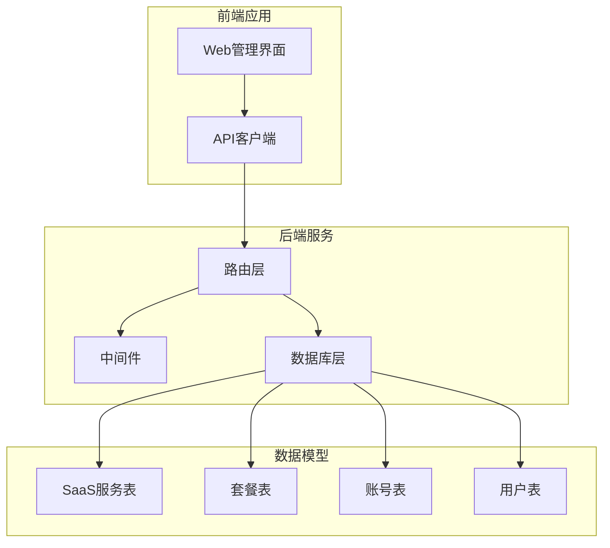
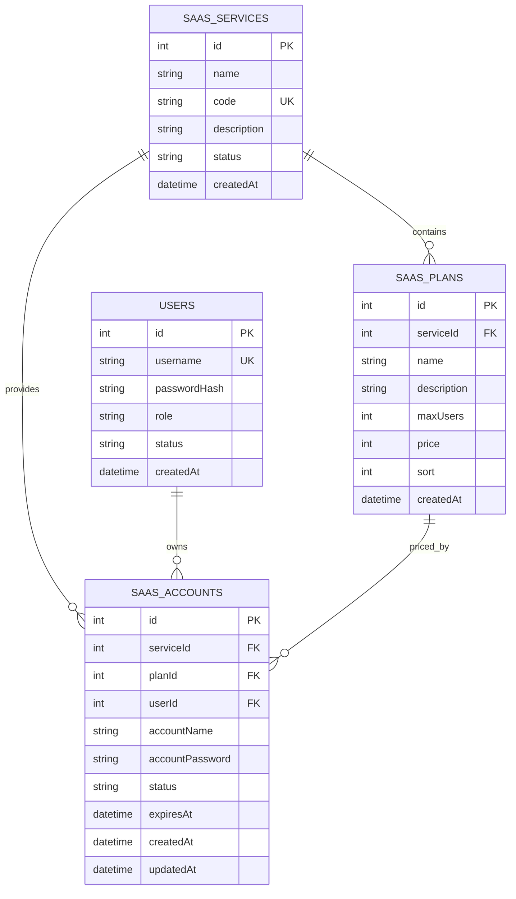
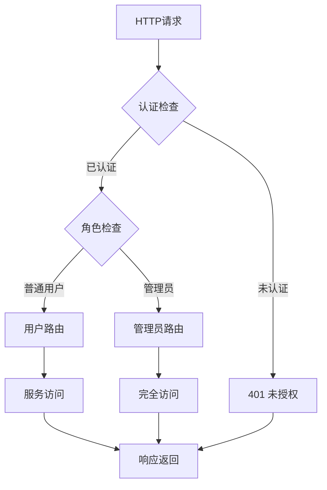
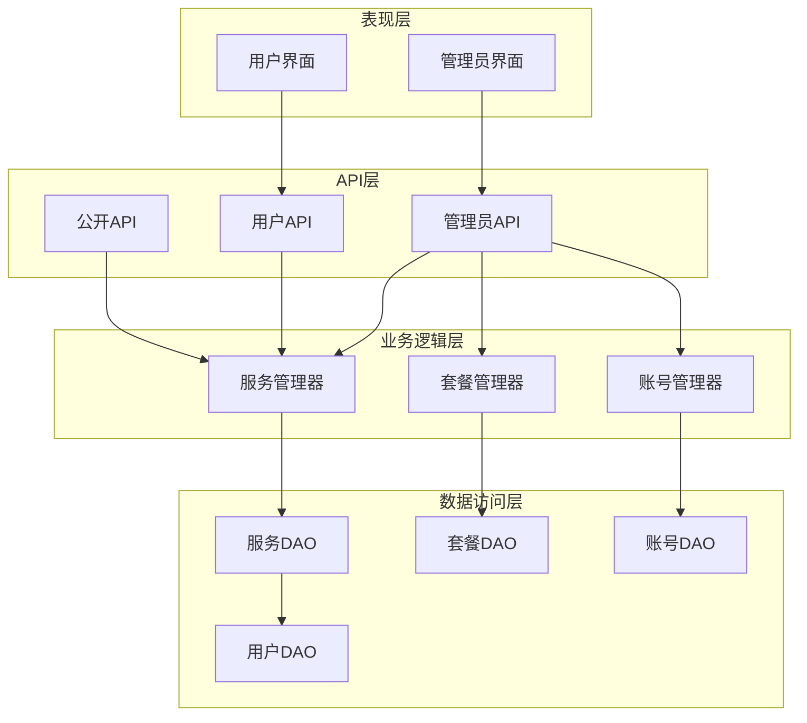
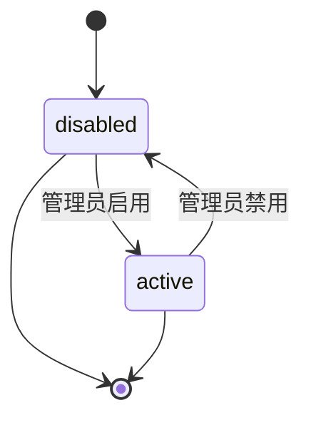
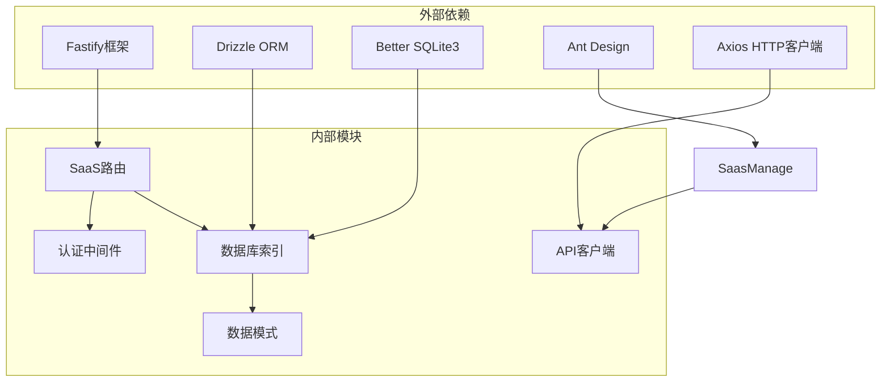

# SaaS服务管理

<cite>
**本文档引用的文件**
- [saas.ts](file://apps/server/src/routes/saas.ts)
- [schema.ts](file://apps/server/src/db/schema.ts)
- [auth.ts](file://apps/server/src/middleware/auth.ts)
- [index.ts](file://apps/server/src/db/index.ts)
- [SaasManage.tsx](file://apps/web/src/pages/admin/SaasManage.tsx)
- [api.ts](file://apps/web/src/lib/api.ts)
</cite>

## 目录
1. [简介](#简介)
2. [项目结构](#项目结构)
3. [核心组件](#核心组件)
4. [架构概览](#架构概览)
5. [详细组件分析](#详细组件分析)
6. [依赖关系分析](#依赖关系分析)
7. [性能考虑](#性能考虑)
8. [故障排除指南](#故障排除指南)
9. [结论](#结论)

## 简介

ZBH2平台的SaaS服务管理功能是一个完整的云端服务管理系统，支持服务的全生命周期管理、套餐配置、用户账户管理和状态控制。该系统采用前后端分离架构，后端基于Fastify框架和Drizzle ORM，前端使用React和Ant Design构建管理界面。

系统主要功能包括：
- 服务管理：创建、更新、删除和查询SaaS服务
- 套餐管理：为每个服务配置不同的付费套餐
- 账户管理：为用户分配和管理SaaS服务账号
- 状态控制：启用/禁用服务和服务账号
- 排序机制：支持服务和套餐的自定义排序
- 权限控制：管理员和普通用户的权限分离

## 项目结构

SaaS服务管理功能分布在以下关键模块中：

**图表来源**
- [saas.ts:14-160](file://apps/server/src/routes/saas.ts#L14-L160)
- [schema.ts:171-203](file://apps/server/src/db/schema.ts#L171-L203)

**章节来源**
- [saas.ts:1-160](file://apps/server/src/routes/saas.ts#L1-L160)
- [schema.ts:171-203](file://apps/server/src/db/schema.ts#L171-L203)

## 核心组件

### 数据模型设计

系统采用三层数据模型设计，确保数据完整性和业务逻辑清晰：

**图表来源**
- [schema.ts:171-203](file://apps/server/src/db/schema.ts#L171-L203)

### 权限控制机制

系统实现了严格的权限控制，区分管理员和普通用户：

**图表来源**
- [auth.ts:42-55](file://apps/server/src/middleware/auth.ts#L42-L55)

**章节来源**
- [schema.ts:171-203](file://apps/server/src/db/schema.ts#L171-L203)
- [auth.ts:1-56](file://apps/server/src/middleware/auth.ts#L1-L56)

## 架构概览

SaaS服务管理采用分层架构设计，确保关注点分离和代码可维护性：

**图表来源**
- [saas.ts:14-160](file://apps/server/src/routes/saas.ts#L14-L160)
- [auth.ts:1-56](file://apps/server/src/middleware/auth.ts#L1-L56)

## 详细组件分析

### 服务管理组件

服务管理是SaaS系统的核心组件，负责服务的全生命周期管理。

#### 服务CRUD操作

| 操作类型 | HTTP方法 | 路径 | 权限要求 | 功能描述 |
|---------|---------|------|---------|----------|
| 查询所有服务 | GET | `/api/admin/saas-services` | 管理员 | 获取所有服务及其关联套餐 |
| 创建服务 | POST | `/api/admin/saas-services` | 管理员 | 创建新的SaaS服务 |
| 更新服务 | PUT | `/api/admin/saas-services/:id` | 管理员 | 更新服务信息（名称、编码、描述、状态） |
| 查询公开服务 | GET | `/api/public/saas-services` | 公开 | 获取启用的服务列表 |

#### 服务状态控制

服务支持两种状态：`active`（启用）和`disabled`（禁用）。状态控制通过PUT请求实现：

**图表来源**
- [schema.ts:177-178](file://apps/server/src/db/schema.ts#L177-L178)

#### 服务排序机制

服务通过`createdAt`字段进行默认排序，管理员可以为服务设置自定义排序值：

**章节来源**
- [saas.ts:16-43](file://apps/server/src/routes/saas.ts#L16-L43)
- [schema.ts:171-179](file://apps/server/src/db/schema.ts#L171-L179)

### 套餐管理组件

套餐管理为每个服务提供不同的付费选项和功能限制。

#### 套餐CRUD操作

| 操作类型 | HTTP方法 | 路径 | 权限要求 | 功能描述 |
|---------|---------|------|---------|----------|
| 创建套餐 | POST | `/api/admin/saas-plans` | 管理员 | 为指定服务创建套餐 |
| 更新套餐 | PUT | `/api/admin/saas-plans/:id` | 管理员 | 更新套餐配置 |
| 删除套餐 | DELETE | `/api/admin/saas-plans/:id` | 管理员 | 删除指定套餐 |

#### 套餐配置参数

套餐支持以下配置参数：
- `name`: 套餐名称
- `description`: 套餐描述
- `maxUsers`: 最大用户数限制
- `price`: 价格（以分为单位）
- `sort`: 排序值

#### 套餐排序机制

套餐通过`sort`字段进行排序，默认按升序排列。管理员可以调整排序值来改变显示顺序。

**章节来源**
- [saas.ts:45-71](file://apps/server/src/routes/saas.ts#L45-L71)
- [schema.ts:181-190](file://apps/server/src/db/schema.ts#L181-L190)

### 账号管理组件

账号管理负责为用户分配和管理SaaS服务账号。

#### 账号管理操作

| 操作类型 | HTTP方法 | 路径 | 权限要求 | 功能描述 |
|---------|---------|------|---------|----------|
| 查询所有账号 | GET | `/api/admin/saas-accounts` | 管理员 | 获取所有服务账号信息 |
| 创建账号 | POST | `/api/admin/saas-accounts` | 管理员 | 手动为用户开通服务账号 |
| 重置密码 | POST | `/api/admin/saas-accounts/:id/reset-password` | 管理员 | 重置服务账号密码 |
| 更新账号状态 | PUT | `/api/admin/saas-accounts/:id` | 管理员 | 启用/禁用账号或切换套餐 |

#### 账号状态控制

账号支持四种状态：
- `pending`: 待激活
- `active`: 激活
- `disabled`: 禁用
- `expired`: 过期

#### 用户自助申请

普通用户可以通过以下流程自助申请服务账号：
1. 用户提交申请请求
2. 系统验证用户是否已拥有该服务账号
3. 自动生成随机密码
4. 创建服务账号记录

**章节来源**
- [saas.ts:73-158](file://apps/server/src/routes/saas.ts#L73-L158)
- [schema.ts:192-203](file://apps/server/src/db/schema.ts#L192-L203)

### 前端管理界面

管理员通过React界面管理SaaS服务，提供直观的操作体验。

#### 界面功能特性

- **服务管理卡片**: 显示所有SaaS服务，支持增删改查操作
- **套餐管理**: 在服务详情中管理关联的套餐
- **账号管理**: 查看和管理所有服务账号
- **批量操作**: 支持密码重置和状态切换

#### 数据展示逻辑

界面采用异步加载策略，同时加载服务、账号和用户数据，确保完整的上下文信息。

**章节来源**
- [SaasManage.tsx:1-169](file://apps/web/src/pages/admin/SaasManage.tsx#L1-L169)

## 依赖关系分析

系统各组件之间的依赖关系如下：

**图表来源**
- [saas.ts:1-6](file://apps/server/src/routes/saas.ts#L1-L6)
- [auth.ts:1-15](file://apps/server/src/middleware/auth.ts#L1-L15)
- [index.ts:1-16](file://apps/server/src/db/index.ts#L1-L16)

### 组件耦合度分析

系统采用松耦合设计：
- **路由层**与**业务逻辑层**分离
- **数据访问层**与**业务逻辑层**分离  
- **前端**与**后端**完全分离

这种设计提高了系统的可维护性和可扩展性。

**章节来源**
- [saas.ts:1-160](file://apps/server/src/routes/saas.ts#L1-L160)
- [auth.ts:1-56](file://apps/server/src/middleware/auth.ts#L1-L56)
- [index.ts:1-16](file://apps/server/src/db/index.ts#L1-L16)

## 性能考虑

### 数据库优化

系统采用以下性能优化策略：

1. **索引优化**: 关键字段建立适当索引
2. **查询优化**: 使用JOIN减少查询次数
3. **缓存策略**: 合理使用内存缓存
4. **连接池**: 配置合适的数据库连接池

### API性能优化

- **批量操作**: 支持一次性获取多个资源
- **分页支持**: 大数据集使用分页
- **条件查询**: 支持按状态、日期等条件过滤
- **响应压缩**: 启用GZIP压缩

### 前端性能优化

- **懒加载**: 路由级代码分割
- **虚拟滚动**: 大表格使用虚拟滚动
- **防抖节流**: 输入框和搜索功能使用防抖
- **缓存策略**: 合理使用浏览器缓存

## 故障排除指南

### 常见错误及解决方案

#### 认证相关错误

| 错误类型 | HTTP状态码 | 错误原因 | 解决方案 |
|---------|-----------|---------|---------|
| 未登录 | 401 | 会话过期或未登录 | 重新登录系统 |
| 权限不足 | 403 | 非管理员用户访问管理接口 | 使用管理员账号登录 |
| 会话失效 | 401 | 会话已过期 | 刷新页面重新登录 |

#### 业务逻辑错误

| 错误类型 | HTTP状态码 | 错误原因 | 解决方案 |
|---------|-----------|---------|---------|
| 重复服务编码 | 409 | 服务编码已存在 | 修改服务编码 |
| 用户不存在 | 404 | 指定用户不存在 | 检查用户ID |
| 已拥有服务账号 | 409 | 用户已拥有该服务账号 | 直接使用现有账号 |

#### 数据验证错误

| 错误类型 | HTTP状态码 | 错误原因 | 解决方案 |
|---------|-----------|---------|---------|
| 参数缺失 | 400 | 必填参数未提供 | 检查请求参数 |
| 数据格式错误 | 400 | 参数类型不正确 | 修正数据格式 |
| 业务规则违反 | 400 | 违反业务约束 | 满足业务条件 |

#### 数据库相关错误

| 错误类型 | HTTP状态码 | 错误原因 | 解决方案 |
|---------|-----------|---------|---------|
| 外键约束 | 400 | 违反外键约束 | 检查关联数据 |
| 唯一约束 | 400 | 违反唯一约束 | 修改唯一值 |
| 连接超时 | 500 | 数据库连接问题 | 检查数据库状态 |

### 调试技巧

1. **日志分析**: 查看服务器日志定位问题
2. **网络监控**: 使用浏览器开发者工具监控API调用
3. **数据库查询**: 直接查询数据库验证数据状态
4. **单元测试**: 编写测试用例验证业务逻辑

### 最佳实践建议

#### 开发最佳实践

1. **错误处理**: 实现统一的错误处理机制
2. **输入验证**: 对所有用户输入进行严格验证
3. **事务管理**: 对复杂操作使用数据库事务
4. **日志记录**: 记录关键操作和错误信息

#### 安全最佳实践

1. **输入过滤**: 对所有用户输入进行过滤和转义
2. **权限控制**: 严格验证用户权限
3. **SQL注入防护**: 使用参数化查询
4. **XSS防护**: 对输出内容进行HTML转义

#### 性能最佳实践

1. **查询优化**: 避免N+1查询问题
2. **缓存策略**: 合理使用缓存提高响应速度
3. **异步处理**: 对耗时操作使用异步处理
4. **资源管理**: 及时释放数据库连接和文件句柄

**章节来源**
- [auth.ts:42-55](file://apps/server/src/middleware/auth.ts#L42-L55)
- [saas.ts:88-100](file://apps/server/src/routes/saas.ts#L88-L100)

## 结论

ZBH2平台的SaaS服务管理功能提供了完整的云端服务管理解决方案。系统采用现代化的技术栈和架构设计，具有以下特点：

### 技术优势

1. **架构清晰**: 分层设计确保了良好的可维护性
2. **功能完整**: 支持服务管理、套餐配置、账号管理的完整业务流程
3. **安全可靠**: 实现了严格的权限控制和数据验证
4. **用户体验**: 提供直观的管理界面和流畅的操作体验

### 扩展性考虑

系统设计充分考虑了未来的扩展需求：
- 支持新增服务类型和套餐类型
- 可扩展的权限体系
- 灵活的配置管理
- 完善的日志审计功能

### 改进建议

1. **监控告警**: 添加系统性能监控和异常告警
2. **备份恢复**: 实现数据备份和灾难恢复机制
3. **国际化**: 支持多语言界面
4. **移动端**: 开发移动端管理应用

该系统为ZBH2平台提供了强大的SaaS服务能力，能够满足企业级用户对云端服务管理的需求。