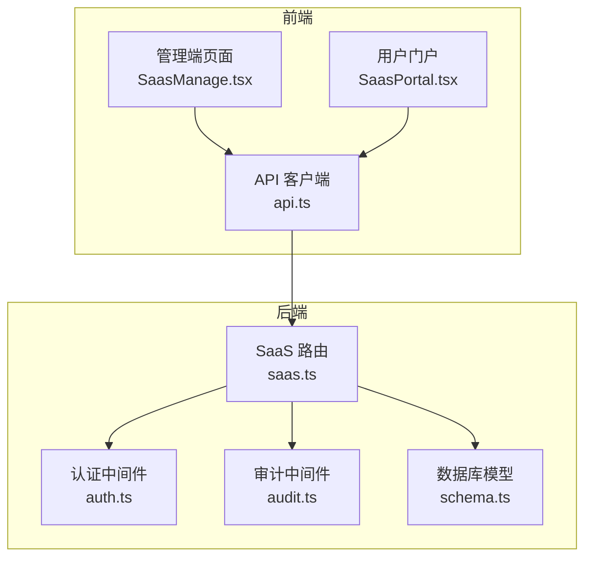
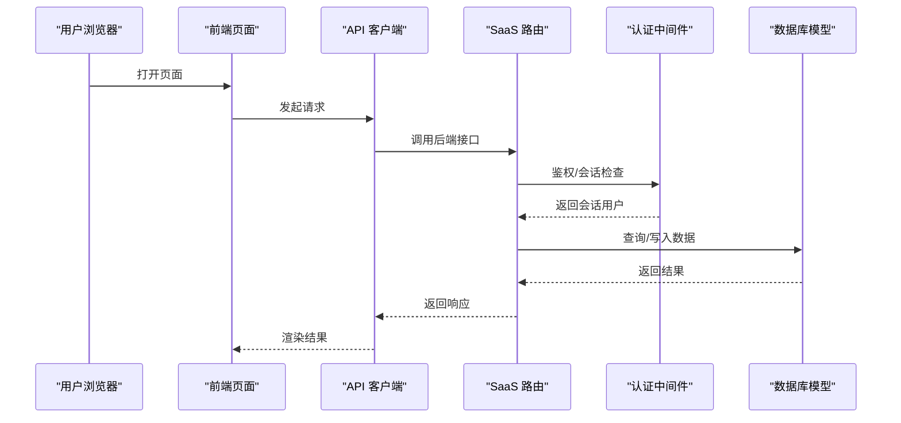
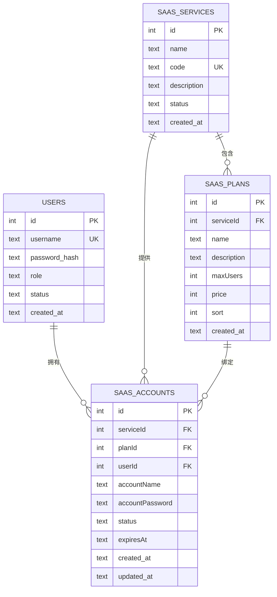
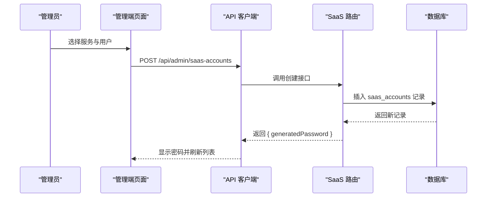
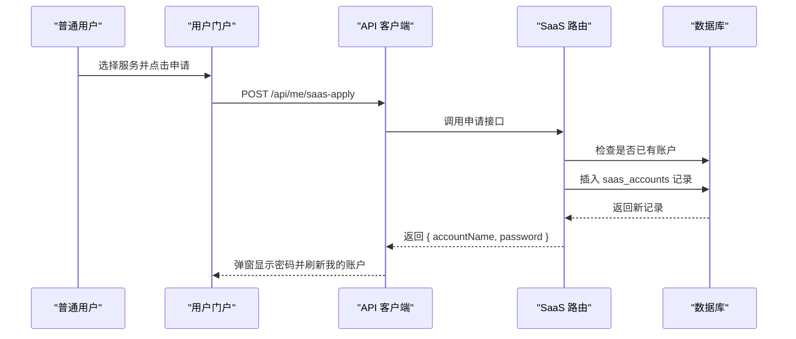
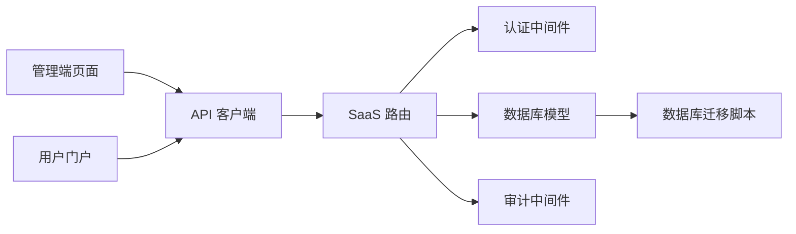

# SaaS账户管理

<cite>
**本文引用的文件**
- [apps/server/src/routes/saas.ts](file://apps/server/src/routes/saas.ts)
- [apps/server/src/db/schema.ts](file://apps/server/src/db/schema.ts)
- [apps/server/src/middleware/auth.ts](file://apps/server/src/middleware/auth.ts)
- [apps/server/src/middleware/audit.ts](file://apps/server/src/middleware/audit.ts)
- [apps/web/src/pages/admin/SaasManage.tsx](file://apps/web/src/pages/admin/SaasManage.tsx)
- [apps/web/src/pages/SaasPortal.tsx](file://apps/web/src/pages/SaasPortal.tsx)
- [apps/web/src/lib/api.ts](file://apps/web/src/lib/api.ts)
- [apps/server/drizzle/0002_special_medusa.sql](file://apps/server/drizzle/0002_special_medusa.sql)
</cite>

## 目录
1. [简介](#简介)
2. [项目结构](#项目结构)
3. [核心组件](#核心组件)
4. [架构总览](#架构总览)
5. [详细组件分析](#详细组件分析)
6. [依赖分析](#依赖分析)
7. [性能考量](#性能考量)
8. [故障排查指南](#故障排查指南)
9. [结论](#结论)
10. [附录](#附录)

## 简介
本文件为 ZBH2 平台的 SaaS 账户管理功能提供详细的 API 文档与架构说明。内容覆盖：
- 账户生命周期管理：创建、密码重置、状态控制、查询
- 自动密码生成策略
- 账户与用户、服务、套餐的关联关系
- 管理端与用户端的接口差异
- 请求/响应示例与最佳实践
- 安全与审计要点

## 项目结构
SaaS 账户管理由服务端路由、数据库模型、认证中间件与前端页面共同组成：
- 服务端路由：定义所有 SaaS 相关 API
- 数据库模型：定义 saas_services、saas_plans、saas_accounts 及其关联
- 认证中间件：鉴权与会话加载
- 前端页面：管理端与用户端界面，调用对应 API

图表来源
- [apps/web/src/pages/admin/SaasManage.tsx:1-169](file://apps/web/src/pages/admin/SaasManage.tsx#L1-L169)
- [apps/web/src/pages/SaasPortal.tsx:1-97](file://apps/web/src/pages/SaasPortal.tsx#L1-L97)
- [apps/web/src/lib/api.ts:1-16](file://apps/web/src/lib/api.ts#L1-L16)
- [apps/server/src/routes/saas.ts:14-159](file://apps/server/src/routes/saas.ts#L14-L159)
- [apps/server/src/middleware/auth.ts:17-55](file://apps/server/src/middleware/auth.ts#L17-L55)
- [apps/server/src/middleware/audit.ts:3-27](file://apps/server/src/middleware/audit.ts#L3-L27)
- [apps/server/src/db/schema.ts:171-203](file://apps/server/src/db/schema.ts#L171-L203)

章节来源
- [apps/server/src/routes/saas.ts:14-159](file://apps/server/src/routes/saas.ts#L14-L159)
- [apps/server/src/db/schema.ts:171-203](file://apps/server/src/db/schema.ts#L171-L203)
- [apps/server/src/middleware/auth.ts:17-55](file://apps/server/src/middleware/auth.ts#L17-L55)
- [apps/web/src/pages/admin/SaasManage.tsx:1-169](file://apps/web/src/pages/admin/SaasManage.tsx#L1-L169)
- [apps/web/src/pages/SaasPortal.tsx:1-97](file://apps/web/src/pages/SaasPortal.tsx#L1-L97)
- [apps/web/src/lib/api.ts:1-16](file://apps/web/src/lib/api.ts#L1-L16)

## 核心组件
- SaaS 路由模块：提供管理端与用户端的 SaaS 服务、套餐、账户相关接口
- 数据库模型：saas_services、saas_plans、saas_accounts 三表及关联
- 认证中间件：requireAuth、requireAdmin、loadSession
- 审计中间件：logAudit
- 前端页面：管理端 SaasManage.tsx、用户门户 SaasPortal.tsx

章节来源
- [apps/server/src/routes/saas.ts:14-159](file://apps/server/src/routes/saas.ts#L14-L159)
- [apps/server/src/db/schema.ts:171-203](file://apps/server/src/db/schema.ts#L171-L203)
- [apps/server/src/middleware/auth.ts:17-55](file://apps/server/src/middleware/auth.ts#L17-L55)
- [apps/server/src/middleware/audit.ts:3-27](file://apps/server/src/middleware/audit.ts#L3-L27)
- [apps/web/src/pages/admin/SaasManage.tsx:1-169](file://apps/web/src/pages/admin/SaasManage.tsx#L1-L169)
- [apps/web/src/pages/SaasPortal.tsx:1-97](file://apps/web/src/pages/SaasPortal.tsx#L1-L97)

## 架构总览
SaaS 账户管理采用前后端分离架构：
- 前端通过 api.ts 统一发起 /api 前缀的请求
- 后端路由按权限区分：管理端（需要管理员）与用户端（需登录）
- 数据库层以 saas_services -> saas_plans -> saas_accounts 的外键关系组织数据

图表来源
- [apps/web/src/lib/api.ts:1-16](file://apps/web/src/lib/api.ts#L1-L16)
- [apps/server/src/routes/saas.ts:14-159](file://apps/server/src/routes/saas.ts#L14-L159)
- [apps/server/src/middleware/auth.ts:17-55](file://apps/server/src/middleware/auth.ts#L17-L55)
- [apps/server/src/db/schema.ts:171-203](file://apps/server/src/db/schema.ts#L171-L203)

## 详细组件分析

### 数据模型与关系
saas_services、saas_plans、saas_accounts 三表通过外键建立如下关系：
- saas_services.id -> saas_plans.serviceId
- saas_services.id -> saas_accounts.serviceId
- users.id -> saas_accounts.userId

图表来源
- [apps/server/src/db/schema.ts:3-10](file://apps/server/src/db/schema.ts#L3-L10)
- [apps/server/src/db/schema.ts:171-203](file://apps/server/src/db/schema.ts#L171-L203)

章节来源
- [apps/server/src/db/schema.ts:171-203](file://apps/server/src/db/schema.ts#L171-L203)

### 密码生成机制
- 自动生成 12 位字符的随机密码，字符集排除易混淆字符，确保安全性
- 仅在创建或重置时生成新密码，返回给调用方

章节来源
- [apps/server/src/routes/saas.ts:7-12](file://apps/server/src/routes/saas.ts#L7-L12)

### 管理端接口（管理员）

#### 获取服务与套餐
- GET /api/admin/saas-services
  - 返回服务列表及其关联套餐
- POST /api/admin/saas-services
  - 创建新服务
- PUT /api/admin/saas-services/:id
  - 更新服务字段（name/code/description/status）

- POST /api/admin/saas-plans
  - 创建套餐
- PUT /api/admin/saas-plans/:id
  - 更新套餐字段（name/description/maxUsers/price/sort）
- DELETE /api/admin/saas-plans/:id
  - 删除套餐

章节来源
- [apps/server/src/routes/saas.ts:16-71](file://apps/server/src/routes/saas.ts#L16-L71)

#### 账户管理
- GET /api/admin/saas-accounts
  - 管理员查询所有账户，包含用户、服务名称等关联信息
- POST /api/admin/saas-accounts
  - 手动为指定用户开通账户，自动生成密码并返回
  - 参数：serviceId、planId（可选）、userId、accountName（可选）
  - 返回：生成的明文密码（仅首次返回）
- POST /api/admin/saas-accounts/:id/reset-password
  - 重置指定账户密码，返回新密码
- PUT /api/admin/saas-accounts/:id
  - 更新账户状态与套餐绑定（status、planId）

章节来源
- [apps/server/src/routes/saas.ts:74-120](file://apps/server/src/routes/saas.ts#L74-L120)

### 用户端接口（登录用户）

#### 服务与账户查询
- GET /api/public/saas-services
  - 返回状态为“启用”的服务及其套餐
- POST /api/me/saas-apply
  - 用户申请服务账户（若已存在则冲突）
  - 返回：账户名与生成的明文密码（仅首次）
- GET /api/me/saas-accounts
  - 查询当前用户的账户列表（含服务名、套餐名）

章节来源
- [apps/server/src/routes/saas.ts:123-158](file://apps/server/src/routes/saas.ts#L123-L158)

### 前端交互流程

#### 管理端：手动开通账户

图表来源
- [apps/web/src/pages/admin/SaasManage.tsx:53-59](file://apps/web/src/pages/admin/SaasManage.tsx#L53-L59)
- [apps/server/src/routes/saas.ts:89-100](file://apps/server/src/routes/saas.ts#L89-L100)

#### 用户门户：申请账户

图表来源
- [apps/web/src/pages/SaasPortal.tsx:31-40](file://apps/web/src/pages/SaasPortal.tsx#L31-L40)
- [apps/server/src/routes/saas.ts:132-146](file://apps/server/src/routes/saas.ts#L132-L146)

### 权限与会话
- requireAuth：要求已登录
- requireAdmin：要求管理员角色
- loadSession：从 Cookie 中读取会话，校验未过期且用户状态为“active”

章节来源
- [apps/server/src/middleware/auth.ts:17-55](file://apps/server/src/middleware/auth.ts#L17-L55)

### 审计与日志
- 提供 logAudit 方法用于记录审计日志，包含用户、动作、目标类型、IP、UA、结果等
- 可用于追踪账户创建、密码重置、状态变更等关键操作

章节来源
- [apps/server/src/middleware/audit.ts:3-27](file://apps/server/src/middleware/audit.ts#L3-L27)

## 依赖分析
- 路由依赖认证中间件进行权限控制
- 路由依赖数据库模型进行数据访问
- 前端通过 api.ts 统一访问 /api 接口
- 数据库迁移脚本定义了审计日志表结构

图表来源
- [apps/web/src/lib/api.ts:1-16](file://apps/web/src/lib/api.ts#L1-L16)
- [apps/server/src/routes/saas.ts:14-159](file://apps/server/src/routes/saas.ts#L14-L159)
- [apps/server/src/middleware/auth.ts:17-55](file://apps/server/src/middleware/auth.ts#L17-L55)
- [apps/server/src/middleware/audit.ts:3-27](file://apps/server/src/middleware/audit.ts#L3-L27)
- [apps/server/drizzle/0002_special_medusa.sql:1-125](file://apps/server/drizzle/0002_special_medusa.sql#L1-L125)

章节来源
- [apps/server/src/routes/saas.ts:14-159](file://apps/server/src/routes/saas.ts#L14-L159)
- [apps/server/src/middleware/auth.ts:17-55](file://apps/server/src/middleware/auth.ts#L17-L55)
- [apps/server/src/middleware/audit.ts:3-27](file://apps/server/src/middleware/audit.ts#L3-L27)
- [apps/web/src/lib/api.ts:1-16](file://apps/web/src/lib/api.ts#L1-L16)
- [apps/server/drizzle/0002_special_medusa.sql:1-125](file://apps/server/drizzle/0002_special_medusa.sql#L1-L125)

## 性能考量
- 查询优化：账户列表查询使用 LEFT JOIN，建议在 saas_accounts.userId/serviceId/planId 上建立索引以提升排序与过滤性能
- 写入优化：密码生成与插入为单事务，避免频繁小事务
- 前端缓存：管理端与用户端可对服务与套餐列表做本地缓存，减少重复请求
- 分页与排序：账户列表默认按创建时间倒序，建议在管理端使用分页参数

[本节为通用指导，不直接分析具体文件]

## 故障排查指南
- 401 未登录：确认会话 Cookie 是否正确传递，检查 loadSession 逻辑
- 403 权限不足：确认用户角色为管理员
- 404 用户不存在：创建账户时传入的 userId 无效
- 409 已拥有账户：用户重复申请同一服务
- 密码可见性：仅在创建/重置时返回明文密码，请确保前端安全提示与及时清理

章节来源
- [apps/server/src/middleware/auth.ts:42-55](file://apps/server/src/middleware/auth.ts#L42-L55)
- [apps/server/src/routes/saas.ts:92-93](file://apps/server/src/routes/saas.ts#L92-L93)
- [apps/server/src/routes/saas.ts:137](file://apps/server/src/routes/saas.ts#L137)

## 结论
SaaS 账户管理模块通过清晰的路由分层（管理端/用户端）、严谨的数据模型与完善的权限控制，实现了从服务配置到账户生命周期的完整闭环。配合审计日志与前端交互，既保证了可用性也兼顾了安全性。

[本节为总结性内容，不直接分析具体文件]

## 附录

### 请求/响应示例

- 获取服务与套餐（管理端）
  - 请求：GET /api/admin/saas-services
  - 响应：包含服务数组，每个服务包含 plans 字段

- 创建服务（管理端）
  - 请求：POST /api/admin/saas-services
  - 请求体：{ name, code, description? }
  - 响应：{ success: true, data: 新建服务对象 }

- 更新服务（管理端）
  - 请求：PUT /api/admin/saas-services/:id
  - 请求体：{ name?, code?, description?, status? }
  - 响应：{ success: true }

- 创建套餐（管理端）
  - 请求：POST /api/admin/saas-plans
  - 请求体：{ serviceId, name, description?, maxUsers?, price?, sort? }
  - 响应：{ success: true, data: 新建套餐对象 }

- 更新套餐（管理端）
  - 请求：PUT /api/admin/saas-plans/:id
  - 请求体：{ name?, description?, maxUsers?, price?, sort? }
  - 响应：{ success: true }

- 删除套餐（管理端）
  - 请求：DELETE /api/admin/saas-plans/:id
  - 响应：{ success: true }

- 查询账户（管理端）
  - 请求：GET /api/admin/saas-accounts
  - 响应：包含账户数组，包含用户名、服务名等关联信息

- 手动开通账户（管理端）
  - 请求：POST /api/admin/saas-accounts
  - 请求体：{ serviceId, planId?, userId, accountName? }
  - 响应：{ success: true, data: { ...账户, generatedPassword } }

- 重置密码（管理端）
  - 请求：POST /api/admin/saas-accounts/:id/reset-password
  - 响应：{ success: true, data: { newPassword } }

- 更新账户（管理端）
  - 请求：PUT /api/admin/saas-accounts/:id
  - 请求体：{ status?, planId? }
  - 响应：{ success: true }

- 获取公开服务（用户门户）
  - 请求：GET /api/public/saas-services
  - 响应：包含服务数组，仅返回状态为“启用”的服务

- 申请账户（用户端）
  - 请求：POST /api/me/saas-apply
  - 请求体：{ serviceId, planId? }
  - 响应：{ success: true, data: { accountName, password } }

- 查询我的账户（用户端）
  - 请求：GET /api/me/saas-accounts
  - 响应：包含账户数组，包含服务名、套餐名等

章节来源
- [apps/server/src/routes/saas.ts:16-158](file://apps/server/src/routes/saas.ts#L16-L158)

### 安全与最佳实践
- 密码处理：仅在创建/重置时返回明文密码；前端应提示用户立即记录并清理
- 权限控制：管理端接口统一 requireAdmin，用户端接口统一 requireAuth
- 审计日志：建议对关键操作（创建、重置、状态变更）记录审计日志
- 输入校验：建议在路由层增加输入校验（如 zod），防止异常数据进入数据库
- 会话安全：确保 Cookie 安全传输与过期控制，结合 requireAuth 与 loadSession

章节来源
- [apps/server/src/middleware/auth.ts:42-55](file://apps/server/src/middleware/auth.ts#L42-L55)
- [apps/server/src/middleware/audit.ts:3-27](file://apps/server/src/middleware/audit.ts#L3-L27)
- [apps/web/src/lib/api.ts:1-16](file://apps/web/src/lib/api.ts#L1-L16)