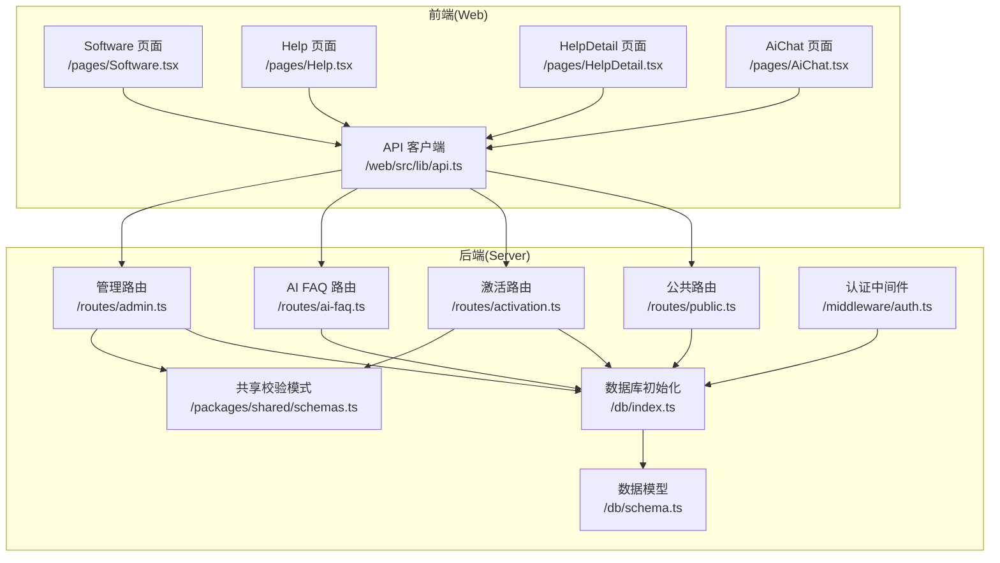
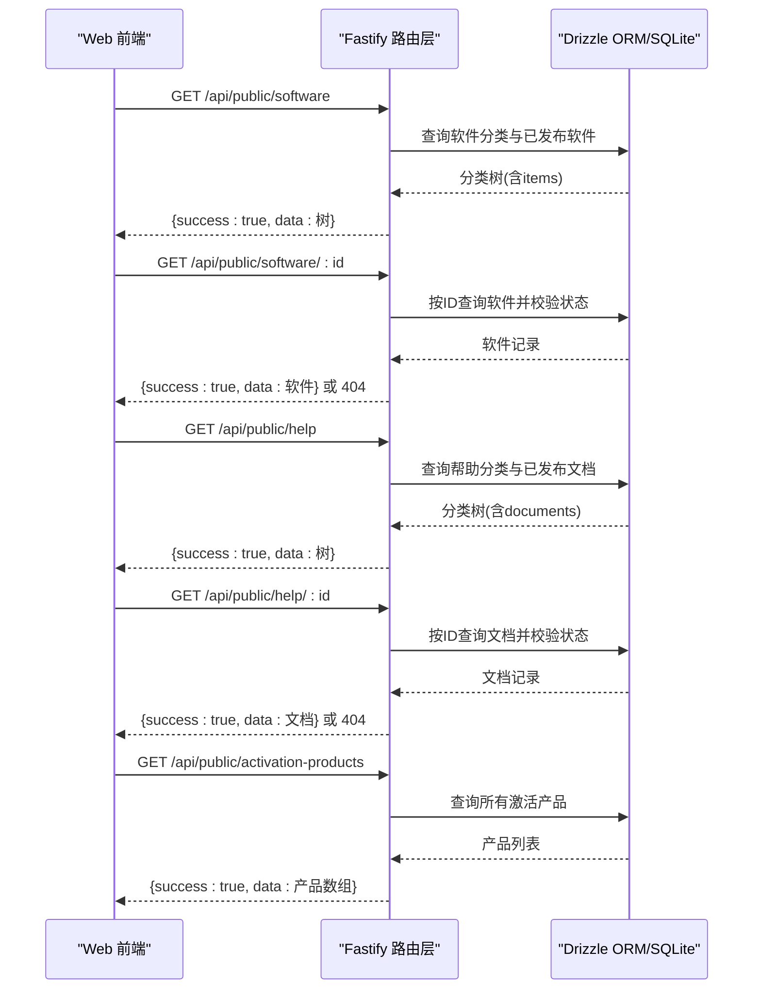
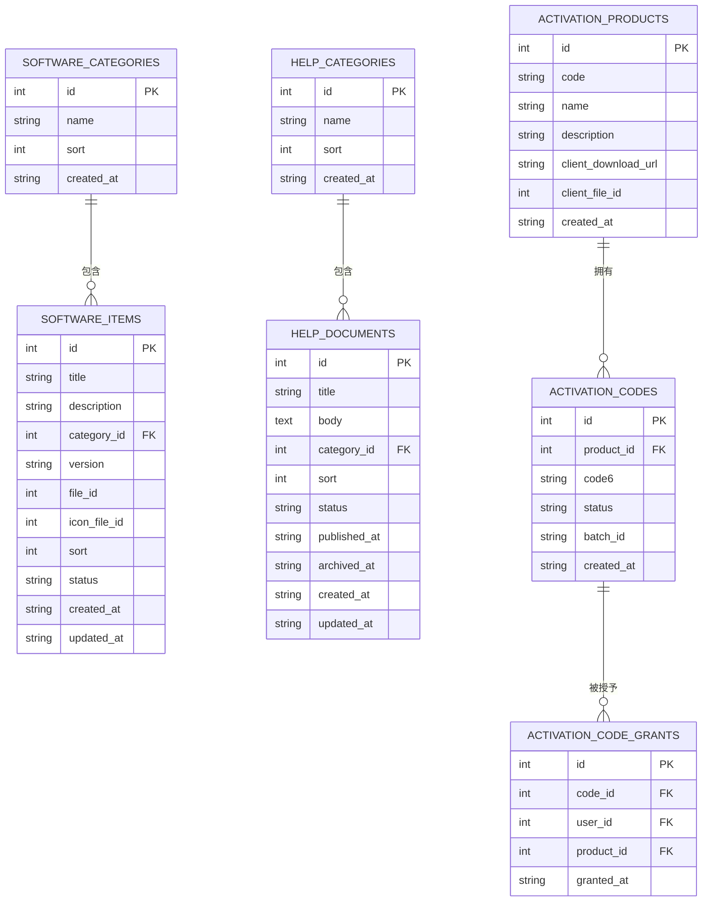
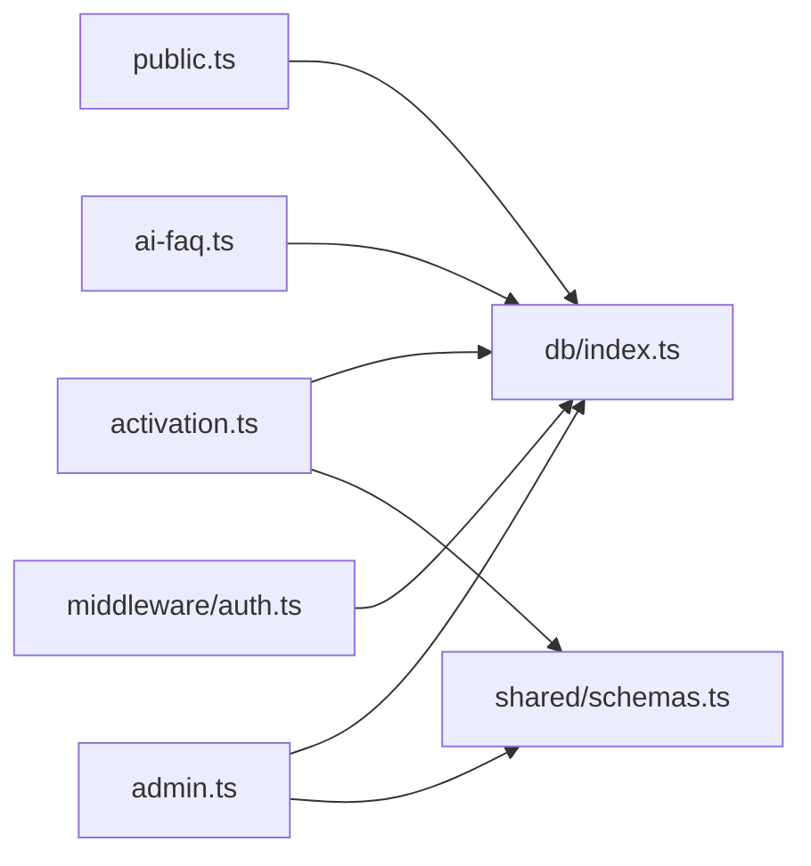

# 公共API

<cite>
**本文引用的文件**
- [apps/server/src/routes/public.ts](file://apps/server/src/routes/public.ts)
- [apps/server/src/routes/activation.ts](file://apps/server/src/routes/activation.ts)
- [apps/server/src/routes/ai-faq.ts](file://apps/server/src/routes/ai-faq.ts)
- [apps/server/src/routes/admin.ts](file://apps/server/src/routes/admin.ts)
- [apps/server/src/db/schema.ts](file://apps/server/src/db/schema.ts)
- [packages/shared/src/schemas.ts](file://packages/shared/src/schemas.ts)
- [apps/server/src/middleware/auth.ts](file://apps/server/src/middleware/auth.ts)
- [apps/server/src/db/index.ts](file://apps/server/src/db/index.ts)
- [apps/web/src/pages/Software.tsx](file://apps/web/src/pages/Software.tsx)
- [apps/web/src/pages/Help.tsx](file://apps/web/src/pages/Help.tsx)
- [apps/web/src/pages/HelpDetail.tsx](file://apps/web/src/pages/HelpDetail.tsx)
- [apps/web/src/pages/AiChat.tsx](file://apps/web/src/pages/AiChat.tsx)
- [apps/web/src/lib/api.ts](file://apps/web/src/lib/api.ts)
</cite>

## 目录
1. [简介](#简介)
2. [项目结构](#项目结构)
3. [核心组件](#核心组件)
4. [架构总览](#架构总览)
5. [详细组件分析](#详细组件分析)
6. [依赖关系分析](#依赖关系分析)
7. [性能考量](#性能考量)
8. [故障排查指南](#故障排查指南)
9. [结论](#结论)
10. [附录](#附录)

## 简介
本文件为 ZBH2 平台公共 API 的权威接口文档，覆盖以下主题：
- 软件列表查询接口：分页参数、排序规则、过滤条件
- 软件详情获取接口：参数校验与返回格式
- 帮助文档查询接口：分类筛选与搜索能力
- FAQ 知识库接口：分类管理与内容展示
- 激活产品查询接口：产品状态检查与可用性验证
- 请求/响应示例：正常查询、无结果、参数错误等场景
- 缓存策略、性能优化与 API 限流建议
- 数据模型与字段定义参考

## 项目结构
后端采用 Fastify + Drizzle ORM + SQLite，公共 API 主要位于公共路由模块；前端通过统一的 axios 实例调用 /api 前缀路径。

图表来源
- [apps/web/src/pages/Software.tsx:27-31](file://apps/web/src/pages/Software.tsx#L27-L31)
- [apps/web/src/pages/Help.tsx:25-27](file://apps/web/src/pages/Help.tsx#L25-L27)
- [apps/web/src/pages/HelpDetail.tsx:16-18](file://apps/web/src/pages/HelpDetail.tsx#L16-L18)
- [apps/web/src/pages/AiChat.tsx:33-49](file://apps/web/src/pages/AiChat.tsx#L33-L49)
- [apps/web/src/lib/api.ts:3](file://apps/web/src/lib/api.ts#L3)
- [apps/server/src/routes/public.ts:7-50](file://apps/server/src/routes/public.ts#L7-L50)
- [apps/server/src/routes/activation.ts:8-93](file://apps/server/src/routes/activation.ts#L8-L93)
- [apps/server/src/routes/ai-faq.ts:43-98](file://apps/server/src/routes/ai-faq.ts#L43-L98)
- [apps/server/src/routes/admin.ts:161-176](file://apps/server/src/routes/admin.ts#L161-L176)
- [apps/server/src/middleware/auth.ts:17-46](file://apps/server/src/middleware/auth.ts#L17-L46)
- [apps/server/src/db/index.ts:10-14](file://apps/server/src/db/index.ts#L10-L14)
- [apps/server/src/db/schema.ts:19-88](file://apps/server/src/db/schema.ts#L19-L88)
- [packages/shared/src/schemas.ts:48-50](file://packages/shared/src/schemas.ts#L48-L50)

章节来源
- [apps/server/src/routes/public.ts:7-50](file://apps/server/src/routes/public.ts#L7-L50)
- [apps/server/src/routes/activation.ts:8-93](file://apps/server/src/routes/activation.ts#L8-L93)
- [apps/server/src/routes/ai-faq.ts:43-98](file://apps/server/src/routes/ai-faq.ts#L43-L98)
- [apps/server/src/routes/admin.ts:161-176](file://apps/server/src/routes/admin.ts#L161-L176)
- [apps/server/src/db/schema.ts:19-88](file://apps/server/src/db/schema.ts#L19-L88)
- [apps/web/src/lib/api.ts:3](file://apps/web/src/lib/api.ts#L3)

## 核心组件
- 公共软件接口：提供按分类聚合的软件列表与详情查询
- 公共帮助文档接口：提供按分类聚合的帮助文档列表与详情查询
- 激活产品接口：公开列出可激活的产品
- AI FAQ 接口：公共聊天与 FAQ 匹配
- 管理后台接口：用于分页、过滤与批量导入激活码（非公共）

章节来源
- [apps/server/src/routes/public.ts:7-50](file://apps/server/src/routes/public.ts#L7-L50)
- [apps/server/src/routes/ai-faq.ts:43-98](file://apps/server/src/routes/ai-faq.ts#L43-L98)
- [apps/server/src/routes/admin.ts:161-176](file://apps/server/src/routes/admin.ts#L161-L176)

## 架构总览
公共 API 的典型调用链路如下：

图表来源
- [apps/server/src/routes/public.ts:7-50](file://apps/server/src/routes/public.ts#L7-L50)
- [apps/server/src/db/schema.ts:37-88](file://apps/server/src/db/schema.ts#L37-L88)

## 详细组件分析

### 公共软件接口
- 列表接口
  - 方法与路径：GET /api/public/software
  - 功能：返回按 sort 升序排列的软件分类树，每个分类包含其下已发布软件（按 sort 升序）
  - 响应结构：success 字段表示是否成功；data 为数组，元素包含分类信息与 items 子数组
  - 关键点：仅返回 status=published 的软件项
- 详情接口
  - 方法与路径：GET /api/public/software/:id
  - 参数：id（字符串类型，内部转换为数字）
  - 行为：按 ID 查询软件，若不存在或状态非已发布则返回 404，并携带错误信息
  - 成功时返回 {success:true, data:软件记录}
- 分页与排序
  - 当前实现未提供分页参数；返回全部已发布软件
  - 排序依据：分类与软件均按 sort 字段升序
- 过滤条件
  - 默认仅返回已发布软件（status=published）
  - 可在业务侧对返回的 items 进行二次过滤（如按版本、类别等），但当前接口不直接支持参数化过滤

请求/响应示例
- 正常查询
  - 请求：GET /api/public/software
  - 响应：{success:true, data:[{id, name, sort, items:[{id,title,version,...}]}, ...]}
- 无结果
  - 请求：GET /api/public/software
  - 响应：{success:true, data:[]}（无软件时返回空数组）
- 参数错误
  - 请求：GET /api/public/software/abc（id 非数字）
  - 响应：404 + {success:false, error:"未找到软件"}

章节来源
- [apps/server/src/routes/public.ts:7-24](file://apps/server/src/routes/public.ts#L7-L24)
- [apps/server/src/db/schema.ts:37-49](file://apps/server/src/db/schema.ts#L37-L49)

### 公共帮助文档接口
- 列表接口
  - 方法与路径：GET /api/public/help
  - 功能：返回按 sort 升序排列的帮助分类树，每个分类包含其下已发布文档（按 sort 升序）
  - 响应结构：success 字段表示是否成功；data 为数组，元素包含分类信息与 documents 子数组
  - 关键点：仅返回 status=published 的文档
- 详情接口
  - 方法与路径：GET /api/public/help/:id
  - 参数：id（字符串类型，内部转换为数字）
  - 行为：按 ID 查询文档，若不存在或状态非已发布则返回 404，并携带错误信息
  - 成功时返回 {success:true, data:文档记录}
- 分页与排序
  - 当前实现未提供分页参数；返回全部已发布文档
  - 排序依据：分类与文档均按 sort 字段升序
- 过滤条件
  - 默认仅返回已发布文档（status=published）
  - 可在业务侧对返回的 documents 进行二次过滤，但当前接口不直接支持参数化过滤

请求/响应示例
- 正常查询
  - 请求：GET /api/public/help
  - 响应：{success:true, data:[{id, name, sort, documents:[{id,title,...}]}, ...]}
- 无结果
  - 请求：GET /api/public/help
  - 响应：{success:true, data:[]}（无文档时返回空数组）
- 参数错误
  - 请求：GET /api/public/help/abc（id 非数字）
  - 响应：404 + {success:false, error:"未找到文档"}

章节来源
- [apps/server/src/routes/public.ts:26-44](file://apps/server/src/routes/public.ts#L26-L44)
- [apps/server/src/db/schema.ts:58-69](file://apps/server/src/db/schema.ts#L58-L69)

### FAQ 知识库接口
- 管理端接口（非公共）
  - 获取 FAQ：GET /api/admin/faq（按 sort 升序）
  - 新增 FAQ：POST /api/admin/faq（body 包含 question, answer, keywords?, category?, sort?）
  - 更新 FAQ：PUT /api/admin/faq/:id（按需更新字段）
  - 删除 FAQ：DELETE /api/admin/faq/:id
- 公共接口
  - AI 聊天与 FAQ 匹配：POST /api/public/ai-chat
  - 请求体：{message:string}
  - 行为：对消息进行关键词匹配，返回最高分答案及候选问题；当无匹配时返回提示语
  - 响应：{success:true, data:{reply:string, matches:[{id, question, category}]}}
  - 特殊情况：message 为空或纯空白时，返回提示语与空匹配

请求/响应示例
- 正常查询
  - 请求：POST /api/public/ai-chat {message:"激活"}
  - 响应：{success:true, data:{reply:"...", matches:[...]}}
- 无结果
  - 请求：POST /api/public/ai-chat {message:"xyz"}
  - 响应：{success:true, data:{reply:"...", matches:[]}}
- 参数错误
  - 请求：POST /api/public/ai-chat（缺少 message）
  - 响应：{success:true, data:{reply:"请输入您的问题，我会尽力为您解答。", matches:[]}}

章节来源
- [apps/server/src/routes/ai-faq.ts:8-40](file://apps/server/src/routes/ai-faq.ts#L8-L40)
- [apps/server/src/routes/ai-faq.ts:43-98](file://apps/server/src/routes/ai-faq.ts#L43-L98)
- [apps/server/src/db/schema.ts:206-214](file://apps/server/src/db/schema.ts#L206-L214)

### 激活产品查询接口
- 公开产品列表
  - 方法与路径：GET /api/public/activation-products
  - 行为：返回所有激活产品（不进行状态过滤）
  - 响应：{success:true, data:[{id, code, name, description, clientDownloadUrl, clientFileId, createdAt}, ...]}
- 产品状态检查与可用性验证（用户端）
  - 方法与路径：POST /api/me/activation-codes/claim（需登录）
  - 请求体：{productId:number}
  - 校验逻辑：
    - 使用共享校验模式对 productId 进行整数与正数校验
    - 查询产品是否存在
    - 检查用户是否已拥有该产品的激活授权（幂等）
    - 查找可用的激活码（status=available）
    - 若无可用激活码，返回冲突错误
    - 成功后更新激活码状态为 granted，并写入授权记录
  - 响应：{success:true, data:{code6:string, alreadyClaimed:boolean}}

请求/响应示例
- 正常查询
  - 请求：GET /api/public/activation-products
  - 响应：{success:true, data:[...]}
- 无结果
  - 请求：GET /api/public/activation-products
  - 响应：{success:true, data:[]}
- 参数错误
  - 请求：POST /api/me/activation-codes/claim {productId:-1}
  - 响应：400 + {success:false, error:"请提供有效的产品ID"}
- 无可用激活码
  - 请求：POST /api/me/activation-codes/claim {productId:1}
  - 响应：409 + {success:false, error:"暂无可用激活码，请联系管理员"}

章节来源
- [apps/server/src/routes/public.ts:46-50](file://apps/server/src/routes/public.ts#L46-L50)
- [apps/server/src/routes/activation.ts:8-75](file://apps/server/src/routes/activation.ts#L8-L75)
- [packages/shared/src/schemas.ts:48-50](file://packages/shared/src/schemas.ts#L48-L50)

### 数据模型与字段定义
- 软件分类（softwareCategories）：id, name, sort, createdAt
- 软件条目（softwareItems）：id, title, description, categoryId, version, fileId, iconFileId, sort, status, createdAt, updatedAt
- 帮助分类（helpCategories）：id, name, sort, createdAt
- 帮助文档（helpDocuments）：id, title, body, categoryId, sort, status, publishedAt, archivedAt, createdAt, updatedAt
- 激活产品（activationProducts）：id, code, name, description, clientDownloadUrl, clientFileId, createdAt
- 激活码（activationCodes）：id, productId, code6, status, batchId, createdAt
- 激活授权（activationCodeGrants）：id, codeId, userId, productId, grantedAt

图表来源
- [apps/server/src/db/schema.ts:19-88](file://apps/server/src/db/schema.ts#L19-L88)

## 依赖关系分析
- 路由到数据库
  - 公共路由依赖 Drizzle ORM 查询数据库
  - 管理路由同样依赖 Drizzle ORM，且包含分页与过滤逻辑
- 认证与授权
  - 用户端激活接口需要登录态（requireAuth），管理端接口需要管理员权限（requireAdmin）
- 共享校验
  - 激活接口使用共享校验模式（productId）进行参数校验
- 前端调用
  - 所有 API 请求以 /api 为前缀，使用带凭据的 axios 实例

图表来源
- [apps/server/src/routes/public.ts:1-5](file://apps/server/src/routes/public.ts#L1-L5)
- [apps/server/src/routes/activation.ts:1-5](file://apps/server/src/routes/activation.ts#L1-L5)
- [apps/server/src/routes/ai-faq.ts:1-4](file://apps/server/src/routes/ai-faq.ts#L1-L4)
- [apps/server/src/routes/admin.ts:1-13](file://apps/server/src/routes/admin.ts#L1-L13)
- [apps/server/src/middleware/auth.ts:17-46](file://apps/server/src/middleware/auth.ts#L17-L46)
- [apps/server/src/db/index.ts:10-14](file://apps/server/src/db/index.ts#L10-L14)
- [packages/shared/src/schemas.ts:48-50](file://packages/shared/src/schemas.ts#L48-L50)

章节来源
- [apps/server/src/middleware/auth.ts:17-55](file://apps/server/src/middleware/auth.ts#L17-L55)
- [apps/server/src/db/index.ts:10-14](file://apps/server/src/db/index.ts#L10-L14)

## 性能考量
- 当前实现
  - 软件与帮助文档列表未实现分页，一次性加载全部已发布条目，适合中低规模数据
  - 激活码列表在管理端实现了分页与过滤（productId/page/pageSize），默认每页 20 条，最大 100 条
- 建议优化
  - 列表接口增加分页参数（page/pageSize）与排序参数（sortField/sortOrder）
  - 对高频查询添加数据库索引（如 status、categoryId、createdAt 等）
  - 引入缓存层（如 Redis）缓存分类树与热门文档，设置合理过期时间
  - 对 AI FAQ 匹配逻辑进行评分阈值与返回数量控制，避免高并发下的计算压力
  - 在网关或中间件层实施 API 限流（如基于 IP 或用户维度），防止滥用
- 数据库配置
  - 启用了 WAL 模式与外键约束，有助于并发读取与数据一致性

章节来源
- [apps/server/src/routes/admin.ts:161-176](file://apps/server/src/routes/admin.ts#L161-L176)
- [apps/server/src/db/index.ts:10-14](file://apps/server/src/db/index.ts#L10-L14)

## 故障排查指南
- 404 未找到
  - 软件详情：GET /api/public/software/:id，当 id 不存在或状态非已发布
  - 帮助文档详情：GET /api/public/help/:id，当 id 不存在或状态非已发布
- 400 参数错误
  - 激活认领：POST /api/me/activation-codes/claim，productId 校验失败
- 409 冲突
  - 激活认领：无可用激活码时返回
- 401 未登录
  - 需要登录的接口（如激活认领）未携带有效会话
- 403 权限不足
  - 管理端接口未具备管理员角色

章节来源
- [apps/server/src/routes/public.ts:17-24](file://apps/server/src/routes/public.ts#L17-L24)
- [apps/server/src/routes/public.ts:37-44](file://apps/server/src/routes/public.ts#L37-L44)
- [apps/server/src/routes/activation.ts:9-12](file://apps/server/src/routes/activation.ts#L9-L12)
- [apps/server/src/routes/activation.ts:55-57](file://apps/server/src/routes/activation.ts#L55-L57)
- [apps/server/src/middleware/auth.ts:42-54](file://apps/server/src/middleware/auth.ts#L42-L54)

## 结论
本公共 API 提供了软件与帮助文档的公开浏览能力，以及激活产品的查询与认领流程。当前实现简洁清晰，适合中小规模场景；建议后续引入分页、缓存与限流机制以提升性能与稳定性。管理端接口提供了完善的后台管理能力，包括激活码的分页、过滤与批量导入。

## 附录

### 请求/响应示例汇总
- 软件列表
  - 请求：GET /api/public/software
  - 响应：{success:true, data:[{id,name,sort,items:[{id,title,version,...}]}]}
- 软件详情
  - 请求：GET /api/public/software/1
  - 成功：{success:true, data:{...}}
  - 失败：404 + {success:false, error:"未找到软件"}
- 帮助列表
  - 请求：GET /api/public/help
  - 响应：{success:true, data:[{id,name,sort,documents:[{id,title,...}]}]}
- 帮助详情
  - 请求：GET /api/public/help/1
  - 成功：{success:true, data:{...}}
  - 失败：404 + {success:false, error:"未找到文档"}
- 激活产品列表
  - 请求：GET /api/public/activation-products
  - 响应：{success:true, data:[{id,code,name,...}]}
- 激活认领
  - 请求：POST /api/me/activation-codes/claim {productId:1}
  - 成功：{success:true, data:{code6:"ABCDEF", alreadyClaimed:false}}
  - 参数错误：400 + {success:false, error:"请提供有效的产品ID"}
  - 无可用：409 + {success:false, error:"暂无可用激活码，请联系管理员"}

章节来源
- [apps/server/src/routes/public.ts:7-50](file://apps/server/src/routes/public.ts#L7-L50)
- [apps/server/src/routes/activation.ts:8-75](file://apps/server/src/routes/activation.ts#L8-L75)