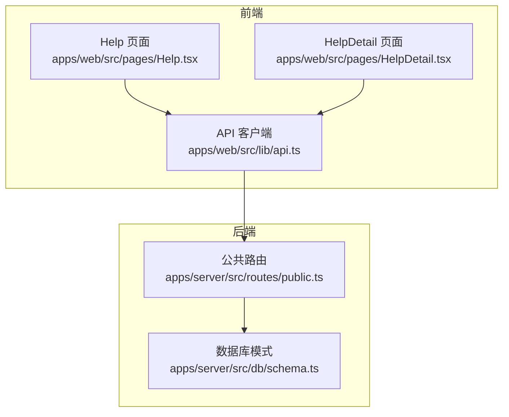
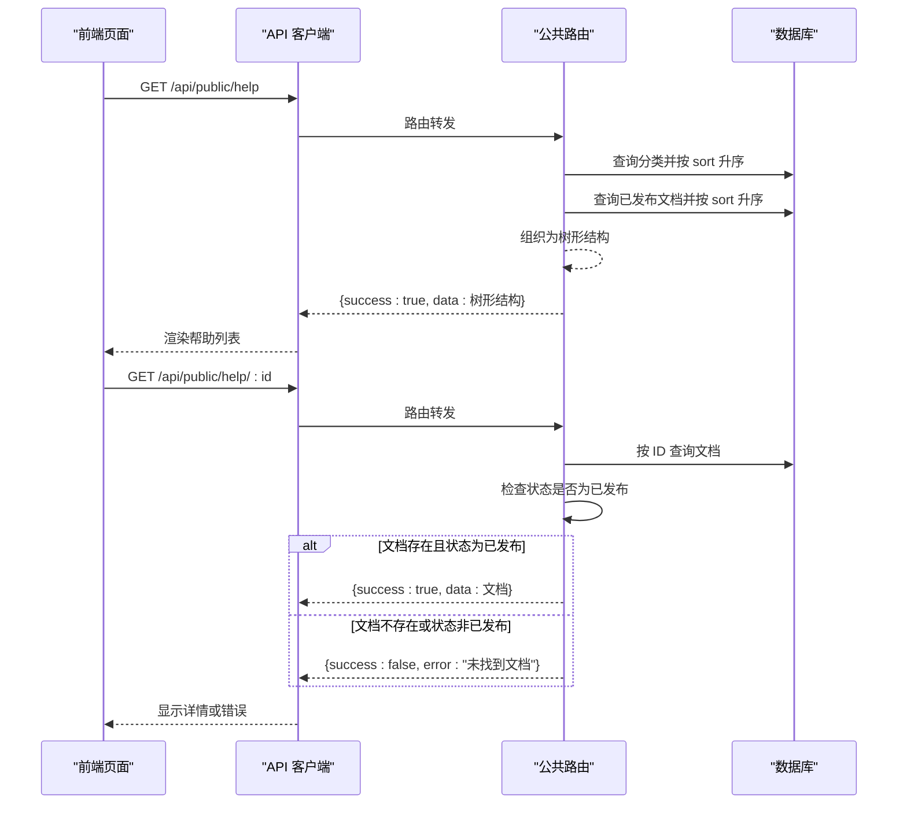
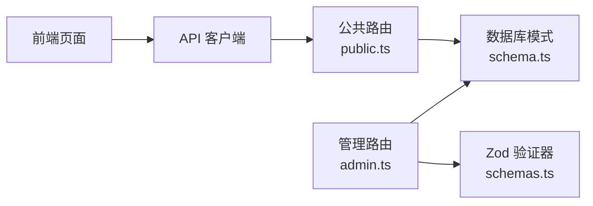

# 帮助文档API

<cite>
**本文档引用的文件**
- [apps/server/src/routes/public.ts](file://apps/server/src/routes/public.ts)
- [apps/server/src/db/schema.ts](file://apps/server/src/db/schema.ts)
- [packages/shared/src/schemas.ts](file://packages/shared/src/schemas.ts)
- [apps/web/src/pages/Help.tsx](file://apps/web/src/pages/Help.tsx)
- [apps/web/src/pages/HelpDetail.tsx](file://apps/web/src/pages/HelpDetail.tsx)
- [apps/web/src/lib/api.ts](file://apps/web/src/lib/api.ts)
</cite>

## 目录
1. [简介](#简介)
2. [项目结构](#项目结构)
3. [核心组件](#核心组件)
4. [架构总览](#架构总览)
5. [详细组件分析](#详细组件分析)
6. [依赖分析](#依赖分析)
7. [性能考虑](#性能考虑)
8. [故障排除指南](#故障排除指南)
9. [结论](#结论)

## 简介
本文件为 ZBH2 平台帮助文档公共 API 的详细接口文档，重点覆盖以下内容：
- 帮助文档分类查询接口（/api/public/help）的返回格式与分类树形结构组织
- 已发布帮助文档的组织方式与排序规则
- 帮助文档详情获取接口（/api/public/help/:id）的参数校验、状态检查与 404 错误处理机制
- 帮助分类与文档的排序字段（sort）逻辑
- 完整的请求/响应示例（正常查询、文档不存在、状态不匹配等）
- 安全考虑与缓存策略建议

## 项目结构
帮助文档相关的核心实现位于后端路由模块与数据库模式定义中，前端页面通过统一的 API 客户端进行调用。

图表来源
- [apps/server/src/routes/public.ts:1-52](file://apps/server/src/routes/public.ts#L1-L52)
- [apps/server/src/db/schema.ts:51-69](file://apps/server/src/db/schema.ts#L51-L69)
- [apps/web/src/pages/Help.tsx:1-60](file://apps/web/src/pages/Help.tsx#L1-L60)
- [apps/web/src/pages/HelpDetail.tsx:1-38](file://apps/web/src/pages/HelpDetail.tsx#L1-L38)
- [apps/web/src/lib/api.ts:1-16](file://apps/web/src/lib/api.ts#L1-L16)

章节来源
- [apps/server/src/routes/public.ts:1-52](file://apps/server/src/routes/public.ts#L1-L52)
- [apps/server/src/db/schema.ts:51-69](file://apps/server/src/db/schema.ts#L51-L69)
- [apps/web/src/pages/Help.tsx:1-60](file://apps/web/src/pages/Help.tsx#L1-L60)
- [apps/web/src/pages/HelpDetail.tsx:1-38](file://apps/web/src/pages/HelpDetail.tsx#L1-L38)
- [apps/web/src/lib/api.ts:1-16](file://apps/web/src/lib/api.ts#L1-L16)

## 核心组件
- 公共路由模块：提供帮助文档分类查询与详情获取两个公开接口
- 数据库模式：定义帮助分类与帮助文档的数据结构、字段类型与约束
- 前端页面：帮助列表页与详情页通过统一 API 客户端调用后端接口

章节来源
- [apps/server/src/routes/public.ts:26-44](file://apps/server/src/routes/public.ts#L26-L44)
- [apps/server/src/db/schema.ts:51-69](file://apps/server/src/db/schema.ts#L51-L69)

## 架构总览
帮助文档 API 的调用链路如下：
- 前端页面通过 API 客户端发起请求
- 后端公共路由根据路径匹配到对应处理器
- 处理器从数据库读取数据，按排序规则组织为树形结构
- 对于详情接口，额外进行状态检查以确保只返回已发布文档

图表来源
- [apps/server/src/routes/public.ts:26-44](file://apps/server/src/routes/public.ts#L26-L44)
- [apps/web/src/lib/api.ts:1-16](file://apps/web/src/lib/api.ts#L1-L16)

## 详细组件分析

### 接口一：帮助文档分类查询（GET /api/public/help）
- 功能概述：返回帮助分类树形结构，每个分类包含其下的已发布帮助文档
- 请求参数：无
- 响应体结构：
  - success: 布尔值，表示请求是否成功
  - data: 数组，元素为分类对象，包含以下字段：
    - id: 分类标识
    - name: 分类名称
    - sort: 排序字段
    - documents: 该分类下的已发布帮助文档数组，元素包含：
      - id: 文档标识
      - title: 文档标题
      - sort: 文档排序字段
- 排序规则：
  - 分类按 sort 升序排列
  - 文档按 sort 升序排列
- 状态过滤：
  - 仅返回状态为已发布的文档
- 示例响应（简化示意）：
  - 成功时返回包含多个分类的数组，每个分类内含 documents 字段
  - 若无任何分类或分类下无已发布文档，documents 可能为空数组

章节来源
- [apps/server/src/routes/public.ts:26-35](file://apps/server/src/routes/public.ts#L26-L35)
- [apps/server/src/db/schema.ts:51-69](file://apps/server/src/db/schema.ts#L51-L69)

### 接口二：帮助文档详情获取（GET /api/public/help/:id）
- 路径参数：
  - id: 文档标识（数字字符串）
- 参数校验与处理：
  - 将路径参数 id 转换为数值后进行查询
- 状态检查与错误处理：
  - 若查询不到文档或文档状态不是已发布，则返回 404，并携带错误信息
- 响应体结构：
  - success: 布尔值，表示请求是否成功
  - data: 文档对象，包含以下字段：
    - id: 文档标识
    - title: 文档标题
    - body: 文档正文
    - categoryId: 所属分类标识
    - sort: 文档排序字段
    - status: 文档状态（draft/published/archived）
    - publishedAt: 发布时间（若已发布）
    - archivedAt: 归档时间（若已归档）
    - createdAt/updatedAt: 创建与更新时间
- 示例响应（简化示意）：
  - 成功时返回完整文档对象
  - 404 时返回 { success: false, error: "未找到文档" }

章节来源
- [apps/server/src/routes/public.ts:37-44](file://apps/server/src/routes/public.ts#L37-L44)
- [apps/server/src/db/schema.ts:58-69](file://apps/server/src/db/schema.ts#L58-L69)

### 前端集成与使用
- 帮助列表页会调用 /api/public/help 获取树形数据并渲染折叠面板
- 详情页会调用 /api/public/help/:id 获取指定文档详情
- API 客户端统一设置基础路径为 /api，并支持凭证传递

章节来源
- [apps/web/src/pages/Help.tsx:21-60](file://apps/web/src/pages/Help.tsx#L21-L60)
- [apps/web/src/pages/HelpDetail.tsx:10-38](file://apps/web/src/pages/HelpDetail.tsx#L10-L38)
- [apps/web/src/lib/api.ts:1-16](file://apps/web/src/lib/api.ts#L1-L16)

### 数据模型与字段说明
- 帮助分类（help_categories）
  - id: 主键
  - name: 名称
  - sort: 排序字段，默认 0
  - createdAt: 创建时间
- 帮助文档（help_documents）
  - id: 主键
  - title: 标题
  - body: 正文
  - categoryId: 关联分类外键
  - sort: 排序字段，默认 0
  - status: 状态枚举（draft/published/archived），默认 draft
  - publishedAt: 发布时间（当状态为已发布时写入）
  - archivedAt: 归档时间（当状态为归档时写入）
  - createdAt/updatedAt: 创建与更新时间

章节来源
- [apps/server/src/db/schema.ts:51-69](file://apps/server/src/db/schema.ts#L51-L69)

### 参数验证与状态管理
- 参数验证（后端路由层）
  - 路由层对路径参数进行类型转换（字符串转数值）
  - 未见显式使用输入验证库对参数进行严格校验
- 输入验证（管理端）
  - 管理端使用 Zod 验证器对新增/更新请求体进行校验
  - 新增/更新时会根据状态自动填充发布时间或归档时间
- 状态管理
  - 公开接口仅返回状态为已发布（published）的文档
  - draft/archived 状态的文档不会出现在公开查询结果中

章节来源
- [apps/server/src/routes/public.ts:37-44](file://apps/server/src/routes/public.ts#L37-L44)
- [packages/shared/src/schemas.ts:19-39](file://packages/shared/src/schemas.ts#L19-L39)
- [apps/server/src/routes/admin.ts:108-128](file://apps/server/src/routes/admin.ts#L108-L128)

## 依赖分析
- 前端依赖后端公共路由提供的 API
- 后端路由依赖数据库模式定义的数据表
- 管理端使用 Zod 验证器保证输入合法性

图表来源
- [apps/server/src/routes/public.ts:1-52](file://apps/server/src/routes/public.ts#L1-L52)
- [apps/server/src/db/schema.ts:51-69](file://apps/server/src/db/schema.ts#L51-L69)
- [apps/server/src/routes/admin.ts:81-128](file://apps/server/src/routes/admin.ts#L81-L128)
- [packages/shared/src/schemas.ts:19-39](file://packages/shared/src/schemas.ts#L19-L39)

## 性能考虑
- 查询优化
  - 分类与文档均按 sort 字段升序查询，适合小中型数据量场景
  - 列表接口采用一次性查询分类与已发布文档，再在内存中按分类 ID 进行过滤组装
- 缓存策略建议
  - 列表接口可考虑短期缓存（如 5-10 分钟），以减少数据库压力
  - 详情接口可按文档 ID 缓存，结合 ETag 或 Last-Modified 实现条件请求
  - 对频繁访问的热门分类可增加热点缓存
- 分页与限流
  - 当数据量增长时，建议引入分页与速率限制，避免一次性加载过多数据
- 数据库索引
  - 建议在 help_documents.status 与 help_documents.category_id 上建立索引，提升查询效率

## 故障排除指南
- 404 错误（文档不存在或状态不匹配）
  - 现象：请求 /api/public/help/:id 返回 { success: false, error: "未找到文档" }
  - 原因：文档不存在或状态不是已发布
  - 处理：确认文档 ID 是否正确；确认文档状态是否为已发布
- 响应格式异常
  - 现象：返回结构不符合 { success, data } 格式
  - 原因：路由层返回逻辑异常
  - 处理：检查路由层返回值构造与错误分支
- 排序不一致
  - 现象：分类或文档顺序与预期不符
  - 原因：sort 字段值未正确设置或更新
  - 处理：在管理端重新设置 sort 值并保存

章节来源
- [apps/server/src/routes/public.ts:37-44](file://apps/server/src/routes/public.ts#L37-L44)

## 结论
- 帮助文档公共 API 提供了清晰的树形结构输出与严格的公开状态控制
- 分类与文档的排序字段为展示顺序提供了可控性
- 建议在生产环境中引入缓存与分页策略，以提升性能与稳定性
- 前端页面与 API 的配合良好，便于扩展更多帮助文档相关功能