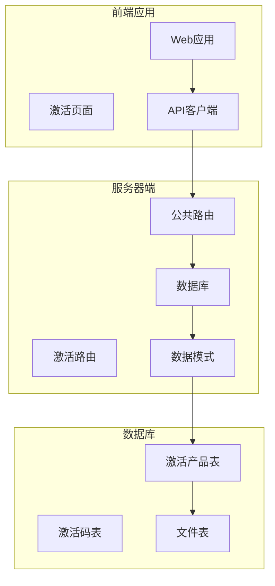
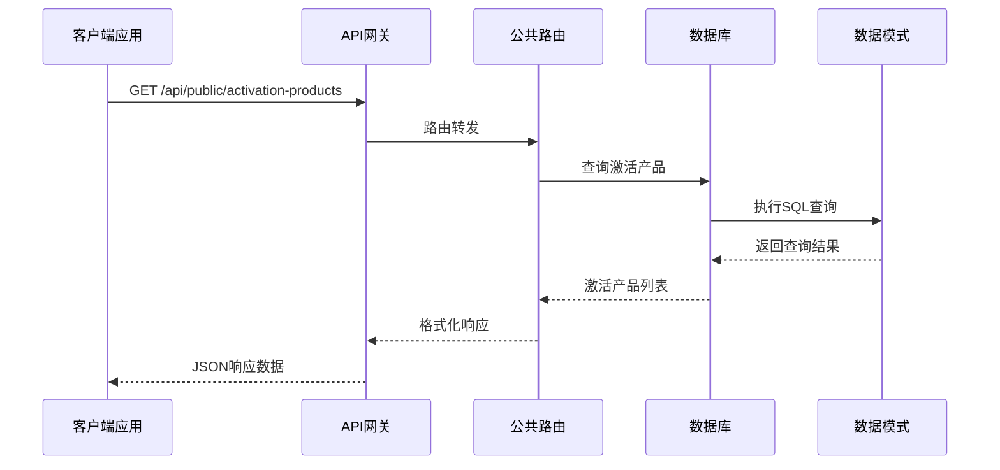
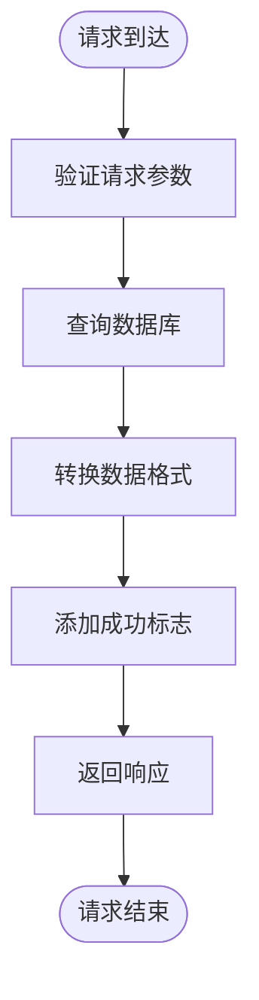
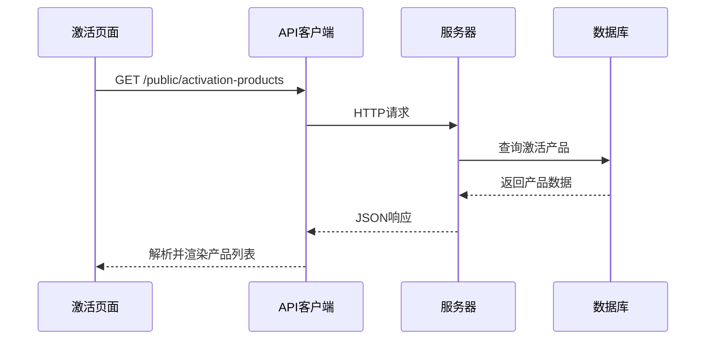
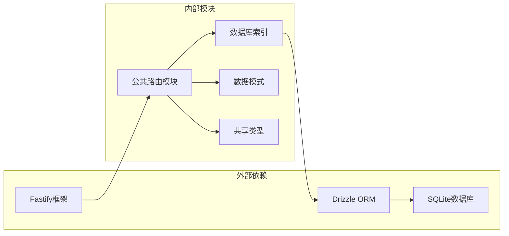

# 激活产品API

<cite>
**本文档引用的文件**
- [public.ts](file://apps/server/src/routes/public.ts)
- [schema.ts](file://apps/server/src/db/schema.ts)
- [activation.ts](file://apps/server/src/routes/activation.ts)
- [types.ts](file://packages/shared/src/types.ts)
- [Activation.tsx](file://apps/web/src/pages/Activation.tsx)
- [api.ts](file://apps/web/src/lib/api.ts)
- [index.ts](file://apps/server/src/db/index.ts)
</cite>

## 目录
1. [简介](#简介)
2. [项目结构](#项目结构)
3. [核心组件](#核心组件)
4. [架构概览](#架构概览)
5. [详细组件分析](#详细组件分析)
6. [依赖关系分析](#依赖关系分析)
7. [性能考虑](#性能考虑)
8. [故障排除指南](#故障排除指南)
9. [结论](#结论)

## 简介

激活产品API是ZBH2平台中用于提供激活产品信息查询的公共接口。该接口允许用户获取系统中所有激活产品的完整列表，为软件激活流程提供基础数据支持。通过该API，前端应用可以显示可用的激活产品，用户可以选择相应的产品进行激活操作。

## 项目结构

激活产品API位于服务器端的公共路由模块中，采用分层架构设计：

**图表来源**
- [public.ts:46-50](file://apps/server/src/routes/public.ts#L46-L50)
- [schema.ts:71-79](file://apps/server/src/db/schema.ts#L71-L79)

**章节来源**
- [public.ts:1-52](file://apps/server/src/routes/public.ts#L1-L52)
- [schema.ts:1-330](file://apps/server/src/db/schema.ts#L1-L330)

## 核心组件

激活产品API的核心组件包括：

### API端点
- **端点路径**: `/api/public/activation-products`
- **HTTP方法**: GET
- **访问权限**: 公共访问，无需认证
- **响应格式**: JSON

### 数据模型
激活产品表包含以下字段：
- `id`: 产品唯一标识符
- `code`: 产品代码
- `name`: 产品名称
- `description`: 产品描述
- `clientDownloadUrl`: 客户端下载URL
- `clientFileId`: 客户端文件ID（可选）
- `createdAt`: 创建时间

**章节来源**
- [public.ts:46-50](file://apps/server/src/routes/public.ts#L46-L50)
- [schema.ts:71-79](file://apps/server/src/db/schema.ts#L71-L79)

## 架构概览

激活产品API在整个系统架构中的位置和作用：

**图表来源**
- [public.ts:46-50](file://apps/server/src/routes/public.ts#L46-L50)
- [index.ts:1-16](file://apps/server/src/db/index.ts#L1-L16)

## 详细组件分析

### API端点实现

激活产品查询API的实现逻辑简洁高效：

**图表来源**
- [public.ts:46-50](file://apps/server/src/routes/public.ts#L46-L50)

### 数据结构定义

激活产品数据结构遵循统一的响应格式：

| 字段名 | 类型 | 必填 | 描述 |
|--------|------|------|------|
| id | number | 是 | 产品唯一标识符 |
| code | string | 是 | 产品代码，唯一标识 |
| name | string | 是 | 产品名称 |
| description | string | 否 | 产品描述，默认为空字符串 |
| clientDownloadUrl | string | 是 | 客户端下载URL，默认为空字符串 |
| clientFileId | number | 否 | 客户端文件ID，关联文件表 |
| createdAt | string | 是 | ISO格式创建时间 |

### 前端集成

前端应用通过API客户端调用激活产品接口：

**图表来源**
- [Activation.tsx:31-33](file://apps/web/src/pages/Activation.tsx#L31-L33)
- [api.ts](file://apps/web/src/lib/api.ts#L3)

**章节来源**
- [public.ts:46-50](file://apps/server/src/routes/public.ts#L46-L50)
- [schema.ts:71-79](file://apps/server/src/db/schema.ts#L71-L79)
- [Activation.tsx:16-22](file://apps/web/src/pages/Activation.tsx#L16-L22)
- [api.ts:1-16](file://apps/web/src/lib/api.ts#L1-L16)

## 依赖关系分析

激活产品API涉及的主要依赖关系：

**图表来源**
- [public.ts:1-3](file://apps/server/src/routes/public.ts#L1-L3)
- [index.ts:1-16](file://apps/server/src/db/index.ts#L1-L16)
- [types.ts:1-18](file://packages/shared/src/types.ts#L1-L18)

### 关键依赖说明

1. **Fastify框架**: 提供HTTP服务器功能和路由处理
2. **Drizzle ORM**: 数据库抽象层，简化SQL查询操作
3. **BetterSQLite**: SQLite数据库驱动程序
4. **共享类型**: 统一的API响应格式定义

**章节来源**
- [public.ts:1-3](file://apps/server/src/routes/public.ts#L1-L3)
- [index.ts:1-16](file://apps/server/src/db/index.ts#L1-L16)
- [types.ts:6-10](file://packages/shared/src/types.ts#L6-L10)

## 性能考虑

激活产品API具有以下性能特点：

### 查询优化
- 使用简单的SELECT查询获取所有激活产品
- 无复杂JOIN操作，查询效率高
- 支持数据库索引优化

### 缓存策略
- 建议在应用层实现适当的缓存机制
- 对于不频繁变更的数据，可考虑短期缓存

### 扩展性
- 当产品数量增长时，可考虑分页查询
- 支持未来添加过滤和排序参数

## 故障排除指南

### 常见问题及解决方案

1. **数据库连接失败**
   - 检查数据库文件路径配置
   - 验证数据库文件权限设置

2. **查询超时**
   - 优化数据库索引
   - 考虑添加LIMIT限制

3. **响应格式错误**
   - 确认Drizzle ORM版本兼容性
   - 验证数据模式定义

**章节来源**
- [index.ts:7-14](file://apps/server/src/db/index.ts#L7-L14)

## 结论

激活产品API作为ZBH2平台的基础公共接口，提供了简洁高效的激活产品查询功能。该API设计遵循RESTful原则，采用统一的响应格式，与前端应用无缝集成。通过清晰的数据模型定义和良好的架构设计，该接口能够稳定支持软件激活流程的各项需求。

未来可以在保持现有接口不变的前提下，根据业务发展需要添加更多的查询参数和功能扩展，如分页、过滤、排序等特性，以满足更复杂的使用场景。