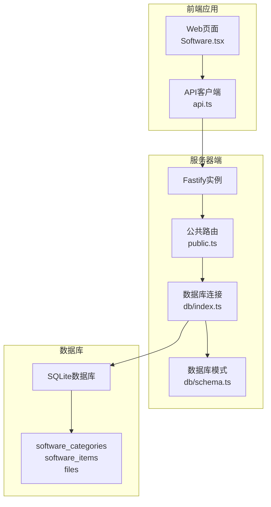
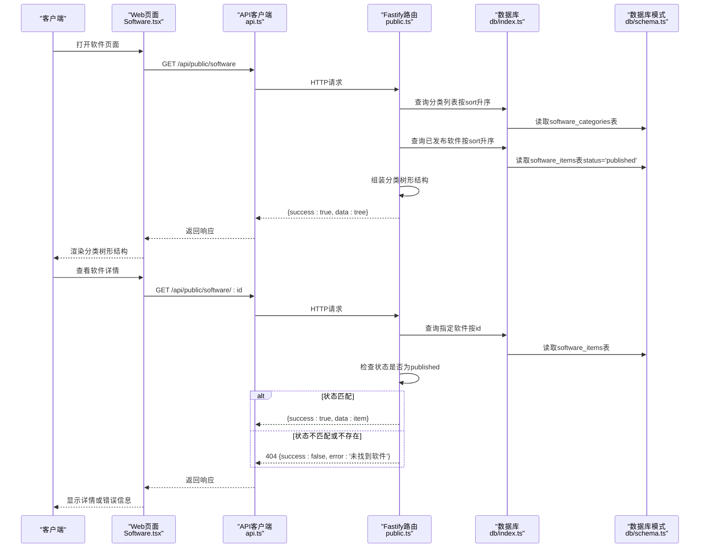
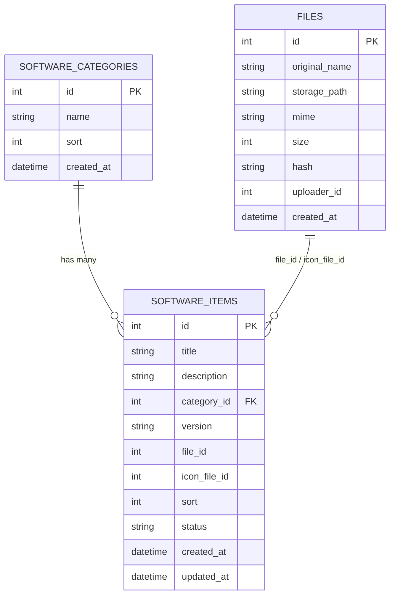
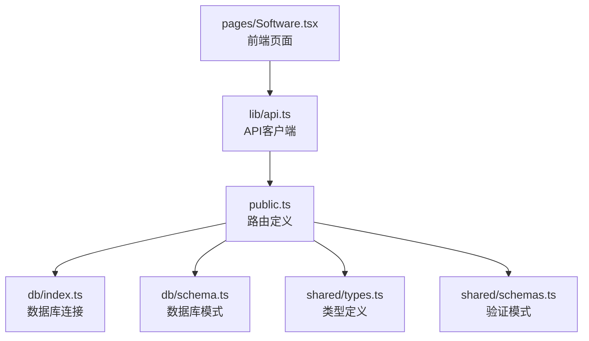

# 软件管理API

<cite>
**本文档引用的文件**
- [apps/server/src/routes/public.ts](file://apps/server/src/routes/public.ts)
- [apps/server/src/db/schema.ts](file://apps/server/src/db/schema.ts)
- [apps/server/src/db/index.ts](file://apps/server/src/db/index.ts)
- [apps/web/src/pages/Software.tsx](file://apps/web/src/pages/Software.tsx)
- [apps/web/src/lib/api.ts](file://apps/web/src/lib/api.ts)
- [packages/shared/src/types.ts](file://packages/shared/src/types.ts)
- [packages/shared/src/schemas.ts](file://packages/shared/src/schemas.ts)
- [apps/server/drizzle/meta/0000_snapshot.json](file://apps/server/drizzle/meta/0000_snapshot.json)
- [apps/server/drizzle/meta/0001_snapshot.json](file://apps/server/drizzle/meta/0001_snapshot.json)
- [apps/server/drizzle/meta/0002_snapshot.json](file://apps/server/drizzle/meta/0002_snapshot.json)
</cite>

## 目录
1. [简介](#简介)
2. [项目结构](#项目结构)
3. [核心组件](#核心组件)
4. [架构概览](#架构概览)
5. [详细组件分析](#详细组件分析)
6. [依赖关系分析](#依赖关系分析)
7. [性能考量](#性能考量)
8. [故障排除指南](#故障排除指南)
9. [结论](#结论)
10. [附录](#附录)

## 简介
本文件为ZBH2平台软件管理公共API的详细接口文档，重点覆盖以下两个核心接口：
- 软件分类查询接口：/api/public/software
- 软件详情获取接口：/api/public/software/:id

文档将详细说明：
- 返回格式与数据结构（分类树形结构、已发布软件条目组织）
- 参数验证、状态检查与404错误处理机制
- 排序规则（分类sort字段与软件条目sort字段）
- 状态过滤（仅published状态）
- 数据完整性保证
- 请求/响应示例（成功查询、软件不存在、状态不匹配等）
- 最佳实践与性能优化建议

## 项目结构
ZBH2采用前后端分离架构，服务器端使用Fastify + Drizzle ORM + Better-SQLite3，前端使用React + Ant Design。软件管理API位于服务器端路由模块中，数据库模式在Drizzle Schema中定义。

**图表来源**
- [apps/server/src/routes/public.ts:1-52](file://apps/server/src/routes/public.ts#L1-L52)
- [apps/server/src/db/index.ts:1-16](file://apps/server/src/db/index.ts#L1-L16)
- [apps/server/src/db/schema.ts:19-49](file://apps/server/src/db/schema.ts#L19-L49)

**章节来源**
- [apps/server/src/routes/public.ts:1-52](file://apps/server/src/routes/public.ts#L1-L52)
- [apps/server/src/db/index.ts:1-16](file://apps/server/src/db/index.ts#L1-L16)
- [apps/server/src/db/schema.ts:19-49](file://apps/server/src/db/schema.ts#L19-L49)

## 核心组件
本节概述软件管理API涉及的核心组件及其职责。

- 公共路由模块：负责定义和实现公共API端点，包括软件分类查询与详情获取。
- 数据库层：通过Drizzle ORM访问SQLite数据库，提供类型安全的数据访问。
- 前端集成：Web页面通过API客户端调用公共接口，并渲染软件分类树形结构。

关键职责分配：
- 路由层：处理HTTP请求、参数解析、状态码返回与错误处理。
- 数据层：执行数据库查询、过滤published状态、排序处理。
- 前端层：消费API响应、展示分类树与软件条目。

**章节来源**
- [apps/server/src/routes/public.ts:1-52](file://apps/server/src/routes/public.ts#L1-L52)
- [apps/server/src/db/schema.ts:19-49](file://apps/server/src/db/schema.ts#L19-L49)
- [apps/web/src/pages/Software.tsx:1-71](file://apps/web/src/pages/Software.tsx#L1-L71)

## 架构概览
软件管理API的调用流程如下：

**图表来源**
- [apps/server/src/routes/public.ts:7-24](file://apps/server/src/routes/public.ts#L7-L24)
- [apps/server/src/db/index.ts:1-16](file://apps/server/src/db/index.ts#L1-L16)
- [apps/server/src/db/schema.ts:19-49](file://apps/server/src/db/schema.ts#L19-L49)
- [apps/web/src/pages/Software.tsx:28-31](file://apps/web/src/pages/Software.tsx#L28-L31)
- [apps/web/src/lib/api.ts:1-16](file://apps/web/src/lib/api.ts#L1-L16)

## 详细组件分析

### 软件分类查询接口（/api/public/software）
该接口用于获取软件分类树形结构及每个分类下的已发布软件条目。

- 请求方法：GET
- 路径：/api/public/software
- 认证：无需认证（公共接口）

数据流与处理逻辑：
1. 查询所有软件分类，按sort字段升序排列。
2. 查询所有软件条目，过滤状态为published，按sort字段升序排列。
3. 将软件条目按categoryId归类到对应分类下，形成树形结构。
4. 返回统一响应格式：{success: true, data: tree}。

返回格式说明：
- success: 布尔值，表示请求是否成功。
- data: 分类数组，每个分类对象包含：
  - id: 分类标识符
  - name: 分类名称
  - sort: 排序权重
  - items: 该分类下的软件条目数组
- items中的软件条目包含：
  - id: 条目标识符
  - title: 软件标题
  - description: 软件描述
  - version: 版本号
  - sort: 排序权重
  - status: 状态（仅published）
  - categoryId: 所属分类ID
  - fileId: 文件ID（可选）
  - iconFileId: 图标文件ID（可选）

排序规则：
- 分类排序：按software_categories.sort升序
- 软件条目排序：按software_items.sort升序

状态过滤：
- 仅返回status为published的软件条目

数据完整性保证：
- 分类与条目通过categoryId关联
- 文件ID通过外键关联到files表

**章节来源**
- [apps/server/src/routes/public.ts:7-15](file://apps/server/src/routes/public.ts#L7-L15)
- [apps/server/src/db/schema.ts:19-49](file://apps/server/src/db/schema.ts#L19-L49)

### 软件详情获取接口（/api/public/software/:id）
该接口用于获取指定ID的软件详情，包含参数验证、状态检查与404错误处理。

- 请求方法：GET
- 路径：/api/public/software/:id
- 参数：id（路径参数，数字字符串）
- 认证：无需认证（公共接口）

处理逻辑：
1. 从请求参数中提取id并转换为数字。
2. 查询software_items表中id匹配的记录。
3. 检查记录是否存在且状态为published：
   - 若不存在或状态不是published，则返回404状态码与错误信息。
   - 否则返回软件详情。

返回格式：
- 成功时：{success: true, data: item}
- 失败时：{success: false, error: '未找到软件'}

参数验证：
- id必须为正整数（由数据库查询自动保证）
- 类型转换：将字符串id转换为Number

状态检查：
- 严格过滤published状态
- 非published状态视为不存在

404错误处理：
- 当记录不存在或状态不匹配时，返回404状态码与统一错误格式

**章节来源**
- [apps/server/src/routes/public.ts:17-24](file://apps/server/src/routes/public.ts#L17-L24)
- [apps/server/src/db/schema.ts:37-49](file://apps/server/src/db/schema.ts#L37-L49)

### 响应格式与数据模型
统一响应格式：
- success: boolean
- data: any（根据具体接口而定）
- error: string（失败时存在）

软件分类树形结构数据模型：

**图表来源**
- [apps/server/src/db/schema.ts:19-49](file://apps/server/src/db/schema.ts#L19-L49)
- [apps/server/drizzle/meta/0000_snapshot.json:514-682](file://apps/server/drizzle/meta/0000_snapshot.json#L514-L682)

**章节来源**
- [packages/shared/src/types.ts:6-17](file://packages/shared/src/types.ts#L6-L17)
- [apps/server/src/db/schema.ts:19-49](file://apps/server/src/db/schema.ts#L19-L49)

### 请求/响应示例

#### 成功查询分类树形结构
- 请求：GET /api/public/software
- 响应：
  - 状态码：200
  - 响应体：{success: true, data: [{id, name, sort, items: [{id, title, description, version, sort, status, categoryId, fileId?, iconFileId?}]}]}

#### 成功获取软件详情
- 请求：GET /api/public/software/1
- 响应：
  - 状态码：200
  - 响应体：{success: true, data: {id, title, description, version, sort, status, categoryId, fileId?, iconFileId?}}

#### 软件不存在
- 请求：GET /api/public/software/999
- 响应：
  - 状态码：404
  - 响应体：{success: false, error: '未找到软件'}

#### 状态不匹配（非published）
- 请求：GET /api/public/software/2（假设ID为2的软件状态为draft）
- 响应：
  - 状态码：404
  - 响应体：{success: false, error: '未找到软件'}

注意：当前实现中，当软件状态不是published时会返回404，这与常见REST实践一致，确保公共接口只暴露已发布的软件。

**章节来源**
- [apps/server/src/routes/public.ts:7-24](file://apps/server/src/routes/public.ts#L7-L24)

## 依赖关系分析

**图表来源**
- [apps/server/src/routes/public.ts:1-52](file://apps/server/src/routes/public.ts#L1-L52)
- [apps/server/src/db/index.ts:1-16](file://apps/server/src/db/index.ts#L1-L16)
- [apps/server/src/db/schema.ts:1-330](file://apps/server/src/db/schema.ts#L1-L330)
- [packages/shared/src/types.ts:1-18](file://packages/shared/src/types.ts#L1-L18)
- [packages/shared/src/schemas.ts:1-51](file://packages/shared/src/schemas.ts#L1-L51)
- [apps/web/src/pages/Software.tsx:1-71](file://apps/web/src/pages/Software.tsx#L1-L71)
- [apps/web/src/lib/api.ts:1-16](file://apps/web/src/lib/api.ts#L1-L16)

**章节来源**
- [apps/server/src/routes/public.ts:1-52](file://apps/server/src/routes/public.ts#L1-L52)
- [apps/server/src/db/schema.ts:1-330](file://apps/server/src/db/schema.ts#L1-L330)
- [packages/shared/src/types.ts:1-18](file://packages/shared/src/types.ts#L1-L18)
- [packages/shared/src/schemas.ts:1-51](file://packages/shared/src/schemas.ts#L1-L51)

## 性能考量
基于现有实现的性能特征与优化建议：

- 查询策略
  - 分类查询：一次性获取所有分类与已发布软件，然后在内存中组装树形结构。对于小到中等规模的分类数量是可行的。
  - 软件详情查询：按主键查询，命中率高，性能稳定。

- 排序与索引
  - 分类与软件条目均按sort字段排序，建议在数据库层面建立相应索引以提升排序效率。
  - 当前schema中sort字段为integer类型，适合数值排序。

- 缓存策略
  - 对于静态分类数据，可考虑在应用层缓存分类树形结构，减少重复查询。
  - 对于频繁访问的软件详情，可考虑Redis等缓存层。

- 数据库配置
  - 使用WAL模式与外键约束，确保数据一致性与并发性能。
  - SQLite适合中小规模数据，若数据量增长，需评估迁移到更强大的数据库。

- 前端渲染
  - 使用Ant Design的Collapse组件按分类展开/折叠，避免一次性渲染大量卡片。
  - 提供加载状态与空状态提示，改善用户体验。

**章节来源**
- [apps/server/src/db/index.ts:1-16](file://apps/server/src/db/index.ts#L1-L16)
- [apps/server/src/db/schema.ts:19-49](file://apps/server/src/db/schema.ts#L19-L49)
- [apps/web/src/pages/Software.tsx:38-67](file://apps/web/src/pages/Software.tsx#L38-L67)

## 故障排除指南
常见问题与解决方案：

- 404错误（软件不存在或状态不匹配）
  - 现象：返回{success: false, error: '未找到软件'}
  - 可能原因：
    - 软件ID不存在
    - 软件状态不是published
  - 解决方案：
    - 确认软件ID正确性
    - 确认软件状态为published

- 响应格式异常
  - 现象：响应缺少success或data字段
  - 可能原因：网络问题或服务器异常
  - 解决方案：检查网络连接，重试请求

- 前端渲染问题
  - 现象：页面空白或加载时间过长
  - 可能原因：数据量过大或网络延迟
  - 解决方案：
    - 检查后端响应时间
    - 优化前端分页或懒加载策略

- 数据库连接问题
  - 现象：无法连接数据库或查询超时
  - 可能原因：数据库文件损坏或权限不足
  - 解决方案：检查数据库文件路径与权限，重启服务

**章节来源**
- [apps/server/src/routes/public.ts:17-24](file://apps/server/src/routes/public.ts#L17-L24)
- [apps/web/src/pages/Software.tsx:38-67](file://apps/web/src/pages/Software.tsx#L38-L67)

## 结论
ZBH2平台的软件管理公共API设计简洁清晰，遵循REST风格，实现了：
- 分类树形结构的高效组织
- 已发布软件的精确过滤
- 统一的响应格式与错误处理
- 前后端分离的良好架构

建议在未来版本中：
- 增加分页支持以应对大规模数据
- 引入缓存机制提升性能
- 完善参数校验与错误日志
- 考虑引入GraphQL以满足复杂查询需求

## 附录

### API定义总览
- 软件分类查询：GET /api/public/software
  - 返回：分类树形结构（仅published软件）
  - 排序：按sort字段升序
- 软件详情获取：GET /api/public/software/:id
  - 参数：id（数字）
  - 返回：软件详情（仅published）
  - 错误：404（不存在或状态不匹配）

### 数据模型字段说明
- software_categories
  - id: 主键
  - name: 分类名称
  - sort: 排序权重
  - created_at: 创建时间
- software_items
  - id: 主键
  - title: 标题
  - description: 描述
  - categoryId: 分类ID（外键）
  - version: 版本号
  - fileId: 文件ID（外键）
  - iconFileId: 图标文件ID（外键）
  - sort: 排序权重
  - status: 状态（draft/published）
  - created_at/updated_at: 时间戳

**章节来源**
- [apps/server/src/db/schema.ts:19-49](file://apps/server/src/db/schema.ts#L19-L49)
- [apps/server/drizzle/meta/0000_snapshot.json:514-682](file://apps/server/drizzle/meta/0000_snapshot.json#L514-L682)