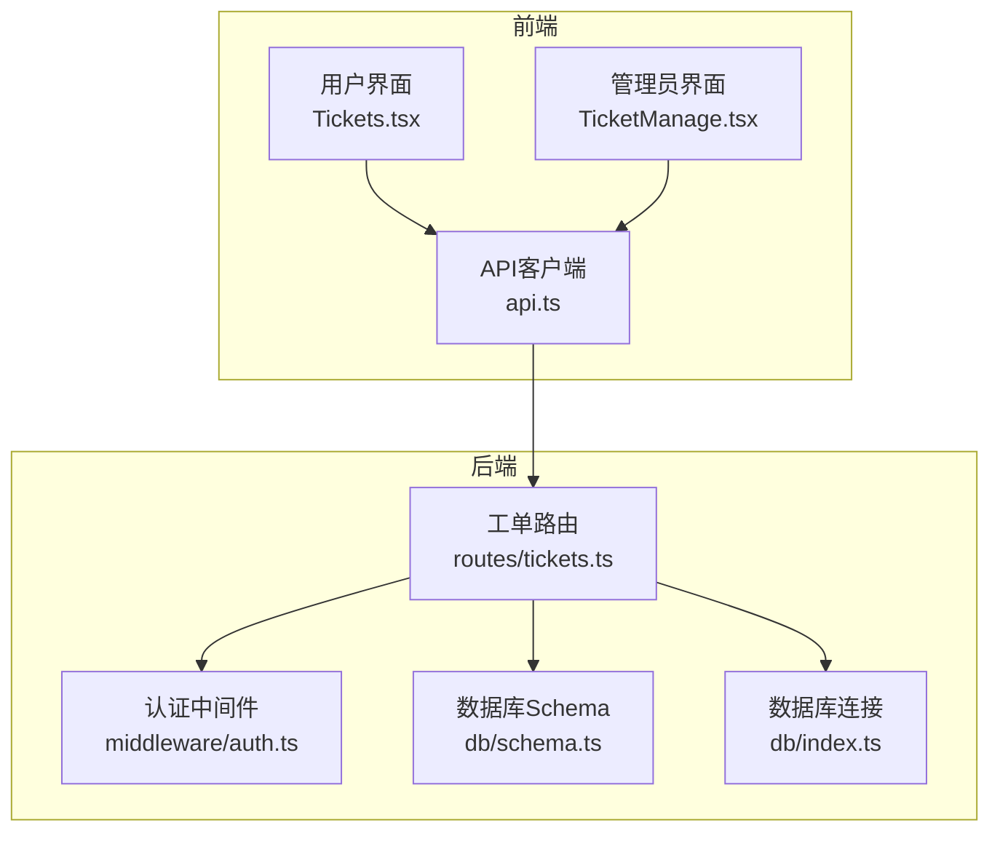
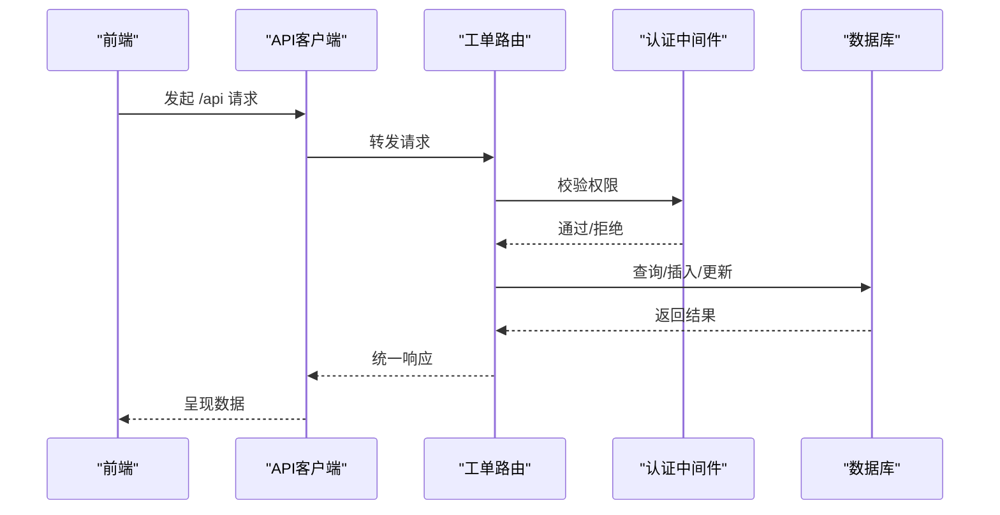
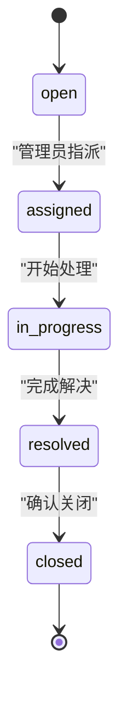
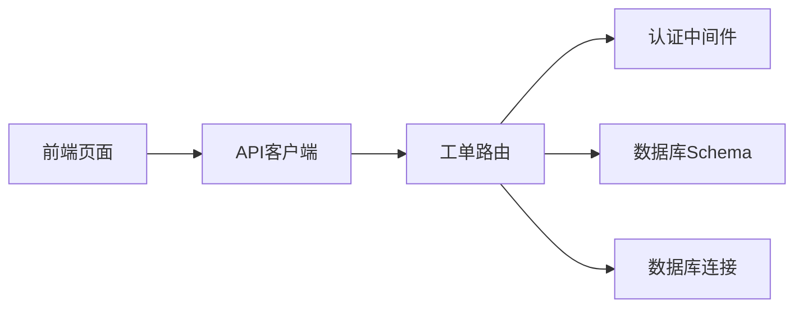
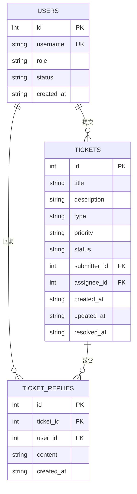

# 工单API

<cite>
**本文引用的文件**
- [apps/server/src/routes/tickets.ts](file://apps/server/src/routes/tickets.ts)
- [apps/server/src/db/schema.ts](file://apps/server/src/db/schema.ts)
- [apps/server/src/middleware/auth.ts](file://apps/server/src/middleware/auth.ts)
- [apps/server/src/db/index.ts](file://apps/server/src/db/index.ts)
- [apps/web/src/pages/Tickets.tsx](file://apps/web/src/pages/Tickets.tsx)
- [apps/web/src/pages/admin/TicketManage.tsx](file://apps/web/src/pages/admin/TicketManage.tsx)
- [apps/web/src/lib/api.ts](file://apps/web/src/lib/api.ts)
- [README.md](file://README.md)
</cite>

## 目录
1. [简介](#简介)
2. [项目结构](#项目结构)
3. [核心组件](#核心组件)
4. [架构总览](#架构总览)
5. [详细组件分析](#详细组件分析)
6. [依赖关系分析](#依赖关系分析)
7. [性能考量](#性能考量)
8. [故障排查指南](#故障排查指南)
9. [结论](#结论)
10. [附录](#附录)

## 简介
本文件为 ZBH2 平台的“工单API”接口文档，覆盖以下能力范围：
- 工单创建：类型选择、优先级设置、初始状态分配
- 工单查询：多维度筛选、分页与排序、状态统计
- 工单处理：指派机制、状态更新、处理记录
- 工单回复：消息发送、附件上传、通知机制
- 生命周期管理：从创建到关闭的完整流程
- 自动提醒与SLA跟踪：当前实现未包含，但可基于现有字段扩展
- 分类体系、优先级算法与处理时效控制：当前实现未包含，可在后续版本扩展

本项目采用前后端分离架构，后端基于 Fastify + Drizzle ORM + SQLite，前端基于 React + Ant Design，通过 Axios 发起 /api 前缀请求。

## 项目结构
- 后端路由集中在 apps/server/src/routes/tickets.ts，提供用户与管理员两类工单接口
- 数据模型集中在 apps/server/src/db/schema.ts，包含 tickets 与 ticketReplies 表
- 认证中间件位于 apps/server/src/middleware/auth.ts，区分普通用户与管理员
- 数据库初始化与连接位于 apps/server/src/db/index.ts
- 前端页面位于 apps/web/src/pages/Tickets.tsx（用户视角）与 apps/web/src/pages/admin/TicketManage.tsx（管理员视角）
- API 客户端封装位于 apps/web/src/lib/api.ts

图表来源
- [apps/web/src/pages/Tickets.tsx:1-132](file://apps/web/src/pages/Tickets.tsx#L1-L132)
- [apps/web/src/pages/admin/TicketManage.tsx:1-120](file://apps/web/src/pages/admin/TicketManage.tsx#L1-L120)
- [apps/web/src/lib/api.ts:1-16](file://apps/web/src/lib/api.ts#L1-L16)
- [apps/server/src/routes/tickets.ts:1-137](file://apps/server/src/routes/tickets.ts#L1-L137)
- [apps/server/src/middleware/auth.ts:1-56](file://apps/server/src/middleware/auth.ts#L1-L56)
- [apps/server/src/db/schema.ts:98-119](file://apps/server/src/db/schema.ts#L98-L119)
- [apps/server/src/db/index.ts:1-16](file://apps/server/src/db/index.ts#L1-L16)

章节来源
- [README.md:47-68](file://README.md#L47-L68)

## 核心组件
- 工单表 schema.tickets：包含标题、描述、类型、优先级、状态、提交人、处理人、创建/更新/解决时间等字段
- 回复表 schema.ticketReplies：关联工单与用户，记录回复内容与时间
- 工单路由 tickets.ts：提供用户与管理员的工单相关接口
- 认证中间件 auth.ts：requireAuth 与 requireAdmin，确保接口访问权限
- 前端页面：用户侧提交与查看工单；管理员侧筛选、指派、状态变更与回复

章节来源
- [apps/server/src/db/schema.ts:98-119](file://apps/server/src/db/schema.ts#L98-L119)
- [apps/server/src/routes/tickets.ts:1-137](file://apps/server/src/routes/tickets.ts#L1-L137)
- [apps/server/src/middleware/auth.ts:42-55](file://apps/server/src/middleware/auth.ts#L42-L55)
- [apps/web/src/pages/Tickets.tsx:1-132](file://apps/web/src/pages/Tickets.tsx#L1-L132)
- [apps/web/src/pages/admin/TicketManage.tsx:1-120](file://apps/web/src/pages/admin/TicketManage.tsx#L1-L120)

## 架构总览
后端通过 Fastify 提供 REST 接口，Drizzle ORM 访问 SQLite 数据库。前端通过 Axios 将 /api 前缀请求转发至后端。认证采用 httpOnly Cookie Session，管理员与普通用户接口权限不同。

图表来源
- [apps/web/src/lib/api.ts:1-16](file://apps/web/src/lib/api.ts#L1-L16)
- [apps/server/src/routes/tickets.ts:1-137](file://apps/server/src/routes/tickets.ts#L1-L137)
- [apps/server/src/middleware/auth.ts:42-55](file://apps/server/src/middleware/auth.ts#L42-L55)
- [apps/server/src/db/index.ts:1-16](file://apps/server/src/db/index.ts#L1-L16)

## 详细组件分析

### 工单创建接口
- 接口路径：POST /api/me/tickets
- 权限：requireAuth（仅登录用户）
- 请求体字段
  - title：必填
  - description：选填
  - type：可选，默认“question”
  - priority：可选，默认“medium”
- 初始状态：后端未显式设置 status，但 schema 默认 open
- 响应：success + data（新创建的工单）

请求/响应要点
- 请求体校验：title 必填
- 类型与优先级枚举：见 schema
- 初始状态：open（由数据库默认值决定）

章节来源
- [apps/server/src/routes/tickets.ts:8-19](file://apps/server/src/routes/tickets.ts#L8-L19)
- [apps/server/src/db/schema.ts:98-111](file://apps/server/src/db/schema.ts#L98-L111)
- [apps/web/src/pages/Tickets.tsx:88-99](file://apps/web/src/pages/Tickets.tsx#L88-L99)

### 工单查询接口
- 用户查询自身工单
  - GET /api/me/tickets
  - 权限：requireAuth
  - 结果：按创建时间倒序返回
- 用户查询单个工单详情（含回复）
  - GET /api/me/tickets/:id
  - 权限：requireAuth
  - 校验：仅本人提交的工单可见
  - 结果：工单 + replies（按时间正序）
- 管理员查询所有工单
  - GET /api/admin/tickets
  - 权限：requireAdmin
  - 查询参数：status（可选）
  - 结果：按创建时间倒序返回（可按状态过滤）
- 管理员查询单个工单详情（含回复）
  - GET /api/admin/tickets/:id
  - 权限：requireAdmin
  - 结果：工单 + replies（按时间正序）

请求/响应要点
- 多维度筛选：status 参数（管理员）
- 分页与排序：当前实现未提供分页，按创建时间排序
- 状态统计：当前未提供聚合统计接口

章节来源
- [apps/server/src/routes/tickets.ts:21-93](file://apps/server/src/routes/tickets.ts#L21-L93)
- [apps/web/src/pages/admin/TicketManage.tsx:27-31](file://apps/web/src/pages/admin/TicketManage.tsx#L27-L31)

### 工单处理接口
- 指派与状态更新
  - PUT /api/admin/tickets/:id
  - 权限：requireAdmin
  - 请求体字段：status（可选）、assigneeId（可选）
  - 更新逻辑：updatedAt 始终更新；当 status 变更为 resolved 时，写入 resolvedAt
- 管理员回复
  - POST /api/admin/tickets/:id/reply
  - 权限：requireAdmin
  - 请求体：content（必填）
  - 更新逻辑：插入回复后，更新工单 updatedAt

请求/响应要点
- 指派机制：assigneeId + status（如需自动设为 assigned）
- 状态更新：支持任意状态变更（open/assigned/in_progress/resolved/closed）
- 处理记录：通过回复表保存

章节来源
- [apps/server/src/routes/tickets.ts:111-135](file://apps/server/src/routes/tickets.ts#L111-L135)
- [apps/web/src/pages/admin/TicketManage.tsx:45-57](file://apps/web/src/pages/admin/TicketManage.tsx#L45-L57)

### 工单回复接口
- 用户回复自己的工单
  - POST /api/me/tickets/:id/reply
  - 权限：requireAuth
  - 请求体：content（必填）
  - 校验：仅本人提交的工单可回复
- 管理员回复
  - POST /api/admin/tickets/:id/reply
  - 权限：requireAdmin
  - 请求体：content（必填）
  - 更新逻辑：插入回复后，更新工单 updatedAt

请求/响应要点
- 附件上传：当前未提供附件上传接口
- 通知机制：当前未提供站内/邮件通知

章节来源
- [apps/server/src/routes/tickets.ts:48-62](file://apps/server/src/routes/tickets.ts#L48-L62)
- [apps/web/src/pages/Tickets.tsx:61-66](file://apps/web/src/pages/Tickets.tsx#L61-L66)
- [apps/web/src/pages/admin/TicketManage.tsx:52-57](file://apps/web/src/pages/admin/TicketManage.tsx#L52-L57)

### 工单生命周期与状态机
- 状态枚举：open、assigned、in_progress、resolved、closed
- 初始状态：open（数据库默认）
- 关闭条件：当 status 设为 resolved 时，写入 resolvedAt
- 建议流程（示意）
  - 创建：open
  - 指派：assigned
  - 处理中：in_progress
  - 解决：resolved
  - 关闭：closed

图表来源
- [apps/server/src/db/schema.ts:104-105](file://apps/server/src/db/schema.ts#L104-L105)
- [apps/server/src/routes/tickets.ts:111-121](file://apps/server/src/routes/tickets.ts#L111-L121)

## 依赖关系分析
- 工单路由依赖认证中间件进行权限控制
- 工单路由依赖数据库 schema 进行数据读写
- 前端页面通过 API 客户端调用后端接口
- 数据库连接通过 drizzle 初始化

图表来源
- [apps/web/src/lib/api.ts:1-16](file://apps/web/src/lib/api.ts#L1-L16)
- [apps/server/src/routes/tickets.ts:1-137](file://apps/server/src/routes/tickets.ts#L1-L137)
- [apps/server/src/middleware/auth.ts:1-56](file://apps/server/src/middleware/auth.ts#L1-L56)
- [apps/server/src/db/schema.ts:1-330](file://apps/server/src/db/schema.ts#L1-L330)
- [apps/server/src/db/index.ts:1-16](file://apps/server/src/db/index.ts#L1-L16)

章节来源
- [apps/server/src/db/schema.ts:98-119](file://apps/server/src/db/schema.ts#L98-L119)
- [apps/server/src/middleware/auth.ts:42-55](file://apps/server/src/middleware/auth.ts#L42-L55)

## 性能考量
- 当前未实现分页，大量数据时建议在管理员查询接口增加分页参数与索引优化
- 工单详情查询包含回复联表查询，建议对 ticketId 建立索引
- 批量查询可考虑缓存策略（如 Redis）以减轻数据库压力
- 建议对 status、assigneeId 等常用过滤字段建立索引

## 故障排查指南
- 401 未授权：检查登录态与 Cookie 是否正确传递
- 403 权限不足：管理员接口需管理员角色
- 404 工单不存在：确认工单 ID 与权限范围
- 400 参数错误：检查必填字段（如 title、content）

章节来源
- [apps/server/src/middleware/auth.ts:42-55](file://apps/server/src/middleware/auth.ts#L42-L55)
- [apps/server/src/routes/tickets.ts:8-19](file://apps/server/src/routes/tickets.ts#L8-L19)
- [apps/server/src/routes/tickets.ts:48-62](file://apps/server/src/routes/tickets.ts#L48-L62)
- [apps/server/src/routes/tickets.ts:64-93](file://apps/server/src/routes/tickets.ts#L64-L93)

## 结论
本工单API提供了基础的创建、查询、处理与回复能力，满足日常工单流转需求。当前实现未包含分页排序、状态统计、附件上传、通知机制与SLA跟踪等功能，可在后续版本中按需扩展。

## 附录

### 数据模型图

图表来源
- [apps/server/src/db/schema.ts:3-119](file://apps/server/src/db/schema.ts#L3-L119)

### 请求/响应示例（路径引用）
- 创建工单
  - 请求：POST /api/me/tickets
  - 示例请求体：{ "title": "...", "description": "...", "type": "question|bug|request|other", "priority": "low|medium|high|urgent" }
  - 响应：{ "success": true, "data": { ... } }
  - 参考路径：[apps/server/src/routes/tickets.ts:8-19](file://apps/server/src/routes/tickets.ts#L8-L19)
- 查询个人工单
  - 请求：GET /api/me/tickets
  - 响应：{ "success": true, "data": [...] }
  - 参考路径：[apps/server/src/routes/tickets.ts:21-27](file://apps/server/src/routes/tickets.ts#L21-L27)
- 查询工单详情（含回复）
  - 请求：GET /api/me/tickets/:id
  - 响应：{ "success": true, "data": { ..., "replies": [...] } }
  - 参考路径：[apps/server/src/routes/tickets.ts:29-46](file://apps/server/src/routes/tickets.ts#L29-L46)
- 管理员查询工单（可按状态过滤）
  - 请求：GET /api/admin/tickets?status=open|assigned|in_progress|resolved|closed
  - 响应：{ "success": true, "data": [...] }
  - 参考路径：[apps/server/src/routes/tickets.ts:64-93](file://apps/server/src/routes/tickets.ts#L64-L93)
- 指派与状态更新
  - 请求：PUT /api/admin/tickets/:id { "status": "...", "assigneeId": 123 }
  - 响应：{ "success": true }
  - 参考路径：[apps/server/src/routes/tickets.ts:111-121](file://apps/server/src/routes/tickets.ts#L111-L121)
- 管理员回复
  - 请求：POST /api/admin/tickets/:id/reply { "content": "..." }
  - 响应：{ "success": true, "data": { ... } }
  - 参考路径：[apps/server/src/routes/tickets.ts:123-135](file://apps/server/src/routes/tickets.ts#L123-L135)
- 用户回复自己的工单
  - 请求：POST /api/me/tickets/:id/reply { "content": "..." }
  - 响应：{ "success": true, "data": { ... } }
  - 参考路径：[apps/server/src/routes/tickets.ts:48-62](file://apps/server/src/routes/tickets.ts#L48-L62)