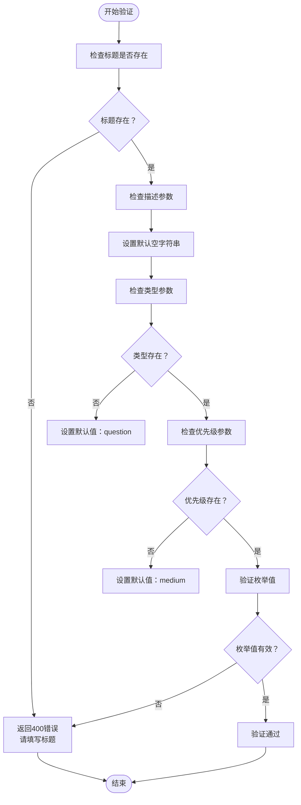
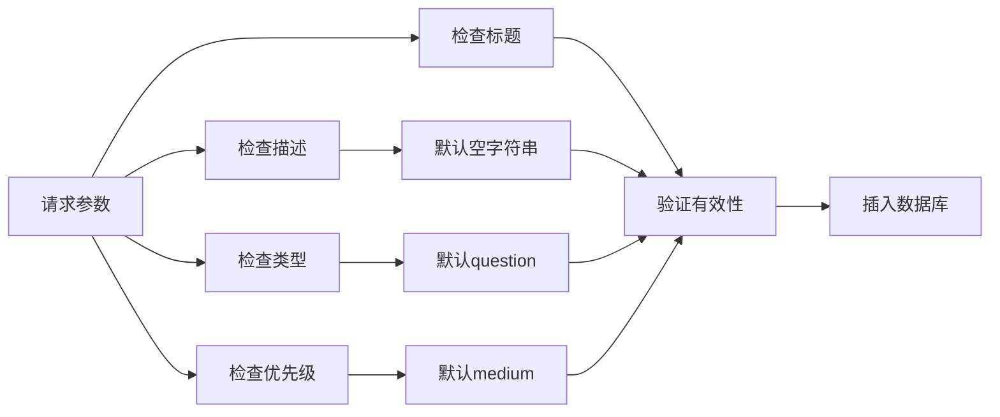
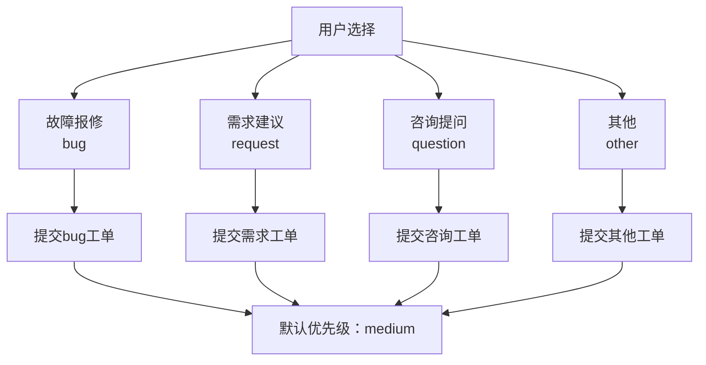
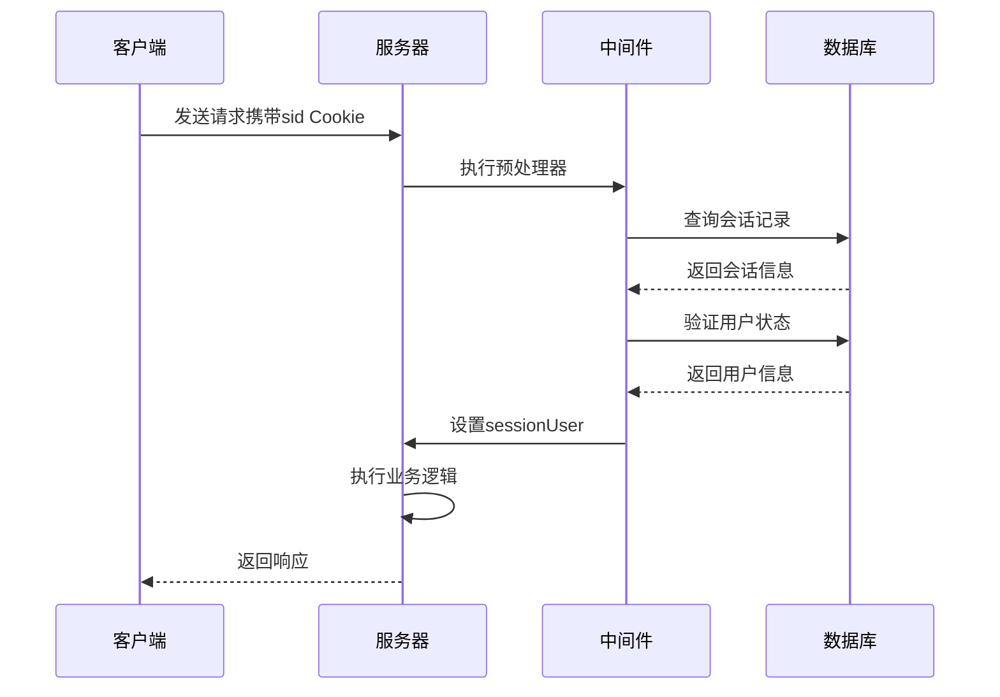
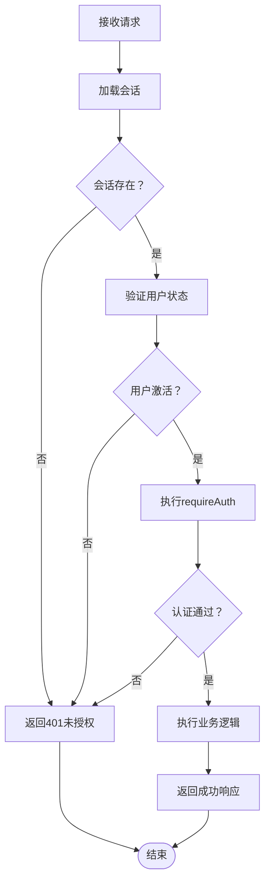
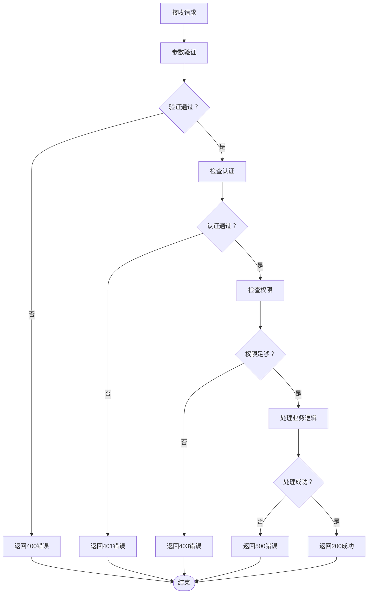
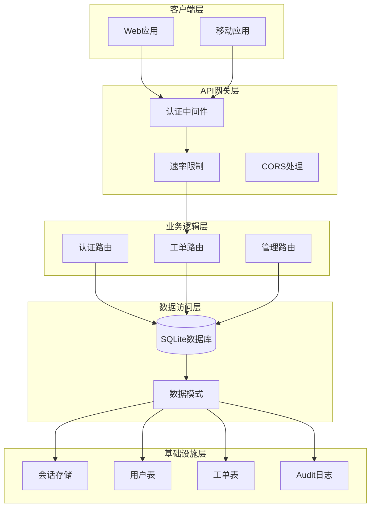
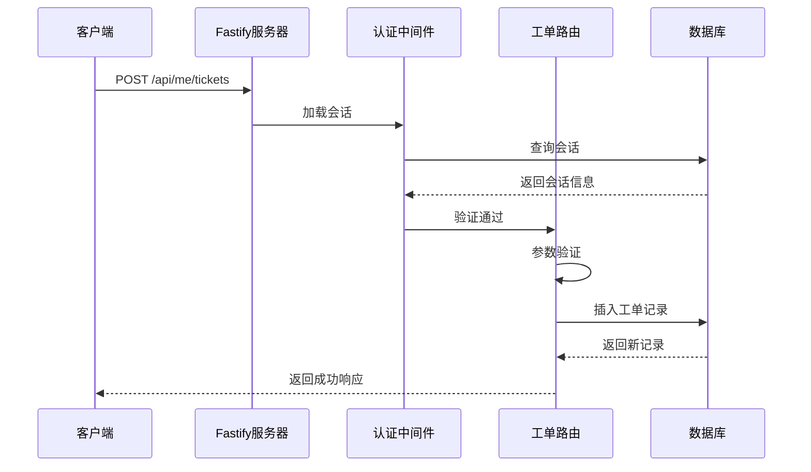

# 工单创建接口

<cite>
**本文档引用的文件**
- [tickets.ts](file://apps/server/src/routes/tickets.ts)
- [auth.ts](file://apps/server/src/middleware/auth.ts)
- [schema.ts](file://apps/server/src/db/schema.ts)
- [index.ts](file://apps/server/src/index.ts)
- [auth.ts](file://apps/server/src/routes/auth.ts)
- [Tickets.tsx](file://apps/web/src/pages/Tickets.tsx)
- [api.ts](file://apps/web/src/lib/api.ts)
</cite>

## 目录
1. [简介](#简介)
2. [接口概述](#接口概述)
3. [请求参数规范](#请求参数规范)
4. [响应数据结构](#响应数据结构)
5. [参数验证规则](#参数验证规则)
6. [默认值设置机制](#默认值设置机制)
7. [工单类型与优先级选择逻辑](#工单类型与优先级选择逻辑)
8. [会话验证与权限控制](#会话验证与权限控制)
9. [完整请求/响应示例](#完整请求响应示例)
10. [错误处理策略](#错误处理策略)
11. [最佳实践建议](#最佳实践建议)
12. [架构图](#架构图)

## 简介

ZBH2平台的工单创建接口允许用户提交各类问题报告、功能请求和咨询工单。该接口位于`/api/me/tickets`路径，采用POST方法进行数据提交，支持多种工单类型和优先级配置，并具备完善的会话验证和权限控制机制。

## 接口概述

### 基本信息
- **接口地址**: `/api/me/tickets`
- **HTTP方法**: POST
- **认证要求**: 需要登录会话
- **权限要求**: 普通用户（user）
- **请求格式**: JSON
- **响应格式**: JSON

### 功能描述
该接口用于创建新的工单记录，支持以下工单类型：
- **bug**: 故障报修
- **request**: 需求建议  
- **question**: 咨询提问
- **other**: 其他

支持以下优先级等级：
- **low**: 低
- **medium**: 中
- **high**: 高
- **urgent**: 紧急

## 请求参数规范

### 必需参数

| 参数名 | 类型 | 描述 | 验证规则 |
|--------|------|------|----------|
| title | string | 工单标题 | 非空字符串，长度限制在1-200字符之间 |

### 可选参数

| 参数名 | 类型 | 默认值 | 描述 | 验证规则 |
|--------|------|--------|------|----------|
| description | string | 空字符串 | 工单详细描述 | 最大长度2000字符 |
| type | string | "question" | 工单类型 | 枚举值：bug, request, question, other |
| priority | string | "medium" | 优先级等级 | 枚举值：low, medium, high, urgent |

### 参数验证规则



**图表来源**
- [tickets.ts:8-19](file://apps/server/src/routes/tickets.ts#L8-L19)

## 响应数据结构

### 成功响应

```typescript
{
  success: true,
  data: {
    id: number,
    title: string,
    description: string,
    type: string,
    priority: string,
    status: string,
    submitterId: number,
    assigneeId: number,
    createdAt: string,
    updatedAt: string,
    resolvedAt: string
  }
}
```

### 错误响应

```typescript
{
  success: false,
  error: string
}
```

## 参数验证规则

### 标题验证
- **必填性**: 必须提供
- **类型**: 字符串
- **长度**: 1-200字符
- **错误处理**: 当标题为空时返回400状态码

### 描述验证
- **可选性**: 可省略
- **默认值**: 空字符串
- **长度**: 最大2000字符

### 类型验证
- **可选性**: 可省略
- **默认值**: "question"
- **有效值**: bug, request, question, other

### 优先级验证
- **可选性**: 可省略
- **默认值**: "medium"
- **有效值**: low, medium, high, urgent

**章节来源**
- [tickets.ts:8-19](file://apps/server/src/routes/tickets.ts#L8-L19)

## 默认值设置机制

### 后端默认值设置



**图表来源**
- [tickets.ts:11-17](file://apps/server/src/routes/tickets.ts#L11-L17)

### 数据库层面的默认值

数据库表结构定义了更严格的默认值约束：

| 字段 | 数据库默认值 | 业务逻辑默认值 | 说明 |
|------|-------------|---------------|------|
| title | 必填 | 必填 | 由业务层强制验证 |
| description | '' | '' | 空字符串 |
| type | 'question' | 'question' | 业务默认值 |
| priority | 'medium' | 'medium' | 业务默认值 |
| status | 'open' | 'open' | 系统默认值 |
| submitterId | 外键约束 | 自动注入 | 会话用户ID |

**章节来源**
- [schema.ts:99-111](file://apps/server/src/db/schema.ts#L99-L111)

## 工单类型与优先级选择逻辑

### 工单类型选择



**图表来源**
- [tickets.ts:14](file://apps/server/src/routes/tickets.ts#L14)

### 优先级选择逻辑

| 优先级等级 | 适用场景 | 默认值 |
|------------|----------|--------|
| low | 一般性问题、小缺陷 | 不推荐作为默认值 |
| medium | 标准工单、常规问题 | ✅ 默认值 |
| high | 紧急修复、重要功能 |
| urgent | 系统崩溃、安全问题 |

### 前端默认值配置

前端表单提供了默认值设置：
- **类型默认值**: "question"
- **优先级默认值**: "medium"

**章节来源**
- [Tickets.tsx:91-96](file://apps/web/src/pages/Tickets.tsx#L91-L96)

## 会话验证与权限控制

### 会话加载机制



**图表来源**
- [auth.ts:17-40](file://apps/server/src/middleware/auth.ts#L17-L40)

### 权限控制流程



**图表来源**
- [auth.ts:42-46](file://apps/server/src/middleware/auth.ts#L42-L46)

### 会话生命周期

| 阶段 | 持续时间 | 描述 |
|------|----------|------|
| 登录有效期 | 7天 | 会话ID有效期 |
| 会话刷新 | 每次访问 | 自动延长有效期 |
| 用户状态检查 | 每次请求 | 确保用户账户有效 |

**章节来源**
- [auth.ts:23-32](file://apps/server/src/routes/auth.ts#L23-L32)

## 完整请求/响应示例

### 示例1：基础工单创建

**请求**
```http
POST /api/me/tickets HTTP/1.1
Content-Type: application/json
Cookie: sid=abc123xyz

{
  "title": "登录页面样式问题",
  "description": "登录页面的按钮样式在移动端显示异常",
  "type": "bug",
  "priority": "high"
}
```

**响应**
```json
{
  "success": true,
  "data": {
    "id": 101,
    "title": "登录页面样式问题",
    "description": "登录页面的按钮样式在移动端显示异常",
    "type": "bug",
    "priority": "high",
    "status": "open",
    "submitterId": 5,
    "assigneeId": null,
    "createdAt": "2024-01-15T10:30:00.000Z",
    "updatedAt": "2024-01-15T10:30:00.000Z",
    "resolvedAt": null
  }
}
```

### 示例2：默认值工单创建

**请求**
```http
POST /api/me/tickets HTTP/1.1
Content-Type: application/json
Cookie: sid=def456uvw

{
  "title": "新功能建议",
  "description": "希望增加导出功能"
}
```

**响应**
```json
{
  "success": true,
  "data": {
    "id": 102,
    "title": "新功能建议",
    "description": "希望增加导出功能",
    "type": "question",
    "priority": "medium",
    "status": "open",
    "submitterId": 5,
    "assigneeId": null,
    "createdAt": "2024-01-15T10:35:00.000Z",
    "updatedAt": "2024-01-15T10:35:00.000Z",
    "resolvedAt": null
  }
}
```

### 示例3：错误响应

**请求**
```http
POST /api/me/tickets HTTP/1.1
Content-Type: application/json

{
  "description": "没有标题的工单"
}
```

**响应**
```json
{
  "success": false,
  "error": "请填写标题"
}
```

**章节来源**
- [tickets.ts:10](file://apps/server/src/routes/tickets.ts#L10)

## 错误处理策略

### HTTP状态码映射

| 错误类型 | HTTP状态码 | 错误信息 | 处理建议 |
|----------|------------|----------|----------|
| 缺少标题 | 400 | 请填写标题 | 确保标题字段必填 |
| 未登录 | 401 | 请先登录 | 检查会话Cookie |
| 权限不足 | 403 | 权限不足 | 验证用户角色 |
| 工单不存在 | 404 | 工单不存在 | 检查工单ID |
| 内容为空 | 400 | 请填写内容 | 验证回复内容 |

### 错误处理流程



**图表来源**
- [tickets.ts:8-19](file://apps/server/src/routes/tickets.ts#L8-L19)
- [auth.ts:42-54](file://apps/server/src/middleware/auth.ts#L42-L54)

**章节来源**
- [tickets.ts:34](file://apps/server/src/routes/tickets.ts#L34)
- [tickets.ts:52](file://apps/server/src/routes/tickets.ts#L52)

## 最佳实践建议

### 前端开发建议

1. **表单验证**
   - 在提交前进行客户端验证
   - 提供实时反馈和错误提示
   - 使用默认值提升用户体验

2. **用户体验优化**
   - 为必填字段添加星号标记
   - 提供清晰的类型和优先级说明
   - 实现表单状态保存

3. **错误处理**
   - 捕获并处理网络错误
   - 提供友好的错误提示
   - 支持重试机制

### 后端开发建议

1. **参数验证**
   - 实施严格的输入验证
   - 使用类型安全的参数解析
   - 记录详细的审计日志

2. **性能优化**
   - 实施适当的速率限制
   - 优化数据库查询
   - 缓存常用配置

3. **安全性考虑**
   - 防止SQL注入攻击
   - 实施XSS防护
   - 保护敏感信息

### 数据库设计建议

1. **索引优化**
   - 为常用查询字段建立索引
   - 优化排序和过滤性能
   - 定期维护数据库统计信息

2. **数据完整性**
   - 实施外键约束
   - 使用枚举类型限制取值范围
   - 定义合理的默认值

## 架构图

### 系统架构概览



**图表来源**
- [index.ts:11-49](file://apps/server/src/index.ts#L11-L49)
- [schema.ts:99-119](file://apps/server/src/db/schema.ts#L99-L119)

### 请求处理流程



**图表来源**
- [index.ts:37](file://apps/server/src/index.ts#L37)
- [tickets.ts:8](file://apps/server/src/routes/tickets.ts#L8)
- [auth.ts:17-40](file://apps/server/src/middleware/auth.ts#L17-L40)