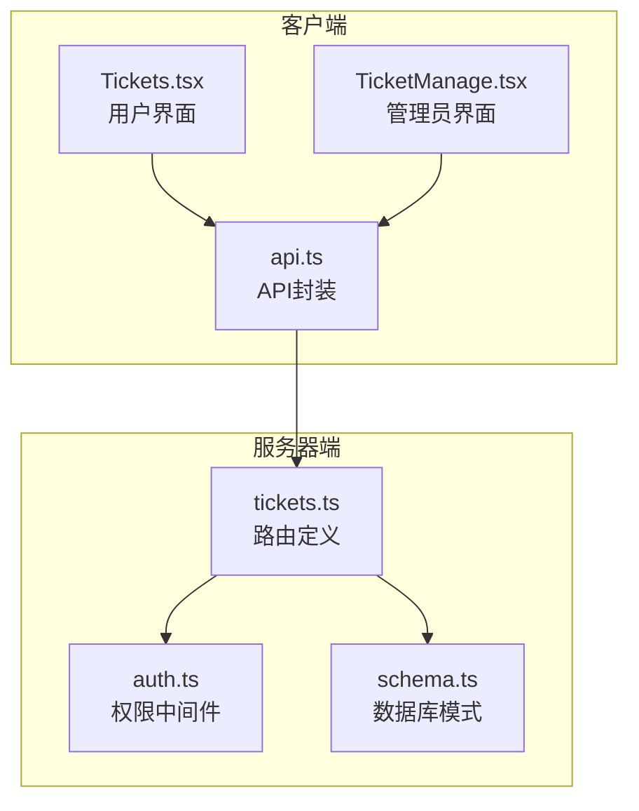
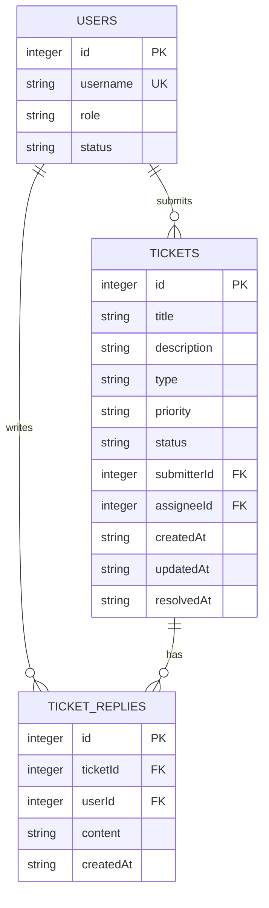
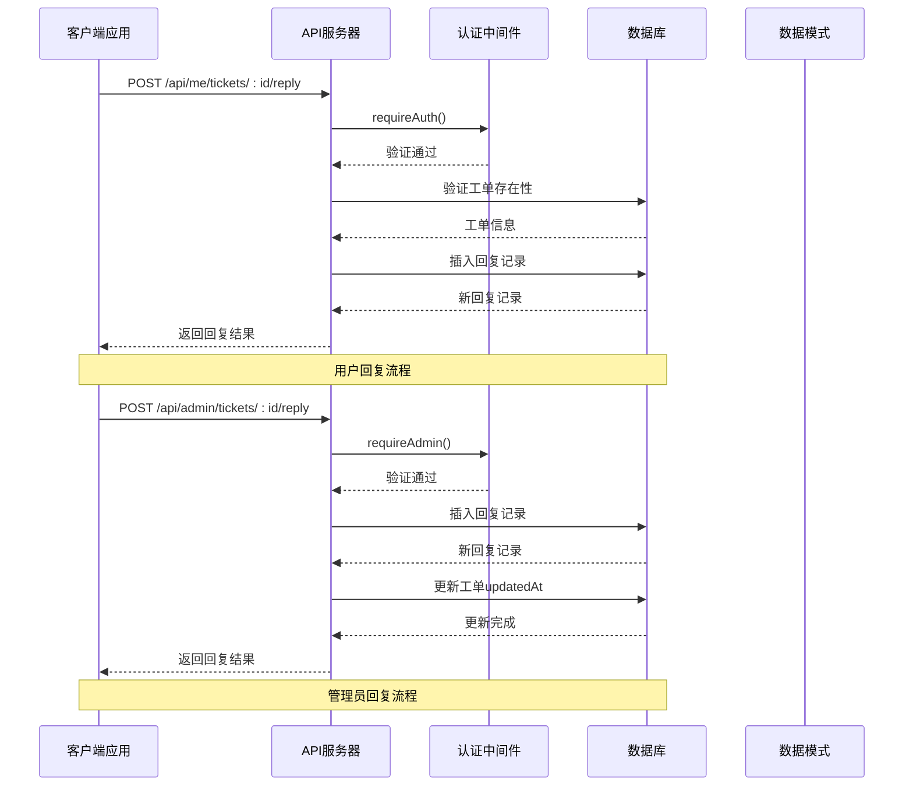
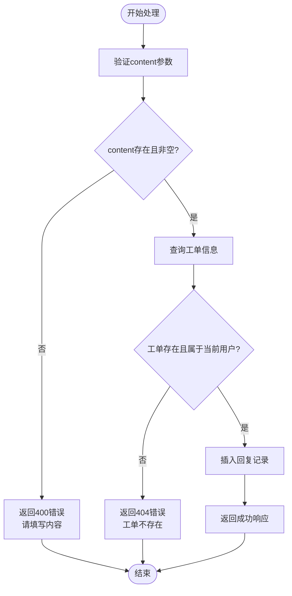
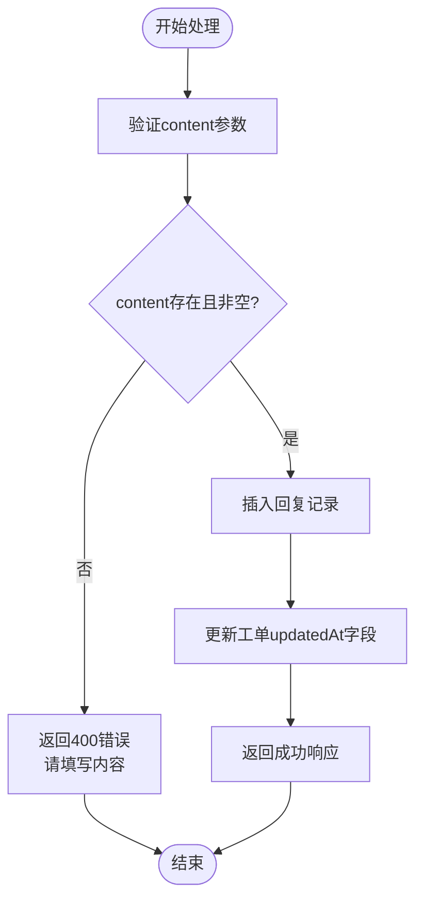
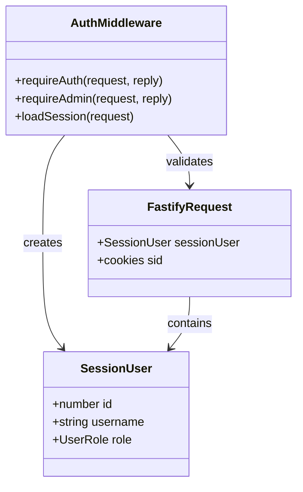
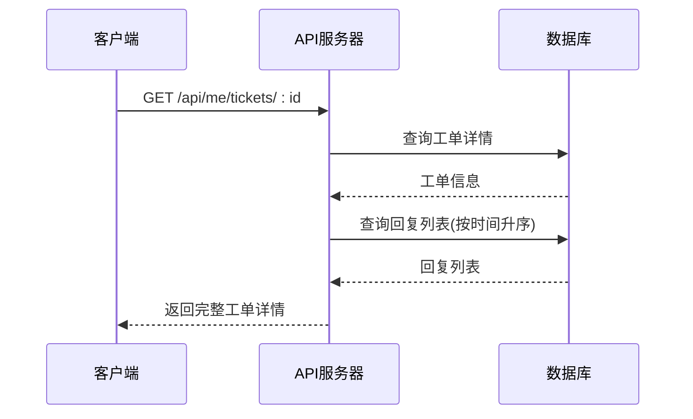
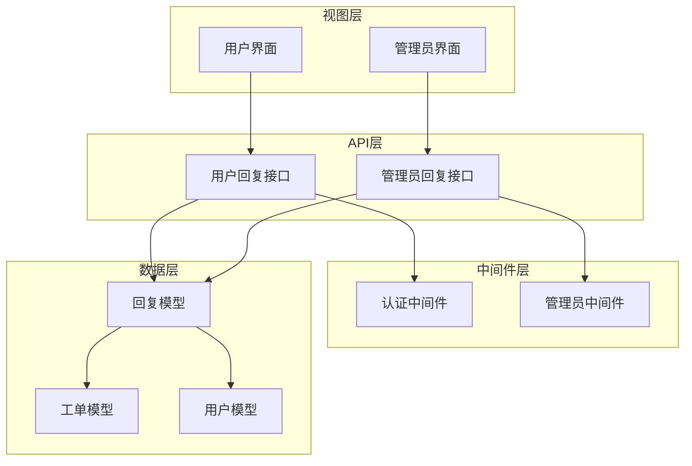

# 工单回复接口

<cite>
**本文档引用的文件**
- [tickets.ts](file://apps/server/src/routes/tickets.ts)
- [auth.ts](file://apps/server/src/middleware/auth.ts)
- [schema.ts](file://apps/server/src/db/schema.ts)
- [Tickets.tsx](file://apps/web/src/pages/Tickets.tsx)
- [TicketManage.tsx](file://apps/web/src/pages/admin/TicketManage.tsx)
- [api.ts](file://apps/web/src/lib/api.ts)
</cite>

## 目录
1. [简介](#简介)
2. [项目结构](#项目结构)
3. [核心组件](#核心组件)
4. [架构概览](#架构概览)
5. [详细组件分析](#详细组件分析)
6. [依赖关系分析](#依赖关系分析)
7. [性能考虑](#性能考虑)
8. [故障排除指南](#故障排除指南)
9. [结论](#结论)

## 简介

本文档详细说明了ZBH2平台的工单回复接口，包括用户回复自己工单和管理员回复工单两个API端点。该系统实现了完整的权限控制、数据验证、内容安全和回复历史管理功能。

## 项目结构

工单回复功能分布在以下关键文件中：

**图表来源**
- [tickets.ts:1-137](file://apps/server/src/routes/tickets.ts#L1-L137)
- [auth.ts:1-56](file://apps/server/src/middleware/auth.ts#L1-L56)
- [schema.ts:1-330](file://apps/server/src/db/schema.ts#L1-L330)

**章节来源**
- [tickets.ts:1-137](file://apps/server/src/routes/tickets.ts#L1-L137)
- [auth.ts:1-56](file://apps/server/src/middleware/auth.ts#L1-L56)
- [schema.ts:1-330](file://apps/server/src/db/schema.ts#L1-L330)

## 核心组件

### 数据模型

工单回复系统基于以下核心数据表：

**图表来源**
- [schema.ts:98-119](file://apps/server/src/db/schema.ts#L98-L119)

### 权限控制

系统采用两层权限控制：
- **用户权限**：所有用户必须通过认证才能访问
- **管理员权限**：仅管理员角色可访问管理相关功能

**章节来源**
- [auth.ts:42-55](file://apps/server/src/middleware/auth.ts#L42-L55)
- [tickets.ts:48-62](file://apps/server/src/routes/tickets.ts#L48-L62)
- [tickets.ts:123-135](file://apps/server/src/routes/tickets.ts#L123-L135)

## 架构概览

工单回复系统的整体架构如下：

**图表来源**
- [tickets.ts:48-62](file://apps/server/src/routes/tickets.ts#L48-L62)
- [tickets.ts:123-135](file://apps/server/src/routes/tickets.ts#L123-L135)
- [auth.ts:42-55](file://apps/server/src/middleware/auth.ts#L42-L55)

## 详细组件分析

### 用户回复接口

#### 接口定义

**端点**: `POST /api/me/tickets/:id/reply`

**功能**: 允许工单提交者回复自己的工单

**权限要求**: 用户认证

**参数验证**:
- `id`: 路径参数，工单ID（数字）
- `content`: 请求体参数，回复内容（必填）

#### 处理流程

**图表来源**
- [tickets.ts:48-62](file://apps/server/src/routes/tickets.ts#L48-L62)

#### 数据插入机制

回复记录的插入过程：
1. 验证content参数存在且非空
2. 查询指定工单并确认归属关系
3. 使用当前会话用户ID自动注入userId
4. 设置ticketId为路径参数中的工单ID
5. 存储原始content内容
6. 返回新创建的回复记录

**章节来源**
- [tickets.ts:48-62](file://apps/server/src/routes/tickets.ts#L48-L62)
- [schema.ts:113-119](file://apps/server/src/db/schema.ts#L113-L119)

### 管理员回复接口

#### 接口定义

**端点**: `POST /api/admin/tickets/:id/reply`

**功能**: 允许管理员对任意工单进行回复

**权限要求**: 管理员认证

**参数验证**:
- `id`: 路径参数，工单ID（数字）
- `content`: 请求体参数，回复内容（必填）

#### 处理流程

**图表来源**
- [tickets.ts:123-135](file://apps/server/src/routes/tickets.ts#L123-L135)

#### 工单更新同步

管理员回复时，系统会自动更新工单的`updatedAt`字段，确保工单状态的实时性。这个机制保证了：

1. **时间同步**: 回复发生的时间与工单最后更新时间保持一致
2. **状态追踪**: 便于后续按时间排序和状态管理
3. **审计功能**: 为系统审计提供准确的时间戳

**章节来源**
- [tickets.ts:123-135](file://apps/server/src/routes/tickets.ts#L123-L135)

### 权限验证机制

系统采用中间件模式实现权限控制：

**图表来源**
- [auth.ts:42-55](file://apps/server/src/middleware/auth.ts#L42-L55)
- [auth.ts:17-40](file://apps/server/src/middleware/auth.ts#L17-L40)

**章节来源**
- [auth.ts:1-56](file://apps/server/src/middleware/auth.ts#L1-L56)

### 内容安全与验证

#### 输入验证规则

1. **必需字段验证**: 所有回复都必须包含content参数
2. **类型验证**: content必须为字符串类型
3. **长度限制**: 数据库层限制为TEXT类型，无长度上限
4. **格式验证**: 无特殊格式要求，支持纯文本和富文本

#### 错误处理

系统提供统一的错误响应格式：

| 状态码 | 错误类型 | 描述 |
|--------|----------|------|
| 400 | 参数错误 | 请填写内容 |
| 401 | 未认证 | 请先登录 |
| 403 | 权限不足 | 权限不足 |
| 404 | 资源不存在 | 工单不存在 |

**章节来源**
- [tickets.ts:48-62](file://apps/server/src/routes/tickets.ts#L48-L62)
- [tickets.ts:123-135](file://apps/server/src/routes/tickets.ts#L123-L135)
- [auth.ts:42-55](file://apps/server/src/middleware/auth.ts#L42-L55)

### 回复历史管理

#### 数据存储结构

每个回复记录包含以下字段：

| 字段名 | 类型 | 描述 | 约束 |
|--------|------|------|------|
| id | INTEGER | 主键，自增 | PK |
| ticketId | INTEGER | 关联工单ID | FK to tickets.id |
| userId | INTEGER | 回复用户ID | FK to users.id |
| content | TEXT | 回复内容 | NOT NULL |
| createdAt | TEXT | 创建时间 | DEFAULT now() |

#### 历史查询

系统支持按时间顺序查询回复历史：

**图表来源**
- [tickets.ts:29-46](file://apps/server/src/routes/tickets.ts#L29-L46)

**章节来源**
- [tickets.ts:29-46](file://apps/server/src/routes/tickets.ts#L29-L46)
- [schema.ts:113-119](file://apps/server/src/db/schema.ts#L113-L119)

## 依赖关系分析

### 组件依赖图

**图表来源**
- [tickets.ts:1-137](file://apps/server/src/routes/tickets.ts#L1-L137)
- [auth.ts:1-56](file://apps/server/src/middleware/auth.ts#L1-L56)

### 外部依赖

系统依赖以下外部库：

- **Fastify**: Web框架和路由处理
- **Drizzle ORM**: SQLite数据库操作
- **Axios**: HTTP客户端库
- **Ant Design**: UI组件库

**章节来源**
- [tickets.ts:1-5](file://apps/server/src/routes/tickets.ts#L1-L5)
- [api.ts:1-16](file://apps/web/src/lib/api.ts#L1-L16)

## 性能考虑

### 数据库优化

1. **索引策略**: 
   - `ticketReplies.ticketId` 上建立索引以加速查询
   - `ticketReplies.userId` 上建立索引以支持用户过滤

2. **查询优化**:
   - 使用LEFT JOIN获取用户名信息
   - 按创建时间排序确保回复历史的正确性

3. **事务处理**:
   - 单个操作使用单一事务确保数据一致性

### 缓存策略

系统目前未实现专门的缓存机制，但可以通过以下方式优化：

- **会话缓存**: 用户会话信息在内存中缓存
- **查询结果缓存**: 对热门工单的查询结果进行短期缓存

## 故障排除指南

### 常见问题及解决方案

#### 400错误：请填写内容
**原因**: 请求体缺少content参数或为空字符串
**解决方案**: 确保content参数存在且至少包含一个字符

#### 401错误：请先登录
**原因**: 用户未通过身份验证
**解决方案**: 实现正确的登录流程并确保cookie有效

#### 403错误：权限不足
**原因**: 非管理员用户尝试访问管理员接口
**解决方案**: 确保用户具有管理员角色

#### 404错误：工单不存在
**原因**: 工单ID无效或不属于当前用户
**解决方案**: 验证工单ID的有效性和用户权限

### 调试技巧

1. **检查网络请求**: 使用浏览器开发者工具查看API请求和响应
2. **验证会话状态**: 确认用户登录状态和会话有效性
3. **数据库查询**: 直接查询数据库验证数据完整性

**章节来源**
- [tickets.ts:48-62](file://apps/server/src/routes/tickets.ts#L48-L62)
- [tickets.ts:123-135](file://apps/server/src/routes/tickets.ts#L123-L135)
- [auth.ts:42-55](file://apps/server/src/middleware/auth.ts#L42-L55)

## 结论

ZBH2平台的工单回复接口设计合理，实现了以下关键特性：

1. **完善的权限控制**: 区分用户和管理员权限，确保数据安全
2. **严格的输入验证**: 提供清晰的错误反馈和处理机制
3. **完整的数据模型**: 支持回复历史管理和时间追踪
4. **良好的用户体验**: 前后端分离的设计提供了流畅的交互体验

该系统为工单管理提供了坚实的技术基础，支持高效的客户支持和问题解决流程。通过进一步的优化和扩展，可以满足更复杂的企业级需求。