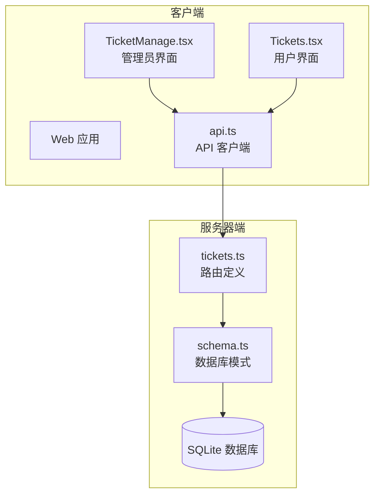
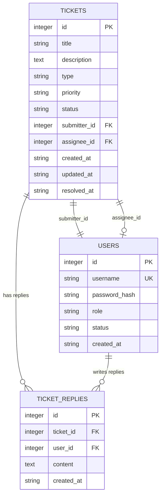
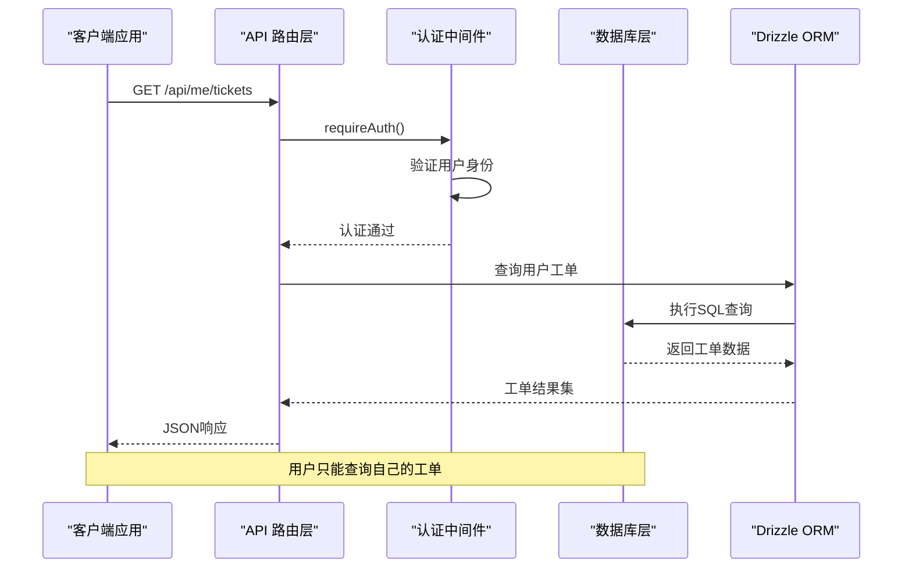
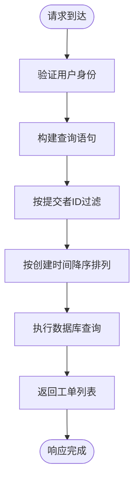
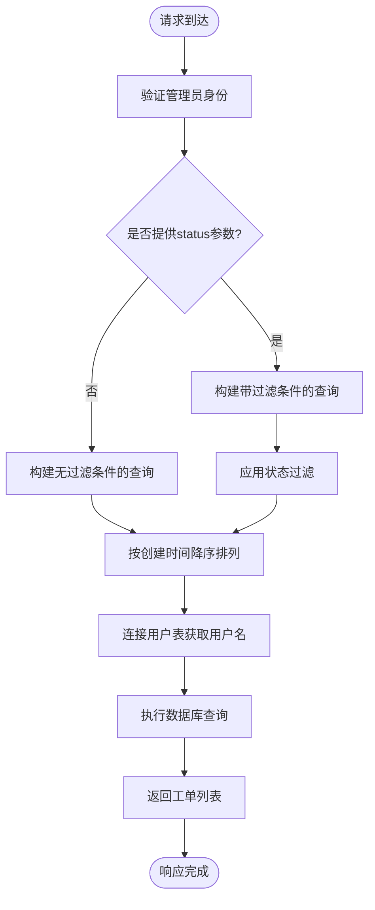
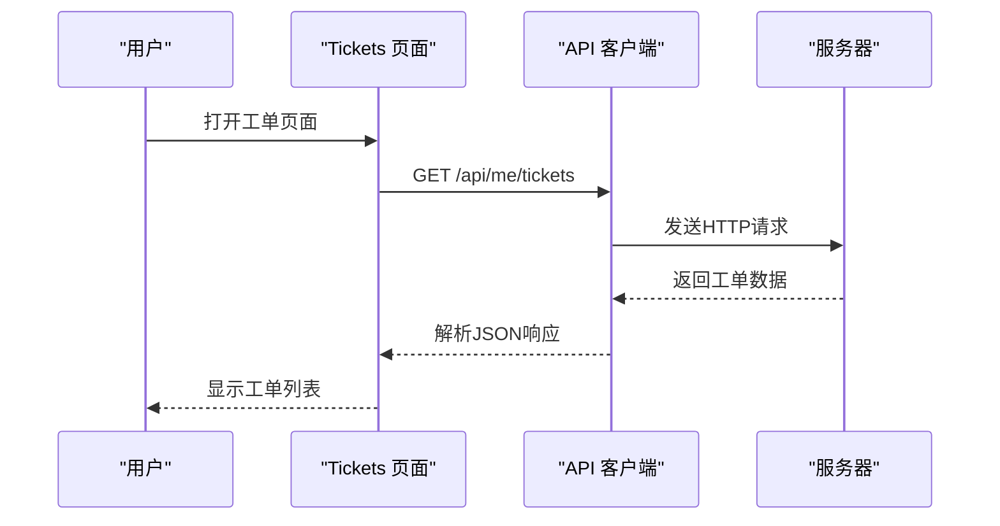
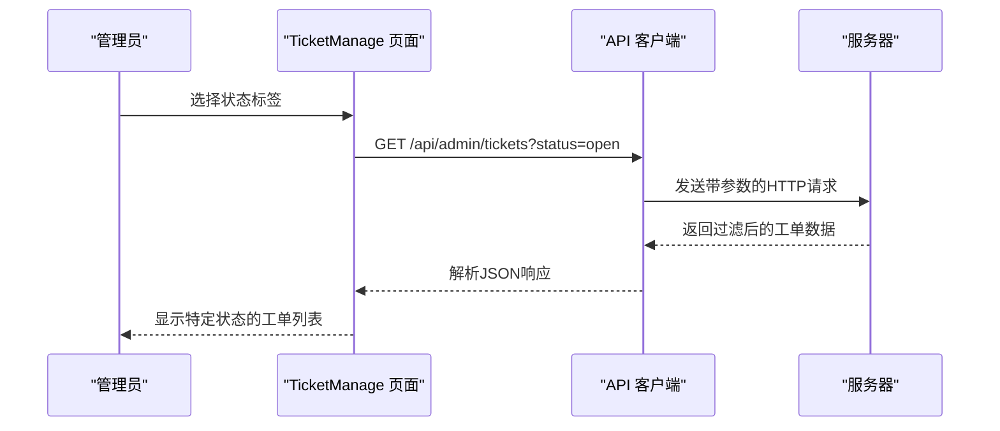
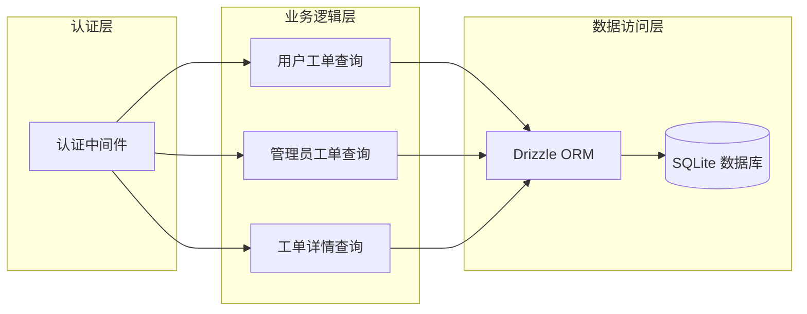

# 工单查询接口

<cite>
**本文档引用的文件**
- [tickets.ts](file://apps/server/src/routes/tickets.ts)
- [schema.ts](file://apps/server/src/db/schema.ts)
- [TicketManage.tsx](file://apps/web/src/pages/admin/TicketManage.tsx)
- [Tickets.tsx](file://apps/web/src/pages/Tickets.tsx)
- [api.ts](file://apps/web/src/lib/api.ts)
</cite>

## 目录
1. [简介](#简介)
2. [项目结构](#项目结构)
3. [核心组件](#核心组件)
4. [架构概览](#架构概览)
5. [详细组件分析](#详细组件分析)
6. [依赖关系分析](#依赖关系分析)
7. [性能考虑](#性能考虑)
8. [故障排除指南](#故障排除指南)
9. [结论](#结论)

## 简介

ZBH2平台的工单查询接口提供了两种不同权限级别的工单查询能力：
- 用户查询个人工单：`GET /api/me/tickets`
- 管理员查询所有工单：`GET /api/admin/tickets`

这些接口支持基于状态的过滤机制，允许用户和管理员根据工单状态进行筛选，并提供完整的工单信息展示，包括提交者用户名和时间戳字段。

## 项目结构

工单查询功能分布在以下关键文件中：



**图表来源**
- [tickets.ts:1-137](file://apps/server/src/routes/tickets.ts#L1-L137)
- [schema.ts:98-119](file://apps/server/src/db/schema.ts#L98-L119)

**章节来源**
- [tickets.ts:1-137](file://apps/server/src/routes/tickets.ts#L1-L137)
- [schema.ts:1-330](file://apps/server/src/db/schema.ts#L1-L330)

## 核心组件

### 工单数据模型

工单系统采用SQLite数据库存储，包含以下核心表结构：



**图表来源**
- [schema.ts:98-119](file://apps/server/src/db/schema.ts#L98-L119)
- [schema.ts:113-119](file://apps/server/src/db/schema.ts#L113-L119)

### 支持的状态枚举

工单支持以下状态值：
- `open` - 待处理
- `assigned` - 已分配  
- `in_progress` - 处理中
- `resolved` - 已解决
- `closed` - 已关闭

优先级枚举：
- `low` - 低
- `medium` - 中
- `high` - 高
- `urgent` - 紧急

类型枚举：
- `bug` - 故障报修
- `request` - 需求建议
- `question` - 咨询提问
- `other` - 其他

**章节来源**
- [schema.ts:98-119](file://apps/server/src/db/schema.ts#L98-L119)

## 架构概览

工单查询接口采用RESTful设计，结合Fastify框架和Drizzle ORM：



**图表来源**
- [tickets.ts:21-27](file://apps/server/src/routes/tickets.ts#L21-L27)
- [tickets.ts:64-93](file://apps/server/src/routes/tickets.ts#L64-L93)

## 详细组件分析

### 用户工单查询接口

#### 接口定义
- **URL**: `/api/me/tickets`
- **方法**: GET
- **权限**: 需要用户认证
- **功能**: 查询当前用户提交的所有工单

#### 查询参数
该接口不支持查询参数，会返回用户的所有工单记录。

#### 返回数据结构
```json
{
  "success": true,
  "data": [
    {
      "id": 1,
      "title": "系统登录问题",
      "description": "用户无法登录系统",
      "type": "question",
      "priority": "medium",
      "status": "open",
      "submitterId": 1,
      "assigneeId": null,
      "createdAt": "2024-01-15T10:30:00Z",
      "updatedAt": "2024-01-15T10:30:00Z",
      "resolvedAt": null
    }
  ]
}
```

#### 查询逻辑


**图表来源**
- [tickets.ts:21-27](file://apps/server/src/routes/tickets.ts#L21-L27)

**章节来源**
- [tickets.ts:21-27](file://apps/server/src/routes/tickets.ts#L21-L27)

### 管理员工单查询接口

#### 接口定义
- **URL**: `/api/admin/tickets`
- **方法**: GET  
- **权限**: 需要管理员权限
- **功能**: 查询所有工单或按状态过滤

#### 查询参数
- **status** (可选): 工单状态过滤器
  - 支持值: `open`, `assigned`, `in_progress`, `resolved`, `closed`
  - 不提供此参数时返回所有工单

#### 返回数据结构
管理员接口返回更丰富的数据，包含提交者用户名：

```json
{
  "success": true,
  "data": [
    {
      "id": 1,
      "title": "系统登录问题",
      "type": "question",
      "priority": "medium", 
      "status": "open",
      "submitterId": 1,
      "assigneeId": null,
      "createdAt": "2024-01-15T10:30:00Z",
      "updatedAt": "2024-01-15T10:30:00Z",
      "resolvedAt": null,
      "description": "用户无法登录系统",
      "submitter": "john_doe"
    }
  ]
}
```

#### 查询逻辑


**图表来源**
- [tickets.ts:64-93](file://apps/server/src/routes/tickets.ts#L64-L93)

**章节来源**
- [tickets.ts:64-93](file://apps/server/src/routes/tickets.ts#L64-L93)

### 客户端集成

#### 用户端集成
用户界面通过API客户端调用个人工单查询：



**图表来源**
- [Tickets.tsx:40-43](file://apps/web/src/pages/Tickets.tsx#L40-L43)
- [api.ts:1-16](file://apps/web/src/lib/api.ts#L1-L16)

#### 管理员端集成
管理员界面支持状态过滤的工单查询：



**图表来源**
- [TicketManage.tsx:27-31](file://apps/web/src/pages/admin/TicketManage.tsx#L27-L31)
- [TicketManage.tsx:70](file://apps/web/src/pages/admin/TicketManage.tsx#L70)

**章节来源**
- [Tickets.tsx:40-43](file://apps/web/src/pages/Tickets.tsx#L40-L43)
- [TicketManage.tsx:27-31](file://apps/web/src/pages/admin/TicketManage.tsx#L27-L31)

## 依赖关系分析

### 组件耦合度



**图表来源**
- [tickets.ts:2-4](file://apps/server/src/routes/tickets.ts#L2-L4)

### 外部依赖

- **Fastify**: Web框架，提供路由和中间件支持
- **Drizzle ORM**: 类型安全的数据库查询构建器
- **SQLite**: 本地轻量级数据库
- **Axios**: HTTP客户端库（前端）

**章节来源**
- [tickets.ts:1-5](file://apps/server/src/routes/tickets.ts#L1-L5)

## 性能考虑

### 查询优化建议

1. **索引策略**
   - 在 `tickets.submitter_id` 上建立索引以加速用户查询
   - 在 `tickets.status` 上建立索引以支持状态过滤
   - 在 `tickets.created_at` 上建立索引以优化排序性能

2. **查询限制**
   - 当前实现未设置分页限制，建议在生产环境中添加分页参数
   - 可以考虑添加最大查询结果数限制，防止大数据量查询影响性能

3. **缓存策略**
   - 对于频繁访问的工单状态统计可以考虑缓存
   - 用户最近的工单列表可以使用内存缓存

4. **数据库优化**
   - 使用连接池管理数据库连接
   - 实施适当的事务隔离级别
   - 定期分析和优化慢查询

### 当前实现特点

- **简单高效**: 每个查询只执行一次数据库操作
- **类型安全**: 使用Drizzle ORM确保查询类型安全
- **权限控制**: 严格的权限检查防止越权访问
- **实时性**: 直接从数据库读取最新数据

## 故障排除指南

### 常见错误及解决方案

#### 认证失败
- **症状**: 返回401未授权错误
- **原因**: 用户未登录或会话过期
- **解决方案**: 重新登录或刷新页面

#### 权限不足
- **症状**: 管理员接口返回403禁止访问
- **原因**: 用户不是管理员角色
- **解决方案**: 使用管理员账户登录

#### 数据库连接问题
- **症状**: 查询超时或数据库连接错误
- **原因**: 数据库服务不可用或连接池耗尽
- **解决方案**: 检查数据库服务状态，增加连接池大小

#### 查询参数错误
- **症状**: 状态过滤无效或返回空结果
- **原因**: 提供了不支持的状态值
- **解决方案**: 使用支持的状态枚举值：`open`, `assigned`, `in_progress`, `resolved`, `closed`

**章节来源**
- [tickets.ts:22-26](file://apps/server/src/routes/tickets.ts#L22-L26)
- [tickets.ts:65-92](file://apps/server/src/routes/tickets.ts#L65-L92)

## 结论

ZBH2平台的工单查询接口设计简洁而功能完整，提供了用户和管理员两个层次的工单查询能力。接口具有以下优势：

1. **清晰的权限分离**: 用户只能访问自己的工单，管理员可以访问所有工单
2. **灵活的状态过滤**: 管理员可以根据工单状态进行精确筛选
3. **类型安全的实现**: 使用Drizzle ORM确保数据库操作的类型安全
4. **直观的数据结构**: 返回的JSON数据结构清晰易懂

建议在未来版本中考虑添加分页支持、查询限制和缓存机制，以进一步提升性能和用户体验。