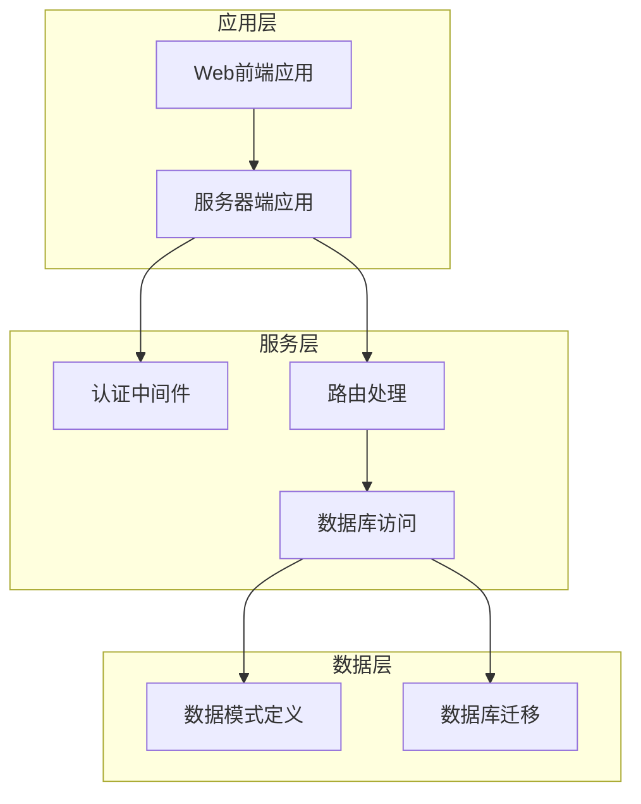
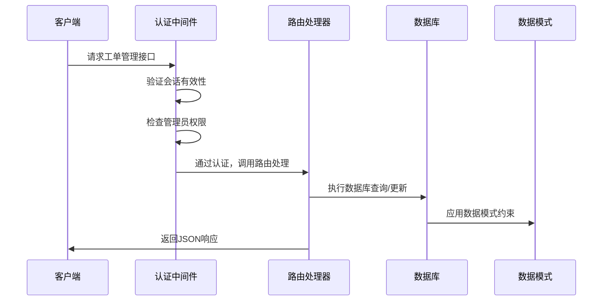
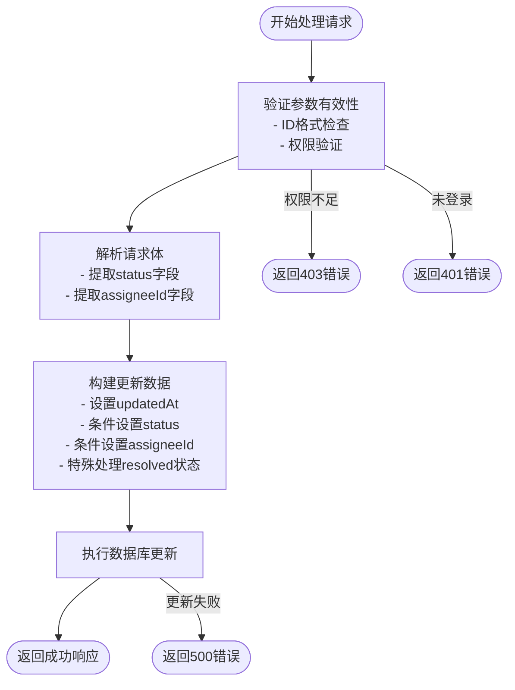
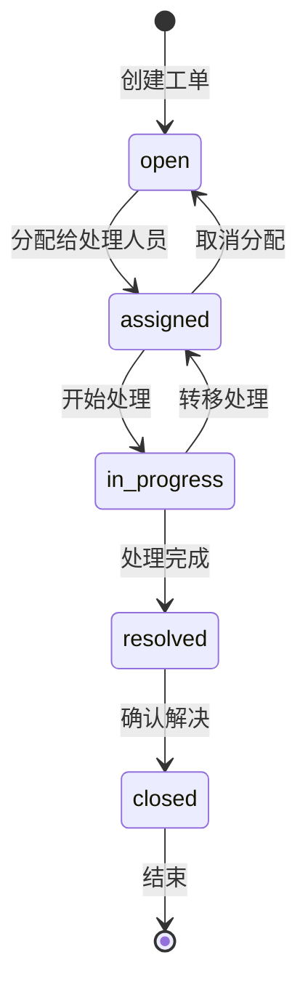
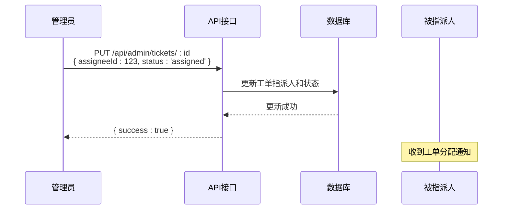
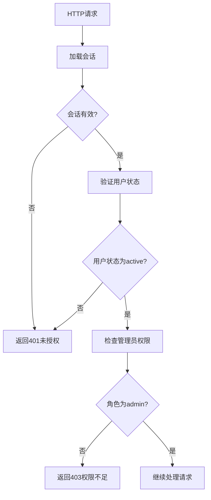
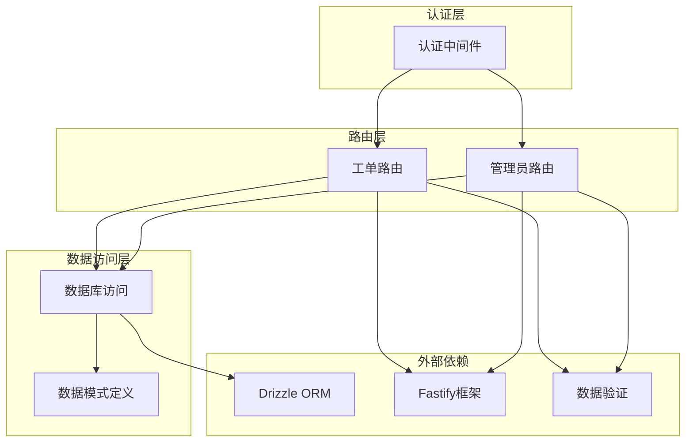

# 工单管理接口

<cite>
**本文档引用的文件**
- [tickets.ts](file://apps/server/src/routes/tickets.ts)
- [schema.ts](file://apps/server/src/db/schema.ts)
- [auth.ts](file://apps/server/src/middleware/auth.ts)
- [TicketManage.tsx](file://apps/web/src/pages/admin/TicketManage.tsx)
</cite>

## 目录
1. [简介](#简介)
2. [项目结构](#项目结构)
3. [核心组件](#核心组件)
4. [架构概览](#架构概览)
5. [详细组件分析](#详细组件分析)
6. [依赖关系分析](#依赖关系分析)
7. [性能考虑](#性能考虑)
8. [故障排除指南](#故障排除指南)
9. [结论](#结论)

## 简介

本文档详细说明了ZBH2平台工单管理系统的管理员更新工单状态接口。该系统提供了完整的工单生命周期管理，包括工单创建、状态流转、指派机制和回复功能。特别关注管理员通过PUT /api/admin/tickets/:id接口更新工单状态的功能，包括状态字段的更新、指派机制、状态流转业务逻辑（特别是resolved状态的特殊处理）以及权限验证机制。

## 项目结构

ZBH2平台采用分层架构设计，主要包含以下核心模块：

**图表来源**
- [tickets.ts:1-137](file://apps/server/src/routes/tickets.ts#L1-L137)
- [auth.ts:1-56](file://apps/server/src/middleware/auth.ts#L1-L56)

**章节来源**
- [tickets.ts:1-137](file://apps/server/src/routes/tickets.ts#L1-L137)
- [schema.ts:98-119](file://apps/server/src/db/schema.ts#L98-L119)

## 核心组件

### 数据模型定义

工单系统基于SQLite数据库，使用Drizzle ORM进行数据访问。核心数据模型包括：

#### 工单表结构
- **主键**: 自增ID
- **标题**: 必填文本字段
- **描述**: 可选文本字段，默认为空字符串
- **类型**: 枚举类型，支持['bug', 'request', 'question', 'other']
- **优先级**: 枚举类型，支持['low', 'medium', 'high', 'urgent']
- **状态**: 枚举类型，支持['open', 'assigned', 'in_progress', 'resolved', 'closed']
- **提交人ID**: 外键关联用户表
- **指派人ID**: 外键关联用户表（可空）
- **创建时间**: 自动设置
- **更新时间**: 自动设置
- **解决时间**: 解决时自动设置

#### 用户表结构
- **角色**: 枚举类型，支持['admin', 'user']
- **状态**: 枚举类型，支持['active', 'disabled']

**章节来源**
- [schema.ts:98-119](file://apps/server/src/db/schema.ts#L98-L119)
- [schema.ts:3-10](file://apps/server/src/db/schema.ts#L3-L10)

### 认证与授权机制

系统采用基于会话的认证机制，通过Cookie存储会话ID。认证中间件提供两个关键功能：

1. **requireAuth**: 验证用户是否已登录
2. **requireAdmin**: 验证用户是否具有管理员权限

**章节来源**
- [auth.ts:42-55](file://apps/server/src/middleware/auth.ts#L42-L55)

## 架构概览

工单管理系统采用RESTful API设计，遵循前后端分离架构模式：

**图表来源**
- [tickets.ts:112-121](file://apps/server/src/routes/tickets.ts#L112-L121)
- [auth.ts:48-55](file://apps/server/src/middleware/auth.ts#L48-L55)

## 详细组件分析

### 管理员工单状态更新接口

#### 接口规范

**端点**: PUT /api/admin/tickets/:id
**认证**: 需要管理员权限
**请求体**: JSON对象，包含以下可选字段：
- `status`: 新的状态值
- `assigneeId`: 指派人ID

**响应**: 成功时返回 `{ success: true }`

#### 实现逻辑分析

**图表来源**
- [tickets.ts:112-121](file://apps/server/src/routes/tickets.ts#L112-L121)

#### 关键实现细节

1. **权限验证**: 使用`requireAdmin`中间件确保只有管理员可以访问
2. **参数处理**: 动态构建更新数据对象，只包含提供的字段
3. **状态特殊处理**: 当状态设为'resolved'时，自动设置`resolvedAt`时间为当前时间
4. **时间戳同步**: 始终更新`updatedAt`字段

**章节来源**
- [tickets.ts:112-121](file://apps/server/src/routes/tickets.ts#L112-L121)

### 状态流转业务逻辑

#### 状态枚举定义

工单状态采用严格的枚举控制：
- `open`: 待处理
- `assigned`: 已分配
- `in_progress`: 处理中
- `resolved`: 已解决
- `closed`: 已关闭

#### 状态流转规则

**图表来源**
- [schema.ts:105-105](file://apps/server/src/db/schema.ts#L105-L105)

#### 特殊状态处理

**resolved状态的特殊处理**:
- 当状态设置为'resolved'时，系统自动记录解决时间
- 解决时间字段在数据库层面定义为可空，允许延迟设置
- 这种设计支持异步解决流程和多步骤确认过程

**章节来源**
- [tickets.ts:118-118](file://apps/server/src/routes/tickets.ts#L118-L118)
- [schema.ts:110-110](file://apps/server/src/db/schema.ts#L110-L110)

### 指派机制

#### assigneeId字段功能

指派机制提供了灵活的工单处理流程：

1. **指派操作**: 通过设置`assigneeId`字段将工单分配给特定用户
2. **状态联动**: 指派时通常需要同时设置状态为'assigned'
3. **权限控制**: 只有管理员可以进行指派操作
4. **外键约束**: 指派人必须是有效的用户ID

#### 指派流程

**图表来源**
- [TicketManage.tsx:86-88](file://apps/web/src/pages/admin/TicketManage.tsx#L86-L88)

**章节来源**
- [TicketManage.tsx:86-88](file://apps/web/src/pages/admin/TicketManage.tsx#L86-L88)

### 权限验证机制

#### 认证流程

**图表来源**
- [auth.ts:17-40](file://apps/server/src/middleware/auth.ts#L17-L40)
- [auth.ts:48-55](file://apps/server/src/middleware/auth.ts#L48-L55)

#### 权限控制要点

1. **会话验证**: 检查Cookie中的会话ID和过期时间
2. **用户状态**: 确保用户账户处于活跃状态
3. **角色检查**: 验证用户具有管理员权限
4. **中间件集成**: 通过`preHandler`钩子自动应用权限控制

**章节来源**
- [auth.ts:17-55](file://apps/server/src/middleware/auth.ts#L17-L55)

### 时间戳同步机制

#### updatedAt字段管理

系统实现了统一的时间戳管理策略：

1. **自动更新**: 所有工单更新操作都会自动更新`updatedAt`字段
2. **一致性保证**: 确保数据变更的时序性
3. **审计追踪**: 便于跟踪工单的变更历史

**章节来源**
- [tickets.ts:115-115](file://apps/server/src/routes/tickets.ts#L115-L115)

## 依赖关系分析

### 组件间依赖

**图表来源**
- [tickets.ts:1-6](file://apps/server/src/routes/tickets.ts#L1-L6)
- [auth.ts:1-3](file://apps/server/src/middleware/auth.ts#L1-L3)

### 外部依赖关系

1. **Drizzle ORM**: 提供类型安全的数据库访问
2. **Fastify**: 提供高性能的Web框架
3. **Zod**: 提供运行时数据验证
4. **SQLite**: 作为底层数据库存储

**章节来源**
- [tickets.ts:1-6](file://apps/server/src/routes/tickets.ts#L1-L6)
- [auth.ts:1-3](file://apps/server/src/middleware/auth.ts#L1-L3)

## 性能考虑

### 数据库优化

1. **索引策略**: 工单表的关键字段（如状态、创建时间）应建立适当的索引
2. **查询优化**: 使用JOIN操作时注意性能影响
3. **连接池**: 合理配置数据库连接池大小

### 缓存策略

1. **会话缓存**: 用户会话信息可以缓存到内存中
2. **静态资源**: 前端静态资源可以使用CDN加速
3. **API响应缓存**: 对于不频繁变化的数据可以考虑缓存

### 并发处理

1. **事务管理**: 对于复杂的工单状态更新操作使用事务
2. **锁机制**: 避免并发更新导致的数据竞争
3. **队列系统**: 对于耗时的操作可以使用异步队列

## 故障排除指南

### 常见问题及解决方案

#### 权限相关问题

**问题**: 401 未授权错误
**原因**: 用户未登录或会话过期
**解决方案**: 
1. 检查客户端Cookie中是否存在sid
2. 验证会话是否在数据库中存在且未过期
3. 确认用户账户状态为active

**问题**: 403 权限不足
**原因**: 用户非管理员身份
**解决方案**:
1. 验证用户角色为'admin'
2. 检查用户权限配置

#### 数据验证错误

**问题**: 400 请求参数错误
**原因**: 请求体格式不正确或缺少必要字段
**解决方案**:
1. 检查请求体JSON格式
2. 验证必需字段的存在性
3. 确认字段类型符合要求

#### 数据库操作错误

**问题**: 500 服务器内部错误
**原因**: 数据库操作失败
**解决方案**:
1. 检查数据库连接状态
2. 验证SQL语句的正确性
3. 查看数据库日志获取详细错误信息

**章节来源**
- [auth.ts:42-55](file://apps/server/src/middleware/auth.ts#L42-L55)
- [tickets.ts:112-121](file://apps/server/src/routes/tickets.ts#L112-L121)

## 结论

ZBH2平台的工单管理接口设计体现了现代Web应用的最佳实践：

1. **安全性**: 严格的身份验证和授权机制
2. **完整性**: 完整的工单生命周期管理
3. **可扩展性**: 清晰的架构设计支持功能扩展
4. **用户体验**: 直观的前端界面和流畅的操作体验

管理员更新工单状态的PUT /api/admin/tickets/:id接口提供了灵活的工单管理能力，包括状态流转、指派机制和时间戳同步等功能。通过合理的权限控制和数据验证，确保了系统的安全性和可靠性。

未来可以考虑的改进方向包括：增加更细粒度的权限控制、实现工单状态的历史追踪、添加工单优先级的智能排序算法等。