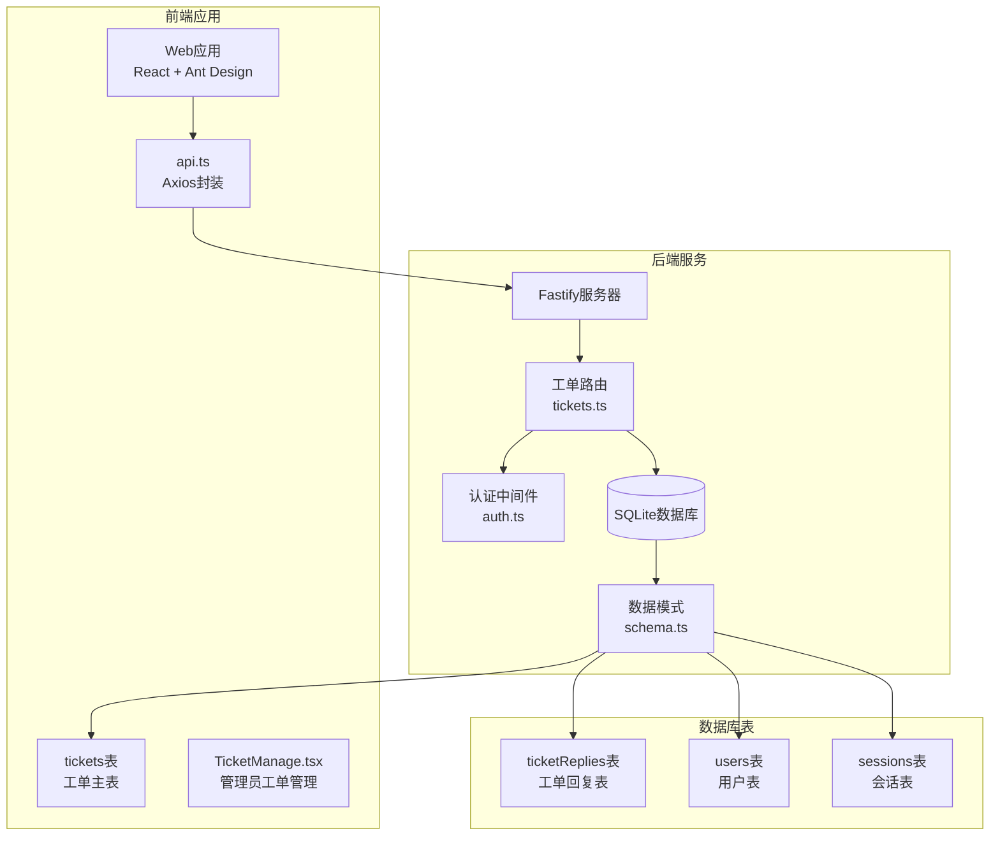
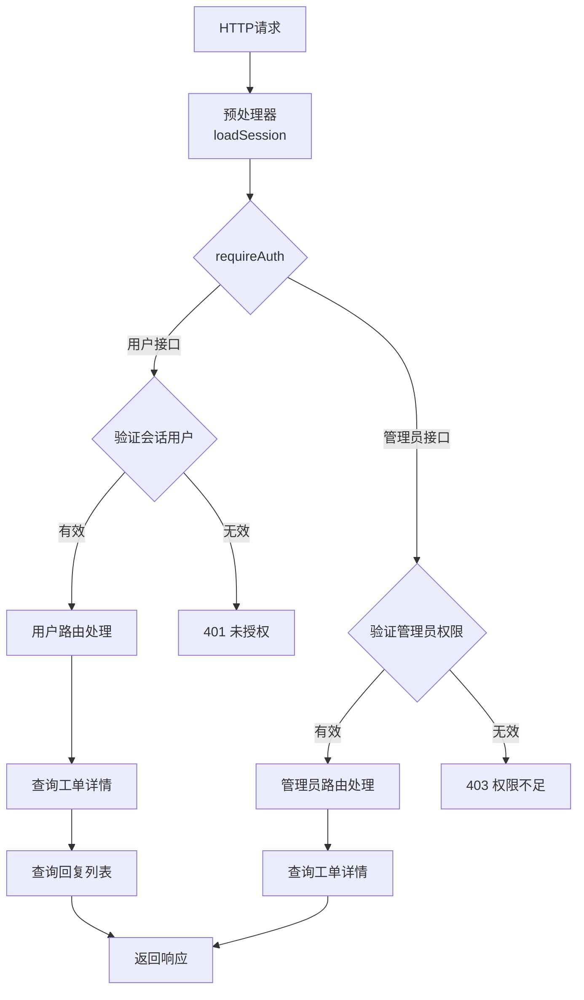
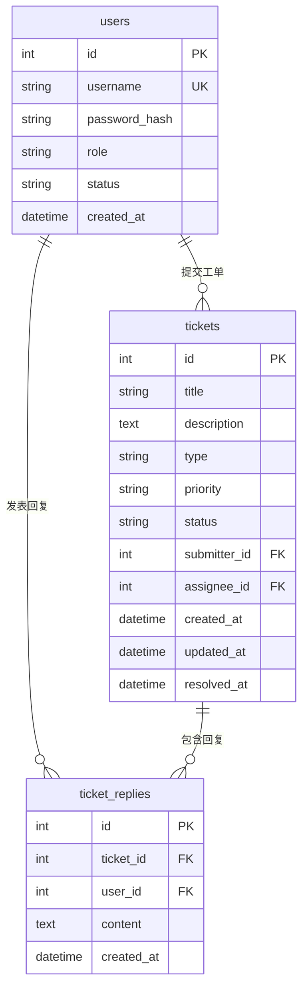
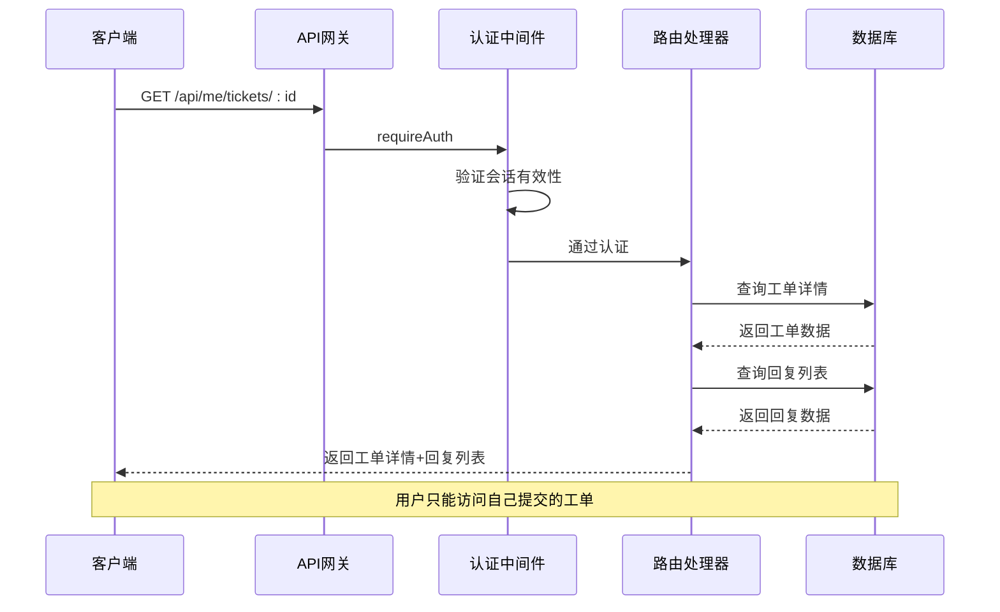
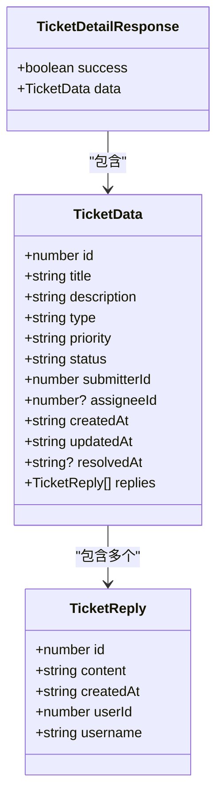
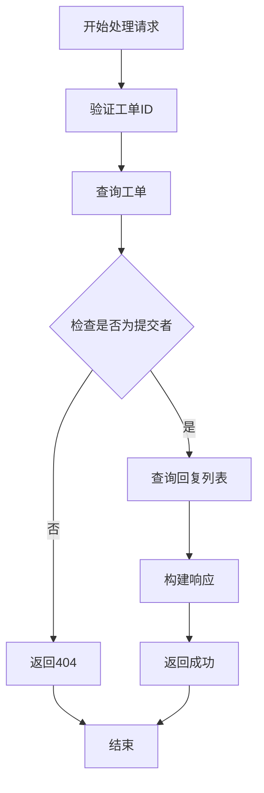
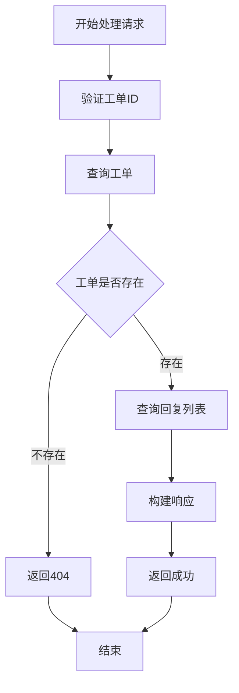
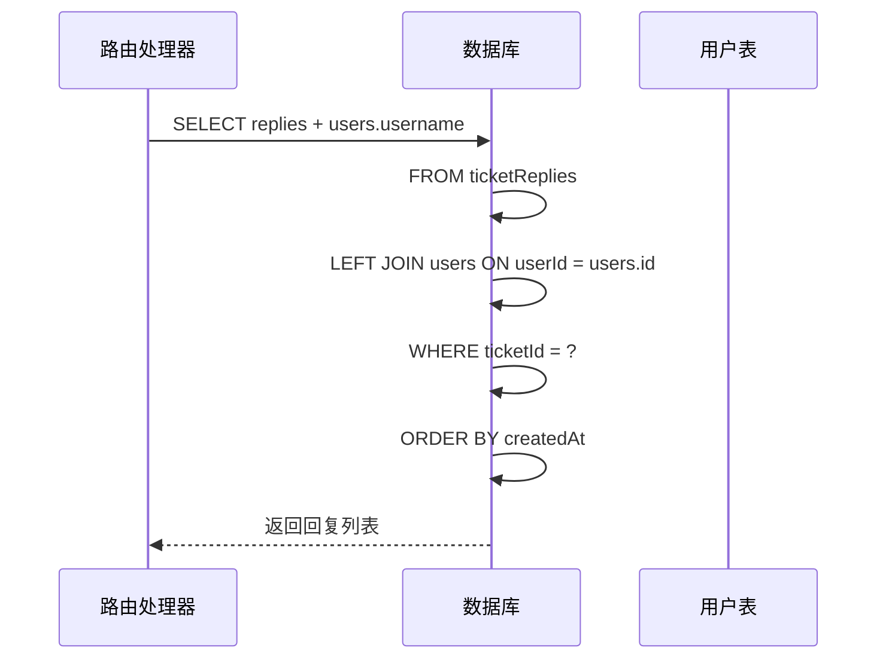
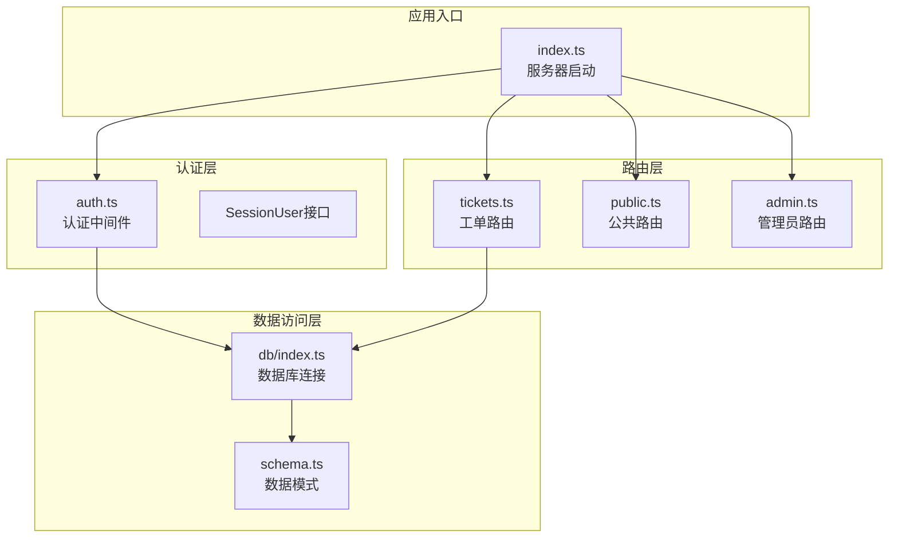

# 工单详情接口

<cite>
**本文档引用的文件**
- [apps/server/src/routes/tickets.ts](file://apps/server/src/routes/tickets.ts)
- [apps/server/src/middleware/auth.ts](file://apps/server/src/middleware/auth.ts)
- [apps/server/src/db/schema.ts](file://apps/server/src/db/schema.ts)
- [apps/server/src/db/index.ts](file://apps/server/src/db/index.ts)
- [apps/server/src/index.ts](file://apps/server/src/index.ts)
- [apps/web/src/pages/Tickets.tsx](file://apps/web/src/pages/Tickets.tsx)
- [apps/web/src/pages/admin/TicketManage.tsx](file://apps/web/src/pages/admin/TicketManage.tsx)
- [apps/web/src/lib/api.ts](file://apps/web/src/lib/api.ts)
</cite>

## 目录
1. [简介](#简介)
2. [项目结构](#项目结构)
3. [核心组件](#核心组件)
4. [架构概览](#架构概览)
5. [详细组件分析](#详细组件分析)
6. [依赖关系分析](#依赖关系分析)
7. [性能考虑](#性能考虑)
8. [故障排除指南](#故障排除指南)
9. [结论](#结论)

## 简介

本文档详细说明ZBH2平台的工单详情接口，包括用户获取个人工单详情的`GET /api/me/tickets/:id`接口和管理员获取工单详情的`GET /api/admin/tickets/:id`接口。该接口提供了完整的工单详情数据结构，包括工单基本信息和关联的回复列表，并实现了严格的权限验证机制。

## 项目结构

ZBH2平台采用前后端分离架构，工单系统位于服务器端的Fastify应用中，通过RESTful API与前端交互。



**图表来源**
- [apps/server/src/index.ts:29-49](file://apps/server/src/index.ts#L29-L49)
- [apps/server/src/routes/tickets.ts:6-136](file://apps/server/src/routes/tickets.ts#L6-L136)
- [apps/server/src/db/schema.ts:98-119](file://apps/server/src/db/schema.ts#L98-L119)

**章节来源**
- [apps/server/src/index.ts:1-60](file://apps/server/src/index.ts#L1-L60)
- [apps/server/src/routes/tickets.ts:1-137](file://apps/server/src/routes/tickets.ts#L1-L137)

## 核心组件

### 工单详情接口概述

系统提供两个工单详情接口，分别服务于不同用户角色：

1. **用户工单详情接口**: `GET /api/me/tickets/:id`
   - 仅允许工单提交者访问
   - 返回工单详情和所有相关回复

2. **管理员工单详情接口**: `GET /api/admin/tickets/:id`
   - 仅允许管理员访问
   - 返回完整的工单详情和回复列表

### 权限验证机制

系统通过两层中间件实现权限控制：



**图表来源**
- [apps/server/src/middleware/auth.ts:42-55](file://apps/server/src/middleware/auth.ts#L42-L55)
- [apps/server/src/routes/tickets.ts:29-46](file://apps/server/src/routes/tickets.ts#L29-L46)
- [apps/server/src/routes/tickets.ts:95-109](file://apps/server/src/routes/tickets.ts#L95-L109)

**章节来源**
- [apps/server/src/middleware/auth.ts:17-55](file://apps/server/src/middleware/auth.ts#L17-L55)
- [apps/server/src/routes/tickets.ts:29-46](file://apps/server/src/routes/tickets.ts#L29-L46)
- [apps/server/src/routes/tickets.ts:95-109](file://apps/server/src/routes/tickets.ts#L95-L109)

## 架构概览

### 数据模型设计

工单系统基于三个核心表构建，采用外键约束确保数据完整性：



**图表来源**
- [apps/server/src/db/schema.ts:98-119](file://apps/server/src/db/schema.ts#L98-L119)

### 接口调用流程



**图表来源**
- [apps/server/src/routes/tickets.ts:29-46](file://apps/server/src/routes/tickets.ts#L29-L46)
- [apps/server/src/middleware/auth.ts:42-46](file://apps/server/src/middleware/auth.ts#L42-L46)

## 详细组件分析

### 用户工单详情接口

#### 接口定义

- **方法**: `GET`
- **路径**: `/api/me/tickets/:id`
- **权限**: 需要用户认证
- **功能**: 获取当前用户提交的指定工单详情

#### 请求参数

| 参数名 | 类型 | 必填 | 描述 |
|--------|------|------|------|
| id | string/number | 是 | 工单ID |

#### 响应数据结构



**图表来源**
- [apps/server/src/routes/tickets.ts:35-45](file://apps/server/src/routes/tickets.ts#L35-L45)

#### 关联查询机制

接口使用LEFT JOIN查询回复列表，确保即使用户被删除也能显示回复信息：

```sql
SELECT 
    ticketReplies.id,
    ticketReplies.content,
    ticketReplies.createdAt,
    ticketReplies.userId,
    users.username
FROM ticketReplies
LEFT JOIN users ON ticketReplies.userId = users.id
WHERE ticketReplies.ticketId = ?
ORDER BY ticketReplies.createdAt
```

#### 权限验证逻辑



**图表来源**
- [apps/server/src/routes/tickets.ts:32-45](file://apps/server/src/routes/tickets.ts#L32-L45)

**章节来源**
- [apps/server/src/routes/tickets.ts:29-46](file://apps/server/src/routes/tickets.ts#L29-L46)

### 管理员工单详情接口

#### 接口定义

- **方法**: `GET`
- **路径**: `/api/admin/tickets/:id`
- **权限**: 需要管理员权限
- **功能**: 获取任意工单的完整详情

#### 请求参数

| 参数名 | 类型 | 必填 | 描述 |
|--------|------|------|------|
| id | string/number | 是 | 工单ID |

#### 响应数据结构

与用户接口相同，但管理员可以看到所有工单的详情。

#### 权限验证逻辑



**图表来源**
- [apps/server/src/routes/tickets.ts:98-109](file://apps/server/src/routes/tickets.ts#L98-L109)

**章节来源**
- [apps/server/src/routes/tickets.ts:95-109](file://apps/server/src/routes/tickets.ts#L95-L109)

### 回复数据关联查询

#### 查询机制

系统使用LEFT JOIN确保回复数据的完整性：



**图表来源**
- [apps/server/src/routes/tickets.ts:41-44](file://apps/server/src/routes/tickets.ts#L41-L44)
- [apps/server/src/routes/tickets.ts:104-107](file://apps/server/src/routes/tickets.ts#L104-L107)

#### 数据完整性保证

- 使用LEFT JOIN避免因用户删除导致的回复丢失
- 即使用户账户被删除，仍能显示回复内容
- 通过username字段显示回复用户的名称

**章节来源**
- [apps/server/src/routes/tickets.ts:41-44](file://apps/server/src/routes/tickets.ts#L41-L44)
- [apps/server/src/routes/tickets.ts:104-107](file://apps/server/src/routes/tickets.ts#L104-L107)

## 依赖关系分析

### 组件依赖图



**图表来源**
- [apps/server/src/index.ts:11-49](file://apps/server/src/index.ts#L11-L49)
- [apps/server/src/middleware/auth.ts:17-40](file://apps/server/src/middleware/auth.ts#L17-L40)
- [apps/server/src/db/index.ts:14-15](file://apps/server/src/db/index.ts#L14-L15)

### 外部依赖

系统依赖以下关键包：

| 包名 | 版本 | 用途 |
|------|------|------|
| fastify | ^4.0.0 | Web框架 |
| @fastify/cookie | ^6.0.0 | Cookie处理 |
| @fastify/cors | ^6.0.0 | CORS支持 |
| @fastify/helmet | ^5.0.0 | 安全头设置 |
| drizzle-orm | ^0.28.0 | ORM映射 |
| better-sqlite3 | ^8.0.0 | SQLite驱动 |

**章节来源**
- [apps/server/src/index.ts:1-60](file://apps/server/src/index.ts#L1-L60)
- [apps/server/src/db/index.ts:1-16](file://apps/server/src/db/index.ts#L1-L16)

## 性能考虑

### 查询优化策略

1. **索引使用**: 工单表的`submitterId`和回复表的`ticketId`字段用于快速过滤
2. **选择性字段**: 只查询必要的字段，避免SELECT *
3. **排序优化**: 按创建时间排序，利用索引进行高效排序
4. **连接优化**: 使用LEFT JOIN确保数据完整性

### 缓存策略

- 回复列表按时间顺序缓存，避免重复查询
- 工单详情在短时间内不会频繁变化
- 建议在应用层添加适当的缓存机制

### 错误处理优化

- 提供清晰的错误消息，便于调试
- 区分不同类型的错误（未认证、权限不足、资源不存在）
- 统一的响应格式，便于前端处理

## 故障排除指南

### 常见问题及解决方案

#### 401 未认证错误
**症状**: 访问工单详情时返回401错误
**原因**: 会话失效或未登录
**解决方案**: 
- 检查Cookie中的sid是否有效
- 确认用户会话是否过期
- 重新登录系统

#### 403 权限不足
**症状**: 管理员访问用户工单详情失败
**原因**: 非管理员用户尝试访问管理员接口
**解决方案**:
- 确认用户角色为admin
- 检查用户权限配置

#### 404 工单不存在
**症状**: 访问不存在的工单ID
**原因**: 工单ID错误或工单已被删除
**解决方案**:
- 验证工单ID的有效性
- 检查工单是否仍然存在

#### 数据不完整
**症状**: 回复列表中用户名显示为空
**原因**: 用户账户已被删除但仍保留回复
**解决方案**:
- 这是预期行为，LEFT JOIN确保数据完整性
- 前端应该优雅处理空用户名的情况

**章节来源**
- [apps/server/src/middleware/auth.ts:42-55](file://apps/server/src/middleware/auth.ts#L42-L55)
- [apps/server/src/routes/tickets.ts:34-35](file://apps/server/src/routes/tickets.ts#L34-L35)
- [apps/server/src/routes/tickets.ts:99](file://apps/server/src/routes/tickets.ts#L99)

## 结论

ZBH2平台的工单详情接口设计合理，实现了以下关键特性：

1. **严格的权限控制**: 通过两层中间件确保用户只能访问自己的工单
2. **完整的数据结构**: 返回工单详情和关联的回复列表
3. **数据完整性保证**: 使用LEFT JOIN确保即使用户删除也能显示回复
4. **清晰的错误处理**: 提供明确的错误信息和状态码
5. **良好的扩展性**: 基于Drizzle ORM的设计便于后续功能扩展

该接口为用户和管理员提供了完整的工单管理体验，同时保持了系统的安全性和数据完整性。