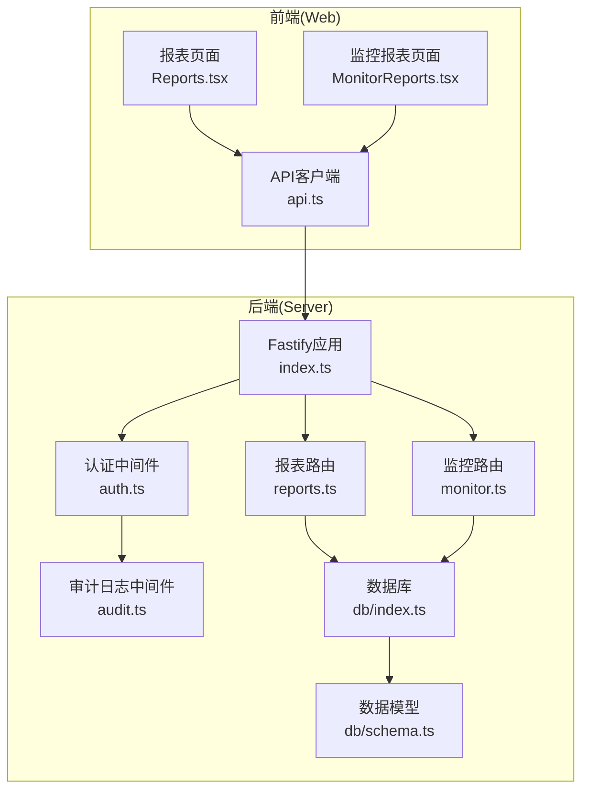
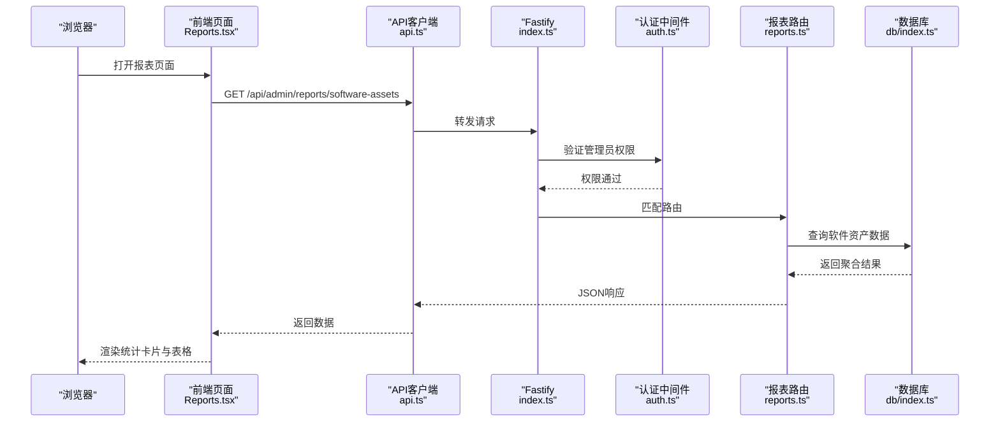
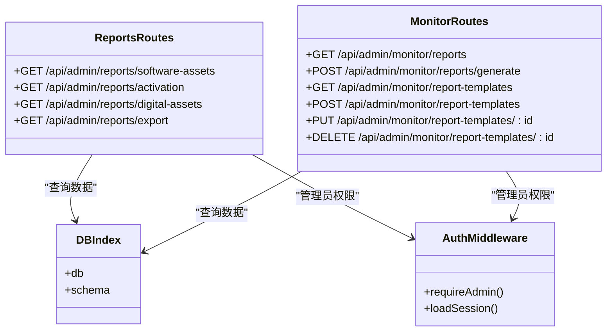

# 报表API

<cite>
**本文档引用的文件**
- [apps/server/src/routes/reports.ts](file://apps/server/src/routes/reports.ts)
- [apps/web/src/pages/admin/Reports.tsx](file://apps/web/src/pages/admin/Reports.tsx)
- [apps/server/src/db/schema.ts](file://apps/server/src/db/schema.ts)
- [apps/server/src/middleware/auth.ts](file://apps/server/src/middleware/auth.ts)
- [apps/web/src/lib/api.ts](file://apps/web/src/lib/api.ts)
- [apps/server/src/db/index.ts](file://apps/server/src/db/index.ts)
- [apps/server/src/index.ts](file://apps/server/src/index.ts)
- [apps/web/src/pages/admin/MonitorReports.tsx](file://apps/web/src/pages/admin/MonitorReports.tsx)
- [apps/server/src/routes/monitor.ts](file://apps/server/src/routes/monitor.ts)
- [apps/server/src/middleware/audit.ts](file://apps/server/src/middleware/audit.ts)
</cite>

## 目录
1. [简介](#简介)
2. [项目结构](#项目结构)
3. [核心组件](#核心组件)
4. [架构概览](#架构概览)
5. [详细组件分析](#详细组件分析)
6. [依赖关系分析](#依赖关系分析)
7. [性能考量](#性能考量)
8. [故障排除指南](#故障排除指南)
9. [结论](#结论)
10. [附录](#附录)

## 简介
本文件为ZBH2平台的报表API提供全面的技术文档，覆盖以下方面：
- 数据报表接口：查询条件、时间范围与数据聚合
- 统计图表接口：图表类型、数据格式与交互配置
- 导出功能接口：格式选择、文件生成与下载机制
- 实时报表接口：WebSocket连接、增量更新与数据同步（当前实现为定时轮询）
- 请求/响应示例：报表查询、图表渲染、数据导出、实时更新等场景
- 报表模板：多种报表模板、自定义字段与权限控制
- 性能优化：缓存策略与大数据量处理

## 项目结构
后端采用Fastify框架，路由集中在apps/server/src/routes目录；前端使用React + Ant Design，报表页面位于apps/web/src/pages/admin。数据库采用SQLite并通过Drizzle ORM访问。

**图表来源**
- [apps/server/src/index.ts:29-54](file://apps/server/src/index.ts#L29-L54)
- [apps/server/src/routes/reports.ts:6-146](file://apps/server/src/routes/reports.ts#L6-L146)
- [apps/server/src/routes/monitor.ts:13-595](file://apps/server/src/routes/monitor.ts#L13-L595)
- [apps/server/src/db/index.ts:1-16](file://apps/server/src/db/index.ts#L1-L16)
- [apps/server/src/db/schema.ts:1-330](file://apps/server/src/db/schema.ts#L1-L330)

**章节来源**
- [apps/server/src/index.ts:1-60](file://apps/server/src/index.ts#L1-L60)
- [apps/web/src/lib/api.ts:1-16](file://apps/web/src/lib/api.ts#L1-L16)

## 核心组件
- 报表路由模块：提供软件资产、激活码使用、数字资产三类报表接口，并支持导出合并报表。
- 监控报表模块：提供监控目标、监控项、阈值、记录、告警、仪表盘、报告与模板管理。
- 认证与权限：基于会话的管理员权限控制。
- 数据模型：涵盖软件、激活、资产、监控等业务实体。
- 前端页面：报表页面负责调用接口、渲染统计卡片与表格，并提供导出按钮。

**章节来源**
- [apps/server/src/routes/reports.ts:9-145](file://apps/server/src/routes/reports.ts#L9-L145)
- [apps/server/src/routes/monitor.ts:321-453](file://apps/server/src/routes/monitor.ts#L321-L453)
- [apps/server/src/middleware/auth.ts:48-55](file://apps/server/src/middleware/auth.ts#L48-L55)
- [apps/server/src/db/schema.ts:37-146](file://apps/server/src/db/schema.ts#L37-L146)
- [apps/web/src/pages/admin/Reports.tsx:8-138](file://apps/web/src/pages/admin/Reports.tsx#L8-L138)

## 架构概览
后端通过Fastify注册路由，所有报表相关接口均受管理员权限保护。前端通过Axios客户端以同源方式调用API，自动携带Cookie进行鉴权。数据库为SQLite，使用WAL模式提升并发读写性能。

**图表来源**
- [apps/web/src/pages/admin/Reports.tsx:14-25](file://apps/web/src/pages/admin/Reports.tsx#L14-L25)
- [apps/web/src/lib/api.ts:3](file://apps/web/src/lib/api.ts#L3)
- [apps/server/src/index.ts:37](file://apps/server/src/index.ts#L37)
- [apps/server/src/middleware/auth.ts:48-55](file://apps/server/src/middleware/auth.ts#L48-L55)
- [apps/server/src/routes/reports.ts:10-34](file://apps/server/src/routes/reports.ts#L10-L34)
- [apps/server/src/db/index.ts:14](file://apps/server/src/db/index.ts#L14)

## 详细组件分析

### 数据报表接口
- 接口路径与功能
  - 软件资产报表：GET /api/admin/reports/software-assets
  - 激活码使用报表：GET /api/admin/reports/activation
  - 数字资产报表：GET /api/admin/reports/digital-assets
  - 合并导出报表：GET /api/admin/reports/export

- 查询条件与时间范围
  - 软件资产报表：按分类统计总数、已发布数、草稿数。
  - 激活码使用报表：按产品统计码总量、可用、已发放、已作废与使用率；月度发放趋势（最近12个月）。
  - 数字资产报表：按状态与分类统计数量，计算资产总值与在用资产总值。
  - 合并导出报表：返回软件清单、激活产品、激活发放明细与数字资产全量数据。

- 数据聚合逻辑
  - 使用内存聚合（遍历集合、累计计数与求和），避免复杂SQL分组。
  - 激活码使用报表中计算使用率百分比并四舍五入到整数。

- 响应结构
  - 成功响应包含success布尔值与data对象，data包含各报表所需字段及生成时间戳。
  - 导出接口返回JSON结构，便于前端直接下载为文件。

- 请求/响应示例
  - 请求：GET /api/admin/reports/software-assets
  - 响应：包含totalSoftware、publishedCount、draftCount、byCategory、generatedAt等字段

**章节来源**
- [apps/server/src/routes/reports.ts:10-145](file://apps/server/src/routes/reports.ts#L10-L145)

### 统计图表接口与前端渲染
- 前端页面
  - 报表页面通过Promise.all并发请求三个报表接口，加载完成后渲染统计卡片与表格。
  - 提供“导出完整报表”按钮，将合并导出接口返回的数据序列化为JSON并触发下载。

- 图表类型与数据格式
  - 当前页面使用Ant Design的Statistic卡片与Table组件展示数据，未直接调用专用图表库。
  - 若需要图表渲染，可在现有数据基础上扩展，例如使用ECharts或AntV G2等库，数据格式可复用现有结构。

- 交互配置
  - 支持切换标签页查看不同报表。
  - 表格支持分页（部分报表在前端模拟分页，实际后端接口未分页）。

**章节来源**
- [apps/web/src/pages/admin/Reports.tsx:14-38](file://apps/web/src/pages/admin/Reports.tsx#L14-L38)
- [apps/web/src/pages/admin/Reports.tsx:46-134](file://apps/web/src/pages/admin/Reports.tsx#L46-L134)

### 导出功能接口
- 接口路径：GET /api/admin/reports/export
- 功能：返回合并后的报表数据，包含软件、激活产品、激活发放明细与数字资产。
- 文件生成与下载机制
  - 前端将响应数据转换为JSON字符串，创建Blob对象，生成临时URL并触发浏览器下载。
  - 下载文件名包含日期，便于区分不同导出时间。

- 请求/响应示例
  - 请求：GET /api/admin/reports/export
  - 响应：包含reportTitle、generatedAt与多个数组字段（software、activationProducts、activationGrants、digitalAssets）

**章节来源**
- [apps/server/src/routes/reports.ts:114-145](file://apps/server/src/routes/reports.ts#L114-L145)
- [apps/web/src/pages/admin/Reports.tsx:27-38](file://apps/web/src/pages/admin/Reports.tsx#L27-L38)

### 实时报表接口
- 当前实现
  - 后端未提供WebSocket实时推送；前端通过定时轮询获取最新数据。
  - 报表页面在挂载时一次性拉取数据，未实现增量更新。

- 可选改进方案
  - 引入WebSocket：后端建立连接，推送增量数据；前端监听事件并更新UI。
  - 增量更新：后端返回上次查询时间戳，前端下次请求携带since参数，仅返回变更数据。
  - 轮询优化：设置合理的轮询间隔与退避策略，避免频繁请求。

- 与监控报表的对比
  - 监控报表模块具备生成报告与模板管理能力，但同样未见WebSocket推送，采用轮询式管理界面。

**章节来源**
- [apps/web/src/pages/admin/Reports.tsx:14-25](file://apps/web/src/pages/admin/Reports.tsx#L14-L25)
- [apps/server/src/routes/monitor.ts:332-391](file://apps/server/src/routes/monitor.ts#L332-L391)

### 报表模板与自定义字段
- 软件资产报表
  - 字段：分类名称、总数、已发布、草稿。
  - 自定义：可扩展为按版本、状态、创建时间等维度聚合。

- 激活码使用报表
  - 字段：产品名称、码总量、可用、已发放、已作废、使用率。
  - 自定义：支持按时间段筛选、按产品维度聚合。

- 数字资产报表
  - 字段：资产总数、按状态与分类统计、资产总值、在用资产总值。
  - 自定义：可增加折旧、责任人、维保到期等字段。

- 监控报表模板
  - 字段：模板名称、描述、配置（JSON），配置包含指标ID列表与显示类型映射。
  - 使用：生成报告时可选择模板，按模板配置渲染不同图表与表格。

**章节来源**
- [apps/server/src/routes/reports.ts:10-111](file://apps/server/src/routes/reports.ts#L10-L111)
- [apps/server/src/routes/monitor.ts:410-453](file://apps/server/src/routes/monitor.ts#L410-L453)

### 权限控制
- 管理员权限
  - 所有报表接口均通过requireAdmin中间件保护，仅管理员可访问。
  - 未登录或非管理员用户将收到401/403错误。

- 会话与鉴权
  - 通过Cookie中的sid查找有效会话，校验过期时间与用户状态。
  - 会话用户信息注入到请求上下文，供后续中间件与路由使用。

**章节来源**
- [apps/server/src/routes/reports.ts:7](file://apps/server/src/routes/reports.ts#L7)
- [apps/server/src/middleware/auth.ts:48-55](file://apps/server/src/middleware/auth.ts#L48-L55)
- [apps/server/src/middleware/auth.ts:17-40](file://apps/server/src/middleware/auth.ts#L17-L40)

## 依赖关系分析

**图表来源**
- [apps/server/src/routes/reports.ts:6-146](file://apps/server/src/routes/reports.ts#L6-L146)
- [apps/server/src/routes/monitor.ts:13-595](file://apps/server/src/routes/monitor.ts#L13-L595)
- [apps/server/src/middleware/auth.ts:48-55](file://apps/server/src/middleware/auth.ts#L48-L55)
- [apps/server/src/db/index.ts:14](file://apps/server/src/db/index.ts#L14)

**章节来源**
- [apps/server/src/routes/reports.ts:6-146](file://apps/server/src/routes/reports.ts#L6-L146)
- [apps/server/src/routes/monitor.ts:13-595](file://apps/server/src/routes/monitor.ts#L13-L595)
- [apps/server/src/middleware/auth.ts:48-55](file://apps/server/src/middleware/auth.ts#L48-L55)

## 性能考量
- 数据库与索引
  - 使用SQLite WAL模式提升并发读写性能。
  - 当前报表接口多为小规模聚合，未见复杂索引配置。

- 查询优化
  - 软件资产与数字资产报表采用内存聚合，避免复杂SQL分组，适合中小规模数据。
  - 激活码使用报表按产品聚合，时间复杂度O(n)，n为激活码数量。

- 分页与大数据量
  - 报表接口未实现分页，建议对大表（如激活发放明细）增加分页参数与索引。
  - 前端导出接口返回全量数据，建议提供分批导出或CSV格式以降低内存占用。

- 缓存策略
  - 可引入Redis缓存热点报表数据，设置合理TTL。
  - 对于静态或低频变化的数据（如软件分类、资产分类），可缓存字典表。

- 前端优化
  - 并发请求已通过Promise.all实现，减少等待时间。
  - 建议对重复请求进行去重与节流，避免频繁刷新导致抖动。

**章节来源**
- [apps/server/src/db/index.ts:10-12](file://apps/server/src/db/index.ts#L10-L12)
- [apps/server/src/routes/reports.ts:10-145](file://apps/server/src/routes/reports.ts#L10-L145)

## 故障排除指南
- 401 未登录
  - 现象：访问报表接口返回未登录错误。
  - 处理：确保登录并携带有效Cookie；检查会话是否过期。

- 403 权限不足
  - 现象：非管理员用户访问报表接口被拒绝。
  - 处理：确认用户角色为管理员；重新登录。

- 导出失败
  - 现象：点击导出按钮后无文件下载。
  - 处理：检查网络连接与浏览器下载权限；确认后端返回数据结构正确。

- 数据不一致
  - 现象：前端显示数据与后端聚合结果不符。
  - 处理：核对聚合逻辑与数据源；检查是否有并发写入导致的瞬时差异。

**章节来源**
- [apps/server/src/middleware/auth.ts:48-55](file://apps/server/src/middleware/auth.ts#L48-L55)
- [apps/web/src/pages/admin/Reports.tsx:27-38](file://apps/web/src/pages/admin/Reports.tsx#L27-L38)

## 结论
ZBH2平台的报表API提供了基础的三类数据报表与导出能力，配合前端页面实现直观的统计展示。当前实现以管理员权限保护、会话鉴权为基础，采用轮询方式获取数据。对于大规模数据与实时需求，建议引入分页、缓存与WebSocket推送等优化措施，以提升用户体验与系统性能。

## 附录

### API定义与示例

- 软件资产报表
  - 方法：GET
  - 路径：/api/admin/reports/software-assets
  - 响应字段：totalSoftware、publishedCount、draftCount、byCategory、generatedAt
  - 示例响应：包含按分类统计的总数、已发布与草稿数量

- 激活码使用报表
  - 方法：GET
  - 路径：/api/admin/reports/activation
  - 响应字段：productStats（含产品统计）、totalGrants、monthlyGrants、generatedAt
  - 示例响应：按产品统计码总量、可用、已发放、已作废与使用率

- 数字资产报表
  - 方法：GET
  - 路径：/api/admin/reports/digital-assets
  - 响应字段：totalAssets、byStatus、byCategory、totalValue、activeValue、generatedAt
  - 示例响应：按状态与分类统计资产数量与价值

- 合并导出报表
  - 方法：GET
  - 路径：/api/admin/reports/export
  - 响应字段：reportTitle、generatedAt、software、activationProducts、activationGrants、digitalAssets
  - 示例响应：JSON结构，包含全量报表数据

- 监控报表模板管理
  - 获取模板：GET /api/admin/monitor/report-templates
  - 新增模板：POST /api/admin/monitor/report-templates
  - 更新模板：PUT /api/admin/monitor/report-templates/:id
  - 删除模板：DELETE /api/admin/monitor/report-templates/:id

- 生成监控报告
  - 方法：POST
  - 路径：/api/admin/monitor/reports/generate
  - 请求体字段：title、type、startTime、endTime、templateId（可选）
  - 响应字段：生成的报告记录

**章节来源**
- [apps/server/src/routes/reports.ts:10-145](file://apps/server/src/routes/reports.ts#L10-L145)
- [apps/server/src/routes/monitor.ts:410-453](file://apps/server/src/routes/monitor.ts#L410-L453)
- [apps/server/src/routes/monitor.ts:332-391](file://apps/server/src/routes/monitor.ts#L332-L391)