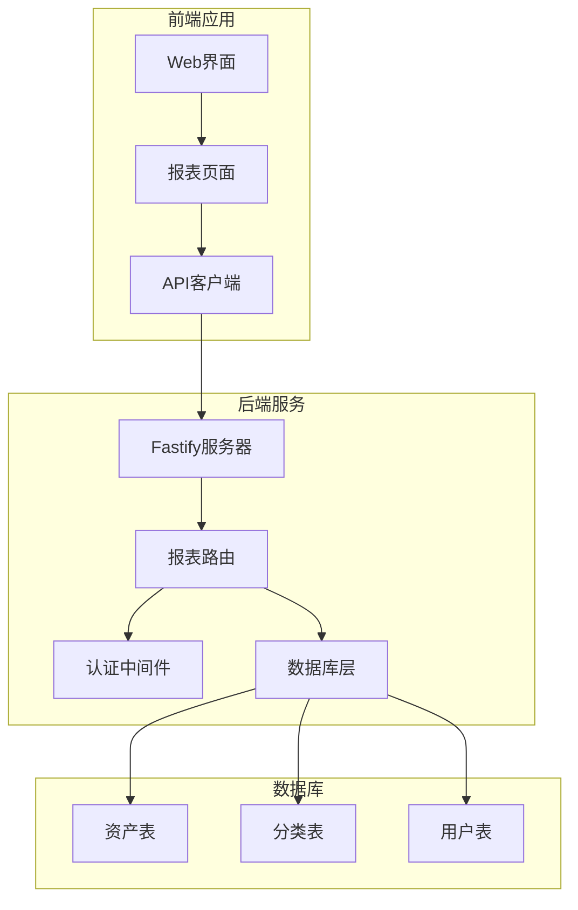
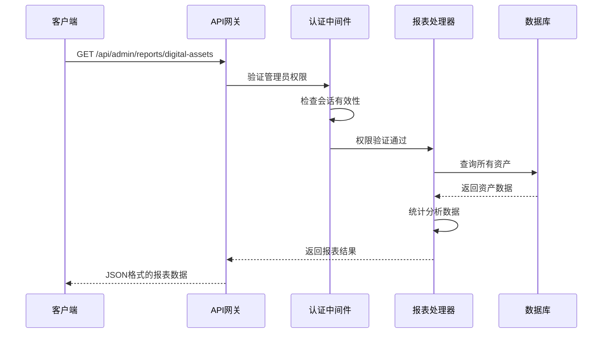
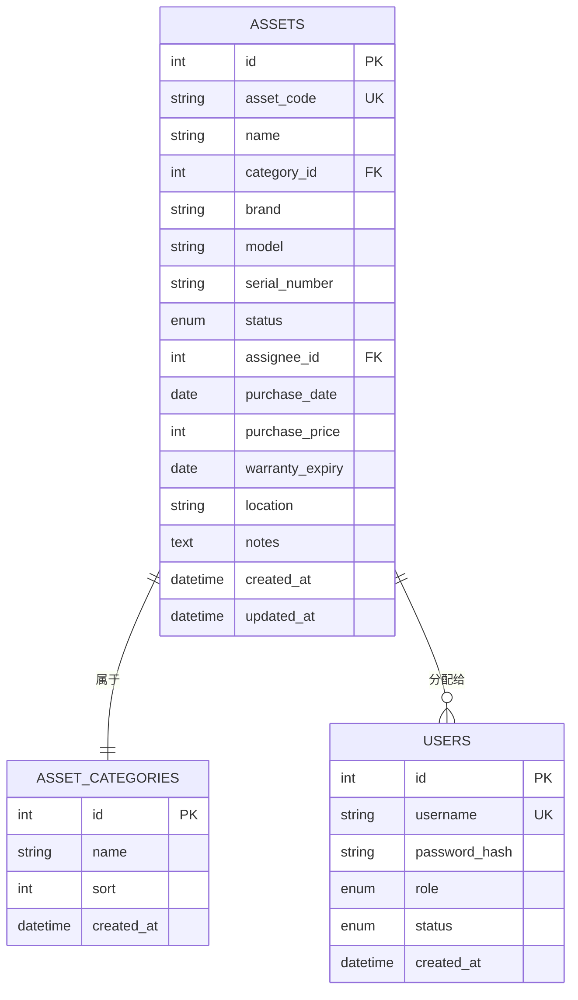
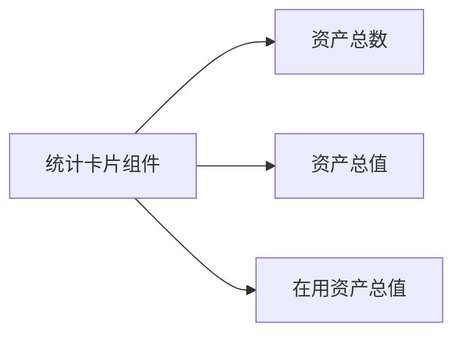
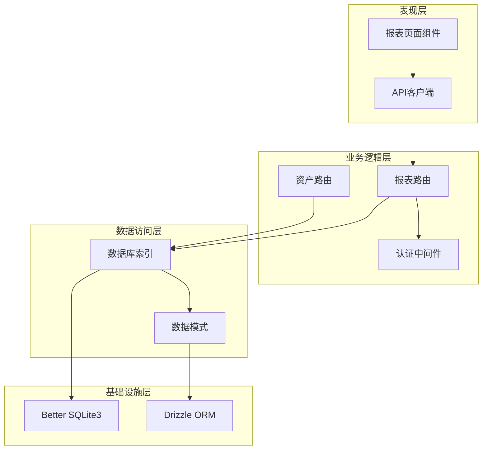

# 数字资产报表

<cite>
**本文档引用的文件**
- [reports.ts](file://apps/server/src/routes/reports.ts)
- [schema.ts](file://apps/server/src/db/schema.ts)
- [Reports.tsx](file://apps/web/src/pages/admin/Reports.tsx)
- [api.ts](file://apps/web/src/lib/api.ts)
- [types.ts](file://packages/shared/src/types.ts)
- [auth.ts](file://apps/server/src/middleware/auth.ts)
- [index.ts](file://apps/server/src/db/index.ts)
- [assets.ts](file://apps/server/src/routes/assets.ts)
</cite>

## 目录
1. [简介](#简介)
2. [项目结构](#项目结构)
3. [核心组件](#核心组件)
4. [架构概览](#架构概览)
5. [详细组件分析](#详细组件分析)
6. [依赖关系分析](#依赖关系分析)
7. [性能考虑](#性能考虑)
8. [故障排除指南](#故障排除指南)
9. [结论](#结论)

## 简介

ZBH2平台的数字资产报表接口提供了全面的数字资产管理统计功能。该接口能够对组织内的数字资产进行全面的统计分析，包括资产总数、状态分布、分类统计、价值分析等核心指标。通过该接口，管理员可以实时了解组织数字资产的整体状况，为资产管理决策提供数据支持。

数字资产报表接口主要服务于以下场景：
- 资产管理统计分析
- 资产价值评估
- 资产状态监控
- 分类统计分析
- 管理决策支持

## 项目结构

ZBH2平台采用前后端分离的架构设计，数字资产报表功能分布在以下关键模块中：



**图表来源**
- [reports.ts:1-146](file://apps/server/src/routes/reports.ts#L1-L146)
- [Reports.tsx:1-138](file://apps/web/src/pages/admin/Reports.tsx#L1-L138)

**章节来源**
- [reports.ts:1-146](file://apps/server/src/routes/reports.ts#L1-L146)
- [Reports.tsx:1-138](file://apps/web/src/pages/admin/Reports.tsx#L1-L138)

## 核心组件

数字资产报表系统由多个核心组件构成，每个组件负责特定的功能领域：

### 后端API组件
- **报表路由处理器**：处理数字资产报表的HTTP请求
- **认证中间件**：确保只有管理员可以访问报表功能
- **数据库访问层**：提供数据持久化和查询功能

### 前端展示组件
- **报表页面**：提供用户友好的报表展示界面
- **统计卡片**：显示关键指标的可视化卡片
- **表格组件**：展示详细的统计数据

### 数据模型组件
- **资产实体**：表示具体的数字资产对象
- **分类实体**：管理资产的分类体系
- **状态枚举**：定义资产的各种状态

**章节来源**
- [reports.ts:76-111](file://apps/server/src/routes/reports.ts#L76-L111)
- [Reports.tsx:104-132](file://apps/web/src/pages/admin/Reports.tsx#L104-L132)

## 架构概览

数字资产报表系统采用RESTful API架构，遵循分层设计原则：



**图表来源**
- [reports.ts:76-111](file://apps/server/src/routes/reports.ts#L76-L111)
- [auth.ts:48-55](file://apps/server/src/middleware/auth.ts#L48-L55)

系统架构特点：
- **分层设计**：清晰的业务逻辑分层
- **权限控制**：基于角色的访问控制
- **数据一致性**：事务性数据操作
- **可扩展性**：模块化的组件设计

## 详细组件分析

### 数字资产报表API

数字资产报表API是整个系统的核心组件，负责提供完整的资产统计功能。

#### API端点定义

| 端点 | 方法 | 描述 | 权限要求 |
|------|------|------|----------|
| `/api/admin/reports/digital-assets` | GET | 获取数字资产综合报表 | 管理员 |
| `/api/admin/reports/software-assets` | GET | 获取软件资产报表 | 管理员 |
| `/api/admin/reports/activation` | GET | 获取激活码使用报表 | 管理员 |
| `/api/admin/reports/export` | GET | 导出完整报表数据 | 管理员 |

#### 数据模型设计



**图表来源**
- [schema.ts:129-146](file://apps/server/src/db/schema.ts#L129-L146)
- [schema.ts:122-127](file://apps/server/src/db/schema.ts#L122-L127)
- [schema.ts:3-10](file://apps/server/src/db/schema.ts#L3-L10)

#### 资产状态标签映射

系统定义了完整的资产状态标签映射，用于将内部状态代码转换为用户友好的中文显示：

| 内部状态代码 | 中文显示名称 | 状态含义 |
|-------------|-------------|----------|
| `in_stock` | 库存中 | 资产处于库存状态，可用于分配 |
| `in_use` | 使用中 | 资产正在被用户使用 |
| `maintenance` | 维护中 | 资产正在进行维护或维修 |
| `retired` | 已退役 | 资产已停止使用但仍可回收 |
| `scrapped` | 已报废 | 资产已损坏无法使用 |

#### 价值统计逻辑

价值统计是数字资产报表的核心功能之一，系统提供了两种价值计算方式：

**总资产价值计算规则**：
- 对所有资产的购买价格进行累加
- 包含所有状态的资产（库存、使用、维护、退役、报废）
- 适用于全面的价值评估

**活跃资产价值计算规则**：
- 仅计算当前仍处于活跃状态的资产
- 活跃状态包括：库存中、使用中、维护中
- 排除已退役和已报废的资产
- 适用于当前实际使用价值评估

#### 请求/响应示例

**请求示例**：
```
GET /api/admin/reports/digital-assets
Authorization: Bearer <admin_token>
Content-Type: application/json
```

**响应示例**：
```json
{
  "success": true,
  "data": {
    "totalAssets": 150,
    "byStatus": {
      "库存中": 60,
      "使用中": 75,
      "维护中": 10,
      "已退役": 4,
      "已报废": 1
    },
    "byCategory": {
      "笔记本电脑": 45,
      "台式机": 35,
      "显示器": 25,
      "打印机": 15,
      "其他设备": 30
    },
    "totalValue": 2500000,
    "activeValue": 2250000,
    "generatedAt": "2024-01-15T10:30:00Z"
  }
}
```

#### 资产分类映射

系统支持灵活的资产分类管理，分类映射机制如下：

**分类映射流程**：
1. 从资产分类表获取所有分类信息
2. 创建分类ID到分类名称的映射表
3. 在统计过程中将分类ID转换为分类名称
4. 处理未分类资产（显示为"未分类"）

**分类统计规则**：
- 按分类名称进行分组统计
- 自动处理未分类资产
- 支持新增分类的动态统计

### 前端展示组件

前端报表页面提供了直观的数据展示界面，包含多种统计视图：

#### 统计卡片设计

系统使用Ant Design的统计卡片组件展示关键指标：



**图表来源**
- [Reports.tsx:108-112](file://apps/web/src/pages/admin/Reports.tsx#L108-L112)

#### 表格组件设计

系统使用表格组件展示详细的统计数据：

**状态统计表格**：
- 列：状态名称、数量
- 数据来源：按状态分组的统计结果

**分类统计表格**：
- 列：分类名称、数量
- 数据来源：按分类分组的统计结果

### 数据完整性保证机制

系统实现了多层次的数据完整性保证机制：

#### 数据库层面的完整性
- **外键约束**：确保资产与分类的关联关系
- **唯一约束**：保证资产编码的唯一性
- **默认值设置**：为字段提供合理的默认值
- **枚举约束**：限制状态字段的有效值范围

#### 业务逻辑层面的完整性
- **状态转换验证**：确保资产状态转换的合理性
- **数值范围验证**：限制价格等数值字段的范围
- **时间戳管理**：自动记录数据的创建和更新时间

#### 前端数据验证
- **类型检查**：确保传递给API的数据类型正确
- **空值处理**：妥善处理缺失的数据值
- **格式验证**：验证日期和数值格式的正确性

**章节来源**
- [reports.ts:76-111](file://apps/server/src/routes/reports.ts#L76-L111)
- [schema.ts:129-146](file://apps/server/src/db/schema.ts#L129-L146)
- [Reports.tsx:104-132](file://apps/web/src/pages/admin/Reports.tsx#L104-L132)

## 依赖关系分析

数字资产报表系统的依赖关系体现了清晰的分层架构：



**图表来源**
- [reports.ts:1-8](file://apps/server/src/routes/reports.ts#L1-L8)
- [index.ts:1-16](file://apps/server/src/db/index.ts#L1-L16)

### 关键依赖关系

1. **API路由依赖**：报表路由依赖于认证中间件和数据库访问层
2. **数据模型依赖**：路由处理函数依赖于数据库模式定义
3. **前端依赖**：报表页面依赖于API客户端和Ant Design组件库
4. **数据库依赖**：所有数据操作依赖于Better SQLite3和Drizzle ORM

### 循环依赖检测

系统设计避免了循环依赖：
- 前端组件不直接依赖后端路由
- 后端路由不依赖前端组件
- 数据库层独立于业务逻辑层

**章节来源**
- [reports.ts:1-8](file://apps/server/src/routes/reports.ts#L1-L8)
- [index.ts:1-16](file://apps/server/src/db/index.ts#L1-L16)

## 性能考虑

数字资产报表系统在设计时充分考虑了性能优化：

### 数据库查询优化
- **批量查询**：使用一次性查询获取所有需要的数据
- **索引利用**：合理使用数据库索引提高查询效率
- **连接池管理**：通过Better SQLite3的连接池机制提高并发性能

### 缓存策略
- **内存缓存**：对于静态配置数据（如分类信息）进行内存缓存
- **响应缓存**：对于不频繁变化的报表数据考虑适当的缓存策略

### 前端性能优化
- **并行请求**：前端同时发起多个API请求获取不同类型的报表
- **虚拟滚动**：对于大量数据的表格使用虚拟滚动技术
- **懒加载**：报表内容按需加载，减少初始渲染时间

### 扩展性考虑
- **分页支持**：对于大量数据的查询支持分页机制
- **过滤功能**：支持按时间范围、分类等条件过滤数据
- **排序功能**：支持按不同维度对数据进行排序

## 故障排除指南

### 常见问题及解决方案

#### 权限相关问题
**问题**：访问报表接口返回401或403错误
**原因**：用户未登录或非管理员账户
**解决方案**：
1. 确保用户已成功登录
2. 验证用户角色为管理员
3. 检查会话是否过期

#### 数据查询问题
**问题**：报表数据为空或不完整
**原因**：数据库中缺少相关数据或查询条件不正确
**解决方案**：
1. 检查数据库中是否存在资产数据
2. 验证分类表中是否有分类信息
3. 确认用户权限范围内有可见的资产数据

#### 前端显示问题
**问题**：报表页面显示异常或数据不显示
**原因**：API响应格式不正确或前端处理逻辑错误
**解决方案**：
1. 检查网络请求是否成功
2. 验证API响应格式符合预期
3. 检查前端数据处理逻辑

### 调试建议

1. **启用详细日志**：在开发环境中启用详细的API调用日志
2. **使用浏览器开发者工具**：监控网络请求和响应
3. **数据库查询验证**：直接执行SQL查询验证数据完整性
4. **单元测试**：为关键的统计逻辑编写单元测试

**章节来源**
- [auth.ts:42-55](file://apps/server/src/middleware/auth.ts#L42-L55)
- [Reports.tsx:14-25](file://apps/web/src/pages/admin/Reports.tsx#L14-L25)

## 结论

ZBH2平台的数字资产报表接口提供了一个完整、可靠的资产管理统计解决方案。系统通过清晰的架构设计、完善的数据模型和丰富的功能特性，为用户提供全面的数字资产管理视图。

### 主要优势

1. **功能完整性**：涵盖资产统计、价值分析、状态监控等核心功能
2. **用户体验友好**：提供直观的可视化界面和多种统计视图
3. **数据准确性**：通过多重验证机制确保数据的准确性和完整性
4. **扩展性强**：模块化的架构设计便于功能扩展和维护

### 应用价值

数字资产报表接口为组织的资产管理提供了重要的数据支撑，有助于：
- 提高资产管理透明度
- 优化资源配置决策
- 加强资产使用监控
- 支持财务预算规划

通过持续的优化和改进，该接口将继续为ZBH2平台的数字资产管理提供强有力的技术支持。