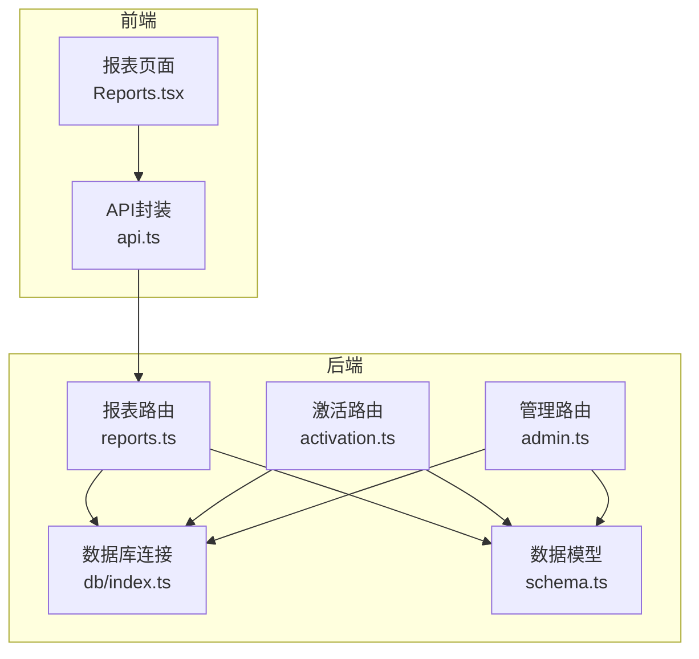
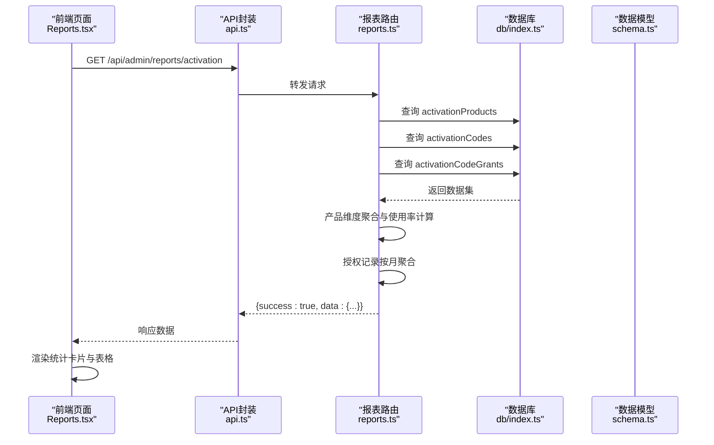
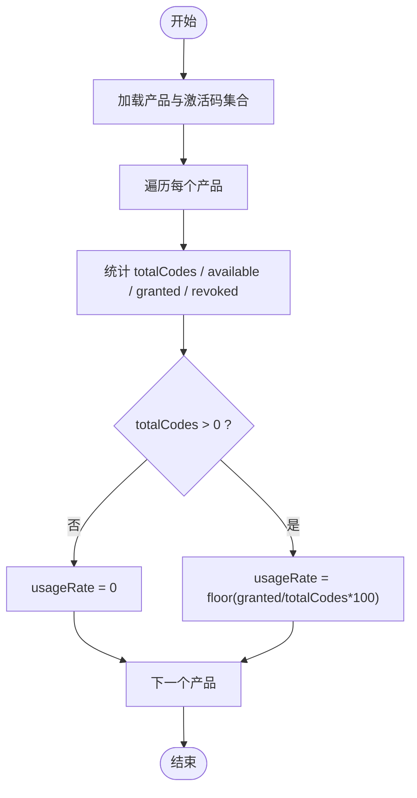
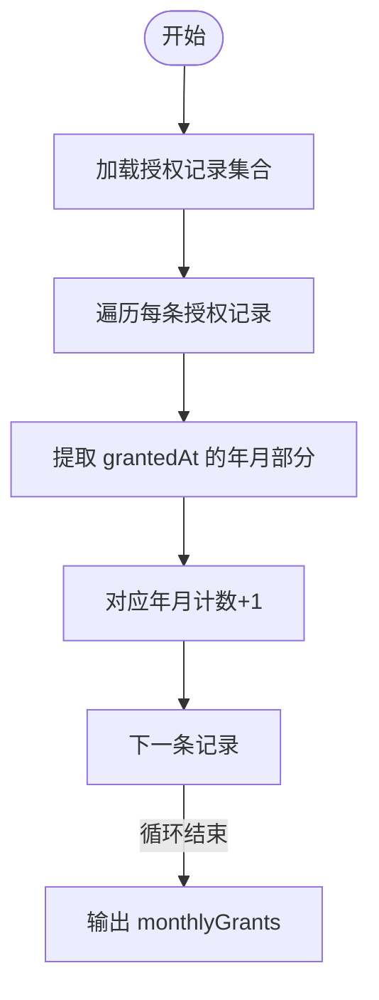
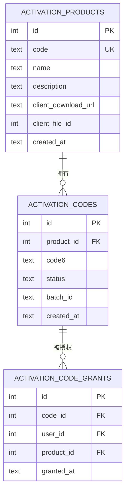
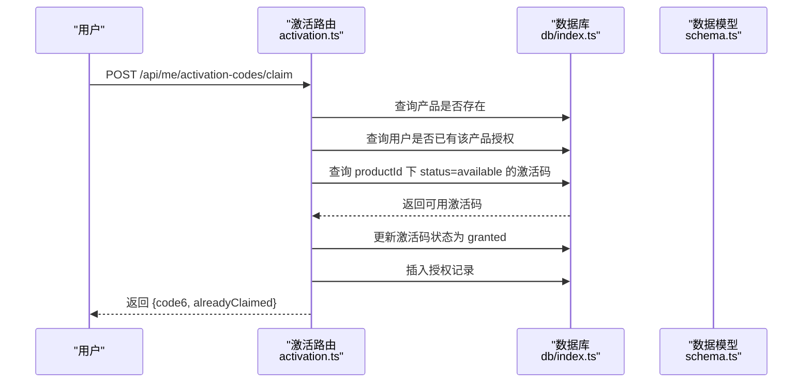
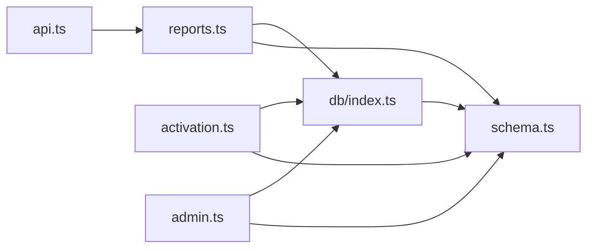

# 激活使用报表

<cite>
**本文引用的文件列表**
- [apps/server/src/routes/reports.ts](file://apps/server/src/routes/reports.ts)
- [apps/server/src/db/schema.ts](file://apps/server/src/db/schema.ts)
- [apps/web/src/pages/admin/Reports.tsx](file://apps/web/src/pages/admin/Reports.tsx)
- [apps/server/src/db/index.ts](file://apps/server/src/db/index.ts)
- [apps/web/src/lib/api.ts](file://apps/web/src/lib/api.ts)
- [apps/server/src/routes/activation.ts](file://apps/server/src/routes/activation.ts)
- [apps/server/src/routes/admin.ts](file://apps/server/src/routes/admin.ts)
</cite>

## 目录
1. [简介](#简介)
2. [项目结构](#项目结构)
3. [核心组件](#核心组件)
4. [架构总览](#架构总览)
5. [详细组件分析](#详细组件分析)
6. [依赖关系分析](#依赖关系分析)
7. [性能考量](#性能考量)
8. [故障排查指南](#故障排查指南)
9. [结论](#结论)
10. [附录](#附录)

## 简介
本文件为 ZBH2 平台“激活使用报表”接口的详细 API 文档，聚焦于激活产品使用统计与月度授权趋势统计两大核心能力。内容涵盖：
- 激活产品统计：每个产品的激活码总数、可用数量、已授权数量、已撤销数量及使用率计算方法
- 月度授权趋势统计：按自然月聚合授权记录并生成趋势数据
- 请求/响应示例：展示查询与多维度统计结果
- 计算公式与数据准确性保障：明确使用率计算公式与数据来源
- 关联关系说明：激活产品、激活码、授权记录之间的数据关联

## 项目结构
激活使用报表相关的核心文件分布如下：
- 后端路由与业务逻辑：apps/server/src/routes/reports.ts
- 数据模型与表结构：apps/server/src/db/schema.ts
- 前端报表页面与调用：apps/web/src/pages/admin/Reports.tsx
- 数据库连接与初始化：apps/server/src/db/index.ts
- 前端 API 封装：apps/web/src/lib/api.ts
- 激活码发放与授权记录：apps/server/src/routes/activation.ts
- 管理端授权审计列表：apps/server/src/routes/admin.ts

图表来源
- [apps/web/src/pages/admin/Reports.tsx:14-25](file://apps/web/src/pages/admin/Reports.tsx#L14-L25)
- [apps/web/src/lib/api.ts:1-16](file://apps/web/src/lib/api.ts#L1-L16)
- [apps/server/src/routes/reports.ts:6-74](file://apps/server/src/routes/reports.ts#L6-L74)
- [apps/server/src/db/index.ts:1-16](file://apps/server/src/db/index.ts#L1-L16)
- [apps/server/src/db/schema.ts:71-96](file://apps/server/src/db/schema.ts#L71-L96)
- [apps/server/src/routes/activation.ts:1-94](file://apps/server/src/routes/activation.ts#L1-L94)
- [apps/server/src/routes/admin.ts:199-219](file://apps/server/src/routes/admin.ts#L199-L219)

章节来源
- [apps/server/src/routes/reports.ts:6-74](file://apps/server/src/routes/reports.ts#L6-L74)
- [apps/server/src/db/schema.ts:71-96](file://apps/server/src/db/schema.ts#L71-L96)
- [apps/web/src/pages/admin/Reports.tsx:14-25](file://apps/web/src/pages/admin/Reports.tsx#L14-L25)
- [apps/web/src/lib/api.ts:1-16](file://apps/web/src/lib/api.ts#L1-L16)
- [apps/server/src/db/index.ts:1-16](file://apps/server/src/db/index.ts#L1-L16)
- [apps/server/src/routes/activation.ts:1-94](file://apps/server/src/routes/activation.ts#L1-L94)
- [apps/server/src/routes/admin.ts:199-219](file://apps/server/src/routes/admin.ts#L199-L219)

## 核心组件
- 报表路由：提供激活使用报表接口，返回产品维度统计与月度趋势
- 数据模型：定义激活产品、激活码、授权记录的表结构与字段
- 前端页面：拉取报表数据并渲染统计卡片与表格
- 数据库连接：Drizzle ORM + SQLite，启用外键约束与WAL模式
- 激活流程：用户申请激活码时产生授权记录，更新激活码状态

章节来源
- [apps/server/src/routes/reports.ts:36-74](file://apps/server/src/routes/reports.ts#L36-L74)
- [apps/server/src/db/schema.ts:71-96](file://apps/server/src/db/schema.ts#L71-L96)
- [apps/web/src/pages/admin/Reports.tsx:69-102](file://apps/web/src/pages/admin/Reports.tsx#L69-L102)
- [apps/server/src/db/index.ts:1-16](file://apps/server/src/db/index.ts#L1-L16)
- [apps/server/src/routes/activation.ts:8-75](file://apps/server/src/routes/activation.ts#L8-L75)

## 架构总览
激活使用报表的调用链路如下：
- 前端页面在挂载时并发请求多个报表接口
- 报表路由从数据库读取激活产品、激活码、授权记录
- 对产品维度进行聚合统计，并对授权记录按自然月聚合
- 返回统一的 JSON 结构，包含成功标志、数据对象与生成时间戳

图表来源
- [apps/web/src/pages/admin/Reports.tsx:14-25](file://apps/web/src/pages/admin/Reports.tsx#L14-L25)
- [apps/web/src/lib/api.ts:1-16](file://apps/web/src/lib/api.ts#L1-L16)
- [apps/server/src/routes/reports.ts:36-74](file://apps/server/src/routes/reports.ts#L36-L74)
- [apps/server/src/db/index.ts:1-16](file://apps/server/src/db/index.ts#L1-L16)
- [apps/server/src/db/schema.ts:71-96](file://apps/server/src/db/schema.ts#L71-L96)

## 详细组件分析

### 激活使用报表接口
- 接口路径：GET /api/admin/reports/activation
- 权限：需要管理员权限（预处理器校验）
- 数据来源：activationProducts、activationCodes、activationCodeGrants
- 返回结构：
  - success: 布尔值，表示请求是否成功
  - data:
    - productStats: 产品维度统计数组
    - totalGrants: 授权记录总数
    - monthlyGrants: 月度授权趋势（键为 YYYY-MM，值为数量）
    - generatedAt: 报表生成时间（ISO 字符串）

产品维度统计字段说明：
- productId: 产品ID
- productName: 产品名称
- productCode: 产品编码
- totalCodes: 该产品的激活码总数
- available: 该产品的可用激活码数量
- granted: 该产品的已授权激活码数量
- revoked: 该产品的已撤销激活码数量
- usageRate: 使用率百分比（保留整数）

月度授权趋势字段说明：
- 键：YYYY-MM（自然年月）
- 值：当月授权次数

章节来源
- [apps/server/src/routes/reports.ts:36-74](file://apps/server/src/routes/reports.ts#L36-L74)

### 使用率计算逻辑
使用率 = 已授权激活码数量 / 激活码总数 × 100%
- 当激活码总数为 0 时，使用率按 0% 返回
- 计算结果向下取整为整数百分比

图表来源
- [apps/server/src/routes/reports.ts:42-56](file://apps/server/src/routes/reports.ts#L42-L56)

章节来源
- [apps/server/src/routes/reports.ts:42-56](file://apps/server/src/routes/reports.ts#L42-L56)

### 月度授权趋势统计
- 聚合粒度：自然年月（YYYY-MM）
- 聚合来源：activationCodeGrants 表中的 grantedAt 字段（截取前 7 位）
- 输出格式：键值对，键为年月字符串，值为该月授权次数

图表来源
- [apps/server/src/routes/reports.ts:58-63](file://apps/server/src/routes/reports.ts#L58-L63)

章节来源
- [apps/server/src/routes/reports.ts:58-63](file://apps/server/src/routes/reports.ts#L58-L63)

### 前端调用与展示
- 前端在页面挂载时并发请求激活报表与其他报表
- 激活报表返回后，渲染“总发放次数”、“按产品统计”、“月度发放趋势”三块内容
- “按产品统计”表格包含产品名称、码总量、可用、已发放、已作废、使用率等列
- “月度发放趋势”表格按年月排序展示

章节来源
- [apps/web/src/pages/admin/Reports.tsx:14-25](file://apps/web/src/pages/admin/Reports.tsx#L14-L25)
- [apps/web/src/pages/admin/Reports.tsx:77-100](file://apps/web/src/pages/admin/Reports.tsx#L77-L100)

### 数据模型与关联关系
- activationProducts：激活产品表，包含产品ID、名称、编码等
- activationCodes：激活码表，包含产品ID、6位激活码、状态、批次号、创建时间
- activationCodeGrants：授权记录表，包含激活码ID、用户ID、产品ID、授权时间
- 关联关系：
  - activationCodes.productId → activationProducts.id
  - activationCodeGrants.codeId → activationCodes.id
  - activationCodeGrants.userId → users.id
  - activationCodeGrants.productId → activationProducts.id

图表来源
- [apps/server/src/db/schema.ts:71-96](file://apps/server/src/db/schema.ts#L71-L96)

章节来源
- [apps/server/src/db/schema.ts:71-96](file://apps/server/src/db/schema.ts#L71-L96)

### 激活码状态与授权流程
- 激活码状态枚举：available（可用）、granted（已授权）、revoked（已撤销）
- 用户申请激活码时：
  - 校验产品是否存在
  - 检查用户是否已有该产品的授权（幂等）
  - 查找该产品下状态为 available 的激活码
  - 更新激活码状态为 granted，并写入授权记录
- 授权记录字段：codeId、userId、productId、grantedAt

图表来源
- [apps/server/src/routes/activation.ts:8-75](file://apps/server/src/routes/activation.ts#L8-L75)
- [apps/server/src/db/schema.ts:81-96](file://apps/server/src/db/schema.ts#L81-L96)
- [apps/server/src/db/index.ts:1-16](file://apps/server/src/db/index.ts#L1-L16)

章节来源
- [apps/server/src/routes/activation.ts:8-75](file://apps/server/src/routes/activation.ts#L8-L75)
- [apps/server/src/db/schema.ts:81-96](file://apps/server/src/db/schema.ts#L81-L96)

### 管理端授权审计列表
- 接口：GET /api/admin/activation-grants
- 作用：列出所有授权记录，便于审计与核对
- 返回字段：id、codeId、userId、productId、grantedAt、code6、username、productName

章节来源
- [apps/server/src/routes/admin.ts:199-219](file://apps/server/src/routes/admin.ts#L199-L219)

## 依赖关系分析
- 报表路由依赖 Drizzle ORM 与 SQLite 数据库
- 前端通过 axios 封装的 baseURL 为 /api，自动携带凭据
- 报表接口依赖激活产品、激活码、授权记录三张表
- 激活流程与报表接口共享相同的表结构与状态枚举

图表来源
- [apps/web/src/lib/api.ts:1-16](file://apps/web/src/lib/api.ts#L1-L16)
- [apps/server/src/routes/reports.ts:6-74](file://apps/server/src/routes/reports.ts#L6-L74)
- [apps/server/src/db/index.ts:1-16](file://apps/server/src/db/index.ts#L1-L16)
- [apps/server/src/db/schema.ts:71-96](file://apps/server/src/db/schema.ts#L71-L96)
- [apps/server/src/routes/activation.ts:1-94](file://apps/server/src/routes/activation.ts#L1-L94)
- [apps/server/src/routes/admin.ts:199-219](file://apps/server/src/routes/admin.ts#L199-L219)

章节来源
- [apps/web/src/lib/api.ts:1-16](file://apps/web/src/lib/api.ts#L1-L16)
- [apps/server/src/routes/reports.ts:6-74](file://apps/server/src/routes/reports.ts#L6-L74)
- [apps/server/src/db/index.ts:1-16](file://apps/server/src/db/index.ts#L1-L16)
- [apps/server/src/db/schema.ts:71-96](file://apps/server/src/db/schema.ts#L71-L96)
- [apps/server/src/routes/activation.ts:1-94](file://apps/server/src/routes/activation.ts#L1-L94)
- [apps/server/src/routes/admin.ts:199-219](file://apps/server/src/routes/admin.ts#L199-L219)

## 性能考量
- 报表接口一次性加载三类实体，随后在内存中进行过滤与聚合，适合中小规模数据
- 若数据量增长，建议：
  - 在数据库层面进行聚合查询（例如使用 SQL 聚合函数）
  - 对 activationCodeGrants.grantedAt 建立索引以加速按月统计
  - 对 activationCodes.productId、activationCodes.status 建立复合索引以加速产品维度统计
- 前端并发请求多个报表接口，可减少等待时间；但需避免同时请求大量大体量报表

## 故障排查指南
- 401 未授权：确认已登录且具备管理员角色
- 404 产品不存在：检查 productId 是否正确
- 409 激活码不足：产品下无可用激活码，需补充或释放
- 报表数据异常：
  - 确认激活码状态是否符合预期（available/granted/revoked）
  - 检查授权记录是否正确写入 activationCodeGrants
  - 对比管理端授权审计列表与报表结果
- 数据一致性：
  - 激活码状态变更与授权记录写入需在同一事务中完成（当前实现为两条独立操作，建议在数据库层通过触发器或应用层事务保障一致性）

章节来源
- [apps/server/src/routes/activation.ts:10-57](file://apps/server/src/routes/activation.ts#L10-L57)
- [apps/server/src/routes/admin.ts:199-219](file://apps/server/src/routes/admin.ts#L199-L219)

## 结论
激活使用报表接口提供了清晰的产品维度统计与月度授权趋势，结合前端直观的可视化展示，能够帮助管理员快速掌握激活码的使用情况与变化趋势。建议在生产环境中进一步完善数据库索引与事务一致性保障，以提升报表性能与数据可靠性。

## 附录

### 请求/响应示例
- 请求
  - 方法：GET
  - 地址：/api/admin/reports/activation
  - 认证：需要管理员登录态
- 响应
  - 成功标志：true
  - 数据对象：
    - productStats: 产品统计数组（每项包含 productId、productName、productCode、totalCodes、available、granted、revoked、usageRate）
    - totalGrants: 授权记录总数
    - monthlyGrants: 月度授权趋势（YYYY-MM -> 数量）
    - generatedAt: 报表生成时间（ISO 字符串）

章节来源
- [apps/server/src/routes/reports.ts:36-74](file://apps/server/src/routes/reports.ts#L36-L74)