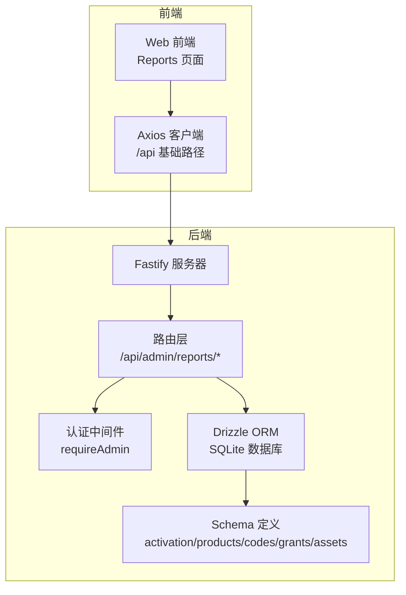
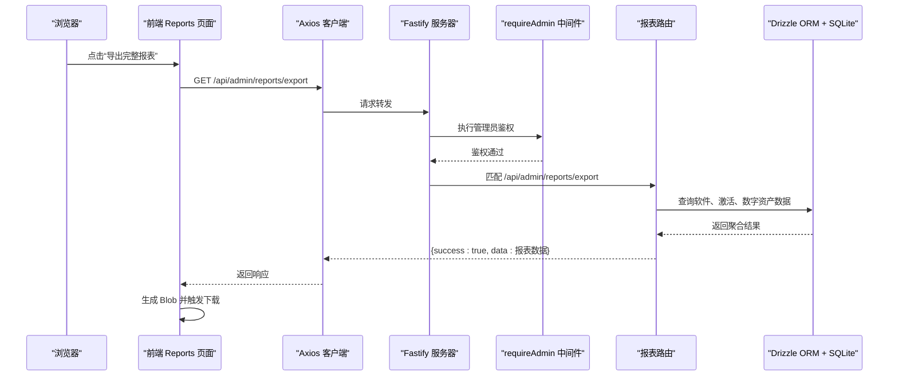
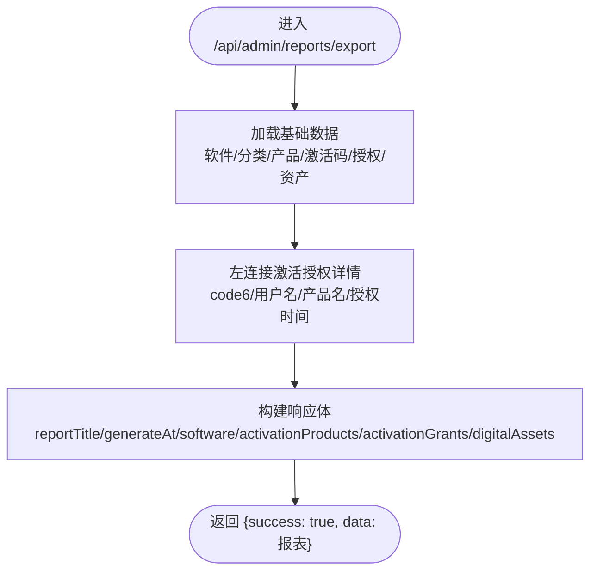
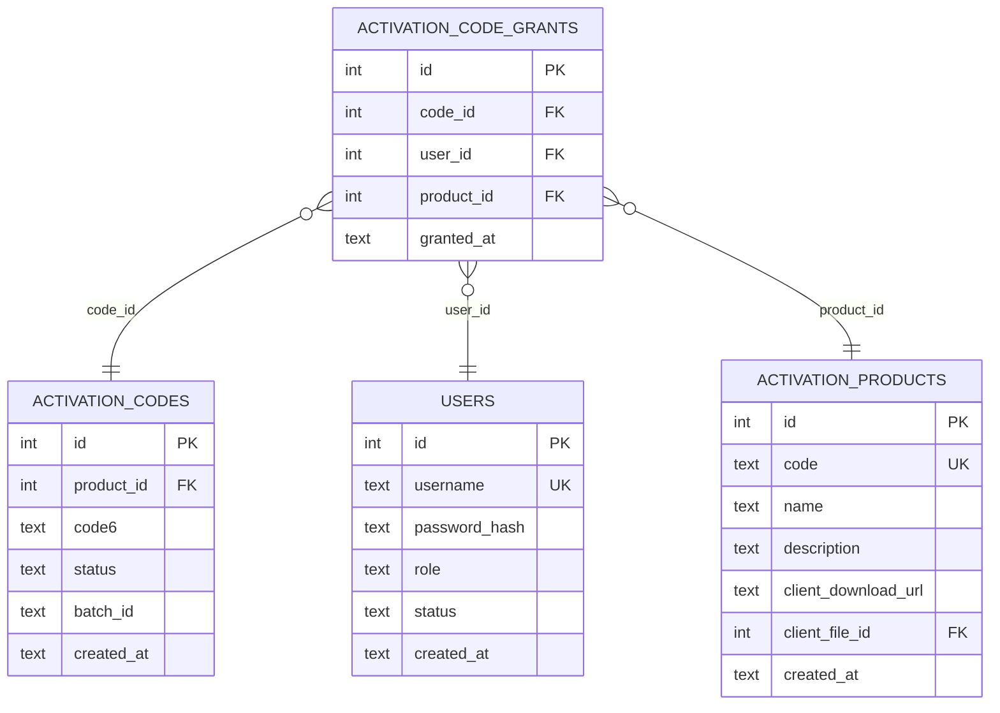
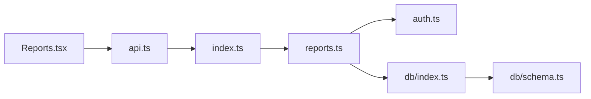

# 综合导出报表

<cite>
**本文引用的文件**
- [apps/server/src/routes/reports.ts](file://apps/server/src/routes/reports.ts)
- [apps/server/src/db/schema.ts](file://apps/server/src/db/schema.ts)
- [apps/server/src/db/index.ts](file://apps/server/src/db/index.ts)
- [apps/server/src/middleware/auth.ts](file://apps/server/src/middleware/auth.ts)
- [apps/server/src/index.ts](file://apps/server/src/index.ts)
- [apps/web/src/pages/admin/Reports.tsx](file://apps/web/src/pages/admin/Reports.tsx)
- [apps/web/src/lib/api.ts](file://apps/web/src/lib/api.ts)
- [apps/server/drizzle/0000_absurd_liz_osborn.sql](file://apps/server/drizzle/0000_absurd_liz_osborn.sql)
- [apps/server/drizzle/0001_zippy_shadowcat.sql](file://apps/server/drizzle/0001_zippy_shadowcat.sql)
- [apps/server/drizzle/0002_special_medusa.sql](file://apps/server/drizzle/0002_special_medusa.sql)
</cite>

## 目录
1. [简介](#简介)
2. [项目结构](#项目结构)
3. [核心组件](#核心组件)
4. [架构概览](#架构概览)
5. [详细组件分析](#详细组件分析)
6. [依赖关系分析](#依赖关系分析)
7. [性能考虑](#性能考虑)
8. [故障排查指南](#故障排查指南)
9. [结论](#结论)
10. [附录](#附录)

## 简介
本文件为 ZBH2 平台“综合导出报表”接口的详细 API 文档，聚焦于以下目标：
- 整合查询与导出软件数据、激活产品、激活授权、数字资产四大模块的数据
- 描述多表关联查询逻辑（特别是通过左连接获取激活授权详情）
- 明确导出数据结构：报表标题、生成时间、各模块数据集合
- 提供完整的请求/响应示例，展示综合报表的查询与导出流程
- 说明数据导出的性能优化与大数据量处理策略
- 阐述报表数据的完整性与一致性保障机制

## 项目结构
后端采用 Fastify + Drizzle ORM + better-sqlite3 的轻量架构；前端基于 Ant Design 的报表页面负责触发导出并下载 JSON 文件。综合导出报表位于后端路由层，数据库层通过 schema 定义了激活授权、软件、数字资产等核心表及其外键关系。

图表来源
- [apps/server/src/index.ts:29-49](file://apps/server/src/index.ts#L29-L49)
- [apps/server/src/routes/reports.ts:6-7](file://apps/server/src/routes/reports.ts#L6-L7)
- [apps/server/src/middleware/auth.ts:48-55](file://apps/server/src/middleware/auth.ts#L48-L55)
- [apps/server/src/db/index.ts:1-16](file://apps/server/src/db/index.ts#L1-L16)
- [apps/server/src/db/schema.ts:1-330](file://apps/server/src/db/schema.ts#L1-L330)

章节来源
- [apps/server/src/index.ts:29-49](file://apps/server/src/index.ts#L29-L49)
- [apps/web/src/pages/admin/Reports.tsx:1-138](file://apps/web/src/pages/admin/Reports.tsx#L1-L138)

## 核心组件
- 路由层：提供三个独立报表接口与一个综合导出接口
  - 软件资产报表：/api/admin/reports/software-assets
  - 激活使用报表：/api/admin/reports/activation
  - 数字资产报表：/api/admin/reports/digital-assets
  - 综合导出报表：/api/admin/reports/export
- 中间件：requireAdmin 对综合导出接口进行管理员鉴权
- 数据层：Drizzle ORM + SQLite，通过 schema 定义表结构与外键约束
- 前端：Reports 页面提供导出按钮，调用 /api/admin/reports/export 并下载 JSON 文件

章节来源
- [apps/server/src/routes/reports.ts:6-74](file://apps/server/src/routes/reports.ts#L6-L74)
- [apps/server/src/middleware/auth.ts:48-55](file://apps/server/src/middleware/auth.ts#L48-L55)
- [apps/web/src/pages/admin/Reports.tsx:27-37](file://apps/web/src/pages/admin/Reports.tsx#L27-L37)

## 架构概览
综合导出报表接口在路由层完成多模块数据聚合，通过一次请求返回完整的报表数据结构，便于前端直接下载为 JSON 文件。

图表来源
- [apps/web/src/pages/admin/Reports.tsx:27-37](file://apps/web/src/pages/admin/Reports.tsx#L27-L37)
- [apps/web/src/lib/api.ts:1-16](file://apps/web/src/lib/api.ts#L1-L16)
- [apps/server/src/routes/reports.ts:114-144](file://apps/server/src/routes/reports.ts#L114-L144)
- [apps/server/src/middleware/auth.ts:48-55](file://apps/server/src/middleware/auth.ts#L48-L55)

## 详细组件分析

### 综合导出报表接口
- 接口路径：/api/admin/reports/export
- 方法：GET
- 认证：requireAdmin（仅管理员可访问）
- 功能：一次性拉取软件、激活、数字资产三类数据，并对激活授权做多表左连接，补充激活码6位码、用户名、产品名称、授权时间等字段
- 响应结构要点：
  - reportTitle：报表标题
  - generatedAt：报表生成时间
  - software：软件项列表（附加分类名称）
  - activationProducts：激活产品列表
  - activationGrants：激活授权列表（含 code6、username、productName、grantedAt）
  - digitalAssets：数字资产列表

图表来源
- [apps/server/src/routes/reports.ts:114-144](file://apps/server/src/routes/reports.ts#L114-L144)

章节来源
- [apps/server/src/routes/reports.ts:114-144](file://apps/server/src/routes/reports.ts#L114-L144)

### 多表关联查询逻辑（激活授权详情）
激活授权详情通过左连接从多个表获取完整信息：
- activationCodeGrants：授权记录主表
- activationCodes：激活码表（提供 code6 字段）
- users：用户表（提供 username 字段）
- activationProducts：产品表（提供产品名称）

图表来源
- [apps/server/src/db/schema.ts:71-96](file://apps/server/src/db/schema.ts#L71-L96)
- [apps/server/drizzle/0000_absurd_liz_osborn.sql:1-31](file://apps/server/drizzle/0000_absurd_liz_osborn.sql#L1-L31)

章节来源
- [apps/server/src/routes/reports.ts:120-130](file://apps/server/src/routes/reports.ts#L120-L130)
- [apps/server/src/db/schema.ts:71-96](file://apps/server/src/db/schema.ts#L71-L96)

### 导出数据结构定义
- 报表标题：字符串类型，用于标识报表用途
- 生成时间：ISO 时间戳字符串
- 软件数据集合：包含软件项及附加的分类名称
- 激活产品集合：激活产品的元数据
- 激活授权集合：包含 code6、username、productName、grantedAt 等字段
- 数字资产集合：资产的完整属性

章节来源
- [apps/server/src/routes/reports.ts:133-143](file://apps/server/src/routes/reports.ts#L133-L143)

### 请求/响应示例
- 请求
  - 方法：GET
  - 地址：/api/admin/reports/export
  - 认证：需要管理员会话
- 响应
  - 结构：{ success: boolean, data: 报表对象 }
  - 报表对象包含：reportTitle、generatedAt、software、activationProducts、activationGrants、digitalAssets

章节来源
- [apps/server/src/routes/reports.ts:114-144](file://apps/server/src/routes/reports.ts#L114-L144)
- [apps/web/src/pages/admin/Reports.tsx:27-37](file://apps/web/src/pages/admin/Reports.tsx#L27-L37)

### 前端导出流程
- 用户点击“导出完整报表”
- 前端调用 /api/admin/reports/export 获取 JSON 数据
- 将响应数据序列化为 JSON 字符串，创建 Blob 并触发浏览器下载
- 下载文件命名为“正版化资产报表_YYYY-MM-DD.json”

章节来源
- [apps/web/src/pages/admin/Reports.tsx:27-37](file://apps/web/src/pages/admin/Reports.tsx#L27-L37)
- [apps/web/src/lib/api.ts:1-16](file://apps/web/src/lib/api.ts#L1-L16)

## 依赖关系分析
- 路由依赖中间件：/api/admin/reports/export 使用 requireAdmin 进行管理员鉴权
- 路由依赖数据库：通过 Drizzle ORM 查询 schema 中的表
- 数据库依赖 SQLite：better-sqlite3 提供 WAL 模式与外键约束
- 前端依赖 Axios：统一的 /api 基础路径，携带 Cookie 实现会话保持

图表来源
- [apps/web/src/pages/admin/Reports.tsx:1-138](file://apps/web/src/pages/admin/Reports.tsx#L1-L138)
- [apps/web/src/lib/api.ts:1-16](file://apps/web/src/lib/api.ts#L1-L16)
- [apps/server/src/index.ts:29-49](file://apps/server/src/index.ts#L29-L49)
- [apps/server/src/routes/reports.ts:6-7](file://apps/server/src/routes/reports.ts#L6-L7)
- [apps/server/src/middleware/auth.ts:48-55](file://apps/server/src/middleware/auth.ts#L48-L55)
- [apps/server/src/db/index.ts:1-16](file://apps/server/src/db/index.ts#L1-L16)
- [apps/server/src/db/schema.ts:1-330](file://apps/server/src/db/schema.ts#L1-L330)

章节来源
- [apps/server/src/index.ts:29-49](file://apps/server/src/index.ts#L29-L49)
- [apps/server/src/routes/reports.ts:6-7](file://apps/server/src/routes/reports.ts#L6-L7)
- [apps/server/src/middleware/auth.ts:48-55](file://apps/server/src/middleware/auth.ts#L48-L55)
- [apps/server/src/db/index.ts:1-16](file://apps/server/src/db/index.ts#L1-L16)
- [apps/server/src/db/schema.ts:1-330](file://apps/server/src/db/schema.ts#L1-L330)

## 性能考虑
- 当前实现特点
  - 综合导出接口一次性读取多表数据，返回完整 JSON，便于前端直接下载
  - 激活授权详情通过左连接一次性获取 code6、用户名、产品名、授权时间
- 可能的性能瓶颈
  - 大数据量下，一次性返回所有数据可能导致内存压力与网络传输开销增大
  - 激活授权列表若规模较大，排序与连接可能成为热点
- 优化建议（概念性指导）
  - 分页与流式输出：将综合导出改为分页或流式输出，避免一次性加载全部数据
  - 增加索引：为 activationCodeGrants.grantedAt、activationCodes.code6、users.username 等常用过滤/连接字段建立索引
  - 缓存策略：对静态或低频变更的数据（如软件分类、激活产品）进行缓存
  - 前端分块下载：将大 JSON 拆分为多个小文件，前端再合并
  - 异步导出：后台异步生成 CSV/Excel 文件，前端轮询下载链接
- 一致性保障
  - 使用事务确保导出时点的一致性（当前实现为多次 select，非事务包裹）
  - 若需强一致，可在导出前锁定关键表或使用快照隔离级别（SQLite WAL 模式下可结合 PRAGMA 控制）

[本节为通用性能建议，不直接分析具体文件，故无章节来源]

## 故障排查指南
- 401 未登录
  - 现象：返回 { success: false, error: '请先登录' }
  - 排查：确认前端已携带 Cookie，且会话未过期
- 403 权限不足
  - 现象：返回 { success: false, error: '权限不足' }
  - 排查：确认当前用户角色为 admin
- 导出数据为空或不完整
  - 现象：activationGrants 或 software 等集合为空
  - 排查：检查对应表是否存在数据；确认左连接条件是否正确
- 响应过大导致下载失败
  - 现象：浏览器卡顿或下载失败
  - 排查：前端改为分页/流式导出或后端改为 CSV/Excel 异步导出

章节来源
- [apps/server/src/middleware/auth.ts:48-55](file://apps/server/src/middleware/auth.ts#L48-L55)
- [apps/server/src/routes/reports.ts:114-144](file://apps/server/src/routes/reports.ts#L114-L144)
- [apps/web/src/pages/admin/Reports.tsx:27-37](file://apps/web/src/pages/admin/Reports.tsx#L27-L37)

## 结论
综合导出报表接口通过一次请求整合软件、激活、数字资产三大模块数据，并对激活授权详情进行多表左连接，形成完整的报表结构。当前实现简洁高效，适合中小规模数据场景；对于大规模数据，建议引入分页/流式输出、索引优化与异步导出等策略，以提升性能与用户体验。

[本节为总结性内容，不直接分析具体文件，故无章节来源]

## 附录

### 表结构与外键关系（关键表）
- users：用户表，包含 id、username、role、status 等
- activationProducts：激活产品表，包含 id、code、name、description 等
- activationCodes：激活码表，包含 id、product_id、code6、status、batch_id 等
- activationCodeGrants：激活授权表，包含 id、code_id、user_id、product_id、grantedAt
- assets：数字资产表，包含 id、assetCode、name、categoryId、status、assigneeId、purchasePrice 等

章节来源
- [apps/server/src/db/schema.ts:3-330](file://apps/server/src/db/schema.ts#L3-L330)
- [apps/server/drizzle/0000_absurd_liz_osborn.sql:1-31](file://apps/server/drizzle/0000_absurd_liz_osborn.sql#L1-L31)
- [apps/server/drizzle/0001_zippy_shadowcat.sql:37-56](file://apps/server/drizzle/0001_zippy_shadowcat.sql#L37-L56)
- [apps/server/drizzle/0002_special_medusa.sql:1-125](file://apps/server/drizzle/0002_special_medusa.sql#L1-L125)