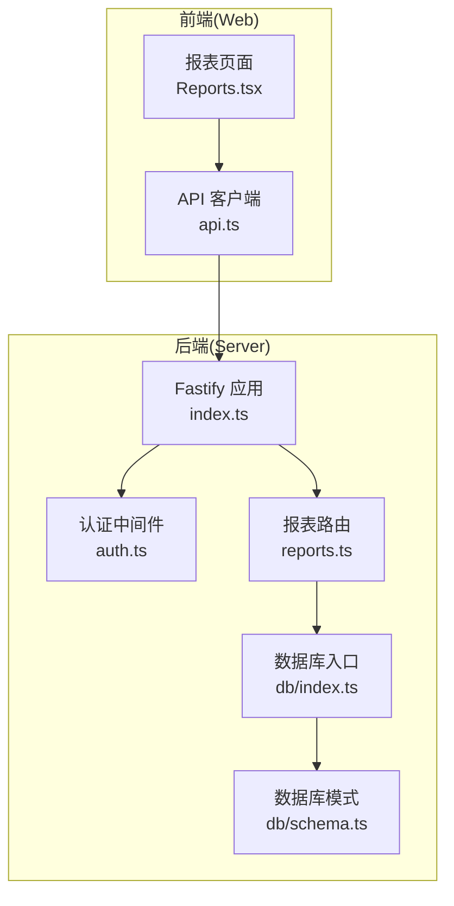
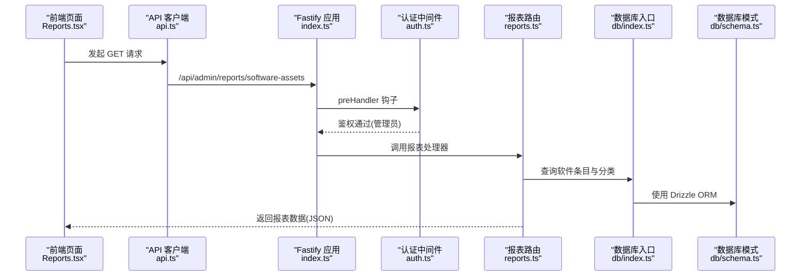
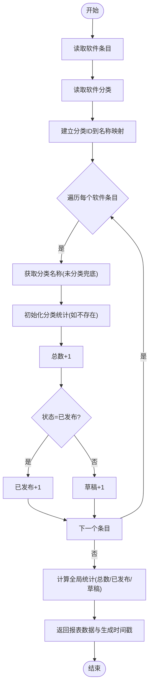
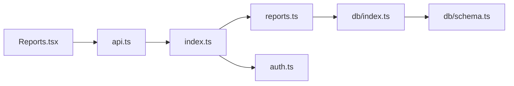

# 软件资产报表

<cite>
**本文引用的文件列表**
- [apps/server/src/routes/reports.ts](file://apps/server/src/routes/reports.ts)
- [apps/server/src/db/schema.ts](file://apps/server/src/db/schema.ts)
- [apps/server/src/db/index.ts](file://apps/server/src/db/index.ts)
- [apps/server/src/middleware/auth.ts](file://apps/server/src/middleware/auth.ts)
- [apps/server/src/index.ts](file://apps/server/src/index.ts)
- [apps/web/src/pages/admin/Reports.tsx](file://apps/web/src/pages/admin/Reports.tsx)
- [apps/web/src/lib/api.ts](file://apps/web/src/lib/api.ts)
- [packages/shared/src/types.ts](file://packages/shared/src/types.ts)
</cite>

## 目录
1. [简介](#简介)
2. [项目结构](#项目结构)
3. [核心组件](#核心组件)
4. [架构概览](#架构概览)
5. [详细组件分析](#详细组件分析)
6. [依赖关系分析](#依赖关系分析)
7. [性能考量](#性能考量)
8. [故障排查指南](#故障排查指南)
9. [结论](#结论)
10. [附录](#附录)

## 简介
本文件为 ZBH2 平台“软件资产报表”接口的详细 API 文档，聚焦于软件资产统计接口的功能与实现细节。该接口用于统计软件总数、发布状态（已发布/草稿）分布以及按分类汇总的详细信息，并返回数据生成时间戳与报表时效性说明。文档还涵盖查询逻辑、数据聚合方式、返回数据结构、请求/响应示例、错误处理与异常情况说明，帮助开发者与运维人员快速理解与集成。

## 项目结构
软件资产报表位于后端服务的应用层路由中，数据库访问通过 Drizzle ORM 进行，认证中间件确保仅管理员可访问。前端页面通过统一的 API 客户端发起请求并渲染报表。

图表来源
- [apps/server/src/index.ts:1-60](file://apps/server/src/index.ts#L1-L60)
- [apps/server/src/middleware/auth.ts:1-56](file://apps/server/src/middleware/auth.ts#L1-L56)
- [apps/server/src/routes/reports.ts:1-146](file://apps/server/src/routes/reports.ts#L1-L146)
- [apps/server/src/db/index.ts:1-16](file://apps/server/src/db/index.ts#L1-L16)
- [apps/server/src/db/schema.ts:1-330](file://apps/server/src/db/schema.ts#L1-L330)
- [apps/web/src/pages/admin/Reports.tsx:1-137](file://apps/web/src/pages/admin/Reports.tsx#L1-L137)
- [apps/web/src/lib/api.ts:1-16](file://apps/web/src/lib/api.ts#L1-L16)

章节来源
- [apps/server/src/index.ts:1-60](file://apps/server/src/index.ts#L1-L60)
- [apps/server/src/routes/reports.ts:1-146](file://apps/server/src/routes/reports.ts#L1-L146)
- [apps/server/src/db/schema.ts:1-330](file://apps/server/src/db/schema.ts#L1-L330)

## 核心组件
- 报表路由模块：提供软件资产报表接口，负责从软件条目表与软件分类表读取数据并进行聚合统计。
- 数据库层：通过 Drizzle ORM 访问 SQLite 数据库，定义了软件条目与软件分类等核心表结构。
- 认证中间件：要求管理员权限，确保报表接口的安全访问。
- 前端页面：调用报表接口并展示统计结果，支持导出完整报表。

章节来源
- [apps/server/src/routes/reports.ts:1-146](file://apps/server/src/routes/reports.ts#L1-L146)
- [apps/server/src/db/schema.ts:1-330](file://apps/server/src/db/schema.ts#L1-L330)
- [apps/server/src/middleware/auth.ts:1-56](file://apps/server/src/middleware/auth.ts#L1-L56)
- [apps/web/src/pages/admin/Reports.tsx:1-137](file://apps/web/src/pages/admin/Reports.tsx#L1-L137)

## 架构概览
软件资产报表接口的调用链路如下：
- 前端通过 API 客户端向后端发起 GET 请求至 /api/admin/reports/software-assets。
- Fastify 应用加载会话并应用 requireAdmin 中间件进行鉴权。
- 报表路由从数据库读取软件条目与软件分类数据，构建按分类的统计结果。
- 返回统一的响应结构，包含总软件数、已发布数、草稿数、按分类统计详情与生成时间戳。

图表来源
- [apps/web/src/pages/admin/Reports.tsx:14-25](file://apps/web/src/pages/admin/Reports.tsx#L14-L25)
- [apps/web/src/lib/api.ts:1-16](file://apps/web/src/lib/api.ts#L1-L16)
- [apps/server/src/index.ts:29-49](file://apps/server/src/index.ts#L29-L49)
- [apps/server/src/middleware/auth.ts:48-55](file://apps/server/src/middleware/auth.ts#L48-L55)
- [apps/server/src/routes/reports.ts:9-34](file://apps/server/src/routes/reports.ts#L9-L34)
- [apps/server/src/db/index.ts:14-15](file://apps/server/src/db/index.ts#L14-L15)
- [apps/server/src/db/schema.ts:37-49](file://apps/server/src/db/schema.ts#L37-L49)

## 详细组件分析

### 接口定义与访问控制
- 接口路径：GET /api/admin/reports/software-assets
- 认证要求：管理员权限；非管理员或未登录将返回 401/403。
- 响应格式：统一的 ApiResponse 结构，包含 success、data、error 字段。

章节来源
- [apps/server/src/routes/reports.ts:9-34](file://apps/server/src/routes/reports.ts#L9-L34)
- [apps/server/src/middleware/auth.ts:48-55](file://apps/server/src/middleware/auth.ts#L48-L55)
- [packages/shared/src/types.ts:6-10](file://packages/shared/src/types.ts#L6-L10)

### 查询逻辑与数据聚合
- 数据来源：
  - 软件条目表：包含软件标题、描述、分类 ID、版本、文件 ID、图标文件 ID、排序、状态、创建/更新时间等字段。
  - 软件分类表：包含分类名称与排序等字段。
- 聚合步骤：
  1) 读取所有软件条目与软件分类，建立分类 ID 到分类名称的映射。
  2) 遍历每个软件条目，按分类名称进行统计：
     - 总数 +1
     - 若状态为已发布则“已发布”+1，否则“草稿”+1
  3) 计算全局统计：
     - 总软件数：软件条目总数
     - 已发布数量：状态为已发布的条目数
     - 草稿数量：状态为草稿的条目数
  4) 返回生成时间戳（ISO 8601）。

图表来源
- [apps/server/src/routes/reports.ts:10-34](file://apps/server/src/routes/reports.ts#L10-L34)
- [apps/server/src/db/schema.ts:37-49](file://apps/server/src/db/schema.ts#L37-L49)
- [apps/server/src/db/schema.ts:19-24](file://apps/server/src/db/schema.ts#L19-L24)

章节来源
- [apps/server/src/routes/reports.ts:10-34](file://apps/server/src/routes/reports.ts#L10-L34)
- [apps/server/src/db/schema.ts:37-49](file://apps/server/src/db/schema.ts#L37-L49)
- [apps/server/src/db/schema.ts:19-24](file://apps/server/src/db/schema.ts#L19-L24)

### 返回数据结构
- 成功响应字段：
  - success: boolean，始终为 true
  - data: 对象，包含以下字段：
    - totalSoftware: number，软件总数
    - publishedCount: number，已发布数量
    - draftCount: number，草稿数量
    - byCategory: Record<string, { total: number; published: number; draft: number }>
      - 键：分类名称（未分类兜底）
      - 值：包含 total/published/draft 的统计对象
    - generatedAt: string，ISO 8601 时间戳，表示报表生成时间
- 失败响应字段：
  - success: boolean，false
  - error: string，错误信息（例如未登录、权限不足）

章节来源
- [apps/server/src/routes/reports.ts:24-33](file://apps/server/src/routes/reports.ts#L24-L33)
- [packages/shared/src/types.ts:6-10](file://packages/shared/src/types.ts#L6-L10)

### 请求与响应示例
- 请求
  - 方法：GET
  - 地址：/api/admin/reports/software-assets
  - 认证：Cookie 中携带会话标识，且用户角色为管理员
- 成功响应示例（简化）
  - 状态码：200
  - 响应体：
    - success: true
    - data:
      - totalSoftware: 120
      - publishedCount: 95
      - draftCount: 25
      - byCategory:
        - 办公软件: { total: 40, published: 35, draft: 5 }
        - 开发工具: { total: 35, published: 30, draft: 5 }
        - 安全软件: { total: 25, published: 20, draft: 5 }
        - 未分类: { total: 20, published: 10, draft: 10 }
      - generatedAt: "2025-04-05T09:15:00.000Z"
- 失败响应示例（未登录）
  - 状态码：401
  - 响应体：
    - success: false
    - error: "请先登录"

章节来源
- [apps/server/src/routes/reports.ts:9-34](file://apps/server/src/routes/reports.ts#L9-L34)
- [apps/server/src/middleware/auth.ts:48-55](file://apps/server/src/middleware/auth.ts#L48-L55)

### 报表时效性与生成时间戳
- generatedAt 字段提供 ISO 8601 格式的时间戳，表示本次报表生成的具体时刻。
- 由于接口在请求时实时聚合数据，报表时效性取决于请求发起时间与数据库当前状态。
- 若需离线分析或历史对比，建议在前端缓存或记录 generatedAt 以标注数据新鲜度。

章节来源
- [apps/server/src/routes/reports.ts:31](file://apps/server/src/routes/reports.ts#L31)

### 错误处理与异常情况
- 未登录：返回 401，提示“请先登录”
- 权限不足：返回 403，提示“权限不足”
- 其他异常：由 Fastify 默认错误处理机制返回，通常为 5xx 或业务异常

章节来源
- [apps/server/src/middleware/auth.ts:48-55](file://apps/server/src/middleware/auth.ts#L48-L55)

## 依赖关系分析
- 后端依赖链：
  - index.ts 注册路由与中间件，加载会话并注册报表路由。
  - reports.ts 依赖 db/index.ts 与 db/schema.ts，使用 Drizzle ORM 查询数据。
  - auth.ts 提供 requireAdmin 中间件，确保管理员访问。
- 前端依赖链：
  - Reports.tsx 通过 api.ts 统一发起请求，渲染报表并支持导出。

图表来源
- [apps/server/src/index.ts:29-49](file://apps/server/src/index.ts#L29-L49)
- [apps/server/src/routes/reports.ts:1-4](file://apps/server/src/routes/reports.ts#L1-L4)
- [apps/server/src/db/index.ts:14-15](file://apps/server/src/db/index.ts#L14-L15)
- [apps/server/src/db/schema.ts:37-49](file://apps/server/src/db/schema.ts#L37-L49)
- [apps/server/src/middleware/auth.ts:48-55](file://apps/server/src/middleware/auth.ts#L48-L55)
- [apps/web/src/pages/admin/Reports.tsx:14-25](file://apps/web/src/pages/admin/Reports.tsx#L14-L25)
- [apps/web/src/lib/api.ts:1-16](file://apps/web/src/lib/api.ts#L1-L16)

章节来源
- [apps/server/src/index.ts:29-49](file://apps/server/src/index.ts#L29-L49)
- [apps/server/src/routes/reports.ts:1-4](file://apps/server/src/routes/reports.ts#L1-L4)
- [apps/server/src/db/index.ts:14-15](file://apps/server/src/db/index.ts#L14-L15)
- [apps/server/src/db/schema.ts:37-49](file://apps/server/src/db/schema.ts#L37-L49)
- [apps/server/src/middleware/auth.ts:48-55](file://apps/server/src/middleware/auth.ts#L48-L55)
- [apps/web/src/pages/admin/Reports.tsx:14-25](file://apps/web/src/pages/admin/Reports.tsx#L14-L25)
- [apps/web/src/lib/api.ts:1-16](file://apps/web/src/lib/api.ts#L1-L16)

## 性能考量
- 当前实现为一次性读取软件条目与分类表，再在内存中进行聚合，适合中小规模数据集。
- 若数据量较大，建议：
  - 在数据库层面进行聚合查询，减少内存遍历与映射开销。
  - 引入分页或缓存策略，避免频繁全量扫描。
  - 对分类名称映射采用更高效的数据结构（如 Map）。
- 生成时间戳与响应体大小较小，对性能影响有限。

[本节为通用性能建议，不直接分析具体文件]

## 故障排查指南
- 401 未登录
  - 检查 Cookie 是否正确传递，确认会话是否有效。
  - 参考：[apps/server/src/middleware/auth.ts:42-46](file://apps/server/src/middleware/auth.ts#L42-L46)
- 403 权限不足
  - 确认当前用户角色为管理员。
  - 参考：[apps/server/src/middleware/auth.ts:52-54](file://apps/server/src/middleware/auth.ts#L52-L54)
- 数据为空或统计异常
  - 检查软件条目与分类表是否存在数据。
  - 确认软件状态枚举值与分类 ID 关联是否正确。
  - 参考：[apps/server/src/db/schema.ts:37-49](file://apps/server/src/db/schema.ts#L37-L49)，[apps/server/src/db/schema.ts:19-24](file://apps/server/src/db/schema.ts#L19-L24)
- 前端无法显示报表
  - 确认前端 API 客户端 baseURL 与后端一致。
  - 参考：[apps/web/src/lib/api.ts:3](file://apps/web/src/lib/api.ts#L3)

章节来源
- [apps/server/src/middleware/auth.ts:42-54](file://apps/server/src/middleware/auth.ts#L42-L54)
- [apps/server/src/db/schema.ts:37-49](file://apps/server/src/db/schema.ts#L37-L49)
- [apps/server/src/db/schema.ts:19-24](file://apps/server/src/db/schema.ts#L19-L24)
- [apps/web/src/lib/api.ts:3](file://apps/web/src/lib/api.ts#L3)

## 结论
软件资产报表接口通过简洁的查询与聚合逻辑，提供了软件总数、发布状态分布与按分类统计的完整视图，并附带生成时间戳以明确报表时效性。结合管理员权限控制与统一响应结构，该接口易于集成与扩展。对于大规模数据场景，建议优化为数据库侧聚合与引入缓存策略，以提升性能与稳定性。

[本节为总结性内容，不直接分析具体文件]

## 附录

### API 规范摘要
- 路径：/api/admin/reports/software-assets
- 方法：GET
- 认证：管理员会话
- 成功响应字段：见“返回数据结构”
- 失败响应字段：见“错误处理与异常情况”

章节来源
- [apps/server/src/routes/reports.ts:9-34](file://apps/server/src/routes/reports.ts#L9-L34)
- [apps/server/src/middleware/auth.ts:48-55](file://apps/server/src/middleware/auth.ts#L48-L55)
- [packages/shared/src/types.ts:6-10](file://packages/shared/src/types.ts#L6-L10)