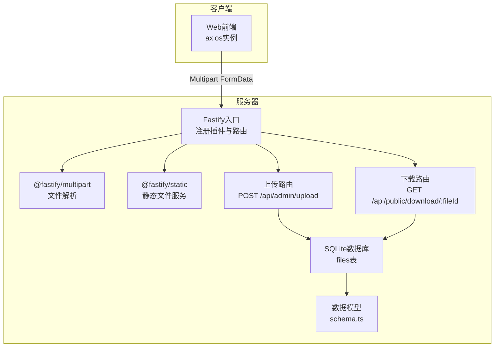
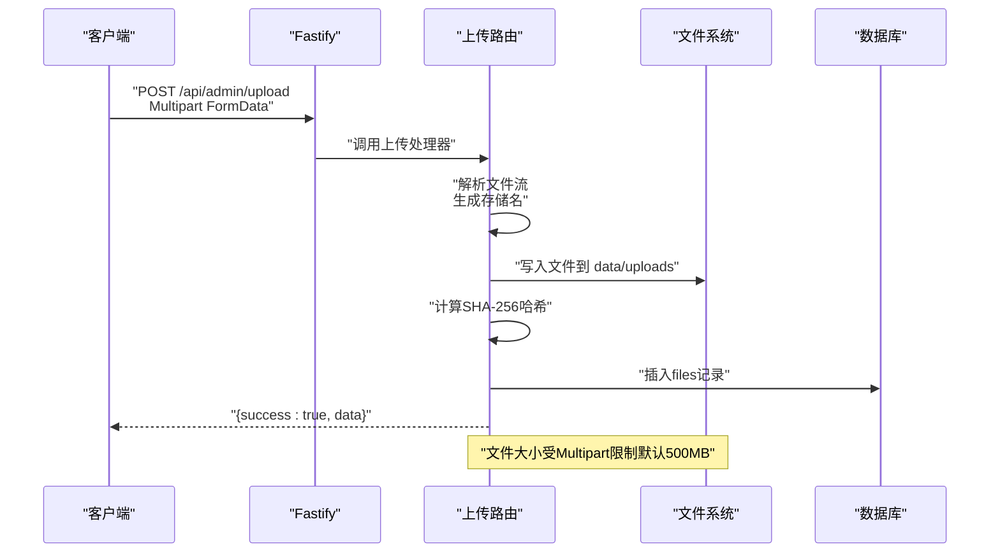
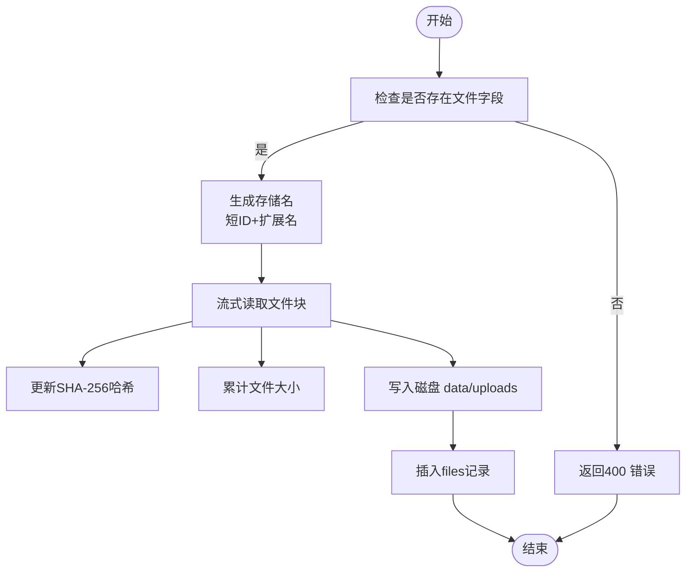
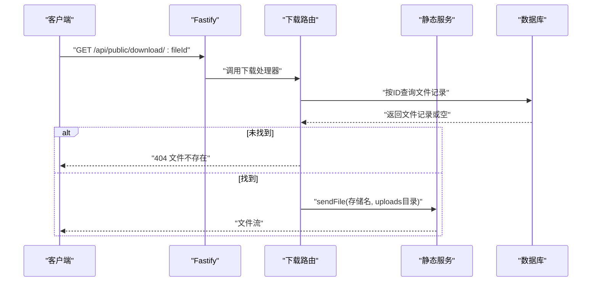
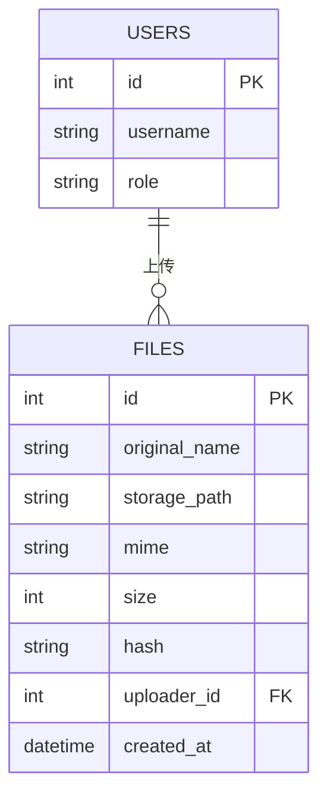
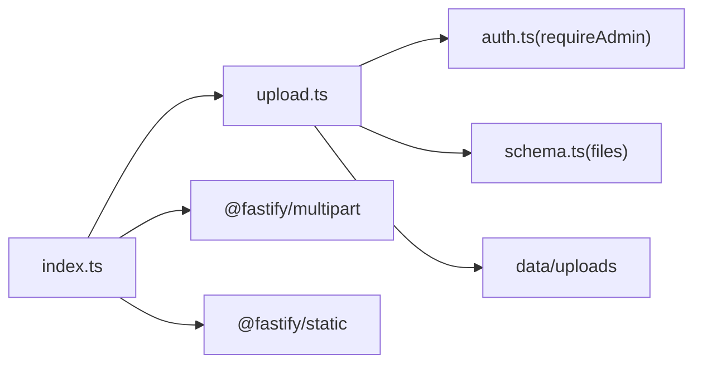

# 文件上传API

<cite>
**本文引用的文件**
- [apps/server/src/routes/upload.ts](file://apps/server/src/routes/upload.ts)
- [apps/server/src/middleware/auth.ts](file://apps/server/src/middleware/auth.ts)
- [apps/server/src/db/schema.ts](file://apps/server/src/db/schema.ts)
- [apps/server/src/index.ts](file://apps/server/src/index.ts)
- [apps/server/drizzle/0000_absurd_liz_osborn.sql](file://apps/server/drizzle/0000_absurd_liz_osborn.sql)
- [apps/server/src/routes/admin.ts](file://apps/server/src/routes/admin.ts)
- [apps/server/src/middleware/audit.ts](file://apps/server/src/middleware/audit.ts)
- [apps/web/src/lib/api.ts](file://apps/web/src/lib/api.ts)
</cite>

## 目录
1. [简介](#简介)
2. [项目结构](#项目结构)
3. [核心组件](#核心组件)
4. [架构总览](#架构总览)
5. [详细组件分析](#详细组件分析)
6. [依赖关系分析](#依赖关系分析)
7. [性能考量](#性能考量)
8. [故障排查指南](#故障排查指南)
9. [结论](#结论)
10. [附录](#附录)

## 简介
本文件面向ZBH2平台的文件上传能力，聚焦以下目标：
- 明确文件上传接口的Multipart FormData格式、文件类型与大小限制
- 解释文件访问接口的权限控制与静态资源映射
- 说明文件删除接口在当前代码中的缺失与建议
- 提供临时文件处理、存储配额管理现状与改进建议
- 给出文件命名策略、存储路径规划与CDN集成思路
- 覆盖安全考虑、防病毒与恶意文件检测建议

## 项目结构
围绕文件上传功能的关键模块如下：
- 服务器入口与中间件：注册Multipart解析、静态文件服务、会话加载与限流
- 上传路由：接收文件、写入磁盘、计算哈希、入库
- 数据模型：files表定义与外键约束
- 下载路由：基于数据库记录返回文件（当前为公开下载）
- 管理端文件列表：用于后台管理与审计
- 审计日志：可扩展到上传/删除等操作的审计

图表来源
- [apps/server/src/index.ts:24-35](file://apps/server/src/index.ts#L24-L35)
- [apps/server/src/routes/upload.ts:14-61](file://apps/server/src/routes/upload.ts#L14-L61)
- [apps/server/src/db/schema.ts:26-35](file://apps/server/src/db/schema.ts#L26-L35)

章节来源
- [apps/server/src/index.ts:24-35](file://apps/server/src/index.ts#L24-L35)
- [apps/server/src/routes/upload.ts:14-61](file://apps/server/src/routes/upload.ts#L14-L61)
- [apps/server/src/db/schema.ts:26-35](file://apps/server/src/db/schema.ts#L26-L35)

## 核心组件
- 上传路由
  - 接口：POST /api/admin/upload
  - 认证：管理员前置校验
  - 行为：解析Multipart文件流，写入磁盘，计算SHA-256，入库
- 下载路由
  - 接口：GET /api/public/download/:fileId
  - 行为：根据ID查询文件记录并返回文件内容
- 数据模型
  - files表：存储原始文件名、存储路径、MIME、大小、哈希、上传者ID、创建时间
- 服务器配置
  - Multipart文件大小上限：500MB
  - 静态文件目录：data/uploads，映射前缀 /uploads/

章节来源
- [apps/server/src/routes/upload.ts:14-61](file://apps/server/src/routes/upload.ts#L14-L61)
- [apps/server/src/db/schema.ts:26-35](file://apps/server/src/db/schema.ts#L26-L35)
- [apps/server/src/index.ts:24-35](file://apps/server/src/index.ts#L24-L35)

## 架构总览
下图展示从客户端到服务器、再到文件系统与数据库的完整流程。

图表来源
- [apps/server/src/routes/upload.ts:14-49](file://apps/server/src/routes/upload.ts#L14-L49)
- [apps/server/src/index.ts:33](file://apps/server/src/index.ts#L33)

章节来源
- [apps/server/src/routes/upload.ts:14-49](file://apps/server/src/routes/upload.ts#L14-L49)
- [apps/server/src/index.ts:33](file://apps/server/src/index.ts#L33)

## 详细组件分析

### 上传接口（POST /api/admin/upload）
- 请求方式与路径
  - 方法：POST
  - 路径：/api/admin/upload
  - 认证：需要管理员身份
- 请求体格式
  - Content-Type：multipart/form-data
  - 字段：file（二进制文件流）
- 处理逻辑
  - 校验是否提供文件
  - 从文件名提取扩展名，生成唯一存储名（使用短ID+原扩展）
  - 流式读取文件块，同时更新SHA-256哈希并累计大小
  - 写入磁盘至 data/uploads 目录
  - 将原始名、存储名、MIME、大小、哈希、上传者ID入库
- 响应
  - 成功时返回 { success: true, data: 插入的文件记录 }

图表来源
- [apps/server/src/routes/upload.ts:16-48](file://apps/server/src/routes/upload.ts#L16-L48)

章节来源
- [apps/server/src/routes/upload.ts:14-49](file://apps/server/src/routes/upload.ts#L14-L49)

### 下载接口（GET /api/public/download/:fileId）
- 请求方式与路径
  - 方法：GET
  - 路径：/api/public/download/:fileId
- 权限控制
  - 当前为公开下载（无管理员校验）
- 处理逻辑
  - 查询文件记录，若不存在返回404
  - 设置Content-Disposition与Content-Type头
  - 使用静态服务返回文件
- 响应
  - 返回文件二进制流

图表来源
- [apps/server/src/routes/upload.ts:51-61](file://apps/server/src/routes/upload.ts#L51-L61)
- [apps/server/src/index.ts:35](file://apps/server/src/index.ts#L35)

章节来源
- [apps/server/src/routes/upload.ts:51-61](file://apps/server/src/routes/upload.ts#L51-L61)
- [apps/server/src/index.ts:35](file://apps/server/src/index.ts#L35)

### 数据模型（files表）
- 关键字段
  - id：自增主键
  - original_name：原始文件名
  - storage_path：存储文件名（短ID+扩展）
  - mime：MIME类型，默认application/octet-stream
  - size：字节数
  - hash：SHA-256哈希
  - uploader_id：上传者ID（外键到users）
  - created_at：创建时间
- 外键关系
  - uploader_id -> users.id（级联删除策略见迁移脚本）

图表来源
- [apps/server/src/db/schema.ts:26-35](file://apps/server/src/db/schema.ts#L26-L35)
- [apps/server/drizzle/0000_absurd_liz_osborn.sql:34-44](file://apps/server/drizzle/0000_absurd_liz_osborn.sql#L34-L44)

章节来源
- [apps/server/src/db/schema.ts:26-35](file://apps/server/src/db/schema.ts#L26-L35)
- [apps/server/drizzle/0000_absurd_liz_osborn.sql:34-44](file://apps/server/drizzle/0000_absurd_liz_osborn.sql#L34-L44)

### 管理端文件列表
- 接口：GET /api/admin/files
- 行为：按创建时间倒序返回所有文件记录
- 用途：后台管理、审计与配额统计

章节来源
- [apps/server/src/routes/admin.ts:273-277](file://apps/server/src/routes/admin.ts#L273-L277)

### 审计日志
- 可扩展点：可在上传/删除等操作中记录审计日志，便于追踪与合规

章节来源
- [apps/server/src/middleware/audit.ts:3-27](file://apps/server/src/middleware/audit.ts#L3-L27)

## 依赖关系分析
- 上传路由依赖
  - 中间件：requireAdmin（管理员校验）
  - 数据库：schema.files（插入记录）
  - 文件系统：data/uploads（写入文件）
- 服务器配置依赖
  - @fastify/multipart：解析Multipart，设置文件大小上限
  - @fastify/static：提供静态文件服务，映射 /uploads/ 到 data/uploads

图表来源
- [apps/server/src/routes/upload.ts:2-9](file://apps/server/src/routes/upload.ts#L2-L9)
- [apps/server/src/middleware/auth.ts:48-55](file://apps/server/src/middleware/auth.ts#L48-L55)
- [apps/server/src/db/schema.ts:26-35](file://apps/server/src/db/schema.ts#L26-L35)
- [apps/server/src/index.ts:33-35](file://apps/server/src/index.ts#L33-L35)

章节来源
- [apps/server/src/routes/upload.ts:2-9](file://apps/server/src/routes/upload.ts#L2-L9)
- [apps/server/src/middleware/auth.ts:48-55](file://apps/server/src/middleware/auth.ts#L48-L55)
- [apps/server/src/db/schema.ts:26-35](file://apps/server/src/db/schema.ts#L26-L35)
- [apps/server/src/index.ts:33-35](file://apps/server/src/index.ts#L33-L35)

## 性能考量
- 流式处理
  - 采用流式读取与写入，避免一次性占用内存
- 哈希计算
  - 边读边计算SHA-256，适合大文件校验
- 限流与并发
  - 服务器已启用速率限制中间件，有助于防止滥用
- 存储与I/O
  - 建议将 data/uploads 放置在高性能磁盘，并考虑分片或符号链接策略

[本节为通用指导，无需列出章节来源]

## 故障排查指南
- 未提供文件
  - 现象：返回400错误
  - 原因：请求体缺少file字段
  - 处理：确保使用正确的multipart字段名
  - 参考路径：[apps/server/src/routes/upload.ts:17-18](file://apps/server/src/routes/upload.ts#L17-L18)
- 文件过大
  - 现象：上传被拒绝
  - 原因：超过Multipart文件大小限制（默认500MB）
  - 处理：调整服务器配置或拆分文件
  - 参考路径：[apps/server/src/index.ts:33](file://apps/server/src/index.ts#L33)
- 类型不支持
  - 现象：当前未做MIME白名单/黑名单校验
  - 建议：在上传前增加MIME类型校验
  - 参考路径：[apps/server/src/routes/upload.ts:20-21](file://apps/server/src/routes/upload.ts#L20-L21)
- 权限不足
  - 现象：返回401或403
  - 原因：未登录或非管理员用户
  - 处理：确保携带有效会话并具备管理员角色
  - 参考路径：[apps/server/src/middleware/auth.ts:48-54](file://apps/server/src/middleware/auth.ts#L48-L54)
- 文件不存在
  - 现象：下载返回404
  - 原因：数据库记录不存在或已被删除
  - 处理：确认fileId正确性
  - 参考路径：[apps/server/src/routes/upload.ts:54-55](file://apps/server/src/routes/upload.ts#L54-L55)

章节来源
- [apps/server/src/routes/upload.ts:17-18](file://apps/server/src/routes/upload.ts#L17-L18)
- [apps/server/src/index.ts:33](file://apps/server/src/index.ts#L33)
- [apps/server/src/middleware/auth.ts:48-54](file://apps/server/src/middleware/auth.ts#L48-L54)
- [apps/server/src/routes/upload.ts:54-55](file://apps/server/src/routes/upload.ts#L54-L55)

## 结论
- 当前实现提供了基础的文件上传与下载能力，具备流式处理与哈希校验
- 上传接口为管理员专用，下载接口为公开访问
- 缺失的功能包括：文件删除接口、更严格的类型与大小校验、存储配额与清理策略、预签名URL与CDN集成
- 建议后续增强安全与运维能力，以满足生产环境需求

[本节为总结性内容，无需列出章节来源]

## 附录

### 接口定义与示例

- 上传接口（POST /api/admin/upload）
  - 请求
    - Headers: Content-Type: multipart/form-data
    - Body: file=...（二进制文件）
  - 成功响应
    - 200 OK，JSON: { success: true, data: { id, original_name, storage_path, mime, size, hash, uploader_id, created_at } }
  - 异常场景
    - 400：未提供文件
    - 401/403：未登录或权限不足
    - 500：服务器内部错误
  - 参考路径
    - [apps/server/src/routes/upload.ts:14-49](file://apps/server/src/routes/upload.ts#L14-L49)
    - [apps/server/src/middleware/auth.ts:48-54](file://apps/server/src/middleware/auth.ts#L48-L54)

- 下载接口（GET /api/public/download/:fileId）
  - 请求
    - Path: :fileId
  - 成功响应
    - 200 OK，文件二进制流
  - 异常场景
    - 404：文件不存在
  - 参考路径
    - [apps/server/src/routes/upload.ts:51-61](file://apps/server/src/routes/upload.ts#L51-L61)

- 管理端文件列表（GET /api/admin/files）
  - 请求
    - 无Body
  - 成功响应
    - 200 OK，JSON: { success: true, data: [files...] }
  - 参考路径
    - [apps/server/src/routes/admin.ts:273-277](file://apps/server/src/routes/admin.ts#L273-L277)

### 文件类型验证与大小限制
- 类型验证
  - 当前未实现MIME白名单/黑名单
  - 建议：在上传前校验MIME类型，结合扩展名二次确认
- 大小限制
  - 服务器默认限制：500MB
  - 可通过修改multipart配置进行调整
  - 参考路径：[apps/server/src/index.ts:33](file://apps/server/src/index.ts#L33)

### 文件删除接口（当前缺失）
- 建议实现
  - 路由：DELETE /api/admin/files/:fileId
  - 权限：管理员
  - 流程：校验存在性 -> 删除数据库记录 -> 物理删除文件 -> 审计日志
  - 注意：需考虑外键引用（如软件项、激活产品等）的处理策略

### 文件访问权限与预签名URL
- 当前权限
  - 上传：管理员
  - 下载：公开（无鉴权）
- 建议
  - 下载鉴权：仅允许授权用户访问关联资源
  - 预签名URL：生成带过期时间的URL，避免直接暴露静态路径
  - 参考路径：[apps/server/src/routes/upload.ts:51-61](file://apps/server/src/routes/upload.ts#L51-L61)

### 临时文件清理与存储配额
- 临时文件
  - 当前未实现临时文件清理机制
  - 建议：引入“待提交”状态与定时任务清理长时间未完成的上传
- 存储配额
  - 当前未实现配额限制
  - 建议：按用户/租户维度设置配额，超限时拒绝上传并提示

### 文件命名策略与存储路径
- 命名策略
  - 存储名：短ID+原扩展，避免冲突且利于检索
  - 建议：可加入日期前缀或哈希前缀以提升分布均匀性
- 存储路径
  - data/uploads 固定目录
  - 建议：可按月/年分目录或使用对象存储桶前缀
- 参考路径
  - [apps/server/src/routes/upload.ts:20-22](file://apps/server/src/routes/upload.ts#L20-L22)
  - [apps/server/src/index.ts:24](file://apps/server/src/index.ts#L24)

### CDN集成方案
- 方案
  - 上传完成后将文件同步至对象存储（如OSS/COS/S3），返回CDN可访问URL
  - 下载时优先返回CDN URL，回退到本地静态服务
- 安全
  - 使用预签名URL或Token鉴权
  - 限制域名与过期时间

### 安全考虑、防病毒与恶意文件检测
- 安全
  - 上传鉴权：管理员专用
  - 下载鉴权：建议增加权限校验
  - 传输安全：HTTPS
- 恶意文件检测
  - 建议：上传后异步扫描（如对接病毒引擎），失败则标记并隔离
  - 建议：对可执行文件与脚本类型进行严格限制
- 审计
  - 建议：记录上传/删除操作的审计日志，便于追溯

[本节为通用指导，无需列出章节来源]