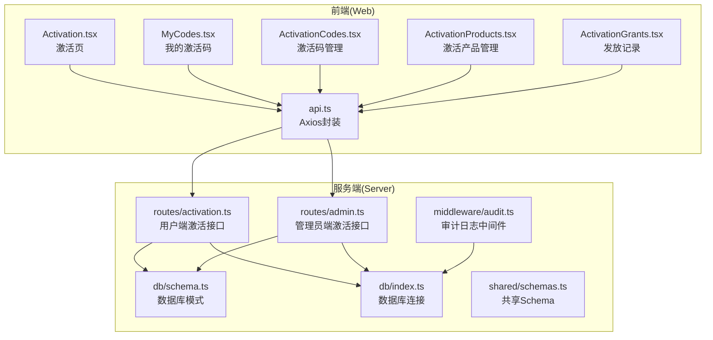
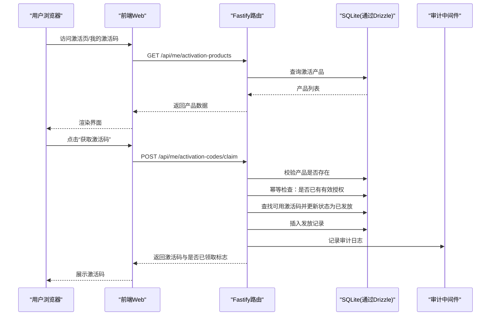
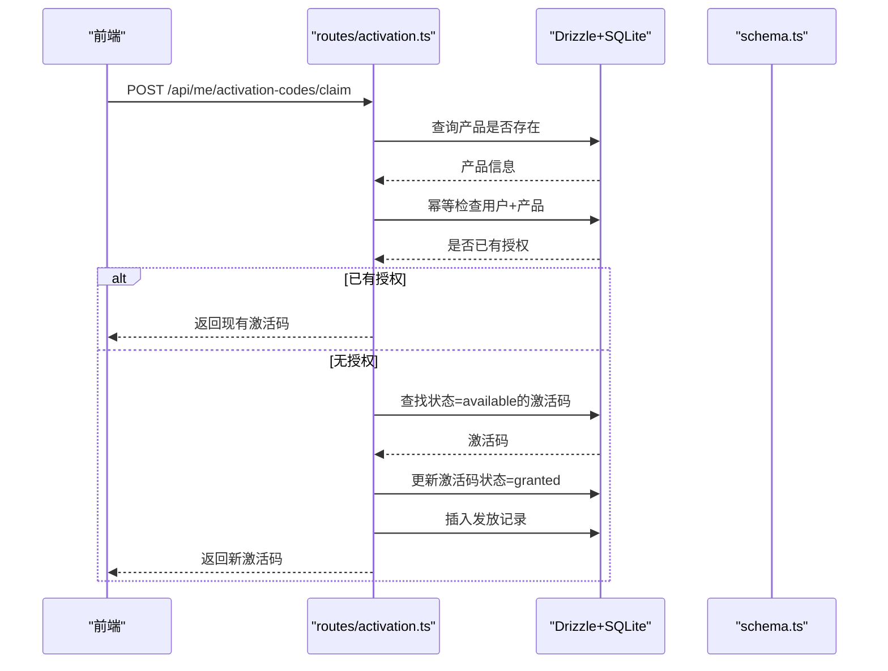
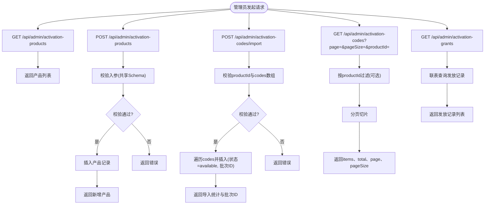
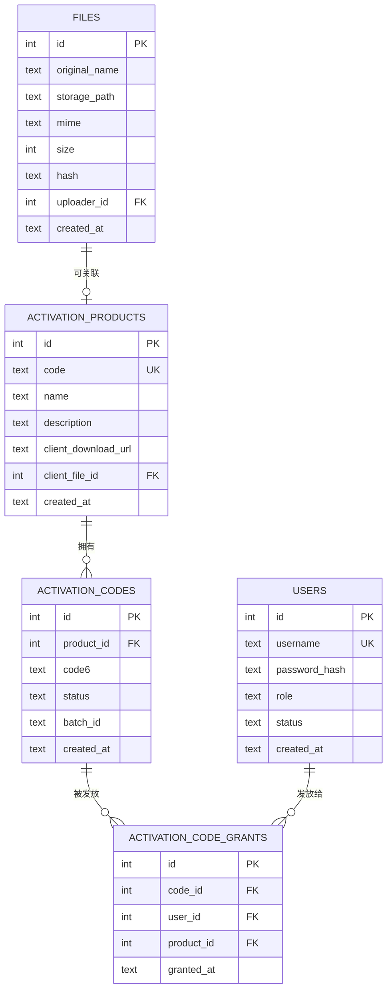
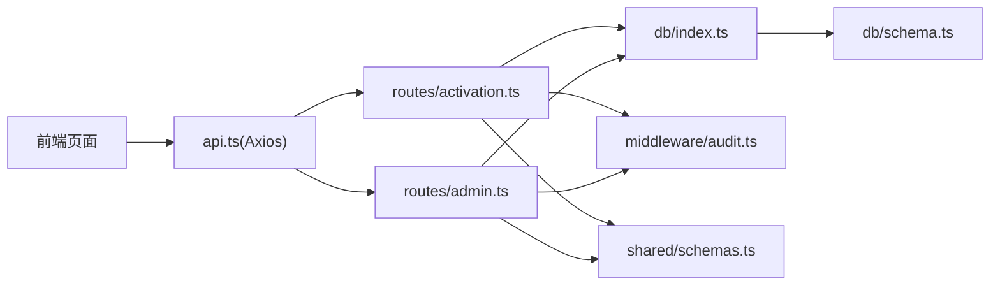

# 激活API

<cite>
**本文引用的文件**
- [apps/server/src/routes/activation.ts](file://apps/server/src/routes/activation.ts)
- [apps/server/src/routes/admin.ts](file://apps/server/src/routes/admin.ts)
- [apps/server/src/db/schema.ts](file://apps/server/src/db/schema.ts)
- [apps/server/src/db/index.ts](file://apps/server/src/db/index.ts)
- [apps/server/src/middleware/audit.ts](file://apps/server/src/middleware/audit.ts)
- [packages/shared/src/schemas.ts](file://packages/shared/src/schemas.ts)
- [apps/web/src/pages/Activation.tsx](file://apps/web/src/pages/Activation.tsx)
- [apps/web/src/pages/MyCodes.tsx](file://apps/web/src/pages/MyCodes.tsx)
- [apps/web/src/pages/admin/ActivationCodes.tsx](file://apps/web/src/pages/admin/ActivationCodes.tsx)
- [apps/web/src/pages/admin/ActivationProducts.tsx](file://apps/web/src/pages/admin/ActivationProducts.tsx)
- [apps/web/src/pages/admin/ActivationGrants.tsx](file://apps/web/src/pages/admin/ActivationGrants.tsx)
- [apps/web/src/lib/api.ts](file://apps/web/src/lib/api.ts)
- [apps/server/drizzle/meta/0000_snapshot.json](file://apps/server/drizzle/meta/0000_snapshot.json)
- [apps/server/drizzle/0000_absurd_liz_osborn.sql](file://apps/server/drizzle/0000_absurd_liz_osborn.sql)
</cite>

## 目录
1. [简介](#简介)
2. [项目结构](#项目结构)
3. [核心组件](#核心组件)
4. [架构总览](#架构总览)
5. [详细组件分析](#详细组件分析)
6. [依赖关系分析](#依赖关系分析)
7. [性能与并发特性](#性能与并发特性)
8. [故障排查指南](#故障排查指南)
9. [结论](#结论)
10. [附录：接口定义与示例](#附录接口定义与示例)

## 简介
本文件面向ZBH2平台的“激活API”，系统性梳理激活码生成、查询、发放与审计全流程。重点覆盖以下能力：
- 激活码生成：支持管理员批量导入、按产品维度管理、批次标记与状态控制
- 激活码查询：支持分页检索、按产品过滤
- 激活授权：用户领取激活码、重复领取幂等、发放记录审计
- 激活产品管理：产品配置、客户端下载链接等
- 审计与日志：统一审计日志记录，便于合规与追踪

## 项目结构
激活相关的核心代码分布在服务端路由、数据库模式、共享Schema与前端页面中，采用前后端分离的典型架构。

图表来源
- [apps/web/src/pages/Activation.tsx:1-98](file://apps/web/src/pages/Activation.tsx#L1-L98)
- [apps/web/src/pages/MyCodes.tsx:1-49](file://apps/web/src/pages/MyCodes.tsx#L1-L49)
- [apps/web/src/pages/admin/ActivationCodes.tsx:1-74](file://apps/web/src/pages/admin/ActivationCodes.tsx#L1-L74)
- [apps/web/src/pages/admin/ActivationProducts.tsx:1-66](file://apps/web/src/pages/admin/ActivationProducts.tsx#L1-L66)
- [apps/web/src/pages/admin/ActivationGrants.tsx:1-27](file://apps/web/src/pages/admin/ActivationGrants.tsx#L1-L27)
- [apps/web/src/lib/api.ts:1-16](file://apps/web/src/lib/api.ts#L1-L16)
- [apps/server/src/routes/activation.ts:1-95](file://apps/server/src/routes/activation.ts#L1-L95)
- [apps/server/src/routes/admin.ts:1-279](file://apps/server/src/routes/admin.ts#L1-L279)
- [apps/server/src/db/schema.ts:71-96](file://apps/server/src/db/schema.ts#L71-L96)
- [apps/server/src/db/index.ts:1-16](file://apps/server/src/db/index.ts#L1-L16)
- [apps/server/src/middleware/audit.ts:1-28](file://apps/server/src/middleware/audit.ts#L1-L28)
- [packages/shared/src/schemas.ts:41-51](file://packages/shared/src/schemas.ts#L41-L51)

章节来源
- [apps/server/src/routes/activation.ts:1-95](file://apps/server/src/routes/activation.ts#L1-L95)
- [apps/server/src/routes/admin.ts:136-219](file://apps/server/src/routes/admin.ts#L136-L219)
- [apps/server/src/db/schema.ts:71-96](file://apps/server/src/db/schema.ts#L71-L96)
- [apps/web/src/pages/Activation.tsx:1-98](file://apps/web/src/pages/Activation.tsx#L1-L98)
- [apps/web/src/pages/MyCodes.tsx:1-49](file://apps/web/src/pages/MyCodes.tsx#L1-L49)
- [apps/web/src/pages/admin/ActivationCodes.tsx:1-74](file://apps/web/src/pages/admin/ActivationCodes.tsx#L1-L74)
- [apps/web/src/pages/admin/ActivationProducts.tsx:1-66](file://apps/web/src/pages/admin/ActivationProducts.tsx#L1-L66)
- [apps/web/src/pages/admin/ActivationGrants.tsx:1-27](file://apps/web/src/pages/admin/ActivationGrants.tsx#L1-L27)
- [apps/web/src/lib/api.ts:1-16](file://apps/web/src/lib/api.ts#L1-L16)

## 核心组件
- 激活产品表：activation_products，存储产品编码、名称、描述、客户端下载地址等
- 激活码表：activation_codes，存储6位激活码、状态、批次ID、产品关联
- 发放记录表：activation_code_grants，记录用户、产品、激活码与发放时间
- 共享Schema：用于入参校验（如claimCodeSchema）
- 审计日志：auditLogs，统一记录用户行为与系统动作

章节来源
- [apps/server/src/db/schema.ts:71-96](file://apps/server/src/db/schema.ts#L71-L96)
- [packages/shared/src/schemas.ts:41-51](file://packages/shared/src/schemas.ts#L41-L51)
- [apps/server/src/middleware/audit.ts:1-28](file://apps/server/src/middleware/audit.ts#L1-L28)

## 架构总览
激活API由两部分组成：
- 用户端接口：用户领取激活码、查看个人已领取记录
- 管理员接口：产品管理、激活码批量导入、分页查询、发放记录审计

图表来源
- [apps/server/src/routes/activation.ts:8-75](file://apps/server/src/routes/activation.ts#L8-L75)
- [apps/server/src/db/schema.ts:71-96](file://apps/server/src/db/schema.ts#L71-L96)
- [apps/server/src/middleware/audit.ts:1-28](file://apps/server/src/middleware/audit.ts#L1-L28)
- [apps/web/src/pages/Activation.tsx:35-46](file://apps/web/src/pages/Activation.tsx#L35-L46)

## 详细组件分析

### 用户端激活接口
- 领取激活码
  - 路径：POST /api/me/activation-codes/claim
  - 参数：productId（正整数）
  - 幂等逻辑：若用户对同一产品已有有效授权，直接返回现有激活码
  - 流程：校验产品存在 → 查找可用激活码 → 更新状态为已发放 → 写入发放记录 → 返回结果
- 查询我的激活码
  - 路径：GET /api/me/activation-codes
  - 返回：用户已领取的激活码列表（含产品名、领取时间）

图表来源
- [apps/server/src/routes/activation.ts:8-75](file://apps/server/src/routes/activation.ts#L8-L75)
- [apps/server/src/db/schema.ts:81-96](file://apps/server/src/db/schema.ts#L81-L96)

章节来源
- [apps/server/src/routes/activation.ts:8-75](file://apps/server/src/routes/activation.ts#L8-L75)
- [apps/web/src/pages/Activation.tsx:35-46](file://apps/web/src/pages/Activation.tsx#L35-L46)
- [apps/web/src/pages/MyCodes.tsx:16-24](file://apps/web/src/pages/MyCodes.tsx#L16-L24)

### 管理员端激活接口
- 激活产品管理
  - GET /api/admin/activation-products：列出所有产品
  - POST /api/admin/activation-products：新增产品
  - PUT /api/admin/activation-products/:id：更新产品字段（编码、名称、描述、客户端下载链接等）
- 激活码管理
  - GET /api/admin/activation-codes：分页查询激活码（可按productId过滤）
  - POST /api/admin/activation-codes/import：批量导入激活码（6位字符串），自动分配批次ID
- 发放记录审计
  - GET /api/admin/activation-grants：查询发放记录（含用户、产品、激活码、发放时间）

图表来源
- [apps/server/src/routes/admin.ts:136-219](file://apps/server/src/routes/admin.ts#L136-L219)
- [packages/shared/src/schemas.ts:41-46](file://packages/shared/src/schemas.ts#L41-L46)

章节来源
- [apps/server/src/routes/admin.ts:136-219](file://apps/server/src/routes/admin.ts#L136-L219)
- [apps/web/src/pages/admin/ActivationProducts.tsx:11-27](file://apps/web/src/pages/admin/ActivationProducts.tsx#L11-L27)
- [apps/web/src/pages/admin/ActivationCodes.tsx:18-29](file://apps/web/src/pages/admin/ActivationCodes.tsx#L18-L29)
- [apps/web/src/pages/admin/ActivationGrants.tsx:9-11](file://apps/web/src/pages/admin/ActivationGrants.tsx#L9-L11)

### 数据模型与关系
激活相关的核心实体如下：

图表来源
- [apps/server/src/db/schema.ts:71-96](file://apps/server/src/db/schema.ts#L71-L96)
- [apps/server/drizzle/meta/0000_snapshot.json:6-242](file://apps/server/drizzle/meta/0000_snapshot.json#L6-L242)
- [apps/server/drizzle/0000_absurd_liz_osborn.sql:1-34](file://apps/server/drizzle/0000_absurd_liz_osborn.sql#L1-L34)

章节来源
- [apps/server/src/db/schema.ts:71-96](file://apps/server/src/db/schema.ts#L71-L96)
- [apps/server/drizzle/meta/0000_snapshot.json:6-242](file://apps/server/drizzle/meta/0000_snapshot.json#L6-L242)
- [apps/server/drizzle/0000_absurd_liz_osborn.sql:1-34](file://apps/server/drizzle/0000_absurd_liz_osborn.sql#L1-L34)

## 依赖关系分析
- 路由层依赖数据库层（Drizzle ORM）进行数据访问
- 共享Schema用于入参校验，确保接口输入的一致性
- 审计中间件在关键路径上统一记录审计日志
- 前端通过Axios封装统一访问后端API

图表来源
- [apps/web/src/lib/api.ts:1-16](file://apps/web/src/lib/api.ts#L1-L16)
- [apps/server/src/routes/activation.ts:1-95](file://apps/server/src/routes/activation.ts#L1-L95)
- [apps/server/src/routes/admin.ts:1-279](file://apps/server/src/routes/admin.ts#L1-L279)
- [apps/server/src/db/index.ts:1-16](file://apps/server/src/db/index.ts#L1-L16)
- [apps/server/src/db/schema.ts:1-330](file://apps/server/src/db/schema.ts#L1-L330)
- [apps/server/src/middleware/audit.ts:1-28](file://apps/server/src/middleware/audit.ts#L1-L28)
- [packages/shared/src/schemas.ts:1-51](file://packages/shared/src/schemas.ts#L1-L51)

章节来源
- [apps/web/src/lib/api.ts:1-16](file://apps/web/src/lib/api.ts#L1-L16)
- [apps/server/src/routes/activation.ts:1-95](file://apps/server/src/routes/activation.ts#L1-L95)
- [apps/server/src/routes/admin.ts:1-279](file://apps/server/src/routes/admin.ts#L1-L279)
- [apps/server/src/db/index.ts:1-16](file://apps/server/src/db/index.ts#L1-L16)
- [apps/server/src/db/schema.ts:1-330](file://apps/server/src/db/schema.ts#L1-L330)
- [apps/server/src/middleware/audit.ts:1-28](file://apps/server/src/middleware/audit.ts#L1-L28)
- [packages/shared/src/schemas.ts:1-51](file://packages/shared/src/schemas.ts#L1-L51)

## 性能与并发特性
- 并发控制
  - 领取激活码时采用“查找可用激活码并原子更新状态”的方式，避免竞态导致的超发
  - 幂等检查确保同一用户对同一产品仅能获得一次有效授权
- 分页与过滤
  - 管理端查询激活码支持分页与按产品过滤，避免一次性加载过多数据
- 存储与索引
  - SQLite采用WAL模式与外键约束，提升并发写入稳定性
  - 激活产品编码唯一索引，保障产品标识唯一性

章节来源
- [apps/server/src/routes/activation.ts:22-57](file://apps/server/src/routes/activation.ts#L22-L57)
- [apps/server/src/routes/admin.ts:161-176](file://apps/server/src/routes/admin.ts#L161-L176)
- [apps/server/src/db/index.ts:10-12](file://apps/server/src/db/index.ts#L10-L12)
- [apps/server/drizzle/meta/0000_snapshot.json:216-222](file://apps/server/drizzle/meta/0000_snapshot.json#L216-L222)

## 故障排查指南
- 领取失败
  - 产品不存在：返回错误提示“激活产品不存在”
  - 无可用激活码：返回错误提示“暂无可用激活码，请联系管理员”
  - 幂等命中：返回已存在的激活码与“alreadyClaimed=true”
- 导入失败
  - 缺少参数或codes为空：返回错误提示“请提供产品ID和激活码列表”
  - 激活码长度不为6：跳过该条目，继续处理后续条目
- 权限问题
  - 用户端接口需登录态；管理员接口需管理员权限
- 审计与追踪
  - 审计日志记录用户行为与系统动作，便于定位问题

章节来源
- [apps/server/src/routes/activation.ts:16-57](file://apps/server/src/routes/activation.ts#L16-L57)
- [apps/server/src/routes/admin.ts:178-197](file://apps/server/src/routes/admin.ts#L178-L197)
- [apps/server/src/middleware/audit.ts:1-28](file://apps/server/src/middleware/audit.ts#L1-L28)

## 结论
激活API围绕“产品—激活码—发放记录”三元模型构建，具备完善的用户端领取流程与管理员端管理能力，并通过幂等与并发控制保障数据一致性。配合统一审计日志，满足合规与运维需求。

## 附录：接口定义与示例

### 用户端接口
- 领取激活码
  - 方法与路径：POST /api/me/activation-codes/claim
  - 请求体
    - productId: 正整数（产品ID）
  - 成功响应
    - data.code6: 6位激活码
    - data.alreadyClaimed: 是否已存在有效授权
  - 失败响应
    - 错误码400/404/409，包含错误信息
  - 示例调用路径
    - [apps/web/src/pages/Activation.tsx:35-46](file://apps/web/src/pages/Activation.tsx#L35-L46)
    - [apps/server/src/routes/activation.ts:8-75](file://apps/server/src/routes/activation.ts#L8-L75)

- 查询我的激活码
  - 方法与路径：GET /api/me/activation-codes
  - 成功响应
    - data: 列表，包含id、code6、productName、productCode、grantedAt等
  - 示例调用路径
    - [apps/web/src/pages/MyCodes.tsx:16-24](file://apps/web/src/pages/MyCodes.tsx#L16-L24)
    - [apps/server/src/routes/activation.ts:77-93](file://apps/server/src/routes/activation.ts#L77-L93)

### 管理员接口
- 激活产品管理
  - 列表：GET /api/admin/activation-products
  - 新增：POST /api/admin/activation-products（请求体字段：code、name、description、clientDownloadUrl）
  - 更新：PUT /api/admin/activation-products/:id（可更新上述字段）
  - 示例调用路径
    - [apps/web/src/pages/admin/ActivationProducts.tsx:11-27](file://apps/web/src/pages/admin/ActivationProducts.tsx#L11-L27)
    - [apps/server/src/routes/admin.ts:136-158](file://apps/server/src/routes/admin.ts#L136-L158)

- 激活码管理
  - 列表：GET /api/admin/activation-codes?page=&pageSize=&productId=
    - 支持分页与按产品过滤
  - 批量导入：POST /api/admin/activation-codes/import
    - 请求体：productId、codes（字符串数组，每个元素为6位激活码）
    - 成功响应：imported（导入数量）、batchId（批次ID）
  - 示例调用路径
    - [apps/web/src/pages/admin/ActivationCodes.tsx:18-29](file://apps/web/src/pages/admin/ActivationCodes.tsx#L18-L29)
    - [apps/server/src/routes/admin.ts:161-197](file://apps/server/src/routes/admin.ts#L161-L197)

- 发放记录审计
  - 列表：GET /api/admin/activation-grants
  - 成功响应：包含id、codeId、userId、productId、grantedAt、code6、username、productName
  - 示例调用路径
    - [apps/web/src/pages/admin/ActivationGrants.tsx:9-11](file://apps/web/src/pages/admin/ActivationGrants.tsx#L9-L11)
    - [apps/server/src/routes/admin.ts:199-219](file://apps/server/src/routes/admin.ts#L199-L219)

### 数据模型字段说明
- 激活产品（activation_products）
  - code：产品编码（唯一）
  - name：产品名称
  - description：描述
  - clientDownloadUrl：客户端下载链接
- 激活码（activation_codes）
  - code6：6位激活码
  - status：状态（available/granted/revoked）
  - batchId：批次ID（导入时生成）
- 发放记录（activation_code_grants）
  - codeId：激活码ID
  - userId：用户ID
  - productId：产品ID
  - grantedAt：发放时间

章节来源
- [apps/server/src/db/schema.ts:71-96](file://apps/server/src/db/schema.ts#L71-L96)
- [apps/server/src/routes/activation.ts:8-93](file://apps/server/src/routes/activation.ts#L8-L93)
- [apps/server/src/routes/admin.ts:136-219](file://apps/server/src/routes/admin.ts#L136-L219)