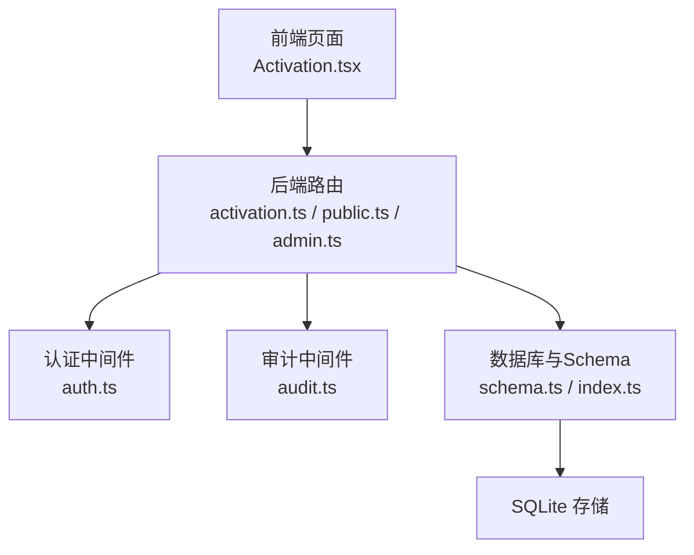
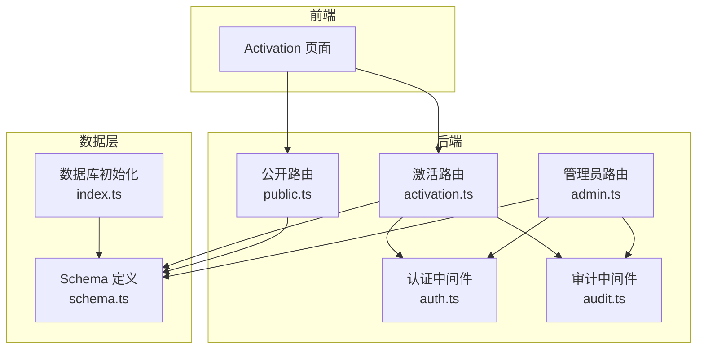
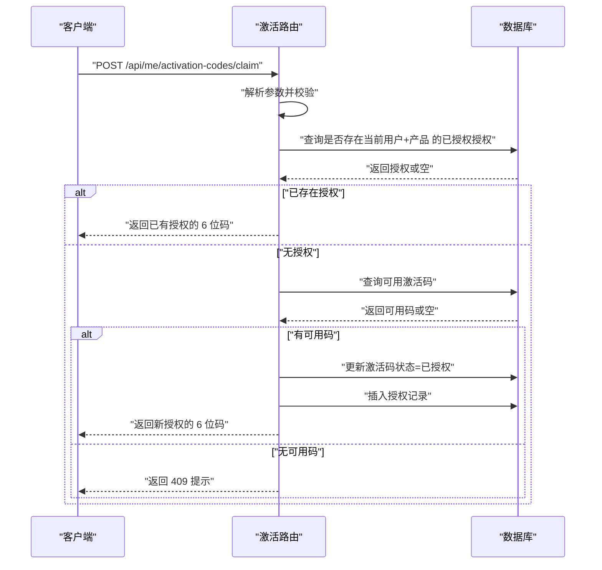
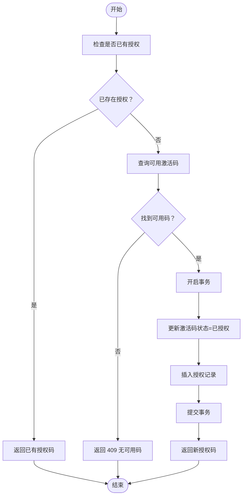
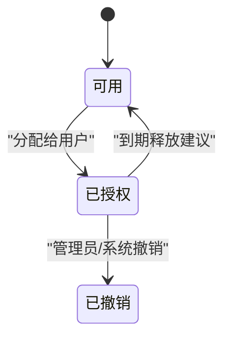
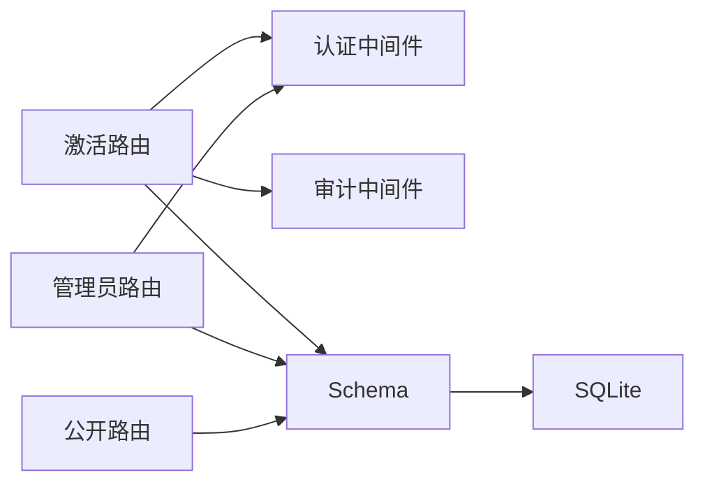

# 激活业务规则

<cite>
**本文引用的文件**
- [apps/server/src/routes/activation.ts](file://apps/server/src/routes/activation.ts)
- [apps/server/src/db/schema.ts](file://apps/server/src/db/schema.ts)
- [apps/server/src/middleware/auth.ts](file://apps/server/src/middleware/auth.ts)
- [apps/server/src/middleware/audit.ts](file://apps/server/src/middleware/audit.ts)
- [packages/shared/src/schemas.ts](file://packages/shared/src/schemas.ts)
- [apps/server/src/routes/admin.ts](file://apps/server/src/routes/admin.ts)
- [apps/server/src/routes/public.ts](file://apps/server/src/routes/public.ts)
- [apps/server/src/routes/reports.ts](file://apps/server/src/routes/reports.ts)
- [apps/server/src/db/index.ts](file://apps/server/src/db/index.ts)
- [apps/web/src/pages/Activation.tsx](file://apps/web/src/pages/Activation.tsx)
</cite>

## 目录
1. [引言](#引言)
2. [项目结构](#项目结构)
3. [核心组件](#核心组件)
4. [架构总览](#架构总览)
5. [详细组件分析](#详细组件分析)
6. [依赖关系分析](#依赖关系分析)
7. [性能考量](#性能考量)
8. [故障排查指南](#故障排查指南)
9. [结论](#结论)
10. [附录](#附录)

## 引言
本文件面向激活系统的业务规则与实现细节，围绕以下目标展开：激活码申请的幂等性、并发控制与事务处理、有效期与续期机制、授权撤销规则（含用户主动、管理员强制与系统自动）、安全规则（权限校验、设备绑定与使用频率控制）、错误处理与异常恢复、以及审计日志与合规要求。本文在不泄露具体代码内容的前提下，基于仓库现有实现进行系统化梳理与可视化呈现。

## 项目结构
激活系统由三层组成：
- 前端页面：用户通过页面选择产品并申请激活码，展示结果。
- 后端路由与中间件：提供公开产品列表、用户认证、激活申请、管理员导入与统计等接口。
- 数据层：SQLite 数据库与 Drizzle ORM 映射，定义激活产品、激活码、授权记录与审计日志等表结构。

图表来源
- [apps/web/src/pages/Activation.tsx:1-98](file://apps/web/src/pages/Activation.tsx#L1-L98)
- [apps/server/src/routes/activation.ts:1-95](file://apps/server/src/routes/activation.ts#L1-L95)
- [apps/server/src/routes/public.ts:1-52](file://apps/server/src/routes/public.ts#L1-L52)
- [apps/server/src/routes/admin.ts:1-279](file://apps/server/src/routes/admin.ts#L1-L279)
- [apps/server/src/middleware/auth.ts:1-56](file://apps/server/src/middleware/auth.ts#L1-L56)
- [apps/server/src/middleware/audit.ts:1-28](file://apps/server/src/middleware/audit.ts#L1-L28)
- [apps/server/src/db/schema.ts:1-330](file://apps/server/src/db/schema.ts#L1-L330)
- [apps/server/src/db/index.ts:1-16](file://apps/server/src/db/index.ts#L1-L16)

章节来源
- [apps/server/src/db/index.ts:1-16](file://apps/server/src/db/index.ts#L1-L16)
- [apps/server/src/db/schema.ts:1-330](file://apps/server/src/db/schema.ts#L1-L330)

## 核心组件
- 激活产品与激活码模型：定义产品、激活码状态（可用/已授权/已撤销）与授权记录。
- 激活申请流程：幂等检查、可用码查找与分配、授权记录写入。
- 认证与权限：会话加载、登录态校验、管理员权限校验。
- 审计日志：统一记录操作行为，支持合规与追踪。
- 公开产品列表：供未登录用户查看可激活产品。
- 管理员能力：批量导入激活码、查询授权明细、生成激活统计报表。
- 报表与导出：按产品维度统计激活码状态与月度趋势。

章节来源
- [apps/server/src/db/schema.ts:71-96](file://apps/server/src/db/schema.ts#L71-L96)
- [apps/server/src/routes/activation.ts:7-95](file://apps/server/src/routes/activation.ts#L7-L95)
- [apps/server/src/middleware/auth.ts:17-56](file://apps/server/src/middleware/auth.ts#L17-L56)
- [apps/server/src/middleware/audit.ts:3-27](file://apps/server/src/middleware/audit.ts#L3-L27)
- [apps/server/src/routes/public.ts:46-51](file://apps/server/src/routes/public.ts#L46-L51)
- [apps/server/src/routes/admin.ts:160-197](file://apps/server/src/routes/admin.ts#L160-L197)
- [apps/server/src/routes/reports.ts:36-74](file://apps/server/src/routes/reports.ts#L36-L74)

## 架构总览
激活系统采用“前后端分离 + 轻量数据库”的架构。前端负责交互与调用后端 API；后端通过路由暴露接口，使用 Drizzle ORM 访问 SQLite；认证中间件保障访问合法性；审计中间件统一记录操作。

图表来源
- [apps/server/src/routes/activation.ts:1-95](file://apps/server/src/routes/activation.ts#L1-L95)
- [apps/server/src/routes/public.ts:1-52](file://apps/server/src/routes/public.ts#L1-L52)
- [apps/server/src/routes/admin.ts:1-279](file://apps/server/src/routes/admin.ts#L1-L279)
- [apps/server/src/middleware/auth.ts:1-56](file://apps/server/src/middleware/auth.ts#L1-L56)
- [apps/server/src/middleware/audit.ts:1-28](file://apps/server/src/middleware/audit.ts#L1-L28)
- [apps/server/src/db/schema.ts:1-330](file://apps/server/src/db/schema.ts#L1-L330)
- [apps/server/src/db/index.ts:1-16](file://apps/server/src/db/index.ts#L1-L16)

## 详细组件分析

### 激活码申请与幂等性
- 幂等性规则
  - 在同一用户对同一产品发起申请时，若已存在“已授权”状态的授权，则直接返回该授权对应的 6 位激活码，并标记为“已领取”，避免重复发放与资源浪费。
  - 该逻辑通过联合查询授权表与激活码表，按用户 ID 与产品 ID 进行匹配，命中即返回。
- 可用码分配
  - 若无现存授权，系统从激活码表中筛选指定产品的“可用”状态记录，取第一条作为候选。
  - 将激活码状态更新为“已授权”，并向授权表插入一条新记录。
- 错误处理
  - 产品不存在或参数非法时返回相应错误。
  - 无可用激活码时提示联系管理员。

图表来源
- [apps/server/src/routes/activation.ts:8-75](file://apps/server/src/routes/activation.ts#L8-L75)
- [packages/shared/src/schemas.ts:48-51](file://packages/shared/src/schemas.ts#L48-L51)

章节来源
- [apps/server/src/routes/activation.ts:8-75](file://apps/server/src/routes/activation.ts#L8-L75)
- [packages/shared/src/schemas.ts:48-51](file://packages/shared/src/schemas.ts#L48-L51)

### 并发控制与事务处理
- 当前实现要点
  - 激活申请流程包含两条写操作：更新激活码状态与插入授权记录。当前实现未显式包裹在事务中，属于两条独立的更新/插入操作。
  - 并发场景下可能出现“可用码被其他请求抢先分配”的风险。建议在高并发场景下将“更新激活码状态”与“插入授权记录”放入单个事务，以保证原子性。
- 建议
  - 使用数据库事务包裹上述两条写操作，确保要么同时成功，要么同时回滚。
  - 对“查询可用码”与“更新状态”之间增加排他锁或使用带条件的更新语句，减少竞态窗口。

图表来源
- [apps/server/src/routes/activation.ts:22-75](file://apps/server/src/routes/activation.ts#L22-L75)

章节来源
- [apps/server/src/routes/activation.ts:22-75](file://apps/server/src/routes/activation.ts#L22-L75)

### 激活码有效期与续期机制
- 现状
  - 激活码实体未包含到期时间字段；授权记录包含授予时间字段。
  - 未发现自动过期或续期的实现逻辑。
- 建议
  - 在激活码实体中新增到期时间字段；在授权记录中新增到期时间字段，便于统一管理。
  - 提供续期接口，管理员可延长到期时间；到期前可触发提醒策略。
  - 前端与后端在查询授权时应过滤掉已过期的授权，避免继续使用。

章节来源
- [apps/server/src/db/schema.ts:81-96](file://apps/server/src/db/schema.ts#L81-L96)
- [apps/server/src/routes/reports.ts:36-74](file://apps/server/src/routes/reports.ts#L36-L74)

### 授权撤销规则
- 状态枚举
  - 激活码状态包含“可用/已授权/已撤销”，满足撤销场景的数据表达。
- 撤销类型
  - 用户主动撤销：当前未提供前端入口与后端接口，可在后续扩展。
  - 管理员强制撤销：可通过管理员接口批量导入或管理界面进行状态变更。
  - 系统自动撤销：可结合到期时间与使用策略，在到期或违规时自动置为“已撤销”。

图表来源
- [apps/server/src/db/schema.ts:84-85](file://apps/server/src/db/schema.ts#L84-L85)

章节来源
- [apps/server/src/db/schema.ts:81-96](file://apps/server/src/db/schema.ts#L81-L96)
- [apps/server/src/routes/admin.ts:160-197](file://apps/server/src/routes/admin.ts#L160-L197)

### 安全规则
- 权限验证
  - 激活申请接口使用认证中间件，要求登录态；管理员接口使用管理员权限校验。
- 设备绑定限制
  - 当前未见设备绑定逻辑；可在授权记录中引入设备指纹字段，并在激活流程中校验。
- 使用频率控制
  - 当前未见频率限制；可在申请接口增加速率限制与白名单策略，防刷。

章节来源
- [apps/server/src/middleware/auth.ts:42-56](file://apps/server/src/middleware/auth.ts#L42-L56)
- [apps/server/src/routes/activation.ts:8-14](file://apps/server/src/routes/activation.ts#L8-L14)

### 错误处理与异常恢复
- 参数校验
  - 使用共享 Schema 对请求体进行校验，非法参数返回 400。
- 资源状态
  - 产品不存在返回 404；无可用激活码返回 409。
- 认证失败
  - 未登录返回 401；非管理员访问管理员接口返回 403。
- 建议
  - 对数据库写入失败、竞态冲突等情况增加重试与降级策略。
  - 统一错误响应格式，便于前端一致处理。

章节来源
- [apps/server/src/routes/activation.ts:9-20](file://apps/server/src/routes/activation.ts#L9-L20)
- [apps/server/src/middleware/auth.ts:42-56](file://apps/server/src/middleware/auth.ts#L42-L56)

### 审计日志与合规
- 审计范围
  - 审计中间件支持记录用户、动作、目标类型、IP、UA、结果等字段。
- 建议
  - 在激活申请、授权撤销、管理员导入等关键路径增加审计记录。
  - 审计日志应保留一定周期，满足合规要求。

章节来源
- [apps/server/src/middleware/audit.ts:3-27](file://apps/server/src/middleware/audit.ts#L3-L27)
- [apps/server/src/db/schema.ts:301-314](file://apps/server/src/db/schema.ts#L301-L314)

## 依赖关系分析
- 模块耦合
  - 激活路由依赖认证中间件与审计中间件；依赖数据库 Schema 定义。
  - 管理员路由依赖认证中间件与 Schema；提供导入与报表能力。
  - 公开路由仅依赖 Schema，用于产品列表展示。
- 外部依赖
  - Drizzle ORM + better-sqlite3；SQLite 采用 WAL 模式与外键约束。

图表来源
- [apps/server/src/routes/activation.ts:1-95](file://apps/server/src/routes/activation.ts#L1-L95)
- [apps/server/src/routes/admin.ts:1-279](file://apps/server/src/routes/admin.ts#L1-L279)
- [apps/server/src/routes/public.ts:1-52](file://apps/server/src/routes/public.ts#L1-L52)
- [apps/server/src/middleware/auth.ts:1-56](file://apps/server/src/middleware/auth.ts#L1-L56)
- [apps/server/src/middleware/audit.ts:1-28](file://apps/server/src/middleware/audit.ts#L1-L28)
- [apps/server/src/db/schema.ts:1-330](file://apps/server/src/db/schema.ts#L1-L330)

章节来源
- [apps/server/src/db/index.ts:10-12](file://apps/server/src/db/index.ts#L10-L12)
- [apps/server/src/db/schema.ts:1-330](file://apps/server/src/db/schema.ts#L1-L330)

## 性能考量
- 查询优化
  - 激活码查询应确保对产品 ID 与状态建立索引，提升可用码检索效率。
- 写入优化
  - 批量导入激活码时建议使用批量插入，减少往返次数。
- 并发优化
  - 如上所述，建议将“更新激活码状态”与“插入授权记录”放入事务，降低竞态概率。
- 日志与监控
  - 审计日志写入应异步化或限流，避免阻塞主流程。

## 故障排查指南
- 无法领取激活码
  - 检查产品是否存在、是否有可用激活码。
  - 查看是否存在重复授权导致的幂等返回。
- 401/403 错误
  - 确认登录态有效且账户状态正常；管理员接口需具备管理员角色。
- 审计缺失
  - 确认审计中间件已在关键路由启用；检查审计日志表是否正确写入。

章节来源
- [apps/server/src/routes/activation.ts:16-20](file://apps/server/src/routes/activation.ts#L16-L20)
- [apps/server/src/middleware/auth.ts:42-56](file://apps/server/src/middleware/auth.ts#L42-L56)
- [apps/server/src/middleware/audit.ts:14-27](file://apps/server/src/middleware/audit.ts#L14-L27)

## 结论
当前激活系统实现了基础的幂等申请与授权记录，具备管理员导入与报表能力。为满足高并发、有效期管理、撤销与安全控制等需求，建议补充事务封装、到期时间字段、撤销接口与设备绑定策略，并完善审计覆盖与异常恢复机制。

## 附录
- 关键接口与职责
  - 公开产品列表：供未登录用户查看可激活产品。
  - 激活申请：幂等检查、可用码分配、授权记录写入。
  - 管理员导入：批量导入激活码并打上批次标识。
  - 报表统计：按产品统计激活码状态与月度趋势。
- 数据模型要点
  - 激活产品、激活码（状态枚举）、授权记录（关联用户与产品）、审计日志。

章节来源
- [apps/server/src/routes/public.ts:46-51](file://apps/server/src/routes/public.ts#L46-L51)
- [apps/server/src/routes/activation.ts:7-95](file://apps/server/src/routes/activation.ts#L7-L95)
- [apps/server/src/routes/admin.ts:160-197](file://apps/server/src/routes/admin.ts#L160-L197)
- [apps/server/src/routes/reports.ts:36-74](file://apps/server/src/routes/reports.ts#L36-L74)
- [apps/server/src/db/schema.ts:71-96](file://apps/server/src/db/schema.ts#L71-L96)