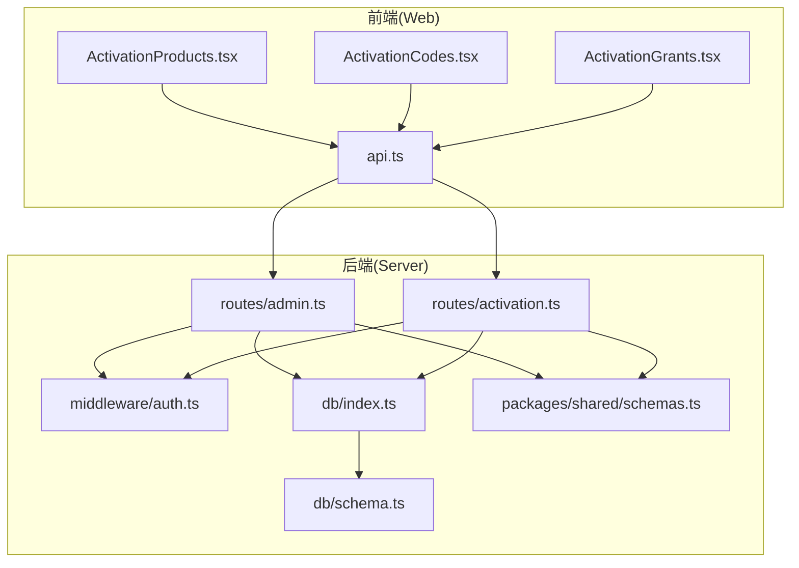
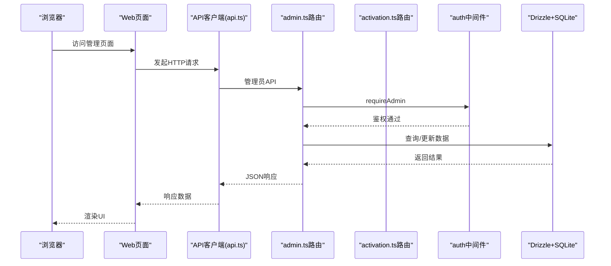
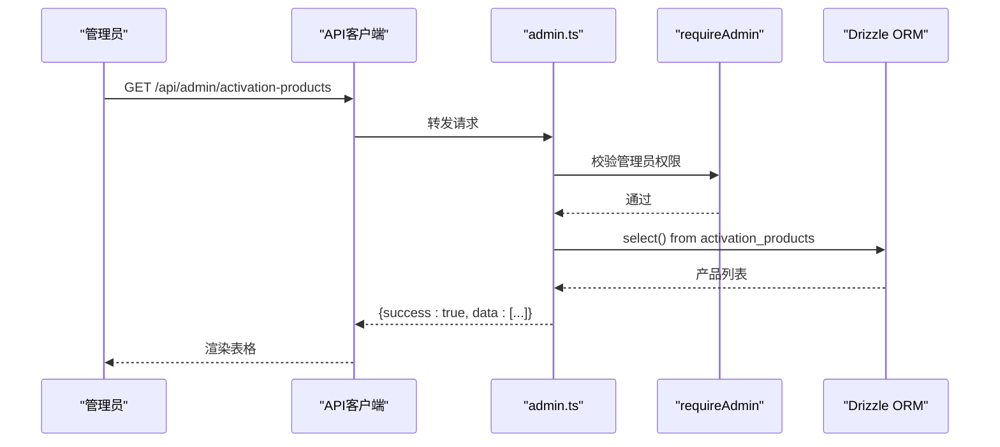
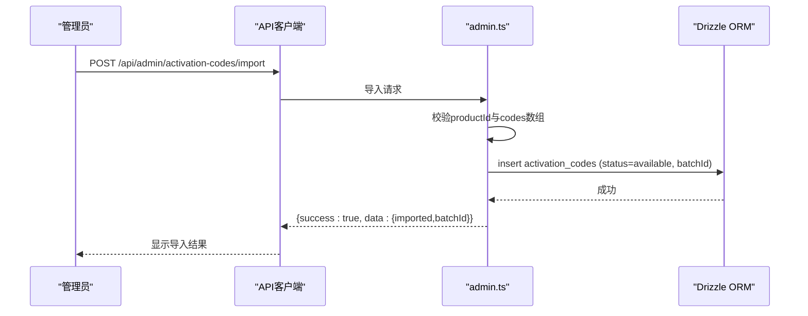
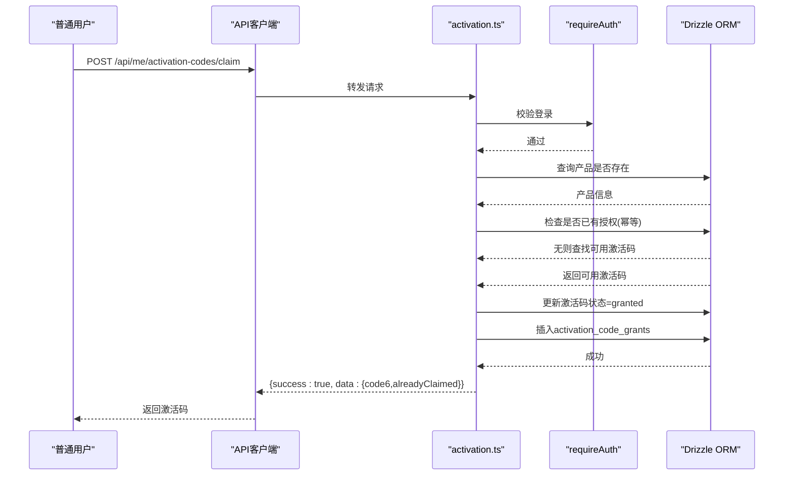
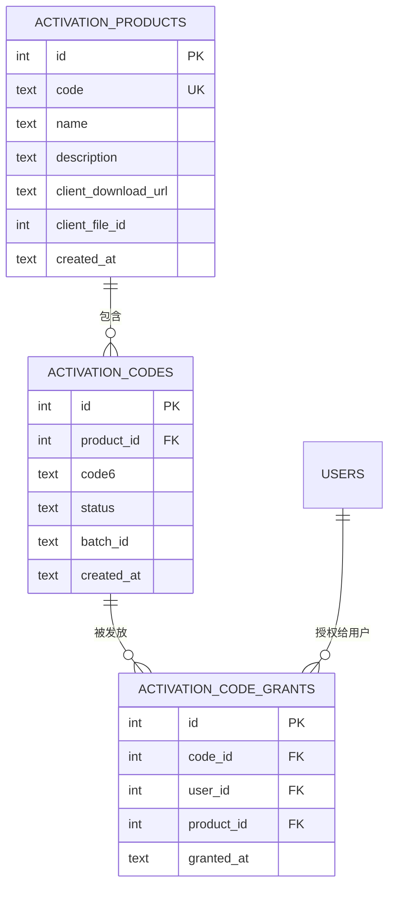
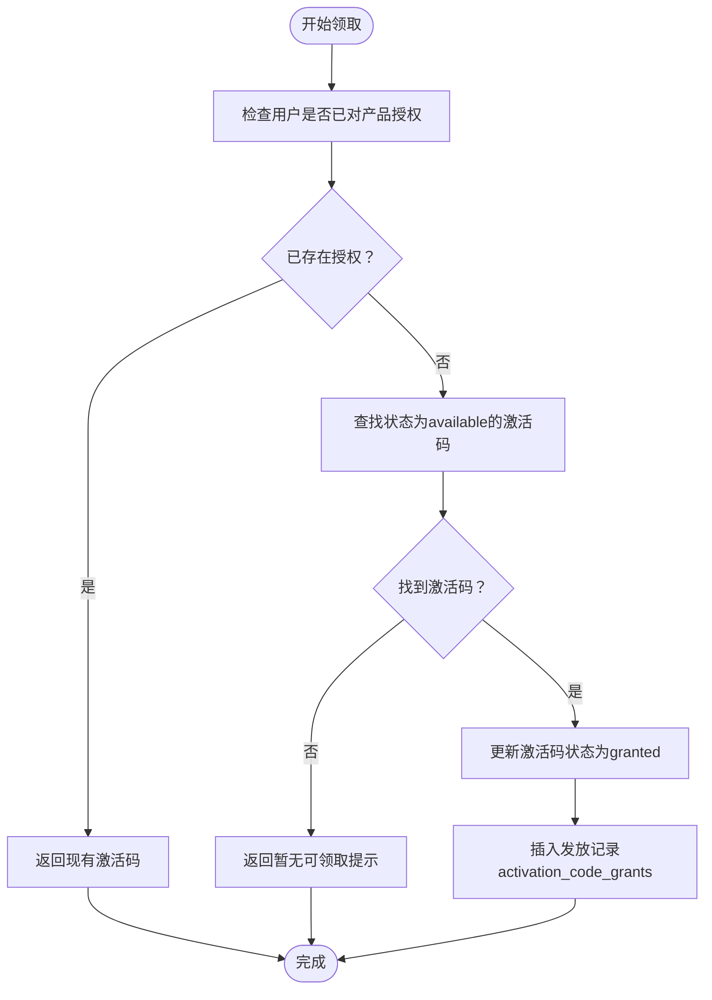
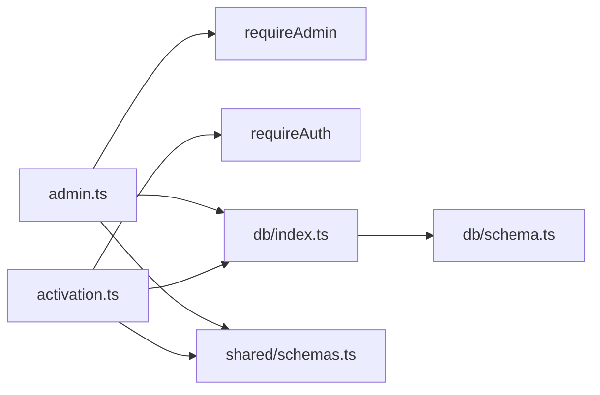

# 激活产品管理

<cite>
**本文档引用的文件**
- [apps/server/src/routes/activation.ts](file://apps/server/src/routes/activation.ts)
- [apps/server/src/routes/admin.ts](file://apps/server/src/routes/admin.ts)
- [apps/server/src/db/schema.ts](file://apps/server/src/db/schema.ts)
- [apps/server/src/db/index.ts](file://apps/server/src/db/index.ts)
- [apps/server/src/middleware/auth.ts](file://apps/server/src/middleware/auth.ts)
- [packages/shared/src/schemas.ts](file://packages/shared/src/schemas.ts)
- [apps/web/src/pages/admin/ActivationProducts.tsx](file://apps/web/src/pages/admin/ActivationProducts.tsx)
- [apps/web/src/pages/admin/ActivationCodes.tsx](file://apps/web/src/pages/admin/ActivationCodes.tsx)
- [apps/web/src/pages/admin/ActivationGrants.tsx](file://apps/web/src/pages/admin/ActivationGrants.tsx)
- [apps/web/src/lib/api.ts](file://apps/web/src/lib/api.ts)
- [apps/server/drizzle/meta/0000_snapshot.json](file://apps/server/drizzle/meta/0000_snapshot.json)
- [apps/server/drizzle/meta/0001_snapshot.json](file://apps/server/drizzle/meta/0001_snapshot.json)
- [apps/server/drizzle/meta/0002_snapshot.json](file://apps/server/drizzle/meta/0002_snapshot.json)
</cite>

## 目录
1. [简介](#简介)
2. [项目结构](#项目结构)
3. [核心组件](#核心组件)
4. [架构总览](#架构总览)
5. [详细组件分析](#详细组件分析)
6. [依赖关系分析](#依赖关系分析)
7. [性能考虑](#性能考虑)
8. [故障排除指南](#故障排除指南)
9. [结论](#结论)
10. [附录](#附录)

## 简介
本文件为激活产品管理功能的详细API文档，覆盖以下主题：
- 激活产品的配置管理：产品基本信息、授权规则与价格设置
- 分类与标签体系：支持多级分类与标签
- 授权策略：授权数量限制、使用期限、设备绑定规则
- 查询接口：按分类、状态、价格范围的筛选查询
- 启用/禁用管理与版本控制机制
- 批量操作与导入导出功能
- 激活产品与激活码的关联关系与数据一致性保障

本系统采用前后端分离架构，后端基于Fastify + Drizzle ORM + SQLite，前端基于React + Ant Design。

## 项目结构
后端模块划分清晰，采用按功能域组织的路由层：
- 路由层：activation.ts（用户激活码领取）、admin.ts（管理员API）
- 数据访问层：db/index.ts + db/schema.ts（Drizzle ORM定义）
- 中间件：auth.ts（会话与鉴权）
- 共享层：packages/shared（Zod Schema定义）

前端页面：
- ActivationProducts.tsx：激活产品管理
- ActivationCodes.tsx：激活码管理与批量导入
- ActivationGrants.tsx：激活码发放记录审计

**图表来源**
- [apps/web/src/pages/admin/ActivationProducts.tsx:1-66](file://apps/web/src/pages/admin/ActivationProducts.tsx#L1-L66)
- [apps/web/src/pages/admin/ActivationCodes.tsx:1-74](file://apps/web/src/pages/admin/ActivationCodes.tsx#L1-L74)
- [apps/web/src/pages/admin/ActivationGrants.tsx:1-27](file://apps/web/src/pages/admin/ActivationGrants.tsx#L1-L27)
- [apps/web/src/lib/api.ts:1-16](file://apps/web/src/lib/api.ts#L1-L16)
- [apps/server/src/routes/admin.ts:1-279](file://apps/server/src/routes/admin.ts#L1-L279)
- [apps/server/src/routes/activation.ts:1-95](file://apps/server/src/routes/activation.ts#L1-L95)
- [apps/server/src/middleware/auth.ts:1-56](file://apps/server/src/middleware/auth.ts#L1-L56)
- [apps/server/src/db/index.ts:1-16](file://apps/server/src/db/index.ts#L1-L16)
- [apps/server/src/db/schema.ts:1-330](file://apps/server/src/db/schema.ts#L1-L330)
- [packages/shared/src/schemas.ts:1-51](file://packages/shared/src/schemas.ts#L1-L51)

**章节来源**
- [apps/server/src/routes/admin.ts:136-158](file://apps/server/src/routes/admin.ts#L136-L158)
- [apps/server/src/routes/activation.ts:7-95](file://apps/server/src/routes/activation.ts#L7-L95)
- [apps/server/src/db/schema.ts:71-96](file://apps/server/src/db/schema.ts#L71-L96)
- [apps/web/src/pages/admin/ActivationProducts.tsx:1-66](file://apps/web/src/pages/admin/ActivationProducts.tsx#L1-L66)
- [apps/web/src/pages/admin/ActivationCodes.tsx:1-74](file://apps/web/src/pages/admin/ActivationCodes.tsx#L1-L74)
- [apps/web/src/pages/admin/ActivationGrants.tsx:1-27](file://apps/web/src/pages/admin/ActivationGrants.tsx#L1-L27)

## 核心组件
- 激活产品表（activation_products）：存储产品基本信息（编码、名称、描述、客户端下载地址等）
- 激活码表（activation_codes）：存储6位激活码、状态、批次号、产品关联
- 激活码发放记录表（activation_code_grants）：记录用户与产品的授权关系及发放时间
- 共享Schema：用于请求参数校验（激活产品、激活码领取）

这些组件共同构成激活产品管理的数据基础，支撑产品配置、激活码发放与审计追踪。

**章节来源**
- [apps/server/src/db/schema.ts:71-96](file://apps/server/src/db/schema.ts#L71-L96)
- [packages/shared/src/schemas.ts:41-51](file://packages/shared/src/schemas.ts#L41-L51)

## 架构总览
系统采用三层架构：
- 表现层：React页面组件负责展示与交互
- 应用层：Fastify路由处理业务逻辑，调用数据库层
- 数据层：Drizzle ORM映射SQLite表结构，提供类型安全的查询与更新

鉴权中间件确保仅认证用户可访问受保护接口；管理员路由通过requireAdmin进行权限控制。

**图表来源**
- [apps/web/src/lib/api.ts:1-16](file://apps/web/src/lib/api.ts#L1-L16)
- [apps/server/src/routes/admin.ts:15-16](file://apps/server/src/routes/admin.ts#L15-L16)
- [apps/server/src/middleware/auth.ts:48-55](file://apps/server/src/middleware/auth.ts#L48-L55)
- [apps/server/src/db/index.ts:1-16](file://apps/server/src/db/index.ts#L1-L16)

## 详细组件分析

### 激活产品管理API
- 获取产品列表：GET /api/admin/activation-products
- 新增产品：POST /api/admin/activation-products
- 更新产品：PUT /api/admin/activation-products/:id

请求体参数由共享Schema进行校验，字段包括产品编码、名称、描述、客户端下载链接等。

**图表来源**
- [apps/server/src/routes/admin.ts:136-158](file://apps/server/src/routes/admin.ts#L136-L158)
- [apps/server/src/middleware/auth.ts:48-55](file://apps/server/src/middleware/auth.ts#L48-L55)
- [apps/server/src/db/schema.ts:71-79](file://apps/server/src/db/schema.ts#L71-L79)

**章节来源**
- [apps/server/src/routes/admin.ts:136-158](file://apps/server/src/routes/admin.ts#L136-L158)
- [packages/shared/src/schemas.ts:41-46](file://packages/shared/src/schemas.ts#L41-L46)
- [apps/web/src/pages/admin/ActivationProducts.tsx:11-27](file://apps/web/src/pages/admin/ActivationProducts.tsx#L11-L27)

### 激活码管理API
- 列表查询：GET /api/admin/activation-codes（支持按productId过滤）
- 批量导入：POST /api/admin/activation-codes/import（6位激活码，自动生成批次号）

**图表来源**
- [apps/server/src/routes/admin.ts:160-197](file://apps/server/src/routes/admin.ts#L160-L197)
- [apps/server/src/db/schema.ts:81-88](file://apps/server/src/db/schema.ts#L81-L88)

**章节来源**
- [apps/server/src/routes/admin.ts:160-197](file://apps/server/src/routes/admin.ts#L160-L197)
- [apps/web/src/pages/admin/ActivationCodes.tsx:18-43](file://apps/web/src/pages/admin/ActivationCodes.tsx#L18-L43)

### 用户激活码领取API
- 领取接口：POST /api/me/activation-codes/claim（需要登录）
- 用户自己的激活码列表：GET /api/me/activation-codes

该流程包含幂等性检查：若用户对同一产品已有有效授权，则直接返回现有激活码。

**图表来源**
- [apps/server/src/routes/activation.ts:8-75](file://apps/server/src/routes/activation.ts#L8-L75)
- [apps/server/src/middleware/auth.ts:42-46](file://apps/server/src/middleware/auth.ts#L42-L46)
- [apps/server/src/db/schema.ts:81-96](file://apps/server/src/db/schema.ts#L81-L96)

**章节来源**
- [apps/server/src/routes/activation.ts:8-95](file://apps/server/src/routes/activation.ts#L8-L95)
- [apps/web/src/lib/api.ts:1-16](file://apps/web/src/lib/api.ts#L1-L16)

### 数据模型与关系
激活产品、激活码与发放记录三者之间存在明确的外键关系，保证数据一致性。

**图表来源**
- [apps/server/src/db/schema.ts:71-96](file://apps/server/src/db/schema.ts#L71-L96)
- [apps/server/drizzle/meta/0000_snapshot.json:160-242](file://apps/server/drizzle/meta/0000_snapshot.json#L160-L242)
- [apps/server/drizzle/meta/0001_snapshot.json:160-242](file://apps/server/drizzle/meta/0001_snapshot.json#L160-L242)
- [apps/server/drizzle/meta/0002_snapshot.json:160-242](file://apps/server/drizzle/meta/0002_snapshot.json#L160-L242)

**章节来源**
- [apps/server/src/db/schema.ts:71-96](file://apps/server/src/db/schema.ts#L71-L96)

### 授权策略与数据一致性
- 幂等性：同一用户对同一产品只能拥有一份有效授权，重复领取返回已存在的激活码
- 状态机：激活码状态包括available、granted、revoked，发放时从available变为granted
- 关联完整性：activation_code_grants同时记录codeId、userId、productId，便于审计与统计

**图表来源**
- [apps/server/src/routes/activation.ts:22-75](file://apps/server/src/routes/activation.ts#L22-L75)

**章节来源**
- [apps/server/src/routes/activation.ts:22-75](file://apps/server/src/routes/activation.ts#L22-L75)

### 查询接口与筛选
- 激活码列表支持按产品过滤：GET /api/admin/activation-codes?productId=...
- 支持分页参数page、pageSize（最大100）
- 激活产品列表：GET /api/admin/activation-products

前端页面ActivationCodes.tsx与ActivationProducts.tsx分别调用上述接口并渲染表格。

**章节来源**
- [apps/server/src/routes/admin.ts:160-176](file://apps/server/src/routes/admin.ts#L160-L176)
- [apps/web/src/pages/admin/ActivationCodes.tsx:18-29](file://apps/web/src/pages/admin/ActivationCodes.tsx#L18-L29)
- [apps/web/src/pages/admin/ActivationProducts.tsx:11-15](file://apps/web/src/pages/admin/ActivationProducts.tsx#L11-L15)

### 启用/禁用管理与版本控制
- 当前激活产品未提供显式的启用/禁用字段或版本控制字段
- 若需扩展，可在activation_products表中增加status字段与版本号字段，并在admin路由中提供对应接口

[本节为概念性建议，不涉及具体源码分析]

### 批量操作与导入导出
- 批量导入：POST /api/admin/activation-codes/import（6位激活码，自动分配批次号）
- 导出：当前未提供专门的导出接口，可通过激活码列表接口配合前端导出

**章节来源**
- [apps/server/src/routes/admin.ts:178-197](file://apps/server/src/routes/admin.ts#L178-L197)
- [apps/web/src/pages/admin/ActivationCodes.tsx:31-43](file://apps/web/src/pages/admin/ActivationCodes.tsx#L31-L43)

### 与激活码的关联关系与数据一致性
- 激活码状态与发放记录一一对应：发放即变更状态并写入发放记录
- 外键约束确保删除产品或用户不会破坏激活码与发放记录的完整性
- 审计：activation_grants提供发放时间、用户名、产品名等审计字段

**章节来源**
- [apps/server/src/db/schema.ts:81-96](file://apps/server/src/db/schema.ts#L81-L96)
- [apps/server/src/routes/admin.ts:199-219](file://apps/server/src/routes/admin.ts#L199-L219)

## 依赖关系分析
- 路由依赖中间件：admin.ts依赖requireAdmin，activation.ts依赖requireAuth
- 路由依赖数据库：admin.ts与activation.ts均通过db/index.ts与schema.ts进行数据访问
- 前端依赖共享Schema：admin.ts与activation.ts的请求参数校验来自shared包

**图表来源**
- [apps/server/src/routes/admin.ts:1-16](file://apps/server/src/routes/admin.ts#L1-L16)
- [apps/server/src/routes/activation.ts:1-7](file://apps/server/src/routes/activation.ts#L1-L7)
- [apps/server/src/middleware/auth.ts:1-56](file://apps/server/src/middleware/auth.ts#L1-L56)
- [apps/server/src/db/index.ts:1-16](file://apps/server/src/db/index.ts#L1-L16)
- [apps/server/src/db/schema.ts:1-330](file://apps/server/src/db/schema.ts#L1-L330)
- [packages/shared/src/schemas.ts:1-51](file://packages/shared/src/schemas.ts#L1-L51)

**章节来源**
- [apps/server/src/routes/admin.ts:1-16](file://apps/server/src/routes/admin.ts#L1-L16)
- [apps/server/src/routes/activation.ts:1-7](file://apps/server/src/routes/activation.ts#L1-L7)
- [apps/server/src/middleware/auth.ts:1-56](file://apps/server/src/middleware/auth.ts#L1-L56)
- [apps/server/src/db/index.ts:1-16](file://apps/server/src/db/index.ts#L1-L16)
- [apps/server/src/db/schema.ts:1-330](file://apps/server/src/db/schema.ts#L1-L330)
- [packages/shared/src/schemas.ts:1-51](file://packages/shared/src/schemas.ts#L1-L51)

## 性能考虑
- 数据库连接：SQLite采用WAL模式与外键开启，提升并发与一致性
- 查询优化：激活码列表支持productId过滤与分页，避免全表扫描
- 幂等性：用户领取激活码时先检查再更新，减少不必要的写操作
- 前端分页：列表接口默认pageSize=20，最大100，降低网络与内存压力

[本节为一般性建议，不涉及具体源码分析]

## 故障排除指南
- 401 未登录：requireAuth/requireAdmin中间件返回未认证错误
- 403 权限不足：非管理员访问管理员路由
- 404 产品不存在：领取激活码时目标产品不存在
- 409 激活码不可用：无可用激活码或已过期
- 参数校验失败：请求体不符合共享Schema定义

**章节来源**
- [apps/server/src/middleware/auth.ts:42-55](file://apps/server/src/middleware/auth.ts#L42-L55)
- [apps/server/src/routes/activation.ts:18-20](file://apps/server/src/routes/activation.ts#L18-L20)
- [apps/server/src/routes/activation.ts:55-57](file://apps/server/src/routes/activation.ts#L55-L57)
- [packages/shared/src/schemas.ts:41-51](file://packages/shared/src/schemas.ts#L41-L51)

## 结论
激活产品管理功能以简洁的数据模型与清晰的路由职责实现了产品配置、激活码发放与审计追踪的完整闭环。通过幂等性设计与外键约束，系统在功能与一致性之间取得良好平衡。后续可按需扩展启用/禁用与版本控制能力，并补充导出接口以完善管理体验。

## 附录
- 数据库快照：0000/0001/0002快照展示了activation_*相关表的演进
- 前端页面：ActivationProducts.tsx、ActivationCodes.tsx、ActivationGrants.tsx提供直观的管理界面

**章节来源**
- [apps/server/drizzle/meta/0000_snapshot.json:1-757](file://apps/server/drizzle/meta/0000_snapshot.json#L1-L757)
- [apps/server/drizzle/meta/0001_snapshot.json:1-800](file://apps/server/drizzle/meta/0001_snapshot.json#L1-L800)
- [apps/server/drizzle/meta/0002_snapshot.json:1-800](file://apps/server/drizzle/meta/0002_snapshot.json#L1-L800)
- [apps/web/src/pages/admin/ActivationProducts.tsx:1-66](file://apps/web/src/pages/admin/ActivationProducts.tsx#L1-L66)
- [apps/web/src/pages/admin/ActivationCodes.tsx:1-74](file://apps/web/src/pages/admin/ActivationCodes.tsx#L1-L74)
- [apps/web/src/pages/admin/ActivationGrants.tsx:1-27](file://apps/web/src/pages/admin/ActivationGrants.tsx#L1-L27)