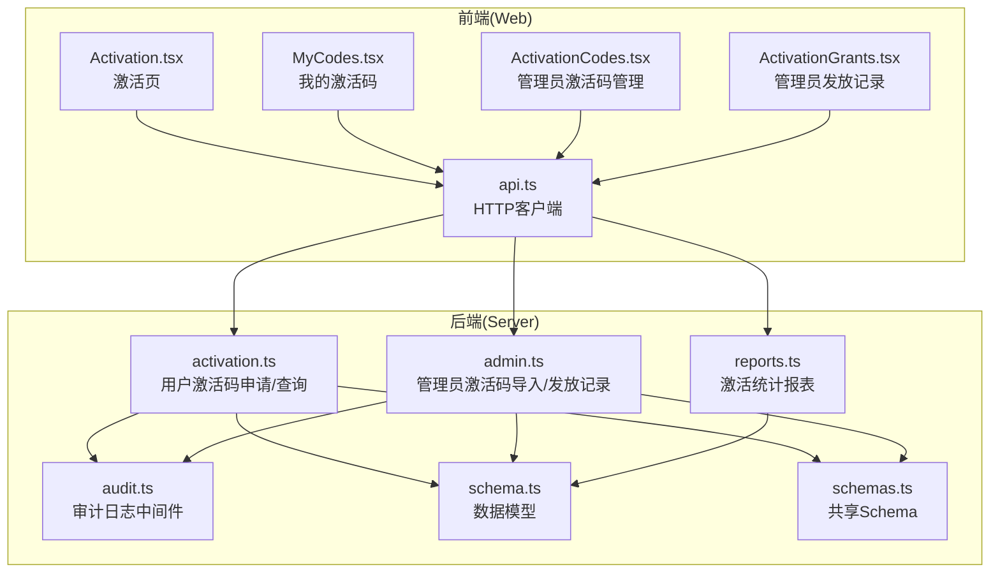
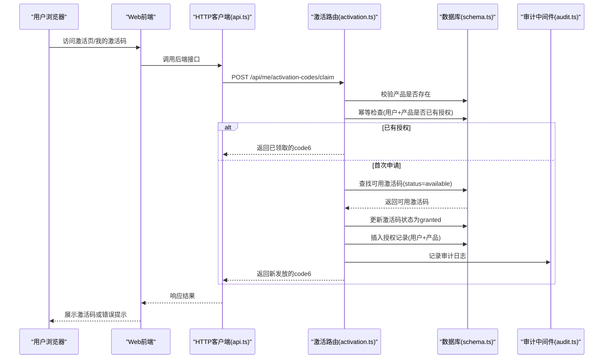
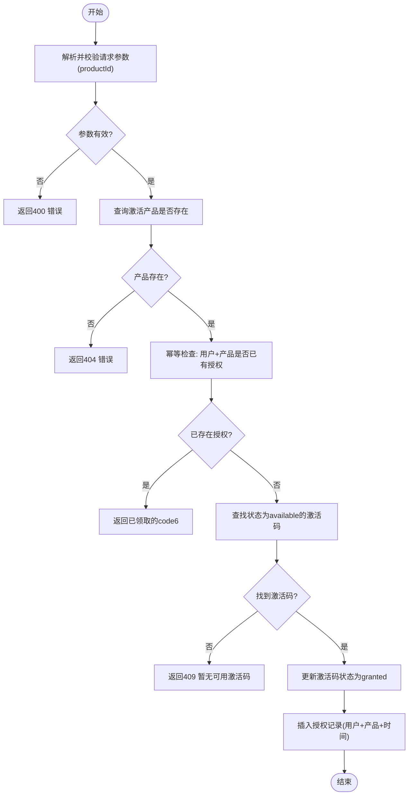
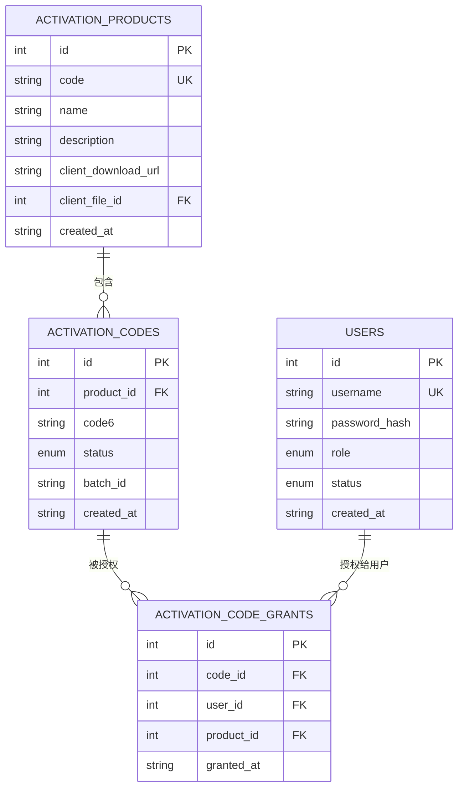
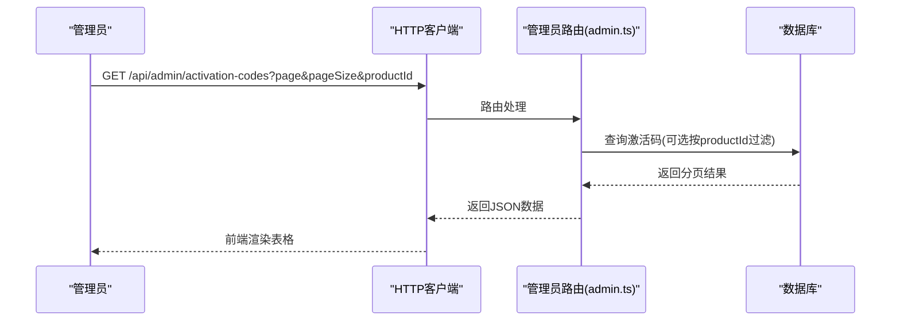
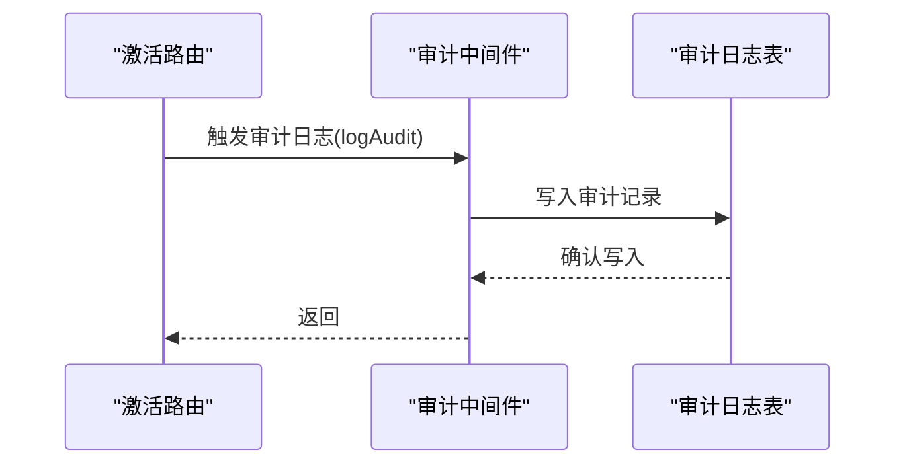
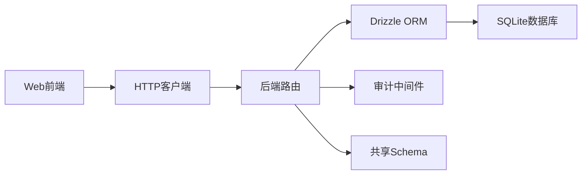

# 激活授权管理

<cite>
**本文档引用的文件**
- [apps/server/src/routes/activation.ts](file://apps/server/src/routes/activation.ts)
- [apps/server/src/routes/admin.ts](file://apps/server/src/routes/admin.ts)
- [apps/server/src/routes/reports.ts](file://apps/server/src/routes/reports.ts)
- [apps/server/src/db/schema.ts](file://apps/server/src/db/schema.ts)
- [apps/server/src/middleware/audit.ts](file://apps/server/src/middleware/audit.ts)
- [packages/shared/src/schemas.ts](file://packages/shared/src/schemas.ts)
- [apps/web/src/pages/Activation.tsx](file://apps/web/src/pages/Activation.tsx)
- [apps/web/src/pages/MyCodes.tsx](file://apps/web/src/pages/MyCodes.tsx)
- [apps/web/src/pages/admin/ActivationCodes.tsx](file://apps/web/src/pages/admin/ActivationCodes.tsx)
- [apps/web/src/pages/admin/ActivationGrants.tsx](file://apps/web/src/pages/admin/ActivationGrants.tsx)
- [apps/web/src/lib/api.ts](file://apps/web/src/lib/api.ts)
</cite>

## 目录
1. [简介](#简介)
2. [项目结构](#项目结构)
3. [核心组件](#核心组件)
4. [架构总览](#架构总览)
5. [详细组件分析](#详细组件分析)
6. [依赖分析](#依赖分析)
7. [性能考虑](#性能考虑)
8. [故障排除指南](#故障排除指南)
9. [结论](#结论)
10. [附录](#附录)

## 简介
本文件为激活授权管理功能的详细API文档，覆盖以下关键能力：
- 用户激活码申请：幂等性检查、重复申请防护、状态验证与发放流程
- 激活授权授予：用户与激活码的绑定关系、授权时间记录、使用权限控制
- 激活授权撤销：手动撤销、自动过期（当前仓库未实现）、异常处理
- 查询接口：按用户、产品、时间范围的多维查询
- 审计日志：记录与追踪机制
- 并发控制与状态同步策略

## 项目结构
激活授权管理涉及前后端协作：
- 前端页面：用户激活页、我的激活码、管理员激活码管理与发放记录
- 后端路由：用户激活码申请、用户自身授权查询、管理员激活码导入与发放记录查询
- 数据模型：激活产品、激活码、激活授权记录、审计日志
- 共享校验：Zod Schema用于请求参数校验
- 审计中间件：统一记录审计日志

**图表来源**
- [apps/web/src/pages/Activation.tsx:1-98](file://apps/web/src/pages/Activation.tsx#L1-L98)
- [apps/web/src/pages/MyCodes.tsx:1-49](file://apps/web/src/pages/MyCodes.tsx#L1-L49)
- [apps/web/src/pages/admin/ActivationCodes.tsx:1-74](file://apps/web/src/pages/admin/ActivationCodes.tsx#L1-L74)
- [apps/web/src/pages/admin/ActivationGrants.tsx:1-27](file://apps/web/src/pages/admin/ActivationGrants.tsx#L1-L27)
- [apps/web/src/lib/api.ts:1-16](file://apps/web/src/lib/api.ts#L1-L16)
- [apps/server/src/routes/activation.ts:1-95](file://apps/server/src/routes/activation.ts#L1-L95)
- [apps/server/src/routes/admin.ts:1-279](file://apps/server/src/routes/admin.ts#L1-L279)
- [apps/server/src/routes/reports.ts:1-146](file://apps/server/src/routes/reports.ts#L1-L146)
- [apps/server/src/middleware/audit.ts:1-28](file://apps/server/src/middleware/audit.ts#L1-L28)
- [apps/server/src/db/schema.ts:71-96](file://apps/server/src/db/schema.ts#L71-L96)
- [packages/shared/src/schemas.ts:48-51](file://packages/shared/src/schemas.ts#L48-L51)

**章节来源**
- [apps/server/src/routes/activation.ts:1-95](file://apps/server/src/routes/activation.ts#L1-L95)
- [apps/server/src/routes/admin.ts:160-219](file://apps/server/src/routes/admin.ts#L160-L219)
- [apps/server/src/db/schema.ts:71-96](file://apps/server/src/db/schema.ts#L71-L96)
- [packages/shared/src/schemas.ts:48-51](file://packages/shared/src/schemas.ts#L48-L51)
- [apps/web/src/lib/api.ts:1-16](file://apps/web/src/lib/api.ts#L1-L16)

## 核心组件
- 激活产品表：定义可激活的产品信息
- 激活码表：存储6位激活码、状态、批次、产品关联
- 激活授权表：记录用户与激活码的绑定关系、授权时间
- 审计日志表：记录用户行为与系统操作
- 用户激活码申请接口：幂等发放、状态校验、授权记录
- 管理员激活码导入接口：批量导入6位激活码
- 管理员发放记录查询接口：按时间倒序展示授权明细
- 报表接口：激活使用统计与导出

**章节来源**
- [apps/server/src/db/schema.ts:71-96](file://apps/server/src/db/schema.ts#L71-L96)
- [apps/server/src/routes/activation.ts:7-93](file://apps/server/src/routes/activation.ts#L7-L93)
- [apps/server/src/routes/admin.ts:160-219](file://apps/server/src/routes/admin.ts#L160-L219)
- [apps/server/src/routes/reports.ts:36-74](file://apps/server/src/routes/reports.ts#L36-L74)

## 架构总览
激活授权管理采用前后端分离架构：
- 前端通过HTTP客户端调用后端REST接口
- 后端基于Fastify路由，Drizzle ORM访问SQLite数据库
- 共享Schema确保前后端参数校验一致
- 审计中间件统一记录操作日志

**图表来源**
- [apps/web/src/lib/api.ts:1-16](file://apps/web/src/lib/api.ts#L1-L16)
- [apps/server/src/routes/activation.ts:7-75](file://apps/server/src/routes/activation.ts#L7-L75)
- [apps/server/src/db/schema.ts:81-96](file://apps/server/src/db/schema.ts#L81-L96)
- [apps/server/src/middleware/audit.ts:3-27](file://apps/server/src/middleware/audit.ts#L3-L27)

## 详细组件分析

### 用户激活码申请流程
- 请求参数校验：使用共享Schema校验productId为正整数
- 产品存在性校验：查询激活产品是否存在
- 幂等性检查：同一用户对同一产品仅允许存在一条“已授权”记录
- 可用激活码查找：按产品筛选且状态为available的激活码
- 发放原子操作：更新激活码状态为granted并插入授权记录
- 成功响应：返回code6与是否已领取标记

**图表来源**
- [apps/server/src/routes/activation.ts:8-75](file://apps/server/src/routes/activation.ts#L8-L75)
- [packages/shared/src/schemas.ts:48-51](file://packages/shared/src/schemas.ts#L48-L51)
- [apps/server/src/db/schema.ts:81-96](file://apps/server/src/db/schema.ts#L81-L96)

**章节来源**
- [apps/server/src/routes/activation.ts:8-75](file://apps/server/src/routes/activation.ts#L8-L75)
- [packages/shared/src/schemas.ts:48-51](file://packages/shared/src/schemas.ts#L48-L51)

### 激活授权授予机制
- 绑定关系：授权记录包含codeId、userId、productId
- 授权时间：grantedAt字段记录授权发生的时间
- 使用权限控制：前端根据授权记录展示激活码；后端在申请时进行幂等与状态校验

**图表来源**
- [apps/server/src/db/schema.ts:71-96](file://apps/server/src/db/schema.ts#L71-L96)

**章节来源**
- [apps/server/src/db/schema.ts:71-96](file://apps/server/src/db/schema.ts#L71-L96)
- [apps/server/src/routes/activation.ts:65-69](file://apps/server/src/routes/activation.ts#L65-L69)

### 激活授权撤销功能
- 当前实现：后端未提供撤销接口；激活码状态枚举包含revoked
- 建议实现：新增管理员撤销接口，更新激活码状态为revoked并记录审计日志
- 自动过期：当前仓库未实现；可在报表或定时任务中扩展

**章节来源**
- [apps/server/src/db/schema.ts:84-85](file://apps/server/src/db/schema.ts#L84-L85)
- [apps/server/src/routes/admin.ts:160-219](file://apps/server/src/routes/admin.ts#L160-L219)

### 激活授权查询接口
- 用户维度：用户自身只能查询自己的授权记录
- 管理员维度：可查询所有授权记录并按时间倒序排列
- 多维查询：管理员可按产品筛选激活码列表

**图表来源**
- [apps/server/src/routes/admin.ts:160-176](file://apps/server/src/routes/admin.ts#L160-L176)

**章节来源**
- [apps/server/src/routes/activation.ts:77-93](file://apps/server/src/routes/activation.ts#L77-L93)
- [apps/server/src/routes/admin.ts:160-176](file://apps/server/src/routes/admin.ts#L160-L176)
- [apps/server/src/routes/admin.ts:199-219](file://apps/server/src/routes/admin.ts#L199-L219)

### 审计日志记录与追踪
- 审计字段：用户ID/名称、动作、目标类型、目标ID/名称、详情、IP、UA、结果
- 记录时机：在关键业务流程中插入审计日志（如激活码发放）
- 日志查询：管理员可通过报表与后台查看审计记录

**图表来源**
- [apps/server/src/middleware/audit.ts:3-27](file://apps/server/src/middleware/audit.ts#L3-L27)
- [apps/server/src/db/schema.ts:301-314](file://apps/server/src/db/schema.ts#L301-L314)

**章节来源**
- [apps/server/src/middleware/audit.ts:3-27](file://apps/server/src/middleware/audit.ts#L3-L27)
- [apps/server/src/db/schema.ts:301-314](file://apps/server/src/db/schema.ts#L301-L314)

### 并发控制与状态同步策略
- 幂等性：同一用户对同一产品的授权只允许存在一条“已授权”记录
- 原子性：发放时先更新激活码状态再插入授权记录，保证一致性
- 状态枚举：激活码状态为available/granted/revoked，避免不一致状态
- 建议增强：在高并发场景下，可引入唯一索引或分布式锁保障发放原子性

**章节来源**
- [apps/server/src/routes/activation.ts:22-42](file://apps/server/src/routes/activation.ts#L22-L42)
- [apps/server/src/routes/activation.ts:60-69](file://apps/server/src/routes/activation.ts#L60-L69)
- [apps/server/src/db/schema.ts:84-85](file://apps/server/src/db/schema.ts#L84-L85)

## 依赖分析
- 前端依赖后端REST接口，使用统一的HTTP客户端
- 后端依赖Drizzle ORM与SQLite，共享Schema确保参数校验一致
- 审计中间件作为横切关注点，贯穿关键业务流程

**图表来源**
- [apps/web/src/lib/api.ts:1-16](file://apps/web/src/lib/api.ts#L1-L16)
- [apps/server/src/routes/activation.ts:1-6](file://apps/server/src/routes/activation.ts#L1-L6)
- [apps/server/src/db/schema.ts:1-10](file://apps/server/src/db/schema.ts#L1-L10)
- [apps/server/src/middleware/audit.ts:1-28](file://apps/server/src/middleware/audit.ts#L1-L28)
- [packages/shared/src/schemas.ts:1-51](file://packages/shared/src/schemas.ts#L1-L51)

**章节来源**
- [apps/web/src/lib/api.ts:1-16](file://apps/web/src/lib/api.ts#L1-L16)
- [apps/server/src/routes/activation.ts:1-6](file://apps/server/src/routes/activation.ts#L1-L6)
- [packages/shared/src/schemas.ts:1-51](file://packages/shared/src/schemas.ts#L1-L51)

## 性能考虑
- 查询优化：对激活码与授权记录建立合适索引（如productId、status、grantedAt）
- 分页查询：管理员接口支持分页，避免一次性加载过多数据
- 幂等检查：减少重复发放与无效查询
- 批量导入：管理员批量导入激活码时建议限制单次导入数量

## 故障排除指南
- 参数错误：请求体未通过Zod校验，返回400
- 产品不存在：激活产品查询为空，返回404
- 无可用激活码：查找available状态激活码失败，返回409
- 重复申请：幂等检查命中已授权记录，直接返回已领取的激活码
- 审计日志缺失：确认审计中间件在关键流程中被调用

**章节来源**
- [apps/server/src/routes/activation.ts:9-12](file://apps/server/src/routes/activation.ts#L9-L12)
- [apps/server/src/routes/activation.ts:16-20](file://apps/server/src/routes/activation.ts#L16-L20)
- [apps/server/src/routes/activation.ts:55-57](file://apps/server/src/routes/activation.ts#L55-L57)
- [apps/server/src/middleware/audit.ts:3-27](file://apps/server/src/middleware/audit.ts#L3-L27)

## 结论
激活授权管理功能通过严格的参数校验、幂等性设计与原子性发放流程，实现了安全可靠的激活码申请与授权管理。管理员侧提供了激活码导入与发放记录查询能力，配合审计日志实现全流程可追溯。后续可扩展撤销与自动过期机制，进一步完善生命周期管理。

## 附录
- 前端页面路径参考
  - 激活页：[apps/web/src/pages/Activation.tsx:1-98](file://apps/web/src/pages/Activation.tsx#L1-L98)
  - 我的激活码：[apps/web/src/pages/MyCodes.tsx:1-49](file://apps/web/src/pages/MyCodes.tsx#L1-L49)
  - 管理员激活码管理：[apps/web/src/pages/admin/ActivationCodes.tsx:1-74](file://apps/web/src/pages/admin/ActivationCodes.tsx#L1-L74)
  - 管理员发放记录：[apps/web/src/pages/admin/ActivationGrants.tsx:1-27](file://apps/web/src/pages/admin/ActivationGrants.tsx#L1-L27)
- 后端接口参考
  - 用户激活码申请：[apps/server/src/routes/activation.ts:7-75](file://apps/server/src/routes/activation.ts#L7-L75)
  - 用户自身授权查询：[apps/server/src/routes/activation.ts:77-93](file://apps/server/src/routes/activation.ts#L77-L93)
  - 管理员激活码导入与列表：[apps/server/src/routes/admin.ts:160-197](file://apps/server/src/routes/admin.ts#L160-L197)
  - 管理员发放记录查询：[apps/server/src/routes/admin.ts:199-219](file://apps/server/src/routes/admin.ts#L199-L219)
  - 激活统计报表：[apps/server/src/routes/reports.ts:36-74](file://apps/server/src/routes/reports.ts#L36-L74)
- 数据模型参考
  - 激活产品/激活码/授权记录/审计日志：[apps/server/src/db/schema.ts:71-96](file://apps/server/src/db/schema.ts#L71-L96)
  - 审计日志表：[apps/server/src/db/schema.ts:301-314](file://apps/server/src/db/schema.ts#L301-L314)
- 共享Schema参考
  - 激活码申请参数：[packages/shared/src/schemas.ts:48-51](file://packages/shared/src/schemas.ts#L48-L51)