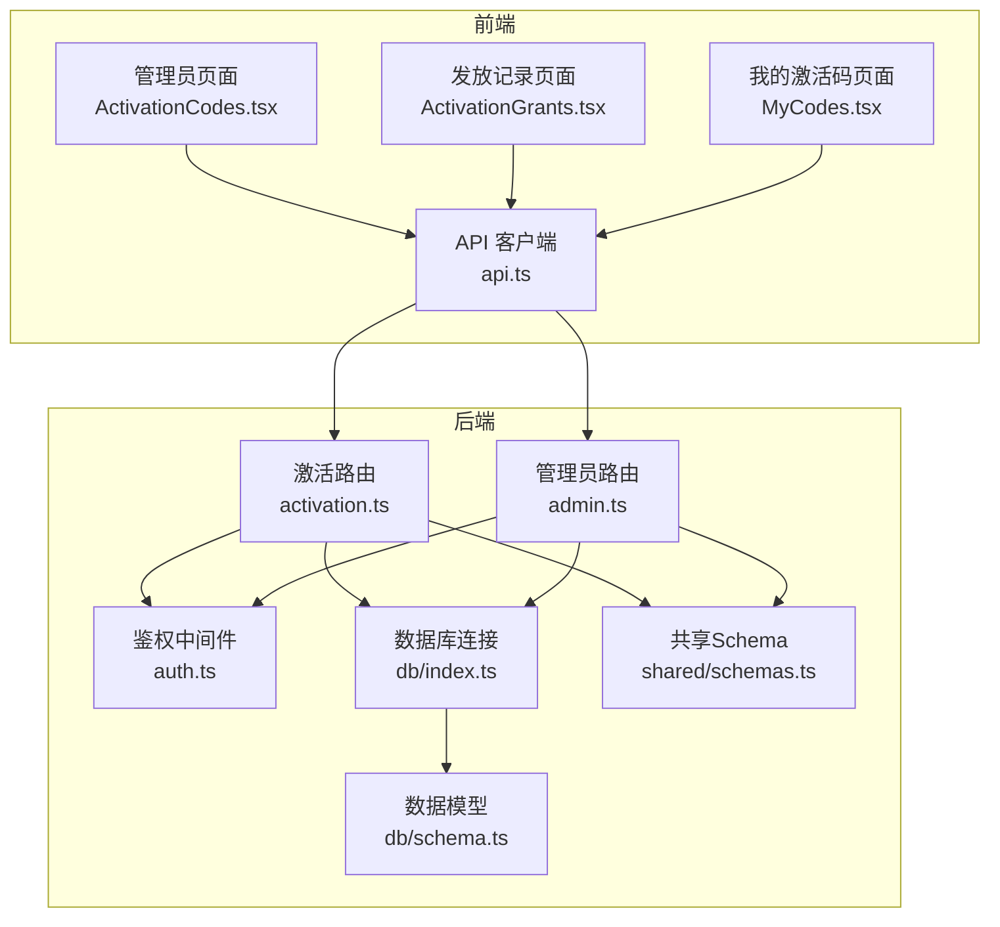
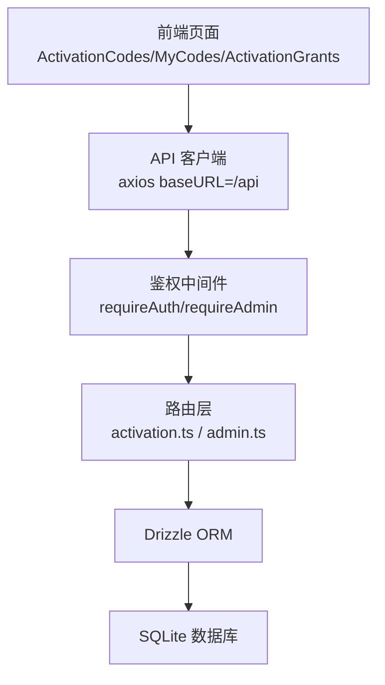
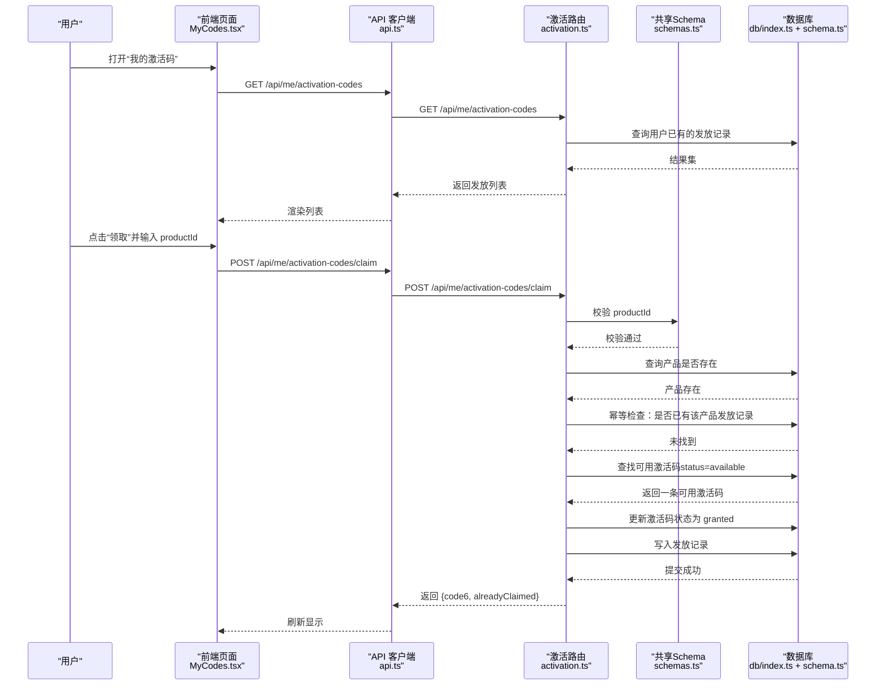
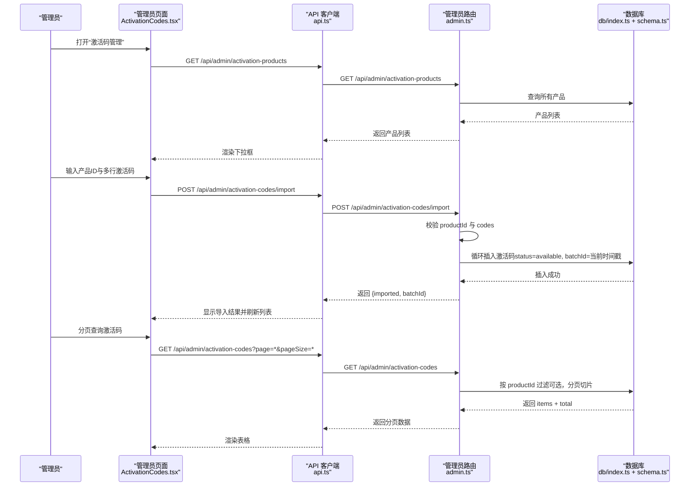
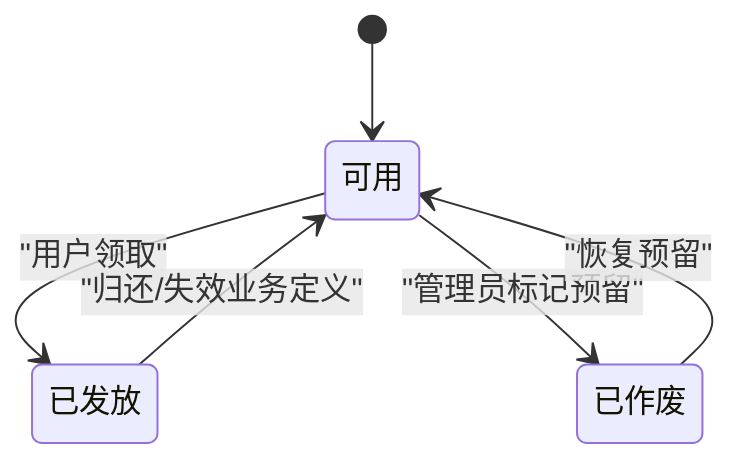
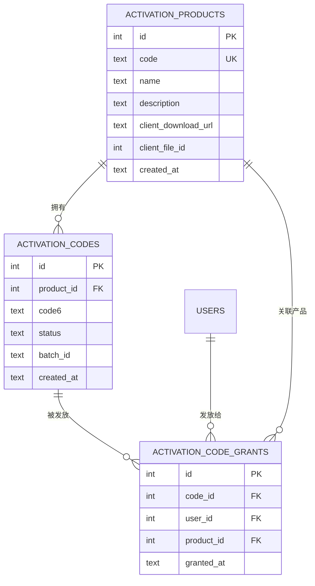
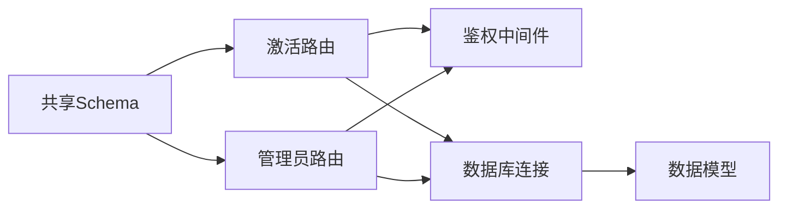

# 激活码管理

<cite>
**本文引用的文件**
- [apps/server/src/routes/activation.ts](file://apps/server/src/routes/activation.ts)
- [apps/server/src/routes/admin.ts](file://apps/server/src/routes/admin.ts)
- [apps/server/src/db/schema.ts](file://apps/server/src/db/schema.ts)
- [apps/server/src/db/index.ts](file://apps/server/src/db/index.ts)
- [apps/server/src/middleware/auth.ts](file://apps/server/src/middleware/auth.ts)
- [packages/shared/src/schemas.ts](file://packages/shared/src/schemas.ts)
- [apps/web/src/pages/admin/ActivationCodes.tsx](file://apps/web/src/pages/admin/ActivationCodes.tsx)
- [apps/web/src/pages/admin/ActivationGrants.tsx](file://apps/web/src/pages/admin/ActivationGrants.tsx)
- [apps/web/src/pages/MyCodes.tsx](file://apps/web/src/pages/MyCodes.tsx)
- [apps/web/src/lib/api.ts](file://apps/web/src/lib/api.ts)
- [apps/server/drizzle/0000_absurd_liz_osborn.sql](file://apps/server/drizzle/0000_absurd_liz_osborn.sql)
</cite>

## 目录
1. [简介](#简介)
2. [项目结构](#项目结构)
3. [核心组件](#核心组件)
4. [架构总览](#架构总览)
5. [详细组件分析](#详细组件分析)
6. [依赖关系分析](#依赖关系分析)
7. [性能考量](#性能考量)
8. [故障排查指南](#故障排查指南)
9. [结论](#结论)
10. [附录](#附录)

## 简介
本文件面向激活码管理功能，提供从后端API到前端页面的完整说明。内容涵盖激活码的生成、分配与状态管理，激活码生命周期（available、granted、revoked），查询接口（按产品ID、分页、排序），批量导入与查询，以及激活码与用户授权的关系映射。同时给出状态流转图、序列图与类图，帮助开发者与运维人员快速理解与使用。

## 项目结构
激活码相关能力由以下模块协同完成：
- 后端路由：用户自助领取、管理员批量导入与查询、发放审计
- 数据模型：激活产品、激活码、发放记录三张表及外键关系
- 验证与中间件：请求参数校验、鉴权与会话加载
- 前端页面：管理员激活码列表与导入、发放记录、用户我的激活码

图表来源
- [apps/web/src/pages/admin/ActivationCodes.tsx:1-74](file://apps/web/src/pages/admin/ActivationCodes.tsx#L1-L74)
- [apps/web/src/pages/admin/ActivationGrants.tsx:1-27](file://apps/web/src/pages/admin/ActivationGrants.tsx#L1-L27)
- [apps/web/src/pages/MyCodes.tsx:1-49](file://apps/web/src/pages/MyCodes.tsx#L1-L49)
- [apps/web/src/lib/api.ts:1-16](file://apps/web/src/lib/api.ts#L1-L16)
- [apps/server/src/routes/activation.ts:1-95](file://apps/server/src/routes/activation.ts#L1-L95)
- [apps/server/src/routes/admin.ts:1-279](file://apps/server/src/routes/admin.ts#L1-L279)
- [apps/server/src/middleware/auth.ts:1-56](file://apps/server/src/middleware/auth.ts#L1-L56)
- [apps/server/src/db/index.ts:1-16](file://apps/server/src/db/index.ts#L1-L16)
- [apps/server/src/db/schema.ts:1-330](file://apps/server/src/db/schema.ts#L1-L330)
- [packages/shared/src/schemas.ts:1-51](file://packages/shared/src/schemas.ts#L1-L51)

章节来源
- [apps/server/src/routes/activation.ts:1-95](file://apps/server/src/routes/activation.ts#L1-L95)
- [apps/server/src/routes/admin.ts:160-197](file://apps/server/src/routes/admin.ts#L160-L197)
- [apps/server/src/db/schema.ts:71-96](file://apps/server/src/db/schema.ts#L71-L96)
- [apps/web/src/pages/admin/ActivationCodes.tsx:18-24](file://apps/web/src/pages/admin/ActivationCodes.tsx#L18-L24)

## 核心组件
- 激活产品（activation_products）
  - 唯一标识：code
  - 字段：id、code、name、description、clientDownloadUrl、clientFileId、createdAt
- 激活码（activation_codes）
  - 状态枚举：available、granted、revoked
  - 字段：id、productId、code6、status、batchId、createdAt
  - 外键：productId → activation_products(id)
- 发放记录（activation_code_grants）
  - 字段：id、codeId、userId、productId、grantedAt
  - 外键：codeId → activation_codes(id)、userId → users(id)、productId → activation_products(id)

章节来源
- [apps/server/src/db/schema.ts:71-96](file://apps/server/src/db/schema.ts#L71-L96)
- [apps/server/drizzle/0000_absurd_liz_osborn.sql:12-31](file://apps/server/drizzle/0000_absurd_liz_osborn.sql#L12-L31)

## 架构总览
激活码管理采用“前后端分离 + 轻量ORM”的架构：
- 前端通过 axios 客户端调用 /api 下的后端接口
- 后端使用 Drizzle ORM 访问 SQLite 数据库
- 鉴权中间件负责会话校验与权限控制
- 共享 Schema 用于前后端统一的数据校验

图表来源
- [apps/web/src/lib/api.ts:1-16](file://apps/web/src/lib/api.ts#L1-L16)
- [apps/server/src/middleware/auth.ts:42-55](file://apps/server/src/middleware/auth.ts#L42-L55)
- [apps/server/src/routes/activation.ts:7-95](file://apps/server/src/routes/activation.ts#L7-L95)
- [apps/server/src/routes/admin.ts:16-16](file://apps/server/src/routes/admin.ts#L16-L16)
- [apps/server/src/db/index.ts:14-15](file://apps/server/src/db/index.ts#L14-L15)

## 详细组件分析

### 用户自助领取激活码流程
用户在个人中心提交产品ID，后端执行幂等领取逻辑：若已有该产品的发放记录则直接返回；否则从同产品的可用激活码中取第一个并更新状态为已发放，同时写入发放记录。

图表来源
- [apps/web/src/pages/MyCodes.tsx:16-24](file://apps/web/src/pages/MyCodes.tsx#L16-L24)
- [apps/web/src/lib/api.ts:1-16](file://apps/web/src/lib/api.ts#L1-L16)
- [apps/server/src/routes/activation.ts:8-75](file://apps/server/src/routes/activation.ts#L8-L75)
- [packages/shared/src/schemas.ts:48-50](file://packages/shared/src/schemas.ts#L48-L50)
- [apps/server/src/db/index.ts:14-15](file://apps/server/src/db/index.ts#L14-L15)
- [apps/server/src/db/schema.ts:81-96](file://apps/server/src/db/schema.ts#L81-L96)

章节来源
- [apps/server/src/routes/activation.ts:8-75](file://apps/server/src/routes/activation.ts#L8-L75)
- [packages/shared/src/schemas.ts:48-50](file://packages/shared/src/schemas.ts#L48-L50)

### 管理员批量导入与查询
管理员可批量导入6位激活码，并按产品维度进行分页查询。导入时会为每条记录生成 batchId，便于后续追踪。

图表来源
- [apps/web/src/pages/admin/ActivationCodes.tsx:18-24](file://apps/web/src/pages/admin/ActivationCodes.tsx#L18-L24)
- [apps/web/src/pages/admin/ActivationCodes.tsx:31-43](file://apps/web/src/pages/admin/ActivationCodes.tsx#L31-L43)
- [apps/web/src/lib/api.ts:1-16](file://apps/web/src/lib/api.ts#L1-L16)
- [apps/server/src/routes/admin.ts:160-197](file://apps/server/src/routes/admin.ts#L160-L197)
- [apps/server/src/db/index.ts:14-15](file://apps/server/src/db/index.ts#L14-L15)
- [apps/server/src/db/schema.ts:81-88](file://apps/server/src/db/schema.ts#L81-L88)

章节来源
- [apps/web/src/pages/admin/ActivationCodes.tsx:18-24](file://apps/web/src/pages/admin/ActivationCodes.tsx#L18-L24)
- [apps/web/src/pages/admin/ActivationCodes.tsx:31-43](file://apps/web/src/pages/admin/ActivationCodes.tsx#L31-L43)
- [apps/server/src/routes/admin.ts:160-197](file://apps/server/src/routes/admin.ts#L160-L197)

### 激活码状态机与生命周期
激活码状态包括 available、granted、revoked。当前代码库未提供“撤销”接口，但状态字段已预留，可扩展为管理员操作或业务规则触发。

图表来源
- [apps/server/src/db/schema.ts:85](file://apps/server/src/db/schema.ts#L85)
- [apps/server/src/routes/activation.ts:60-69](file://apps/server/src/routes/activation.ts#L60-L69)

章节来源
- [apps/server/src/db/schema.ts:81-88](file://apps/server/src/db/schema.ts#L81-L88)
- [apps/server/src/routes/activation.ts:60-69](file://apps/server/src/routes/activation.ts#L60-L69)

### 数据模型与关系
激活码管理涉及三张核心表，彼此通过外键关联，形成清晰的“产品-激活码-发放记录”关系链。

图表来源
- [apps/server/src/db/schema.ts:71-96](file://apps/server/src/db/schema.ts#L71-L96)
- [apps/server/drizzle/0000_absurd_liz_osborn.sql:12-31](file://apps/server/drizzle/0000_absurd_liz_osborn.sql#L12-L31)

章节来源
- [apps/server/src/db/schema.ts:71-96](file://apps/server/src/db/schema.ts#L71-L96)
- [apps/server/drizzle/0000_absurd_liz_osborn.sql:12-31](file://apps/server/drizzle/0000_absurd_liz_osborn.sql#L12-L31)

### 查询接口与分页、排序
- 用户自助查询
  - GET /api/me/activation-codes：返回当前用户的发放记录（含产品名、激活码、发放时间）
- 管理员查询
  - GET /api/admin/activation-codes：支持 productId 过滤、分页（page、pageSize，默认20，最大100）、按创建时间倒序
  - GET /api/admin/activation-grants：返回发放审计明细（用户、产品、激活码、发放时间）

章节来源
- [apps/server/src/routes/activation.ts:78-93](file://apps/server/src/routes/activation.ts#L78-L93)
- [apps/server/src/routes/admin.ts:160-176](file://apps/server/src/routes/admin.ts#L160-L176)
- [apps/server/src/routes/admin.ts:199-219](file://apps/server/src/routes/admin.ts#L199-L219)

### 批量操作
- 批量导入
  - POST /api/admin/activation-codes/import：接收 productId 与 codes 数组，逐条插入，状态默认 available，生成 batchId
- 批量生成
  - 当前未提供后端批量生成接口；可在前端对6位激活码进行格式校验后批量导入

章节来源
- [apps/server/src/routes/admin.ts:178-197](file://apps/server/src/routes/admin.ts#L178-L197)
- [apps/web/src/pages/admin/ActivationCodes.tsx:31-43](file://apps/web/src/pages/admin/ActivationCodes.tsx#L31-L43)

### 唯一性约束与格式验证
- 唯一性
  - 激活产品 code 唯一（数据库索引）
  - 用户名唯一（用户表）
- 激活码格式
  - 导入时仅接受6位字符（长度校验）
  - 未见后端对激活码格式的额外正则限制
- 参数校验
  - 用户领取：productId 必填且为正整数
  - 管理员导入：productId 与 codes 必填，codes 为非空数组

章节来源
- [apps/server/drizzle/0000_absurd_liz_osborn.sql:33](file://apps/server/drizzle/0000_absurd_liz_osborn.sql#L33)
- [apps/server/src/routes/admin.ts:178-197](file://apps/server/src/routes/admin.ts#L178-L197)
- [packages/shared/src/schemas.ts:48-50](file://packages/shared/src/schemas.ts#L48-L50)

### 与用户授权的关系映射
- 用户自助领取：根据 sessionUser 的 userId 关联发放记录
- 管理员审计：通过 LEFT JOIN 获取用户名、产品名、激活码与发放时间
- 权限控制：用户端接口需登录；管理员端接口需管理员角色

章节来源
- [apps/server/src/routes/activation.ts:14](file://apps/server/src/routes/activation.ts#L14)
- [apps/server/src/routes/admin.ts:199-219](file://apps/server/src/routes/admin.ts#L199-L219)
- [apps/server/src/middleware/auth.ts:42-55](file://apps/server/src/middleware/auth.ts#L42-L55)

## 依赖关系分析
- 组件耦合
  - 路由层依赖中间件与数据库层
  - 数据模型定义了严格的外键关系，保证数据一致性
- 外部依赖
  - Drizzle ORM + better-sqlite3
  - Zod 用于请求体校验
  - Axios 用于前端请求封装

图表来源
- [packages/shared/src/schemas.ts:1-51](file://packages/shared/src/schemas.ts#L1-L51)
- [apps/server/src/routes/activation.ts:1-6](file://apps/server/src/routes/activation.ts#L1-L6)
- [apps/server/src/routes/admin.ts:1-13](file://apps/server/src/routes/admin.ts#L1-L13)
- [apps/server/src/middleware/auth.ts:1-56](file://apps/server/src/middleware/auth.ts#L1-L56)
- [apps/server/src/db/index.ts:1-16](file://apps/server/src/db/index.ts#L1-L16)
- [apps/server/src/db/schema.ts:1-330](file://apps/server/src/db/schema.ts#L1-L330)

章节来源
- [apps/server/src/routes/activation.ts:1-6](file://apps/server/src/routes/activation.ts#L1-L6)
- [apps/server/src/routes/admin.ts:1-13](file://apps/server/src/routes/admin.ts#L1-L13)
- [apps/server/src/db/schema.ts:1-330](file://apps/server/src/db/schema.ts#L1-L330)

## 性能考量
- 分页与排序
  - 管理端查询支持分页与按创建时间倒序，避免一次性返回大量数据
  - 建议在激活码表上增加基于 productId 与 status 的复合索引以优化过滤查询
- 幂等领取
  - 领取前先查重，避免重复发放与并发竞争
- 批量导入
  - 使用循环插入，建议在高并发场景下考虑事务包裹与批量插入优化

## 故障排查指南
- 400 错误
  - 请求体不合法：检查 productId 是否为正整数，导入时 codes 是否为空数组
- 401 未认证
  - 用户端接口需登录；确认 Cookie 中 sid 是否有效
- 403 权限不足
  - 管理员接口需管理员角色
- 404 产品不存在
  - 领取时若产品不存在，返回错误提示
- 409 激活码不可用
  - 无可用激活码时返回提示，建议引导管理员补充导入

章节来源
- [apps/server/src/routes/activation.ts:18-19](file://apps/server/src/routes/activation.ts#L18-L19)
- [apps/server/src/routes/activation.ts:55-57](file://apps/server/src/routes/activation.ts#L55-L57)
- [apps/server/src/middleware/auth.ts:42-55](file://apps/server/src/middleware/auth.ts#L42-L55)
- [apps/server/src/routes/admin.ts:178-182](file://apps/server/src/routes/admin.ts#L178-L182)

## 结论
激活码管理功能围绕“产品-激活码-发放记录”三元关系构建，具备完善的鉴权与审计能力。当前实现支持用户自助领取、管理员批量导入与查询、发放审计，状态机预留了撤销能力。建议后续完善撤销接口、批量生成接口与索引优化，以满足更大规模的业务需求。

## 附录

### 接口清单与说明
- 用户自助领取
  - POST /api/me/activation-codes/claim
  - 请求体：productId（正整数）
  - 返回：{ code6, alreadyClaimed }
- 用户查询自己的激活码
  - GET /api/me/activation-codes
  - 返回：[{ id, code6, productName, productCode, grantedAt }]
- 管理员查询激活码
  - GET /api/admin/activation-codes?productId=&page=&pageSize=
  - 支持 productId 过滤、分页（默认20，最大100）、按创建时间倒序
  - 返回：{ items[], total, page, pageSize }
- 管理员批量导入
  - POST /api/admin/activation-codes/import
  - 请求体：{ productId, codes[]（每项6位字符串）}
  - 返回：{ imported, batchId }
- 管理员查询发放记录
  - GET /api/admin/activation-grants
  - 返回：[{ id, codeId, userId, productId, grantedAt, code6, username, productName }]

章节来源
- [apps/server/src/routes/activation.ts:8-93](file://apps/server/src/routes/activation.ts#L8-L93)
- [apps/server/src/routes/admin.ts:160-197](file://apps/server/src/routes/admin.ts#L160-L197)