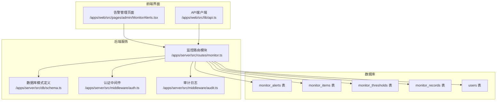
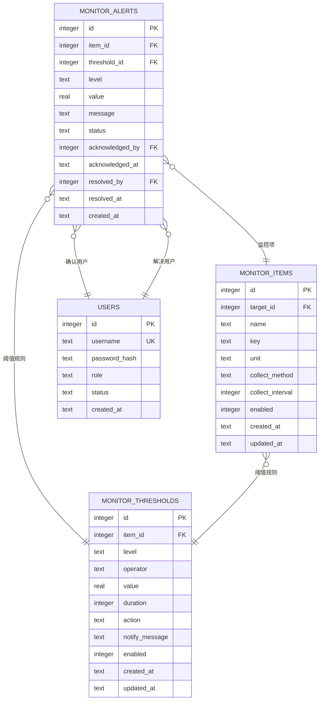
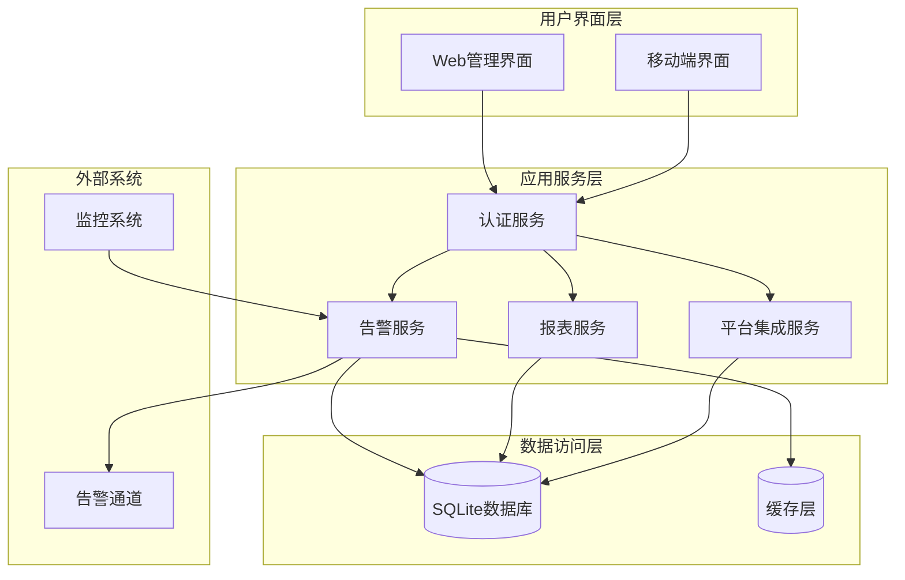
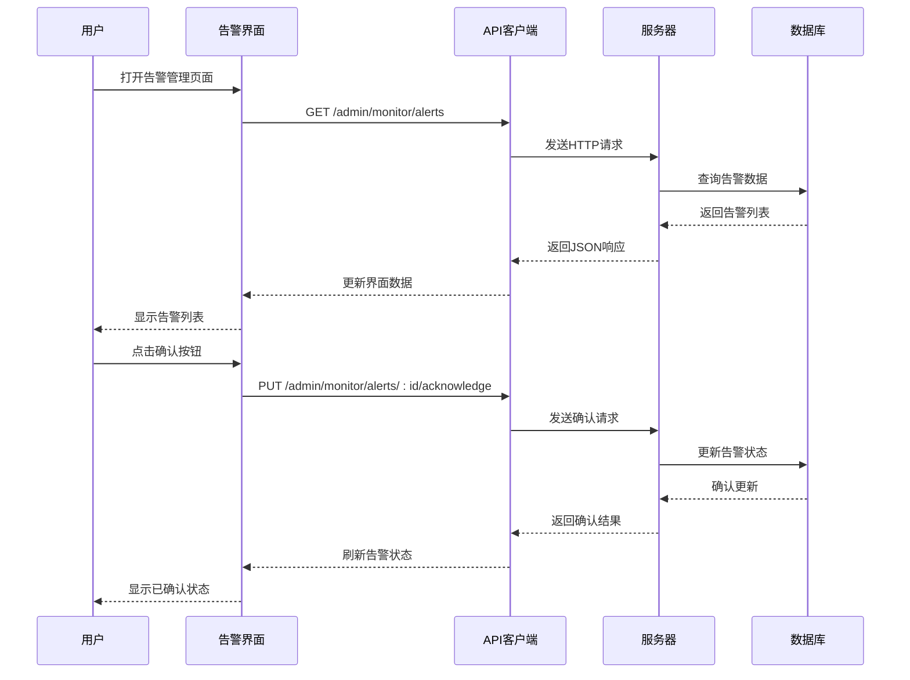
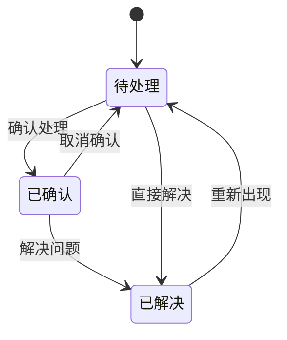
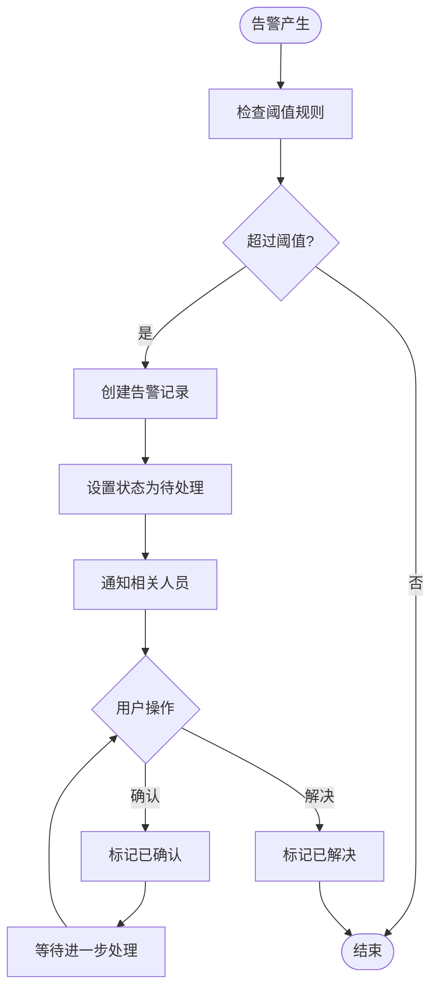
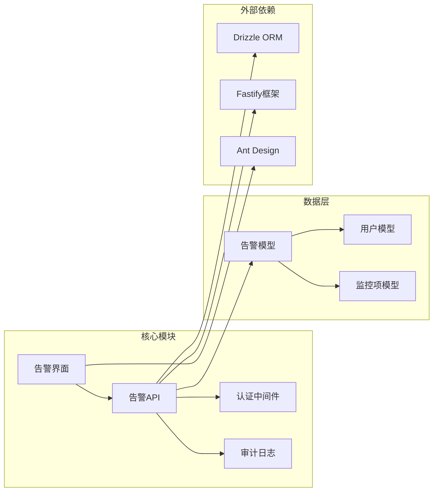
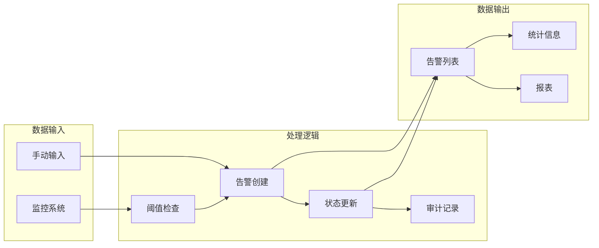
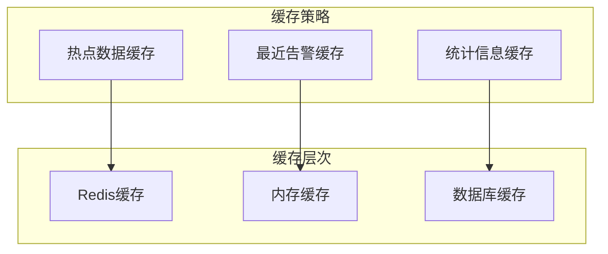
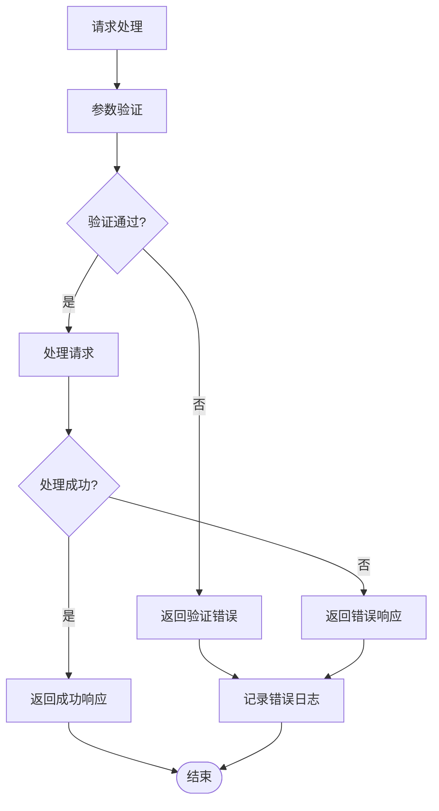

# 告警管理

<cite>
**本文档引用的文件**
- [monitor.ts](file://apps/server/src/routes/monitor.ts)
- [schema.ts](file://apps/server/src/db/schema.ts)
- [MonitorAlerts.tsx](file://apps/web/src/pages/admin/MonitorAlerts.tsx)
- [api.ts](file://apps/web/src/lib/api.ts)
- [auth.ts](file://apps/server/src/middleware/auth.ts)
- [audit.ts](file://apps/server/src/middleware/audit.ts)
- [0002_snapshot.json](file://apps/server/drizzle/meta/0002_snapshot.json)
- [seed-demo.ts](file://apps/server/src/db/seed-demo.ts)
</cite>

## 目录
1. [简介](#简介)
2. [项目结构](#项目结构)
3. [核心组件](#核心组件)
4. [架构概览](#架构概览)
5. [详细组件分析](#详细组件分析)
6. [依赖关系分析](#依赖关系分析)
7. [性能考虑](#性能考虑)
8. [故障排除指南](#故障排除指南)
9. [结论](#结论)

## 简介

ZBH2平台的告警管理系统是一个完整的运维监控解决方案，提供了从监控指标采集到告警处理的全生命周期管理。该系统支持多种监控指标类型、灵活的告警级别分类、完善的告警状态管理和丰富的统计分析功能。

系统采用前后端分离架构，后端基于Fastify框架和Drizzle ORM，前端使用React和Ant Design构建用户界面。告警管理功能包括实时监控、告警确认、问题解决、状态跟踪和统计分析等核心能力。

## 项目结构

告警管理功能主要分布在以下模块中：



**图表来源**
- [monitor.ts:1-595](file://apps/server/src/routes/monitor.ts#L1-L595)
- [schema.ts:264-277](file://apps/server/src/db/schema.ts#L264-L277)

**章节来源**
- [monitor.ts:13-595](file://apps/server/src/routes/monitor.ts#L13-L595)
- [schema.ts:216-330](file://apps/server/src/db/schema.ts#L216-L330)

## 核心组件

### 数据模型设计

告警管理系统的核心数据模型围绕监控指标和告警事件构建：



**图表来源**
- [schema.ts:264-277](file://apps/server/src/db/schema.ts#L264-L277)
- [schema.ts:230-241](file://apps/server/src/db/schema.ts#L230-L241)
- [schema.ts:243-254](file://apps/server/src/db/schema.ts#L243-L254)
- [schema.ts:3-10](file://apps/server/src/db/schema.ts#L3-L10)

### 告警级别分类

系统支持两种告警级别：
- **警告 (warning)**：需要关注但不影响业务正常运行的问题
- **严重 (critical)**：影响业务正常运行的关键问题

### 告警状态管理

告警状态采用三状态流转模型：
- **待处理 (pending)**：新产生的告警，等待处理
- **已确认 (acknowledged)**：告警已被相关人员确认，正在处理中
- **已解决 (resolved)**：问题已解决或不再需要处理

**章节来源**
- [schema.ts:264-277](file://apps/server/src/db/schema.ts#L264-L277)
- [monitor.ts:243-288](file://apps/server/src/routes/monitor.ts#L243-L288)

## 架构概览

告警管理系统的整体架构采用分层设计：



**图表来源**
- [monitor.ts:13-595](file://apps/server/src/routes/monitor.ts#L13-L595)
- [auth.ts:48-55](file://apps/server/src/middleware/auth.ts#L48-L55)

## 详细组件分析

### 告警查询接口

告警查询接口支持多维度筛选和分页查询：

#### 接口定义

| 属性 | 值 |
|------|-----|
| 方法 | GET |
| 路径 | `/api/admin/monitor/alerts` |
| 认证 | 需要管理员权限 |
| 分页 | 支持 |

#### 查询参数

| 参数名 | 类型 | 必填 | 默认值 | 描述 |
|--------|------|------|--------|------|
| page | number | 否 | 1 | 页码 |
| pageSize | number | 否 | 20 | 每页数量 |
| status | string | 否 | 无 | 告警状态过滤 |
| level | string | 否 | 无 | 告警级别过滤 |

#### 响应格式

```json
{
  "success": true,
  "data": {
    "items": [
      {
        "id": 1,
        "itemId": 1,
        "level": "warning",
        "value": 85.3,
        "message": "CPU使用率过高",
        "status": "pending",
        "acknowledgedBy": null,
        "acknowledgedAt": null,
        "resolvedBy": null,
        "resolvedAt": null,
        "createdAt": "2024-01-01T00:00:00Z"
      }
    ],
    "total": 100,
    "page": 1,
    "pageSize": 20
  }
}
```

**章节来源**
- [monitor.ts:243-262](file://apps/server/src/routes/monitor.ts#L243-L262)

### 告警确认接口

告警确认接口用于标记告警已被处理人员接收：

#### 接口定义

| 属性 | 值 |
|------|-----|
| 方法 | PUT |
| 路径 | `/api/admin/monitor/alerts/:id/acknowledge` |
| 认证 | 需要管理员权限 |

#### 请求路径参数

| 参数名 | 类型 | 必填 | 描述 |
|--------|------|------|------|
| id | string | 是 | 告警记录ID |

#### 成功响应

```json
{
  "success": true
}
```

#### 失败响应

```json
{
  "success": false,
  "error": "告警不存在"
}
```

**章节来源**
- [monitor.ts:264-275](file://apps/server/src/routes/monitor.ts#L264-L275)

### 告警解决接口

告警解决接口用于标记问题已得到解决：

#### 接口定义

| 属性 | 值 |
|------|-----|
| 方法 | PUT |
| 路径 | `/api/admin/monitor/alerts/:id/resolve` |
| 认证 | 需要管理员权限 |

#### 请求路径参数

| 参数名 | 类型 | 必填 | 描述 |
|--------|------|------|------|
| id | string | 是 | 告警记录ID |

#### 成功响应

```json
{
  "success": true
}
```

#### 失败响应

```json
{
  "success": false,
  "error": "告警不存在"
}
```

**章节来源**
- [monitor.ts:277-288](file://apps/server/src/routes/monitor.ts#L277-L288)

### 前端交互流程



**图表来源**
- [MonitorAlerts.tsx:22-47](file://apps/web/src/pages/admin/MonitorAlerts.tsx#L22-L47)
- [api.ts:1-16](file://apps/web/src/lib/api.ts#L1-L16)

**章节来源**
- [MonitorAlerts.tsx:13-91](file://apps/web/src/pages/admin/MonitorAlerts.tsx#L13-L91)

### 告警状态流转图



**图表来源**
- [schema.ts:271](file://apps/server/src/db/schema.ts#L271)

### 告警处理流程



**图表来源**
- [monitor.ts:243-288](file://apps/server/src/routes/monitor.ts#L243-L288)

**章节来源**
- [monitor.ts:243-288](file://apps/server/src/routes/monitor.ts#L243-L288)

## 依赖关系分析

### 组件耦合度

告警管理系统采用松耦合设计，各组件间通过清晰的接口进行通信：



**图表来源**
- [monitor.ts:1-595](file://apps/server/src/routes/monitor.ts#L1-L595)
- [auth.ts:1-56](file://apps/server/src/middleware/auth.ts#L1-L56)

### 数据流分析



**图表来源**
- [monitor.ts:243-319](file://apps/server/src/routes/monitor.ts#L243-L319)

**章节来源**
- [monitor.ts:1-595](file://apps/server/src/routes/monitor.ts#L1-L595)

## 性能考虑

### 查询优化

系统在告警查询方面采用了多项优化措施：

1. **索引策略**：对常用查询字段建立索引
2. **分页机制**：限制每页查询数量，避免大数据量查询
3. **条件过滤**：支持多条件组合查询，减少不必要的数据传输

### 缓存策略



### 响应时间优化

系统通过以下方式优化响应时间：

- **异步处理**：告警创建采用异步方式，避免阻塞主流程
- **批量操作**：支持批量确认和解决操作
- **数据预加载**：前端界面预加载必要的配置数据

## 故障排除指南

### 常见问题诊断

#### 告警无法显示

**可能原因**：
1. 用户权限不足
2. 查询条件过于严格
3. 数据库连接异常

**解决方案**：
1. 检查用户角色是否为管理员
2. 清除查询过滤器
3. 验证数据库连接状态

#### 告警状态更新失败

**可能原因**：
1. 告警ID不存在
2. 用户权限不足
3. 网络连接异常

**解决方案**：
1. 验证告警ID的有效性
2. 检查管理员权限
3. 重试网络请求

### 错误处理机制

系统实现了完善的错误处理机制：



**图表来源**
- [monitor.ts:264-288](file://apps/server/src/routes/monitor.ts#L264-L288)

**章节来源**
- [monitor.ts:264-288](file://apps/server/src/routes/monitor.ts#L264-L288)

## 结论

ZBH2平台的告警管理系统提供了完整的监控告警解决方案，具有以下特点：

### 核心优势

1. **完整的生命周期管理**：从告警产生到解决的全流程覆盖
2. **灵活的状态管理**：支持多种告警状态和复杂的流转逻辑
3. **强大的查询能力**：支持多维度筛选和分页查询
4. **完善的审计功能**：所有操作都有详细的审计记录
5. **友好的用户界面**：直观的操作界面和丰富的统计信息

### 技术特色

- **现代化架构**：采用前后端分离和微服务设计理念
- **高性能设计**：优化的数据库查询和缓存策略
- **可扩展性**：模块化的架构便于功能扩展
- **安全性**：完善的认证授权和审计机制

### 应用价值

该系统能够有效提升运维效率，帮助管理员及时发现和处理系统问题，保障业务系统的稳定运行。通过完善的统计分析功能，管理员可以深入了解系统运行状况，制定更有效的运维策略。