# 监控API

<cite>
**本文引用的文件**
- [apps/server/src/routes/monitor.ts](file://apps/server/src/routes/monitor.ts)
- [apps/server/src/db/schema.ts](file://apps/server/src/db/schema.ts)
- [apps/server/src/db/index.ts](file://apps/server/src/db/index.ts)
- [apps/server/src/middleware/audit.ts](file://apps/server/src/middleware/audit.ts)
- [apps/web/src/pages/admin/MonitorTargets.tsx](file://apps/web/src/pages/admin/MonitorTargets.tsx)
- [apps/web/src/pages/admin/MonitorItems.tsx](file://apps/web/src/pages/admin/MonitorItems.tsx)
- [apps/web/src/pages/admin/MonitorAlerts.tsx](file://apps/web/src/pages/admin/MonitorAlerts.tsx)
- [apps/web/src/pages/admin/MonitorReports.tsx](file://apps/web/src/pages/admin/MonitorReports.tsx)
- [apps/web/src/pages/admin/MonitorDashboard.tsx](file://apps/web/src/pages/admin/MonitorDashboard.tsx)
- [apps/web/src/lib/api.ts](file://apps/web/src/lib/api.ts)
- [apps/server/drizzle/meta/0002_snapshot.json](file://apps/server/drizzle/meta/0002_snapshot.json)
- [apps/server/src/db/seed-demo.ts](file://apps/server/src/db/seed-demo.ts)
</cite>

## 目录
1. [简介](#简介)
2. [项目结构](#项目结构)
3. [核心组件](#核心组件)
4. [架构总览](#架构总览)
5. [详细组件分析](#详细组件分析)
6. [依赖关系分析](#依赖关系分析)
7. [性能考量](#性能考量)
8. [故障排查指南](#故障排查指南)
9. [结论](#结论)
10. [附录](#附录)

## 简介
本文件为 ZBH2 平台监控API的权威技术文档，覆盖监控目标管理、监控指标管理、阈值与告警、监控数据记录、监控报表与模板、平台接入与审计等能力。文档同时给出接口定义、数据模型、调用流程、示例场景与最佳实践，帮助开发者与运维人员快速上手并稳定运行。

## 项目结构
监控API由服务端路由层、数据库Schema层、审计中间件以及前端管理界面组成。服务端采用 Fastify + Drizzle ORM + better-sqlite3，数据库采用SQLite并启用WAL模式与外键约束；前端使用 Ant Design + Axios，提供目标、指标、阈值、告警、报表、仪表盘等管理界面。

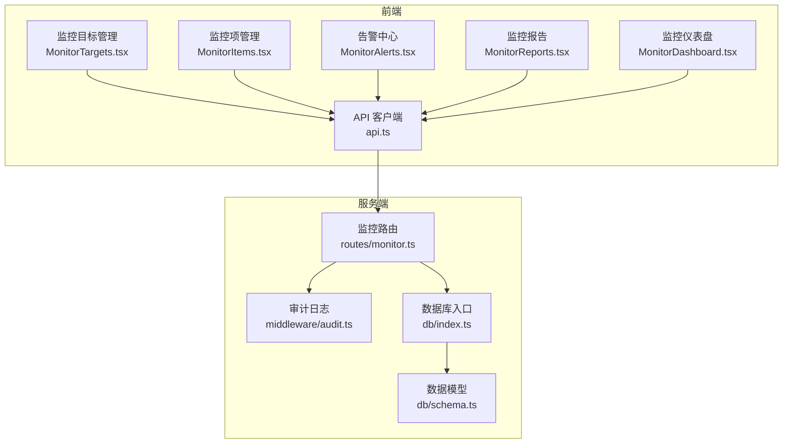

**图表来源**
- [apps/web/src/pages/admin/MonitorTargets.tsx:1-110](file://apps/web/src/pages/admin/MonitorTargets.tsx#L1-L110)
- [apps/web/src/pages/admin/MonitorItems.tsx:1-232](file://apps/web/src/pages/admin/MonitorItems.tsx#L1-L232)
- [apps/web/src/pages/admin/MonitorAlerts.tsx:1-91](file://apps/web/src/pages/admin/MonitorAlerts.tsx#L1-L91)
- [apps/web/src/pages/admin/MonitorReports.tsx:1-189](file://apps/web/src/pages/admin/MonitorReports.tsx#L1-L189)
- [apps/web/src/pages/admin/MonitorDashboard.tsx:1-47](file://apps/web/src/pages/admin/MonitorDashboard.tsx#L1-L47)
- [apps/web/src/lib/api.ts:1-16](file://apps/web/src/lib/api.ts#L1-L16)
- [apps/server/src/routes/monitor.ts:1-595](file://apps/server/src/routes/monitor.ts#L1-L595)
- [apps/server/src/db/index.ts:1-16](file://apps/server/src/db/index.ts#L1-L16)
- [apps/server/src/db/schema.ts:216-330](file://apps/server/src/db/schema.ts#L216-L330)
- [apps/server/src/middleware/audit.ts:1-28](file://apps/server/src/middleware/audit.ts#L1-L28)

**章节来源**
- [apps/server/src/routes/monitor.ts:1-595](file://apps/server/src/routes/monitor.ts#L1-L595)
- [apps/server/src/db/schema.ts:216-330](file://apps/server/src/db/schema.ts#L216-L330)
- [apps/server/src/db/index.ts:1-16](file://apps/server/src/db/index.ts#L1-L16)
- [apps/web/src/lib/api.ts:1-16](file://apps/web/src/lib/api.ts#L1-L16)

## 核心组件
- 监控目标管理：增删改查监控目标，支持分页与类型筛选，提供状态查询。
- 监控项管理：为监控目标定义具体指标项，支持采集方法、采集间隔、启用状态等配置。
- 阈值与告警：为指标项配置阈值规则，支持多级别、多比较运算符、持续时间、响应动作与通知模板；支持告警确认与解决。
- 监控数据记录：采集值与状态的存储，支持按时间范围过滤与分页。
- 报表与模板：按时间区间生成统计摘要，支持模板化配置与导出。
- 平台接入：支持 webhook、API、agent 等类型平台接入，提供连通性测试。
- 审计日志：对监控相关的关键操作进行审计记录。

**章节来源**
- [apps/server/src/routes/monitor.ts:17-595](file://apps/server/src/routes/monitor.ts#L17-L595)
- [apps/server/src/db/schema.ts:216-330](file://apps/server/src/db/schema.ts#L216-L330)

## 架构总览
监控API采用“路由层-ORM层-数据库层-审计中间件”的分层架构。路由层负责REST接口与参数校验；ORM层负责数据持久化；数据库层采用SQLite并启用WAL模式；审计中间件统一记录操作日志。

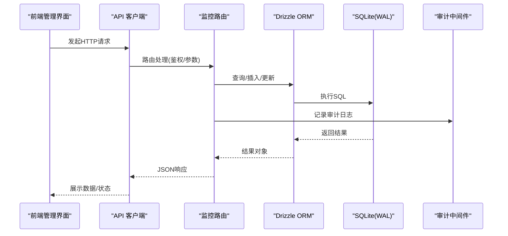

**图表来源**
- [apps/server/src/routes/monitor.ts:1-595](file://apps/server/src/routes/monitor.ts#L1-L595)
- [apps/server/src/db/index.ts:1-16](file://apps/server/src/db/index.ts#L1-L16)
- [apps/server/src/middleware/audit.ts:1-28](file://apps/server/src/middleware/audit.ts#L1-L28)
- [apps/web/src/lib/api.ts:1-16](file://apps/web/src/lib/api.ts#L1-L16)

## 详细组件分析

### 监控目标管理接口
- 接口概览
  - 获取目标列表：支持分页、每页大小限制、按类型筛选。
  - 新增目标：必填名称与类型，可选主机、端口、描述、状态、配置。
  - 更新目标：按ID更新，支持部分字段更新。
  - 删除目标：按ID删除。
  - 查询目标状态：返回目标ID、名称与当前状态。
- 关键字段
  - 类型枚举：device、system、database、service。
  - 状态枚举：online、offline、warning、critical。
- 示例场景
  - 添加目标：POST /api/admin/monitor/targets
  - 分页查询：GET /api/admin/monitor/targets?page=1&pageSize=20&type=server
  - 更新状态：PUT /api/admin/monitor/targets/:id
  - 查询状态：GET /api/admin/monitor/targets/:id/status

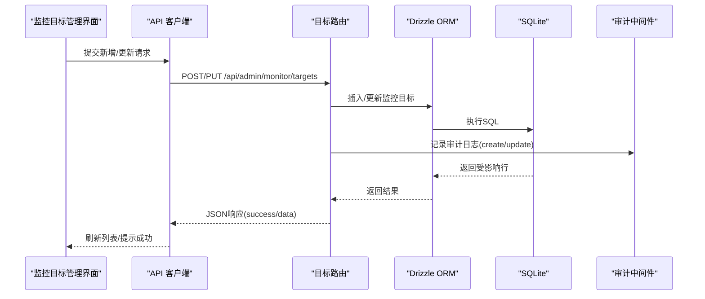

**图表来源**
- [apps/server/src/routes/monitor.ts:34-99](file://apps/server/src/routes/monitor.ts#L34-L99)
- [apps/server/src/middleware/audit.ts:1-28](file://apps/server/src/middleware/audit.ts#L1-L28)

**章节来源**
- [apps/server/src/routes/monitor.ts:17-106](file://apps/server/src/routes/monitor.ts#L17-L106)
- [apps/server/src/db/schema.ts:216-228](file://apps/server/src/db/schema.ts#L216-L228)

### 监控项管理接口
- 接口概览
  - 获取监控项列表：支持按目标ID筛选、分页。
  - 新增监控项：必填目标ID、名称、键名，可选单位、采集方法、采集间隔、启用状态。
  - 更新监控项：按ID更新，支持部分字段更新。
  - 删除监控项：按ID删除。
- 关键字段
  - 采集方法枚举：agent、snmp、http、icmp、script、wmi。
  - 采集间隔默认60秒，启用状态默认开启。
- 示例场景
  - 新增项：POST /api/admin/monitor/items
  - 按目标筛选：GET /api/admin/monitor/items?targetId=1&page=1&pageSize=20
  - 更新项：PUT /api/admin/monitor/items/:id

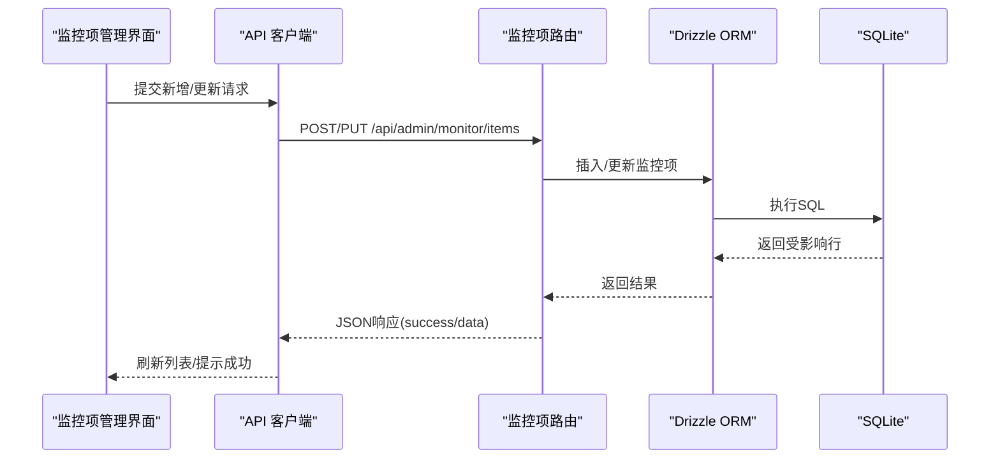

**图表来源**
- [apps/server/src/routes/monitor.ts:108-164](file://apps/server/src/routes/monitor.ts#L108-L164)

**章节来源**
- [apps/server/src/routes/monitor.ts:108-164](file://apps/server/src/routes/monitor.ts#L108-L164)
- [apps/server/src/db/schema.ts:230-241](file://apps/server/src/db/schema.ts#L230-L241)

### 阈值与告警接口
- 阈值规则
  - 获取阈值：按监控项ID查询。
  - 新增阈值：必填监控项ID、级别、比较运算符、阈值，可选持续时间、响应动作、通知消息、启用状态。
  - 更新阈值：按ID更新，支持部分字段更新。
  - 删除阈值：按ID删除。
  - 比较运算符：gt、lt、eq、gte、lte。
  - 级别：warning、critical。
- 告警管理
  - 获取告警：支持按状态、级别筛选，分页。
  - 确认告警：PUT /api/admin/monitor/alerts/:id/acknowledge。
  - 解决告警：PUT /api/admin/monitor/alerts/:id/resolve。
  - 状态：pending、acknowledged、resolved。
- 示例场景
  - 新增阈值：POST /api/admin/monitor/thresholds
  - 确认告警：PUT /api/admin/monitor/alerts/:id/acknowledge
  - 解决告警：PUT /api/admin/monitor/alerts/:id/resolve

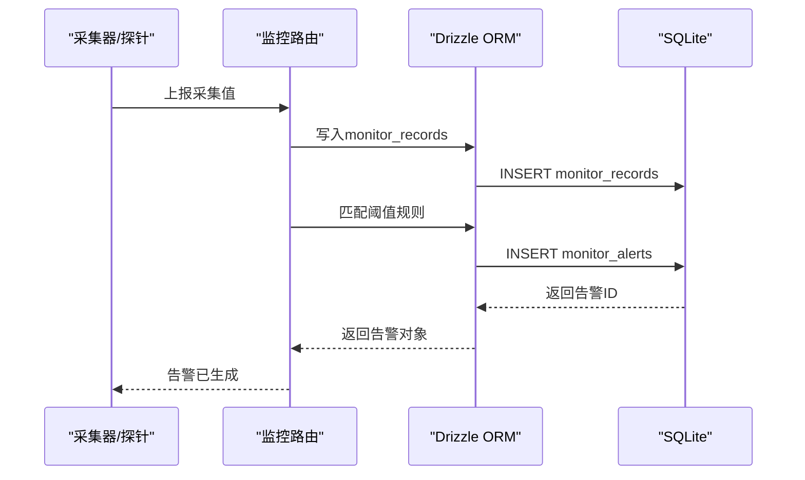

**图表来源**
- [apps/server/src/routes/monitor.ts:166-288](file://apps/server/src/routes/monitor.ts#L166-L288)
- [apps/server/src/db/schema.ts:243-277](file://apps/server/src/db/schema.ts#L243-L277)

**章节来源**
- [apps/server/src/routes/monitor.ts:166-288](file://apps/server/src/routes/monitor.ts#L166-L288)
- [apps/server/src/db/schema.ts:243-277](file://apps/server/src/db/schema.ts#L243-L277)

### 监控数据记录接口
- 接口概览
  - 获取记录：支持按监控项ID筛选、按起止时间过滤、分页。
  - 状态枚举：normal、warning、critical。
- 示例场景
  - 按项查询：GET /api/admin/monitor/records?itemId=1
  - 时间范围查询：GET /api/admin/monitor/records?startTime=...&endTime=...

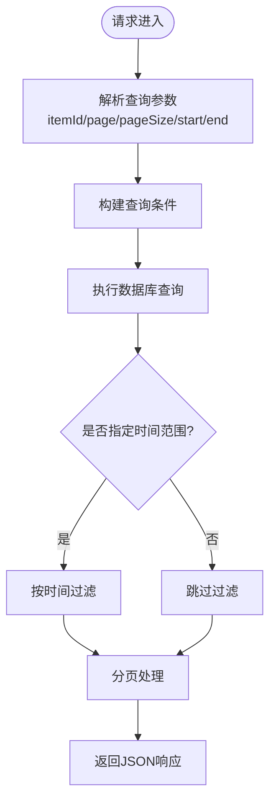

**图表来源**
- [apps/server/src/routes/monitor.ts:217-240](file://apps/server/src/routes/monitor.ts#L217-L240)

**章节来源**
- [apps/server/src/routes/monitor.ts:217-240](file://apps/server/src/routes/monitor.ts#L217-L240)
- [apps/server/src/db/schema.ts:256-262](file://apps/server/src/db/schema.ts#L256-L262)

### 监控报表与模板接口
- 报表生成
  - 必填：标题、类型、开始时间、结束时间。
  - 统计维度：按监控项聚合，计算最小值、最大值、平均值、告警示数。
  - 存储：生成摘要JSON并写入monitor_reports。
- 模板管理
  - 获取模板列表。
  - 新增/更新/删除模板。
- 示例场景
  - 生成报表：POST /api/admin/monitor/reports/generate
  - 查看报表：GET /api/admin/monitor/reports/:id
  - 管理模板：GET/POST/PUT/DELETE /api/admin/monitor/report-templates

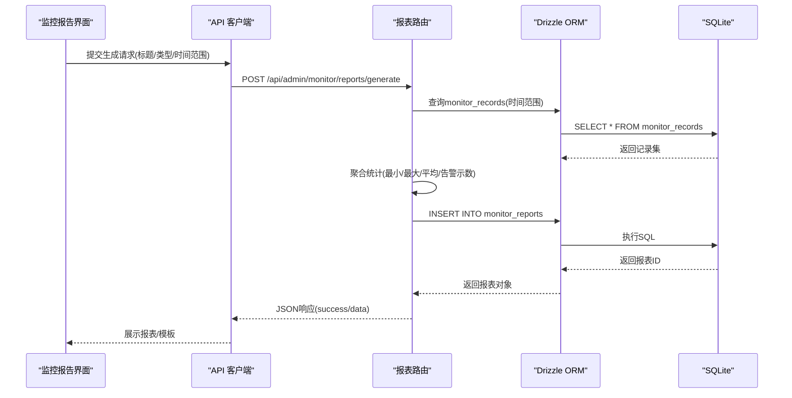

**图表来源**
- [apps/server/src/routes/monitor.ts:321-407](file://apps/server/src/routes/monitor.ts#L321-L407)
- [apps/server/src/db/schema.ts:279-299](file://apps/server/src/db/schema.ts#L279-L299)

**章节来源**
- [apps/server/src/routes/monitor.ts:321-407](file://apps/server/src/routes/monitor.ts#L321-L407)
- [apps/server/src/db/schema.ts:279-299](file://apps/server/src/db/schema.ts#L279-L299)

### 平台接入与连通性测试
- 支持类型：webhook、api、agent。
- 字段：名称、类型、端点、API Key、Secret、同步配置、状态、描述。
- 连通性测试：POST /api/admin/monitor/platforms/:id/test，模拟连接测试并临时更新状态为testing，随后恢复为active。
- 示例场景
  - 新增平台：POST /api/admin/monitor/platforms
  - 测试连通性：POST /api/admin/monitor/platforms/:id/test

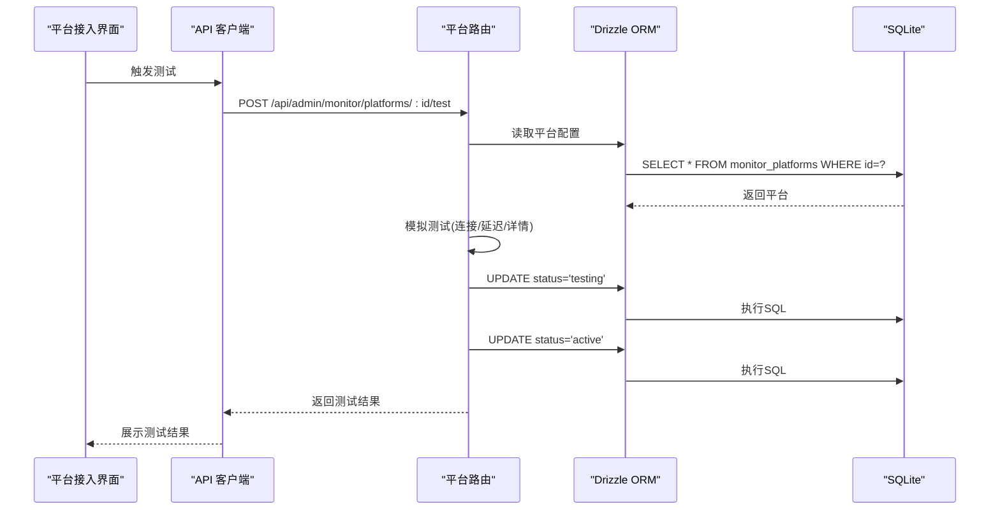

**图表来源**
- [apps/server/src/routes/monitor.ts:489-593](file://apps/server/src/routes/monitor.ts#L489-L593)
- [apps/server/src/db/schema.ts:316-329](file://apps/server/src/db/schema.ts#L316-L329)

**章节来源**
- [apps/server/src/routes/monitor.ts:489-593](file://apps/server/src/routes/monitor.ts#L489-L593)
- [apps/server/src/db/schema.ts:316-329](file://apps/server/src/db/schema.ts#L316-L329)

### 审计日志与仪表盘
- 审计日志
  - 获取日志：支持按用户、动作、目标类型、时间范围筛选，分页。
  - 统计：按动作与目标类型统计数量。
- 仪表盘
  - 获取监控总览：目标总数、按状态分布、告警按状态与级别分布、最近告警。
- 示例场景
  - 获取审计统计：GET /api/admin/monitor/audit-logs/stats
  - 获取仪表盘：GET /api/admin/monitor/dashboard

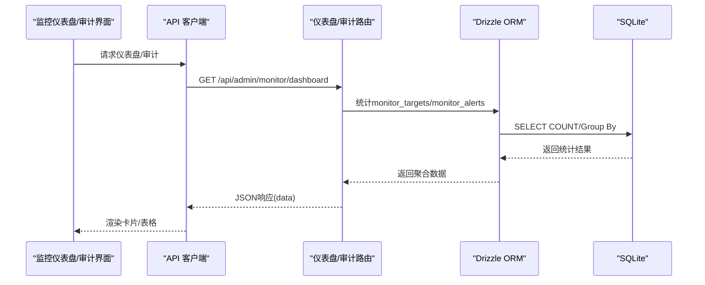

**图表来源**
- [apps/server/src/routes/monitor.ts:290-487](file://apps/server/src/routes/monitor.ts#L290-L487)
- [apps/server/src/middleware/audit.ts:1-28](file://apps/server/src/middleware/audit.ts#L1-L28)

**章节来源**
- [apps/server/src/routes/monitor.ts:290-487](file://apps/server/src/routes/monitor.ts#L290-L487)
- [apps/server/src/middleware/audit.ts:1-28](file://apps/server/src/middleware/audit.ts#L1-L28)

## 依赖关系分析
- 路由依赖Drizzle ORM与数据库Schema，统一通过db/index.ts初始化SQLite连接。
- 审计中间件logAudit贯穿关键写操作，确保可追溯。
- 前端通过api.ts封装基础URL与凭证，统一拦截错误。

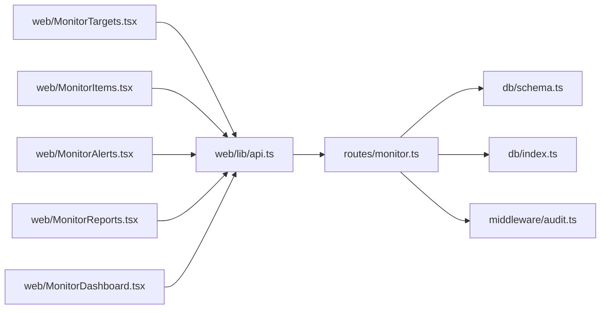

**图表来源**
- [apps/server/src/routes/monitor.ts:1-595](file://apps/server/src/routes/monitor.ts#L1-L595)
- [apps/server/src/db/schema.ts:216-330](file://apps/server/src/db/schema.ts#L216-L330)
- [apps/server/src/db/index.ts:1-16](file://apps/server/src/db/index.ts#L1-L16)
- [apps/server/src/middleware/audit.ts:1-28](file://apps/server/src/middleware/audit.ts#L1-L28)
- [apps/web/src/lib/api.ts:1-16](file://apps/web/src/lib/api.ts#L1-L16)

**章节来源**
- [apps/server/src/db/index.ts:1-16](file://apps/server/src/db/index.ts#L1-L16)
- [apps/server/src/middleware/audit.ts:1-28](file://apps/server/src/middleware/audit.ts#L1-L28)

## 性能考量
- 数据库
  - SQLite启用WAL模式与外键约束，提升并发读写稳定性。
  - monitor_records按collected_at排序，建议在该列建立索引以优化时间范围查询。
- 查询与分页
  - 默认分页大小上限100，避免超大结果集。
  - 对时间范围过滤采用内存过滤，建议在数据量增大时考虑数据库侧过滤或分区。
- 写入路径
  - 审计日志在写入监控目标/平台等关键操作后异步执行，不影响主流程。
- 建议
  - 对高频查询字段建立索引（如monitor_records.itemId、monitor_records.collected_at）。
  - 报表生成时限制时间范围，避免全表扫描。
  - 对于大量历史数据，建议定期归档或清理策略。

**章节来源**
- [apps/server/src/db/index.ts:7-12](file://apps/server/src/db/index.ts#L7-L12)
- [apps/server/src/routes/monitor.ts:7-11](file://apps/server/src/routes/monitor.ts#L7-L11)
- [apps/server/drizzle/meta/0002_snapshot.json:1400-1442](file://apps/server/drizzle/meta/0002_snapshot.json#L1400-L1442)

## 故障排查指南
- 常见错误
  - 参数缺失：新增/更新接口若缺少必填字段，返回400与错误信息。
  - 资源不存在：按ID操作时若资源不存在，返回404与错误信息。
  - 权限不足：路由使用requireAdmin中间件，未登录或非管理员将无法访问。
- 审计追踪
  - 通过审计日志接口查询操作记录，定位问题发生的时间、用户与目标。
- 告警处理
  - 使用确认/解决接口将告警状态流转，便于团队协作与闭环管理。
- 前端调试
  - 使用浏览器开发者工具查看网络请求与响应，结合UI提示定位问题。

**章节来源**
- [apps/server/src/routes/monitor.ts:34-99](file://apps/server/src/routes/monitor.ts#L34-L99)
- [apps/server/src/routes/monitor.ts:243-288](file://apps/server/src/routes/monitor.ts#L243-L288)
- [apps/server/src/middleware/audit.ts:1-28](file://apps/server/src/middleware/audit.ts#L1-L28)

## 结论
ZBH2监控API提供了从目标、指标、阈值、告警到报表与平台接入的完整能力，配合SQLite+WAL与Drizzle ORM，实现了简洁稳定的后端架构。通过审计日志与仪表盘，保障了可观测性与可追溯性。建议在生产环境中结合索引优化、时间范围限制与归档策略，进一步提升性能与可维护性。

## 附录

### 数据模型概览
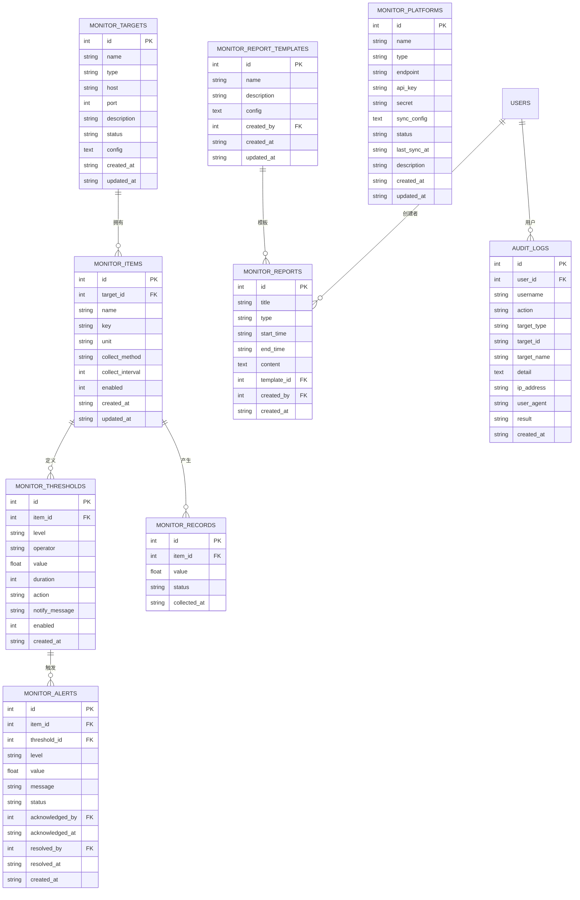

**图表来源**
- [apps/server/src/db/schema.ts:216-330](file://apps/server/src/db/schema.ts#L216-L330)

### 请求/响应示例（路径引用）
- 新增监控目标
  - 请求：POST /api/admin/monitor/targets
  - 路径参考：[apps/server/src/routes/monitor.ts:34-58](file://apps/server/src/routes/monitor.ts#L34-L58)
- 分页查询监控项
  - 请求：GET /api/admin/monitor/items?page=1&pageSize=20
  - 路径参考：[apps/server/src/routes/monitor.ts:108-124](file://apps/server/src/routes/monitor.ts#L108-L124)
- 新增阈值规则
  - 请求：POST /api/admin/monitor/thresholds
  - 路径参考：[apps/server/src/routes/monitor.ts:175-191](file://apps/server/src/routes/monitor.ts#L175-L191)
- 生成监控报表
  - 请求：POST /api/admin/monitor/reports/generate
  - 路径参考：[apps/server/src/routes/monitor.ts:332-391](file://apps/server/src/routes/monitor.ts#L332-L391)
- 平台连通性测试
  - 请求：POST /api/admin/monitor/platforms/:id/test
  - 路径参考：[apps/server/src/routes/monitor.ts:566-593](file://apps/server/src/routes/monitor.ts#L566-L593)