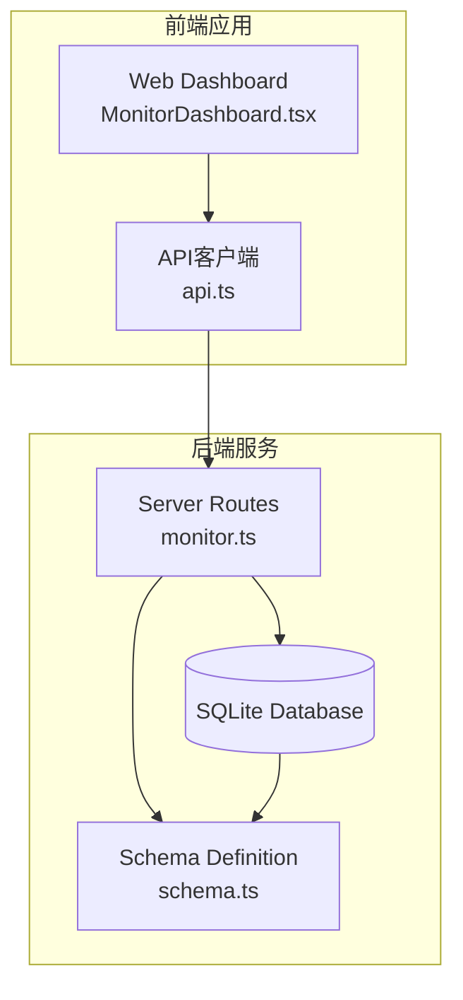
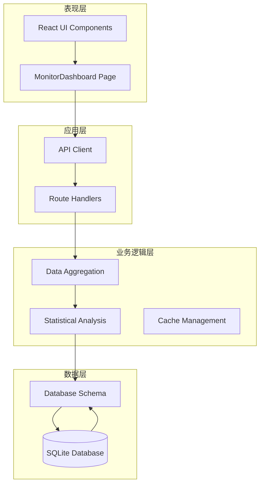
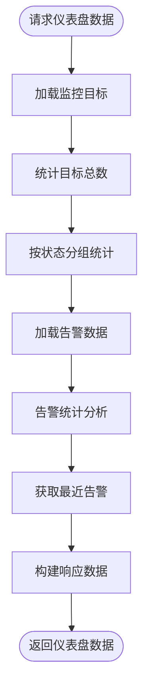
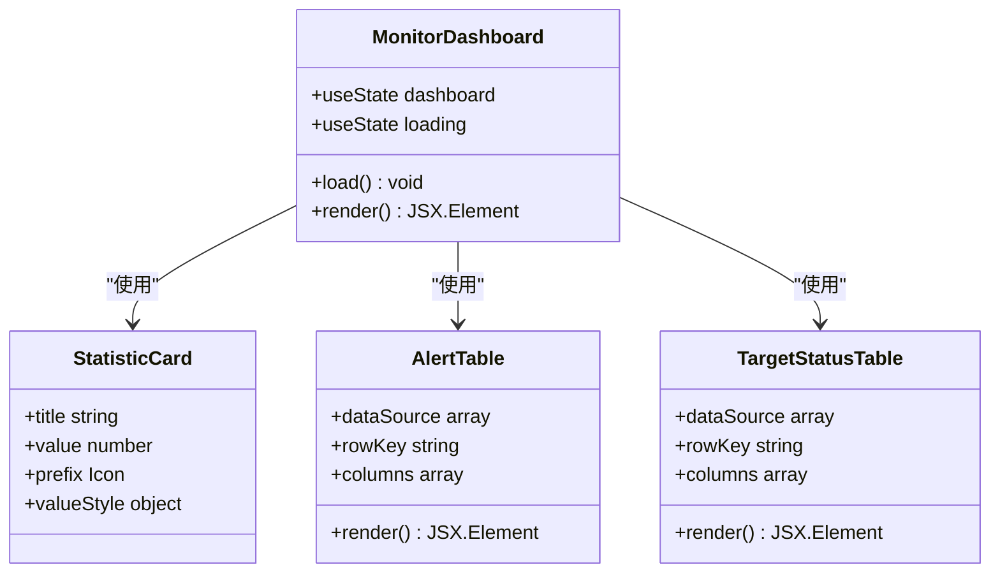
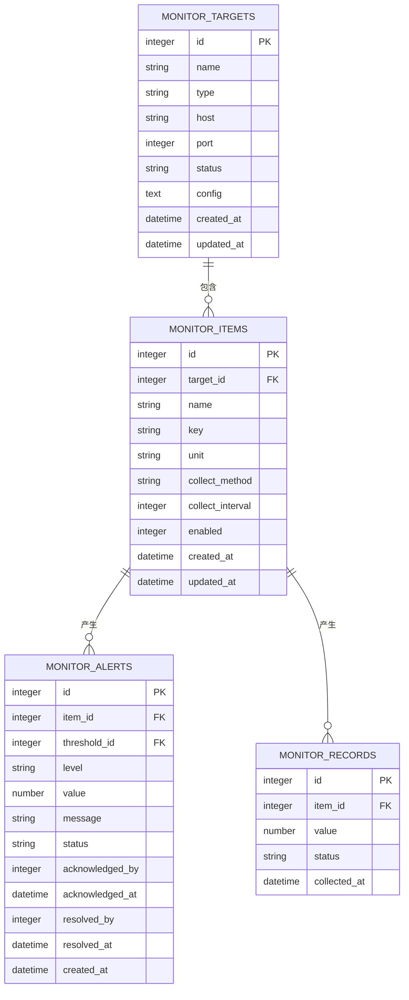
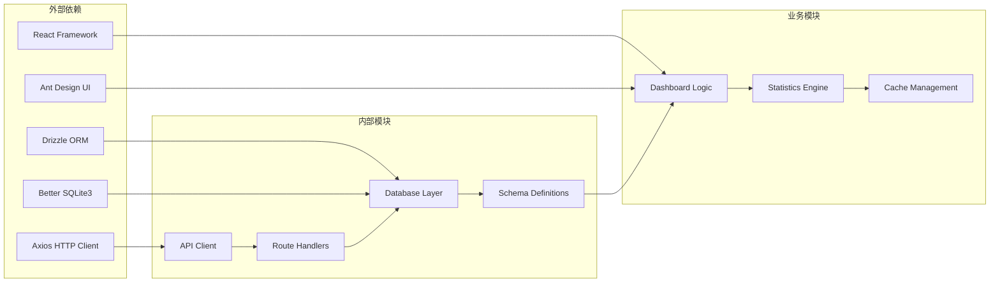

# 监控仪表盘

<cite>
**本文档引用的文件**
- [monitor.ts](file://apps/server/src/routes/monitor.ts)
- [MonitorDashboard.tsx](file://apps/web/src/pages/admin/MonitorDashboard.tsx)
- [schema.ts](file://apps/server/src/db/schema.ts)
- [api.ts](file://apps/web/src/lib/api.ts)
- [index.ts](file://apps/server/src/db/index.ts)
- [seed-demo.ts](file://apps/server/src/db/seed-demo.ts)
</cite>

## 目录
1. [简介](#简介)
2. [项目结构](#项目结构)
3. [核心组件](#核心组件)
4. [架构概览](#架构概览)
5. [详细组件分析](#详细组件分析)
6. [依赖关系分析](#依赖关系分析)
7. [性能考虑](#性能考虑)
8. [故障排除指南](#故障排除指南)
9. [结论](#结论)
10. [附录](#附录)

## 简介

监控仪表盘是ZBH2平台的核心功能模块，负责提供系统整体运行状态的可视化展示。该模块实现了完整的监控数据聚合、统计分析和实时展示功能，包括监控目标总数统计、按状态分类统计、告警状态分布和级别分布统计等功能。

仪表盘API采用RESTful设计原则，提供了标准化的接口规范，支持前端React组件的实时数据展示和交互操作。系统通过SQLite数据库存储监控数据，实现了高效的数据查询和统计分析能力。

## 项目结构

监控仪表盘功能分布在前后端两个主要部分：



**图表来源**
- [monitor.ts:290-319](file://apps/server/src/routes/monitor.ts#L290-L319)
- [MonitorDashboard.tsx:15-27](file://apps/web/src/pages/admin/MonitorDashboard.tsx#L15-L27)

**章节来源**
- [monitor.ts:1-595](file://apps/server/src/routes/monitor.ts#L1-L595)
- [MonitorDashboard.tsx:1-100](file://apps/web/src/pages/admin/MonitorDashboard.tsx#L1-L100)

## 核心组件

监控仪表盘系统由以下核心组件构成：

### 后端API组件
- **监控仪表盘路由**：提供数据聚合和统计分析接口
- **监控目标管理**：维护监控对象的状态和配置
- **监控项管理**：管理具体的监控指标和阈值
- **告警管理**：处理告警事件的生命周期

### 前端展示组件
- **仪表盘页面**：提供实时数据展示和交互功能
- **统计卡片**：展示关键指标的数值统计
- **告警列表**：显示最近的告警事件
- **状态表格**：展示监控目标的状态概览

**章节来源**
- [monitor.ts:290-319](file://apps/server/src/routes/monitor.ts#L290-L319)
- [MonitorDashboard.tsx:34-96](file://apps/web/src/pages/admin/MonitorDashboard.tsx#L34-L96)

## 架构概览

监控仪表盘采用分层架构设计，实现了清晰的职责分离：



**图表来源**
- [monitor.ts:13-14](file://apps/server/src/routes/monitor.ts#L13-L14)
- [api.ts:3](file://apps/web/src/lib/api.ts#L3)

## 详细组件分析

### 仪表盘数据聚合组件

仪表盘的核心功能是数据聚合和统计分析，主要实现如下：

#### 数据聚合逻辑



**图表来源**
- [monitor.ts:291-319](file://apps/server/src/routes/monitor.ts#L291-L319)

#### 统计指标计算

系统实现了以下关键统计指标：

1. **监控目标统计**
   - 总数统计：`targetTotal`
   - 按状态分类：`targetByStatus`（online/offline/warning/critical）

2. **告警统计**
   - 状态分布：`alertByStatus`（pending/acknowledged/resolved）
   - 级别分布：`alertByLevel`（warning/critical）
   - 最近告警：`recentAlerts`（最近10条）

3. **实时数据展示**
   - 在线目标数：`onlineTargets`
   - 待处理告警数：`pendingAlerts`
   - 今日采集记录：`todayRecords`

**章节来源**
- [monitor.ts:291-319](file://apps/server/src/routes/monitor.ts#L291-L319)

### 前端展示组件

前端仪表盘页面实现了完整的用户界面和交互功能：

#### 组件结构



**图表来源**
- [MonitorDashboard.tsx:15-99](file://apps/web/src/pages/admin/MonitorDashboard.tsx#L15-L99)

#### 数据绑定和状态管理

前端组件通过API客户端与后端进行数据交互：

1. **数据加载机制**
   - 组件初始化时自动加载仪表盘数据
   - 错误处理确保界面稳定性
   - 加载状态指示器提升用户体验

2. **实时更新策略**
   - 页面首次加载时获取最新数据
   - 支持手动刷新功能
   - 错误恢复机制

**章节来源**
- [MonitorDashboard.tsx:19-27](file://apps/web/src/pages/admin/MonitorDashboard.tsx#L19-L27)
- [api.ts:3](file://apps/web/src/lib/api.ts#L3)

### 数据模型和关系

监控仪表盘涉及多个数据表之间的复杂关系：



**图表来源**
- [schema.ts:217-277](file://apps/server/src/db/schema.ts#L217-L277)

**章节来源**
- [schema.ts:217-277](file://apps/server/src/db/schema.ts#L217-L277)

## 依赖关系分析

监控仪表盘系统的依赖关系体现了清晰的分层架构：



**图表来源**
- [monitor.ts:1-6](file://apps/server/src/routes/monitor.ts#L1-L6)
- [api.ts:1](file://apps/web/src/lib/api.ts#L1)

**章节来源**
- [monitor.ts:1-6](file://apps/server/src/routes/monitor.ts#L1-L6)
- [api.ts:1-16](file://apps/web/src/lib/api.ts#L1-L16)

## 性能考虑

监控仪表盘在设计时充分考虑了性能优化和数据准确性：

### 数据库性能优化

1. **索引策略**
   - 时间字段建立索引以优化排序查询
   - 关联字段建立外键约束确保数据完整性
   - 频繁查询的字段建立适当索引

2. **查询优化**
   - 使用分页机制限制返回数据量
   - 实现条件过滤减少不必要的数据传输
   - 采用批量查询减少数据库往返次数

3. **内存管理**
   - 合理的数据结构设计避免内存泄漏
   - 及时清理不再使用的数据引用
   - 控制数组大小防止过度增长

### 前端性能优化

1. **渲染优化**
   - 使用React.memo优化组件重渲染
   - 实现虚拟滚动处理大量数据
   - 懒加载非关键资源

2. **网络优化**
   - 实现请求去重避免重复网络调用
   - 使用HTTP缓存策略
   - 优化JSON序列化和反序列化

3. **用户体验优化**
   - 实现加载状态指示器
   - 提供错误边界处理异常情况
   - 支持离线数据展示

### 实时性保证

1. **数据同步机制**
   - 前端组件在挂载时自动获取最新数据
   - 错误处理确保数据一致性
   - 实现数据验证和清理

2. **缓存策略**
   - 当前实现为无缓存的实时查询
   - 建议引入适当的缓存机制
   - 考虑数据过期和刷新策略

**章节来源**
- [monitor.ts:7-11](file://apps/server/src/routes/monitor.ts#L7-L11)
- [MonitorDashboard.tsx:19-27](file://apps/web/src/pages/admin/MonitorDashboard.tsx#L19-L27)

## 故障排除指南

### 常见问题和解决方案

#### API接口问题

1. **仪表盘数据加载失败**
   - 检查数据库连接是否正常
   - 验证监控数据表是否存在
   - 确认用户权限是否正确

2. **数据统计不准确**
   - 检查数据类型转换是否正确
   - 验证统计逻辑的边界条件
   - 确认时间范围过滤是否正确

#### 前端显示问题

1. **界面空白或加载失败**
   - 检查网络请求是否成功
   - 验证API响应格式是否正确
   - 确认组件状态管理是否正常

2. **数据展示异常**
   - 检查数据映射和转换逻辑
   - 验证UI组件的props传递
   - 确认样式和主题配置

#### 数据库问题

1. **查询性能问题**
   - 分析SQL查询执行计划
   - 检查索引使用情况
   - 优化大数据量的查询逻辑

2. **数据一致性问题**
   - 验证事务处理是否正确
   - 检查外键约束和级联操作
   - 确认数据同步机制

**章节来源**
- [monitor.ts:291-319](file://apps/server/src/routes/monitor.ts#L291-L319)
- [MonitorDashboard.tsx:23-25](file://apps/web/src/pages/admin/MonitorDashboard.tsx#L23-L25)

## 结论

监控仪表盘API为ZBH2平台提供了完整的监控数据可视化解决方案。系统通过清晰的架构设计、高效的性能优化和完善的错误处理机制，实现了可靠的数据聚合和展示功能。

### 主要优势

1. **功能完整性**：涵盖了监控目标统计、告警分析、实时数据展示等核心功能
2. **性能优化**：采用了合理的查询策略和前端优化技术
3. **用户体验**：提供了直观的界面和良好的交互体验
4. **可扩展性**：模块化的架构设计便于功能扩展和维护

### 改进建议

1. **缓存机制**：建议引入适当的缓存策略提升性能
2. **实时推送**：可以考虑WebSocket实现实时数据更新
3. **数据预处理**：在数据库层面进行更多的数据聚合计算
4. **监控指标**：增加更多维度的统计分析功能

## 附录

### API接口规范

#### 仪表盘数据接口

**GET** `/api/admin/monitor/dashboard`

**响应示例**：
```json
{
  "success": true,
  "data": {
    "targetTotal": 15,
    "targetByStatus": {
      "online": 12,
      "offline": 2,
      "warning": 1,
      "critical": 0
    },
    "alertByStatus": {
      "pending": 3,
      "acknowledged": 5,
      "resolved": 7
    },
    "alertByLevel": {
      "warning": 8,
      "critical": 2
    },
    "recentAlerts": [
      {
        "id": 101,
        "itemId": 5,
        "level": "critical",
        "value": 95.5,
        "message": "CPU使用率超过95%",
        "status": "pending",
        "createdAt": "2024-01-15T10:30:00Z"
      }
    ]
  }
}
```

**章节来源**
- [monitor.ts:290-319](file://apps/server/src/routes/monitor.ts#L290-L319)

### 数据库配置

系统使用SQLite作为数据存储，配置了WAL模式以提升并发性能：

- **数据库模式**：WAL（Write-Ahead Logging）
- **外键约束**：启用外键检查确保数据完整性
- **数据目录**：默认存储在`data/app.sqlite`

**章节来源**
- [index.ts:10-12](file://apps/server/src/db/index.ts#L10-L12)

### 开发和测试

系统提供了完整的开发和测试支持：

- **演示数据**：包含丰富的测试数据用于功能验证
- **状态模拟**：支持不同状态的监控目标和告警事件
- **边界测试**：覆盖各种异常情况和边界条件

**章节来源**
- [seed-demo.ts:1228-1416](file://apps/server/src/db/seed-demo.ts#L1228-L1416)