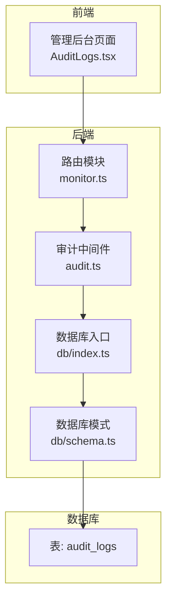
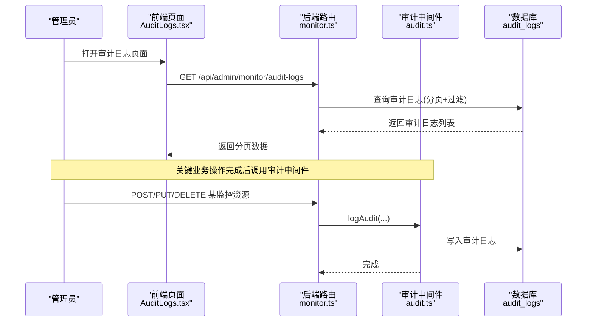
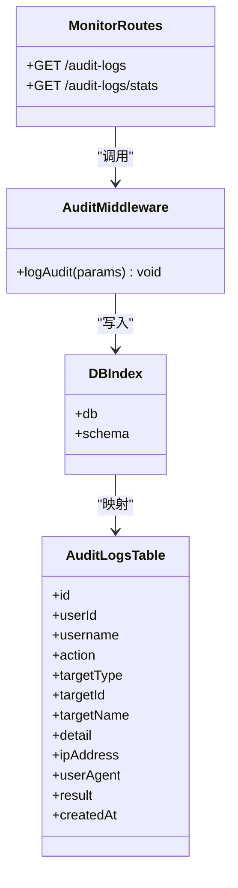

# 监控审计日志

<cite>
**本文引用的文件**
- [audit.ts](file://apps/server/src/middleware/audit.ts)
- [monitor.ts](file://apps/server/src/routes/monitor.ts)
- [AuditLogs.tsx](file://apps/web/src/pages/admin/AuditLogs.tsx)
- [schema.ts](file://apps/server/src/db/schema.ts)
- [index.ts](file://apps/server/src/db/index.ts)
- [auth.ts](file://apps/server/src/middleware/auth.ts)
- [api.ts](file://apps/web/src/lib/api.ts)
- [README.md](file://README.md)
- [drizzle.config.ts](file://apps/server/drizzle.config.ts)
- [0002_special_medusa.sql](file://apps/server/drizzle/0002_special_medusa.sql)
</cite>

## 目录
1. [简介](#简介)
2. [项目结构](#项目结构)
3. [核心组件](#核心组件)
4. [架构总览](#架构总览)
5. [详细组件分析](#详细组件分析)
6. [依赖关系分析](#依赖关系分析)
7. [性能考量](#性能考量)
8. [故障排查指南](#故障排查指南)
9. [结论](#结论)
10. [附录](#附录)

## 简介
本文件面向ZBH2平台的“监控审计日志”能力，系统性梳理后端审计日志API、前端展示页面、数据库模型与中间件实现，并给出接口定义、过滤与统计分析、导出建议、存储与保留策略、隐私保护措施、请求/响应示例及合规与安全监控指南。目标是帮助开发者与运维人员快速理解与正确使用该能力。

## 项目结构
- 后端采用Fastify + Drizzle ORM + SQLite，审计日志表位于数据库模式中，审计写入通过中间件完成。
- 前端管理后台提供审计日志查询界面，支持按操作类型、目标类型、时间范围筛选。
- 数据库迁移脚本定义了审计日志表结构；Drizzle配置指定了SQLite文件路径。

图表来源
- [monitor.ts:455-487](file://apps/server/src/routes/monitor.ts#L455-L487)
- [audit.ts:1-28](file://apps/server/src/middleware/audit.ts#L1-L28)
- [schema.ts:301-314](file://apps/server/src/db/schema.ts#L301-L314)
- [index.ts:1-16](file://apps/server/src/db/index.ts#L1-L16)

章节来源
- [monitor.ts:455-487](file://apps/server/src/routes/monitor.ts#L455-L487)
- [audit.ts:1-28](file://apps/server/src/middleware/audit.ts#L1-L28)
- [schema.ts:301-314](file://apps/server/src/db/schema.ts#L301-L314)
- [index.ts:1-16](file://apps/server/src/db/index.ts#L1-L16)

## 核心组件
- 审计中间件：负责在关键业务操作后写入审计日志，字段覆盖用户、操作类型、目标类型、目标标识、目标名称、详情、IP、UA、结果等。
- 审计路由：提供审计日志查询、统计分析接口，支持分页、多条件过滤（用户、操作类型、目标类型、时间范围）。
- 前端审计页面：提供筛选表单与表格展示，支持按用户名、操作类型、目标类型、时间范围查询。
- 数据库模式：定义审计日志表结构，含枚举约束与外键关联。

章节来源
- [audit.ts:3-27](file://apps/server/src/middleware/audit.ts#L3-L27)
- [monitor.ts:455-487](file://apps/server/src/routes/monitor.ts#L455-L487)
- [AuditLogs.tsx:9-26](file://apps/web/src/pages/admin/AuditLogs.tsx#L9-L26)
- [schema.ts:301-314](file://apps/server/src/db/schema.ts#L301-L314)

## 架构总览
审计流程从后端业务操作触发，经由审计中间件写入数据库，前端通过管理后台路由查询与统计分析。

图表来源
- [monitor.ts:49-98](file://apps/server/src/routes/monitor.ts#L49-L98)
- [audit.ts:14-26](file://apps/server/src/middleware/audit.ts#L14-L26)
- [schema.ts:301-314](file://apps/server/src/db/schema.ts#L301-L314)

## 详细组件分析

### 审计中间件
- 职责：在业务操作成功后统一记录审计日志，包含用户标识、操作类型、目标类型、目标标识/名称、详情、IP、UA、结果等。
- 关键点：对detail进行JSON序列化；对空值使用null占位；默认结果为success。

章节来源
- [audit.ts:3-27](file://apps/server/src/middleware/audit.ts#L3-L27)

### 审计路由（查询与统计）
- 审计日志查询
  - 支持分页参数：page、pageSize（最大100）
  - 支持过滤参数：userId、action、targetType、startTime、endTime
  - 返回格式：success + 分页数据（items、total、page、pageSize）
- 审计统计
  - 统计按操作类型与目标类型的分布，返回总数与分布字典
- 典型调用点
  - 创建/更新/删除监控目标、平台等操作后，调用logAudit记录审计日志

章节来源
- [monitor.ts:455-487](file://apps/server/src/routes/monitor.ts#L455-L487)
- [monitor.ts:49-98](file://apps/server/src/routes/monitor.ts#L49-L98)
- [monitor.ts:512-520](file://apps/server/src/routes/monitor.ts#L512-L520)
- [monitor.ts:537-544](file://apps/server/src/routes/monitor.ts#L537-L544)

### 前端审计页面
- 提供筛选项：用户名、操作类型、目标类型、时间范围
- 表格列：时间、用户、操作、目标类型、目标名称、IP地址、结果、详情
- 分页：支持切换页码与每页数量

章节来源
- [AuditLogs.tsx:9-26](file://apps/web/src/pages/admin/AuditLogs.tsx#L9-L26)
- [AuditLogs.tsx:36-54](file://apps/web/src/pages/admin/AuditLogs.tsx#L36-L54)
- [AuditLogs.tsx:56-98](file://apps/web/src/pages/admin/AuditLogs.tsx#L56-L98)

### 数据库模式与迁移
- 审计日志表字段：id、userId、username、action、targetType、targetId、targetName、detail、ipAddress、userAgent、result、createdAt
- 枚举与约束：action/targetType/result为限定枚举；userId外键关联users
- 迁移脚本：包含audit_logs表的DDL定义

章节来源
- [schema.ts:301-314](file://apps/server/src/db/schema.ts#L301-L314)
- [0002_special_medusa.sql:1-15](file://apps/server/drizzle/0002_special_medusa.sql#L1-L15)

### 认证与鉴权
- 管理后台路由均受requireAdmin保护，确保仅管理员可访问审计相关接口
- 会话加载与校验逻辑保证请求上下文包含合法管理员用户信息

章节来源
- [monitor.ts:13-14](file://apps/server/src/routes/monitor.ts#L13-L14)
- [auth.ts:48-55](file://apps/server/src/middleware/auth.ts#L48-L55)

## 依赖关系分析

图表来源
- [audit.ts:3-27](file://apps/server/src/middleware/audit.ts#L3-L27)
- [monitor.ts:455-487](file://apps/server/src/routes/monitor.ts#L455-L487)
- [index.ts:1-16](file://apps/server/src/db/index.ts#L1-L16)
- [schema.ts:301-314](file://apps/server/src/db/schema.ts#L301-L314)

## 性能考量
- 查询过滤：当前实现为先全量读取再在内存中过滤，适合中小规模数据。若审计日志体量较大，建议在数据库层面进行过滤与索引优化（例如对createdAt、userId、action、targetType建立索引）。
- 分页：后端限制每页最大100条，避免一次性返回过多数据。
- 统计分析：当前统计在内存中聚合，适合实时展示；若数据量增长，可考虑数据库侧聚合或缓存统计结果。

[本节为通用性能建议，不直接分析具体文件]

## 故障排查指南
- 401/403错误：确认管理员登录态与会话有效性
  - 参考：[auth.ts:48-55](file://apps/server/src/middleware/auth.ts#L48-L55)
- 审计日志未记录：检查业务操作是否调用了logAudit
  - 参考：[monitor.ts:49-98](file://apps/server/src/routes/monitor.ts#L49-L98)
- 查询无结果：确认过滤条件（用户、操作类型、目标类型、时间范围）是否过于严格
  - 参考：[monitor.ts:455-474](file://apps/server/src/routes/monitor.ts#L455-L474)
- 数据库路径：确认DATABASE_URL环境变量指向正确的SQLite文件
  - 参考：[drizzle.config.ts:7-9](file://apps/server/drizzle.config.ts#L7-L9)，[index.ts:7-8](file://apps/server/src/db/index.ts#L7-L8)

章节来源
- [auth.ts:48-55](file://apps/server/src/middleware/auth.ts#L48-L55)
- [monitor.ts:49-98](file://apps/server/src/routes/monitor.ts#L49-L98)
- [monitor.ts:455-474](file://apps/server/src/routes/monitor.ts#L455-L474)
- [drizzle.config.ts:7-9](file://apps/server/drizzle.config.ts#L7-L9)
- [index.ts:7-8](file://apps/server/src/db/index.ts#L7-L8)

## 结论
ZBH2平台的监控审计日志能力以中间件为核心，围绕关键业务操作自动记录审计事件，并通过统一的查询与统计接口支撑管理后台展示。当前实现简洁可靠，适合中小型规模使用；随着数据量增长，建议引入数据库索引与缓存策略以提升查询与统计性能。

[本节为总结性内容，不直接分析具体文件]

## 附录

### 接口定义与示例

- 审计日志查询
  - 方法与路径：GET /api/admin/monitor/audit-logs
  - 查询参数
    - page: 页码（默认1）
    - pageSize: 每页条数（默认20，最大100）
    - userId: 用户ID（可选）
    - action: 操作类型（可选，如login、logout、create、update、delete、view、export、config）
    - targetType: 目标类型（可选，如user、software、document、activation、asset、ticket、saas、faq、system、database、device、monitor）
    - startTime: 开始时间（可选，ISO字符串）
    - endTime: 结束时间（可选，ISO字符串）
  - 响应
    - 成功时返回：success=true，data为分页对象（items、total、page、pageSize）
  - 示例
    - 请求：GET /api/admin/monitor/audit-logs?page=1&pageSize=20&action=create&targetType=monitor&startTime=2024-01-01T00:00:00Z&endTime=2024-12-31T23:59:59Z
    - 响应：包含items数组与分页信息

- 审计统计
  - 方法与路径：GET /api/admin/monitor/audit-logs/stats
  - 查询参数：无
  - 响应
    - 成功时返回：success=true，data包含按操作类型分布、按目标类型分布与总数
  - 示例
    - 请求：GET /api/admin/monitor/audit-logs/stats
    - 响应：{ byAction: {...}, byTargetType: {...}, total: N }

- 审计日志详情获取
  - 当前路由未提供单条审计日志详情接口；如需详情，可在前端展示时直接使用列表中的字段（createdAt、username、action、targetType、targetName、ipAddress、result、detail）

章节来源
- [monitor.ts:455-487](file://apps/server/src/routes/monitor.ts#L455-L487)

### 过滤条件与时间范围查询
- 支持的过滤维度
  - 用户：userId
  - 操作类型：action
  - 目标类型：targetType
  - 时间范围：startTime、endTime
- 实现方式
  - 后端先读取全部审计日志，再在内存中按条件过滤；前端提供筛选表单，支持用户名、操作类型、目标类型、时间范围选择

章节来源
- [monitor.ts:455-474](file://apps/server/src/routes/monitor.ts#L455-L474)
- [AuditLogs.tsx:36-54](file://apps/web/src/pages/admin/AuditLogs.tsx#L36-L54)

### 统计分析
- 当前提供按操作类型与目标类型的分布统计，返回总数与分布字典
- 建议
  - 若需要更细粒度统计（如按用户、按IP、按UA），可在后端扩展统计逻辑或数据库侧聚合

章节来源
- [monitor.ts:476-487](file://apps/server/src/routes/monitor.ts#L476-L487)

### 导出功能
- 当前未提供审计日志直接导出接口
- 建议方案
  - 在前端将当前筛选条件与分页参数传递给后端，后端返回CSV/Excel格式数据（需新增接口）
  - 或在前端将表格数据复制到外部工具处理

章节来源
- [monitor.ts:455-487](file://apps/server/src/routes/monitor.ts#L455-L487)
- [AuditLogs.tsx:56-98](file://apps/web/src/pages/admin/AuditLogs.tsx#L56-L98)

### 存储策略、保留期限与隐私保护
- 存储策略
  - 使用SQLite文件存储，数据库路径可通过环境变量配置
  - 建议定期备份data目录（包含app.sqlite与上传文件）
- 保留期限
  - 代码未设置自动清理策略；建议结合业务需求制定保留周期（如1年、2年），到期后归档或删除
- 隐私保护
  - 审计日志包含IP与UA字段，建议在满足合规前提下最小化采集与保留
  - 对敏感信息（如用户详情）建议脱敏处理

章节来源
- [README.md:104-111](file://README.md#L104-L111)
- [drizzle.config.ts:7-9](file://apps/server/drizzle.config.ts#L7-L9)
- [schema.ts:301-314](file://apps/server/src/db/schema.ts#L301-L314)

### 审计策略制定、合规性检查与安全监控指南
- 审计策略
  - 明确需要审计的操作（登录、创建、更新、删除、导出、配置变更等）
  - 明确审计目标类型范围（用户、软件、文档、激活、资产、工单、云服务、FAQ、系统、数据库、设备、监控等）
  - 设定保留期限与归档策略
- 合规性检查
  - 确保符合所在地区的数据保护法规（如GDPR、网络安全法等）
  - 对个人数据进行去标识化或匿名化处理
- 安全监控
  - 将审计日志与告警联动，对异常操作（如频繁失败登录、批量删除）触发告警
  - 定期审查审计统计，识别异常趋势

[本节为通用指导，不直接分析具体文件]