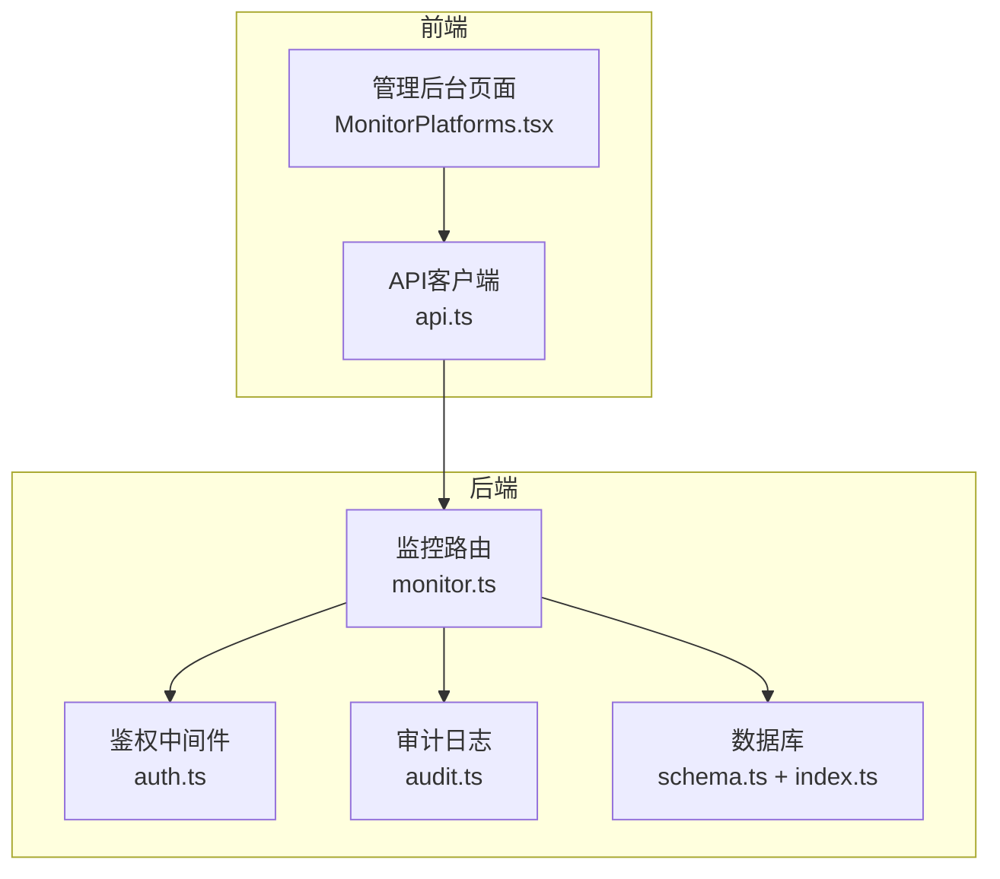
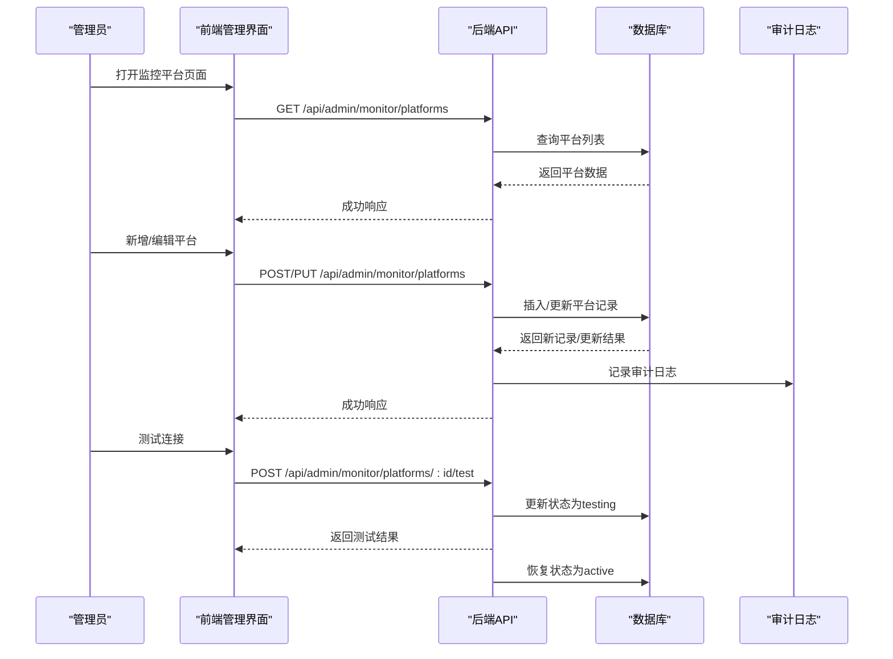
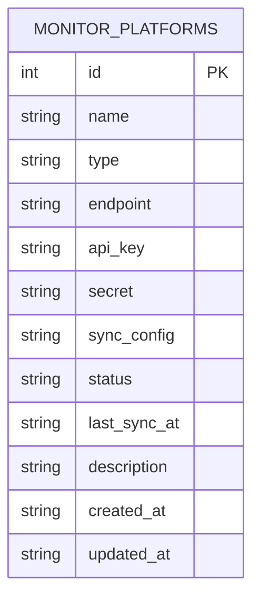
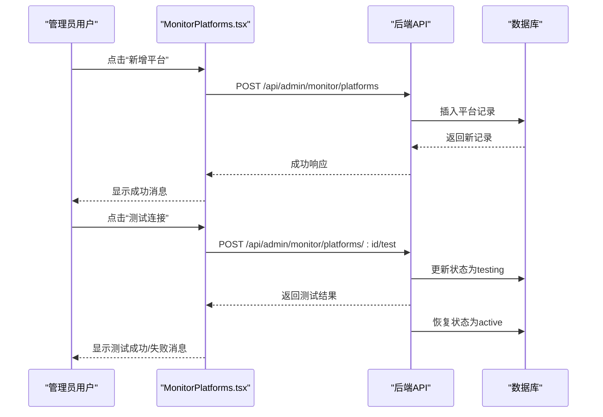
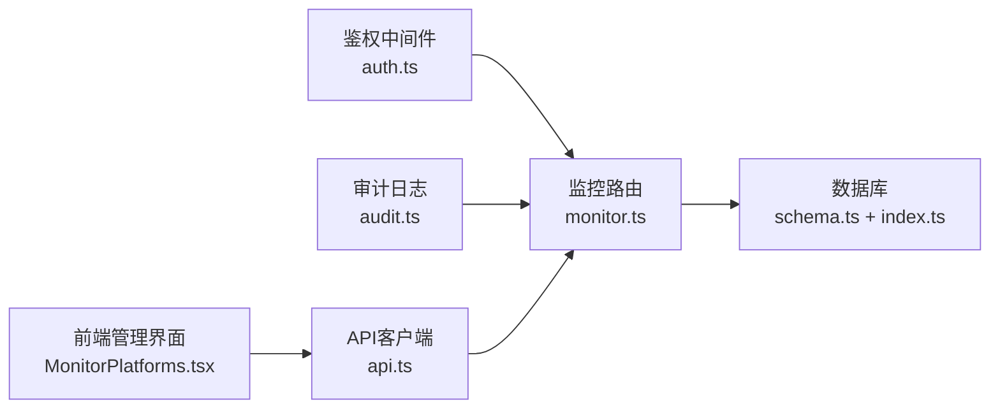

# 监控平台接入

<cite>
**本文档引用的文件**
- [monitor.ts](file://apps/server/src/routes/monitor.ts)
- [MonitorPlatforms.tsx](file://apps/web/src/pages/admin/MonitorPlatforms.tsx)
- [schema.ts](file://apps/server/src/db/schema.ts)
- [auth.ts](file://apps/server/src/middleware/auth.ts)
- [audit.ts](file://apps/server/src/middleware/audit.ts)
- [index.ts](file://apps/server/src/db/index.ts)
- [api.ts](file://apps/web/src/lib/api.ts)
- [README.md](file://README.md)
</cite>

## 目录
1. [简介](#简介)
2. [项目结构](#项目结构)
3. [核心组件](#核心组件)
4. [架构总览](#架构总览)
5. [详细组件分析](#详细组件分析)
6. [依赖关系分析](#依赖关系分析)
7. [性能考虑](#性能考虑)
8. [故障排查指南](#故障排查指南)
9. [结论](#结论)
10. [附录](#附录)

## 简介
本文件面向ZBH2平台的监控平台接入API，提供第三方监控平台接入的完整接口文档。内容涵盖平台类型定义、端点配置、API密钥管理、同步配置、连接测试、状态监控与故障诊断机制，以及配置验证规则、安全策略与连接池管理建议。文档还包含平台添加、配置更新、连接测试与删除等场景的请求/响应示例路径，并提供最佳实践、安全配置与性能监控指南。

## 项目结构
ZBH2采用前后端分离的Monorepo结构，监控平台接入功能位于后端Fastify路由模块中，前端通过Ant Design表格与表单进行可视化管理。

图表来源
- [monitor.ts:489-594](file://apps/server/src/routes/monitor.ts#L489-L594)
- [auth.ts:48-55](file://apps/server/src/middleware/auth.ts#L48-L55)
- [audit.ts:3-27](file://apps/server/src/middleware/audit.ts#L3-L27)
- [schema.ts:316-329](file://apps/server/src/db/schema.ts#L316-L329)
- [index.ts:1-16](file://apps/server/src/db/index.ts#L1-L16)

章节来源
- [README.md:47-68](file://README.md#L47-L68)

## 核心组件
- 平台接入路由：提供平台的增删改查、连接测试等REST接口。
- 平台数据模型：定义平台类型、端点、密钥、同步配置、状态等字段。
- 鉴权与审计：所有平台管理接口均需管理员权限，并记录审计日志。
- 前端管理界面：提供平台列表、新增/编辑、连接测试与删除操作。

章节来源
- [monitor.ts:489-594](file://apps/server/src/routes/monitor.ts#L489-L594)
- [schema.ts:316-329](file://apps/server/src/db/schema.ts#L316-L329)
- [auth.ts:48-55](file://apps/server/src/middleware/auth.ts#L48-L55)
- [audit.ts:3-27](file://apps/server/src/middleware/audit.ts#L3-L27)

## 架构总览
监控平台接入API遵循REST风格，采用Fastify框架，Drizzle ORM访问SQLite数据库。前端通过Axios客户端发起请求，后端通过鉴权中间件限制访问权限，并在关键操作上记录审计日志。

图表来源
- [monitor.ts:490-593](file://apps/server/src/routes/monitor.ts#L490-L593)
- [audit.ts:3-27](file://apps/server/src/middleware/audit.ts#L3-L27)

## 详细组件分析

### 平台接入数据模型
平台接入涉及monitor_platforms表，字段包括名称、类型、端点、API密钥、密钥、同步配置、状态、最后同步时间、描述等。类型枚举支持webhook、api、agent；状态枚举支持active、disabled、testing。

图表来源
- [schema.ts:316-329](file://apps/server/src/db/schema.ts#L316-L329)

章节来源
- [schema.ts:316-329](file://apps/server/src/db/schema.ts#L316-L329)

### 平台接入接口定义

#### 获取平台列表
- 方法：GET
- 路径：/api/admin/monitor/platforms
- 权限：管理员
- 响应：返回平台数组

章节来源
- [monitor.ts:490-494](file://apps/server/src/routes/monitor.ts#L490-L494)

#### 新增平台
- 方法：POST
- 路径：/api/admin/monitor/platforms
- 权限：管理员
- 请求体字段：
  - name: 必填
  - endpoint: 必填
  - type: 可选，默认webhook
  - apiKey: 可选
  - secret: 可选
  - syncConfig: 可选
  - status: 可选，默认active
  - description: 可选
- 审计：记录create操作
- 响应：返回新增平台对象

章节来源
- [monitor.ts:496-523](file://apps/server/src/routes/monitor.ts#L496-L523)
- [audit.ts:3-27](file://apps/server/src/middleware/audit.ts#L3-L27)

#### 更新平台
- 方法：PUT
- 路径：/api/admin/monitor/platforms/:id
- 权限：管理员
- 参数：id
- 请求体字段：name、type、endpoint、apiKey、secret、syncConfig、status、description（可选更新）
- 审计：记录update操作
- 响应：成功

章节来源
- [monitor.ts:525-546](file://apps/server/src/routes/monitor.ts#L525-L546)
- [audit.ts:3-27](file://apps/server/src/middleware/audit.ts#L3-L27)

#### 删除平台
- 方法：DELETE
- 路径：/api/admin/monitor/platforms/:id
- 权限：管理员
- 参数：id
- 审计：记录delete操作
- 响应：成功

章节来源
- [monitor.ts:548-564](file://apps/server/src/routes/monitor.ts#L548-L564)
- [audit.ts:3-27](file://apps/server/src/middleware/audit.ts#L3-L27)

#### 连接测试
- 方法：POST
- 路径：/api/admin/monitor/platforms/:id/test
- 权限：管理员
- 参数：id
- 行为：模拟连接测试，临时将状态设为testing，返回测试结果，随后恢复为active
- 响应：包含connected、latency、timestamp、details的对象

章节来源
- [monitor.ts:566-593](file://apps/server/src/routes/monitor.ts#L566-L593)

### 前端集成与交互
前端管理界面提供平台列表、新增/编辑弹窗、连接测试按钮与删除确认。表单字段与后端一致，支持webhook、api、agent三种类型选择。

图表来源
- [MonitorPlatforms.tsx:38-66](file://apps/web/src/pages/admin/MonitorPlatforms.tsx#L38-L66)
- [monitor.ts:566-593](file://apps/server/src/routes/monitor.ts#L566-L593)

章节来源
- [MonitorPlatforms.tsx:18-119](file://apps/web/src/pages/admin/MonitorPlatforms.tsx#L18-L119)

### 配置验证规则与安全策略
- 必填字段：新增平台时name与endpoint为必填；其他字段可选。
- 类型枚举：type仅允许webhook、api、agent；status仅允许active、disabled、testing。
- 审计日志：所有平台管理操作均记录审计日志，包含操作者、目标类型、目标ID、目标名称、详情等。
- 权限控制：requireAdmin中间件确保仅管理员可访问平台管理接口。
- 前端安全：API客户端设置withCredentials，后端通过会话Cookie进行认证。

章节来源
- [monitor.ts:496-500](file://apps/server/src/routes/monitor.ts#L496-L500)
- [schema.ts:316-329](file://apps/server/src/db/schema.ts#L316-L329)
- [audit.ts:3-27](file://apps/server/src/middleware/audit.ts#L3-L27)
- [auth.ts:48-55](file://apps/server/src/middleware/auth.ts#L48-L55)
- [api.ts:3](file://apps/web/src/lib/api.ts#L3)

### 连接池管理与性能监控
- 数据库连接：后端使用better-sqlite3，开启WAL模式与外键约束，适合单机部署。
- 连接池：SQLite不适用传统意义上的连接池概念；建议通过进程级连接与事务优化减少锁竞争。
- 性能建议：
  - 控制分页大小，避免一次性查询过多平台。
  - 对频繁更新的字段（如status、lastSyncAt）建立索引以提升查询效率。
  - 将敏感字段（apiKey、secret）存储于加密环境变量或密钥管理系统中，避免明文存储。

章节来源
- [index.ts:7-14](file://apps/server/src/db/index.ts#L7-L14)

## 依赖关系分析

图表来源
- [monitor.ts:13-14](file://apps/server/src/routes/monitor.ts#L13-L14)
- [auth.ts:48-55](file://apps/server/src/middleware/auth.ts#L48-L55)
- [audit.ts:3-27](file://apps/server/src/middleware/audit.ts#L3-L27)
- [schema.ts:316-329](file://apps/server/src/db/schema.ts#L316-L329)
- [index.ts:1-16](file://apps/server/src/db/index.ts#L1-L16)
- [api.ts:3](file://apps/web/src/lib/api.ts#L3)

章节来源
- [monitor.ts:13-14](file://apps/server/src/routes/monitor.ts#L13-L14)

## 性能考虑
- 数据库层面：SQLite适合中小规模部署，建议定期维护与备份；对于高并发写入场景，可考虑升级到PostgreSQL。
- 接口层面：平台列表查询支持分页，建议前端合理设置pageSize；连接测试为轻量操作，避免频繁触发。
- 缓存策略：对只读配置（如平台类型枚举）可在前端缓存，减少重复请求。
- 日志与审计：审计日志写入数据库，建议定期归档与清理，避免影响性能。

## 故障排查指南
- 401未授权：检查会话Cookie是否有效，确认管理员登录状态。
- 403权限不足：确认当前用户角色为admin。
- 404平台不存在：确认平台ID正确且存在。
- 连接测试失败：检查endpoint可达性、网络连通性与防火墙设置；核对apiKey/secret配置是否正确。
- 审计日志异常：检查审计日志表是否存在、字段是否正确写入。

章节来源
- [auth.ts:48-55](file://apps/server/src/middleware/auth.ts#L48-L55)
- [monitor.ts:568-569](file://apps/server/src/routes/monitor.ts#L568-L569)
- [audit.ts:3-27](file://apps/server/src/middleware/audit.ts#L3-L27)

## 结论
ZBH2平台的监控平台接入API提供了完整的第三方监控平台管理能力，包括平台配置、密钥管理、同步配置、连接测试与审计追踪。通过严格的权限控制与审计日志，确保了平台接入的安全性与可追溯性。建议在生产环境中结合密钥管理与数据库优化策略，进一步提升安全性与性能。

## 附录

### 请求/响应示例路径
- 新增平台
  - 请求：POST /api/admin/monitor/platforms
  - 示例路径：[monitor.ts:496-523](file://apps/server/src/routes/monitor.ts#L496-L523)
- 更新平台
  - 请求：PUT /api/admin/monitor/platforms/:id
  - 示例路径：[monitor.ts:525-546](file://apps/server/src/routes/monitor.ts#L525-L546)
- 删除平台
  - 请求：DELETE /api/admin/monitor/platforms/:id
  - 示例路径：[monitor.ts:548-564](file://apps/server/src/routes/monitor.ts#L548-L564)
- 连接测试
  - 请求：POST /api/admin/monitor/platforms/:id/test
  - 示例路径：[monitor.ts:566-593](file://apps/server/src/routes/monitor.ts#L566-L593)

### 最佳实践
- 平台类型选择：根据第三方平台能力选择webhook、api或agent类型。
- 端点配置：确保endpoint可从ZBH2服务器访问，必要时配置反向代理或内网穿透。
- 密钥管理：优先使用环境变量或密钥管理系统存储apiKey与secret，避免硬编码。
- 同步配置：合理设置syncConfig，明确同步范围与频率。
- 审计与日志：定期审查审计日志，及时发现异常操作。
- 性能优化：控制平台数量与查询频率，避免对数据库造成过大压力。