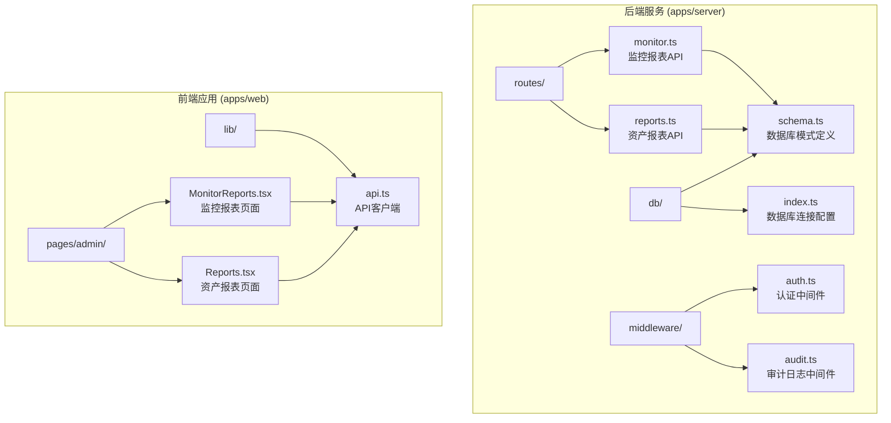
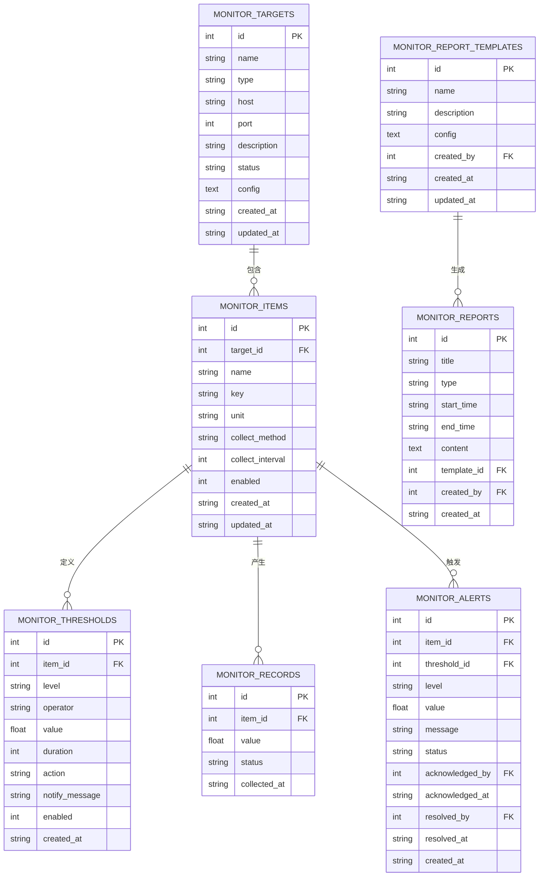
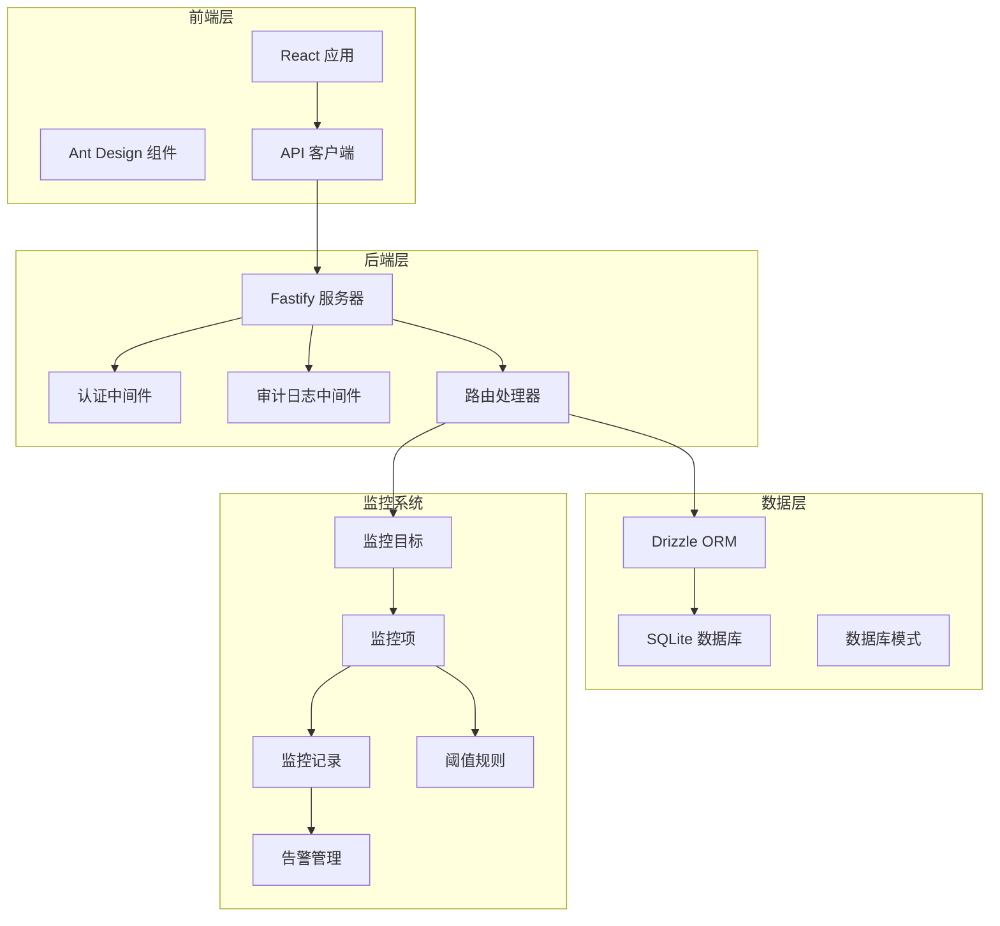
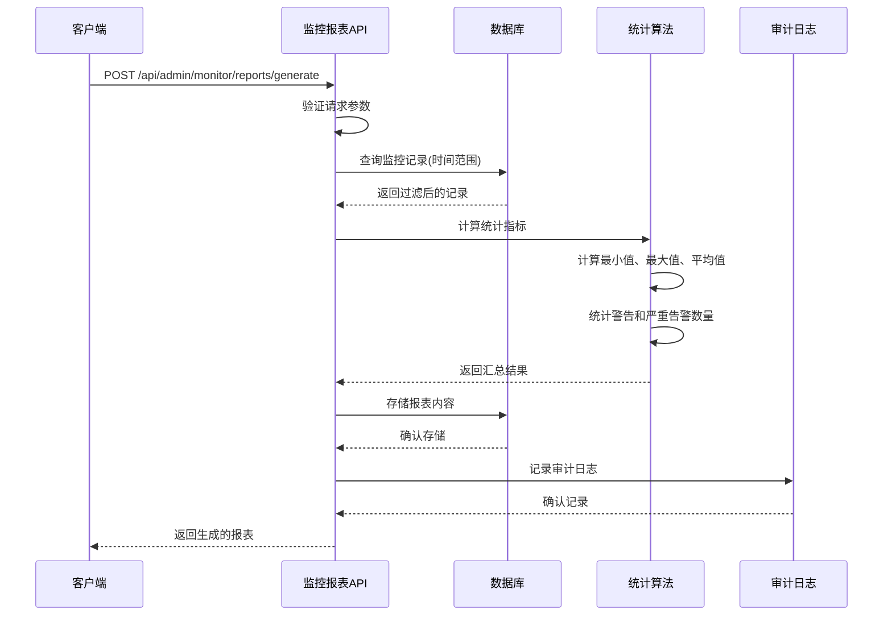
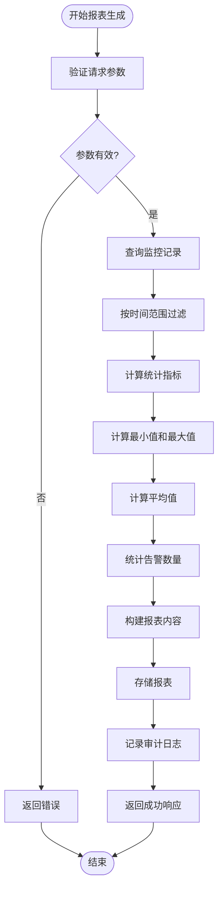
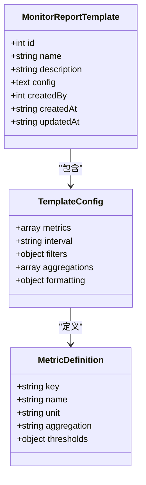
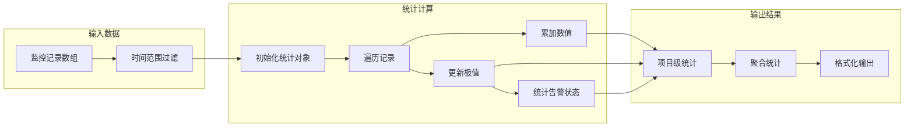
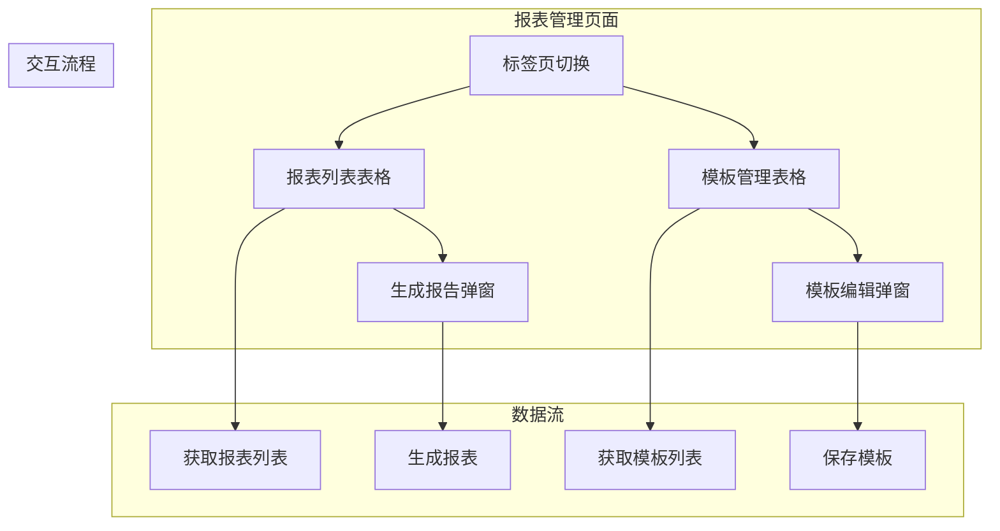
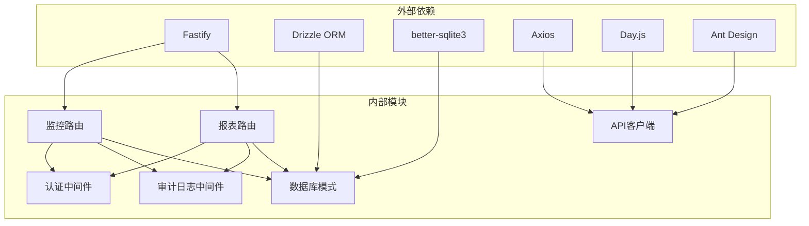
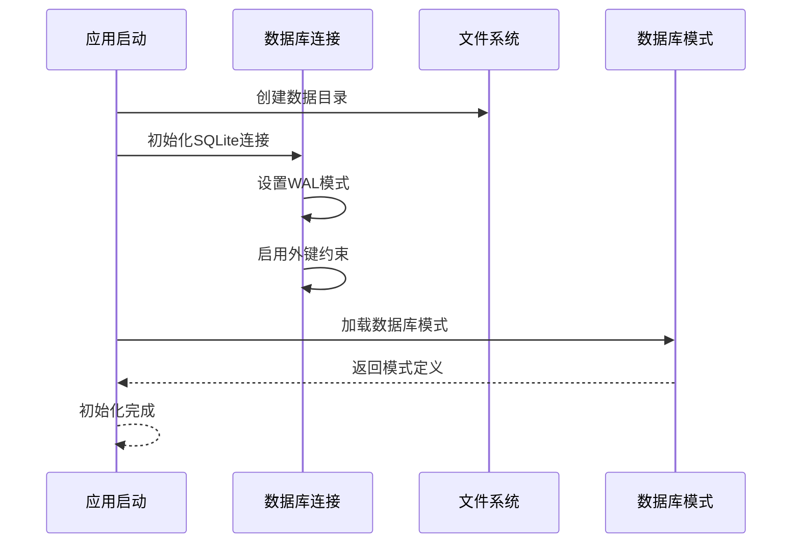

# 监控报表

<cite>
**本文档引用的文件**
- [apps/server/src/routes/monitor.ts](file://apps/server/src/routes/monitor.ts)
- [apps/server/src/routes/reports.ts](file://apps/server/src/routes/reports.ts)
- [apps/server/src/db/schema.ts](file://apps/server/src/db/schema.ts)
- [apps/server/src/db/index.ts](file://apps/server/src/db/index.ts)
- [apps/server/src/middleware/auth.ts](file://apps/server/src/middleware/auth.ts)
- [apps/server/src/middleware/audit.ts](file://apps/server/src/middleware/audit.ts)
- [apps/web/src/pages/admin/MonitorReports.tsx](file://apps/web/src/pages/admin/MonitorReports.tsx)
- [apps/web/src/pages/admin/Reports.tsx](file://apps/web/src/pages/admin/Reports.tsx)
- [apps/web/src/lib/api.ts](file://apps/web/src/lib/api.ts)
</cite>

## 目录
1. [简介](#简介)
2. [项目结构](#项目结构)
3. [核心组件](#核心组件)
4. [架构概览](#架构概览)
5. [详细组件分析](#详细组件分析)
6. [依赖关系分析](#依赖关系分析)
7. [性能考虑](#性能考虑)
8. [故障排除指南](#故障排除指南)
9. [结论](#结论)
10. [附录](#附录)

## 简介

ZBH2平台的监控报表系统提供了全面的监控数据统计和报表生成功能。该系统支持多种类型的监控报表，包括软件资产报表、激活码使用报表、数字资产报表以及监控系统报表。系统采用前后端分离架构，后端基于Fastify框架和Drizzle ORM，前端使用React和Ant Design构建用户界面。

监控报表系统的核心功能包括：
- 多维度报表模板配置
- 实时监控数据收集与统计
- 自动化报表生成与内容格式化
- 报表存储管理与版本控制
- 历史报表查询与导出
- 审计日志追踪

## 项目结构

监控报表系统主要分布在以下目录结构中：



**图表来源**
- [apps/server/src/routes/monitor.ts:1-595](file://apps/server/src/routes/monitor.ts#L1-L595)
- [apps/server/src/routes/reports.ts:1-146](file://apps/server/src/routes/reports.ts#L1-L146)
- [apps/server/src/db/schema.ts:1-330](file://apps/server/src/db/schema.ts#L1-L330)

**章节来源**
- [apps/server/src/routes/monitor.ts:1-595](file://apps/server/src/routes/monitor.ts#L1-L595)
- [apps/server/src/routes/reports.ts:1-146](file://apps/server/src/routes/reports.ts#L1-L146)
- [apps/server/src/db/schema.ts:1-330](file://apps/server/src/db/schema.ts#L1-L330)

## 核心组件

### 数据库模型

监控报表系统的核心数据模型包括监控目标、监控项、阈值规则、监控记录、告警以及报表相关实体。



**图表来源**
- [apps/server/src/db/schema.ts:217-287](file://apps/server/src/db/schema.ts#L217-L287)

### 报表类型定义

系统支持四种主要的报表类型：

1. **软件资产报表** (`/api/admin/reports/software-assets`)
   - 统计软件总数、已发布数量、草稿数量
   - 按软件分类进行分布统计
   - 生成时间戳标记

2. **激活码使用报表** (`/api/admin/reports/activation`)
   - 产品级使用统计（码总量、可用数、已发放数、已作废数）
   - 使用率计算（已发放数/总码数）
   - 月度发放趋势分析

3. **数字资产报表** (`/api/admin/reports/digital-assets`)
   - 资产总数统计
   - 按状态分布（库存中、使用中、维护中、已退役、已报废）
   - 按分类分布统计
   - 资产总价值和在用资产价值计算

4. **综合导出报表** (`/api/admin/reports/export`)
   - 合并所有相关数据的完整报表
   - 包含软件、激活产品、激活发放记录、数字资产

**章节来源**
- [apps/server/src/routes/reports.ts:9-144](file://apps/server/src/routes/reports.ts#L9-L144)

## 架构概览

监控报表系统采用分层架构设计，确保功能模块的清晰分离和可维护性。



**图表来源**
- [apps/server/src/routes/monitor.ts:1-595](file://apps/server/src/routes/monitor.ts#L1-L595)
- [apps/server/src/db/index.ts:1-16](file://apps/server/src/db/index.ts#L1-L16)

### 控制流分析

系统的主要工作流程包括报表生成、数据收集、统计计算和内容存储。



**图表来源**
- [apps/server/src/routes/monitor.ts:332-391](file://apps/server/src/routes/monitor.ts#L332-L391)

**章节来源**
- [apps/server/src/routes/monitor.ts:321-407](file://apps/server/src/routes/monitor.ts#L321-L407)

## 详细组件分析

### 监控报表API组件

监控报表API提供了完整的报表生命周期管理功能，包括报表生成、查询、删除和模板管理。

#### 报表生成流程



**图表来源**
- [apps/server/src/routes/monitor.ts:338-378](file://apps/server/src/routes/monitor.ts#L338-L378)

#### 报表查询组件

系统提供多种查询方式来获取报表数据：

1. **分页查询** (`GET /api/admin/monitor/reports`)
   - 支持分页参数：page、pageSize
   - 默认每页20条记录
   - 最大页大小限制为100

2. **单个报表查询** (`GET /api/admin/monitor/reports/:id`)
   - 根据ID查询特定报表
   - 返回完整的报表内容

3. **模板查询** (`GET /api/admin/monitor/report-templates`)
   - 获取所有可用的报表模板
   - 支持模板配置的JSON格式

**章节来源**
- [apps/server/src/routes/monitor.ts:321-453](file://apps/server/src/routes/monitor.ts#L321-L453)

### 报表模板系统

报表模板系统允许管理员创建和管理自定义报表格式，支持复杂的配置选项。

#### 模板配置结构



**图表来源**
- [apps/server/src/db/schema.ts:279-287](file://apps/server/src/db/schema.ts#L279-L287)

#### 模板管理API

1. **创建模板** (`POST /api/admin/monitor/report-templates`)
   - 必需字段：name、config
   - 支持JSON配置对象或字符串

2. **更新模板** (`PUT /api/admin/monitor/report-templates/:id`)
   - 支持部分更新
   - 自动处理JSON序列化

3. **删除模板** (`DELETE /api/admin/monitor/report-templates/:id`)
   - 级联删除关联的报表

**章节来源**
- [apps/server/src/routes/monitor.ts:409-453](file://apps/server/src/routes/monitor.ts#L409-L453)

### 数据收集与统计算法

监控报表系统实现了高效的统计数据收集和计算算法。

#### 统计计算流程



**图表来源**
- [apps/server/src/routes/monitor.ts:346-361](file://apps/server/src/routes/monitor.ts#L346-L361)

#### 性能优化策略

1. **内存优化**：使用对象缓存避免重复计算
2. **时间复杂度**：O(n)线性时间复杂度，n为记录数量
3. **空间复杂度**：O(k)空间复杂度，k为唯一监控项数量
4. **批量处理**：一次性加载所有记录进行过滤和计算

**章节来源**
- [apps/server/src/routes/monitor.ts:338-378](file://apps/server/src/routes/monitor.ts#L338-L378)

### 前端集成组件

前端应用提供了直观的用户界面来管理和查看监控报表。

#### 报表管理界面



**图表来源**
- [apps/web/src/pages/admin/MonitorReports.tsx:90-186](file://apps/web/src/pages/admin/MonitorReports.tsx#L90-L186)

#### 资产报表界面

资产报表页面提供了三个主要的报表视图：

1. **软件资产统计**：显示软件总数、已发布数量、草稿数量
2. **激活码使用统计**：展示产品级使用情况和月度趋势
3. **数字资产统计**：提供资产总数、总价值和状态分布

**章节来源**
- [apps/web/src/pages/admin/Reports.tsx:8-137](file://apps/web/src/pages/admin/Reports.tsx#L8-L137)

## 依赖关系分析

监控报表系统的关键依赖关系如下：



**图表来源**
- [apps/server/src/routes/monitor.ts:1-595](file://apps/server/src/routes/monitor.ts#L1-L595)
- [apps/web/src/lib/api.ts:1-16](file://apps/web/src/lib/api.ts#L1-L16)

### 数据库连接管理

系统使用SQLite作为数据存储，通过better-sqlite3驱动程序实现高性能的数据访问。



**图表来源**
- [apps/server/src/db/index.ts:7-14](file://apps/server/src/db/index.ts#L7-L14)

**章节来源**
- [apps/server/src/db/index.ts:1-16](file://apps/server/src/db/index.ts#L1-L16)

## 性能考虑

### 数据库性能优化

1. **索引策略**：监控记录表按收集时间排序，支持高效的时间范围查询
2. **查询优化**：使用WHERE子句和ORDER BY优化过滤和排序操作
3. **连接池**：SQLite的WAL模式提供更好的并发性能
4. **数据类型**：合理使用整数和文本类型减少存储开销

### 内存管理

1. **流式处理**：对于大量数据的报表生成，考虑使用流式处理减少内存占用
2. **分批处理**：大数据集按批次处理，避免一次性加载到内存
3. **垃圾回收**：及时清理不再使用的变量和对象引用

### 缓存策略

1. **模板缓存**：常用报表模板可以缓存在内存中
2. **统计缓存**：近期的统计结果可以缓存以提高响应速度
3. **会话缓存**：用户会话信息可以缓存减少数据库查询

## 故障排除指南

### 常见问题及解决方案

#### 报表生成失败

**问题症状**：调用报表生成API返回错误

**可能原因**：
1. 缺少必需的请求参数
2. 时间范围格式不正确
3. 数据库连接异常
4. 权限不足

**解决步骤**：
1. 检查请求参数是否完整
2. 验证时间格式为ISO 8601标准
3. 确认用户具有管理员权限
4. 查看服务器日志获取详细错误信息

#### 报表查询超时

**问题症状**：查询大量监控记录时响应缓慢

**优化建议**：
1. 使用更精确的时间范围过滤
2. 分页获取数据而不是一次性获取所有记录
3. 考虑添加适当的索引
4. 优化前端渲染逻辑

#### 模板配置错误

**问题症状**：模板保存失败或报表生成异常

**排查步骤**：
1. 验证JSON配置格式正确
2. 检查必需字段是否完整
3. 确认模板引用的监控项存在
4. 验证阈值配置的有效性

**章节来源**
- [apps/server/src/routes/monitor.ts:332-336](file://apps/server/src/routes/monitor.ts#L332-L336)

## 结论

ZBH2平台的监控报表系统提供了一个完整、可扩展的监控数据分析解决方案。系统通过清晰的架构设计、高效的统计算法和友好的用户界面，满足了不同层次用户的监控需求。

### 主要优势

1. **功能完整性**：覆盖从数据收集到报表生成的完整流程
2. **性能优化**：采用高效的统计算法和数据库优化策略
3. **可扩展性**：模块化的架构设计便于功能扩展
4. **用户体验**：直观的前端界面和丰富的可视化展示

### 发展方向

1. **实时报表**：支持实时数据流和动态更新
2. **高级分析**：集成机器学习算法进行趋势预测
3. **多租户支持**：支持多组织环境下的报表隔离
4. **移动端适配**：优化移动端的报表查看体验

## 附录

### API参考

#### 监控报表API

| 方法 | 路径 | 描述 |
|------|------|------|
| GET | `/api/admin/monitor/reports` | 获取报表列表 |
| POST | `/api/admin/monitor/reports/generate` | 生成新报表 |
| GET | `/api/admin/monitor/reports/:id` | 获取指定报表 |
| DELETE | `/api/admin/monitor/reports/:id` | 删除报表 |
| GET | `/api/admin/monitor/report-templates` | 获取模板列表 |
| POST | `/api/admin/monitor/report-templates` | 创建模板 |
| PUT | `/api/admin/monitor/report-templates/:id` | 更新模板 |
| DELETE | `/api/admin/monitor/report-templates/:id` | 删除模板 |

#### 资产报表API

| 方法 | 路径 | 描述 |
|------|------|------|
| GET | `/api/admin/reports/software-assets` | 软件资产报表 |
| GET | `/api/admin/reports/activation` | 激活码使用报表 |
| GET | `/api/admin/reports/digital-assets` | 数字资产报表 |
| GET | `/api/admin/reports/export` | 综合导出报表 |

### 请求/响应示例

#### 生成监控报表请求

**请求体**：
```json
{
  "title": "每日系统监控报表",
  "type": "daily",
  "startTime": "2024-01-15T00:00:00Z",
  "endTime": "2024-01-16T00:00:00Z",
  "templateId": 1
}
```

**响应体**：
```json
{
  "success": true,
  "data": {
    "id": 1,
    "title": "每日系统监控报表",
    "type": "daily",
    "startTime": "2024-01-15T00:00:00Z",
    "endTime": "2024-01-16T00:00:00Z",
    "content": "{...}",
    "templateId": 1,
    "createdBy": 1,
    "createdAt": "2024-01-16T10:30:00Z"
  }
}
```

#### 获取报表列表请求

**查询参数**：
```
?page=1&pageSize=20
```

**响应体**：
```json
{
  "success": true,
  "data": {
    "items": [
      {
        "id": 1,
        "title": "系统监控报表",
        "type": "daily",
        "startTime": "2024-01-15T00:00:00Z",
        "endTime": "2024-01-16T00:00:00Z",
        "createdAt": "2024-01-16T10:30:00Z"
      }
    ],
    "total": 150,
    "page": 1,
    "pageSize": 20
  }
}
```

### 报表设计模板

#### 基础模板结构

```json
{
  "title": "自定义报表模板",
  "description": "模板描述",
  "config": {
    "metrics": [
      {
        "key": "cpu_usage",
        "name": "CPU使用率",
        "unit": "%",
        "aggregation": "avg",
        "thresholds": {
          "warning": 80,
          "critical": 90
        }
      }
    ],
    "interval": "1h",
    "filters": {
      "status": ["online", "warning"],
      "type": ["device", "system"]
    },
    "formatting": {
      "dateFormat": "YYYY-MM-DD HH:mm:ss",
      "numberPrecision": 2
    }
  }
}
```

### 数据统计算法

#### 统计指标计算

1. **基本统计**：
   - 最小值：`min = min(value[i])`
   - 最大值：`max = max(value[i])`
   - 平均值：`avg = sum(value[i]) / n`

2. **告警统计**：
   - 警告数量：统计状态为"warning"的记录数
   - 严重告警数量：统计状态为"critical"的记录数

3. **时间范围过滤**：
   ```javascript
   const filteredRecords = records.filter(
     record => record.collectedAt >= startTime && 
               record.collectedAt <= endTime
   );
   ```

### 性能优化建议

1. **数据库优化**：
   - 为监控记录表的collectedAt字段建立索引
   - 使用LIMIT和OFFSET实现分页查询
   - 避免SELECT *，只查询需要的字段

2. **前端优化**：
   - 使用虚拟滚动处理大量数据
   - 实现防抖机制避免频繁请求
   - 缓存最近查询的结果

3. **后端优化**：
   - 使用连接池管理数据库连接
   - 实现请求限流防止过载
   - 使用异步处理避免阻塞