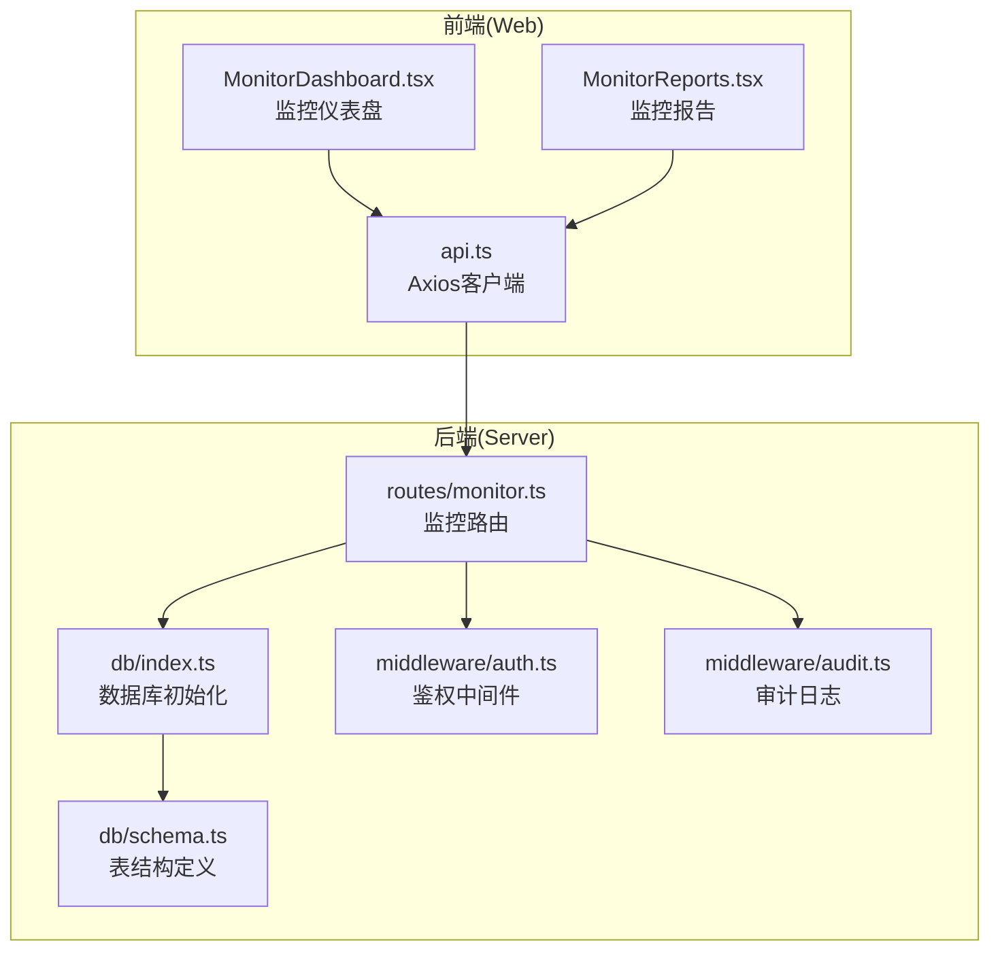
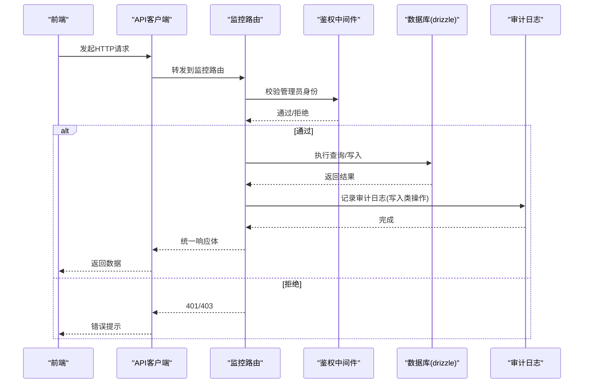
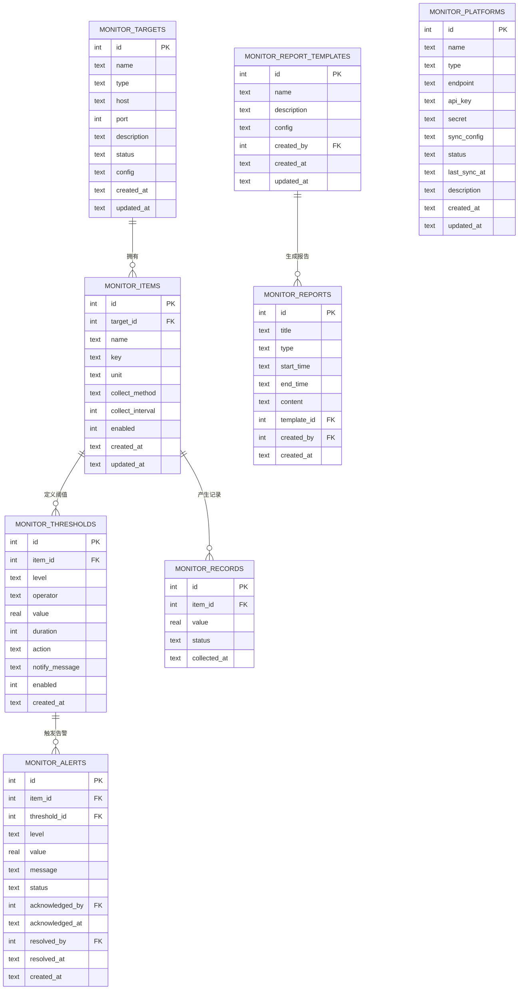

# 监控数据记录

<cite>
**本文引用的文件**
- [apps/server/src/routes/monitor.ts](file://apps/server/src/routes/monitor.ts)
- [apps/server/src/db/schema.ts](file://apps/server/src/db/schema.ts)
- [apps/server/src/db/index.ts](file://apps/server/src/db/index.ts)
- [apps/server/src/middleware/auth.ts](file://apps/server/src/middleware/auth.ts)
- [apps/server/src/middleware/audit.ts](file://apps/server/src/middleware/audit.ts)
- [apps/server/drizzle/0002_special_medusa.sql](file://apps/server/drizzle/0002_special_medusa.sql)
- [apps/web/src/pages/admin/MonitorDashboard.tsx](file://apps/web/src/pages/admin/MonitorDashboard.tsx)
- [apps/web/src/pages/admin/MonitorReports.tsx](file://apps/web/src/pages/admin/MonitorReports.tsx)
- [apps/web/src/lib/api.ts](file://apps/web/src/lib/api.ts)
</cite>

## 目录
1. [简介](#简介)
2. [项目结构](#项目结构)
3. [核心组件](#核心组件)
4. [架构总览](#架构总览)
5. [详细组件分析](#详细组件分析)
6. [依赖关系分析](#依赖关系分析)
7. [性能考量](#性能考量)
8. [故障排查指南](#故障排查指南)
9. [结论](#结论)
10. [附录](#附录)

## 简介
本文件面向ZBH2平台的“监控数据记录”能力，提供完整、可操作的接口文档与实现解析。重点覆盖以下方面：
- 数据记录的插入、查询、过滤与分页机制
- 时间范围查询、监控项筛选与数据格式化输出
- 存储策略、数据清理与归档机制
- 请求/响应示例（涵盖数据记录查询、时间范围筛选、分页获取）
- 质量保证、存储优化与查询性能调优建议

## 项目结构
监控数据相关的核心代码位于后端服务的路由与数据库层，前端通过统一的API客户端进行调用。

图表来源
- [apps/server/src/routes/monitor.ts:13-595](file://apps/server/src/routes/monitor.ts#L13-L595)
- [apps/server/src/db/index.ts:1-16](file://apps/server/src/db/index.ts#L1-L16)
- [apps/server/src/db/schema.ts:216-330](file://apps/server/src/db/schema.ts#L216-L330)
- [apps/server/src/middleware/auth.ts:1-56](file://apps/server/src/middleware/auth.ts#L1-L56)
- [apps/server/src/middleware/audit.ts:1-28](file://apps/server/src/middleware/audit.ts#L1-L28)
- [apps/web/src/pages/admin/MonitorDashboard.tsx:1-100](file://apps/web/src/pages/admin/MonitorDashboard.tsx#L1-L100)
- [apps/web/src/pages/admin/MonitorReports.tsx:1-189](file://apps/web/src/pages/admin/MonitorReports.tsx#L1-L189)
- [apps/web/src/lib/api.ts:1-16](file://apps/web/src/lib/api.ts#L1-L16)

章节来源
- [apps/server/src/routes/monitor.ts:13-595](file://apps/server/src/routes/monitor.ts#L13-L595)
- [apps/server/src/db/schema.ts:216-330](file://apps/server/src/db/schema.ts#L216-L330)
- [apps/server/src/db/index.ts:1-16](file://apps/server/src/db/index.ts#L1-L16)
- [apps/server/src/middleware/auth.ts:1-56](file://apps/server/src/middleware/auth.ts#L1-L56)
- [apps/server/src/middleware/audit.ts:1-28](file://apps/server/src/middleware/audit.ts#L1-L28)
- [apps/web/src/pages/admin/MonitorDashboard.tsx:1-100](file://apps/web/src/pages/admin/MonitorDashboard.tsx#L1-L100)
- [apps/web/src/pages/admin/MonitorReports.tsx:1-189](file://apps/web/src/pages/admin/MonitorReports.tsx#L1-L189)
- [apps/web/src/lib/api.ts:1-16](file://apps/web/src/lib/api.ts#L1-L16)

## 核心组件
- 监控数据记录表：用于存储采集指标值、状态与采集时间戳
- 监控项表：定义监控目标下的具体指标键、单位、采集周期等
- 监控目标表：定义被监控的对象（设备/系统/数据库/服务）
- 阈值规则表：定义触发告警的条件
- 告警表：记录告警事件及其处理状态
- 报告与模板：按时间范围生成汇总报告
- 审计日志：记录管理员对监控相关实体的操作

章节来源
- [apps/server/src/db/schema.ts:216-330](file://apps/server/src/db/schema.ts#L216-L330)
- [apps/server/drizzle/0002_special_medusa.sql:65-72](file://apps/server/drizzle/0002_special_medusa.sql#L65-L72)

## 架构总览
监控数据记录API采用“路由-中间件-数据库”的分层设计，所有管理端接口均受管理员鉴权保护，并在关键写入操作上记录审计日志。

图表来源
- [apps/server/src/routes/monitor.ts:13-14](file://apps/server/src/routes/monitor.ts#L13-L14)
- [apps/server/src/middleware/auth.ts:48-55](file://apps/server/src/middleware/auth.ts#L48-L55)
- [apps/server/src/middleware/audit.ts:3-27](file://apps/server/src/middleware/audit.ts#L3-L27)

## 详细组件分析

### 监控数据记录接口
- 接口路径：GET /api/admin/monitor/records
- 功能：分页查询监控数据记录，支持按监控项ID过滤与时间范围过滤
- 查询参数
  - page：页码（默认1，最小1）
  - pageSize：每页条数（默认20，最大100）
  - itemId：监控项ID（可选）
  - startTime：开始时间（可选，ISO字符串）
  - endTime：结束时间（可选，ISO字符串）
- 响应结构
  - success：布尔
  - data：分页对象
    - items：记录数组
    - total：总数
    - page：当前页
    - pageSize：每页大小
- 实现要点
  - 先按itemId或全量查询，再按时间范围进行内存过滤
  - 使用统一分页函数返回标准分页结果
- 示例请求
  - 获取全部记录（第1页，每页20条）
    - GET /api/admin/monitor/records?page=1&pageSize=20
  - 按监控项过滤
    - GET /api/admin/monitor/records?itemId=123&page=1&pageSize=20
  - 按时间范围过滤
    - GET /api/admin/monitor/records?startTime=2025-01-01T00:00:00Z&endTime=2025-01-02T00:00:00Z&page=1&pageSize=20
  - 组合过滤
    - GET /api/admin/monitor/records?itemId=123&startTime=2025-01-01T00:00:00Z&endTime=2025-01-02T00:00:00Z&page=1&pageSize=20
- 示例响应
  - 成功时返回
    - {
        "success": true,
        "data": {
          "items": [...],
          "total": 1234,
          "page": 1,
          "pageSize": 20
        }
      }

章节来源
- [apps/server/src/routes/monitor.ts:216-240](file://apps/server/src/routes/monitor.ts#L216-L240)

### 监控项与目标接口
- 监控目标管理
  - GET /api/admin/monitor/targets：分页查询目标，支持按type过滤
  - POST /api/admin/monitor/targets：创建目标
  - PUT /api/admin/monitor/targets/:id：更新目标
  - DELETE /api/admin/monitor/targets/:id：删除目标
  - GET /api/admin/monitor/targets/:id/status：查询目标状态
- 监控项管理
  - GET /api/admin/monitor/items：分页查询项，支持按targetId过滤
  - POST /api/admin/monitor/items：创建项
  - PUT /api/admin/monitor/items/:id：更新项
  - DELETE /api/admin/monitor/items/:id：删除项
- 阈值规则
  - GET /api/admin/monitor/items/:id/thresholds：查询某项的所有阈值规则
  - POST /api/admin/monitor/thresholds：创建阈值规则
  - PUT /api/admin/monitor/thresholds/:id：更新阈值规则
  - DELETE /api/admin/monitor/thresholds/:id：删除阈值规则

章节来源
- [apps/server/src/routes/monitor.ts:17-99](file://apps/server/src/routes/monitor.ts#L17-L99)
- [apps/server/src/routes/monitor.ts:108-164](file://apps/server/src/routes/monitor.ts#L108-L164)
- [apps/server/src/routes/monitor.ts:166-214](file://apps/server/src/routes/monitor.ts#L166-L214)

### 告警管理与仪表盘
- 告警管理
  - GET /api/admin/monitor/alerts：分页查询告警，支持按status、level过滤
  - PUT /api/admin/monitor/alerts/:id/acknowledge：确认告警
  - PUT /api/admin/monitor/alerts/:id/resolve：解决告警
- 仪表盘
  - GET /api/admin/monitor/dashboard：聚合统计（目标总数、按状态分布、告警状态/级别分布、最近告警）

章节来源
- [apps/server/src/routes/monitor.ts:242-319](file://apps/server/src/routes/monitor.ts#L242-L319)

### 报告与模板
- 报告
  - GET /api/admin/monitor/reports：分页查询报告
  - POST /api/admin/monitor/reports/generate：按时间范围生成报告（后端聚合统计并持久化）
  - GET /api/admin/monitor/reports/:id：查询报告详情
  - DELETE /api/admin/monitor/reports/:id：删除报告
- 模板
  - GET /api/admin/monitor/report-templates：查询模板
  - POST /api/admin/monitor/report-templates：创建模板
  - PUT /api/admin/monitor/report-templates/:id：更新模板
  - DELETE /api/admin/monitor/report-templates/:id：删除模板

章节来源
- [apps/server/src/routes/monitor.ts:321-453](file://apps/server/src/routes/monitor.ts#L321-L453)

### 审计日志
- 审计日志接口
  - GET /api/admin/monitor/audit-logs：分页查询审计日志，支持按userId、action、targetType、startTime、endTime过滤
  - GET /api/admin/monitor/audit-logs/stats：统计分析（按action、targetType分布）
- 写入审计
  - 在监控相关实体的创建/更新/删除等写入操作后，统一记录审计日志

章节来源
- [apps/server/src/routes/monitor.ts:455-487](file://apps/server/src/routes/monitor.ts#L455-L487)
- [apps/server/src/middleware/audit.ts:3-27](file://apps/server/src/middleware/audit.ts#L3-L27)

## 依赖关系分析

图表来源
- [apps/server/src/db/schema.ts:216-330](file://apps/server/src/db/schema.ts#L216-L330)
- [apps/server/drizzle/0002_special_medusa.sql:17-97](file://apps/server/drizzle/0002_special_medusa.sql#L17-L97)

章节来源
- [apps/server/src/db/schema.ts:216-330](file://apps/server/src/db/schema.ts#L216-L330)

## 性能考量
- 查询路径与复杂度
  - 监控记录查询：先按itemId或全量读取，再在内存中按时间范围过滤；整体复杂度近似O(n)，n为匹配记录数量
  - 分页：对内存过滤后的数组进行切片，复杂度O(p)，p为pageSize
- 可能的优化方向
  - 为collected_at建立索引（当前迁移脚本未显式创建索引），可显著降低时间范围过滤成本
  - 对itemId+collectedAt建立复合索引，进一步提升热点查询性能
  - 将时间范围过滤下推到SQL层，减少内存过滤的数据量
  - 对高频报表生成场景，考虑物化视图或定期聚合表
- 存储与清理
  - SQLite默认WAL模式开启，具备较好的并发读写能力
  - 建议制定数据保留策略（如仅保留N天/月），对历史记录进行归档或删除
  - 报告内容作为JSON存储，建议定期清理过期报告，控制表膨胀
- 前端交互
  - 仪表盘与报告页面已内置分页与加载态，建议在大数据量场景下配合后端索引优化与SQL下推

[本节为通用性能指导，不直接分析特定文件]

## 故障排查指南
- 常见错误与定位
  - 401 未登录：检查会话Cookie与鉴权中间件
  - 403 权限不足：确认用户角色为管理员
  - 404 资源不存在：检查目标/项/阈值/报告等ID是否正确
  - 参数校验失败：检查itemId、时间范围、分页参数范围
- 审计追踪
  - 通过审计日志接口查询管理员对监控实体的操作轨迹，辅助问题定位
- 建议流程
  - 先验证鉴权与参数
  - 使用最小时间窗口复现（如1小时）
  - 检查数据库索引与查询计划
  - 关注写入峰值与报表生成时段的资源占用

章节来源
- [apps/server/src/middleware/auth.ts:42-55](file://apps/server/src/middleware/auth.ts#L42-L55)
- [apps/server/src/routes/monitor.ts:216-240](file://apps/server/src/routes/monitor.ts#L216-L240)
- [apps/server/src/routes/monitor.ts:455-487](file://apps/server/src/routes/monitor.ts#L455-L487)

## 结论
本接口体系围绕“监控目标-监控项-阈值-记录-告警-报告-审计”形成闭环，支持灵活的时间范围与项级过滤、标准分页与统一响应格式。建议优先完成索引优化与数据保留策略，以保障长期运行的稳定性与性能。

[本节为总结性内容，不直接分析特定文件]

## 附录

### 请求/响应示例

- 查询监控记录（全部）
  - 请求
    - GET /api/admin/monitor/records?page=1&pageSize=20
  - 响应
    - {
        "success": true,
        "data": {
          "items": [
            {
              "id": 1,
              "itemId": 123,
              "value": 85.6,
              "status": "normal",
              "collectedAt": "2025-01-02T10:00:00Z"
            }
          ],
          "total": 1234,
          "page": 1,
          "pageSize": 20
        }
      }

- 查询监控记录（按监控项）
  - 请求
    - GET /api/admin/monitor/records?itemId=123&page=1&pageSize=20
  - 响应
    - 同上，items仅包含itemId=123的记录

- 查询监控记录（按时间范围）
  - 请求
    - GET /api/admin/monitor/records?startTime=2025-01-01T00:00:00Z&endTime=2025-01-02T00:00:00Z&page=1&pageSize=20
  - 响应
    - 同上，items仅包含指定时间范围内的记录

- 生成监控报告（按时间范围）
  - 请求
    - POST /api/admin/monitor/reports/generate
    - Body:
      - {
          "title": "数据库健康日报",
          "type": "daily",
          "startTime": "2025-01-01T00:00:00Z",
          "endTime": "2025-01-02T00:00:00Z"
        }
  - 响应
    - {
        "success": true,
        "data": {
          "id": 1,
          "title": "数据库健康日报",
          "type": "daily",
          "startTime": "2025-01-01T00:00:00Z",
          "endTime": "2025-01-02T00:00:00Z",
          "content": "{...}",
          "templateId": null,
          "createdBy": 1,
          "createdAt": "2025-01-02T11:00:00Z"
        }
      }

- 查询审计日志（带过滤）
  - 请求
    - GET /api/admin/monitor/audit-logs?userId=1&startTime=2025-01-01T00:00:00Z&endTime=2025-01-02T00:00:00Z&page=1&pageSize=20
  - 响应
    - {
        "success": true,
        "data": {
          "items": [...],
          "total": 123,
          "page": 1,
          "pageSize": 20
        }
      }

章节来源
- [apps/server/src/routes/monitor.ts:216-240](file://apps/server/src/routes/monitor.ts#L216-L240)
- [apps/server/src/routes/monitor.ts:332-391](file://apps/server/src/routes/monitor.ts#L332-L391)
- [apps/server/src/routes/monitor.ts:455-487](file://apps/server/src/routes/monitor.ts#L455-L487)