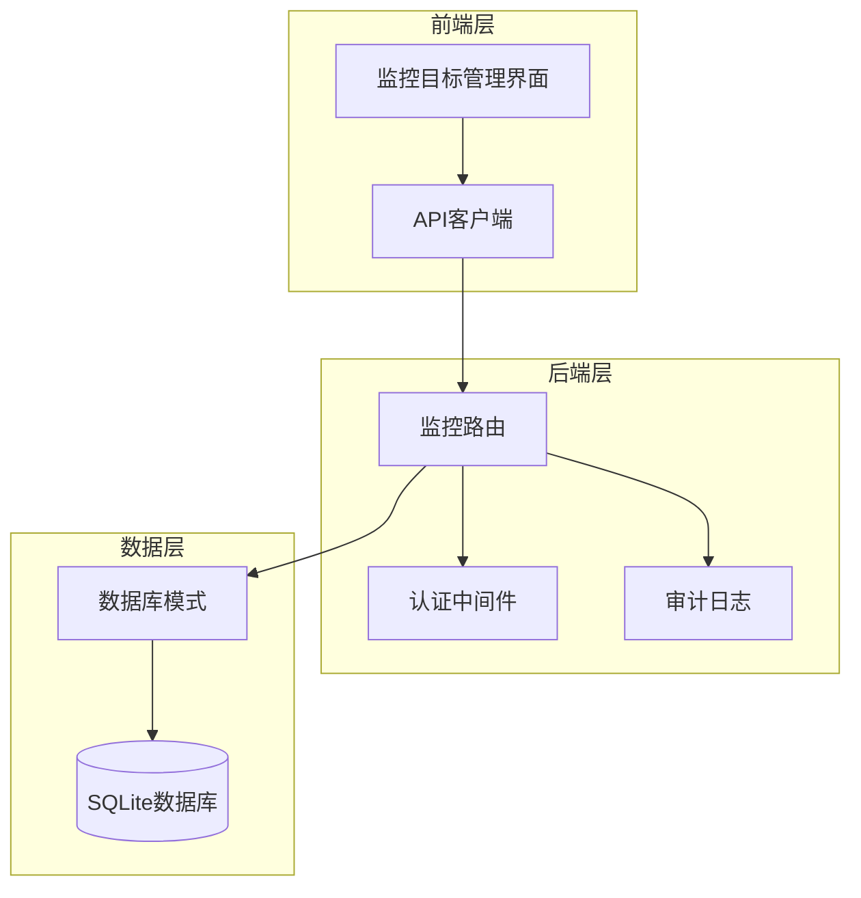
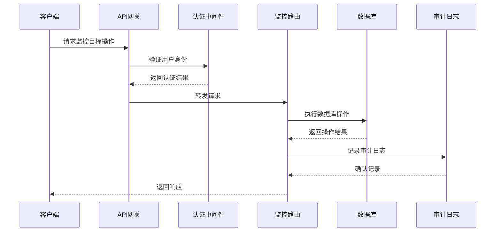
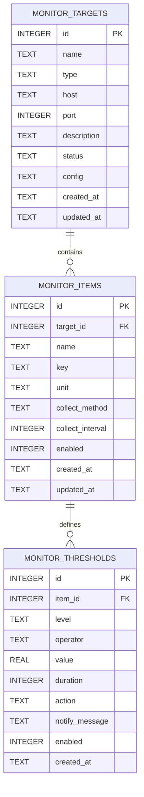
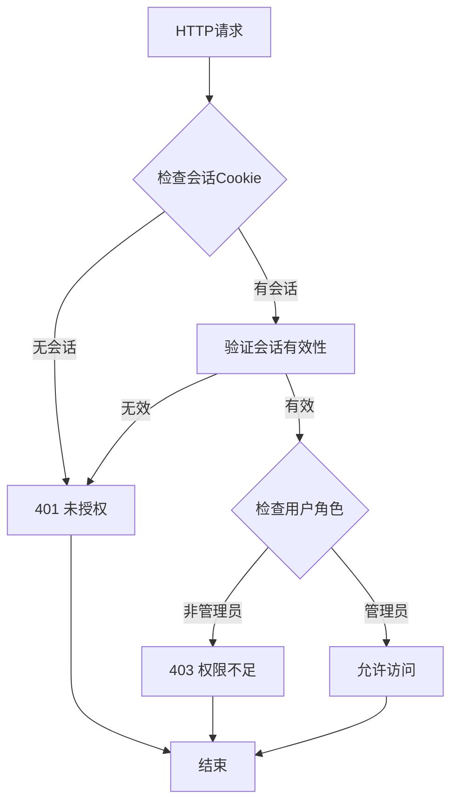
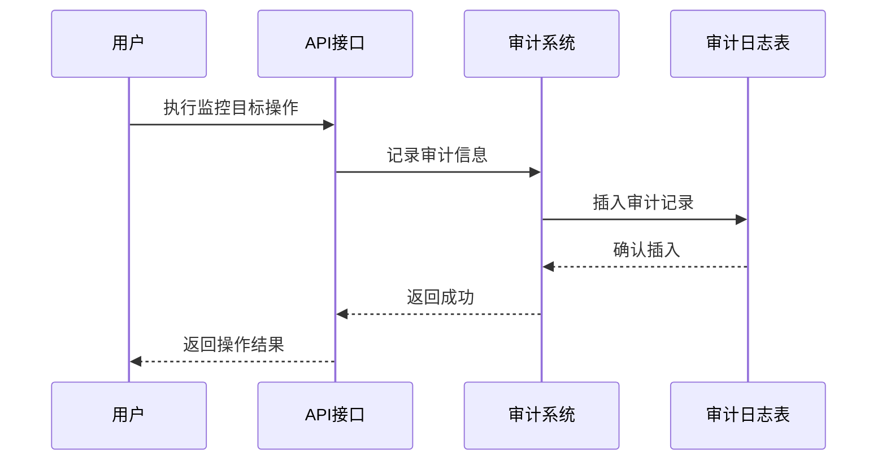
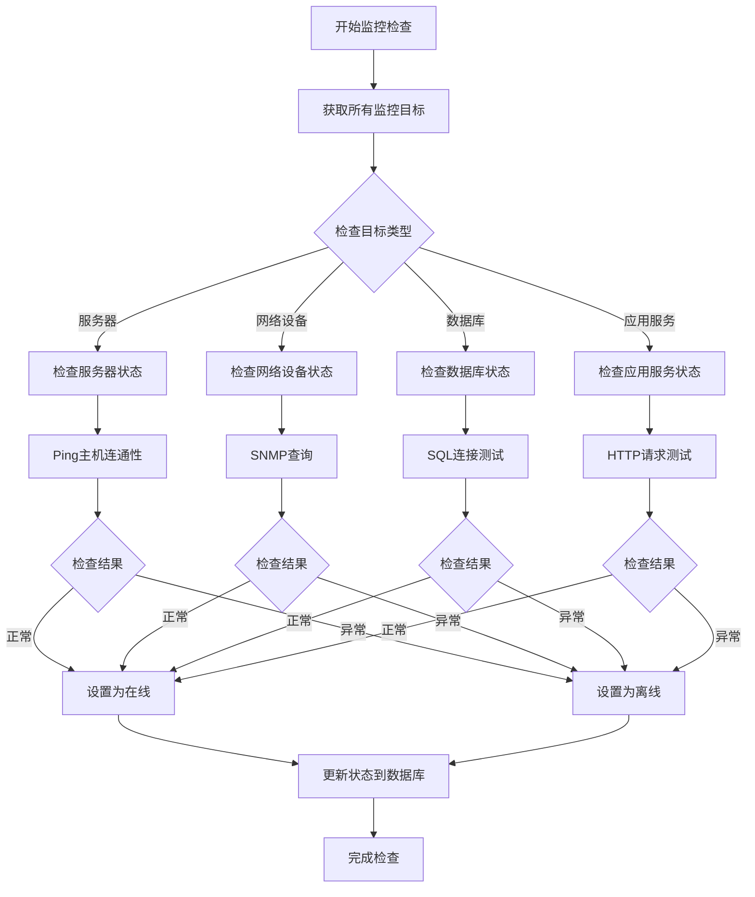
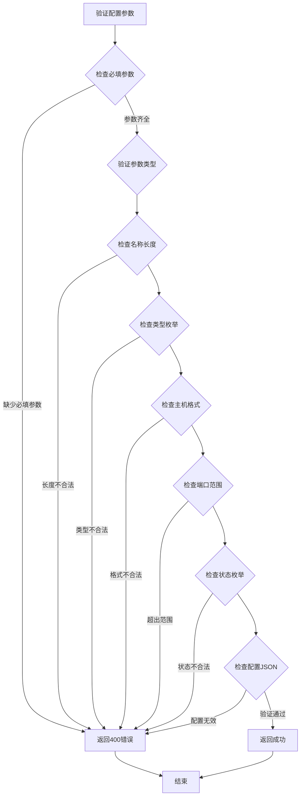
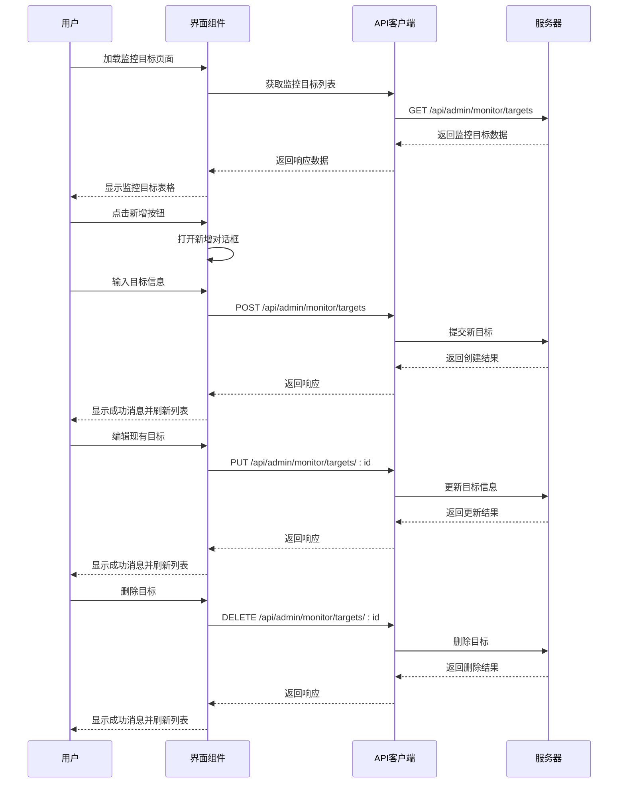
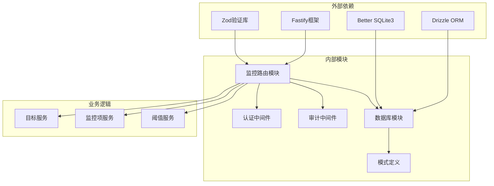

# 监控目标管理

<cite>
**本文引用的文件**
- [monitor.ts](file://apps/server/src/routes/monitor.ts)
- [schema.ts](file://apps/server/src/db/schema.ts)
- [auth.ts](file://apps/server/src/middleware/auth.ts)
- [audit.ts](file://apps/server/src/middleware/audit.ts)
- [MonitorTargets.tsx](file://apps/web/src/pages/admin/MonitorTargets.tsx)
- [api.ts](file://apps/web/src/lib/api.ts)
- [seed-demo.ts](file://apps/server/src/db/seed-demo.ts)
</cite>

## 目录
1. [简介](#简介)
2. [项目结构](#项目结构)
3. [核心组件](#核心组件)
4. [架构概览](#架构概览)
5. [详细组件分析](#详细组件分析)
6. [依赖关系分析](#依赖关系分析)
7. [性能考虑](#性能考虑)
8. [故障排除指南](#故障排除指南)
9. [结论](#结论)
10. [附录](#附录)

## 简介
本文件为ZBH2平台监控目标管理API的详细接口文档。文档覆盖监控目标的完整CRUD操作接口，包括目标类型定义、主机配置、端口设置、状态管理等功能。详细解释监控目标的健康状态检查机制、在线离线状态切换逻辑，以及目标配置参数的验证规则、默认值设置和错误处理策略。同时提供完整的请求/响应示例，涵盖目标创建、更新、删除、状态查询等场景，并给出监控目标分类管理、批量操作和状态监控的最佳实践建议。

## 项目结构
监控目标管理功能主要分布在以下模块中：
- 后端路由：apps/server/src/routes/monitor.ts
- 数据库模式：apps/server/src/db/schema.ts
- 认证中间件：apps/server/src/middleware/auth.ts
- 审计日志：apps/server/src/middleware/audit.ts
- 前端页面：apps/web/src/pages/admin/MonitorTargets.tsx
- API客户端：apps/web/src/lib/api.ts
- 示例数据：apps/server/src/db/seed-demo.ts



**图表来源**
- [monitor.ts:13-594](file://apps/server/src/routes/monitor.ts#L13-L594)
- [schema.ts:217-228](file://apps/server/src/db/schema.ts#L217-L228)

**章节来源**
- [monitor.ts:1-594](file://apps/server/src/routes/monitor.ts#L1-L594)
- [schema.ts:217-228](file://apps/server/src/db/schema.ts#L217-L228)

## 核心组件
监控目标管理API由以下核心组件构成：

### 数据模型
监控目标使用独立的数据表进行存储，支持多种目标类型和状态管理。

### 路由控制器
提供完整的RESTful API接口，包括CRUD操作和状态查询功能。

### 验证与授权
通过认证中间件确保只有管理员用户可以访问监控管理功能。

### 审计追踪
所有监控目标变更操作都会记录到审计日志中，便于追踪和合规要求。

**章节来源**
- [schema.ts:217-228](file://apps/server/src/db/schema.ts#L217-L228)
- [monitor.ts:13-594](file://apps/server/src/routes/monitor.ts#L13-L594)
- [auth.ts:48-55](file://apps/server/src/middleware/auth.ts#L48-L55)

## 架构概览
监控目标管理系统采用分层架构设计，确保职责分离和可维护性。



**图表来源**
- [monitor.ts:13-14](file://apps/server/src/routes/monitor.ts#L13-L14)
- [auth.ts:48-55](file://apps/server/src/middleware/auth.ts#L48-L55)
- [audit.ts:3-27](file://apps/server/src/middleware/audit.ts#L3-L27)

## 详细组件分析

### 数据模型设计

监控目标使用专门的数据表进行存储，具有以下关键特性：



**图表来源**
- [schema.ts:217-254](file://apps/server/src/db/schema.ts#L217-L254)

#### 监控目标字段定义
- **id**: 自增主键，唯一标识监控目标
- **name**: 监控目标名称，必填字段
- **type**: 监控目标类型，枚举值包括device、system、database、service
- **host**: 主机地址，可选字段
- **port**: 端口号，可选字段
- **description**: 目标描述，可选字段
- **status**: 当前状态，枚举值包括online、offline、warning、critical，默认online
- **config**: 配置JSON对象，可选字段
- **createdAt/updatedAt**: 创建和更新时间戳

#### 默认值和约束
- 类型字段默认值为'system'
- 状态字段默认值为'online'
- 收集间隔默认值为60秒
- 启用状态默认值为1（启用）

**章节来源**
- [schema.ts:217-228](file://apps/server/src/db/schema.ts#L217-L228)
- [schema.ts:230-241](file://apps/server/src/db/schema.ts#L230-L241)
- [schema.ts:243-254](file://apps/server/src/db/schema.ts#L243-L254)

### 认证与授权机制

系统采用基于会话的认证机制，确保只有管理员用户可以访问监控管理功能：



**图表来源**
- [auth.ts:17-40](file://apps/server/src/middleware/auth.ts#L17-L40)
- [auth.ts:48-55](file://apps/server/src/middleware/auth.ts#L48-L55)

#### 认证流程
1. 检查请求中的会话Cookie
2. 验证会话是否有效且未过期
3. 确认用户状态为活跃
4. 检查用户角色必须为admin
5. 允许后续的监控操作

**章节来源**
- [auth.ts:17-55](file://apps/server/src/middleware/auth.ts#L17-L55)

### 审计日志系统

所有监控目标操作都会被记录到审计日志中，提供完整的操作追踪能力：



**图表来源**
- [audit.ts:3-27](file://apps/server/src/middleware/audit.ts#L3-L27)
- [monitor.ts:49-56](file://apps/server/src/routes/monitor.ts#L49-L56)

#### 审计记录内容
- 用户ID和用户名
- 操作类型（create/update/delete）
- 目标类型和ID
- 目标名称
- IP地址和User-Agent
- 操作结果状态

**章节来源**
- [audit.ts:3-27](file://apps/server/src/middleware/audit.ts#L3-L27)
- [monitor.ts:49-98](file://apps/server/src/routes/monitor.ts#L49-L98)

### 监控目标API接口

#### 获取监控目标列表
**GET** `/api/admin/monitor/targets`

**查询参数**
- page: 页码，默认1，最小1
- pageSize: 每页数量，默认20，最大100
- type: 目标类型过滤器

**响应示例**
```json
{
  "success": true,
  "data": {
    "items": [
      {
        "id": 1,
        "name": "正版化平台Web服务器",
        "type": "system",
        "host": "192.168.1.10",
        "port": 8080,
        "status": "online",
        "description": "正版化平台主Web服务器",
        "createdAt": "2024-01-01T00:00:00Z",
        "updatedAt": "2024-01-01T00:00:00Z"
      }
    ],
    "total": 10,
    "page": 1,
    "pageSize": 20
  }
}
```

**章节来源**
- [monitor.ts:17-32](file://apps/server/src/routes/monitor.ts#L17-L32)

#### 创建监控目标
**POST** `/api/admin/monitor/targets`

**请求体参数**
- name: 监控目标名称（必填）
- type: 目标类型（必填）
- host: 主机地址（可选）
- port: 端口号（可选）
- description: 目标描述（可选）
- status: 初始状态（可选，默认online）
- config: 配置JSON（可选）

**请求示例**
```json
{
  "name": "测试服务器",
  "type": "server",
  "host": "192.168.1.100",
  "port": 80,
  "description": "测试环境Web服务器",
  "status": "online"
}
```

**响应示例**
```json
{
  "success": true,
  "data": {
    "id": 101,
    "name": "测试服务器",
    "type": "server",
    "host": "192.168.1.100",
    "port": 80,
    "status": "online",
    "description": "测试环境Web服务器",
    "createdAt": "2024-01-01T00:00:00Z",
    "updatedAt": "2024-01-01T00:00:00Z"
  }
}
```

**错误处理**
- 400 错误：当name或type参数缺失时返回错误
- 401 错误：未登录用户访问
- 403 错误：非管理员用户访问

**章节来源**
- [monitor.ts:34-58](file://apps/server/src/routes/monitor.ts#L34-L58)

#### 更新监控目标
**PUT** `/api/admin/monitor/targets/:id`

**路径参数**
- id: 目标ID（必填）

**请求体参数**
支持更新以下字段：
- name: 监控目标名称
- type: 目标类型
- host: 主机地址
- port: 端口号
- description: 目标描述
- status: 目标状态
- config: 配置JSON

**请求示例**
```json
{
  "status": "warning",
  "description": "磁盘空间紧张",
  "config": {
    "monitoring": true,
    "interval": 30
  }
}
```

**响应示例**
```json
{
  "success": true
}
```

**错误处理**
- 404 错误：目标不存在
- 401 错误：未登录用户访问
- 403 错误：非管理员用户访问

**章节来源**
- [monitor.ts:60-81](file://apps/server/src/routes/monitor.ts#L60-L81)

#### 删除监控目标
**DELETE** `/api/admin/monitor/targets/:id`

**路径参数**
- id: 目标ID（必填）

**响应示例**
```json
{
  "success": true
}
```

**错误处理**
- 404 错误：目标不存在
- 401 错误：未登录用户访问
- 403 错误：非管理员用户访问

**章节来源**
- [monitor.ts:83-99](file://apps/server/src/routes/monitor.ts#L83-L99)

#### 查询监控目标状态
**GET** `/api/admin/monitor/targets/:id/status`

**路径参数**
- id: 目标ID（必填）

**响应示例**
```json
{
  "success": true,
  "data": {
    "id": 1,
    "name": "正版化平台Web服务器",
    "status": "online"
  }
}
```

**错误处理**
- 404 错误：目标不存在
- 401 错误：未登录用户访问
- 403 错误：非管理员用户访问

**章节来源**
- [monitor.ts:101-106](file://apps/server/src/routes/monitor.ts#L101-L106)

### 健康状态检查机制

监控目标的健康状态检查机制通过以下方式实现：



**图表来源**
- [monitor.ts:101-106](file://apps/server/src/routes/monitor.ts#L101-L106)
- [schema.ts:217-228](file://apps/server/src/db/schema.ts#L217-L228)

#### 状态切换逻辑
监控目标的状态切换遵循以下规则：
1. **在线状态**：目标能够正常响应检查请求
2. **离线状态**：目标无法响应检查请求或连接失败
3. **警告状态**：目标部分功能异常但未完全失效
4. **严重状态**：目标完全不可用或出现严重问题

#### 状态检查频率
- 默认检查间隔：60秒
- 可根据目标类型调整检查频率
- 关键目标可设置更短的检查间隔

**章节来源**
- [monitor.ts:101-106](file://apps/server/src/routes/monitor.ts#L101-L106)
- [schema.ts:217-228](file://apps/server/src/db/schema.ts#L217-L228)

### 配置参数验证规则

监控目标的配置参数遵循严格的验证规则：



**图表来源**
- [monitor.ts:36-37](file://apps/server/src/routes/monitor.ts#L36-L37)
- [monitor.ts:67-68](file://apps/server/src/routes/monitor.ts#L67-L68)

#### 参数验证规则
- **名称验证**：必填，长度1-200字符
- **类型验证**：必填，必须是预定义的枚举值之一
- **主机验证**：可选，有效的IP地址或域名格式
- **端口验证**：可选，1-65535之间的整数
- **状态验证**：可选，枚举值包括online、offline、warning、critical
- **配置验证**：可选，有效的JSON对象字符串

#### 默认值设置
- 状态默认值：online
- 端口默认值：null（表示不指定端口）
- 配置默认值：null（表示无特殊配置）

**章节来源**
- [monitor.ts:36-47](file://apps/server/src/routes/monitor.ts#L36-L47)
- [monitor.ts:66-69](file://apps/server/src/routes/monitor.ts#L66-L69)

### 前端集成示例

前端监控目标管理界面提供了完整的用户交互体验：



**图表来源**
- [MonitorTargets.tsx:33-62](file://apps/web/src/pages/admin/MonitorTargets.tsx#L33-L62)
- [api.ts:3-15](file://apps/web/src/lib/api.ts#L3-L15)

#### 前端功能特性
- 分页显示监控目标列表
- 实时状态颜色标识
- 表单验证和错误提示
- 成功操作的消息反馈
- 响应式表格布局

**章节来源**
- [MonitorTargets.tsx:24-109](file://apps/web/src/pages/admin/MonitorTargets.tsx#L24-L109)
- [api.ts:1-16](file://apps/web/src/lib/api.ts#L1-L16)

## 依赖关系分析

监控目标管理系统的依赖关系如下：



**图表来源**
- [monitor.ts:1-5](file://apps/server/src/routes/monitor.ts#L1-L5)
- [auth.ts:1-27](file://apps/server/src/middleware/auth.ts#L1-L27)
- [audit.ts:1-27](file://apps/server/src/middleware/audit.ts#L1-L27)

### 核心依赖
- **Fastify**: Web框架，提供HTTP请求处理能力
- **Drizzle ORM**: 数据库ORM，简化数据库操作
- **Better SQLite3**: SQLite数据库驱动
- **Zod**: 数据验证库，确保请求参数的有效性

### 内部模块依赖
- 路由模块依赖认证和审计中间件
- 数据库模块依赖模式定义
- 业务服务模块依赖数据库访问层

**章节来源**
- [monitor.ts:1-5](file://apps/server/src/routes/monitor.ts#L1-L5)
- [auth.ts:1-27](file://apps/server/src/middleware/auth.ts#L1-L27)
- [audit.ts:1-27](file://apps/server/src/middleware/audit.ts#L1-L27)

## 性能考虑

### 数据库优化
- 使用索引优化常用查询条件
- 实现分页查询避免大量数据传输
- 采用批量操作减少数据库往返

### 缓存策略
- 对于频繁读取的目标状态信息考虑缓存
- 实现适当的缓存失效机制
- 避免缓存过期导致的状态不一致

### 并发控制
- 使用数据库事务确保操作原子性
- 实现乐观锁防止并发更新冲突
- 合理设置超时时间避免长时间阻塞

### 监控指标
- 监控API响应时间
- 跟踪数据库查询性能
- 监测内存使用情况
- 分析错误率和异常模式

## 故障排除指南

### 常见错误及解决方案

#### 认证相关错误
- **401 未授权**: 检查会话Cookie是否正确传递，确认用户已登录
- **403 权限不足**: 确认用户角色为admin，检查用户权限设置

#### 数据验证错误
- **400 参数错误**: 检查请求参数格式，确保必填字段完整
- **404 目标不存在**: 确认目标ID有效，检查数据库中是否存在该记录

#### 数据库操作错误
- **500 服务器内部错误**: 检查数据库连接状态，查看数据库日志
- **并发冲突**: 实现重试机制，使用数据库事务处理

#### 前端集成问题
- **跨域问题**: 检查CORS配置，确保API域名正确设置
- **会话丢失**: 确认Cookie配置，检查浏览器隐私设置

### 调试技巧
1. 启用详细日志记录
2. 使用Postman或curl测试API
3. 检查网络请求和响应
4. 验证数据库状态和数据完整性

**章节来源**
- [monitor.ts:36-37](file://apps/server/src/routes/monitor.ts#L36-L37)
- [monitor.ts:63-64](file://apps/server/src/routes/monitor.ts#L63-L64)
- [auth.ts:42-55](file://apps/server/src/middleware/auth.ts#L42-L55)

## 结论
ZBH2平台的监控目标管理API提供了完整的监控目标生命周期管理能力。通过清晰的RESTful接口设计、严格的数据验证机制、完善的审计日志系统和灵活的配置选项，系统能够满足企业级监控需求。

关键优势包括：
- 完整的CRUD操作支持
- 灵活的状态管理和健康检查机制
- 严格的权限控制和审计追踪
- 用户友好的前端管理界面
- 可扩展的配置和自定义能力

建议在生产环境中结合实际业务需求，进一步完善监控策略和告警机制，确保系统的稳定运行和高效运维。

## 附录

### API接口汇总

| 方法 | 路径 | 功能描述 |
|------|------|----------|
| GET | /api/admin/monitor/targets | 获取监控目标列表 |
| POST | /api/admin/monitor/targets | 创建新的监控目标 |
| PUT | /api/admin/monitor/targets/:id | 更新监控目标信息 |
| DELETE | /api/admin/monitor/targets/:id | 删除监控目标 |
| GET | /api/admin/monitor/targets/:id/status | 查询监控目标状态 |

### 最佳实践建议

#### 监控目标分类管理
1. **合理命名**: 使用清晰、唯一的监控目标名称
2. **分类组织**: 按业务部门或技术栈对目标进行分类
3. **文档记录**: 维护目标配置和变更历史文档
4. **定期审查**: 定期清理不再使用的监控目标

#### 批量操作
1. **批量创建**: 使用脚本或工具批量导入监控目标
2. **批量更新**: 通过API统一更新多个目标的配置
3. **批量删除**: 谨慎执行批量删除操作，做好备份
4. **版本控制**: 对批量操作进行版本管理和回滚准备

#### 状态监控
1. **实时监控**: 设置合适的检查间隔，确保及时发现问题
2. **状态转换**: 建立明确的状态转换规则和告警机制
3. **历史追踪**: 保留状态变化的历史记录，便于问题分析
4. **性能优化**: 根据目标重要性调整检查频率和资源分配

#### 安全考虑
1. **权限控制**: 严格限制监控管理功能的访问权限
2. **数据保护**: 对敏感配置信息进行加密存储
3. **审计追踪**: 完整记录所有管理操作，便于合规审计
4. **网络安全**: 配置适当的防火墙和网络访问控制