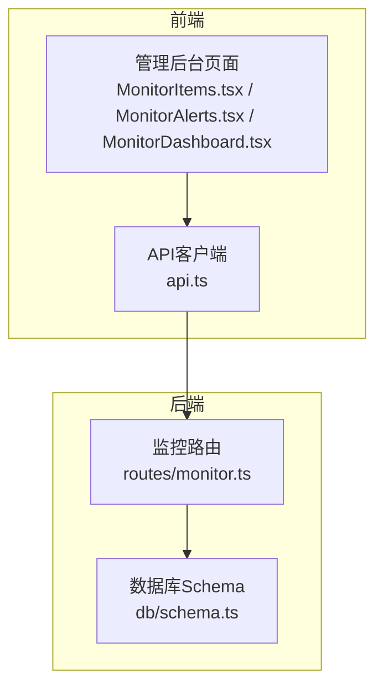
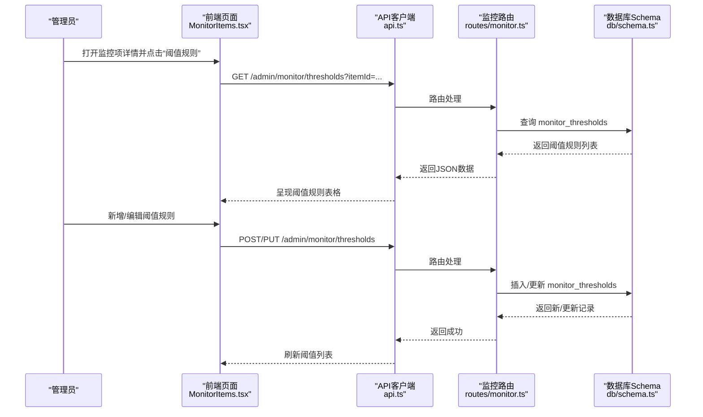
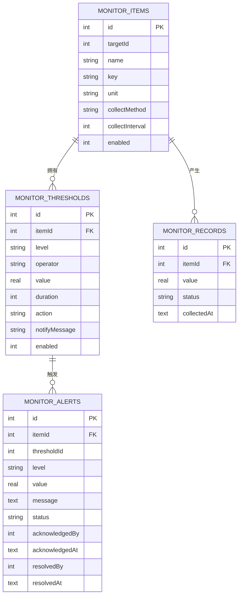
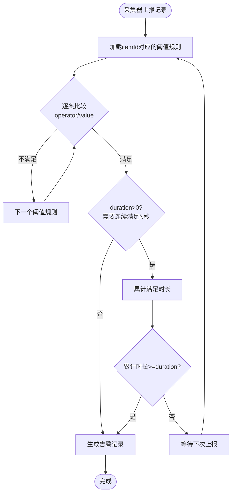
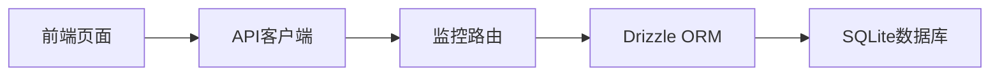

# 监控阈值管理

<cite>
**本文引用的文件列表**
- [apps/server/src/routes/monitor.ts](file://apps/server/src/routes/monitor.ts)
- [apps/server/src/db/schema.ts](file://apps/server/src/db/schema.ts)
- [apps/web/src/pages/admin/MonitorItems.tsx](file://apps/web/src/pages/admin/MonitorItems.tsx)
- [apps/web/src/pages/admin/MonitorAlerts.tsx](file://apps/web/src/pages/admin/MonitorAlerts.tsx)
- [apps/web/src/pages/admin/MonitorDashboard.tsx](file://apps/web/src/pages/admin/MonitorDashboard.tsx)
- [apps/web/src/lib/api.ts](file://apps/web/src/lib/api.ts)
- [README.md](file://README.md)
</cite>

## 目录
1. [简介](#简介)
2. [项目结构](#项目结构)
3. [核心组件](#核心组件)
4. [架构总览](#架构总览)
5. [详细组件分析](#详细组件分析)
6. [依赖关系分析](#依赖关系分析)
7. [性能考量](#性能考量)
8. [故障排查指南](#故障排查指南)
9. [结论](#结论)
10. [附录](#附录)

## 简介
本文件面向ZBH2平台的“监控阈值管理”能力，聚焦于阈值规则的配置与管理，包括阈值级别、比较运算符、数值阈值、持续时间、启用/禁用控制、通知消息与抑制策略等。文档从接口定义、数据模型、前后端交互、告警触发与处理流程、最佳实践与性能影响等方面进行系统化说明，帮助开发者与运维人员快速理解与落地。

## 项目结构
- 后端采用Fastify + Drizzle ORM，监控相关API集中在监控路由模块中，数据库表结构定义在schema中。
- 前端采用React + Ant Design，监控阈值管理页面通过API与后端交互，实现阈值规则的增删改查与告警处理。

图表来源
- [apps/web/src/pages/admin/MonitorItems.tsx:1-232](file://apps/web/src/pages/admin/MonitorItems.tsx#L1-232)
- [apps/web/src/pages/admin/MonitorAlerts.tsx:1-91](file://apps/web/src/pages/admin/MonitorAlerts.tsx#L1-91)
- [apps/web/src/pages/admin/MonitorDashboard.tsx:1-100](file://apps/web/src/pages/admin/MonitorDashboard.tsx#L1-100)
- [apps/web/src/lib/api.ts:1-16](file://apps/web/src/lib/api.ts#L1-16)
- [apps/server/src/routes/monitor.ts:167-214](file://apps/server/src/routes/monitor.ts#L167-L214)
- [apps/server/src/db/schema.ts:243-254](file://apps/server/src/db/schema.ts#L243-L254)

章节来源
- [README.md:47-68](file://README.md#L47-L68)

## 核心组件
- 监控阈值规则表：monitor_thresholds
  - 关键字段：itemId、level、operator、value、duration、action、notifyMessage、enabled
  - 外键：itemId -> monitor_items.id（级联删除）
- 监控项表：monitor_items
  - 关键字段：targetId、name、key、unit、collectMethod、collectInterval、enabled
- 监控记录表：monitor_records
  - 关键字段：itemId、value、status、collectedAt
- 告警表：monitor_alerts
  - 关键字段：itemId、thresholdId、level、value、message、status、acknowledged/resolved相关字段

章节来源
- [apps/server/src/db/schema.ts:243-277](file://apps/server/src/db/schema.ts#L243-L277)

## 架构总览
监控阈值管理的端到端流程如下：
- 前端页面加载监控项列表，打开“阈值规则”抽屉，拉取该监控项下的所有阈值规则。
- 管理员在阈值规则抽屉中新增/编辑/删除阈值规则，后端校验必填字段并持久化。
- 采集器周期性上报监控记录，后端根据阈值规则计算状态并生成告警。
- 前端告警中心展示告警，支持确认与解决。

图表来源
- [apps/web/src/pages/admin/MonitorItems.tsx:86-116](file://apps/web/src/pages/admin/MonitorItems.tsx#L86-L116)
- [apps/web/src/lib/api.ts:1-16](file://apps/web/src/lib/api.ts#L1-16)
- [apps/server/src/routes/monitor.ts:167-214](file://apps/server/src/routes/monitor.ts#L167-L214)
- [apps/server/src/db/schema.ts:243-254](file://apps/server/src/db/schema.ts#L243-L254)

## 详细组件分析

### 阈值规则数据模型
- 表：monitor_thresholds
  - 主键：id
  - 外键：itemId -> monitor_items.id（级联删除）
  - 字段含义：
    - level：告警级别，枚举值为 warning/critical
    - operator：比较运算符，枚举值为 gt/lt/eq/gte/lte
    - value：数值阈值（real）
    - duration：持续时间（秒），0表示立即触发
    - action：触发后的响应措施（字符串）
    - notifyMessage：通知消息模板（字符串）
    - enabled：是否启用（整型，1/0）
    - createdAt：创建时间

图表来源
- [apps/server/src/db/schema.ts:230-277](file://apps/server/src/db/schema.ts#L230-L277)

章节来源
- [apps/server/src/db/schema.ts:243-254](file://apps/server/src/db/schema.ts#L243-L254)

### 阈值规则接口定义
- 获取阈值规则列表
  - 方法：GET
  - 路径：/api/admin/monitor/items/:id/thresholds
  - 查询参数：无
  - 成功响应：返回阈值规则数组
- 创建阈值规则
  - 方法：POST
  - 路径：/api/admin/monitor/thresholds
  - 请求体字段：itemId、level、operator、value、duration、action、notifyMessage、enabled
  - 校验：itemId、level、operator、value为必填
  - 成功响应：返回新建阈值规则对象
- 更新阈值规则
  - 方法：PUT
  - 路径：/api/admin/monitor/thresholds/:id
  - 请求体字段：level、operator、value、duration、action、notifyMessage、enabled（可选）
  - 成功响应：返回成功
- 删除阈值规则
  - 方法：DELETE
  - 路径：/api/admin/monitor/thresholds/:id
  - 成功响应：返回成功

章节来源
- [apps/server/src/routes/monitor.ts:167-214](file://apps/server/src/routes/monitor.ts#L167-L214)

### 前端交互与页面行为
- 阈值规则抽屉
  - 打开抽屉时，调用后端接口拉取指定itemId的阈值规则列表
  - 支持新增、编辑、删除阈值规则
  - 新增/编辑时，自动注入itemId并提交到后端
- 告警中心
  - 支持按级别与状态筛选
  - 支持确认与解决操作（PUT /admin/monitor/alerts/:id/acknowledge 或 resolve）

章节来源
- [apps/web/src/pages/admin/MonitorItems.tsx:86-116](file://apps/web/src/pages/admin/MonitorItems.tsx#L86-L116)
- [apps/web/src/pages/admin/MonitorAlerts.tsx:37-47](file://apps/web/src/pages/admin/MonitorAlerts.tsx#L37-L47)

### 阈值触发与告警生成流程
- 采集器上报监控记录（monitor_records），包含itemId、value、collectedAt
- 后端根据阈值规则（monitor_thresholds）对每个记录进行匹配：
  - 匹配条件：itemId相同、enabled=1
  - 比较逻辑：根据operator与value进行比较
  - 持续时间：duration>0时，需连续满足N秒才触发
  - 状态计算：根据比较结果设置status（normal/warning/critical）
- 当触发阈值且状态变化时，生成告警记录（monitor_alerts），包含level、value、message、status等

图表来源
- [apps/server/src/db/schema.ts:256-262](file://apps/server/src/db/schema.ts#L256-L262)
- [apps/server/src/db/schema.ts:243-254](file://apps/server/src/db/schema.ts#L243-L254)
- [apps/server/src/db/schema.ts:264-277](file://apps/server/src/db/schema.ts#L264-L277)

## 依赖关系分析
- 路由依赖Drizzle ORM进行数据库访问
- 监控阈值规则依赖监控项存在性（外键约束）
- 告警依赖阈值规则存在性（外键可为空，但通常建议关联）
- 前端通过API客户端封装统一的REST调用

图表来源
- [apps/web/src/lib/api.ts:1-16](file://apps/web/src/lib/api.ts#L1-16)
- [apps/server/src/routes/monitor.ts:1-11](file://apps/server/src/routes/monitor.ts#L1-L11)
- [apps/server/src/db/schema.ts:1-10](file://apps/server/src/db/schema.ts#L1-L10)

章节来源
- [apps/server/src/routes/monitor.ts:1-11](file://apps/server/src/routes/monitor.ts#L1-L11)

## 性能考量
- 查询分页与过滤
  - 监控目标/项/记录/报告等接口均支持分页与过滤，避免一次性返回大量数据
  - 建议在高并发场景下限制每页大小，合理使用startTime/endTime过滤
- 阈值规则匹配复杂度
  - 单次上报记录需遍历该itemId的所有阈值规则，复杂度O(N)
  - 建议：
    - 将阈值规则数量控制在合理范围（如<10条）
    - 使用duration时注意CPU占用，避免过短的duration导致频繁触发
- 数据库索引建议
  - monitor_thresholds(itemId, enabled)
  - monitor_records(itemId, collectedAt)
  - monitor_alerts(itemId, status, level)
- 缓存与异步处理
  - 对高频读取的阈值规则可考虑内存缓存
  - 告警通知建议异步发送，避免阻塞主流程

## 故障排查指南
- 常见错误与处理
  - 400 错误：请求体缺少必填字段（itemId、level、operator、value）
  - 404 错误：更新/删除的阈值规则不存在
  - 告警状态变更：确认/解决接口仅允许在对应状态间转换
- 日志与审计
  - 后端对监控相关操作记录审计日志（audit_logs），可用于追踪问题
- 建议排查步骤
  - 确认监控项是否存在且enabled
  - 检查阈值规则的level/operator/value/duration配置
  - 查看monitor_records中最近上报值是否符合预期
  - 检查告警中心状态流转（pending -> acknowledged -> resolved）

章节来源
- [apps/server/src/routes/monitor.ts:175-191](file://apps/server/src/routes/monitor.ts#L175-L191)
- [apps/server/src/routes/monitor.ts:193-205](file://apps/server/src/routes/monitor.ts#L193-L205)
- [apps/server/src/db/schema.ts:301-314](file://apps/server/src/db/schema.ts#L301-L314)

## 结论
ZBH2平台的监控阈值管理以清晰的数据模型与简洁的API为核心，结合前端抽屉式交互与告警中心，实现了从阈值规则配置到告警处理的完整闭环。通过合理的配置与性能优化，可在保证实时性的前提下，稳定支撑多维度的监控需求。

## 附录

### 接口清单与示例

- 获取阈值规则列表
  - 方法：GET
  - 路径：/api/admin/monitor/items/:id/thresholds
  - 示例响应：返回阈值规则数组
- 创建阈值规则
  - 方法：POST
  - 路径：/api/admin/monitor/thresholds
  - 请求体示例字段：itemId, level, operator, value, duration, action, notifyMessage, enabled
  - 成功响应：返回新建阈值规则对象
- 更新阈值规则
  - 方法：PUT
  - 路径：/api/admin/monitor/thresholds/:id
  - 请求体示例字段：level, operator, value, duration, action, notifyMessage, enabled
  - 成功响应：返回成功
- 删除阈值规则
  - 方法：DELETE
  - 路径：/api/admin/monitor/thresholds/:id
  - 成功响应：返回成功

章节来源
- [apps/server/src/routes/monitor.ts:167-214](file://apps/server/src/routes/monitor.ts#L167-L214)

### 最佳实践
- 阈值级别与告警级别
  - 建议先设warning，再设critical；避免同级阈值过多导致告警风暴
- 比较运算符选择
  - CPU使用率、内存使用率等建议使用“大于”类运算符
  - 剩余空间、可用连接数等建议使用“小于”类运算符
- 持续时间设置
  - 对抖动较大的指标设置较长的duration，减少误报
- 启用/禁用控制
  - 对高风险阈值建议默认禁用，上线前手动启用
- 通知消息与抑制策略
  - 通知消息应包含关键上下文（指标名、当前值、阈值、时间）
  - 可通过action字段定义自动化处置（如重启服务、扩容实例等）
  - 抑制策略：同一级别告警在一定时间内只通知一次

### 告警策略设计
- 分层告警：warning用于预警，critical用于紧急处理
- 优先级排序：按业务影响程度排序，确保关键告警优先处理
- 回流检测：告警恢复后应有明确的回流通知，便于归档与复盘

### 性能影响评估
- 阈值规则匹配：O(N)复杂度，建议阈值规则数量控制在10以内
- 采集频率：根据指标重要性调整collectInterval，避免过度采集
- 数据库写入：告警生成与记录写入应考虑事务与索引，避免阻塞