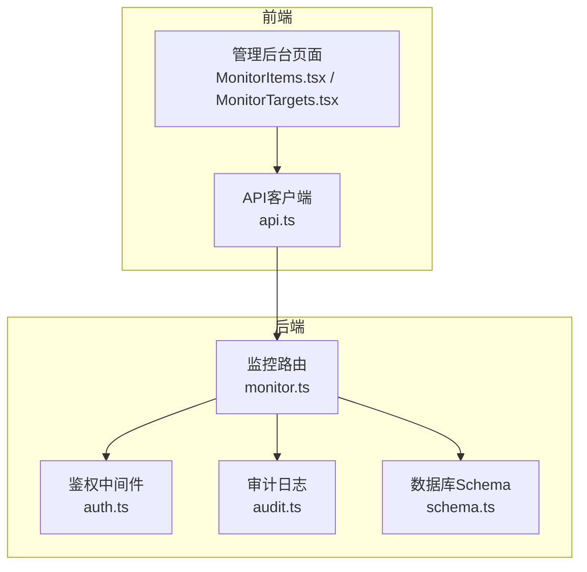
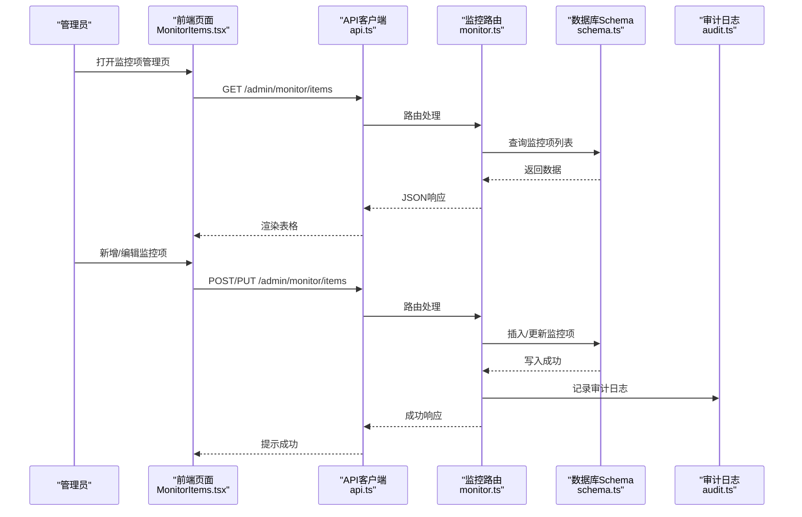
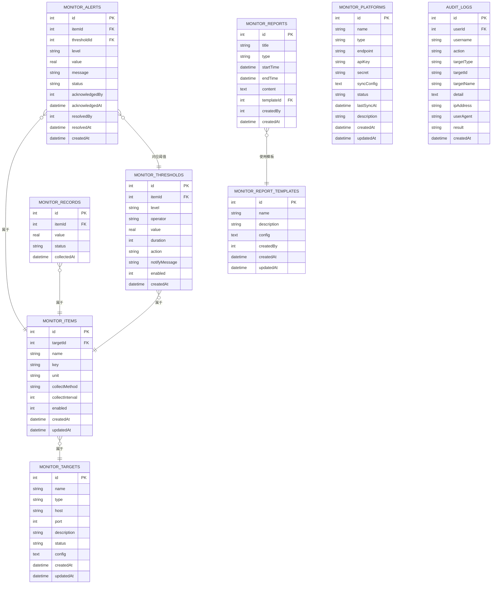

# 监控项管理

<cite>
**本文引用的文件列表**
- [monitor.ts](file://apps/server/src/routes/monitor.ts)
- [schema.ts](file://apps/server/src/db/schema.ts)
- [auth.ts](file://apps/server/src/middleware/auth.ts)
- [audit.ts](file://apps/server/src/middleware/audit.ts)
- [MonitorItems.tsx](file://apps/web/src/pages/admin/MonitorItems.tsx)
- [MonitorTargets.tsx](file://apps/web/src/pages/admin/MonitorTargets.tsx)
- [api.ts](file://apps/web/src/lib/api.ts)
- [types.ts](file://packages/shared/src/types.ts)
- [schemas.ts](file://packages/shared/src/schemas.ts)
- [README.md](file://README.md)
</cite>

## 目录
1. [简介](#简介)
2. [项目结构](#项目结构)
3. [核心组件](#核心组件)
4. [架构总览](#架构总览)
5. [详细组件分析](#详细组件分析)
6. [依赖关系分析](#依赖关系分析)
7. [性能考量](#性能考量)
8. [故障排查指南](#故障排查指南)
9. [结论](#结论)
10. [附录](#附录)

## 简介
本文件面向ZBH2平台的“监控项管理”API，系统性梳理监控目标绑定、指标键值定义、单位设置、采集方法与间隔、启用/禁用控制、阈值规则、生命周期与状态跟踪、审计与报表等能力。文档以接口定义、数据模型、调用流程与最佳实践为主线，帮助开发者与运维人员快速理解并正确使用监控项管理功能。

## 项目结构
- 后端采用Fastify + Drizzle ORM + SQLite，监控相关路由集中在监控模块。
- 前端使用React + Ant Design，监控项与目标管理页面通过统一的API客户端调用后端接口。
- 共享包提供基础类型与校验Schema，确保前后端契约一致。

图表来源
- [monitor.ts:13-595](file://apps/server/src/routes/monitor.ts#L13-L595)
- [auth.ts:48-55](file://apps/server/src/middleware/auth.ts#L48-L55)
- [audit.ts:3-27](file://apps/server/src/middleware/audit.ts#L3-L27)
- [schema.ts:216-330](file://apps/server/src/db/schema.ts#L216-L330)
- [api.ts:1-16](file://apps/web/src/lib/api.ts#L1-L16)

章节来源
- [monitor.ts:13-595](file://apps/server/src/routes/monitor.ts#L13-L595)
- [schema.ts:216-330](file://apps/server/src/db/schema.ts#L216-L330)
- [api.ts:1-16](file://apps/web/src/lib/api.ts#L1-L16)
- [README.md:47-68](file://README.md#L47-L68)

## 核心组件
- 监控目标（monitorTargets）：承载被监控对象（主机、服务、数据库等），支持状态与配置字段。
- 监控项（monitorItems）：具体指标的定义，包含名称、键名、单位、采集方法、采集间隔、启用状态等。
- 阈值规则（monitorThresholds）：对监控项设定告警阈值、比较运算符、持续时间、响应动作与通知内容。
- 监控记录（monitorRecords）：采集到的数值与状态，用于报表与历史分析。
- 告警（monitorAlerts）：基于阈值触发的告警事件，支持确认与解决。
- 平台接入（monitorPlatforms）：外部平台对接（Webhook/API/Agent）。
- 报表与模板（monitorReports / monitorReportTemplates）：周期性生成监控报告。
- 审计日志（auditLogs）：所有监控相关变更的审计追踪。

章节来源
- [schema.ts:216-330](file://apps/server/src/db/schema.ts#L216-L330)

## 架构总览
监控项管理的典型工作流：
- 管理员在前端页面创建/编辑监控目标与监控项。
- 后端根据采集方法与间隔调度采集任务（此处为概念流程图，实际采集实现不在本仓库中）。
- 采集结果写入监控记录，触发阈值规则判断，生成告警。
- 支持生成周期性报表，审计日志记录关键操作。

图表来源
- [MonitorItems.tsx:48-84](file://apps/web/src/pages/admin/MonitorItems.tsx#L48-L84)
- [api.ts:1-16](file://apps/web/src/lib/api.ts#L1-L16)
- [monitor.ts:126-164](file://apps/server/src/routes/monitor.ts#L126-L164)
- [schema.ts:230-241](file://apps/server/src/db/schema.ts#L230-L241)
- [audit.ts:3-27](file://apps/server/src/middleware/audit.ts#L3-L27)

## 详细组件分析

### 监控目标管理
- 功能要点
  - 列表分页查询，支持按类型过滤。
  - 创建、更新、删除目标；更新时记录审计日志。
  - 获取目标状态（在线/离线/警告/严重）。
- 关键字段
  - 名称、类型、主机、端口、描述、状态、配置。
- 接口清单
  - GET /api/admin/monitor/targets
  - POST /api/admin/monitor/targets
  - PUT /api/admin/monitor/targets/:id
  - DELETE /api/admin/monitor/targets/:id
  - GET /api/admin/monitor/targets/:id/status

章节来源
- [monitor.ts:16-106](file://apps/server/src/routes/monitor.ts#L16-L106)
- [schema.ts:216-228](file://apps/server/src/db/schema.ts#L216-L228)

### 监控项管理
- 功能要点
  - 监控项与监控目标建立外键关联。
  - 指标键值定义（key）、单位（unit）、采集方法（auto/manual/api）、采集间隔（秒）、启用状态。
  - 支持分页查询，按目标过滤。
- 关键字段
  - targetId、name、key、unit、collectMethod、collectInterval、enabled。
- 接口清单
  - GET /api/admin/monitor/items
  - POST /api/admin/monitor/items
  - PUT /api/admin/monitor/items/:id
  - DELETE /api/admin/monitor/items/:id

章节来源
- [monitor.ts:108-164](file://apps/server/src/routes/monitor.ts#L108-L164)
- [schema.ts:230-241](file://apps/server/src/db/schema.ts#L230-L241)

### 阈值规则管理
- 功能要点
  - 为监控项设置多条阈值规则，支持不同级别（warning/critical）与比较运算符（>, <, =, >=, <=）。
  - 支持持续时间（秒）、响应动作、通知消息、启用状态。
- 关键字段
  - itemId、level、operator、value、duration、action、notifyMessage、enabled。
- 接口清单
  - GET /api/admin/monitor/items/:id/thresholds
  - POST /api/admin/monitor/thresholds
  - PUT /api/admin/monitor/thresholds/:id
  - DELETE /api/admin/monitor/thresholds/:id

章节来源
- [monitor.ts:166-214](file://apps/server/src/routes/monitor.ts#L166-L214)
- [schema.ts:243-254](file://apps/server/src/db/schema.ts#L243-L254)

### 监控数据记录与告警
- 功能要点
  - 记录采集值与状态（normal/warning/critical），支持按时间范围过滤。
  - 告警支持确认（acknowledge）与解决（resolve），记录处理人与时间。
- 关键字段
  - monitorRecords：itemId、value、status、collectedAt
  - monitorAlerts：itemId、thresholdId、level、value、message、status、acknowledged*/resolved*、createdAt
- 接口清单
  - GET /api/admin/monitor/records
  - GET /api/admin/monitor/alerts
  - PUT /api/admin/monitor/alerts/:id/acknowledge
  - PUT /api/admin/monitor/alerts/:id/resolve

章节来源
- [monitor.ts:216-288](file://apps/server/src/routes/monitor.ts#L216-L288)
- [schema.ts:256-277](file://apps/server/src/db/schema.ts#L256-L277)

### 平台接入与测试
- 功能要点
  - 支持Webhook、API、Agent等接入类型，可配置端点、密钥、同步配置与状态。
  - 提供连接测试接口，模拟连通性检测。
- 关键字段
  - name、type、endpoint、apiKey、secret、syncConfig、status、lastSyncAt、description。
- 接口清单
  - GET/POST/PUT/DELETE /api/admin/monitor/platforms
  - POST /api/admin/monitor/platforms/:id/test

章节来源
- [monitor.ts:489-593](file://apps/server/src/routes/monitor.ts#L489-L593)
- [schema.ts:316-329](file://apps/server/src/db/schema.ts#L316-L329)

### 报表与模板
- 功能要点
  - 生成周期性监控报告（daily/weekly/monthly/custom），支持模板配置。
  - 报告内容包含时间范围、总数、每项统计（最小/最大/平均、告警次数）。
- 关键字段
  - monitorReports：title、type、startTime、endTime、content、templateId、createdBy
  - monitorReportTemplates：name、description、config、createdBy
- 接口清单
  - GET /api/admin/monitor/reports
  - POST /api/admin/monitor/reports/generate
  - GET /api/admin/monitor/reports/:id
  - DELETE /api/admin/monitor/reports/:id
  - GET/POST/PUT/DELETE /api/admin/monitor/report-templates

章节来源
- [monitor.ts:321-453](file://apps/server/src/routes/monitor.ts#L321-L453)
- [schema.ts:279-299](file://apps/server/src/db/schema.ts#L279-L299)

### 审计日志
- 功能要点
  - 记录管理员对监控资源的所有关键操作（create/update/delete/view/export/config）。
  - 支持按用户、动作、目标类型、时间范围筛选。
- 关键字段
  - auditLogs：userId、username、action、targetType、targetId、targetName、detail、ipAddress、userAgent、result、createdAt
- 接口清单
  - GET /api/admin/monitor/audit-logs
  - GET /api/admin/monitor/audit-logs/stats

章节来源
- [monitor.ts:455-487](file://apps/server/src/routes/monitor.ts#L455-L487)
- [schema.ts:301-314](file://apps/server/src/db/schema.ts#L301-L314)

### 前端交互与数据流
- 前端页面通过统一API客户端调用后端接口，支持分页、搜索、编辑、删除等操作。
- 监控项页面提供阈值规则抽屉式管理，支持新增/编辑/删除阈值规则。

章节来源
- [MonitorItems.tsx:48-116](file://apps/web/src/pages/admin/MonitorItems.tsx#L48-L116)
- [MonitorTargets.tsx:33-62](file://apps/web/src/pages/admin/MonitorTargets.tsx#L33-L62)
- [api.ts:1-16](file://apps/web/src/lib/api.ts#L1-L16)

## 依赖关系分析

图表来源
- [schema.ts:216-330](file://apps/server/src/db/schema.ts#L216-L330)

章节来源
- [schema.ts:216-330](file://apps/server/src/db/schema.ts#L216-L330)

## 性能考量
- 分页与过滤
  - 列表接口均支持分页与条件过滤，建议在大数据量场景下合理设置pageSize并使用过滤参数减少传输。
- 查询优化
  - 对高频查询（如按itemId、时间范围）建议在数据库层面建立索引（当前Schema未显式声明索引，可结合业务增长情况评估）。
- 采集与存储
  - 采集间隔与频率应与监控目标负载匹配，避免频繁采集造成压力。
  - 建议定期清理历史记录与归档旧报表，控制数据库体积。
- 前端渲染
  - 大表格建议启用虚拟滚动与懒加载，提升交互体验。

## 故障排查指南
- 权限问题
  - 所有监控相关接口均需管理员权限，若返回401/403，请检查登录状态与角色。
- 参数校验
  - 创建/更新接口对必填字段进行校验，错误时返回400及错误信息。
- 审计追踪
  - 使用审计日志接口定位最近的关键操作，核对操作人、目标类型与结果。
- 告警处理
  - 使用确认/解决接口更新告警状态，确保处理链路闭环。

章节来源
- [auth.ts:48-55](file://apps/server/src/middleware/auth.ts#L48-L55)
- [monitor.ts:34-58](file://apps/server/src/routes/monitor.ts#L34-L58)
- [audit.ts:3-27](file://apps/server/src/middleware/audit.ts#L3-L27)

## 结论
监控项管理模块提供了从目标到指标、从阈值到告警、从报表到审计的完整闭环。通过清晰的接口与严谨的数据模型，平台能够支撑多样化的监控需求。建议在生产环境中结合业务规模优化采集策略与数据清理策略，并充分利用审计日志保障可追溯性。

## 附录

### 接口定义与示例

- 监控目标
  - GET /api/admin/monitor/targets?page=&pageSize=&type=
  - POST /api/admin/monitor/targets
    - 请求体示例（字段名与含义见“核心组件”）
    - 响应示例：success=true，data=目标对象
  - PUT /api/admin/monitor/targets/:id
  - DELETE /api/admin/monitor/targets/:id
  - GET /api/admin/monitor/targets/:id/status

- 监控项
  - GET /api/admin/monitor/items?page=&pageSize=&targetId=
  - POST /api/admin/monitor/items
    - 请求体示例：targetId、name、key、unit、collectMethod、collectInterval、enabled
    - 响应示例：success=true，data=监控项对象
  - PUT /api/admin/monitor/items/:id
  - DELETE /api/admin/monitor/items/:id

- 阈值规则
  - GET /api/admin/monitor/items/:id/thresholds
  - POST /api/admin/monitor/thresholds
    - 请求体示例：itemId、level、operator、value、duration、action、notifyMessage、enabled
  - PUT /api/admin/monitor/thresholds/:id
  - DELETE /api/admin/monitor/thresholds/:id

- 监控数据与告警
  - GET /api/admin/monitor/records?page=&pageSize=&itemId=&startTime=&endTime=
  - GET /api/admin/monitor/alerts?page=&pageSize=&status=&level=
  - PUT /api/admin/monitor/alerts/:id/acknowledge
  - PUT /api/admin/monitor/alerts/:id/resolve

- 平台接入
  - GET/POST/PUT/DELETE /api/admin/monitor/platforms
  - POST /api/admin/monitor/platforms/:id/test

- 报表与模板
  - GET /api/admin/monitor/reports
  - POST /api/admin/monitor/reports/generate
    - 请求体示例：title、type、startTime、endTime、templateId、content（可选）
  - GET /api/admin/monitor/reports/:id
  - DELETE /api/admin/monitor/reports/:id
  - GET/POST/PUT/DELETE /api/admin/monitor/report-templates

- 审计日志
  - GET /api/admin/monitor/audit-logs?page=&pageSize=&userId=&action=&targetType=&startTime=&endTime=
  - GET /api/admin/monitor/audit-logs/stats

章节来源
- [monitor.ts:16-593](file://apps/server/src/routes/monitor.ts#L16-L593)

### 数据模型字段说明
- 监控目标（monitorTargets）
  - id、name、type、host、port、description、status、config、createdAt、updatedAt
- 监控项（monitorItems）
  - id、targetId、name、key、unit、collectMethod、collectInterval、enabled、createdAt、updatedAt
- 阈值规则（monitorThresholds）
  - id、itemId、level、operator、value、duration、action、notifyMessage、enabled、createdAt
- 监控记录（monitorRecords）
  - id、itemId、value、status、collectedAt
- 告警（monitorAlerts）
  - id、itemId、thresholdId、level、value、message、status、acknowledgedBy、acknowledgedAt、resolvedBy、resolvedAt、createdAt
- 报表（monitorReports）
  - id、title、type、startTime、endTime、content、templateId、createdBy、createdAt
- 报表模板（monitorReportTemplates）
  - id、name、description、config、createdBy、createdAt、updatedAt
- 平台接入（monitorPlatforms）
  - id、name、type、endpoint、apiKey、secret、syncConfig、status、lastSyncAt、description、createdAt、updatedAt
- 审计日志（auditLogs）
  - id、userId、username、action、targetType、targetId、targetName、detail、ipAddress、userAgent、result、createdAt

章节来源
- [schema.ts:216-330](file://apps/server/src/db/schema.ts#L216-L330)

### 命名规范与设计原则
- 监控项命名
  - 建议采用“业务域.指标类型”的层级命名，例如 cpu.usage、mem.free、disk.io_wait。
- 指标键值
  - 键名应简洁、稳定且具备唯一性，避免跨目标冲突。
- 单位设置
  - 明确单位（如%，MB、ms），便于可视化与阈值对比。
- 采集策略
  - 自动采集：适合标准化指标，按固定间隔轮询。
  - 手动采集：适合一次性或低频指标，由业务触发。
  - API采集：适合通过第三方接口获取的指标。
- 采集间隔
  - 根据指标重要性与成本平衡设置，高频指标应关注存储与计算压力。
- 启用/禁用
  - 新建默认启用，异常或维护期可临时禁用，避免误报。
- 阈值设计
  - 建议先设warning再设critical，区分告警级别。
  - 比较运算符与持续时间组合，降低抖动影响。
- 生命周期管理
  - 建议建立“创建—启用—观察—调整—停用/删除”的闭环流程。
- 性能优化
  - 合理分页、索引与缓存；定期归档历史数据；限制过长的时间窗口查询。

### 采集方法与平台对接
- 采集方法
  - auto：自动采集（默认）
  - manual：手动采集
  - api：通过API采集
- 平台类型
  - webhook、api、agent
- 平台测试
  - 提供连接测试接口，模拟连通性检测并恢复状态。

章节来源
- [monitor.ts:126-141](file://apps/server/src/routes/monitor.ts#L126-L141)
- [monitor.ts:489-593](file://apps/server/src/routes/monitor.ts#L489-L593)
- [schema.ts:230-241](file://apps/server/src/db/schema.ts#L230-L241)
- [schema.ts:316-329](file://apps/server/src/db/schema.ts#L316-L329)