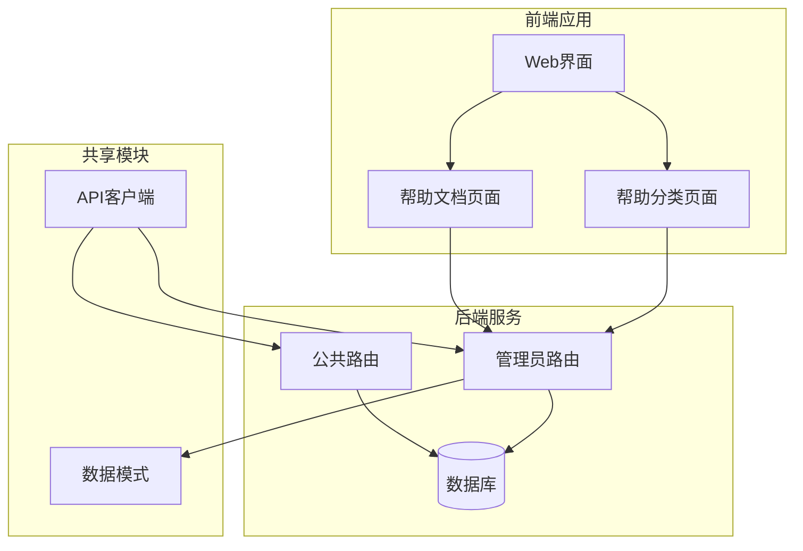
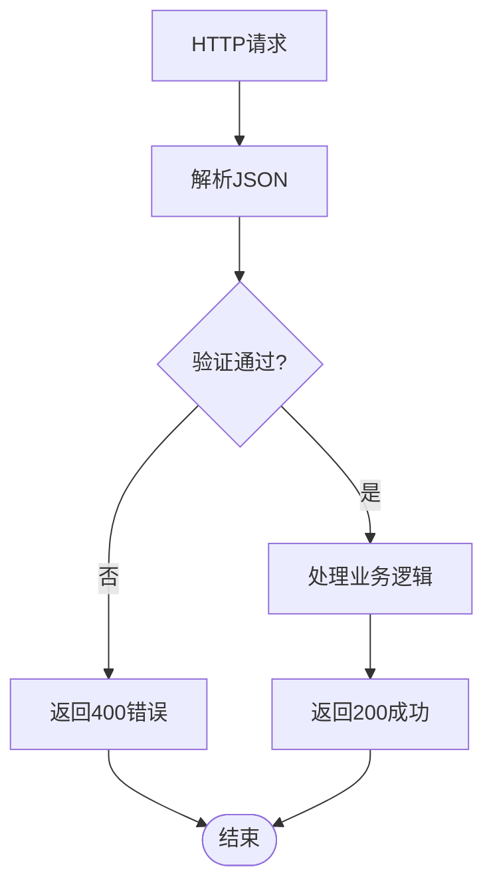
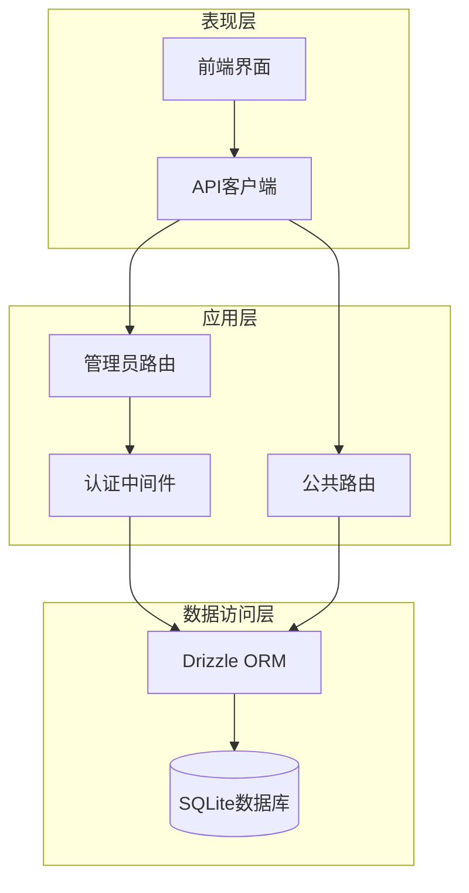
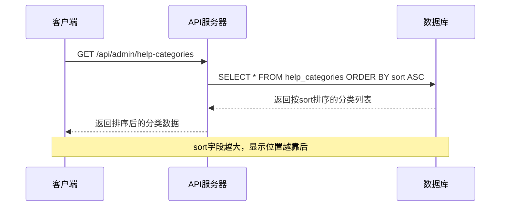
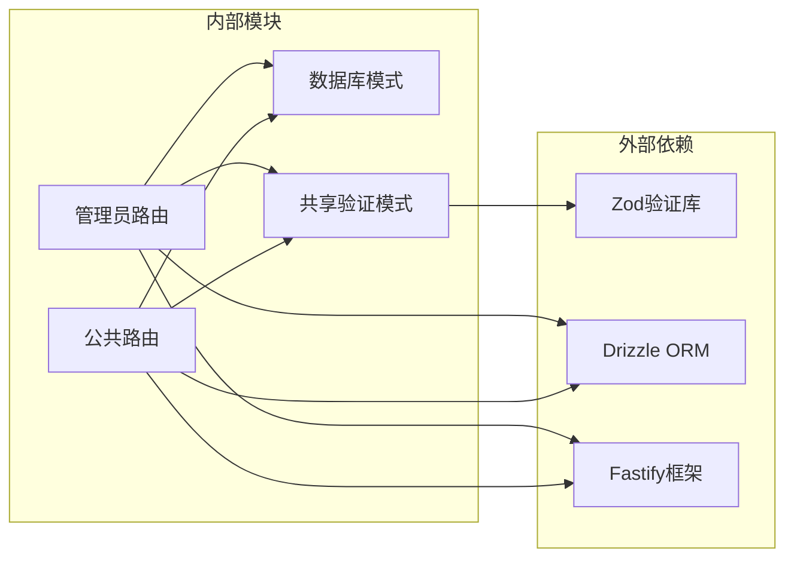

# 帮助分类管理API

<cite>
**本文档引用的文件**
- [admin.ts](file://apps/server/src/routes/admin.ts)
- [public.ts](file://apps/server/src/routes/public.ts)
- [schema.ts](file://apps/server/src/db/schema.ts)
- [HelpCategories.tsx](file://apps/web/src/pages/admin/HelpCategories.tsx)
- [HelpDocuments.tsx](file://apps/web/src/pages/admin/HelpDocuments.tsx)
- [api.ts](file://apps/web/src/lib/api.ts)
- [schemas.ts](file://packages/shared/src/schemas.ts)
- [seed.ts](file://apps/server/src/db/seed.ts)
</cite>

## 目录
1. [简介](#简介)
2. [项目结构](#项目结构)
3. [核心组件](#核心组件)
4. [架构概览](#架构概览)
5. [详细组件分析](#详细组件分析)
6. [依赖关系分析](#依赖关系分析)
7. [性能考虑](#性能考虑)
8. [故障排除指南](#故障排除指南)
9. [结论](#结论)

## 简介

本文档详细说明了ZBH2平台的帮助分类管理API，包括帮助分类的CRUD操作接口、排序机制、层级结构维护、数据验证规则和业务约束。帮助分类是帮助文档系统的组织基础，通过分类可以对帮助文档进行有序管理和展示。

## 项目结构

帮助分类管理功能涉及以下关键组件：



**图表来源**
- [admin.ts:75-100](file://apps/server/src/routes/admin.ts#L75-L100)
- [public.ts:26-44](file://apps/server/src/routes/public.ts#L26-L44)
- [HelpCategories.tsx:1-70](file://apps/web/src/pages/admin/HelpCategories.tsx#L1-L70)

**章节来源**
- [admin.ts:1-279](file://apps/server/src/routes/admin.ts#L1-L279)
- [public.ts:1-52](file://apps/server/src/routes/public.ts#L1-L52)

## 核心组件

### 数据模型

帮助分类使用SQLite数据库表结构，包含以下字段：
- `id`: 自增主键标识符
- `name`: 分类名称（必填，1-100字符）
- `sort`: 排序权重（整数，默认0）
- `createdAt`: 创建时间戳

帮助文档与分类的关系通过外键关联：
- `helpDocuments.categoryId` 引用 `helpCategories.id`

**章节来源**
- [schema.ts:51-69](file://apps/server/src/db/schema.ts#L51-L69)

### 数据验证规则

所有API请求都经过严格的参数验证：



**图表来源**
- [schemas.ts:19-22](file://packages/shared/src/schemas.ts#L19-L22)

**章节来源**
- [schemas.ts:1-51](file://packages/shared/src/schemas.ts#L1-L51)

## 架构概览

帮助分类管理采用分层架构设计：



**图表来源**
- [admin.ts:1-16](file://apps/server/src/routes/admin.ts#L1-L16)
- [public.ts:1-52](file://apps/server/src/routes/public.ts#L1-L52)

## 详细组件分析

### 帮助分类CRUD接口

#### 创建帮助分类

**请求方法**: `POST /api/admin/help-categories`

**请求体参数**:
- `name` (字符串): 分类名称，必填，长度1-100字符
- `sort` (数字): 排序权重，默认0

**响应示例**:
```json
{
  "success": true,
  "data": {
    "id": 1,
    "name": "安装指南",
    "sort": 0,
    "createdAt": "2024-01-01T00:00:00Z"
  }
}
```

**章节来源**
- [admin.ts:81-86](file://apps/server/src/routes/admin.ts#L81-L86)

#### 更新帮助分类

**请求方法**: `PUT /api/admin/help-categories/:id`

**路径参数**:
- `id` (数字): 分类ID

**请求体参数**:
- `name` (字符串): 分类名称，必填，长度1-100字符
- `sort` (数字): 排序权重，默认0

**响应示例**:
```json
{
  "success": true
}
```

**章节来源**
- [admin.ts:88-94](file://apps/server/src/routes/admin.ts#L88-L94)

#### 删除帮助分类

**请求方法**: `DELETE /api/admin/help-categories/:id`

**路径参数**:
- `id` (数字): 分类ID

**响应示例**:
```json
{
  "success": true
}
```

**注意**: 删除分类时，数据库中与该分类关联的帮助文档不会自动删除，需要手动清理或重新分配分类。

**章节来源**
- [admin.ts:96-100](file://apps/server/src/routes/admin.ts#L96-L100)

#### 查询帮助分类列表

**请求方法**: `GET /api/admin/help-categories`

**响应示例**:
```json
{
  "success": true,
  "data": [
    {
      "id": 1,
      "name": "安装指南",
      "sort": 1,
      "createdAt": "2024-01-01T00:00:00Z"
    },
    {
      "id": 2,
      "name": "激活说明", 
      "sort": 2,
      "createdAt": "2024-01-01T00:00:00Z"
    }
  ]
}
```

**章节来源**
- [admin.ts:76-79](file://apps/server/src/routes/admin.ts#L76-L79)

### 排序机制

帮助分类采用基于`sort`字段的排序机制：



**图表来源**
- [admin.ts:76-79](file://apps/server/src/routes/admin.ts#L76-L79)

**章节来源**
- [schema.ts:51-56](file://apps/server/src/db/schema.ts#L51-L56)

### 公共接口

#### 公共帮助分类查询

**请求方法**: `GET /api/public/help`

**响应示例**:
```json
{
  "success": true,
  "data": [
    {
      "id": 1,
      "name": "安装指南",
      "sort": 1,
      "documents": [
        {
          "id": 1,
          "title": "Windows安装指南",
          "body": "文档内容...",
          "categoryId": 1,
          "sort": 1,
          "status": "published"
        }
      ]
    }
  ]
}
```

**章节来源**
- [public.ts:26-35](file://apps/server/src/routes/public.ts#L26-L35)

### 数据验证规则

帮助分类的验证规则由共享模块定义：

| 字段 | 类型 | 必填 | 验证规则 | 默认值 |
|------|------|------|----------|--------|
| name | string | 是 | 长度1-100字符 | - |
| sort | number | 否 | 整数类型，默认0 | 0 |

**章节来源**
- [schemas.ts:19-22](file://packages/shared/src/schemas.ts#L19-L22)

### 业务约束

1. **唯一性约束**: 分类名称在数据库中没有唯一性约束
2. **排序约束**: sort字段为整数类型，数值越大排序越靠后
3. **删除约束**: 删除分类时不会级联删除关联的文档
4. **权限控制**: 所有帮助分类管理接口都需要管理员权限

**章节来源**
- [admin.ts:15-16](file://apps/server/src/routes/admin.ts#L15-L16)

## 依赖关系分析



**图表来源**
- [admin.ts:1-16](file://apps/server/src/routes/admin.ts#L1-L16)
- [schemas.ts:1-51](file://packages/shared/src/schemas.ts#L1-L51)

**章节来源**
- [admin.ts:1-279](file://apps/server/src/routes/admin.ts#L1-L279)
- [schemas.ts:1-51](file://packages/shared/src/schemas.ts#L1-L51)

## 性能考虑

1. **索引优化**: `helpCategories.sort` 字段用于排序，建议建立索引以提高查询性能
2. **批量操作**: 大量分类更新时建议使用批量操作减少数据库往返
3. **缓存策略**: 对于频繁访问的分类列表可以考虑适当的缓存机制
4. **分页处理**: 当分类数量较多时，建议实现分页查询

## 故障排除指南

### 常见错误及解决方案

**400 错误 (参数验证失败)**:
- 检查请求体中的字段格式是否正确
- 确保name字段长度在1-100字符范围内
- 确保sort字段为有效的整数

**401 错误 (未授权)**:
- 确保用户已登录且具有管理员权限
- 检查会话状态是否有效

**404 错误 (资源不存在)**:
- 确认分类ID是否存在
- 检查URL路径参数是否正确

**章节来源**
- [admin.ts:82-83](file://apps/server/src/routes/admin.ts#L82-L83)
- [api.ts:1-16](file://apps/web/src/lib/api.ts#L1-L16)

### 调试建议

1. **启用日志**: 在开发环境中启用详细的API日志记录
2. **参数检查**: 使用Postman或curl测试API端点
3. **数据库检查**: 直接查询数据库验证数据一致性
4. **前端调试**: 检查浏览器开发者工具中的网络请求

## 结论

ZBH2平台的帮助分类管理API提供了完整的内容组织功能，具有以下特点：

1. **完整的CRUD支持**: 支持帮助分类的创建、读取、更新和删除操作
2. **灵活的排序机制**: 通过sort字段实现可配置的显示顺序
3. **严格的数据验证**: 使用Zod进行前端和后端双重验证
4. **清晰的权限控制**: 管理员专用的后台管理接口
5. **良好的扩展性**: 基于Drizzle ORM的设计便于后续功能扩展

该API设计简洁明了，易于集成到现有的管理系统中，为帮助文档的组织和管理提供了坚实的技术基础。