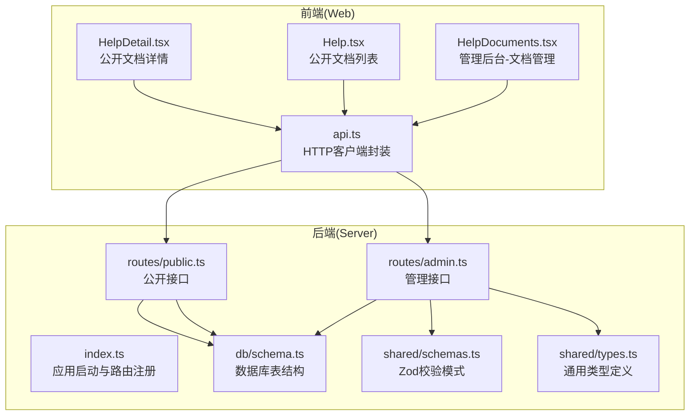
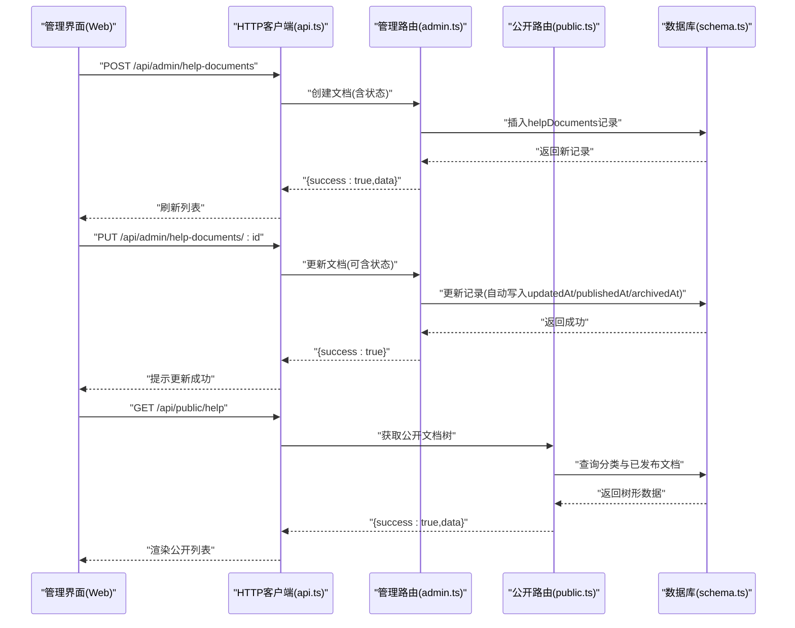
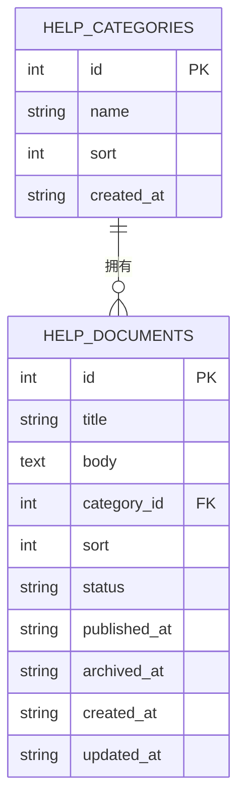
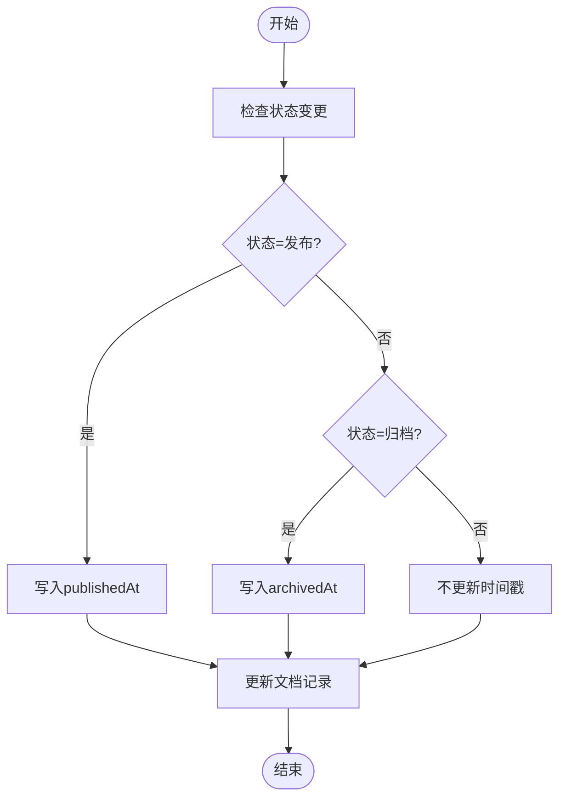
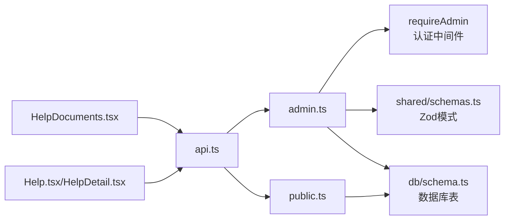

# 帮助文档管理API

<cite>
**本文档引用的文件**
- [apps/server/src/routes/admin.ts](file://apps/server/src/routes/admin.ts)
- [apps/server/src/routes/public.ts](file://apps/server/src/routes/public.ts)
- [apps/server/src/db/schema.ts](file://apps/server/src/db/schema.ts)
- [packages/shared/src/schemas.ts](file://packages/shared/src/schemas.ts)
- [packages/shared/src/types.ts](file://packages/shared/src/types.ts)
- [apps/web/src/pages/admin/HelpDocuments.tsx](file://apps/web/src/pages/admin/HelpDocuments.tsx)
- [apps/web/src/pages/Help.tsx](file://apps/web/src/pages/Help.tsx)
- [apps/web/src/pages/HelpDetail.tsx](file://apps/web/src/pages/HelpDetail.tsx)
- [apps/web/src/lib/api.ts](file://apps/web/src/lib/api.ts)
- [apps/server/src/index.ts](file://apps/server/src/index.ts)
</cite>

## 目录
1. [简介](#简介)
2. [项目结构](#项目结构)
3. [核心组件](#核心组件)
4. [架构总览](#架构总览)
5. [详细组件分析](#详细组件分析)
6. [依赖关系分析](#依赖关系分析)
7. [性能考虑](#性能考虑)
8. [故障排除指南](#故障排除指南)
9. [结论](#结论)
10. [附录](#附录)

## 简介
本文件面向ZBH2平台的帮助文档管理API，提供完整的CRUD接口说明与使用指南。内容覆盖文档的创建、更新、删除与列表查询；解释文档状态管理（草稿、发布、归档）及发布时间自动更新机制；描述文档内容编辑与分类关联；并给出请求/响应示例，涵盖文档添加、状态切换、内容更新、批量操作等场景。同时说明文档状态流转规则与发布流程控制。

## 项目结构
后端采用Fastify框架，通过路由模块化组织功能；前端使用Ant Design与React构建管理界面与公开展示页面。数据模型由Drizzle ORM定义，共享包提供Zod校验模式与类型声明。

图表来源
- [apps/server/src/index.ts:1-60](file://apps/server/src/index.ts#L1-L60)
- [apps/server/src/routes/admin.ts:1-279](file://apps/server/src/routes/admin.ts#L1-L279)
- [apps/server/src/routes/public.ts:1-52](file://apps/server/src/routes/public.ts#L1-L52)
- [apps/server/src/db/schema.ts:1-330](file://apps/server/src/db/schema.ts#L1-L330)
- [packages/shared/src/schemas.ts:1-51](file://packages/shared/src/schemas.ts#L1-L51)
- [packages/shared/src/types.ts:1-18](file://packages/shared/src/types.ts#L1-L18)
- [apps/web/src/pages/admin/HelpDocuments.tsx:1-112](file://apps/web/src/pages/admin/HelpDocuments.tsx#L1-L112)
- [apps/web/src/pages/Help.tsx:1-61](file://apps/web/src/pages/Help.tsx#L1-L61)
- [apps/web/src/pages/HelpDetail.tsx:1-38](file://apps/web/src/pages/HelpDetail.tsx#L1-L38)
- [apps/web/src/lib/api.ts:1-16](file://apps/web/src/lib/api.ts#L1-L16)

章节来源
- [apps/server/src/index.ts:1-60](file://apps/server/src/index.ts#L1-L60)
- [apps/server/src/routes/admin.ts:1-279](file://apps/server/src/routes/admin.ts#L1-L279)
- [apps/server/src/routes/public.ts:1-52](file://apps/server/src/routes/public.ts#L1-L52)
- [apps/server/src/db/schema.ts:1-330](file://apps/server/src/db/schema.ts#L1-L330)
- [packages/shared/src/schemas.ts:1-51](file://packages/shared/src/schemas.ts#L1-L51)
- [packages/shared/src/types.ts:1-18](file://packages/shared/src/types.ts#L1-L18)
- [apps/web/src/pages/admin/HelpDocuments.tsx:1-112](file://apps/web/src/pages/admin/HelpDocuments.tsx#L1-L112)
- [apps/web/src/pages/Help.tsx:1-61](file://apps/web/src/pages/Help.tsx#L1-L61)
- [apps/web/src/pages/HelpDetail.tsx:1-38](file://apps/web/src/pages/HelpDetail.tsx#L1-L38)
- [apps/web/src/lib/api.ts:1-16](file://apps/web/src/lib/api.ts#L1-L16)

## 核心组件
- 管理接口：提供帮助文档的增删改查与状态变更，要求管理员权限。
- 公开接口：提供帮助文档的公开列表与详情查询，仅返回已发布状态的文档。
- 数据模型：定义帮助文档与帮助分类的字段、枚举值与时间戳字段。
- 校验与类型：通过共享包的Zod模式与类型定义确保前后端一致性。
- 前端管理界面：提供文档列表、新增/编辑弹窗、状态切换按钮与删除确认。

章节来源
- [apps/server/src/routes/admin.ts:102-134](file://apps/server/src/routes/admin.ts#L102-L134)
- [apps/server/src/routes/public.ts:26-44](file://apps/server/src/routes/public.ts#L26-L44)
- [apps/server/src/db/schema.ts:51-69](file://apps/server/src/db/schema.ts#L51-L69)
- [packages/shared/src/schemas.ts:33-39](file://packages/shared/src/schemas.ts#L33-L39)
- [packages/shared/src/types.ts:3](file://packages/shared/src/types.ts#L3)
- [apps/web/src/pages/admin/HelpDocuments.tsx:12-112](file://apps/web/src/pages/admin/HelpDocuments.tsx#L12-L112)

## 架构总览
帮助文档管理API遵循“管理接口+公开接口”的分层设计。管理接口位于/admin路径，需要管理员认证；公开接口位于/public路径，供访客浏览已发布文档。数据持久化通过Drizzle ORM访问SQLite数据库。

图表来源
- [apps/server/src/routes/admin.ts:102-134](file://apps/server/src/routes/admin.ts#L102-L134)
- [apps/server/src/routes/public.ts:26-44](file://apps/server/src/routes/public.ts#L26-L44)
- [apps/server/src/db/schema.ts:58-69](file://apps/server/src/db/schema.ts#L58-L69)
- [apps/web/src/lib/api.ts:1-16](file://apps/web/src/lib/api.ts#L1-L16)

## 详细组件分析

### 数据模型与字段说明
- 帮助分类表：包含名称、排序、创建时间。
- 帮助文档表：包含标题、内容、分类关联、排序、状态、发布时间、归档时间、创建与更新时间。
- 状态枚举：草稿(draft)、发布(published)、归档(archived)。
- 时间字段：createdAt、updatedAt、publishedAt、archivedAt。

图表来源
- [apps/server/src/db/schema.ts:51-69](file://apps/server/src/db/schema.ts#L51-L69)

章节来源
- [apps/server/src/db/schema.ts:51-69](file://apps/server/src/db/schema.ts#L51-L69)

### 管理接口（/api/admin/help-documents）
- 列表查询：按创建时间倒序返回所有文档。
- 创建文档：支持标题、内容、分类、排序、状态；当状态为发布时自动写入发布时间。
- 更新文档：支持标题、内容、分类、排序、状态；状态切换时自动写入对应时间戳。
- 删除文档：根据ID删除记录。

请求/响应示例（基于接口行为推导，非代码片段）：
- 创建文档
  - 请求：POST /api/admin/help-documents
  - 请求体：{ title, body, categoryId, sort, status }
  - 响应：{ success: true, data: 新文档对象 }
- 更新文档
  - 请求：PUT /api/admin/help-documents/:id
  - 请求体：{ title?, body?, categoryId?, sort?, status? }
  - 响应：{ success: true }
- 删除文档
  - 请求：DELETE /api/admin/help-documents/:id
  - 响应：{ success: true }
- 列表查询
  - 请求：GET /api/admin/help-documents
  - 响应：{ success: true, data: 文档数组 }

章节来源
- [apps/server/src/routes/admin.ts:102-134](file://apps/server/src/routes/admin.ts#L102-L134)
- [packages/shared/src/schemas.ts:33-39](file://packages/shared/src/schemas.ts#L33-L39)

### 公开接口（/api/public/help*）
- 公开列表：返回带文档列表的分类树，仅包含已发布文档。
- 公开详情：根据ID返回已发布文档，不存在或非发布状态返回404。

请求/响应示例（基于接口行为推导，非代码片段）：
- 获取公开文档树
  - 请求：GET /api/public/help
  - 响应：{ success: true, data: 分类树数组 }
- 获取公开文档详情
  - 请求：GET /api/public/help/:id
  - 成功响应：{ success: true, data: 文档对象 }
  - 失败响应：{ success: false, error: "未找到文档" }

章节来源
- [apps/server/src/routes/public.ts:26-44](file://apps/server/src/routes/public.ts#L26-L44)

### 状态管理与发布时间机制
- 状态枚举：draft、published、archived。
- 自动时间戳：
  - 创建时：createdAt、updatedAt自动写入当前时间。
  - 更新时：每次更新都会写入updatedAt。
  - 发布时：当状态变为published，自动写入publishedAt。
  - 归档时：当状态变为archived，自动写入archivedAt。

图表来源
- [apps/server/src/routes/admin.ts:117-128](file://apps/server/src/routes/admin.ts#L117-L128)
- [apps/server/src/db/schema.ts:58-69](file://apps/server/src/db/schema.ts#L58-L69)

章节来源
- [apps/server/src/routes/admin.ts:117-128](file://apps/server/src/routes/admin.ts#L117-L128)
- [apps/server/src/db/schema.ts:58-69](file://apps/server/src/db/schema.ts#L58-L69)

### 前端集成与交互
- 管理界面（HelpDocuments.tsx）：
  - 加载文档与分类列表，支持新增/编辑弹窗。
  - 提供状态切换按钮：草稿→发布、发布→回收、回收→草稿。
  - 支持删除确认与消息提示。
- 公开界面（Help.tsx/HelpDetail.tsx）：
  - 展示公开文档树与详情页，使用Markdown渲染内容。

章节来源
- [apps/web/src/pages/admin/HelpDocuments.tsx:12-112](file://apps/web/src/pages/admin/HelpDocuments.tsx#L12-L112)
- [apps/web/src/pages/Help.tsx:21-61](file://apps/web/src/pages/Help.tsx#L21-L61)
- [apps/web/src/pages/HelpDetail.tsx:10-38](file://apps/web/src/pages/HelpDetail.tsx#L10-L38)
- [apps/web/src/lib/api.ts:1-16](file://apps/web/src/lib/api.ts#L1-L16)

## 依赖关系分析
- 路由依赖：管理接口依赖认证中间件与Drizzle ORM；公开接口直接查询数据库。
- 模式依赖：管理接口使用共享包的Zod模式进行请求体校验。
- 类型依赖：共享包提供ContentStatus等类型，保证前后端一致。
- 前端依赖：管理界面通过api.ts统一发起请求，公开界面通过公共路由获取数据。

图表来源
- [apps/server/src/routes/admin.ts:1-279](file://apps/server/src/routes/admin.ts#L1-L279)
- [apps/server/src/routes/public.ts:1-52](file://apps/server/src/routes/public.ts#L1-L52)
- [packages/shared/src/schemas.ts:1-51](file://packages/shared/src/schemas.ts#L1-L51)
- [apps/server/src/db/schema.ts:1-330](file://apps/server/src/db/schema.ts#L1-L330)
- [apps/web/src/pages/admin/HelpDocuments.tsx:1-112](file://apps/web/src/pages/admin/HelpDocuments.tsx#L1-L112)
- [apps/web/src/pages/Help.tsx:1-61](file://apps/web/src/pages/Help.tsx#L1-L61)
- [apps/web/src/pages/HelpDetail.tsx:1-38](file://apps/web/src/pages/HelpDetail.tsx#L1-L38)
- [apps/web/src/lib/api.ts:1-16](file://apps/web/src/lib/api.ts#L1-L16)

章节来源
- [apps/server/src/routes/admin.ts:1-279](file://apps/server/src/routes/admin.ts#L1-L279)
- [apps/server/src/routes/public.ts:1-52](file://apps/server/src/routes/public.ts#L1-L52)
- [packages/shared/src/schemas.ts:1-51](file://packages/shared/src/schemas.ts#L1-L51)
- [apps/server/src/db/schema.ts:1-330](file://apps/server/src/db/schema.ts#L1-L330)
- [apps/web/src/pages/admin/HelpDocuments.tsx:1-112](file://apps/web/src/pages/admin/HelpDocuments.tsx#L1-L112)
- [apps/web/src/pages/Help.tsx:1-61](file://apps/web/src/pages/Help.tsx#L1-L61)
- [apps/web/src/pages/HelpDetail.tsx:1-38](file://apps/web/src/pages/HelpDetail.tsx#L1-L38)
- [apps/web/src/lib/api.ts:1-16](file://apps/web/src/lib/api.ts#L1-L16)

## 性能考虑
- 查询优化：列表接口按创建时间倒序，适合分页加载；公开接口仅查询已发布文档，减少无效数据传输。
- 写入优化：状态变更时仅更新必要字段与时间戳，避免全量更新。
- 前端缓存：公开文档列表可结合浏览器缓存策略提升二次访问速度。
- 批量操作：建议在管理端实现批量状态切换与删除，减少请求次数。

## 故障排除指南
- 401 未授权：管理接口需管理员登录，检查会话与认证中间件。
- 403 权限不足：非管理员用户访问管理接口，需确保角色为admin。
- 404 文档不存在：公开接口对不存在或非发布状态文档返回404。
- 参数校验失败：请求体不符合Zod模式，检查字段类型与必填项。
- 状态流转异常：确认状态枚举值与时间戳写入逻辑是否正确。

章节来源
- [apps/server/src/middleware/auth.ts:42-55](file://apps/server/src/middleware/auth.ts#L42-L55)
- [apps/server/src/routes/public.ts:37-44](file://apps/server/src/routes/public.ts#L37-L44)
- [packages/shared/src/schemas.ts:33-39](file://packages/shared/src/schemas.ts#L33-L39)

## 结论
帮助文档管理API通过清晰的接口分层与严格的状态机设计，实现了从草稿到发布的完整生命周期管理。配合公开接口，既能满足后台精细化管理需求，又能保障前台用户获取准确的公开文档。建议在生产环境中结合缓存与分页策略进一步优化性能，并完善批量操作与审计日志能力。

## 附录

### 接口清单与规范
- 管理接口
  - GET /api/admin/help-documents：获取文档列表（按创建时间倒序）
  - POST /api/admin/help-documents：创建文档（支持状态初始为发布）
  - PUT /api/admin/help-documents/:id：更新文档（可更新状态）
  - DELETE /api/admin/help-documents/:id：删除文档
- 公开接口
  - GET /api/public/help：获取公开文档树（仅已发布）
  - GET /api/public/help/:id：获取公开文档详情（仅已发布）

章节来源
- [apps/server/src/routes/admin.ts:102-134](file://apps/server/src/routes/admin.ts#L102-L134)
- [apps/server/src/routes/public.ts:26-44](file://apps/server/src/routes/public.ts#L26-L44)