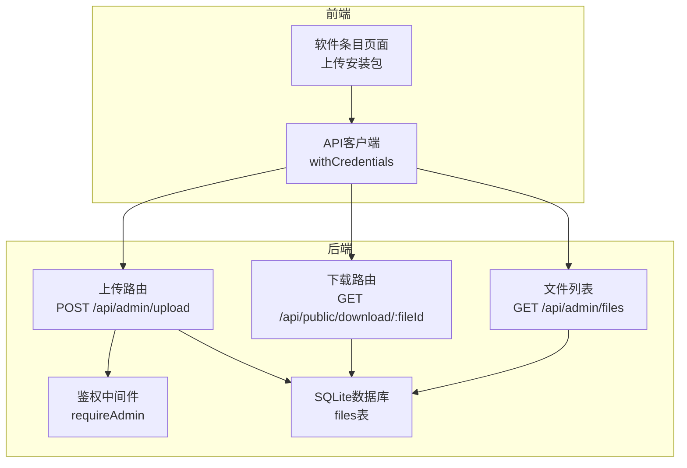
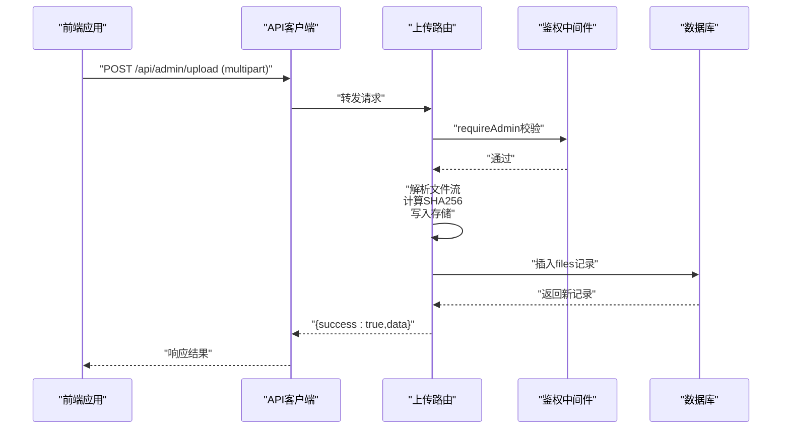
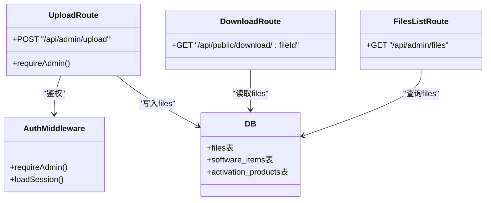

# 文件管理API

<cite>
**本文档引用的文件**
- [apps/server/src/routes/upload.ts](file://apps/server/src/routes/upload.ts)
- [apps/server/src/routes/admin.ts](file://apps/server/src/routes/admin.ts)
- [apps/server/src/db/schema.ts](file://apps/server/src/db/schema.ts)
- [apps/server/src/middleware/auth.ts](file://apps/server/src/middleware/auth.ts)
- [apps/server/src/db/index.ts](file://apps/server/src/db/index.ts)
- [apps/web/src/pages/admin/SoftwareItems.tsx](file://apps/web/src/pages/admin/SoftwareItems.tsx)
- [apps/web/src/lib/api.ts](file://apps/web/src/lib/api.ts)
- [packages/shared/src/schemas.ts](file://packages/shared/src/schemas.ts)
- [apps/server/drizzle/0000_absurd_liz_osborn.sql](file://apps/server/drizzle/0000_absurd_liz_osborn.sql)
</cite>

## 目录
1. [简介](#简介)
2. [项目结构](#项目结构)
3. [核心组件](#核心组件)
4. [架构总览](#架构总览)
5. [详细组件分析](#详细组件分析)
6. [依赖关系分析](#依赖关系分析)
7. [性能考虑](#性能考虑)
8. [故障排查指南](#故障排查指南)
9. [结论](#结论)

## 简介
本文件管理API为ZBH2平台提供文件上传、存储、下载与查询能力，并与软件条目、激活产品等实体建立关联。后端采用Fastify + Drizzle ORM + SQLite，前端通过React组件发起上传与查询请求。管理员具备文件管理权限，普通用户仅能通过公开下载接口访问特定文件。

## 项目结构
- 后端路由
  - 上传与下载：/api/admin/upload、/api/public/download/:fileId
  - 文件列表：/api/admin/files
- 数据模型
  - files表：存储文件元数据（原始名、存储路径、MIME、大小、哈希、上传者）
  - 关联实体：software_items.file_id、activation_products.client_file_id
- 前端集成
  - 软件条目页面通过自定义上传请求将文件上传至后端并回填fileId
  - API客户端统一处理Cookie与错误拦截

图表来源
- [apps/server/src/routes/upload.ts:14-61](file://apps/server/src/routes/upload.ts#L14-L61)
- [apps/server/src/routes/admin.ts:273-277](file://apps/server/src/routes/admin.ts#L273-L277)
- [apps/server/src/db/schema.ts:26-35](file://apps/server/src/db/schema.ts#L26-L35)

章节来源
- [apps/server/src/routes/upload.ts:14-61](file://apps/server/src/routes/upload.ts#L14-L61)
- [apps/server/src/routes/admin.ts:273-277](file://apps/server/src/routes/admin.ts#L273-L277)
- [apps/server/src/db/schema.ts:26-35](file://apps/server/src/db/schema.ts#L26-L35)

## 核心组件
- 文件上传与元数据记录
  - 接收multipart/form-data，计算SHA256哈希，写入本地存储目录，记录到files表
  - 返回标准响应：{ success: true, data: 文件记录 }
- 文件下载
  - 根据fileId读取文件元数据，设置Content-Disposition与Content-Type，返回静态文件
- 文件列表查询
  - 查询files表，按创建时间倒序返回所有文件
- 访问控制
  - 上传接口要求管理员权限；下载接口为公开访问
- 存储策略
  - 本地文件系统存储，文件名使用随机ID避免冲突与安全风险

章节来源
- [apps/server/src/routes/upload.ts:14-61](file://apps/server/src/routes/upload.ts#L14-L61)
- [apps/server/src/routes/admin.ts:273-277](file://apps/server/src/routes/admin.ts#L273-L277)
- [apps/server/src/middleware/auth.ts:48-55](file://apps/server/src/middleware/auth.ts#L48-L55)
- [apps/server/src/db/index.ts:7-15](file://apps/server/src/db/index.ts#L7-L15)

## 架构总览
文件管理模块围绕files表构建，上传流程完成数据落库与文件持久化；下载流程根据数据库记录进行文件传输；文件列表用于管理后台对已上传文件的统一查看与审计。

图表来源
- [apps/server/src/routes/upload.ts:14-49](file://apps/server/src/routes/upload.ts#L14-L49)
- [apps/server/src/middleware/auth.ts:48-55](file://apps/server/src/middleware/auth.ts#L48-L55)

## 详细组件分析

### 文件上传接口
- 接口定义
  - 方法：POST
  - 路径：/api/admin/upload
  - 权限：管理员
  - 内容类型：multipart/form-data
- 请求参数
  - file：二进制文件流（必填）
- 响应体
  - 成功：{ success: true, data: 文件记录 }
  - 失败：{ success: false, error: 错误信息 }
- 处理逻辑要点
  - 校验是否提供文件
  - 生成存储文件名（随机ID+原扩展名）
  - 流式写入磁盘，同时累计大小并更新哈希
  - 将原始名、存储路径、MIME、大小、哈希、上传者ID写入files表
- 典型场景
  - 上传软件安装包：前端通过自定义上传请求完成上传并回填fileId

章节来源
- [apps/server/src/routes/upload.ts:14-49](file://apps/server/src/routes/upload.ts#L14-L49)
- [apps/web/src/pages/admin/SoftwareItems.tsx:25-36](file://apps/web/src/pages/admin/SoftwareItems.tsx#L25-L36)

### 文件下载接口
- 接口定义
  - 方法：GET
  - 路径：/api/public/download/:fileId
  - 权限：无需登录（公开）
- 请求参数
  - fileId：文件ID（路径参数）
- 响应头
  - Content-Disposition：attachment; filename=编码后的原始名
  - Content-Type：文件MIME类型
- 响应体
  - 文件二进制流
- 错误处理
  - 文件不存在：返回404与错误信息

章节来源
- [apps/server/src/routes/upload.ts:51-61](file://apps/server/src/routes/upload.ts#L51-L61)

### 文件列表查询接口
- 接口定义
  - 方法：GET
  - 路径：/api/admin/files
  - 权限：管理员
- 响应体
  - 成功：{ success: true, data: files数组（按创建时间倒序） }
- 应用场景
  - 管理后台查看所有上传文件，便于审计与清理

章节来源
- [apps/server/src/routes/admin.ts:273-277](file://apps/server/src/routes/admin.ts#L273-L277)

### 文件元数据与存储信息管理
- 元数据字段
  - originalName：原始文件名
  - storagePath：存储文件名（不包含路径）
  - mime：MIME类型
  - size：字节数
  - hash：SHA256哈希
  - uploaderId：上传者ID
  - createdAt：创建时间
- 存储策略
  - 本地文件系统，存储根目录为data/uploads
  - 文件名使用随机ID，避免路径冲突与信息泄露
- 关联关系
  - software_items.file_id → files.id
  - activation_products.client_file_id → files.id

章节来源
- [apps/server/src/db/schema.ts:26-35](file://apps/server/src/db/schema.ts#L26-L35)
- [apps/server/drizzle/0000_absurd_liz_osborn.sql:34-44](file://apps/server/drizzle/0000_absurd_liz_osborn.sql#L34-L44)

### 文件与软件条目、激活产品的关联
- 软件条目
  - 软件安装包文件：software_items.file_id
  - 软件图标文件：software_items.icon_file_id
- 激活产品
  - 客户端下载文件：activation_products.client_file_id
- 前端使用
  - 上传完成后，前端将返回的文件ID写入对应实体字段，完成关联

章节来源
- [apps/server/src/db/schema.ts:37-49](file://apps/server/src/db/schema.ts#L37-L49)
- [apps/server/src/db/schema.ts:71-79](file://apps/server/src/db/schema.ts#L71-L79)
- [apps/web/src/pages/admin/SoftwareItems.tsx:40-44](file://apps/web/src/pages/admin/SoftwareItems.tsx#L40-L44)

### 访问控制机制
- 鉴权中间件
  - requireAdmin：检查sessionUser是否存在且角色为admin
  - requireAuth：检查sessionUser是否存在
- Cookie会话
  - 使用httpOnly Cookie存储会话ID，配合后端会话表验证有效性
- 前端API客户端
  - withCredentials=true，确保跨域请求携带Cookie

章节来源
- [apps/server/src/middleware/auth.ts:42-55](file://apps/server/src/middleware/auth.ts#L42-L55)
- [apps/web/src/lib/api.ts:3-15](file://apps/web/src/lib/api.ts#L3-L15)

## 依赖关系分析
- 组件耦合
  - 上传路由依赖鉴权中间件与数据库
  - 下载路由依赖数据库与文件系统
  - 文件列表路由依赖数据库
- 外部依赖
  - better-sqlite3 + drizzle-orm
  - fastify multipart解析
  - fs/crypto/stream
- 数据模型依赖
  - files表被多个业务实体外键引用

图表来源
- [apps/server/src/routes/upload.ts:14-61](file://apps/server/src/routes/upload.ts#L14-L61)
- [apps/server/src/routes/admin.ts:273-277](file://apps/server/src/routes/admin.ts#L273-L277)
- [apps/server/src/middleware/auth.ts:17-40](file://apps/server/src/middleware/auth.ts#L17-L40)
- [apps/server/src/db/schema.ts:26-35](file://apps/server/src/db/schema.ts#L26-L35)

章节来源
- [apps/server/src/routes/upload.ts:14-61](file://apps/server/src/routes/upload.ts#L14-L61)
- [apps/server/src/routes/admin.ts:273-277](file://apps/server/src/routes/admin.ts#L273-L277)
- [apps/server/src/middleware/auth.ts:17-40](file://apps/server/src/middleware/auth.ts#L17-L40)
- [apps/server/src/db/schema.ts:26-35](file://apps/server/src/db/schema.ts#L26-L35)

## 性能考虑
- 上传性能
  - 流式写入磁盘，避免一次性加载到内存
  - SHA256哈希边读边计算，适合大文件
- 存储与IO
  - 本地文件系统简单可靠，建议配合SSD与合适磁盘空间规划
- 数据库查询
  - 文件列表按创建时间倒序，索引支持高效排序
- 建议
  - 对于超大文件，可考虑引入CDN与分片上传
  - 定期清理无引用文件，避免存储膨胀

## 故障排查指南
- 上传失败
  - 确认请求为multipart/form-data且包含file字段
  - 检查/data/uploads目录权限与磁盘空间
  - 查看后端日志定位具体错误
- 下载失败
  - 确认fileId有效且文件仍存在于存储目录
  - 检查文件名与存储路径一致性
- 权限问题
  - 确认已登录且为管理员角色
  - 检查Cookie是否正确传递
- 数据不一致
  - 核对files表记录与实际文件是否存在
  - 检查外键关联（software_items、activation_products）是否正确

章节来源
- [apps/server/src/routes/upload.ts:17-19](file://apps/server/src/routes/upload.ts#L17-L19)
- [apps/server/src/routes/upload.ts:54-56](file://apps/server/src/routes/upload.ts#L54-L56)
- [apps/server/src/middleware/auth.ts:48-55](file://apps/server/src/middleware/auth.ts#L48-L55)

## 结论
文件管理API通过简洁的上传、下载与列表查询接口，结合严格的管理员权限控制与清晰的存储策略，为平台提供了可靠的文件管理能力。与软件条目、激活产品等实体的关联设计，使得文件资源能够被业务实体复用与审计。建议在生产环境中关注存储容量、访问日志与定期清理策略，以保障长期稳定运行。