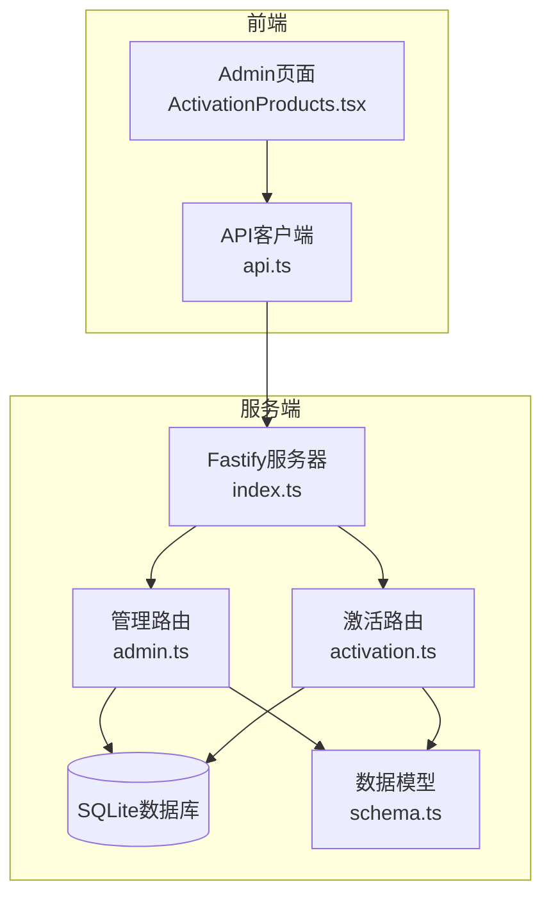
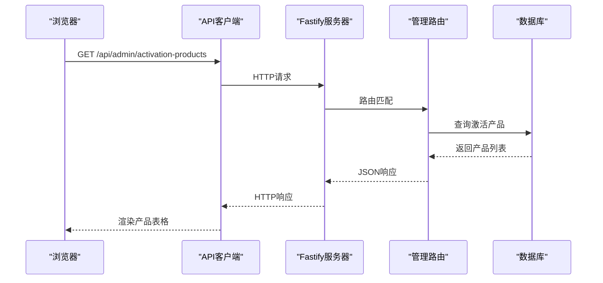
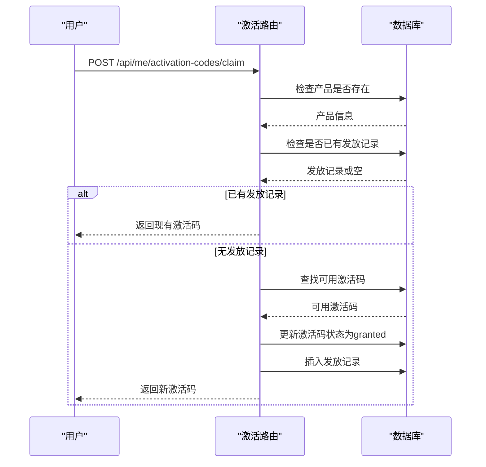
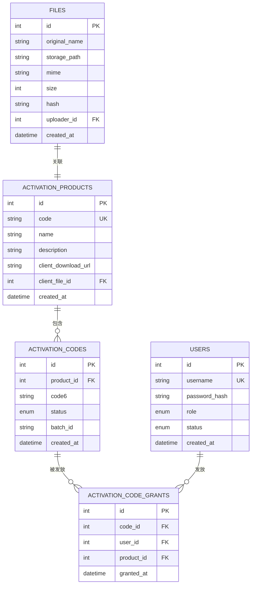

# 激活产品管理API

<cite>
**本文档引用的文件**
- [apps/server/src/routes/admin.ts](file://apps/server/src/routes/admin.ts)
- [apps/server/src/routes/activation.ts](file://apps/server/src/routes/activation.ts)
- [apps/server/src/db/schema.ts](file://apps/server/src/db/schema.ts)
- [packages/shared/src/schemas.ts](file://packages/shared/src/schemas.ts)
- [apps/web/src/pages/admin/ActivationProducts.tsx](file://apps/web/src/pages/admin/ActivationProducts.tsx)
- [apps/web/src/pages/admin/ActivationGrants.tsx](file://apps/web/src/pages/admin/ActivationGrants.tsx)
- [apps/server/src/index.ts](file://apps/server/src/index.ts)
- [apps/server/src/db/migrate.ts](file://apps/server/src/db/migrate.ts)
- [apps/web/src/lib/api.ts](file://apps/web/src/lib/api.ts)
</cite>

## 目录
1. [简介](#简介)
2. [项目结构](#项目结构)
3. [核心组件](#核心组件)
4. [架构概览](#架构概览)
5. [详细组件分析](#详细组件分析)
6. [依赖分析](#依赖分析)
7. [性能考虑](#性能考虑)
8. [故障排除指南](#故障排除指南)
9. [结论](#结论)
10. [附录](#附录)

## 简介
本文件为ZBH2平台的激活产品管理API提供全面的技术文档。该模块负责激活产品的CRUD操作（创建、更新、删除、列表查询），以及激活产品与激活码的关联管理。激活产品包含产品代码、名称、描述、客户端下载链接等配置参数，并支持通过文件ID关联客户端安装包文件。系统还提供激活码批量导入、发放记录审计等功能。

## 项目结构
激活产品管理API位于服务端Fastify应用中，采用分层架构：
- 路由层：处理HTTP请求，定义REST接口
- 数据访问层：基于Drizzle ORM操作SQLite数据库
- 验证层：使用Zod Schema进行输入校验
- 前端集成：Admin页面提供可视化管理界面



**图表来源**
- [apps/server/src/index.ts:1-60](file://apps/server/src/index.ts#L1-L60)
- [apps/server/src/routes/admin.ts:1-279](file://apps/server/src/routes/admin.ts#L1-L279)
- [apps/server/src/routes/activation.ts:1-95](file://apps/server/src/routes/activation.ts#L1-L95)

**章节来源**
- [apps/server/src/index.ts:1-60](file://apps/server/src/index.ts#L1-L60)
- [apps/server/src/routes/admin.ts:1-279](file://apps/server/src/routes/admin.ts#L1-L279)
- [apps/server/src/routes/activation.ts:1-95](file://apps/server/src/routes/activation.ts#L1-L95)

## 核心组件
激活产品管理涉及以下核心组件：

### 数据模型
激活产品表包含以下关键字段：
- id: 主键标识符
- code: 产品代码（唯一约束）
- name: 产品名称
- description: 产品描述
- clientDownloadUrl: 客户端下载URL
- clientFileId: 关联的文件ID（可选）
- createdAt: 创建时间

激活码表包含：
- id: 主键标识符
- productId: 所属产品ID
- code6: 6位激活码
- status: 状态（available/granted/revoked）
- batchId: 批次标识
- createdAt: 创建时间

激活码发放表包含：
- id: 主键标识符
- codeId: 激活码ID
- userId: 用户ID
- productId: 产品ID
- grantedAt: 发放时间

**章节来源**
- [apps/server/src/db/schema.ts:71-96](file://apps/server/src/db/schema.ts#L71-L96)

### 输入验证
使用Zod Schema确保数据完整性：
- activationProductSchema: 验证激活产品创建/更新请求
- claimCodeSchema: 验证激活码申领请求

**章节来源**
- [packages/shared/src/schemas.ts:41-51](file://packages/shared/src/schemas.ts#L41-L51)

## 架构概览
激活产品管理采用前后端分离架构，前端通过API客户端调用后端接口，后端使用Drizzle ORM连接SQLite数据库。



**图表来源**
- [apps/web/src/lib/api.ts:1-16](file://apps/web/src/lib/api.ts#L1-L16)
- [apps/server/src/routes/admin.ts:137-140](file://apps/server/src/routes/admin.ts#L137-L140)

## 详细组件分析

### 激活产品CRUD接口

#### 列表查询接口
- **GET** `/api/admin/activation-products`
- **功能**: 获取所有激活产品列表
- **认证**: 需要管理员权限
- **响应**: 包含激活产品数组的数据对象

**章节来源**
- [apps/server/src/routes/admin.ts:137-140](file://apps/server/src/routes/admin.ts#L137-L140)

#### 创建产品接口
- **POST** `/api/admin/activation-products`
- **功能**: 创建新的激活产品
- **认证**: 需要管理员权限
- **请求体**: 包含code、name、description、clientDownloadUrl等字段
- **验证**: 使用activationProductSchema进行数据校验
- **响应**: 返回新创建的产品对象

**章节来源**
- [apps/server/src/routes/admin.ts:142-147](file://apps/server/src/routes/admin.ts#L142-L147)
- [packages/shared/src/schemas.ts:41-46](file://packages/shared/src/schemas.ts#L41-L46)

#### 更新产品接口
- **PUT** `/api/admin/activation-products/:id`
- **功能**: 更新指定ID的激活产品
- **认证**: 需要管理员权限
- **路径参数**: id - 产品ID
- **请求体**: 可选更新code、name、description、clientDownloadUrl、clientFileId字段
- **响应**: 成功状态

**章节来源**
- [apps/server/src/routes/admin.ts:149-158](file://apps/server/src/routes/admin.ts#L149-L158)

#### 删除产品接口
- **DELETE** `/api/admin/activation-products/:id`
- **功能**: 删除指定ID的激活产品
- **认证**: 需要管理员权限
- **路径参数**: id - 产品ID
- **响应**: 成功状态

**章节来源**
- [apps/server/src/routes/admin.ts:158-158](file://apps/server/src/routes/admin.ts#L158-L158)

### 激活码管理接口

#### 激活码列表接口
- **GET** `/api/admin/activation-codes`
- **功能**: 分页查询激活码列表
- **认证**: 需要管理员权限
- **查询参数**:
  - productId: 产品ID（可选，用于按产品过滤）
  - page: 页码，默认1
  - pageSize: 每页数量，默认20，最大100
- **响应**: 包含items、total、page、pageSize的对象

**章节来源**
- [apps/server/src/routes/admin.ts:161-176](file://apps/server/src/routes/admin.ts#L161-L176)

#### 激活码批量导入接口
- **POST** `/api/admin/activation-codes/import`
- **功能**: 批量导入激活码
- **认证**: 需要管理员权限
- **请求体**: 
  - productId: 产品ID
  - codes: 字符串数组，包含待导入的激活码
- **处理逻辑**: 自动去除空格，只接受6位激活码
- **响应**: 返回导入数量和批次ID

**章节来源**
- [apps/server/src/routes/admin.ts:178-197](file://apps/server/src/routes/admin.ts#L178-L197)

### 激活码发放接口

#### 用户申领激活码
- **POST** `/api/me/activation-codes/claim`
- **功能**: 当前登录用户申领激活码
- **认证**: 需要用户认证
- **请求体**: productId - 产品ID
- **业务规则**:
  - 防重复申领：同一用户对同一产品只能拥有一个有效发放记录
  - 自动分配：从可用激活码池中随机分配
  - 状态更新：激活码状态从available更新为granted
- **响应**: 包含code6和alreadyClaimed标志的对象



**图表来源**
- [apps/server/src/routes/activation.ts:8-75](file://apps/server/src/routes/activation.ts#L8-L75)

**章节来源**
- [apps/server/src/routes/activation.ts:8-75](file://apps/server/src/routes/activation.ts#L8-L75)

### 发放记录审计接口

#### 获取发放记录
- **GET** `/api/admin/activation-grants`
- **功能**: 获取所有激活码发放记录
- **认证**: 需要管理员权限
- **响应**: 包含发放记录数组，每条记录包含用户、产品、激活码等信息

**章节来源**
- [apps/server/src/routes/admin.ts:200-219](file://apps/server/src/routes/admin.ts#L200-L219)

## 依赖分析

### 数据模型依赖关系


**图表来源**
- [apps/server/src/db/schema.ts:71-96](file://apps/server/src/db/schema.ts#L71-L96)

### 前端集成依赖
- ActivationProducts.tsx: 管理激活产品的前端组件
- ActivationGrants.tsx: 显示激活码发放记录的前端组件
- api.ts: 统一的API客户端封装

**章节来源**
- [apps/web/src/pages/admin/ActivationProducts.tsx:1-66](file://apps/web/src/pages/admin/ActivationProducts.tsx#L1-L66)
- [apps/web/src/pages/admin/ActivationGrants.tsx:1-27](file://apps/web/src/pages/admin/ActivationGrants.tsx#L1-L27)
- [apps/web/src/lib/api.ts:1-16](file://apps/web/src/lib/api.ts#L1-L16)

## 性能考虑
- 数据库索引：激活产品code字段具有唯一索引，提升查询性能
- 分页查询：激活码列表支持分页，避免大量数据一次性传输
- 连接池：Drizzle ORM自动管理数据库连接
- 缓存策略：当前实现未包含缓存层，可根据实际需求考虑添加

## 故障排除指南

### 常见错误及解决方案
1. **400错误（数据验证失败）**
   - 检查请求体格式是否符合Zod Schema定义
   - 确认必填字段是否完整

2. **401错误（未认证）**
   - 确保已登录且会话有效
   - 检查Cookie设置和CORS配置

3. **403错误（权限不足）**
   - 确保用户具有管理员角色
   - 检查requireAdmin中间件配置

4. **404错误（资源不存在）**
   - 检查产品ID或激活码ID是否正确
   - 确认数据库中是否存在对应记录

5. **409错误（冲突）**
   - 激活码已存在或已被使用
   - 产品代码重复

**章节来源**
- [apps/server/src/routes/admin.ts:143-147](file://apps/server/src/routes/admin.ts#L143-L147)
- [apps/server/src/routes/activation.ts:10-12](file://apps/server/src/routes/activation.ts#L10-L12)

## 结论
ZBH2平台的激活产品管理API提供了完整的CRUD操作和激活码管理功能。系统采用清晰的分层架构，使用Zod Schema确保数据完整性，通过Drizzle ORM简化数据库操作。前端Admin页面提供了直观的管理界面，支持激活产品的创建、更新、删除和查询操作，以及激活码的批量导入和发放记录审计。

## 附录

### 请求/响应示例

#### 创建激活产品
**请求**:
```
POST /api/admin/activation-products
Content-Type: application/json

{
  "code": "WIN10",
  "name": "Windows 10专业版",
  "description": "Windows 10企业级操作系统",
  "clientDownloadUrl": "https://example.com/win10-client.exe"
}
```

**响应**:
```
{
  "success": true,
  "data": {
    "id": 1,
    "code": "WIN10",
    "name": "Windows 10专业版", 
    "description": "Windows 10企业级操作系统",
    "clientDownloadUrl": "https://example.com/win10-client.exe",
    "clientFileId": null,
    "createdAt": "2024-01-01T00:00:00Z"
  }
}
```

#### 批量导入激活码
**请求**:
```
POST /api/admin/activation-codes/import
Content-Type: application/json

{
  "productId": 1,
  "codes": ["ABCDEF", "123456", "XYZ123"]
}
```

**响应**:
```
{
  "success": true,
  "data": {
    "imported": 3,
    "batchId": "1k2l3m4n5o6p"
  }
}
```

#### 用户申领激活码
**请求**:
```
POST /api/me/activation-codes/claim
Content-Type: application/json

{
  "productId": 1
}
```

**响应**:
```
{
  "success": true,
  "data": {
    "code6": "ABCDEF",
    "alreadyClaimed": false
  }
}
```

### 数据验证规则
- 产品代码：1-20字符，必须唯一
- 产品名称：1-100字符
- 描述：默认为空字符串
- 下载链接：有效的URL格式或空字符串
- 激活码：必须为6位字符
- 状态枚举：available、granted、revoked

**章节来源**
- [packages/shared/src/schemas.ts:41-51](file://packages/shared/src/schemas.ts#L41-L51)