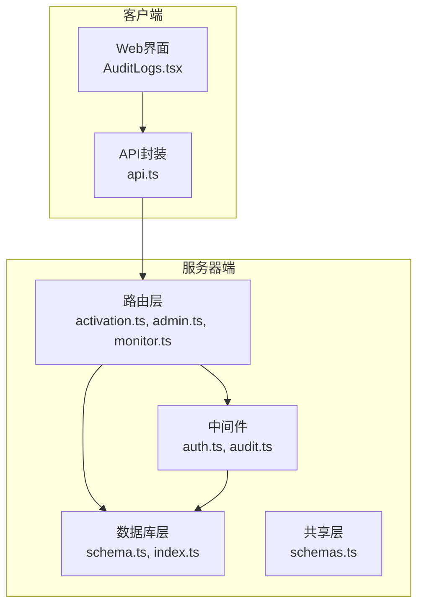
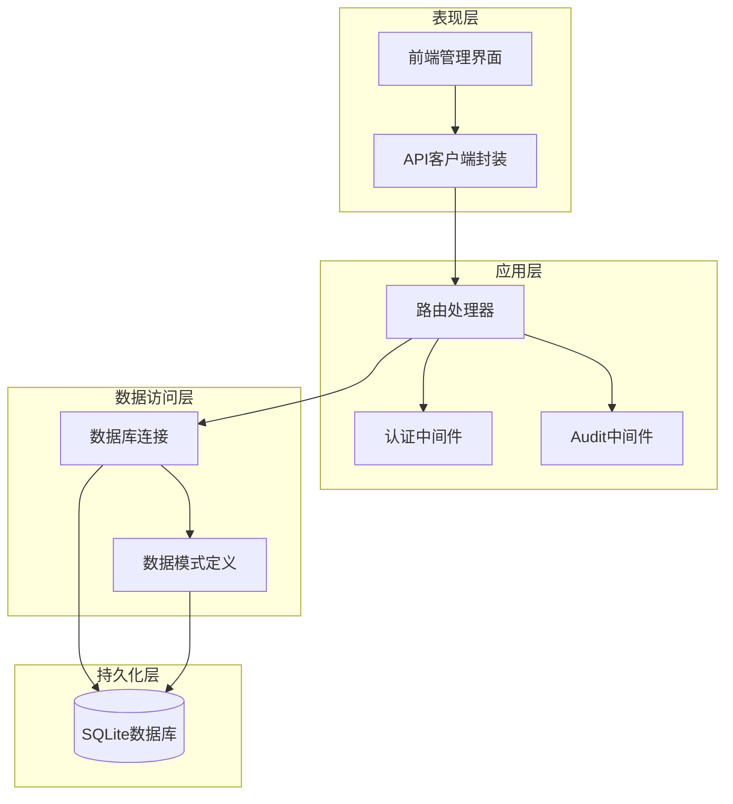
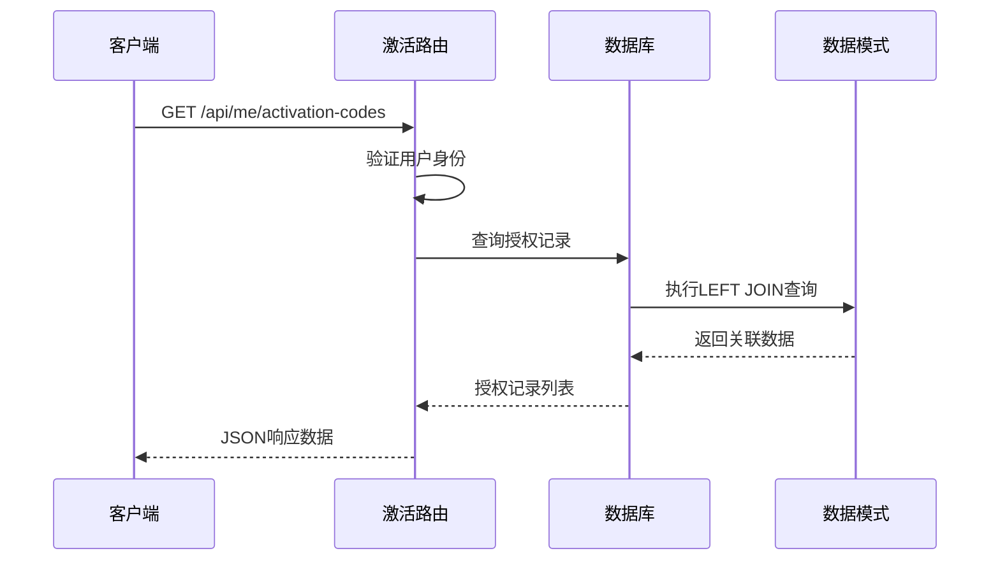
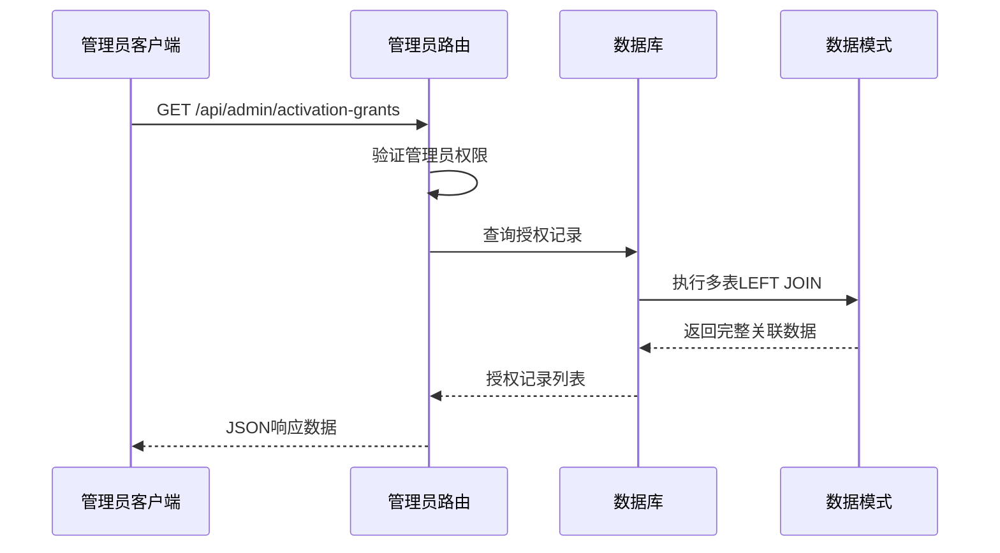
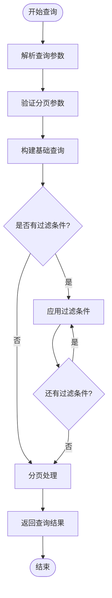
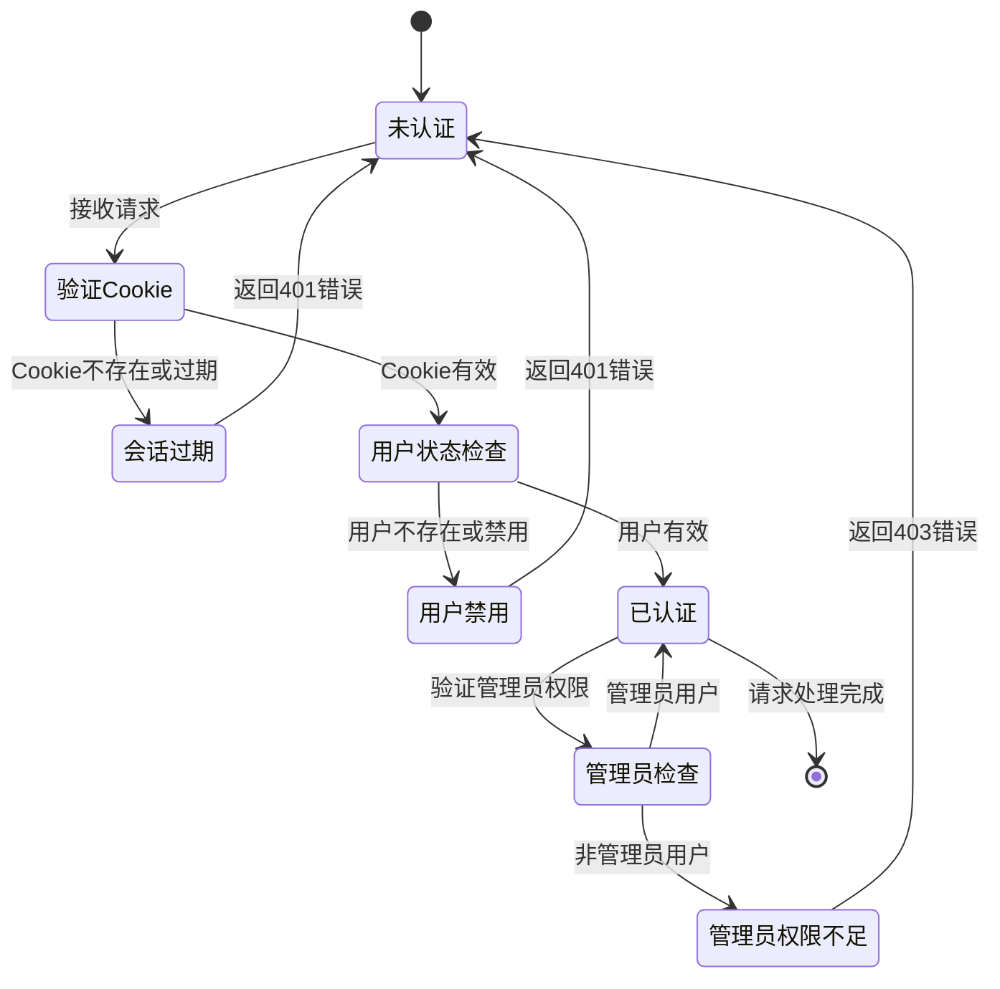
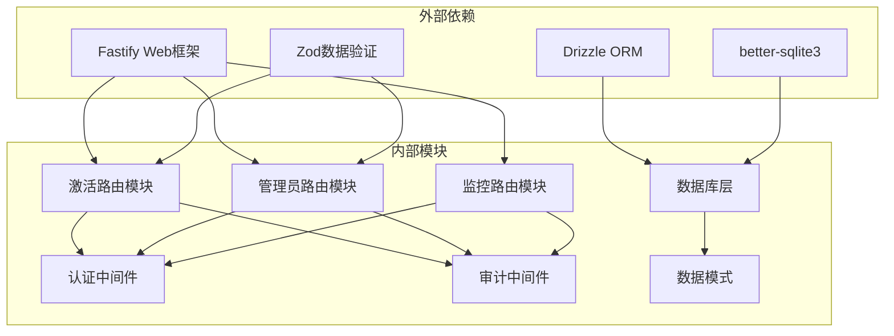

# 激活授权审计API

<cite>
**本文档引用的文件**
- [apps/server/src/routes/activation.ts](file://apps/server/src/routes/activation.ts)
- [apps/server/src/routes/admin.ts](file://apps/server/src/routes/admin.ts)
- [apps/server/src/routes/monitor.ts](file://apps/server/src/routes/monitor.ts)
- [apps/server/src/middleware/audit.ts](file://apps/server/src/middleware/audit.ts)
- [apps/server/src/db/schema.ts](file://apps/server/src/db/schema.ts)
- [apps/server/src/middleware/auth.ts](file://apps/server/src/middleware/auth.ts)
- [packages/shared/src/schemas.ts](file://packages/shared/src/schemas.ts)
- [apps/web/src/pages/admin/AuditLogs.tsx](file://apps/web/src/pages/admin/AuditLogs.tsx)
- [apps/web/src/lib/api.ts](file://apps/web/src/lib/api.ts)
</cite>

## 目录
1. [简介](#简介)
2. [项目结构](#项目结构)
3. [核心组件](#核心组件)
4. [架构概览](#架构概览)
5. [详细组件分析](#详细组件分析)
6. [依赖关系分析](#依赖关系分析)
7. [性能考虑](#性能考虑)
8. [故障排除指南](#故障排除指南)
9. [结论](#结论)

## 简介

激活授权审计API是ZBH2平台中用于管理和审计软件激活授权的核心功能模块。该API提供了完整的激活授权记录查询、授权历史列表和审计追踪功能，实现了对激活码、用户和产品的完整数据关联，并支持基于时间线的展示。

该系统采用Fastify作为Web框架，Drizzle ORM进行数据库操作，SQLite作为存储引擎，配合完整的前端管理界面，为企业级软件授权管理提供了可靠的审计保障。

## 项目结构

激活授权审计API主要分布在以下目录结构中：

**图表来源**
- [apps/server/src/routes/activation.ts:1-95](file://apps/server/src/routes/activation.ts#L1-L95)
- [apps/server/src/routes/admin.ts:1-279](file://apps/server/src/routes/admin.ts#L1-L279)
- [apps/server/src/routes/monitor.ts:1-595](file://apps/server/src/routes/monitor.ts#L1-L595)

**章节来源**
- [apps/server/src/routes/activation.ts:1-95](file://apps/server/src/routes/activation.ts#L1-L95)
- [apps/server/src/routes/admin.ts:1-279](file://apps/server/src/routes/admin.ts#L1-L279)
- [apps/server/src/routes/monitor.ts:1-595](file://apps/server/src/routes/monitor.ts#L1-L595)

## 核心组件

激活授权审计API由多个核心组件构成，每个组件负责特定的功能领域：

### 数据模型组件
- **激活产品表(activation_products)**: 存储可激活软件产品信息
- **激活码表(activation_codes)**: 管理激活码的生成、状态和批次
- **授权记录表(activation_code_grants)**: 记录用户授权历史
- **审计日志表(audit_logs)**: 全系统的审计追踪

### 路由组件
- **激活路由(/api/me/activation-codes)**: 用户激活码查询和个人授权历史
- **管理员路由(/api/admin/activation-grants)**: 系统级授权审计查询
- **监控路由(/api/admin/monitor/audit-logs)**: 审计日志综合查询

### 中间件组件
- **认证中间件(auth.ts)**: 用户身份验证和权限控制
- **审计中间件(audit.ts)**: 统一的审计日志记录机制

**章节来源**
- [apps/server/src/db/schema.ts:71-96](file://apps/server/src/db/schema.ts#L71-L96)
- [apps/server/src/middleware/audit.ts:1-28](file://apps/server/src/middleware/audit.ts#L1-L28)

## 架构概览

激活授权审计API采用分层架构设计，确保了良好的可维护性和扩展性：

**图表来源**
- [apps/server/src/middleware/auth.ts:1-56](file://apps/server/src/middleware/auth.ts#L1-L56)
- [apps/server/src/middleware/audit.ts:1-28](file://apps/server/src/middleware/audit.ts#L1-L28)
- [apps/server/src/db/index.ts:1-16](file://apps/server/src/db/index.ts#L1-L16)

## 详细组件分析

### 激活授权查询组件

激活授权查询组件提供了两个主要的查询接口，分别面向普通用户和管理员角色。

#### 用户激活码查询接口

用户可以通过个人激活码查询接口获取自己的授权历史：

**图表来源**
- [apps/server/src/routes/activation.ts:78-93](file://apps/server/src/routes/activation.ts#L78-L93)

#### 管理员授权审计接口

管理员可以通过授权审计接口获取完整的授权历史：

**图表来源**
- [apps/server/src/routes/admin.ts:199-219](file://apps/server/src/routes/admin.ts#L199-L219)

**章节来源**
- [apps/server/src/routes/activation.ts:78-93](file://apps/server/src/routes/activation.ts#L78-L93)
- [apps/server/src/routes/admin.ts:199-219](file://apps/server/src/routes/admin.ts#L199-L219)

### 审计日志组件

审计日志组件提供了统一的审计追踪功能，支持多种查询条件和统计分析。

#### 审计日志查询流程

**图表来源**
- [apps/server/src/routes/monitor.ts:456-474](file://apps/server/src/routes/monitor.ts#L456-L474)

#### 审计日志数据结构

审计日志表包含了完整的审计信息，支持细粒度的查询和分析：

| 字段名 | 类型 | 描述 | 取值范围 |
|--------|------|------|----------|
| id | INTEGER | 主键标识 | 自增 |
| userId | INTEGER | 用户ID | 外键(users.id) |
| username | TEXT | 用户名 | 非空 |
| action | TEXT | 操作类型 | login/logout/create/update/delete/view/export/config |
| targetType | TEXT | 目标类型 | user/software/document/activation/asset/ticket/saas/faq/system/database/device/monitor |
| targetId | TEXT | 目标ID | 可选 |
| targetName | TEXT | 目标名称 | 可选 |
| detail | TEXT | 详细信息 | JSON字符串 |
| ipAddress | TEXT | IP地址 | 可选 |
| userAgent | TEXT | 用户代理 | 可选 |
| result | TEXT | 执行结果 | success/failure |
| createdAt | TEXT | 创建时间 | ISO格式 |

**章节来源**
- [apps/server/src/db/schema.ts:301-314](file://apps/server/src/db/schema.ts#L301-L314)
- [apps/server/src/routes/monitor.ts:456-487](file://apps/server/src/routes/monitor.ts#L456-L487)

### 权限控制组件

权限控制组件确保了系统的安全性和数据的完整性。

#### 认证和授权流程

**图表来源**
- [apps/server/src/middleware/auth.ts:17-56](file://apps/server/src/middleware/auth.ts#L17-L56)

**章节来源**
- [apps/server/src/middleware/auth.ts:1-56](file://apps/server/src/middleware/auth.ts#L1-L56)

## 依赖关系分析

激活授权审计API的依赖关系体现了清晰的分层架构：

**图表来源**
- [apps/server/src/routes/activation.ts:1-6](file://apps/server/src/routes/activation.ts#L1-L6)
- [apps/server/src/routes/admin.ts:1-13](file://apps/server/src/routes/admin.ts#L1-L13)
- [apps/server/src/db/index.ts:1-16](file://apps/server/src/db/index.ts#L1-L16)

**章节来源**
- [apps/server/src/db/index.ts:1-16](file://apps/server/src/db/index.ts#L1-L16)
- [packages/shared/src/schemas.ts:1-51](file://packages/shared/src/schemas.ts#L1-L51)

## 性能考虑

激活授权审计API在设计时充分考虑了性能优化：

### 数据库优化策略
- 使用LEFT JOIN减少查询次数
- 合理的索引设计支持常用查询条件
- 分页查询避免大数据量影响
- 连接池管理提高并发性能

### 缓存策略
- 前端分页缓存减少重复请求
- 会话状态本地缓存
- 配置信息静态缓存

### 查询优化
- 条件查询的早期过滤
- 结果集的延迟加载
- 大字段的按需查询

## 故障排除指南

### 常见问题及解决方案

#### 认证失败
**症状**: 返回401未授权错误
**原因**: 会话过期或Cookie无效
**解决**: 重新登录获取新的会话令牌

#### 权限不足
**症状**: 返回403权限不足错误  
**原因**: 非管理员用户访问管理接口
**解决**: 使用管理员账户登录或获取相应权限

#### 数据查询异常
**症状**: 查询结果为空或不完整
**原因**: 查询条件不匹配或数据不存在
**解决**: 检查查询参数和数据状态

#### 审计日志缺失
**症状**: 审计记录不完整
**原因**: 审计中间件未正确调用
**解决**: 确认业务逻辑中正确调用了审计记录方法

**章节来源**
- [apps/server/src/middleware/auth.ts:42-56](file://apps/server/src/middleware/auth.ts#L42-L56)
- [apps/server/src/middleware/audit.ts:1-28](file://apps/server/src/middleware/audit.ts#L1-L28)

## 结论

激活授权审计API为ZBH2平台提供了完整的软件授权管理解决方案。通过清晰的分层架构、完善的权限控制和全面的审计功能，该系统能够满足企业级软件授权管理的需求。

系统的主要优势包括：
- **完整的数据关联**: 支持激活码、用户、产品的多表关联查询
- **灵活的查询条件**: 支持时间范围、用户关联、产品筛选等多种查询方式
- **强大的审计能力**: 提供详细的操作日志和统计分析
- **安全可靠**: 完善的认证授权机制和数据保护措施
- **易于扩展**: 模块化的架构设计便于功能扩展和维护

该API为软件授权管理提供了坚实的技术基础，能够有效保障软件使用的合规性和安全性。