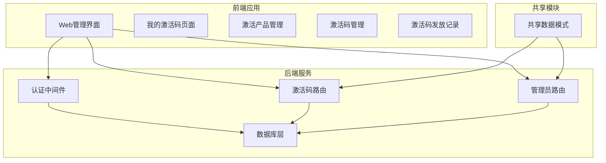
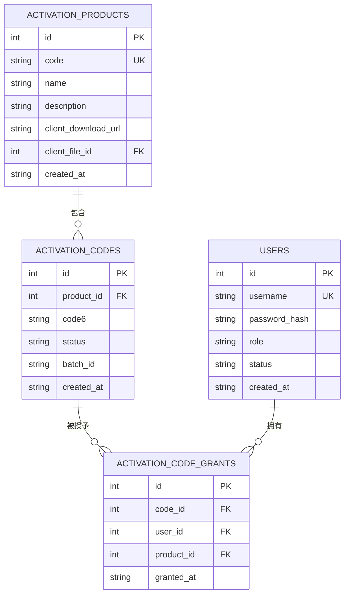
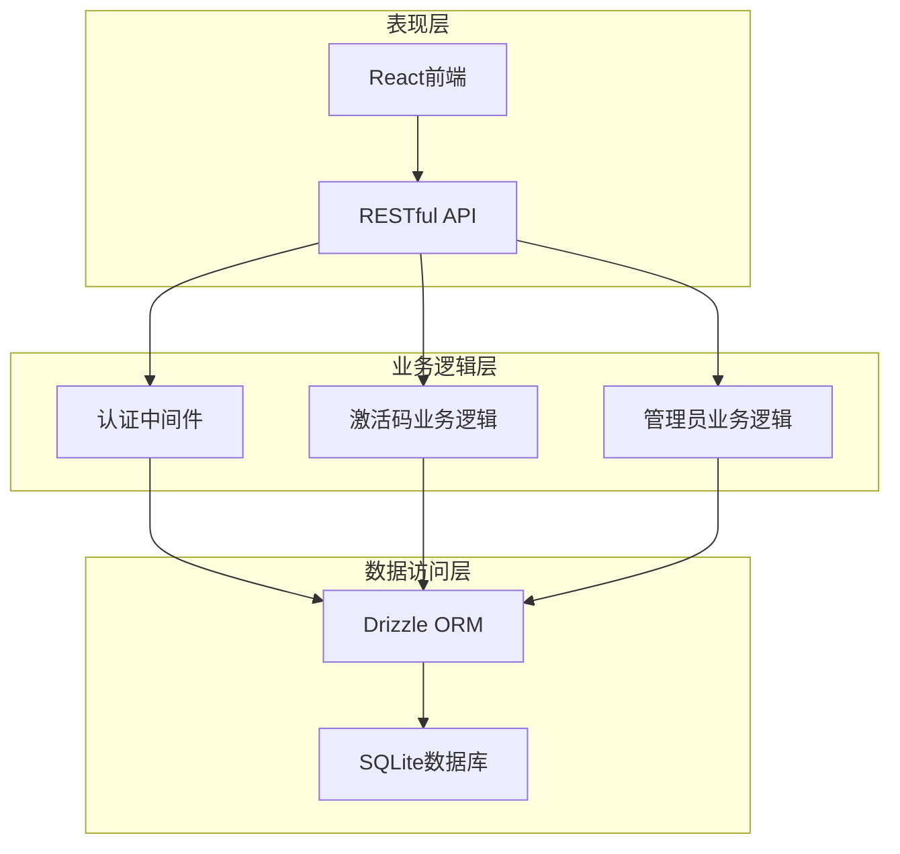
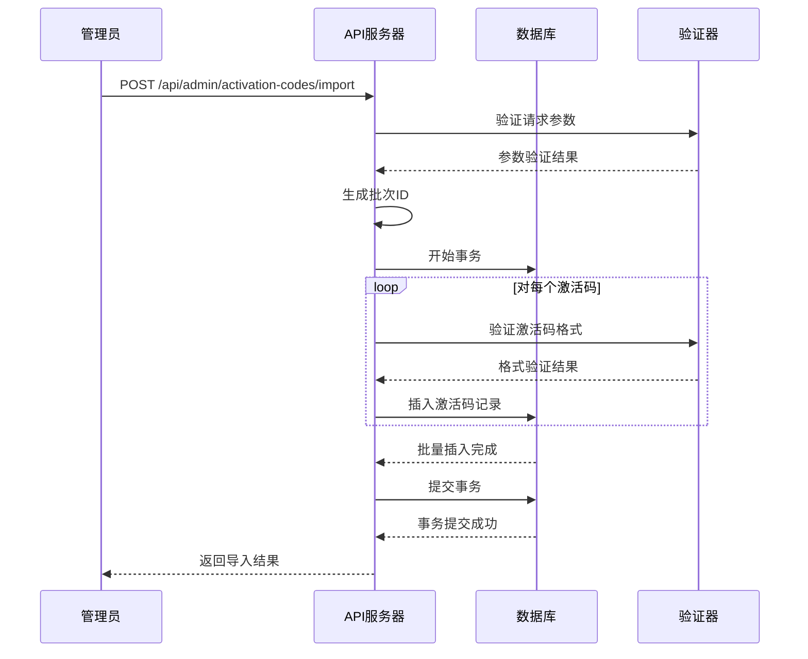
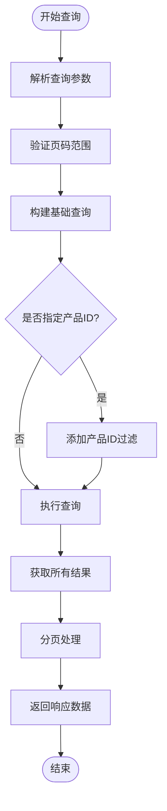
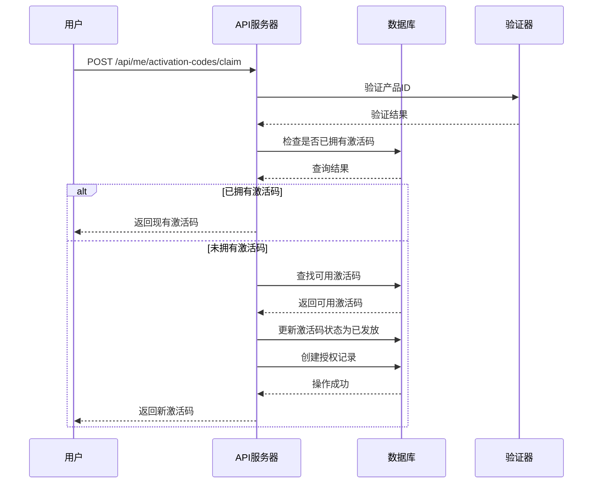
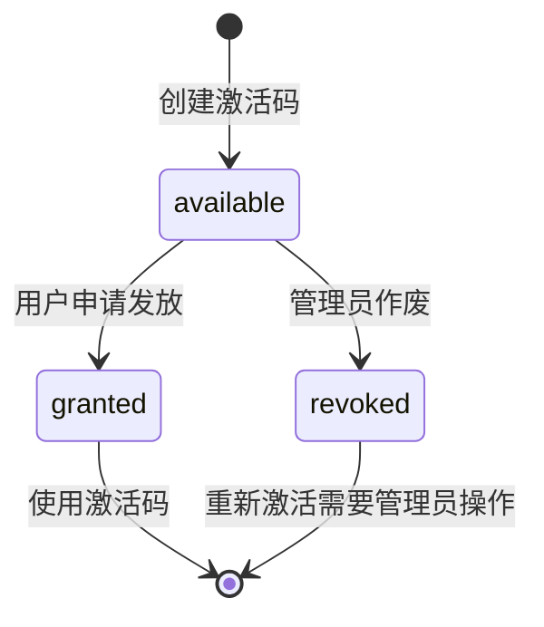
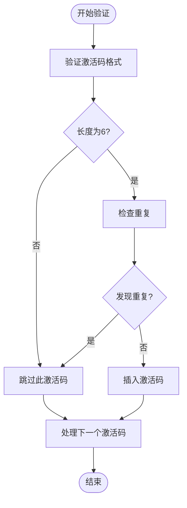
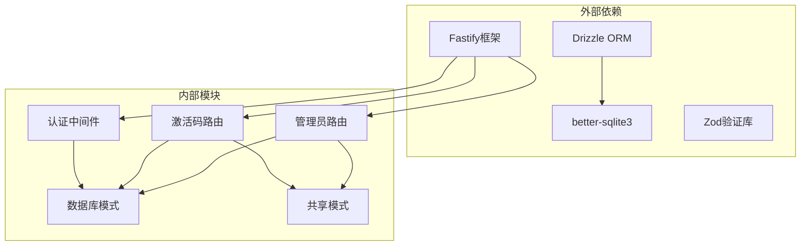

# 激活码管理API

<cite>
**本文档引用的文件**
- [apps/server/src/routes/activation.ts](file://apps/server/src/routes/activation.ts)
- [apps/server/src/routes/admin.ts](file://apps/server/src/routes/admin.ts)
- [apps/server/src/db/schema.ts](file://apps/server/src/db/schema.ts)
- [packages/shared/src/schemas.ts](file://packages/shared/src/schemas.ts)
- [apps/server/src/middleware/auth.ts](file://apps/server/src/middleware/auth.ts)
- [apps/server/src/db/index.ts](file://apps/server/src/db/index.ts)
- [apps/web/src/pages/admin/ActivationCodes.tsx](file://apps/web/src/pages/admin/ActivationCodes.tsx)
- [apps/web/src/pages/admin/ActivationGrants.tsx](file://apps/web/src/pages/admin/ActivationGrants.tsx)
- [apps/web/src/pages/admin/ActivationProducts.tsx](file://apps/web/src/pages/admin/ActivationProducts.tsx)
- [apps/web/src/pages/MyCodes.tsx](file://apps/web/src/pages/MyCodes.tsx)
- [apps/web/src/lib/api.ts](file://apps/web/src/lib/api.ts)
</cite>

## 目录
1. [简介](#简介)
2. [项目结构](#项目结构)
3. [核心组件](#核心组件)
4. [架构概览](#架构概览)
5. [详细组件分析](#详细组件分析)
6. [依赖关系分析](#依赖关系分析)
7. [性能考虑](#性能考虑)
8. [故障排除指南](#故障排除指南)
9. [结论](#结论)

## 简介

ZBH2平台的激活码管理API是一个完整的软件授权管理系统，支持激活码的批量导入、状态管理和授权发放功能。该系统通过RESTful API提供标准化的接口，结合前端管理界面实现完整的激活码生命周期管理。

系统采用Fastify作为后端框架，Drizzle ORM进行数据库操作，使用SQLite作为数据存储引擎。整个架构遵循分层设计原则，将业务逻辑、数据访问和表现层清晰分离。

## 项目结构

激活码管理功能分布在以下关键模块中：

**图表来源**
- [apps/server/src/routes/activation.ts:1-95](file://apps/server/src/routes/activation.ts#L1-L95)
- [apps/server/src/routes/admin.ts:1-279](file://apps/server/src/routes/admin.ts#L1-L279)
- [apps/server/src/middleware/auth.ts:1-56](file://apps/server/src/middleware/auth.ts#L1-L56)

**章节来源**
- [apps/server/src/routes/activation.ts:1-95](file://apps/server/src/routes/activation.ts#L1-L95)
- [apps/server/src/routes/admin.ts:1-279](file://apps/server/src/routes/admin.ts#L1-L279)
- [apps/server/src/db/schema.ts:71-96](file://apps/server/src/db/schema.ts#L71-L96)

## 核心组件

### 数据模型

激活码系统基于三个核心表构建：

**图表来源**
- [apps/server/src/db/schema.ts:71-96](file://apps/server/src/db/schema.ts#L71-L96)

### 认证与授权

系统采用基于会话的认证机制，支持管理员和普通用户两种角色：

- **管理员权限**：完全访问所有管理功能
- **普通用户权限**：仅能查看和申请自己的激活码
- **会话管理**：基于Cookie的SID会话，带过期时间检查

**章节来源**
- [apps/server/src/middleware/auth.ts:1-56](file://apps/server/src/middleware/auth.ts#L1-L56)
- [apps/server/src/db/schema.ts:3-17](file://apps/server/src/db/schema.ts#L3-L17)

## 架构概览

激活码管理系统的整体架构采用分层设计：

**图表来源**
- [apps/server/src/routes/activation.ts:1-95](file://apps/server/src/routes/activation.ts#L1-L95)
- [apps/server/src/routes/admin.ts:1-279](file://apps/server/src/routes/admin.ts#L1-L279)
- [apps/server/src/db/index.ts:1-16](file://apps/server/src/db/index.ts#L1-L16)

## 详细组件分析

### 批量导入功能

批量导入是激活码管理的核心功能之一，支持管理员批量创建激活码并分配到指定产品。

#### 接口定义

**POST /api/admin/activation-codes/import**

请求参数：
- `productId`: 整数，产品ID（必填）
- `codes`: 字符串数组，激活码列表（必填）

响应数据：
- `imported`: 整数，成功导入的数量
- `batchId`: 字符串，批次标识符

#### 处理流程

**图表来源**
- [apps/server/src/routes/admin.ts:178-197](file://apps/server/src/routes/admin.ts#L178-L197)

#### 格式验证规则

激活码必须满足以下条件：
- 长度必须为6个字符
- 只允许字母和数字
- 自动去除前后空白字符
- 支持换行符、逗号、分号分隔

**章节来源**
- [apps/server/src/routes/admin.ts:178-197](file://apps/server/src/routes/admin.ts#L178-L197)

### 列表查询功能

激活码列表查询支持分页、过滤和排序功能。

#### 接口定义

**GET /api/admin/activation-codes**

查询参数：
- `productId`: 整数，按产品ID过滤（可选）
- `page`: 整数，页码，默认1（可选）
- `pageSize`: 整数，每页数量，默认20，最大100（可选）

响应数据：
- `items`: 激活码列表
- `total`: 总记录数
- `page`: 当前页码
- `pageSize`: 每页大小

#### 查询流程

**图表来源**
- [apps/server/src/routes/admin.ts:161-176](file://apps/server/src/routes/admin.ts#L161-L176)

**章节来源**
- [apps/server/src/routes/admin.ts:161-176](file://apps/server/src/routes/admin.ts#L161-L176)

### 授权发放流程

激活码授权发放是用户获取激活码的核心流程，支持幂等性保证。

#### 接口定义

**POST /api/me/activation-codes/claim**

请求参数：
- `productId`: 整数，产品ID（必填）

响应数据：
- `alreadyClaimed`: 布尔值，是否已拥有该产品的激活码
- `code6`: 字符串，激活码

#### 发放流程

**图表来源**
- [apps/server/src/routes/activation.ts:8-75](file://apps/server/src/routes/activation.ts#L8-L75)

#### 幂等性保证

系统通过以下机制确保幂等性：
- 检查用户是否已对同一产品拥有激活码
- 如果已拥有，直接返回现有激活码
- 避免重复发放同一产品的多个激活码

**章节来源**
- [apps/server/src/routes/activation.ts:22-42](file://apps/server/src/routes/activation.ts#L22-L42)

### 状态管理机制

激活码具有三种状态，通过状态字段进行管理：

| 状态 | 描述 | 允许的操作 |
|------|------|------------|
| available | 可用 | 可以被发放 |
| granted | 已发放 | 不可再次发放 |
| revoked | 已作废 | 不可使用 |

#### 状态转换图

**图表来源**
- [apps/server/src/db/schema.ts:84-86](file://apps/server/src/db/schema.ts#L84-L86)

**章节来源**
- [apps/server/src/db/schema.ts:84-86](file://apps/server/src/db/schema.ts#L84-L86)

### 批次追踪机制

系统通过批次ID实现激活码的批次管理：

- **批次ID生成**：使用当前时间戳的36进制表示
- **批次关联**：同一批次导入的所有激活码共享同一个批次ID
- **批次查询**：可通过批次ID查询相关激活码

**章节来源**
- [apps/server/src/routes/admin.ts:183-196](file://apps/server/src/routes/admin.ts#L183-L196)

### 安全规则与重复验证

系统实施了多重安全措施：

#### 重复验证机制

**图表来源**
- [apps/server/src/routes/admin.ts:185-195](file://apps/server/src/routes/admin.ts#L185-L195)

#### 安全规则

1. **输入验证**：严格验证激活码格式和长度
2. **权限控制**：批量导入仅限管理员访问
3. **幂等性**：授权发放支持幂等操作
4. **重复检测**：自动检测并跳过重复的激活码
5. **状态约束**：激活码只能在特定状态下进行操作

**章节来源**
- [apps/server/src/routes/admin.ts:178-197](file://apps/server/src/routes/admin.ts#L178-L197)
- [apps/server/src/routes/activation.ts:22-42](file://apps/server/src/routes/activation.ts#L22-L42)

## 依赖关系分析

激活码管理API的依赖关系如下：

**图表来源**
- [apps/server/src/routes/activation.ts:1-6](file://apps/server/src/routes/activation.ts#L1-L6)
- [apps/server/src/routes/admin.ts:1-14](file://apps/server/src/routes/admin.ts#L1-L14)

**章节来源**
- [apps/server/src/routes/activation.ts:1-6](file://apps/server/src/routes/activation.ts#L1-L6)
- [apps/server/src/routes/admin.ts:1-14](file://apps/server/src/routes/admin.ts#L1-L14)

## 性能考虑

### 数据库优化

1. **索引策略**：
   - 激活码主键索引
   - 产品ID外键索引
   - 批次ID索引
   - 状态字段索引

2. **查询优化**：
   - 分页查询避免一次性加载大量数据
   - 条件查询使用适当的WHERE子句
   - 连接查询使用JOIN而非子查询

### 缓存策略

建议实现以下缓存机制：
- 激活产品信息缓存
- 用户权限缓存
- 最近查询结果缓存

### 并发控制

系统通过以下方式处理并发：
- 数据库事务确保操作原子性
- 锁机制防止重复发放
- 幂等性设计避免重复操作

## 故障排除指南

### 常见错误及解决方案

#### 认证失败
**问题**：返回401未授权错误
**原因**：用户未登录或会话过期
**解决**：重新登录获取有效会话

#### 权限不足
**问题**：返回403权限不足错误
**原因**：普通用户尝试访问管理员功能
**解决**：使用管理员账户登录

#### 激活码格式错误
**问题**：批量导入时激活码被跳过
**原因**：激活码不符合6位字符要求
**解决**：确保激活码为6个字符且只包含字母数字

#### 激活码重复
**问题**：重复的激活码被跳过
**原因**：数据库中已存在相同激活码
**解决**：检查并移除重复的激活码

#### 资源不存在
**问题**：返回404资源不存在错误
**原因**：指定的产品或激活码不存在
**解决**：确认产品ID和激活码的有效性

**章节来源**
- [apps/server/src/middleware/auth.ts:42-55](file://apps/server/src/middleware/auth.ts#L42-L55)
- [apps/server/src/routes/admin.ts:178-182](file://apps/server/src/routes/admin.ts#L178-L182)
- [apps/server/src/routes/activation.ts:16-20](file://apps/server/src/routes/activation.ts#L16-L20)

## 结论

ZBH2平台的激活码管理API提供了一个完整、安全且高效的软件授权管理解决方案。系统通过清晰的分层架构、严格的验证机制和完善的权限控制，确保了激活码管理的安全性和可靠性。

主要特点包括：
- **完整的生命周期管理**：从创建到发放再到审计的全流程支持
- **强大的批量处理能力**：支持大规模激活码的快速导入
- **严格的安全控制**：多层验证和权限保护机制
- **灵活的状态管理**：支持激活码状态的动态变化
- **完善的审计功能**：完整的授权记录和操作日志

该系统为软件分发和授权管理提供了坚实的技术基础，可根据实际需求进一步扩展和优化。