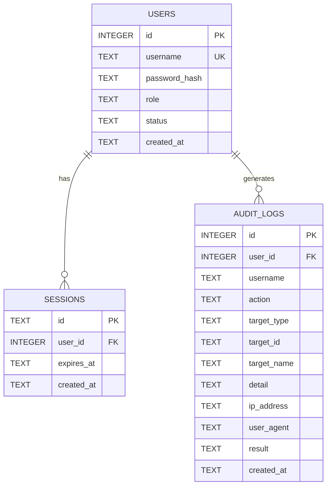
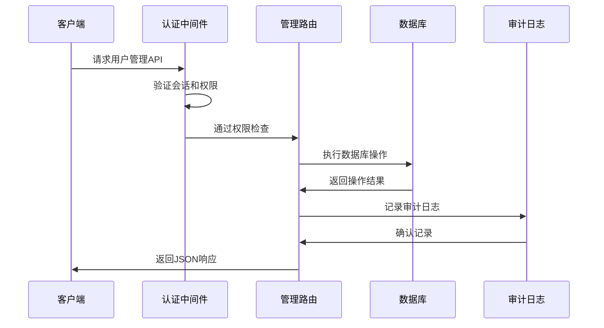
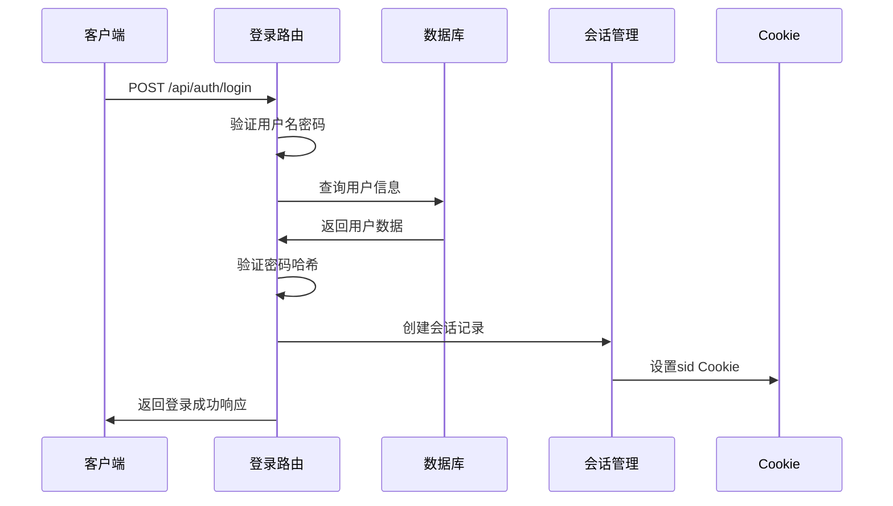

# 用户管理API

<cite>
**本文档引用的文件**
- [admin.ts](file://apps/server/src/routes/admin.ts)
- [auth.ts](file://apps/server/src/middleware/auth.ts)
- [audit.ts](file://apps/server/src/middleware/audit.ts)
- [schema.ts](file://apps/server/src/db/schema.ts)
- [schemas.ts](file://packages/shared/src/schemas.ts)
- [auth.ts](file://apps/server/src/routes/auth.ts)
- [index.ts](file://apps/server/src/index.ts)
- [Users.tsx](file://apps/web/src/pages/admin/Users.tsx)
- [api.ts](file://apps/web/src/lib/api.ts)
</cite>

## 目录
1. [简介](#简介)
2. [项目结构](#项目结构)
3. [核心组件](#核心组件)
4. [架构概览](#架构概览)
5. [详细组件分析](#详细组件分析)
6. [依赖关系分析](#依赖关系分析)
7. [性能考虑](#性能考虑)
8. [故障排除指南](#故障排除指南)
9. [结论](#结论)

## 简介

ZBH2平台的用户管理API提供了完整的用户生命周期管理功能，包括用户创建、更新、删除和列表查询。该系统采用Fastify框架构建，使用Argon2进行密码哈希处理，支持管理员权限验证和安全审计功能。

系统支持两种用户角色：普通用户（user）和管理员（admin），以及两种状态：启用（active）和禁用（disabled）。所有用户操作都经过严格的身份验证和权限控制。

## 项目结构

用户管理功能主要分布在以下模块中：

```mermaid
graph TB
subgraph "服务器端"
A[index.ts] --> B[auth.ts]
A --> C[admin.ts]
A --> D[schema.ts]
B --> E[middleware/auth.ts]
C --> F[db/schema.ts]
C --> G[middleware/audit.ts]
C --> H[shared/schemas.ts]
end
subgraph "客户端"
I[Users.tsx] --> J[api.ts]
J --> K[/api/admin/users]
end
L[数据库] --> F
M[前端界面] --> I
```

**图表来源**
- [index.ts:29-50](file://apps/server/src/index.ts#L29-L50)
- [admin.ts:15-279](file://apps/server/src/routes/admin.ts#L15-L279)

**章节来源**
- [index.ts:1-60](file://apps/server/src/index.ts#L1-L60)
- [admin.ts:1-279](file://apps/server/src/routes/admin.ts#L1-L279)

## 核心组件

### 用户数据模型

用户管理的核心数据结构定义如下：



**图表来源**
- [schema.ts:3-17](file://apps/server/src/db/schema.ts#L3-L17)
- [schema.ts:301-314](file://apps/server/src/db/schema.ts#L301-L314)

### 角色和权限体系

系统采用基于角色的访问控制（RBAC）机制：

| 角色 | 权限描述 | 可执行操作 |
|------|----------|------------|
| user | 普通用户权限 | 查看个人信息、修改密码、使用平台功能 |
| admin | 管理员权限 | 用户管理、系统配置、内容管理 |

**章节来源**
- [schema.ts:6-8](file://apps/server/src/db/schema.ts#L6-L8)
- [auth.ts:8](file://apps/server/src/middleware/auth.ts#L8)

## 架构概览

用户管理API采用分层架构设计，确保安全性、可维护性和可扩展性：



**图表来源**
- [auth.ts:48-55](file://apps/server/src/middleware/auth.ts#L48-L55)
- [admin.ts:16](file://apps/server/src/routes/admin.ts#L16)

## 详细组件分析

### 用户管理路由

#### GET /api/admin/users

用户列表查询接口，返回所有用户的简要信息。

**请求参数**
- 无

**响应数据结构**
```typescript
{
  success: boolean,
  data: Array<{
    id: number,
    username: string,
    role: 'admin' | 'user',
    status: 'active' | 'disabled',
    createdAt: string
  }>
}
```

**响应示例**
```json
{
  "success": true,
  "data": [
    {
      "id": 1,
      "username": "admin",
      "role": "admin",
      "status": "active",
      "createdAt": "2024-01-01T00:00:00.000Z"
    }
  ]
}
```

**章节来源**
- [admin.ts:222-235](file://apps/server/src/routes/admin.ts#L222-L235)

#### POST /api/admin/users

创建新用户接口。

**请求体参数**
```typescript
{
  username: string,      // 用户名，2-50字符
  password: string,      // 密码，至少6字符
  role: 'admin' | 'user' // 角色，默认user
}
```

**响应示例**
```json
{
  "success": true,
  "data": {
    "id": 2,
    "username": "john_doe",
    "role": "user"
  }
}
```

**错误处理**
- 400: 参数验证失败
- 409: 用户名已存在

**章节来源**
- [admin.ts:237-249](file://apps/server/src/routes/admin.ts#L237-L249)
- [schemas.ts:8-12](file://packages/shared/src/schemas.ts#L8-L12)

#### PUT /api/admin/users/:id

更新用户信息接口。

**路径参数**
- id: 用户ID

**请求体参数**
```typescript
{
  role?: 'admin' | 'user',    // 更新角色
  status?: 'active' | 'disabled', // 更新状态
  password?: string           // 新密码（至少6字符）
}
```

**响应示例**
```json
{
  "success": true
}
```

**安全限制**
- 不允许用户自删除自己的账户
- 密码更新时自动进行哈希处理

**章节来源**
- [admin.ts:251-262](file://apps/server/src/routes/admin.ts#L251-L262)

#### DELETE /api/admin/users/:id

删除用户接口。

**路径参数**
- id: 用户ID

**响应示例**
```json
{
  "success": true
}
```

**安全限制**
- 管理员不能删除自己的账户
- 删除操作不可逆

**章节来源**
- [admin.ts:264-271](file://apps/server/src/routes/admin.ts#L264-L271)

### 认证和会话管理

#### 登录流程



**图表来源**
- [auth.ts:9-33](file://apps/server/src/routes/auth.ts#L9-L33)

**章节来源**
- [auth.ts:9-33](file://apps/server/src/routes/auth.ts#L9-L33)

### 审计日志系统

系统自动记录所有重要的用户管理操作：

| 操作类型 | 描述 | 记录内容 |
|----------|------|----------|
| create | 创建用户 | 记录新用户信息和创建者 |
| update | 更新用户 | 记录变更字段和变更详情 |
| delete | 删除用户 | 记录被删除用户信息 |
| login | 用户登录 | 记录登录时间和IP地址 |
| logout | 用户登出 | 记录登出时间 |

**章节来源**
- [audit.ts:3-27](file://apps/server/src/middleware/audit.ts#L3-L27)

## 依赖关系分析

### 组件依赖图

```mermaid
graph TD
A[admin.ts] --> B[auth.ts]
A --> C[schema.ts]
A --> D[audit.ts]
A --> E[schemas.ts]
F[auth.ts] --> C
G[auth.ts] --> H[loginSchema]
I[audit.ts] --> C
J[auth.ts] --> K[argon2]
L[admin.ts] --> K
M[Users.tsx] --> N[api.ts]
N --> O[/api/admin/users]
P[index.ts] --> A
P --> F
Q[schema.ts] --> R[SQLite数据库]
```

**图表来源**
- [admin.ts:1-13](file://apps/server/src/routes/admin.ts#L1-L13)
- [index.ts:11-19](file://apps/server/src/index.ts#L11-L19)

### 外部依赖

| 依赖包 | 版本 | 用途 |
|--------|------|------|
| argon2 | - | 密码哈希处理 |
| drizzle-orm | - | 数据库ORM |
| zod | - | 数据验证 |
| nanoid | - | 会话ID生成 |

**章节来源**
- [admin.ts:5](file://apps/server/src/routes/admin.ts#L5)
- [auth.ts:2](file://apps/server/src/routes/auth.ts#L2)

## 性能考虑

### 数据库优化

1. **索引策略**
   - 用户名建立唯一索引，确保用户名唯一性
   - 会话ID建立主键索引，提高查询效率

2. **查询优化**
   - 用户列表查询按创建时间倒序排列
   - 支持分页查询，限制每页最大100条记录

3. **缓存策略**
   - 会话信息存储在内存中，避免频繁数据库查询

### 安全优化

1. **密码安全**
   - 使用Argon2算法进行密码哈希
   - 密码最小长度6字符
   - 密码哈希自动处理，无需手动实现

2. **权限控制**
   - 所有用户管理操作都需要管理员权限
   - 自动会话验证和过期处理

3. **输入验证**
   - 使用Zod进行严格的参数验证
   - 防止SQL注入和XSS攻击

## 故障排除指南

### 常见错误及解决方案

| 错误代码 | 错误原因 | 解决方案 |
|----------|----------|----------|
| 401 | 未登录或会话过期 | 重新登录获取新的会话ID |
| 403 | 权限不足 | 确保当前用户具有管理员权限 |
| 400 | 参数验证失败 | 检查请求参数格式和长度要求 |
| 409 | 用户名冲突 | 更换唯一的用户名 |
| 400 | 自己删除自己 | 使用其他管理员账户执行删除操作 |

### 调试技巧

1. **检查会话状态**
   ```bash
   curl -b cookies.txt -c cookies.txt http://localhost:7500/api/auth/me
   ```

2. **验证用户权限**
   ```bash
   curl -H "Authorization: Bearer YOUR_TOKEN" http://localhost:7500/api/admin/users
   ```

3. **查看审计日志**
   ```sql
   SELECT * FROM audit_logs WHERE target_type='user' ORDER BY created_at DESC LIMIT 10;
   ```

**章节来源**
- [auth.ts:42-55](file://apps/server/src/middleware/auth.ts#L42-L55)
- [admin.ts:266-268](file://apps/server/src/routes/admin.ts#L266-L268)

## 结论

ZBH2平台的用户管理API提供了完整、安全、易用的用户生命周期管理功能。系统采用现代化的技术栈，包括Fastify框架、Argon2密码哈希、Drizzle ORM和Zod数据验证，确保了系统的高性能和安全性。

主要特性包括：
- 完整的CRUD操作支持
- 严格的角色权限控制
- 自动化的安全审计
- 用户友好的错误处理
- 可扩展的架构设计

该API为ZBH2平台的用户管理提供了坚实的基础，支持未来的功能扩展和业务发展需求。