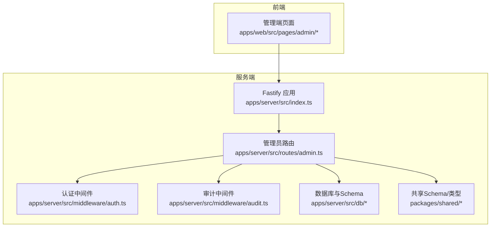
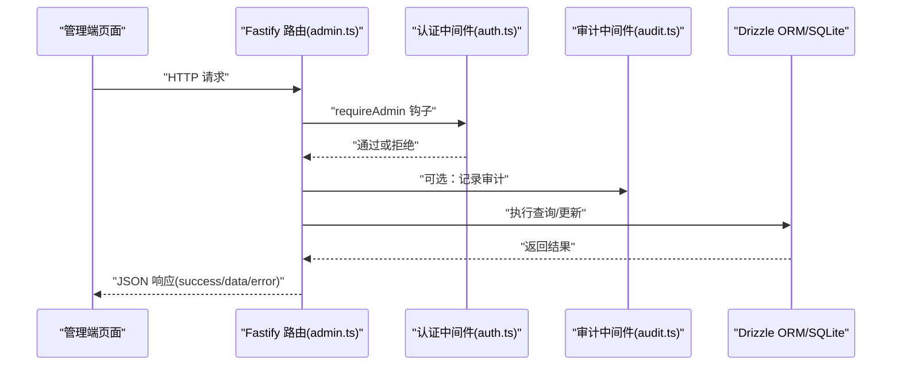
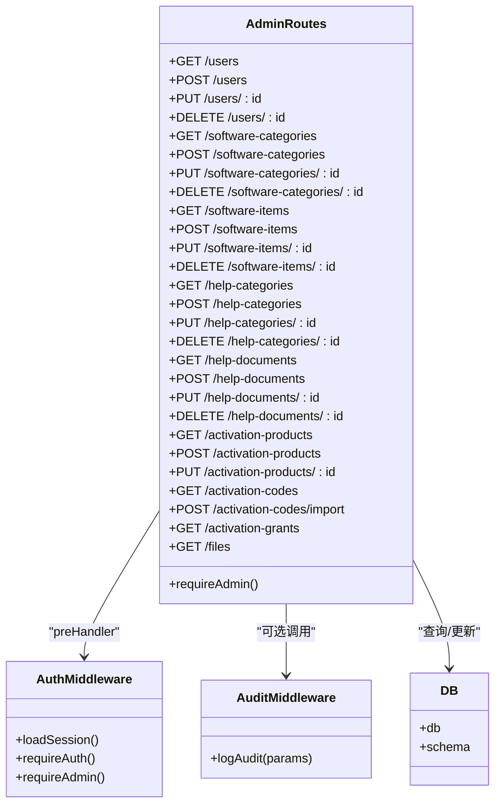

# 管理员API

<cite>
**本文引用的文件**
- [apps/server/src/routes/admin.ts](file://apps/server/src/routes/admin.ts)
- [apps/server/src/middleware/auth.ts](file://apps/server/src/middleware/auth.ts)
- [apps/server/src/middleware/audit.ts](file://apps/server/src/middleware/audit.ts)
- [apps/server/src/db/schema.ts](file://apps/server/src/db/schema.ts)
- [apps/server/src/db/index.ts](file://apps/server/src/db/index.ts)
- [packages/shared/src/schemas.ts](file://packages/shared/src/schemas.ts)
- [packages/shared/src/types.ts](file://packages/shared/src/types.ts)
- [apps/server/drizzle/0000_absurd_liz_osborn.sql](file://apps/server/drizzle/0000_absurd_liz_osborn.sql)
- [apps/server/drizzle/0001_zippy_shadowcat.sql](file://apps/server/drizzle/0001_zippy_shadowcat.sql)
- [apps/server/drizzle/0002_special_medusa.sql](file://apps/server/drizzle/0002_special_medusa.sql)
- [apps/server/src/routes/activation.ts](file://apps/server/src/routes/activation.ts)
- [apps/web/src/pages/admin/Users.tsx](file://apps/web/src/pages/admin/Users.tsx)
- [apps/web/src/pages/admin/SoftwareCategories.tsx](file://apps/web/src/pages/admin/SoftwareCategories.tsx)
- [apps/web/src/pages/admin/HelpDocuments.tsx](file://apps/web/src/pages/admin/HelpDocuments.tsx)
</cite>

## 目录
1. [简介](#简介)
2. [项目结构](#项目结构)
3. [核心组件](#核心组件)
4. [架构总览](#架构总览)
5. [详细组件分析](#详细组件分析)
6. [依赖关系分析](#依赖关系分析)
7. [性能考量](#性能考量)
8. [故障排查指南](#故障排查指南)
9. [结论](#结论)
10. [附录：接口清单与示例](#附录接口清单与示例)

## 简介
本文件为 ZBH2 平台“管理员API”的权威技术文档，覆盖以下业务域的管理接口：
- 用户管理：CRUD、角色与状态变更、密码更新
- 软件分类管理：层级结构维护、排序更新
- 软件条目管理：内容编辑、版本控制、发布状态切换
- 帮助文档管理：分类维护、内容编辑、发布流程
- 激活产品管理：产品配置、批量导入激活码、发放审计

文档同时说明管理员权限验证、操作审计与安全限制，并提供请求/响应示例路径，便于前后端联调与集成。

## 项目结构
后端采用 Fastify + Drizzle ORM + Better-SQLite3，数据库通过迁移脚本初始化；共享包提供输入校验 Schema 与类型定义；前端 Web 使用 Ant Design 表单与表格对接管理端路由。

图表来源
- [apps/server/src/routes/admin.ts:1-279](file://apps/server/src/routes/admin.ts#L1-L279)
- [apps/server/src/middleware/auth.ts:1-56](file://apps/server/src/middleware/auth.ts#L1-L56)
- [apps/server/src/middleware/audit.ts:1-28](file://apps/server/src/middleware/audit.ts#L1-L28)
- [apps/server/src/db/schema.ts:1-330](file://apps/server/src/db/schema.ts#L1-L330)
- [packages/shared/src/schemas.ts:1-51](file://packages/shared/src/schemas.ts#L1-L51)
- [packages/shared/src/types.ts:1-18](file://packages/shared/src/types.ts#L1-L18)

章节来源
- [apps/server/src/routes/admin.ts:1-279](file://apps/server/src/routes/admin.ts#L1-L279)
- [apps/server/src/middleware/auth.ts:1-56](file://apps/server/src/middleware/auth.ts#L1-L56)
- [apps/server/src/middleware/audit.ts:1-28](file://apps/server/src/middleware/audit.ts#L1-L28)
- [apps/server/src/db/schema.ts:1-330](file://apps/server/src/db/schema.ts#L1-L330)
- [packages/shared/src/schemas.ts:1-51](file://packages/shared/src/schemas.ts#L1-L51)
- [packages/shared/src/types.ts:1-18](file://packages/shared/src/types.ts#L1-L18)

## 核心组件
- 管理员路由模块：集中实现所有管理端 CRUD 与批量操作，统一前置管理员鉴权钩子
- 认证中间件：会话加载、登录态校验、管理员权限校验
- 审计中间件：统一记录审计日志，包含操作者、目标、结果、IP、UA 等
- 数据层：Drizzle ORM + SQLite，表结构由迁移脚本与 schema 定义共同约束
- 共享层：Zod Schema 用于请求体校验，类型定义用于前后端契约一致

章节来源
- [apps/server/src/routes/admin.ts:15-279](file://apps/server/src/routes/admin.ts#L15-L279)
- [apps/server/src/middleware/auth.ts:17-55](file://apps/server/src/middleware/auth.ts#L17-L55)
- [apps/server/src/middleware/audit.ts:3-27](file://apps/server/src/middleware/audit.ts#L3-L27)
- [apps/server/src/db/schema.ts:3-330](file://apps/server/src/db/schema.ts#L3-L330)
- [packages/shared/src/schemas.ts:8-50](file://packages/shared/src/schemas.ts#L8-L50)
- [packages/shared/src/types.ts:6-17](file://packages/shared/src/types.ts#L6-L17)

## 架构总览
管理员 API 的典型调用链如下：

图表来源
- [apps/server/src/routes/admin.ts:16](file://apps/server/src/routes/admin.ts#L16)
- [apps/server/src/middleware/auth.ts:48-55](file://apps/server/src/middleware/auth.ts#L48-L55)
- [apps/server/src/middleware/audit.ts:14-27](file://apps/server/src/middleware/audit.ts#L14-L27)
- [apps/server/src/db/index.ts:14](file://apps/server/src/db/index.ts#L14)

## 详细组件分析

### 权限与安全
- 管理员鉴权：所有管理员端路由在 preHandler 中应用 requireAdmin，未登录返回 401，非管理员返回 403
- 会话加载：loadSession 从 Cookie 读取 sid，校验未过期且用户状态为 active
- 自身保护：删除用户时禁止删除当前登录用户
- 审计日志：建议在关键写操作中调用 logAudit 记录操作详情

章节来源
- [apps/server/src/middleware/auth.ts:17-55](file://apps/server/src/middleware/auth.ts#L17-L55)
- [apps/server/src/routes/admin.ts:266-270](file://apps/server/src/routes/admin.ts#L266-L270)
- [apps/server/src/middleware/audit.ts:3-27](file://apps/server/src/middleware/audit.ts#L3-L27)

### 用户管理
- 列表：GET /api/admin/users，返回字段包括 id、username、role、status、createdAt
- 新增：POST /api/admin/users，请求体需满足 createUserSchema；密码经 argon2 哈希存储
- 更新：PUT /api/admin/users/:id，支持更新 role、status、password（≥6位）
- 删除：DELETE /api/admin/users/:id，禁止删除自身

请求/响应示例路径
- 新增用户请求体参考：[packages/shared/src/schemas.ts:8-12](file://packages/shared/src/schemas.ts#L8-L12)
- 成功响应结构参考：[packages/shared/src/types.ts:6-10](file://packages/shared/src/types.ts#L6-L10)

章节来源
- [apps/server/src/routes/admin.ts:222-271](file://apps/server/src/routes/admin.ts#L222-L271)
- [packages/shared/src/schemas.ts:8-12](file://packages/shared/src/schemas.ts#L8-L12)
- [packages/shared/src/types.ts:6-10](file://packages/shared/src/types.ts#L6-L10)

### 软件分类管理
- 列表：GET /api/admin/software-categories，按 sort 升序返回
- 新增：POST /api/admin/software-categories，请求体满足 softwareCategorySchema
- 更新：PUT /api/admin/software-categories/:id，请求体满足 softwareCategorySchema
- 删除：DELETE /api/admin/software-categories/:id

排序与层级
- 排序字段 sort 支持整数，前端可拖拽调整顺序
- 分类与条目通过 categoryId 关联，删除分类前需处理关联条目

请求/响应示例路径
- 分类 Schema 参考：[packages/shared/src/schemas.ts:14-17](file://packages/shared/src/schemas.ts#L14-L17)

章节来源
- [apps/server/src/routes/admin.ts:18-43](file://apps/server/src/routes/admin.ts#L18-L43)
- [packages/shared/src/schemas.ts:14-17](file://packages/shared/src/schemas.ts#L14-L17)

### 软件条目管理
- 列表：GET /api/admin/software-items，按 sort 升序返回
- 新增：POST /api/admin/software-items，请求体满足 softwareItemSchema
- 更新：PUT /api/admin/software-items/:id，允许更新 title/description/categoryId/version/fileId/iconFileId/sort/status
- 删除：DELETE /api/admin/software-items/:id
- 版本控制：version 字段用于标识版本号；状态 status 支持 draft/published
- 文件关联：fileId/iconFileId 关联 files 表

请求/响应示例路径
- 条目 Schema 参考：[packages/shared/src/schemas.ts:24-31](file://packages/shared/src/schemas.ts#L24-L31)
- 数据模型参考：[apps/server/src/db/schema.ts:37-49](file://apps/server/src/db/schema.ts#L37-L49)

章节来源
- [apps/server/src/routes/admin.ts:45-73](file://apps/server/src/routes/admin.ts#L45-L73)
- [packages/shared/src/schemas.ts:24-31](file://packages/shared/src/schemas.ts#L24-L31)
- [apps/server/src/db/schema.ts:37-49](file://apps/server/src/db/schema.ts#L37-L49)

### 帮助文档管理
- 列表：GET /api/admin/help-documents，按 createdAt 降序返回
- 新增：POST /api/admin/help-documents，请求体满足 helpDocumentSchema；若 status=published 自动写入 publishedAt
- 更新：PUT /api/admin/help-documents/:id，允许更新 title/body/categoryId/sort/status；当状态切换到 published 写入 publishedAt，切换到 archived 写入 archivedAt
- 删除：DELETE /api/admin/help-documents/:id
- 分类维护：GET /api/admin/help-categories，按 sort 升序返回

请求/响应示例路径
- 文档 Schema 参考：[packages/shared/src/schemas.ts:33-39](file://packages/shared/src/schemas.ts#L33-L39)
- 数据模型参考：[apps/server/src/db/schema.ts:58-69](file://apps/server/src/db/schema.ts#L58-L69)

章节来源
- [apps/server/src/routes/admin.ts:75-134](file://apps/server/src/routes/admin.ts#L75-L134)
- [packages/shared/src/schemas.ts:33-39](file://packages/shared/src/schemas.ts#L33-L39)
- [apps/server/src/db/schema.ts:58-69](file://apps/server/src/db/schema.ts#L58-L69)

### 激活产品与激活码
- 激活产品
  - 列表：GET /api/admin/activation-products
  - 新增：POST /api/admin/activation-products，请求体满足 activationProductSchema
  - 更新：PUT /api/admin/activation-products/:id，允许更新 code/name/description/clientDownloadUrl/clientFileId
- 激活码
  - 列表：GET /api/admin/activation-codes，支持 productId、分页参数 page/pageSize 查询
  - 批量导入：POST /api/admin/activation-codes/import，请求体包含 productId 与 codes 数组；仅保留长度为6的合法码
- 发放审计
  - 列表：GET /api/admin/activation-grants，返回 code6、用户名、产品名、发放时间等

请求/响应示例路径
- 产品 Schema 参考：[packages/shared/src/schemas.ts:41-46](file://packages/shared/src/schemas.ts#L41-L46)
- 数据模型参考：[apps/server/src/db/schema.ts:71-96](file://apps/server/src/db/schema.ts#L71-L96)

章节来源
- [apps/server/src/routes/admin.ts:136-219](file://apps/server/src/routes/admin.ts#L136-L219)
- [packages/shared/src/schemas.ts:41-46](file://packages/shared/src/schemas.ts#L41-L46)
- [apps/server/src/db/schema.ts:71-96](file://apps/server/src/db/schema.ts#L71-L96)

### 文件管理
- 列表：GET /api/admin/files，按 createdAt 降序返回

文件模型字段
- originalName、storagePath、mime、size、hash、uploaderId、createdAt

章节来源
- [apps/server/src/routes/admin.ts:273-277](file://apps/server/src/routes/admin.ts#L273-L277)
- [apps/server/src/db/schema.ts:26-35](file://apps/server/src/db/schema.ts#L26-L35)

## 依赖关系分析

图表来源
- [apps/server/src/routes/admin.ts:15-279](file://apps/server/src/routes/admin.ts#L15-L279)
- [apps/server/src/middleware/auth.ts:17-55](file://apps/server/src/middleware/auth.ts#L17-L55)
- [apps/server/src/middleware/audit.ts:3-27](file://apps/server/src/middleware/audit.ts#L3-L27)
- [apps/server/src/db/index.ts:14](file://apps/server/src/db/index.ts#L14)

章节来源
- [apps/server/src/routes/admin.ts:15-279](file://apps/server/src/routes/admin.ts#L15-L279)
- [apps/server/src/middleware/auth.ts:17-55](file://apps/server/src/middleware/auth.ts#L17-L55)
- [apps/server/src/middleware/audit.ts:3-27](file://apps/server/src/middleware/audit.ts#L3-L27)
- [apps/server/src/db/index.ts:14](file://apps/server/src/db/index.ts#L14)

## 性能考量
- 分页与排序：激活码列表支持分页，建议前端传入合理 page/pageSize，避免一次性拉取大量数据
- 批量导入：激活码导入循环插入，建议控制单次 codes 数量，避免超长事务
- 审计日志：写入审计表为同步 IO，建议在高频写操作时评估日志策略
- 数据库连接：SQLite 为本地文件型数据库，注意并发写入与 WAL 模式配置

[本节为通用指导，无需列出章节来源]

## 故障排查指南
- 401 未登录：检查 Cookie 中 sid 是否存在且未过期；确认会话是否被删除
- 403 权限不足：确认当前用户 role 是否为 admin
- 400 参数错误：检查请求体是否满足对应 Schema（如用户名长度、密码长度、分类名称、文档标题等）
- 409 冲突：新增用户时用户名重复；激活码导入时非法码或重复
- 404 资源不存在：访问不存在的 ID 或产品
- 409 激活码冲突：用户对同一产品重复领取；无可用激活码

章节来源
- [apps/server/src/middleware/auth.ts:42-55](file://apps/server/src/middleware/auth.ts#L42-L55)
- [apps/server/src/routes/admin.ts:237-241](file://apps/server/src/routes/admin.ts#L237-L241)
- [apps/server/src/routes/admin.ts:178-197](file://apps/server/src/routes/admin.ts#L178-L197)
- [apps/server/src/routes/activation.ts:8-75](file://apps/server/src/routes/activation.ts#L8-L75)

## 结论
管理员 API 提供了完善的后台管理能力，覆盖用户、软件、帮助文档与激活体系的关键操作。通过统一的管理员鉴权与可选审计机制，保障了系统的安全性与可追溯性。建议在生产环境配合前端进行充分的边界测试与安全扫描，并根据业务增长逐步引入更强大的数据库与缓存策略。

[本节为总结性内容，无需列出章节来源]

## 附录：接口清单与示例

### 权限与会话
- 鉴权中间件
  - requireAdmin：仅管理员可访问
  - requireAuth：需要登录
  - loadSession：加载会话并校验用户状态
- 审计日志
  - logAudit：记录操作者、目标、结果、IP、UA 等

章节来源
- [apps/server/src/middleware/auth.ts:17-55](file://apps/server/src/middleware/auth.ts#L17-L55)
- [apps/server/src/middleware/audit.ts:3-27](file://apps/server/src/middleware/audit.ts#L3-L27)

### 用户管理
- GET /api/admin/users
  - 返回字段：id、username、role、status、createdAt
- POST /api/admin/users
  - 请求体：username、password、role
  - 密码经哈希存储
- PUT /api/admin/users/:id
  - 请求体：role、status、password（≥6位）
- DELETE /api/admin/users/:id
  - 禁止删除当前登录用户

章节来源
- [apps/server/src/routes/admin.ts:222-271](file://apps/server/src/routes/admin.ts#L222-L271)

### 软件分类管理
- GET /api/admin/software-categories
  - 按 sort 升序返回
- POST /api/admin/software-categories
  - 请求体：name、sort
- PUT /api/admin/software-categories/:id
  - 请求体：name、sort
- DELETE /api/admin/software-categories/:id

章节来源
- [apps/server/src/routes/admin.ts:18-43](file://apps/server/src/routes/admin.ts#L18-L43)

### 软件条目管理
- GET /api/admin/software-items
  - 按 sort 升序返回
- POST /api/admin/software-items
  - 请求体：title、description、categoryId、version、sort、status
- PUT /api/admin/software-items/:id
  - 允许更新：title、description、categoryId、version、fileId、iconFileId、sort、status
- DELETE /api/admin/software-items/:id

章节来源
- [apps/server/src/routes/admin.ts:45-73](file://apps/server/src/routes/admin.ts#L45-L73)

### 帮助文档管理
- GET /api/admin/help-documents
  - 按 createdAt 降序返回
- POST /api/admin/help-documents
  - 请求体：title、body、categoryId、sort、status
  - 若 status=published，自动写入 publishedAt
- PUT /api/admin/help-documents/:id
  - 允许更新：title、body、categoryId、sort、status
  - 若 status=published，写入 publishedAt；若 status=archived，写入 archivedAt
- DELETE /api/admin/help-documents/:id
- GET /api/admin/help-categories
  - 按 sort 升序返回

章节来源
- [apps/server/src/routes/admin.ts:75-134](file://apps/server/src/routes/admin.ts#L75-L134)

### 激活产品与激活码
- GET /api/admin/activation-products
- POST /api/admin/activation-products
  - 请求体：code、name、description、clientDownloadUrl
- PUT /api/admin/activation-products/:id
  - 允许更新：code、name、description、clientDownloadUrl、clientFileId
- GET /api/admin/activation-codes
  - 查询参数：productId、page、pageSize
- POST /api/admin/activation-codes/import
  - 请求体：productId、codes[]
  - 仅导入长度为6的合法码
- GET /api/admin/activation-grants
  - 返回：code6、用户名、产品名、发放时间等

章节来源
- [apps/server/src/routes/admin.ts:136-219](file://apps/server/src/routes/admin.ts#L136-L219)

### 文件管理
- GET /api/admin/files
  - 按 createdAt 降序返回

章节来源
- [apps/server/src/routes/admin.ts:273-277](file://apps/server/src/routes/admin.ts#L273-L277)

### 前端对接参考
- 用户管理页面
  - 新增/编辑/删除用户，支持 role 与 status 更新，密码可选
- 软件分类页面
  - 新增/编辑分类，支持排序字段
- 帮助文档页面
  - 新增/编辑文档，支持状态切换（草稿/发布/回收）

章节来源
- [apps/web/src/pages/admin/Users.tsx:12-42](file://apps/web/src/pages/admin/Users.tsx#L12-L42)
- [apps/web/src/pages/admin/SoftwareCategories.tsx:12-34](file://apps/web/src/pages/admin/SoftwareCategories.tsx#L12-L34)
- [apps/web/src/pages/admin/HelpDocuments.tsx:19-53](file://apps/web/src/pages/admin/HelpDocuments.tsx#L19-L53)