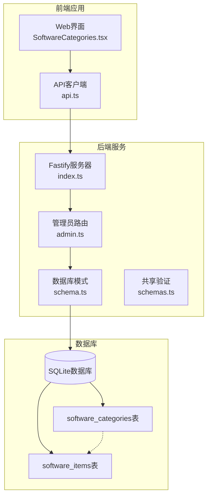
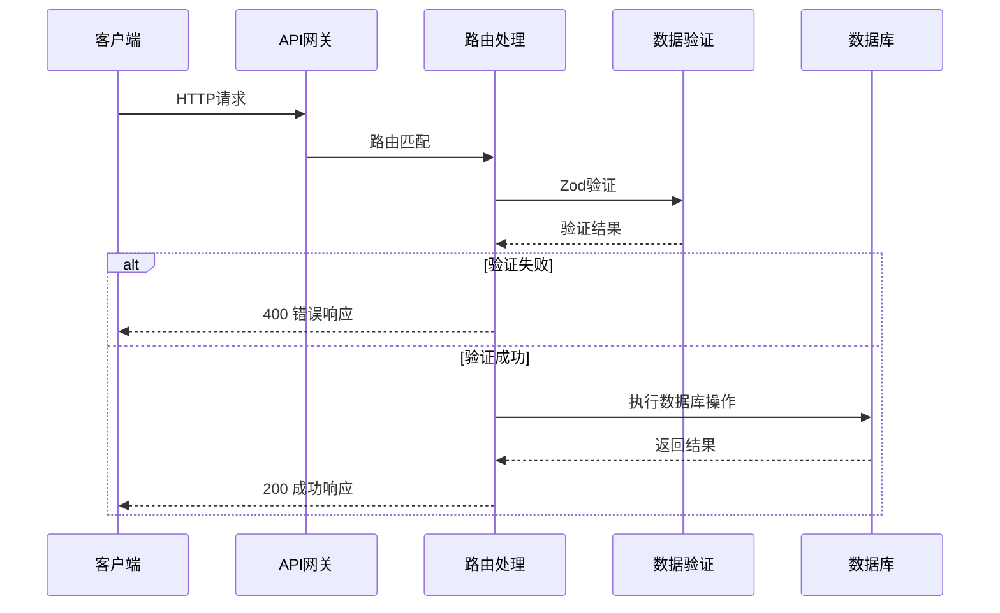
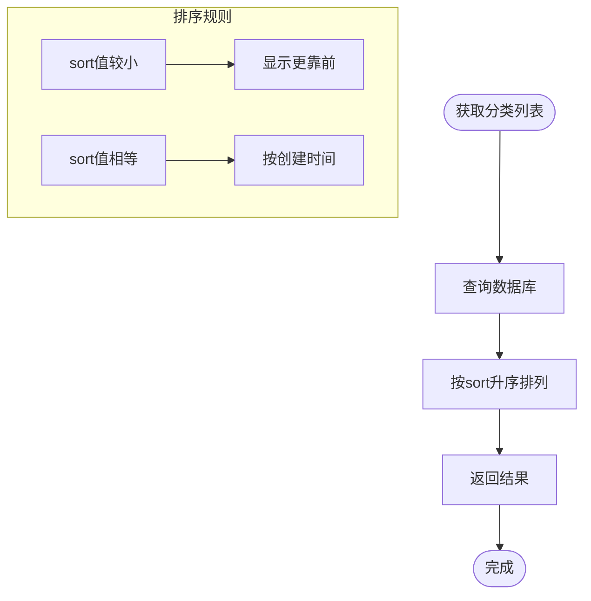
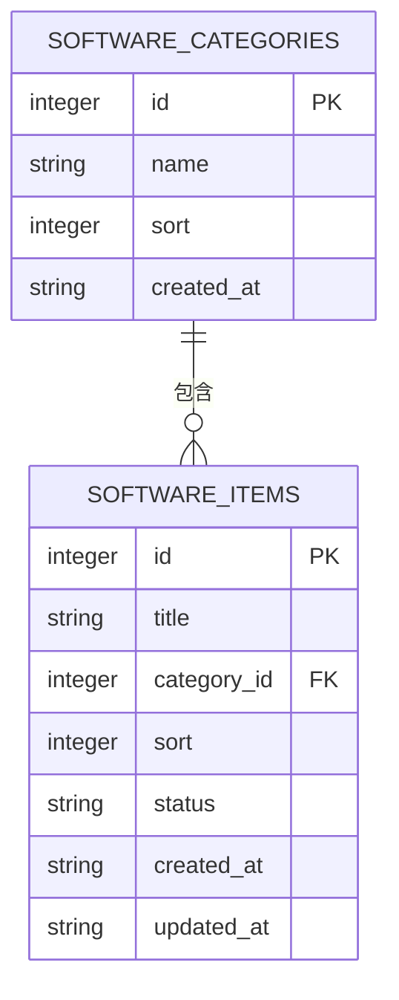
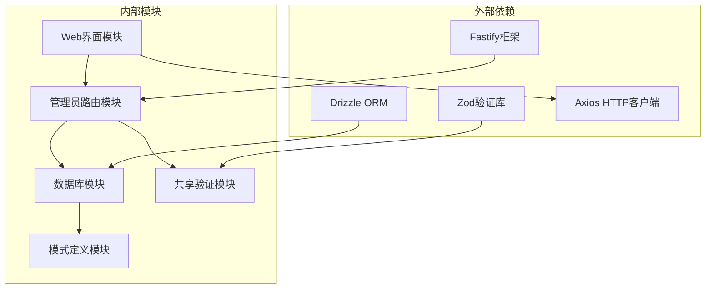
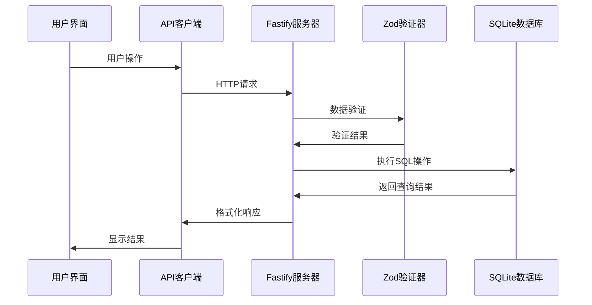

# 软件分类管理API

<cite>
**本文档引用的文件**
- [apps/server/src/routes/admin.ts](file://apps/server/src/routes/admin.ts)
- [apps/server/src/db/schema.ts](file://apps/server/src/db/schema.ts)
- [packages/shared/src/schemas.ts](file://packages/shared/src/schemas.ts)
- [apps/web/src/pages/admin/SoftwareCategories.tsx](file://apps/web/src/pages/admin/SoftwareCategories.tsx)
- [apps/web/src/lib/api.ts](file://apps/web/src/lib/api.ts)
- [apps/server/drizzle/meta/0002_snapshot.json](file://apps/server/drizzle/meta/0002_snapshot.json)
</cite>

## 目录
1. [简介](#简介)
2. [项目结构](#项目结构)
3. [核心组件](#核心组件)
4. [架构概览](#架构概览)
5. [详细组件分析](#详细组件分析)
6. [依赖关系分析](#依赖关系分析)
7. [性能考虑](#性能考虑)
8. [故障排除指南](#故障排除指南)
9. [结论](#结论)

## 简介

ZBH2平台的软件分类管理API提供了完整的软件分类CRUD操作功能，支持分类的创建、更新、删除和列表查询。该API采用Fastify框架构建，使用Drizzle ORM进行数据库操作，并通过Zod进行数据验证。

## 项目结构

软件分类管理API位于以下关键位置：



**图表来源**
- [apps/server/src/index.ts:1-60](file://apps/server/src/index.ts#L1-L60)
- [apps/server/src/routes/admin.ts:15-43](file://apps/server/src/routes/admin.ts#L15-L43)
- [apps/server/src/db/schema.ts:19-24](file://apps/server/src/db/schema.ts#L19-L24)

**章节来源**
- [apps/server/src/index.ts:1-60](file://apps/server/src/index.ts#L1-L60)
- [apps/web/src/pages/admin/SoftwareCategories.tsx:1-70](file://apps/web/src/pages/admin/SoftwareCategories.tsx#L1-L70)

## 核心组件

### 数据模型

软件分类使用以下数据结构：

| 字段名 | 类型 | 必填 | 默认值 | 描述 |
|--------|------|------|--------|------|
| id | integer | 否 | 自增 | 分类唯一标识符 |
| name | string | 是 | - | 分类名称，1-100字符 |
| sort | integer | 否 | 0 | 排序权重，数值越小显示越靠前 |
| createdAt | string | 否 | 当前时间 | 创建时间戳 |

### 验证规则

使用Zod进行数据验证，规则如下：
- name: 必填，长度1-100字符
- sort: 可选，整数，默认0

**章节来源**
- [packages/shared/src/schemas.ts:14-17](file://packages/shared/src/schemas.ts#L14-L17)
- [apps/server/src/db/schema.ts:19-24](file://apps/server/src/db/schema.ts#L19-L24)

## 架构概览

软件分类管理采用分层架构设计：



**图表来源**
- [apps/server/src/routes/admin.ts:24-37](file://apps/server/src/routes/admin.ts#L24-L37)
- [packages/shared/src/schemas.ts:14-17](file://packages/shared/src/schemas.ts#L14-L17)

## 详细组件分析

### CRUD操作接口

#### 获取分类列表

**请求**
- 方法: GET
- 路径: `/api/admin/software-categories`
- 认证: 需要管理员权限

**响应**
- 成功: 返回按sort字段升序排列的分类数组
- 失败: 返回错误信息

**请求示例**
```bash
curl -X GET "http://localhost:7500/api/admin/software-categories" \
  -H "Authorization: Bearer YOUR_TOKEN"
```

**响应示例**
```json
{
  "success": true,
  "data": [
    {
      "id": 1,
      "name": "办公软件",
      "sort": 0,
      "createdAt": "2024-01-01T00:00:00Z"
    },
    {
      "id": 2,
      "name": "开发工具",
      "sort": 1,
      "createdAt": "2024-01-02T00:00:00Z"
    }
  ]
}
```

#### 创建分类

**请求**
- 方法: POST
- 路径: `/api/admin/software-categories`
- 认证: 需要管理员权限

**请求体**
```json
{
  "name": "新分类名称",
  "sort": 0
}
```

**响应示例**
```json
{
  "success": true,
  "data": {
    "id": 3,
    "name": "新分类名称",
    "sort": 0,
    "createdAt": "2024-01-03T00:00:00Z"
  }
}
```

#### 更新分类

**请求**
- 方法: PUT
- 路径: `/api/admin/software-categories/{id}`
- 认证: 需要管理员权限

**路径参数**
- id: 分类ID

**请求体**
```json
{
  "name": "更新后的名称",
  "sort": 5
}
```

**响应示例**
```json
{
  "success": true
}
```

#### 删除分类

**请求**
- 方法: DELETE
- 路径: `/api/admin/software-categories/{id}`
- 认证: 需要管理员权限

**路径参数**
- id: 分类ID

**响应示例**
```json
{
  "success": true
}
```

### 排序机制

软件分类采用基于sort字段的排序机制：



**图表来源**
- [apps/server/src/routes/admin.ts:19-22](file://apps/server/src/routes/admin.ts#L19-L22)

### 层级结构维护

当前版本的软件分类不支持层级嵌套结构，所有分类都处于同一层级。如需实现层级结构，可在数据库中添加parent_id字段并建立自引用关系。

### 关联关系与删除限制

软件分类与软件条目存在外键关联关系：



**图表来源**
- [apps/server/src/db/schema.ts:19-24](file://apps/server/src/db/schema.ts#L19-L24)
- [apps/server/src/db/schema.ts:37-49](file://apps/server/src/db/schema.ts#L37-L49)

**删除保护机制**
- 软件分类删除时不会自动删除关联的软件条目
- 如果尝试删除仍有软件条目的分类，数据库会保持不变
- 建议在删除分类前先清理或转移相关软件条目

**章节来源**
- [apps/server/src/routes/admin.ts:39-43](file://apps/server/src/routes/admin.ts#L39-L43)
- [apps/server/drizzle/meta/0002_snapshot.json:2130-2168](file://apps/server/drizzle/meta/0002_snapshot.json#L2130-L2168)

## 依赖关系分析

### 组件依赖图



**图表来源**
- [apps/server/src/index.ts:1-60](file://apps/server/src/index.ts#L1-L60)
- [apps/server/src/routes/admin.ts:1-16](file://apps/server/src/routes/admin.ts#L1-L16)

### 数据流分析



**图表来源**
- [apps/web/src/pages/admin/SoftwareCategories.tsx:12-28](file://apps/web/src/pages/admin/SoftwareCategories.tsx#L12-L28)
- [apps/web/src/lib/api.ts:1-16](file://apps/web/src/lib/api.ts#L1-L16)

**章节来源**
- [apps/server/src/routes/admin.ts:15-43](file://apps/server/src/routes/admin.ts#L15-L43)
- [packages/shared/src/schemas.ts:14-17](file://packages/shared/src/schemas.ts#L14-L17)

## 性能考虑

### 查询优化
- 使用索引优化sort字段查询
- 实现分页机制避免大量数据一次性传输
- 缓存常用查询结果

### 并发控制
- 使用数据库事务确保数据一致性
- 实现适当的锁机制防止并发冲突

### 扩展性建议
- 考虑实现分类缓存层
- 添加分类统计和搜索功能
- 支持批量操作提高效率

## 故障排除指南

### 常见错误及解决方案

**数据验证错误**
- 症状: 请求被拒绝，返回400错误
- 原因: name字段为空或超长，sort不是整数
- 解决方案: 确保name长度在1-100字符之间，sort为整数

**权限错误**
- 症状: 返回401未授权
- 原因: 未登录或非管理员用户
- 解决方案: 确保使用管理员账户登录

**数据库错误**
- 症状: 删除分类时报错
- 原因: 分类下仍有软件条目
- 解决方案: 先删除或转移相关软件条目

**章节来源**
- [apps/server/src/routes/admin.ts:24-37](file://apps/server/src/routes/admin.ts#L24-L37)
- [apps/server/src/routes/admin.ts:39-43](file://apps/server/src/routes/admin.ts#L39-L43)

## 结论

ZBH2平台的软件分类管理API提供了完整而简洁的CRUD操作功能。其设计特点包括：

1. **清晰的架构**: 分层设计便于维护和扩展
2. **严格的数据验证**: 使用Zod确保数据完整性
3. **直观的排序机制**: 基于sort字段的简单排序
4. **明确的关联关系**: 清晰的外键约束定义

未来可以考虑的功能增强包括：
- 支持分类层级结构
- 实现批量操作
- 添加分类搜索和过滤功能
- 增强删除保护机制