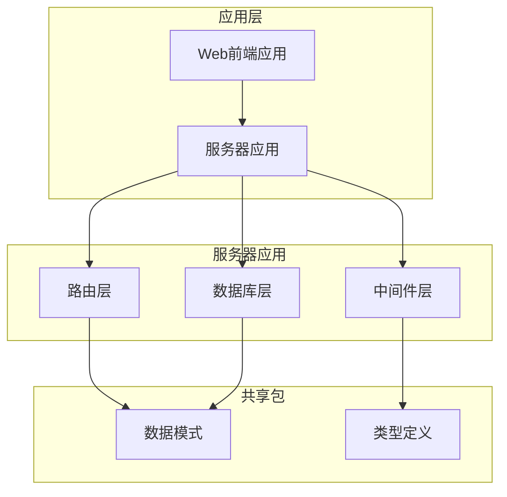
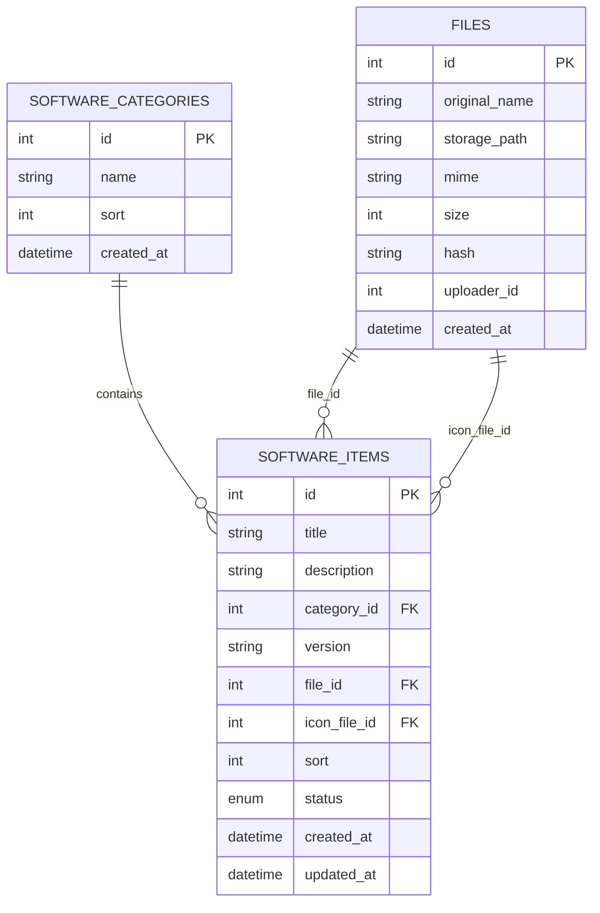
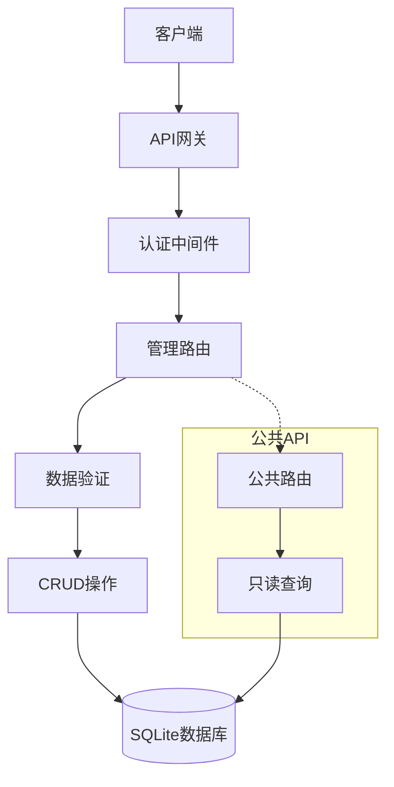
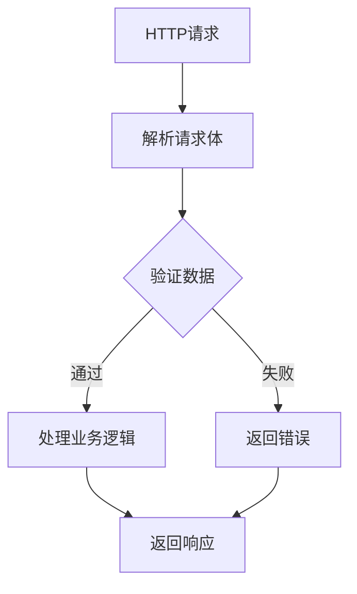
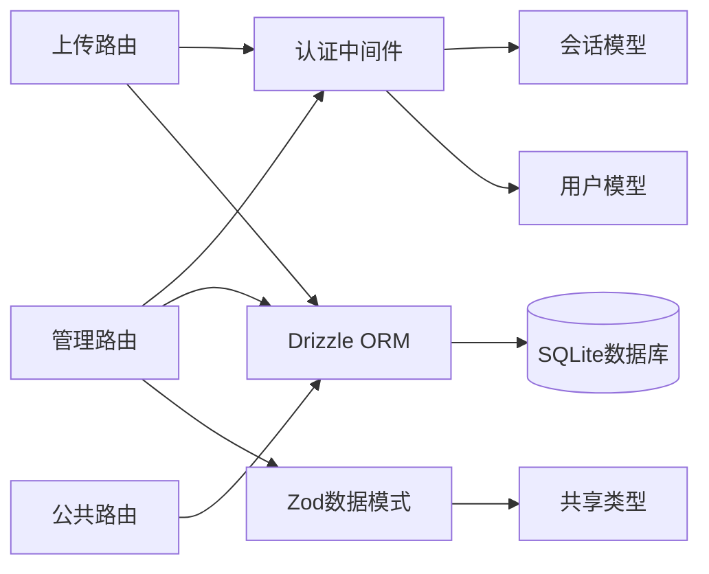

# 软件条目管理API

<cite>
**本文档引用的文件**
- [apps/server/src/routes/admin.ts](file://apps/server/src/routes/admin.ts)
- [apps/server/src/routes/upload.ts](file://apps/server/src/routes/upload.ts)
- [apps/server/src/routes/public.ts](file://apps/server/src/routes/public.ts)
- [apps/server/src/db/schema.ts](file://apps/server/src/db/schema.ts)
- [apps/server/src/middleware/auth.ts](file://apps/server/src/middleware/auth.ts)
- [apps/server/src/index.ts](file://apps/server/src/index.ts)
- [packages/shared/src/schemas.ts](file://packages/shared/src/schemas.ts)
- [apps/web/src/pages/admin/SoftwareItems.tsx](file://apps/web/src/pages/admin/SoftwareItems.tsx)
- [apps/web/src/lib/api.ts](file://apps/web/src/lib/api.ts)
</cite>

## 目录
1. [简介](#简介)
2. [项目结构](#项目结构)
3. [核心组件](#核心组件)
4. [架构概览](#架构概览)
5. [详细组件分析](#详细组件分析)
6. [依赖关系分析](#依赖关系分析)
7. [性能考虑](#性能考虑)
8. [故障排除指南](#故障排除指南)
9. [结论](#结论)

## 简介

ZBH2平台的软件条目管理API提供了完整的软件条目生命周期管理功能，包括软件信息的增删改查、版本控制、发布状态管理和文件上传关联。该API基于Fastify框架构建，采用Drizzle ORM进行数据库操作，支持RESTful设计原则和严格的权限控制。

本API主要服务于软件资产管理，允许管理员对软件条目进行管理，同时为前端提供标准化的数据接口。系统支持软件条目的草稿和发布两种状态，确保内容在正式对外展示前可以进行充分的编辑和审核。

## 项目结构

ZBH2平台采用多包架构，软件条目管理API位于服务器端应用中，通过清晰的模块化设计实现功能分离：



**图表来源**
- [apps/server/src/index.ts:1-60](file://apps/server/src/index.ts#L1-L60)
- [apps/server/src/routes/admin.ts:1-279](file://apps/server/src/routes/admin.ts#L1-L279)

**章节来源**
- [apps/server/src/index.ts:1-60](file://apps/server/src/index.ts#L1-L60)
- [apps/server/src/routes/admin.ts:1-279](file://apps/server/src/routes/admin.ts#L1-L279)

## 核心组件

### 数据模型

软件条目系统的核心数据模型由以下表组成：



**图表来源**
- [apps/server/src/db/schema.ts:19-49](file://apps/server/src/db/schema.ts#L19-L49)

### 权限控制

系统采用基于角色的访问控制（RBAC），所有管理API都需要管理员权限：

- `requireAdmin` 中间件确保只有管理员用户可以访问
- 会话认证通过Cookie机制实现
- 支持用户状态检查，禁用用户无法访问

**章节来源**
- [apps/server/src/middleware/auth.ts:48-55](file://apps/server/src/middleware/auth.ts#L48-L55)
- [apps/server/src/routes/admin.ts](file://apps/server/src/routes/admin.ts#L16)

## 架构概览

软件条目管理API采用分层架构设计，各层职责明确：



**图表来源**
- [apps/server/src/index.ts:37-49](file://apps/server/src/index.ts#L37-L49)
- [apps/server/src/routes/admin.ts:15-73](file://apps/server/src/routes/admin.ts#L15-L73)

## 详细组件分析

### 软件条目管理路由

软件条目管理API提供完整的CRUD操作：

#### GET /api/admin/software-items
获取所有软件条目列表，按排序字段升序排列。

**请求参数**: 无
**响应数据**: 软件条目数组

#### POST /api/admin/software-items
创建新的软件条目。

**请求体参数**:
- title: 软件标题 (必填)
- description: 软件描述 (可选)
- categoryId: 分类ID (必填)
- version: 版本号 (可选)
- sort: 排序值 (可选)
- status: 发布状态 (可选，默认草稿)

#### PUT /api/admin/software-items/:id
更新指定ID的软件条目。

**路径参数**:
- id: 软件条目ID (必填)

**请求体参数** (可选):
- title: 软件标题
- description: 软件描述  
- categoryId: 分类ID
- version: 版本号
- fileId: 文件ID
- iconFileId: 图标文件ID
- sort: 排序值
- status: 发布状态

#### DELETE /api/admin/software-items/:id
删除指定ID的软件条目。

**路径参数**:
- id: 软件条目ID (必填)

**章节来源**
- [apps/server/src/routes/admin.ts:46-73](file://apps/server/src/routes/admin.ts#L46-L73)

### 文件上传与关联

系统支持软件文件的上传和关联管理：

#### POST /api/admin/upload
上传文件到服务器存储。

**请求类型**: multipart/form-data
**请求体参数**:
- file: 上传的文件 (必填)

**响应数据**:
- id: 文件ID
- originalName: 原始文件名
- storagePath: 存储路径
- mime: MIME类型
- size: 文件大小
- hash: 文件哈希值

#### GET /api/public/download/:fileId
下载指定ID的文件。

**路径参数**:
- fileId: 文件ID (必填)

**响应**: 文件流

**章节来源**
- [apps/server/src/routes/upload.ts:15-61](file://apps/server/src/routes/upload.ts#L15-L61)

### 公共API接口

系统还提供公共API供前端展示使用：

#### GET /api/public/software
获取公开的软件分类和软件条目树形结构。

**响应数据**: 包含分类和对应软件条目的树形结构

#### GET /api/public/software/:id
获取指定ID的公开软件条目详情。

**路径参数**:
- id: 软件条目ID (必填)

**响应**: 软件条目详情或404错误

**章节来源**
- [apps/server/src/routes/public.ts:7-24](file://apps/server/src/routes/public.ts#L7-L24)

### 数据验证与约束

所有API请求都经过严格的数据验证：



**图表来源**
- [packages/shared/src/schemas.ts:24-31](file://packages/shared/src/schemas.ts#L24-L31)

**章节来源**
- [packages/shared/src/schemas.ts:24-31](file://packages/shared/src/schemas.ts#L24-L31)

## 依赖关系分析

软件条目管理API的依赖关系如下：



**图表来源**
- [apps/server/src/routes/admin.ts:1-13](file://apps/server/src/routes/admin.ts#L1-L13)
- [apps/server/src/routes/upload.ts:1-9](file://apps/server/src/routes/upload.ts#L1-L9)

### 外部依赖

- **Fastify**: Web框架，提供高性能HTTP服务器
- **Drizzle ORM**: 类型安全的数据库查询构建器
- **Zod**: 数据验证和类型推断
- **Argon2**: 密码哈希算法
- **Multipart**: 文件上传处理
- **Axios**: HTTP客户端库

**章节来源**
- [apps/server/src/index.ts:1-10](file://apps/server/src/index.ts#L1-L10)

## 性能考虑

### 数据库优化

- 使用索引优化常用查询字段
- 实现分页查询避免大数据集加载
- 采用连接池管理数据库连接
- 实施适当的缓存策略

### 文件存储优化

- 限制文件大小（默认500MB）
- 实施文件哈希去重
- 支持流式文件处理
- 提供CDN友好的静态文件服务

### API性能

- 实施速率限制防止滥用
- 使用压缩减少传输体积
- 优化查询语句减少数据库负载
- 实现适当的错误处理和超时机制

## 故障排除指南

### 常见问题及解决方案

#### 认证失败
**症状**: 返回401未授权错误
**原因**: 会话过期或未登录
**解决**: 重新登录获取有效会话

#### 权限不足
**症状**: 返回403禁止访问错误
**原因**: 非管理员用户尝试访问管理API
**解决**: 使用管理员账户登录

#### 数据验证错误
**症状**: 返回400错误和验证消息
**原因**: 请求数据不符合Zod模式要求
**解决**: 检查请求数据格式和字段约束

#### 文件上传失败
**症状**: 上传接口返回错误
**原因**: 文件过大、格式不支持或服务器配置问题
**解决**: 检查文件大小限制和MIME类型

### 错误响应格式

所有API遵循统一的响应格式：
```json
{
  "success": false,
  "error": "错误描述"
}
```

**章节来源**
- [apps/server/src/middleware/auth.ts:42-55](file://apps/server/src/middleware/auth.ts#L42-L55)

## 结论

ZBH2平台的软件条目管理API提供了完整、安全且高效的软件资产管理解决方案。通过清晰的API设计、严格的数据验证和完善的权限控制，系统能够满足软件条目的全生命周期管理需求。

主要特性包括：
- 完整的CRUD操作支持
- 灵活的发布状态管理
- 安全的文件上传和关联
- 响应式的前端集成
- 可扩展的架构设计

该API为后续的功能扩展和维护奠定了坚实的基础，支持系统的持续发展和演进。