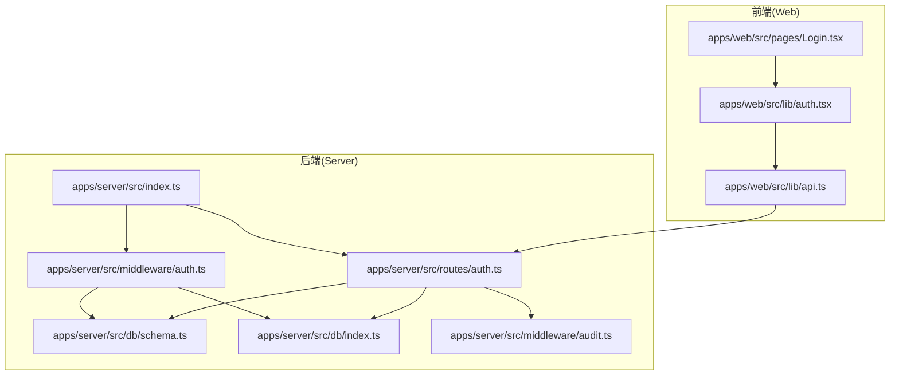
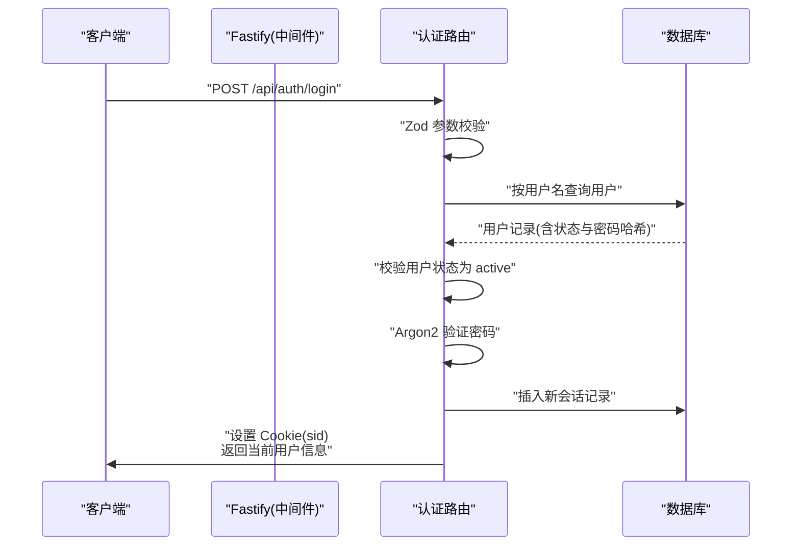
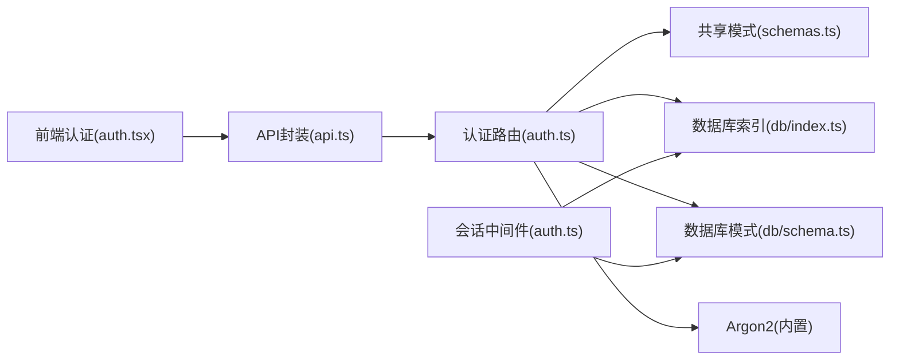

# 认证API

<cite>
**本文引用的文件**
- [apps/server/src/routes/auth.ts](file://apps/server/src/routes/auth.ts)
- [apps/server/src/middleware/auth.ts](file://apps/server/src/middleware/auth.ts)
- [apps/server/src/index.ts](file://apps/server/src/index.ts)
- [packages/shared/src/schemas.ts](file://packages/shared/src/schemas.ts)
- [apps/server/src/db/schema.ts](file://apps/server/src/db/schema.ts)
- [apps/server/src/db/index.ts](file://apps/server/src/db/index.ts)
- [apps/web/src/lib/auth.tsx](file://apps/web/src/lib/auth.tsx)
- [apps/web/src/lib/api.ts](file://apps/web/src/lib/api.ts)
- [apps/web/src/pages/Login.tsx](file://apps/web/src/pages/Login.tsx)
- [apps/server/src/middleware/audit.ts](file://apps/server/src/middleware/audit.ts)
</cite>

## 目录
1. [简介](#简介)
2. [项目结构](#项目结构)
3. [核心组件](#核心组件)
4. [架构总览](#架构总览)
5. [详细组件分析](#详细组件分析)
6. [依赖关系分析](#依赖关系分析)
7. [性能考量](#性能考量)
8. [故障排查指南](#故障排查指南)
9. [结论](#结论)
10. [附录](#附录)

## 简介
本文件为 ZBH2 平台认证API的权威接口文档，覆盖以下接口与行为：
- 登录接口：POST /api/auth/login 的用户名密码验证流程、参数校验规则与响应格式
- 登出接口：POST /api/auth/logout 的会话清理机制与 Cookie 处理
- 当前用户接口：GET /api/auth/me 的会话状态检查与用户数据返回
- 安全与合规：Argon2 密码哈希验证、JWT 会话管理（基于 sid 的自定义会话）、Cookie 安全配置
- 错误码与处理策略：认证失败的错误码定义与处理建议
- 请求/响应示例：涵盖成功登录、无效凭据、账户禁用等典型场景

## 项目结构
认证相关代码分布在后端服务与前端 Web 应用中，核心位置如下：
- 后端路由与中间件：apps/server/src/routes/auth.ts、apps/server/src/middleware/auth.ts
- 共享校验模型：packages/shared/src/schemas.ts
- 数据库结构与连接：apps/server/src/db/schema.ts、apps/server/src/db/index.ts
- 前端认证上下文与 API 封装：apps/web/src/lib/auth.tsx、apps/web/src/lib/api.ts、apps/web/src/pages/Login.tsx

图表来源
- [apps/server/src/index.ts:1-60](file://apps/server/src/index.ts#L1-L60)
- [apps/server/src/routes/auth.ts:1-51](file://apps/server/src/routes/auth.ts#L1-L51)
- [apps/server/src/middleware/auth.ts:1-56](file://apps/server/src/middleware/auth.ts#L1-L56)
- [apps/web/src/lib/auth.tsx:1-55](file://apps/web/src/lib/auth.tsx#L1-L55)
- [apps/web/src/lib/api.ts:1-16](file://apps/web/src/lib/api.ts#L1-L16)
- [apps/web/src/pages/Login.tsx:1-47](file://apps/web/src/pages/Login.tsx#L1-L47)
- [apps/server/src/db/schema.ts:1-330](file://apps/server/src/db/schema.ts#L1-L330)
- [apps/server/src/db/index.ts:1-16](file://apps/server/src/db/index.ts#L1-L16)
- [apps/server/src/middleware/audit.ts:1-28](file://apps/server/src/middleware/audit.ts#L1-L28)

章节来源
- [apps/server/src/index.ts:1-60](file://apps/server/src/index.ts#L1-L60)
- [apps/server/src/routes/auth.ts:1-51](file://apps/server/src/routes/auth.ts#L1-L51)
- [apps/server/src/middleware/auth.ts:1-56](file://apps/server/src/middleware/auth.ts#L1-L56)
- [apps/web/src/lib/auth.tsx:1-55](file://apps/web/src/lib/auth.tsx#L1-L55)
- [apps/web/src/lib/api.ts:1-16](file://apps/web/src/lib/api.ts#L1-L16)
- [apps/web/src/pages/Login.tsx:1-47](file://apps/web/src/pages/Login.tsx#L1-L47)
- [apps/server/src/db/schema.ts:1-330](file://apps/server/src/db/schema.ts#L1-L330)
- [apps/server/src/db/index.ts:1-16](file://apps/server/src/db/index.ts#L1-L16)
- [apps/server/src/middleware/audit.ts:1-28](file://apps/server/src/middleware/audit.ts#L1-L28)

## 核心组件
- 路由层（认证）
  - POST /api/auth/login：接收用户名与密码，进行参数校验、用户存在性与状态校验、密码哈希验证，创建会话并设置 Cookie
  - POST /api/auth/logout：读取 Cookie 中的 sid，删除对应会话记录，清除 Cookie
  - GET /api/auth/me：检查请求中是否已加载会话用户，返回当前用户或空
- 中间件层
  - 会话加载中间件：从 Cookie 读取 sid，查询有效且未过期的会话，关联用户并注入到请求对象
  - 权限中间件：用于需要登录或管理员权限的受保护路由
- 共享校验
  - 登录参数模型：对用户名长度、密码长度进行约束
- 数据库模型
  - users：存储用户基本信息、角色与状态
  - sessions：存储会话标识、关联用户与过期时间
- 前端集成
  - 认证上下文：封装登录、登出、刷新当前用户信息
  - API 封装：统一基础路径与跨域凭证，拦截器处理 401 行为
  - 登录页：表单提交触发登录流程

章节来源
- [apps/server/src/routes/auth.ts:1-51](file://apps/server/src/routes/auth.ts#L1-L51)
- [apps/server/src/middleware/auth.ts:1-56](file://apps/server/src/middleware/auth.ts#L1-L56)
- [packages/shared/src/schemas.ts:1-51](file://packages/shared/src/schemas.ts#L1-L51)
- [apps/server/src/db/schema.ts:1-330](file://apps/server/src/db/schema.ts#L1-L330)
- [apps/web/src/lib/auth.tsx:1-55](file://apps/web/src/lib/auth.tsx#L1-L55)
- [apps/web/src/lib/api.ts:1-16](file://apps/web/src/lib/api.ts#L1-L16)
- [apps/web/src/pages/Login.tsx:1-47](file://apps/web/src/pages/Login.tsx#L1-L47)

## 架构总览
认证体系采用“Cookie + 自定义会话”方案：
- 参数校验：在路由层使用共享的 Zod 模式进行输入校验
- 会话加载：全局中间件在每个请求到达前尝试解析 Cookie 中的 sid，并加载有效会话与用户
- 登录流程：验证用户状态与密码哈希，生成随机会话 ID，写入 sessions 表，设置安全 Cookie
- 登出流程：删除 sessions 表中的会话记录，清除 Cookie
- 当前用户：直接返回已加载的会话用户对象

图表来源
- [apps/server/src/routes/auth.ts:1-51](file://apps/server/src/routes/auth.ts#L1-L51)
- [apps/server/src/middleware/auth.ts:17-40](file://apps/server/src/middleware/auth.ts#L17-L40)
- [apps/server/src/db/schema.ts:1-330](file://apps/server/src/db/schema.ts#L1-L330)

## 详细组件分析

### 登录接口：POST /api/auth/login
- 功能概述
  - 接收用户名与密码
  - 使用共享 Zod 模式进行参数校验
  - 查询用户并校验状态为 active
  - 使用 Argon2 验证密码哈希
  - 创建会话记录并设置 Cookie
  - 返回当前用户信息
- 参数校验规则
  - 字段：username、password
  - 规则：最小长度、最大长度约束（详见共享模式定义）
- 密码验证
  - 使用 Argon2 对比用户记录中的 passwordHash 与明文密码
- 会话与 Cookie
  - 生成随机会话 ID（sid），设置过期时间为 7 天
  - 写入 sessions 表
  - 设置 Cookie：path="/"、httpOnly=true、sameSite=lax、maxAge=604800
- 响应格式
  - 成功：success=true，data 包含 id、username、role
  - 失败：success=false，error 为错误消息（如参数无效、用户名或密码错误）

请求/响应示例
- 成功登录
  - 请求体：{ "username": "...", "password": "..." }
  - 响应体：{ "success": true, "data": { "id": 1, "username": "...", "role": "user" } }
- 无效凭据
  - 响应体：{ "success": false, "error": "用户名或密码错误" }
- 参数无效
  - 响应体：{ "success": false, "error": "请输入有效的用户名和密码" }

章节来源
- [apps/server/src/routes/auth.ts:1-51](file://apps/server/src/routes/auth.ts#L1-L51)
- [packages/shared/src/schemas.ts:1-51](file://packages/shared/src/schemas.ts#L1-L51)
- [apps/server/src/db/schema.ts:1-330](file://apps/server/src/db/schema.ts#L1-L330)

### 登出接口：POST /api/auth/logout
- 功能概述
  - 从 Cookie 读取 sid
  - 删除 sessions 表中对应的会话记录
  - 清除 sid Cookie
  - 返回成功标志
- 会话清理机制
  - 通过 sid 关联 sessions 表进行删除
  - Cookie 清理确保客户端不再携带 sid
- 响应格式
  - { "success": true }

请求/响应示例
- 成功登出
  - 响应体：{ "success": true }

章节来源
- [apps/server/src/routes/auth.ts:35-42](file://apps/server/src/routes/auth.ts#L35-L42)

### 获取当前用户接口：GET /api/auth/me
- 功能概述
  - 检查请求对象中是否已加载会话用户
  - 若已加载，返回用户信息；否则返回 null
- 会话状态检查
  - 依赖全局中间件在 preHandler 阶段完成会话加载
- 响应格式
  - { "success": true, "data": { id, username, role } 或 null }

请求/响应示例
- 已登录
  - 响应体：{ "success": true, "data": { "id": 1, "username": "...", "role": "user" } }
- 未登录
  - 响应体：{ "success": true, "data": null }

章节来源
- [apps/server/src/routes/auth.ts:44-49](file://apps/server/src/routes/auth.ts#L44-L49)
- [apps/server/src/middleware/auth.ts:17-40](file://apps/server/src/middleware/auth.ts#L17-L40)

### 会话加载与权限控制（中间件）
- 会话加载（loadSession）
  - 从 Cookie 读取 sid
  - 查询 sessions 表，要求未过期
  - 关联 users 表，要求用户状态为 active
  - 将用户信息注入到请求对象
- 权限控制（requireAuth、requireAdmin）
  - requireAuth：若无会话用户，返回 401
  - requireAdmin：若非管理员，返回 403

章节来源
- [apps/server/src/middleware/auth.ts:17-56](file://apps/server/src/middleware/auth.ts#L17-L56)

### Cookie 安全配置
- 设置项
  - path: "/"
  - httpOnly: true
  - sameSite: lax
  - maxAge: 604800（秒）
- 安全意义
  - httpOnly 防止前端脚本读取 Cookie
  - sameSite=lax 平衡 CSRF 与第三方访问
  - maxAge 控制会话有效期

章节来源
- [apps/server/src/routes/auth.ts:26-31](file://apps/server/src/routes/auth.ts#L26-L31)

### 前端集成
- 认证上下文（AuthProvider）
  - 提供 login、logout、refresh 方法
  - 刷新时调用 /api/auth/me 更新用户状态
- API 封装
  - 基础路径为 /api，withCredentials=true
  - 统一拦截器处理 401（可扩展重定向逻辑）
- 登录页
  - 表单提交触发登录流程，成功后跳转至 redirect 或首页

章节来源
- [apps/web/src/lib/auth.tsx:1-55](file://apps/web/src/lib/auth.tsx#L1-L55)
- [apps/web/src/lib/api.ts:1-16](file://apps/web/src/lib/api.ts#L1-L16)
- [apps/web/src/pages/Login.tsx:1-47](file://apps/web/src/pages/Login.tsx#L1-L47)

## 依赖关系分析
- 路由依赖
  - 引入共享 Zod 模式进行参数校验
  - 使用数据库 schema 与连接进行查询与写入
  - 使用 Argon2 进行密码哈希验证
- 中间件依赖
  - 在应用启动时注册，作为全局 preHandler
  - 依赖数据库 schema 与连接进行会话与用户查询
- 前端依赖
  - 通过统一 API 封装访问后端接口
  - 登录页通过认证上下文触发登录流程

图表来源
- [apps/server/src/routes/auth.ts:1-7](file://apps/server/src/routes/auth.ts#L1-L7)
- [packages/shared/src/schemas.ts:1-51](file://packages/shared/src/schemas.ts#L1-L51)
- [apps/server/src/db/index.ts:1-16](file://apps/server/src/db/index.ts#L1-L16)
- [apps/server/src/db/schema.ts:1-330](file://apps/server/src/db/schema.ts#L1-L330)
- [apps/server/src/middleware/auth.ts:1-56](file://apps/server/src/middleware/auth.ts#L1-L56)
- [apps/web/src/lib/auth.tsx:1-55](file://apps/web/src/lib/auth.tsx#L1-L55)
- [apps/web/src/lib/api.ts:1-16](file://apps/web/src/lib/api.ts#L1-L16)

章节来源
- [apps/server/src/routes/auth.ts:1-7](file://apps/server/src/routes/auth.ts#L1-L7)
- [packages/shared/src/schemas.ts:1-51](file://packages/shared/src/schemas.ts#L1-L51)
- [apps/server/src/db/index.ts:1-16](file://apps/server/src/db/index.ts#L1-L16)
- [apps/server/src/db/schema.ts:1-330](file://apps/server/src/db/schema.ts#L1-L330)
- [apps/server/src/middleware/auth.ts:1-56](file://apps/server/src/middleware/auth.ts#L1-L56)
- [apps/web/src/lib/auth.tsx:1-55](file://apps/web/src/lib/auth.tsx#L1-L55)
- [apps/web/src/lib/api.ts:1-16](file://apps/web/src/lib/api.ts#L1-L16)

## 性能考量
- 数据库查询
  - 登录与会话加载均涉及单表查询与条件过滤，建议在 users.username 与 sessions.id 上建立索引以提升命中率
- 会话有效期
  - 默认 7 天有效期，可根据业务需求调整 maxAge 与过期检查策略
- 密码哈希成本
  - Argon2 验证为 CPU 密集型操作，建议结合速率限制与缓存策略降低峰值压力
- Cookie 传输
  - httpOnly 与 sameSite 配置减少 XSS 与 CSRF 风险，同时避免不必要的跨站请求

## 故障排查指南
- 常见错误与定位
  - 参数无效：检查共享模式字段长度与必填规则
  - 用户名或密码错误：确认用户状态为 active，密码哈希一致
  - 会话无效：确认 Cookie 是否正确设置且未过期
  - 权限不足：确认用户角色为 admin
- 错误码与处理策略
  - 400：参数校验失败（返回错误消息）
  - 401：未登录或凭据无效（返回错误消息）
  - 403：权限不足（返回错误消息）
- 审计日志
  - 可通过审计中间件记录登录/登出等关键动作，便于追踪与分析

章节来源
- [apps/server/src/routes/auth.ts:11-22](file://apps/server/src/routes/auth.ts#L11-L22)
- [apps/server/src/middleware/auth.ts:42-55](file://apps/server/src/middleware/auth.ts#L42-L55)
- [apps/server/src/middleware/audit.ts:1-28](file://apps/server/src/middleware/audit.ts#L1-L28)

## 结论
ZBH2 平台认证API采用简洁可靠的“Cookie + 自定义会话”方案，结合参数校验、密码哈希验证与安全 Cookie 配置，实现了标准的登录、登出与当前用户查询能力。通过全局中间件统一加载会话，配合前端认证上下文，形成前后端协同的完整认证闭环。

## 附录

### 接口定义与示例

- 登录：POST /api/auth/login
  - 请求体字段：username、password
  - 成功响应：{ "success": true, "data": { "id": number, "username": string, "role": "admin"|"user" } }
  - 失败响应：{ "success": false, "error": string }
  - 示例场景
    - 成功：返回 data 包含用户信息
    - 无效凭据：返回错误消息“用户名或密码错误”
    - 参数无效：返回错误消息“请输入有效的用户名和密码”

- 登出：POST /api/auth/logout
  - 请求体：无
  - 响应体：{ "success": true }

- 当前用户：GET /api/auth/me
  - 响应体：{ "success": true, "data": { "id": number, "username": string, "role": "admin"|"user" } | null }

章节来源
- [apps/server/src/routes/auth.ts:1-51](file://apps/server/src/routes/auth.ts#L1-L51)
- [apps/web/src/lib/auth.tsx:24-33](file://apps/web/src/lib/auth.tsx#L24-L33)