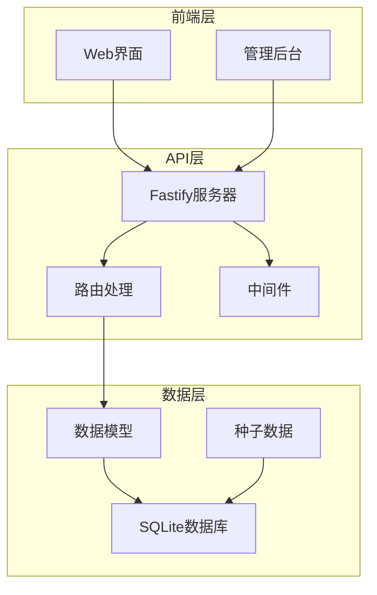
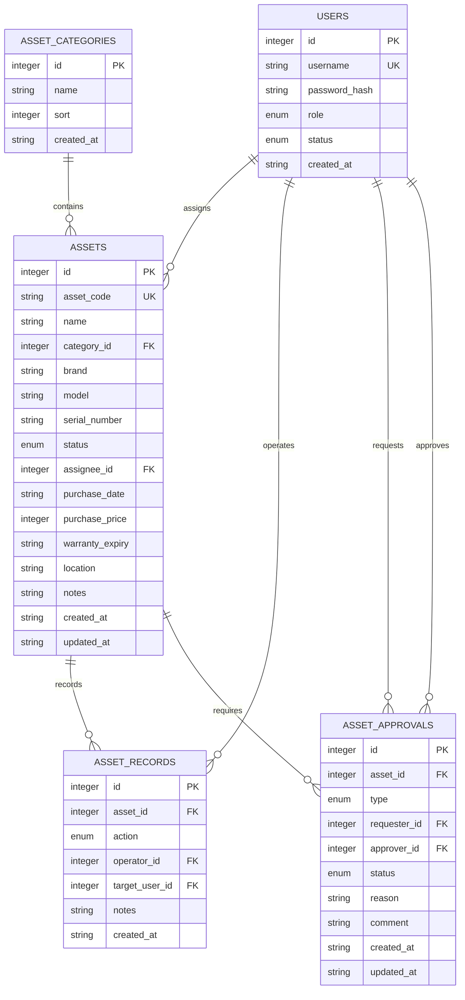
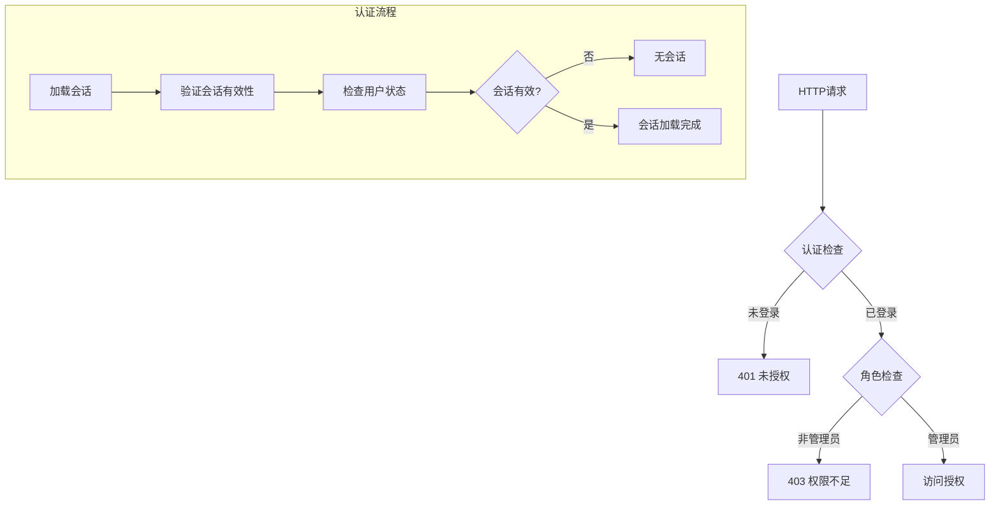
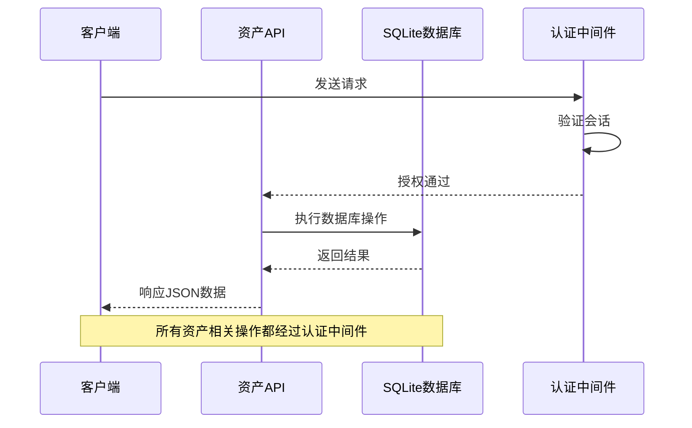
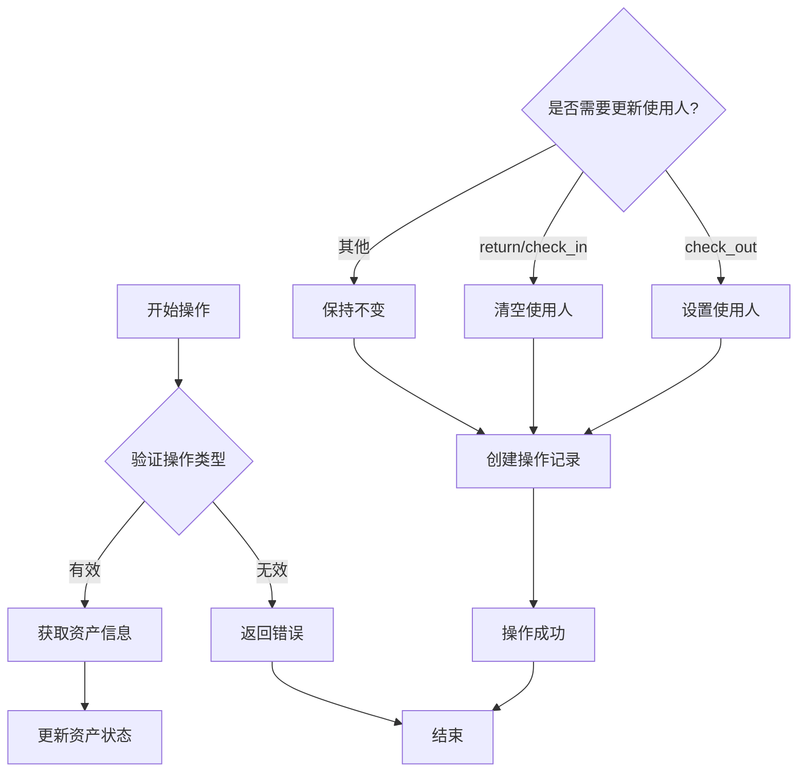
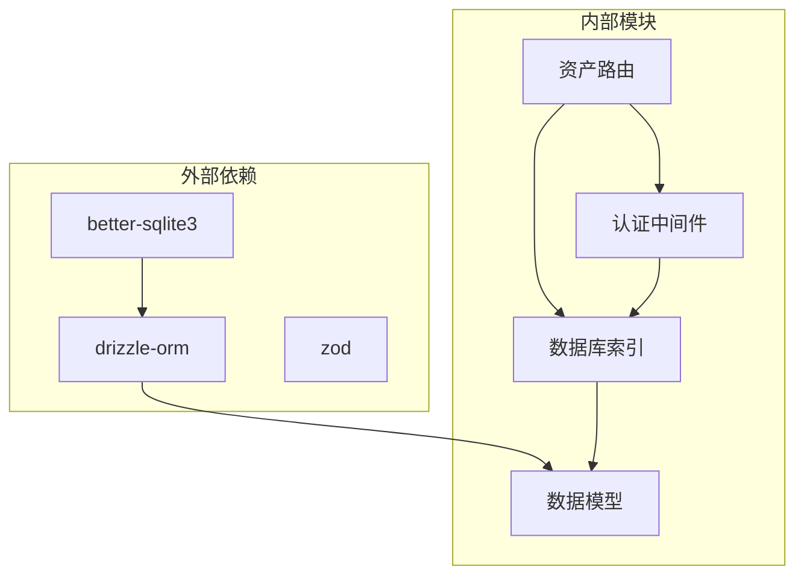
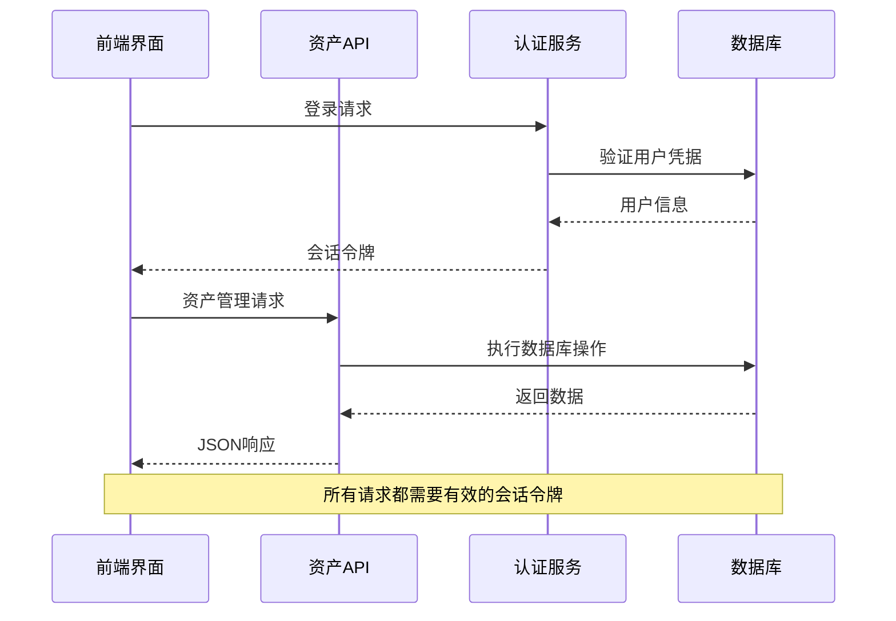

# 资产API

<cite>
**本文档引用的文件**
- [assets.ts](file://apps/server/src/routes/assets.ts)
- [schema.ts](file://apps/server/src/db/schema.ts)
- [auth.ts](file://apps/server/src/middleware/auth.ts)
- [index.ts](file://apps/server/src/db/index.ts)
- [AssetCategories.tsx](file://apps/web/src/pages/admin/AssetCategories.tsx)
- [AssetManage.tsx](file://apps/web/src/pages/admin/AssetManage.tsx)
- [api.ts](file://apps/web/src/lib/api.ts)
- [reports.ts](file://apps/server/src/routes/reports.ts)
- [seed.ts](file://apps/server/src/db/seed.ts)
</cite>

## 目录
1. [简介](#简介)
2. [项目结构](#项目结构)
3. [核心组件](#核心组件)
4. [架构概览](#架构概览)
5. [详细组件分析](#详细组件分析)
6. [依赖关系分析](#依赖关系分析)
7. [性能考虑](#性能考虑)
8. [故障排除指南](#故障排除指南)
9. [结论](#结论)

## 简介

ZBH2平台的资产API是一个基于Fastify框架构建的数字资产管理解决方案，专门用于管理各类数字资产（主要是软件许可），包括资产分类管理、资产条目管理、资产操作记录、审批流程等功能。该系统采用SQLite数据库存储，支持完整的资产生命周期管理。

## 项目结构

ZBH2平台采用多包架构，资产API位于`apps/server`目录下，前端界面位于`apps/web`目录下。整体架构分为三层：



**图表来源**
- [assets.ts:1-165](file://apps/server/src/routes/assets.ts#L1-L165)
- [schema.ts:1-330](file://apps/server/src/db/schema.ts#L1-L330)
- [index.ts:1-16](file://apps/server/src/db/index.ts#L1-L16)

**章节来源**
- [assets.ts:1-165](file://apps/server/src/routes/assets.ts#L1-L165)
- [schema.ts:1-330](file://apps/server/src/db/schema.ts#L1-L330)
- [index.ts:1-16](file://apps/server/src/db/index.ts#L1-L16)

## 核心组件

### 数据模型架构

系统的核心数据模型围绕三个主要表构建：



**图表来源**
- [schema.ts:122-169](file://apps/server/src/db/schema.ts#L122-L169)

### 权限控制机制

系统采用基于角色的访问控制（RBAC）机制：



**图表来源**
- [auth.ts:17-55](file://apps/server/src/middleware/auth.ts#L17-L55)

**章节来源**
- [schema.ts:122-169](file://apps/server/src/db/schema.ts#L122-L169)
- [auth.ts:1-56](file://apps/server/src/middleware/auth.ts#L1-L56)

## 架构概览

### API路由架构

资产API采用RESTful设计原则，主要分为以下几个模块：

```mermaid
graph LR
subgraph "资产分类管理"
AC_GET[/api/admin/asset-categories GET]
AC_POST[/api/admin/asset-categories POST]
AC_PUT[/api/admin/asset-categories PUT]
AC_DELETE[/api/admin/asset-categories DELETE]
end
subgraph "资产条目管理"
AM_GET[/api/admin/assets GET]
AM_POST[/api/admin/assets POST]
AM_PUT[/api/admin/assets PUT]
AM_DELETE[/api/admin/assets DELETE]
end
subgraph "资产操作"
AO_POST[/api/admin/assets/:id/operate POST]
AR_GET[/api/admin/asset-records GET]
end
subgraph "审批流程"
AA_GET[/api/admin/asset-approvals GET]
AA_POST[/api/admin/asset-approvals POST]
AA_PUT[/api/admin/asset-approvals/:id PUT]
end
subgraph "统计报告"
AS_GET[/api/admin/asset-stats GET]
end
AC_GET --> AC_POST
AC_POST --> AC_PUT
AC_PUT --> AC_DELETE
AM_GET --> AM_POST
AM_POST --> AM_PUT
AM_PUT --> AM_DELETE
AO_POST --> AR_GET
AA_POST --> AA_PUT
```

**图表来源**
- [assets.ts:9-163](file://apps/server/src/routes/assets.ts#L9-L163)

### 数据流处理



**图表来源**
- [assets.ts:6-7](file://apps/server/src/routes/assets.ts#L6-L7)
- [auth.ts:48-55](file://apps/server/src/middleware/auth.ts#L48-L55)

**章节来源**
- [assets.ts:1-165](file://apps/server/src/routes/assets.ts#L1-L165)
- [auth.ts:1-56](file://apps/server/src/middleware/auth.ts#L1-L56)

## 详细组件分析

### 资产分类管理接口

#### 接口定义

| 方法 | 路径 | 描述 | 权限 |
|------|------|------|------|
| GET | `/api/admin/asset-categories` | 获取所有资产分类 | 管理员 |
| POST | `/api/admin/asset-categories` | 创建新资产分类 | 管理员 |
| PUT | `/api/admin/asset-categories/:id` | 更新资产分类 | 管理员 |
| DELETE | `/api/admin/asset-categories/:id` | 删除资产分类 | 管理员 |

#### 请求参数

**创建/更新分类请求体**
```typescript
{
  name: string;     // 分类名称（必填）
  sort?: number;    // 排序值（可选，默认0）
}
```

#### 响应格式

**成功响应**
```typescript
{
  success: true,
  data: {
    id: number;
    name: string;
    sort: number;
    createdAt: string;
  }
}
```

**章节来源**
- [assets.ts:10-28](file://apps/server/src/routes/assets.ts#L10-L28)
- [AssetCategories.tsx:1-63](file://apps/web/src/pages/admin/AssetCategories.tsx#L1-L63)

### 资产条目管理接口

#### 接口定义

| 方法 | 路径 | 描述 | 权限 |
|------|------|------|------|
| GET | `/api/admin/assets` | 获取所有资产列表 | 管理员 |
| POST | `/api/admin/assets` | 创建新资产 | 管理员 |
| PUT | `/api/admin/assets/:id` | 更新资产信息 | 管理员 |
| DELETE | `/api/admin/assets/:id` | 删除资产 | 管理员 |

#### 资产状态管理

系统支持五种资产状态：
- `in_stock`: 库存中
- `in_use`: 使用中  
- `maintenance`: 维护中
- `retired`: 已退役
- `scrapped`: 已报废

#### 请求参数

**资产创建/更新请求体**
```typescript
{
  assetCode: string;           // 资产编号（必填）
  name: string;               // 资产名称（必填）
  categoryId?: number;        // 分类ID（可选）
  brand?: string;             // 品牌（可选）
  model?: string;             // 型号（可选）
  serialNumber?: string;      // 序列号（可选）
  status?: string;            // 状态（可选，默认in_stock）
  assigneeId?: number;        // 使用人ID（可选）
  purchaseDate?: string;      // 采购日期（可选）
  purchasePrice?: number;     // 采购价格（分）（可选）
  warrantyExpiry?: string;    // 保修到期日（可选）
  location?: string;          // 存放位置（可选）
  notes?: string;             // 备注（可选）
}
```

#### 响应格式

**资产列表响应**
```typescript
{
  success: true,
  data: Asset[]
}

interface Asset {
  id: number;
  assetCode: string;
  name: string;
  categoryId: number;
  brand: string;
  model: string;
  serialNumber: string;
  status: string;
  assigneeId: number;
  purchaseDate: string;
  purchasePrice: number;
  warrantyExpiry: string;
  location: string;
  notes: string;
  createdAt: string;
  updatedAt: string;
}
```

**章节来源**
- [assets.ts:30-70](file://apps/server/src/routes/assets.ts#L30-L70)
- [AssetManage.tsx:1-133](file://apps/web/src/pages/admin/AssetManage.tsx#L1-L133)

### 资产操作接口

#### 接口定义

| 方法 | 路径 | 描述 | 权限 |
|------|------|------|------|
| POST | `/api/admin/assets/:id/operate` | 执行资产操作 | 管理员 |

#### 支持的操作类型

| 操作类型 | 状态转换 | 说明 |
|----------|----------|------|
| `check_out` | in_stock → in_use | 出库/领用 |
| `check_in` | in_use → in_stock | 入库 |
| `maintenance` | 任意 → maintenance | 送修 |
| `return` | in_use → in_stock | 归还 |
| `retire` | 任意 → retired | 退役 |
| `scrap` | 任意 → scrapped | 报废 |

#### 请求参数

**资产操作请求体**
```typescript
{
  action: string;           // 操作类型（必填）
  targetUserId?: number;    // 目标用户ID（可选）
  notes?: string;           // 备注（可选）
}
```

#### 操作流程



**图表来源**
- [assets.ts:72-100](file://apps/server/src/routes/assets.ts#L72-L100)

**章节来源**
- [assets.ts:72-100](file://apps/server/src/routes/assets.ts#L72-L100)

### 资产记录接口

#### 接口定义

| 方法 | 路径 | 描述 | 权限 |
|------|------|------|------|
| GET | `/api/admin/asset-records` | 获取资产操作记录 | 管理员 |

#### 查询参数

**资产记录查询参数**
```typescript
{
  assetId?: string;  // 资产ID（可选）
}
```

#### 记录类型

系统记录六种主要操作类型：
- `check_in`: 入库
- `check_out`: 出库/领用
- `maintenance`: 送修
- `return`: 归还
- `retire`: 退役
- `scrap`: 报废

**章节来源**
- [assets.ts:102-114](file://apps/server/src/routes/assets.ts#L102-L114)

### 审批流程接口

#### 接口定义

| 方法 | 路径 | 描述 | 权限 |
|------|------|------|------|
| GET | `/api/admin/asset-approvals` | 获取审批列表 | 管理员 |
| POST | `/api/admin/asset-approvals` | 创建审批申请 | 管理员 |
| PUT | `/api/admin/asset-approvals/:id` | 更新审批状态 | 管理员 |

#### 审批类型

| 审批类型 | 说明 |
|----------|------|
| `check_out` | 出库/领用审批 |
| `return` | 归还审批 |
| `scrap` | 报废审批 |

#### 审批状态

| 状态 | 说明 |
|------|------|
| `pending` | 待审批 |
| `approved` | 审批通过 |
| `rejected` | 审批拒绝 |

#### 请求参数

**审批申请请求体**
```typescript
{
  assetId: number;    // 资产ID（必填）
  type: string;       // 审批类型（必填）
  reason?: string;    // 申请原因（可选）
}
```

**审批更新请求体**
```typescript
{
  status: string;     // 审批状态（必填）
  comment?: string;   // 审批意见（可选）
}
```

**章节来源**
- [assets.ts:116-143](file://apps/server/src/routes/assets.ts#L116-L143)

### 统计报告接口

#### 接口定义

| 方法 | 路径 | 描述 | 权限 |
|------|------|------|------|
| GET | `/api/admin/asset-stats` | 获取资产统计 | 管理员 |

#### 响应数据结构

```typescript
{
  success: true,
  data: {
    total: number;                    // 总资产数量
    byStatus: Record<string, number>; // 按状态分类的数量
    byCategory: Record<string, number>; // 按分类的数量
    totalValue: number;               // 资产总价值（分）
  }
}
```

**章节来源**
- [assets.ts:145-163](file://apps/server/src/routes/assets.ts#L145-L163)
- [reports.ts:76-111](file://apps/server/src/routes/reports.ts#L76-L111)

## 依赖关系分析

### 数据库依赖



**图表来源**
- [index.ts:1-16](file://apps/server/src/db/index.ts#L1-L16)
- [assets.ts:1-5](file://apps/server/src/routes/assets.ts#L1-L5)

### 前端集成



**图表来源**
- [api.ts:1-16](file://apps/web/src/lib/api.ts#L1-L16)
- [auth.ts:17-40](file://apps/server/src/middleware/auth.ts#L17-L40)

**章节来源**
- [index.ts:1-16](file://apps/server/src/db/index.ts#L1-L16)
- [api.ts:1-16](file://apps/web/src/lib/api.ts#L1-L16)

## 性能考虑

### 数据库优化

1. **索引策略**: 资产编号使用唯一索引确保数据完整性
2. **查询优化**: 所有查询按时间倒序排列，便于获取最新记录
3. **事务处理**: 关键操作使用原子性事务保证数据一致性

### 缓存策略

系统目前采用内存缓存策略：
- 用户会话信息缓存在内存中
- 避免频繁的数据库查询
- 会话过期自动清理

### 扩展性考虑

1. **水平扩展**: SQLite适合中小规模应用，如需扩展可考虑迁移到PostgreSQL
2. **读写分离**: 对于高并发场景可考虑引入Redis缓存层
3. **分页查询**: 大量数据时建议实现分页机制

## 故障排除指南

### 常见错误及解决方案

| 错误类型 | 错误码 | 描述 | 解决方案 |
|----------|--------|------|----------|
| 未授权访问 | 401 | 用户未登录 | 检查会话令牌有效性 |
| 权限不足 | 403 | 非管理员用户 | 确保用户具有管理员权限 |
| 资产不存在 | 404 | 资产ID无效 | 验证资产是否存在 |
| 参数错误 | 400 | 请求参数不正确 | 检查请求体格式 |

### 调试技巧

1. **启用调试模式**: 在开发环境中启用详细日志
2. **数据库监控**: 使用SQLite的PRAGMA语句监控查询性能
3. **API测试**: 使用Postman或curl测试各个接口

**章节来源**
- [assets.ts:76-84](file://apps/server/src/routes/assets.ts#L76-L84)
- [auth.ts:42-55](file://apps/server/src/middleware/auth.ts#L42-L55)

## 结论

ZBH2平台的资产API提供了一个完整、可靠的数字资产管理解决方案。系统采用清晰的架构设计，实现了完善的权限控制和数据完整性保障。主要特点包括：

1. **完整的生命周期管理**: 从资产创建到报废处理的全生命周期支持
2. **灵活的状态管理**: 支持多种资产状态和复杂的状态转换逻辑
3. **严格的权限控制**: 基于角色的访问控制确保数据安全
4. **完整的审计追踪**: 所有操作都有详细的操作记录
5. **直观的前端界面**: 提供友好的管理界面

对于未来的扩展，建议考虑增加：
- 条形码和RFID集成支持
- 更复杂的折旧计算功能
- 预警和通知机制
- 移动端支持