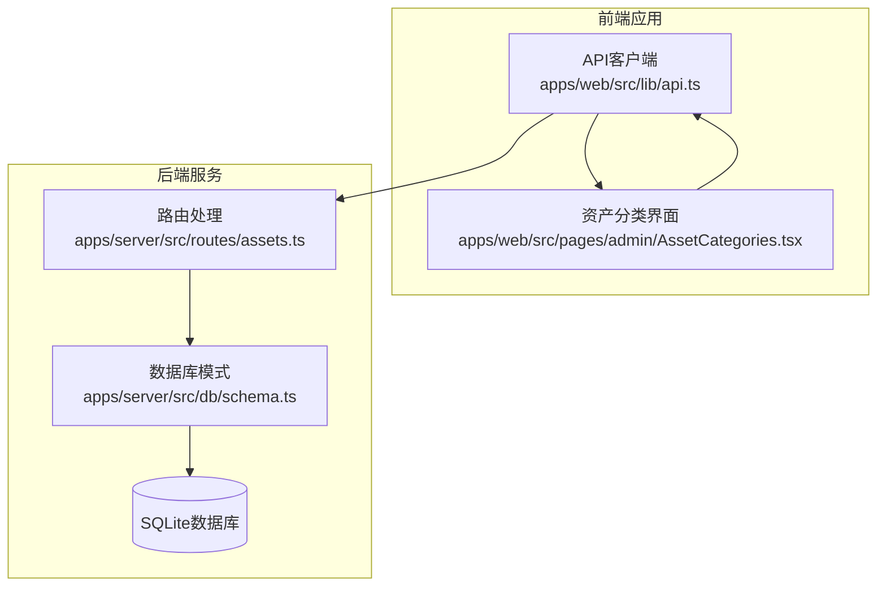
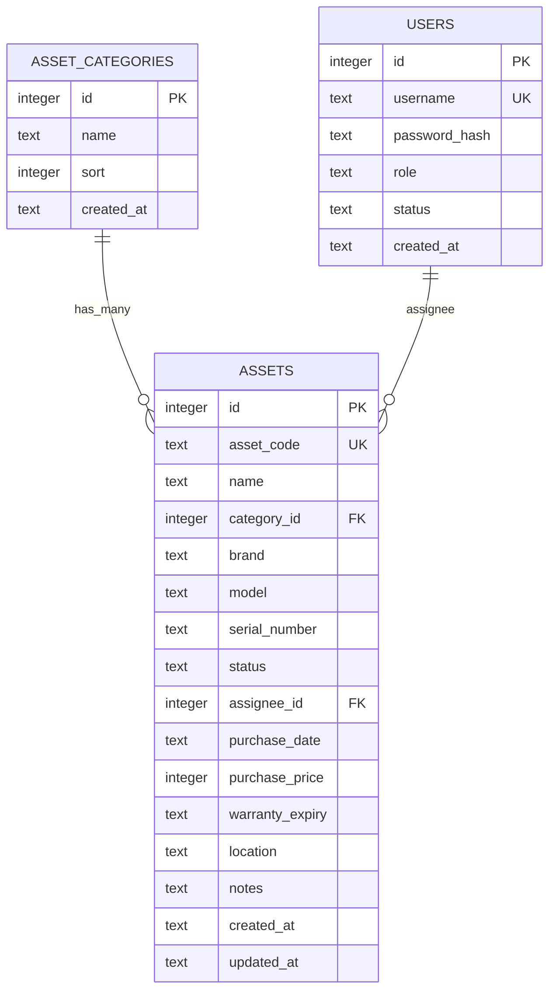
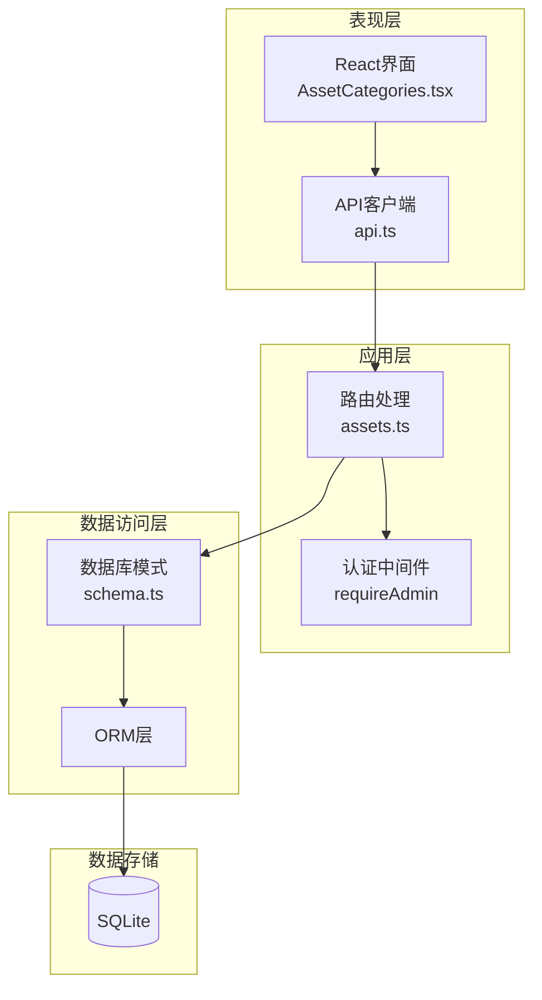
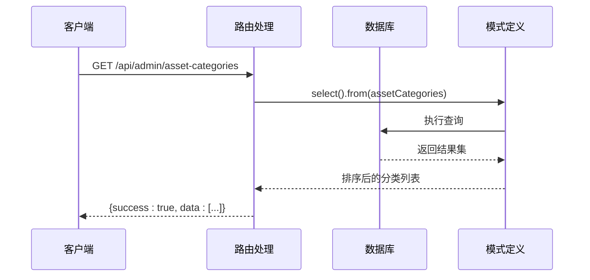
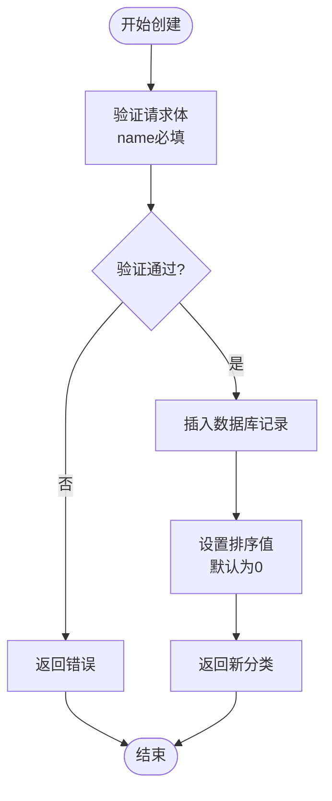
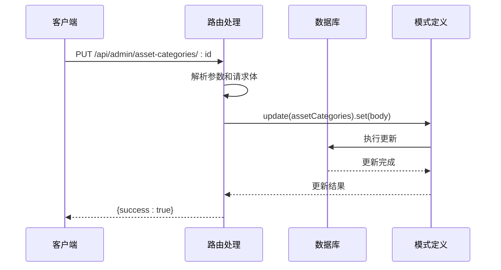
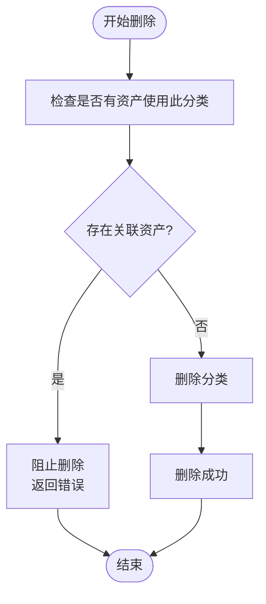
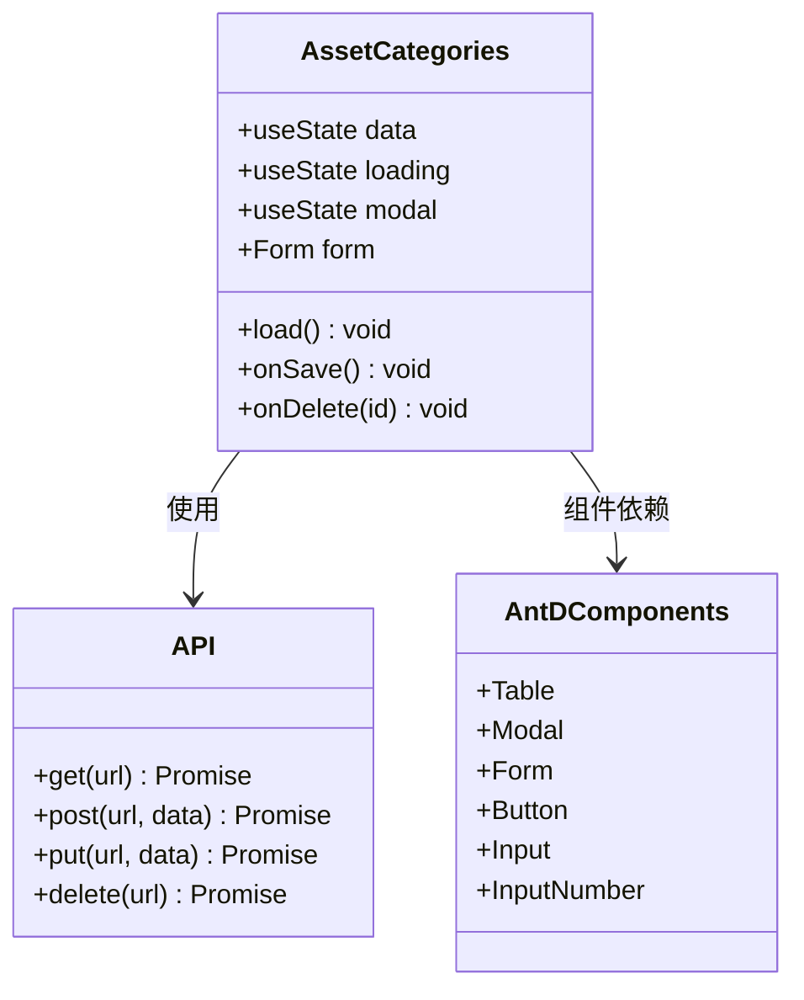
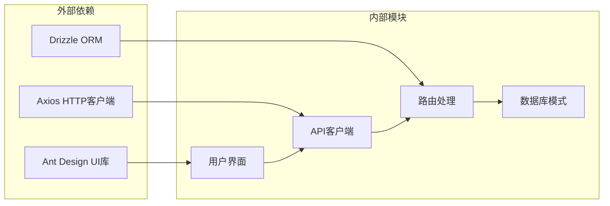
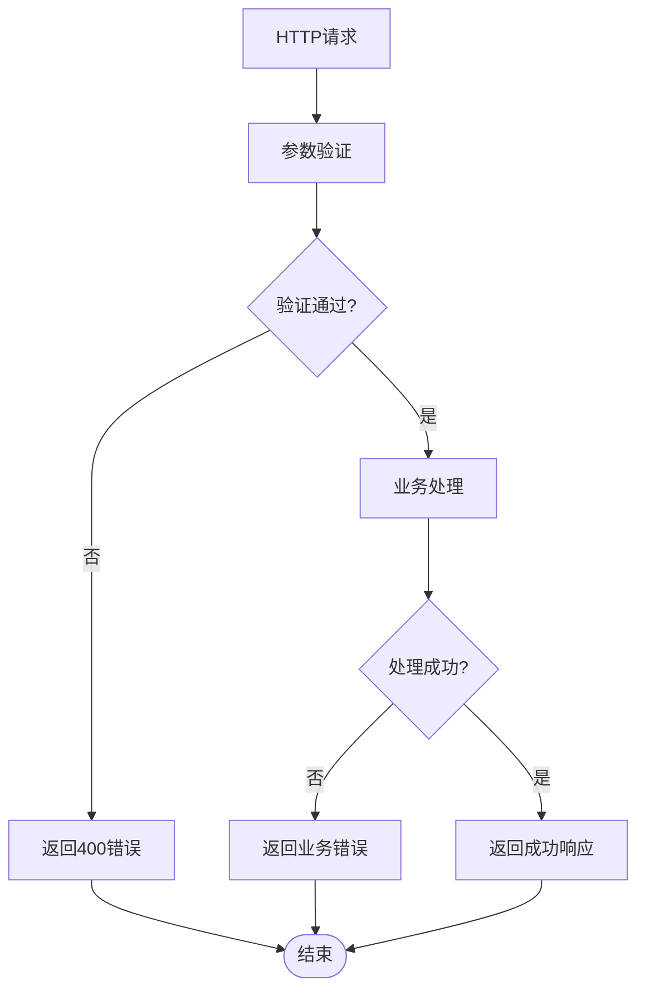

# 资产分类API

<cite>
**本文档引用的文件**
- [assets.ts](file://apps/server/src/routes/assets.ts)
- [schema.ts](file://apps/server/src/db/schema.ts)
- [AssetCategories.tsx](file://apps/web/src/pages/admin/AssetCategories.tsx)
- [api.ts](file://apps/web/src/lib/api.ts)
- [0001_zippy_shadowcat.sql](file://apps/server/drizzle/0001_zippy_shadowcat.sql)
- [0002_special_medusa.sql](file://apps/server/drizzle/0002_special_medusa.sql)
</cite>

## 目录
1. [简介](#简介)
2. [项目结构](#项目结构)
3. [核心组件](#核心组件)
4. [架构概览](#架构概览)
5. [详细组件分析](#详细组件分析)
6. [依赖关系分析](#依赖关系分析)
7. [性能考虑](#性能考虑)
8. [故障排除指南](#故障排除指南)
9. [结论](#结论)

## 简介

ZBH2平台的资产分类API是数字资产管理模块的核心组件，负责管理资产的分类体系。该API提供了完整的CRUD（创建、读取、更新、删除）操作，支持分类的层级结构维护和排序机制。通过RESTful接口，管理员可以对资产分类进行管理，同时前端界面提供了直观的操作体验。

## 项目结构

资产分类功能分布在前后端两个主要部分：

**图表来源**
- [assets.ts:1-165](file://apps/server/src/routes/assets.ts#L1-L165)
- [schema.ts:121-146](file://apps/server/src/db/schema.ts#L121-L146)
- [api.ts:1-16](file://apps/web/src/lib/api.ts#L1-L16)

**章节来源**
- [assets.ts:1-165](file://apps/server/src/routes/assets.ts#L1-L165)
- [schema.ts:121-146](file://apps/server/src/db/schema.ts#L121-L146)
- [AssetCategories.tsx:1-63](file://apps/web/src/pages/admin/AssetCategories.tsx#L1-L63)

## 核心组件

### 数据模型

资产分类采用简单的三层结构设计：

**图表来源**
- [schema.ts:121-146](file://apps/server/src/db/schema.ts#L121-L146)

### 接口定义

资产分类API提供以下RESTful接口：

| 方法 | 路径 | 描述 | 请求体 | 响应 |
|------|------|------|--------|------|
| GET | `/api/admin/asset-categories` | 获取所有分类列表 | 无 | 分类数组 |
| POST | `/api/admin/asset-categories` | 创建新分类 | `{name, sort}` | 新分类对象 |
| PUT | `/api/admin/asset-categories/:id` | 更新分类信息 | `{name?, sort?}` | 成功状态 |
| DELETE | `/api/admin/asset-categories/:id` | 删除分类 | 无 | 成功状态 |

**章节来源**
- [assets.ts:10-28](file://apps/server/src/routes/assets.ts#L10-L28)
- [schema.ts:121-127](file://apps/server/src/db/schema.ts#L121-L127)

## 架构概览

资产分类系统的整体架构采用分层设计：

**图表来源**
- [assets.ts:1-165](file://apps/server/src/routes/assets.ts#L1-L165)
- [schema.ts:121-146](file://apps/server/src/db/schema.ts#L121-L146)
- [api.ts:1-16](file://apps/web/src/lib/api.ts#L1-L16)

## 详细组件分析

### 后端路由实现

#### 分类列表获取

**图表来源**
- [assets.ts:10-12](file://apps/server/src/routes/assets.ts#L10-L12)

#### 分类创建流程

**图表来源**
- [assets.ts:13-17](file://apps/server/src/routes/assets.ts#L13-L17)

#### 分类更新机制

**图表来源**
- [assets.ts:18-23](file://apps/server/src/routes/assets.ts#L18-L23)

#### 分类删除处理

**图表来源**
- [assets.ts:24-27](file://apps/server/src/routes/assets.ts#L24-L27)

### 前端界面实现

#### 界面组件结构

**图表来源**
- [AssetCategories.tsx:1-63](file://apps/web/src/pages/admin/AssetCategories.tsx#L1-L63)
- [api.ts:1-16](file://apps/web/src/lib/api.ts#L1-L16)

**章节来源**
- [AssetCategories.tsx:1-63](file://apps/web/src/pages/admin/AssetCategories.tsx#L1-L63)
- [api.ts:1-16](file://apps/web/src/lib/api.ts#L1-L16)

### 数据库设计

#### 表结构定义
资产分类表采用标准的关系型设计：

| 字段名 | 类型 | 约束 | 描述 |
|--------|------|------|------|
| id | INTEGER | PRIMARY KEY, AUTOINCREMENT | 分类唯一标识符 |
| name | TEXT | NOT NULL | 分类名称 |
| sort | INTEGER | NOT NULL, DEFAULT 0 | 排序权重 |
| created_at | TEXT | NOT NULL | 创建时间戳 |

#### 外键关系
资产表通过外键关联到资产分类表：
- `assets.category_id` → `asset_categories.id`
- 删除策略：NO ACTION（级联删除不适用）

**章节来源**
- [schema.ts:121-127](file://apps/server/src/db/schema.ts#L121-L127)
- [schema.ts:129-146](file://apps/server/src/db/schema.ts#L129-L146)
- [0001_zippy_shadowcat.sql:17-22](file://apps/server/drizzle/0001_zippy_shadowcat.sql#L17-L22)

## 依赖关系分析

### 组件耦合度

**图表来源**
- [api.ts:1-16](file://apps/web/src/lib/api.ts#L1-L16)
- [assets.ts:1-165](file://apps/server/src/routes/assets.ts#L1-L165)
- [schema.ts:121-146](file://apps/server/src/db/schema.ts#L121-L146)

### 错误处理机制

系统采用统一的错误处理策略：

**图表来源**
- [assets.ts:73-100](file://apps/server/src/routes/assets.ts#L73-L100)

**章节来源**
- [assets.ts:1-165](file://apps/server/src/routes/assets.ts#L1-L165)

## 性能考虑

### 查询优化
- 分类列表按排序字段升序排列，确保稳定的显示顺序
- 使用索引优化常用查询条件
- 避免N+1查询问题，一次性加载所需数据

### 缓存策略
- 前端缓存分类列表，减少重复请求
- 合理的缓存失效策略，确保数据一致性

### 并发控制
- 数据库事务保证操作的原子性
- 防止并发修改导致的数据不一致

## 故障排除指南

### 常见问题及解决方案

#### 1. 认证失败
**症状**：返回401未授权错误  
**原因**：用户未登录或会话过期  
**解决**：重新登录系统

#### 2. 数据库连接问题
**症状**：操作超时或连接失败  
**原因**：数据库服务不可用  
**解决**：检查数据库服务状态

#### 3. 数据完整性约束
**症状**：插入或更新操作失败  
**原因**：违反数据库约束  
**解决**：检查数据格式和约束条件

#### 4. 前端UI问题
**症状**：界面显示异常或操作无响应  
**原因**：网络请求失败或JavaScript错误  
**解决**：刷新页面或检查浏览器控制台

**章节来源**
- [assets.ts:73-100](file://apps/server/src/routes/assets.ts#L73-L100)

## 结论

ZBH2平台的资产分类API设计简洁而功能完整，采用了标准的RESTful架构模式。系统通过清晰的分层设计实现了良好的可维护性和扩展性。主要特点包括：

1. **简单易用**：API接口设计直观，符合RESTful规范
2. **数据完整性**：通过外键约束保证数据一致性
3. **排序机制**：支持灵活的分类排序和层级管理
4. **前端友好**：提供直观的用户界面和操作体验
5. **安全可靠**：具备完善的认证和授权机制

该API为数字资产管理提供了坚实的基础，能够满足大多数企业资产管理的需求，并为未来的功能扩展预留了充足的空间。